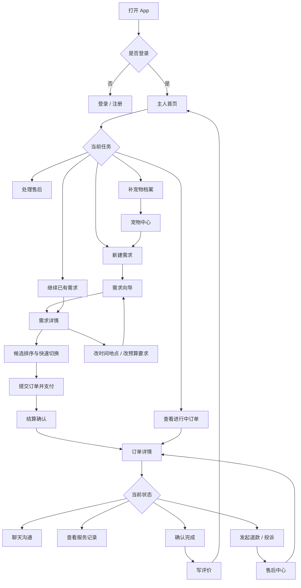
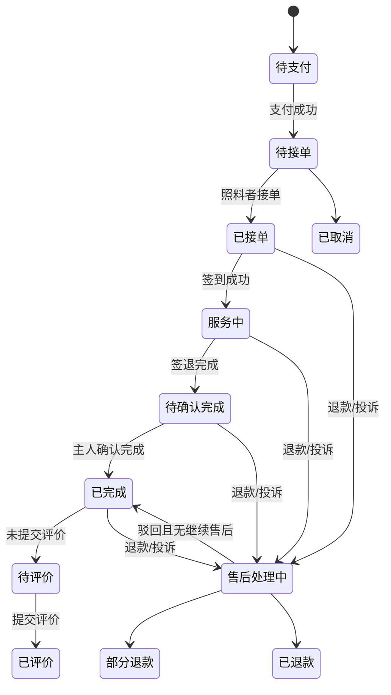
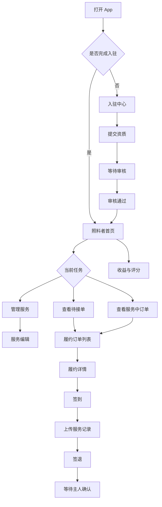
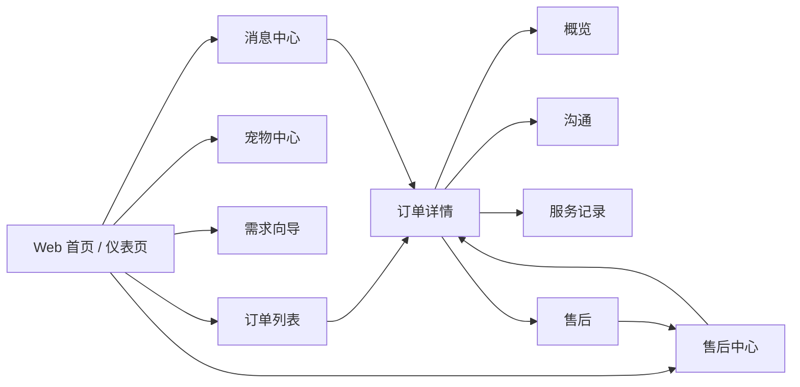
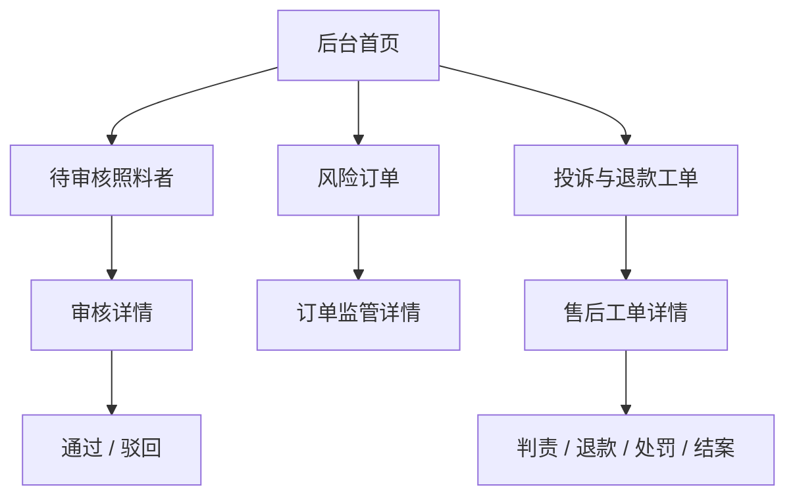
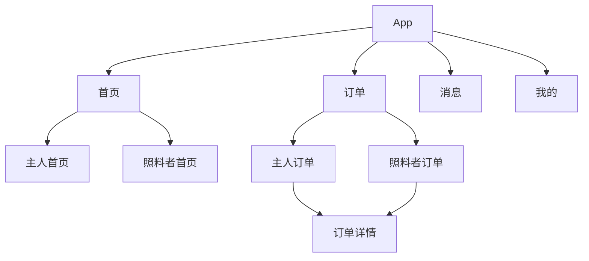
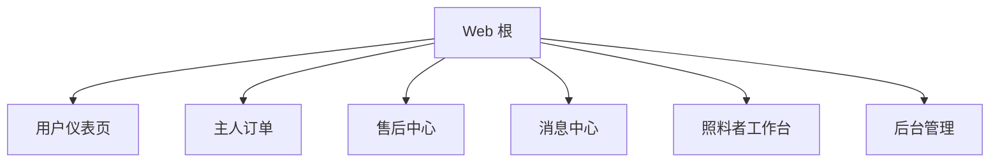

## 1. 设计目标

这份文档先于页面编码。

所有 PetPal 前端页面必须先满足以下原则，再允许进入实现：

- 页面先服务用户任务，不服务产品说明、开发说明、架构说明。
- 第一屏必须回答 4 个问题：
  - 我现在在处理什么
  - 当前状态是什么
  - 下一步该做什么
  - 风险或金额在哪里看
- App 不是迷你网站，优先触屏操作、底部动作、分段切换、就地展开、底部弹层。
- Web 不是 PPT 页面，优先高密度业务操作、表格、分栏、内联动作、状态清晰。
- 订单、支付、履约、售后、评价必须是一条连续交易链路，不能散落成“读说明后跳转”。

## 2. 总体 UX 规则

### 2.1 必须移除的内容

- 任何“PetPal 已经拆成主人流和治理流”这类给开发者或产品经理看的文案。
- 任何“当前页面用于承接 xxx 能力”这类元叙事文案。
- 大段操作说明、产品介绍、路线解释。
- 一屏多个大卡片，各自只负责跳转。

### 2.2 必须增加的内容

- 明确的状态块：待支付、待接单、服务中、待确认、待退款、投诉处理中、待评价。
- 明确的动作块：支付、联系、确认完成、补充说明、发起投诉、写评价。
- 明确的金额块：订单总额、已支付、待支付、已退款、可退余额。
- 明确的时间块：预约时间、最近更新、最近消息、最近售后进度。

### 2.3 App 交互约束

- 顶部只保留页面标题、返回、必要的次级入口。
- 高频切换用 `Segmented / Chips / Tabs`，不用长文案解释。
- 高风险动作固定在底部动作条或明显按钮区。
- 长表单拆分为步骤页或底部弹层，不允许一屏塞满。
- 消息、支付、评价、投诉都必须支持“先看状态，再立即动作”。

### 2.4 Web 交互约束

- 首屏优先显示筛选、状态、待办、列表，不先显示介绍。
- 订单详情采用双栏或分区结构，左侧看上下文，右侧做动作。
- 售后页面优先展示待处理队列，不先展示概念说明。
- 仪表页允许摘要，但摘要必须可直接驱动操作。

## 3. 角色与核心任务

### 3.1 主人

- 建立宠物档案
- 发起照料需求
- 选择照料者并支付
- 跟进服务过程
- 确认完成
- 评价
- 退款 / 投诉 / 售后

### 3.2 照料者

- 完成入驻与审核
- 配置服务
- 接单
- 签到
- 上传服务记录
- 签退
- 查看收入与评分

### 3.3 管理后台

- 审核照料者
- 处理投诉与退款
- 查看订单风险
- 发布规则与处罚

## 4. Mermaid 用户流

### 4.1 主人 App 主流程

### 4.2 主人交易与售后状态流

### 4.3 照料者 App 主流程

### 4.4 Web 用户工作流

### 4.5 Web 管理后台工作流

## 5. 用户场景拆解

### 5.1 主人首次下单

1. 登录后进入主人首页。
2. 如果没有宠物档案，首页只强调“先建档”。
3. 建档完成后直接进入需求向导。
4. 提交需求后看到匹配结果和报价。
5. 发布成功后进入需求详情页，在同页完成候选排序、快速切换和条件微调。
6. 选定照料者后进入确认与支付。
7. 若中途离开，必须能从“活跃需求”直接恢复到需求详情，而不是回到新建页。
8. 支付成功后默认进入订单详情概览。

页面要求：

- 首页只允许一个主按钮优先级最高。
- 不允许首页同时出现一堆角色解释。
- 支付前必须清楚展示金额、时间、宠物、服务。
- 需求详情必须支持就地排序候选、快速切换照料者和按步骤改时间 / 预算。

### 5.2 主人处理中订单

1. 从首页或订单页看到“进行中订单”。
2. 打开订单详情。
3. 默认看到状态、时间、金额、最近服务记录。
4. 用户根据当前状态执行：
   - 去聊天
   - 看服务记录
   - 确认完成
   - 发起售后

页面要求：

- 第一屏必须直接看到订单状态和主动作。
- 不允许用户先阅读解释文案才能知道去哪。

### 5.3 主人处理售后

1. 从首页、订单列表或订单详情进入售后中心。
2. 售后中心先显示“优先处理队列”。
3. 用户打开具体订单的售后分栏。
4. 查看退款进度、投诉进度、证据、沟通。
5. 决定继续补充说明、等待、或联系平台。

页面要求：

- 售后中心首页不讲概念，只讲待处理事项。
- 每张售后卡片必须回答“为什么要先处理这单”。

### 5.4 主人提交评价

1. 订单完成后进入待评价状态。
2. 在订单概览首屏看到“写评价”。
3. 点击后在底部弹层或独立页完成评分、标签、文字评价。
4. 提交成功后回到订单概览，评价结果可回看。

页面要求：

- 不把评价表单塞进说明区域。
- 不让用户在长详情页里找评价入口。

### 5.5 照料者履约

1. 从首页或订单列表看到待接单 / 服务中。
2. 打开履约详情。
3. 第一屏看到订单信息、宠物信息、当前动作。
4. 依次执行：
   - 接单
   - 签到
   - 上传服务记录
   - 签退
5. 完成后回到列表或下一个待办。

页面要求：

- 关键动作必须顺序明确。
- 服务日志上传必须就地可见，不跳很多层。

## 6. 页面架构

### 6.1 App 一级架构

### 6.2 Web 一级架构

## 7. App 页面设计蓝图

### 7.1 角色入口页

| 页面 | 目标 | 第一屏必须有 | 主操作 | 禁止出现 |
| --- | --- | --- | --- | --- |
| `petpal/index` | 选择当前身份并进入任务 | 身份切换、未完成事项、最近订单入口 | 进入主人首页 / 照料者首页 | 身份流介绍、开发说明、四宫格说明卡 |

设计：

- 采用顶部身份切换 + 中部未完成事项 + 底部快速入口。
- 不再出现“主人任务流是什么”“照料者任务流是什么”。

### 7.2 主人首页

| 第一屏结构 | 说明 |
| --- | --- |
| 顶部状态条 | 当前身份、消息、提醒 |
| 今日主任务 | 只显示一个最重要动作 |
| 订单摘要条 | 进行中、待确认、售后中 |
| 快捷入口 | 新建需求、宠物、售后、消息 |
| 最近订单横向区 | 可左右滑动，支持直接进详情 |

必须支持的状态：

- 无宠物档案
- 有已匹配但未完成下单的需求
- 有待支付订单
- 有进行中订单
- 有待确认完成订单
- 有待评价订单
- 有售后订单

### 7.3 主人订单列表

| 页面目标 | 快速筛选交易状态并进入订单详情 |
| --- | --- |

第一屏设计：

- 顶部状态筛选：待支付 / 进行中 / 待确认 / 待评价 / 售后 / 全部
- 第二行显示订单数量和总金额摘要
- 下面直接进入订单列表

每张订单卡必须包含：

- 订单号
- 服务类型
- 服务时间
- 当前状态
- 金额摘要
- 最近沟通或最近服务记录
- 主动作按钮

主动作规则：

- 待支付：支付
- 进行中：查看服务
- 待确认：确认完成
- 待评价：写评价
- 售后：处理售后

### 7.4 订单详情

| 分栏 | 目标 |
| --- | --- |
| 概览 | 看订单、金额、状态、主动作 |
| 沟通 | 看消息、发消息、看附件 |
| 履约 | 看签到、日志、媒体 |
| 售后 | 看退款、投诉、证据、处理轨迹 |

第一屏必须有：

- 状态 Tag
- 服务时间
- 金额摘要
- 下一步动作条
- 分段切换

主动作栏规则：

- 待支付：支付
- 服务中：联系 / 看服务记录
- 待确认：确认完成
- 已完成未评价：写评价
- 售后中：继续处理售后

### 7.5 售后中心

| 页面目标 | 把所有售后事项按优先级集中处理 |
| --- | --- |

第一屏设计：

- 优先处理队列
- 售后统计
- 筛选条：全部 / 退款中 / 投诉中 / 已结案
- 售后列表

每张售后卡必须包含：

- 订单号
- 售后原因
- 当前进度
- 金额变化
- 最近更新时间
- 主动作

### 7.6 评价页 / 评价弹层

| 页面目标 | 30 秒内完成评价 |
| --- | --- |

组成：

- 星级评分
- 常用标签
- 文字补充
- 匿名开关
- 提交按钮

禁止：

- 大段评价说明
- 解释评价系统如何影响算法

### 7.7 照料者首页

第一屏必须有：

- 审核状态
- 今日待办
- 待接单数量
- 服务中数量
- 快速去接单 / 去履约 / 去上传记录

### 7.8 履约详情

第一屏必须有：

- 当前阶段：未接单 / 待签到 / 服务中 / 待签退
- 订单与宠物摘要
- 单个主动作按钮
- 最近一条服务记录

## 8. Web 页面设计蓝图

### 8.1 Web 主人工作台

| 页面 | 目标 | 第一屏必须有 |
| --- | --- | --- |
| 用户仪表页 | 聚合当前待办 | 进行中订单、售后中订单、待评价订单、快捷按钮 |
| 订单列表 | 高密度处理 | 筛选器、摘要、列表 |
| 订单详情 | 上下文 + 动作 | 左侧上下文，右侧动作 |
| 售后中心 | 队列处理 | 优先级、退款、投诉、动作 |

禁止：

- “主人流已经拆开”这类文案
- 过大的说明区
- 每块都靠大卡片跳转

### 8.2 Web 照料者工作台

第一屏必须有：

- 审核状态
- 待接单队列
- 服务中队列
- 今日收益
- 最近差评 / 投诉风险

### 8.3 Web 管理后台

根路由直达后台工作区，不放在普通菜单深处。

后台首页必须有：

- 待审核照料者
- 待处理投诉 / 退款
- 风险订单
- 今日处理量

## 9. 页面组件策略

### 9.1 App 允许使用

- 顶部吸附状态条
- Segmented / Chips
- 水平滑动订单卡
- 底部动作条
- Bottom Sheet
- Stepper
- FAB
- Snackbar
- 内联错误提示

### 9.2 App 禁止滥用

- 说明性大卡片
- 需要多次点击才能触达主动作的跳转盒子
- 一屏内出现多个等权大区块
- 把说明写在页面最显眼位置

### 9.3 Web 允许使用

- 工具条
- 双栏
- 表格
- 内联编辑
- 抽屉
- 侧边详情
- 批量动作条

## 10. 本轮编码顺序

### P1

- App 角色入口页
- App 主人首页
- App 主人订单列表
- App 订单详情
- App 售后中心

### P2

- App 照料者首页
- App 履约订单与履约详情
- App 评价与投诉提交流程

### P3

- Web 主人工作台首屏
- Web 照料者工作台首屏
- Web 订单详情首屏
- Web 售后中心首屏

### P4

- 消息中心
- 提醒中心
- 我的 / 设置 / 帮助

## 11. 编码前检查清单

每个页面开工前都必须先写在页面文件头部：

- 目标用户是谁
- 用户进入页面时最常见的触发场景是什么
- 第一屏要解决什么问题
- 主动作是什么
- 次动作是什么
- 失败 / 空态 / 加载态是什么

如果写不出来，不允许开始编码。

## 12. 当前代码必须被替换的方向

- `app` 端现有大量说明性 `description` 文案要移除。
- `web` 端现有 hero 区域要改成状态 + 动作工具条。
- 订单链路统一改成“状态驱动动作”，不再是“说明驱动跳转”。
- 售后页统一改成“优先级队列”，不再是“售后说明页”。
- 评价入口统一改成明确 CTA，不再隐藏在超长详情逻辑里。
