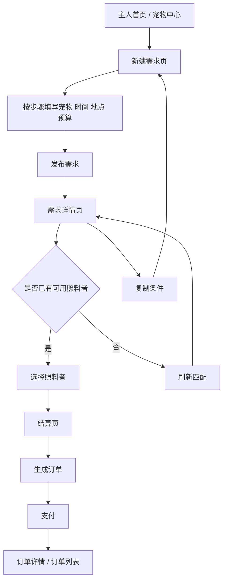
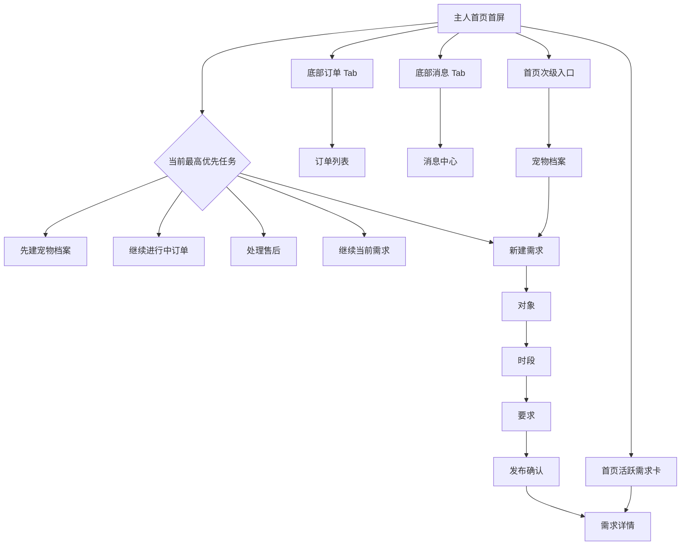

> 编码前强制约束：先阅读并遵循 [PetPal 前端重构蓝图](./PetPal-Frontend-Blueprint.md)。该蓝图冻结了用户流、页面职责、首屏结构与交互禁区，后续页面重构以它为唯一前置依据。

## 1. 重构目标

本方案作为 PetPal 当前最高优先级的前端体验重构文档执行，不再使用日期排期，而是严格按优先级推进。

核心目标：

- 优先重构 App 端用户操作逻辑页面，使其从“单页堆功能”转为“按角色、场景、任务拆分的真实业务应用”。
- 同步重构 Web 前台用户操作逻辑页面，避免 `PetPalOwnerView` 一类超级页面继续承载过多职责。
- App 端统一采用 **Material Design 3** 设计方向，强调物理隐喻、层级、阴影、动效、状态反馈和响应式适配。
- 所有 UX 设计以“让用户低负担完成核心任务”为标准，而不是以“把所有功能塞进一个页面”为标准。

## 2. UX 总原则

### 2.1 页面拆分原则

- 一个页面只承载一个主目标，不把主人、照料者、售后、消息和账户设置全部塞进一个入口页。
- 角色维度优先拆分：主人、照料者、管理员的页面路径、导航和任务入口必须清晰区分。
- 场景维度继续拆分：浏览、编辑、确认、沟通、售后、审核不共用一张大页面。
- 长流程优先使用分步式或阶段式交互，不要求用户在一个表单里一次性完成所有输入。
- 高风险动作必须有明确确认、结果反馈和撤销/补救路径。

### 2.2 交互合理性原则

- 首屏必须突出当前最重要的一个动作，而不是平铺所有功能入口。
- 列表页负责筛选和进入详情，详情页负责理解上下文，动作页负责执行任务。
- 所有关键页面都必须设计加载态、空态、错误态、禁用态、弱网态和提交成功态。
- 动效必须服务于理解路径和注意力引导，不能为了“好看”增加操作成本。
- 手指可达性优先于视觉填满，移动端关键主按钮和高频入口需处于易点击区域。

## 3. App 设计系统方向（Material Design 3）

### 3.1 视觉语言

- 采用 Material Design 3 的 **surface + elevation** 体系，使用卡片、底部弹层、顶栏和导航栏表达层级。
- 使用明显但克制的阴影和色面，不做过度拟物，但保留“纸张叠放”和“内容浮起”的物理隐喻。
- 主内容容器优先使用圆角卡片、分层面板和标准间距系统，避免无结构长页面。
- 色彩采用高可读度的品牌色体系，主色、辅助色、成功、警告、错误和中性色需要形成完整 token。
- Web 与 App 保持同一品牌体系，但 Web 保持更高信息密度，App 保持更强触控和卡片层次。

### 3.2 动效规范

- 页面主导航切换使用 Shared Axis X 或 Fade Through，体现“进入/返回”的方向感。
- 底部弹层、抽屉和表单确认使用 Shared Axis Y，体现“抬起/压下”的层级关系。
- 卡片进入详情使用 Container Transform 或同类过渡，帮助用户理解“从列表到详情”的来源。
- 建议时长：
  - 微交互：120ms 至 180ms
  - 页面切换：220ms 至 320ms
  - 大面板进入：280ms 至 360ms
- 动效不能阻塞主任务；弱性能设备应允许降级为更轻量的透明度与位移过渡。

### 3.3 组件级设计要求

- 主导航：底部 `Navigation Bar`
- 次级切换：`Segmented Buttons` 或 `Tabs`
- 主动作：`FAB`、底部吸附按钮或页面主按钮
- 辅助操作：文本按钮、图标按钮、上下文菜单
- 表单承载：卡片分组、分步表单、底部操作条
- 状态反馈：`Snackbar`、内联错误、结果页、上传进度
- 选择器：底部抽屉、日期选择器、标签 Chip、筛选面板

### 3.4 响应式适配

- 手机竖屏为第一目标，设计基准宽度以 360-412dp 为主。
- 大屏手机和小平板需自动提升边距、卡片宽度和栅格列数。
- Web 端在桌面下使用双栏或三栏布局，在 768px 以下收敛为单栏卡片流。
- 关键 CTA 不得因屏幕高度变化被折叠到不可见区域。

## 4. App 信息架构重构

### 4.1 全局导航壳层

建议 App 底部一级导航固定为：

1. 首页
2. 订单
3. 消息
4. 我的

全局规则：

- 主人端一级导航固定为 `首页 / 订单 / 消息 / 我的`，不再把首页内部做成伪多场景切换。
- 角色切换不挤占底栏，也不放在首页首屏作为主动作，而是通过角色中枢与次级入口承载。
- 通知、扫码、帮助等次级能力通过顶栏动作和二级页承载。
- 用户从任意订单相关页面返回时，应回到其来源列表，而不是强行回到单一工作台首页。

### 4.2 主人端页面拆分

建议拆分为以下页面：

- 主人首页
  - 今日订单、待处理售后、宠物提醒、快捷发需求
- 宠物中心
  - 宠物列表
  - 宠物详情
  - 健康档案
  - 编辑宠物
- 需求发布
  - 分步式下单向导：基础需求 -> 时间地点 -> 特殊要求 -> 确认提交
- 匹配结果
  - 照料者列表、筛选、排序、服务详情
- 主人订单列表
  - 待接单、进行中、已完成、售后中
- 订单详情
  - 概览页
  - 沟通页
  - 服务记录页
  - 售后页
- 评价页
- 投诉页
- 退款/售后进度页

### 4.3 照料者端页面拆分

建议拆分为以下页面：

- 照料者首页
  - 今日待办、待接单、服务中订单、审核状态、收入摘要
- 入驻中心
  - 基础资料
  - 资质材料
  - 审核结果
- 服务管理
  - 服务列表
  - 服务编辑页
  - 可服务时段与范围配置
- 照料订单列表
  - 待接单
  - 已接单
  - 服务中
  - 已完成
- 履约详情页
  - 到达签到
  - 服务日志
  - 图片/视频回传
  - 异常上报
  - 签退完成
- 收益中心
  - 收入概览
  - 订单收益明细
  - 结算状态
- 服务质量页
  - 评分、投诉、复购与整改提醒

### 4.4 共享页面

- 登录 / 注册 / 忘记密码
- 实名认证
- 消息中心
- 订单聊天页
- 系统通知
- 个人资料
- 设置
- 帮助与客服

## 5. Web 前台页面重构

Web 前台不再继续把主人端全部逻辑堆在一个超级页面里。建议按路由拆成以下结构：

- `/petpal/home`
  - 用户首页与当前工作摘要
- `/petpal/pets`
  - 宠物档案列表与入口
- `/petpal/pets/:id`
  - 宠物详情与健康档案
- `/petpal/requests/new`
  - 新建需求向导
- `/petpal/matches`
  - 匹配结果与筛选
- `/petpal/orders`
  - 主人订单列表
- `/petpal/orders/:id/overview`
  - 订单概览
- `/petpal/orders/:id/chat`
  - 订单沟通
- `/petpal/orders/:id/service`
  - 服务记录
- `/petpal/orders/:id/aftersales`
  - 退款、评价、投诉与处理进度
- `/petpal/messages`
  - 跨订单消息聚合页
- `/petpal/caregiver/home`
  - 照料者工作台首页
- `/petpal/caregiver/services`
  - 服务设置与管理
- `/petpal/caregiver/orders`
  - 照料者订单列表
- `/petpal/account`
  - 资料、认证、设置

Web 端仍允许在桌面上使用双栏和更高信息密度，但必须遵循与 App 一致的任务边界，不再让 `PetPalOwnerView.vue` 或同类页面承担完整业务树。

## 6. 关键交互规则

### 6.1 表单与向导

- 长表单拆为分步式，不在一个页面同时要求用户输入宠物、需求、时间、支付和备注。
- 每一步只保留一个主 CTA。
- 保存草稿、返回上一步和取消都必须明确。

### 6.2 列表与详情

- 列表页负责筛选、排序、搜索、摘要卡片和进入详情。
- 详情页负责上下文和动作，不再承载大规模编辑表单。
- 订单详情必须拆成概览、沟通、服务记录、售后四个子视图。

### 6.3 沟通与附件

- 消息输入区固定在底部安全区域附近，输入、附件、发送动作在单手区域内完成。
- 图片、视频、文档上传必须展示进度、失败原因、重试入口和发送成功状态。
- 未读消息要在列表、详情和通知中心三处统一反馈，但不可重复轰炸。

### 6.4 风险动作

- 取消订单、确认完成、发起投诉、驳回审核、处罚等高风险动作必须二次确认。
- 退款、投诉、处罚等涉及状态回滚困难的操作必须展示结果说明页或结果弹层。

## 7. 当前优先重构目标文件

App：

- `apps/app-frontend/src/pages/petpal/index.vue`
  - 拆为首页、工作台、订单列表等多个页面，不再承担全部角色逻辑。
- `apps/app-frontend/src/pages/order-detail/index.vue`
  - 拆为概览 / 沟通 / 服务记录 / 售后等子视图或子路由。
- `apps/app-frontend/src/pages/me/*.vue`
  - 继续从账户信息页重构为资料、设置、帮助等明确页面。

Web：

- `apps/web-frontend/src/pages/frontend/petpal/PetPalOwnerView.vue`
  - 拆为主人首页、宠物中心、需求向导、订单列表、消息中心等路由页面。
- `apps/web-frontend/src/pages/frontend/petpal/OrderDetailView.vue`
  - 强化子视图切分，避免继续增长为超长详情页。

## 8. 实施优先级计划

| 优先级 | 主题 | 目标 | 输出 | 执行说明 |
| --- | --- | --- | --- | --- |
| P1 | App 信息架构冻结与主人主流程重构 | 完成底部导航、主人首页、宠物中心、需求向导、主人订单列表与订单详情拆分 | 新页面、导航、交互基线 | 未来一天冲刺时必须先做完这一层 |
| P2 | App 照料者 / 履约 / 消息 / 售后 / 账户收口 | 完成照料者首页、入驻中心、服务管理、履约详情、消息中心、售后页、资料设置页 | App 子页面、状态反馈、动效规则 | P1 未完成前不得展开 |
| P3 | Web 前台路由拆分 | 将主人 / 照料者前台从超级页面拆为多页面结构 | 新路由、新页面、兼容跳转 | 新功能只允许落在拆分后的页面结构上 |
| P4 | 多端体验修复与剩余业务缺口补完 | 修复状态反馈、回退路径、空态错误态，并补齐健康域、收益分析、主动提醒等剩余能力 | 修复清单、补完页面、交互统一 | 在 P1-P3 完成后推进 |
| P5 | 审计、测试与答辩材料 | 集中补齐测试、截图、演示脚本、论文插图和风险清单 | 测试报告、素材、文档 | 项目进入最终验收前统一收口 |

执行规则：

- 严格按 `P1 -> P2 -> P3 -> P4 -> P5` 顺序推进。
- 如果未来一天内集中开发，至少完成 `P1`，再决定是否进入 `P2`。

## 9. 验收标准

- App 不再存在承载主人、照料者、售后、消息和设置全部逻辑的单一超级页面。
- 主人、照料者两条主流程都可在 App 中独立完成，不依赖 Web 补操作。
- App 核心页面全部采用统一的 Material 设计 token、层级、按钮、动效和状态反馈。
- Web 前台的路由和页面职责清晰，用户可以在首页、订单、消息、售后之间自然切换。
- 所有关键流程都具备空态、错误态、弱网态、成功态和可恢复路径。

### 9.1 主人需求推进流

当前强制分界：

- `pages/petpal/request.vue` 只负责创建新需求，不负责长期跟进。
- `pages/petpal/request-detail.vue` 只负责状态查看、匹配选择和继续下单。
- `pages/petpal/checkout.vue` 只负责确认金额、生成订单和支付，不再承接需求编辑。
- `pages/petpal/payment-result.vue` 只负责支付结果和下一步动作，不再把成功态继续堆在结算页里。
- `pages/petpal/review-result.vue` 只负责评价结果和下一步动作，不再把已评价回看继续塞回评价表单里。

## 10. 当前落地进度（2026-04-02）

### 10.1 已完成

- App 端 `pages/petpal/index.vue` 已从旧综合工作台切为角色入口页。
- App 端主题变量、层级阴影、形状系统、动效时长和页面宽度基线已统一为 Material Design 3 token。
- App 端通用组件已完成第一轮 Material 3 风格统一：
  - `app-button`
  - `app-card`
  - `app-choice-chips`
  - `app-list`
  - `app-list-item`
  - `app-nav-bar`
- App 端已新增主人主流程页面：
  - `pages/petpal/owner-home.vue`
  - `pages/petpal/pets.vue`
  - `pages/petpal/request.vue`
  - `pages/petpal/orders.vue`
- `pages/petpal/request.vue` 已继续收回为真正的新建需求向导，按“宠物 / 时间 / 要求 / 确认”推进，不再承担活跃需求恢复、匹配跟进和继续支付等长期管理逻辑。
- App 端已新增 `pages/petpal/request-detail.vue`，独立承接活跃需求的状态查看、匹配选择、复制条件和继续结算动作。
- `pages/petpal/request-detail.vue` 已继续补入匹配排序、候选快速切换和“改时间地点 / 改预算要求”直达动作，不再只靠一组静态候选卡片。
- `pages/petpal/request-detail.vue` 已继续补入基础筛选与横向候选对比，用户可直接按预算内 / 更近 / 更稳筛候选，并就地比较预估金额、评分和距离。
- `pages/petpal/request-detail.vue` 已继续补入照料者可信信息快照，当前选中区与对比板可直接看到经验、提前预约时长、服务范围、专长与服务承诺。
- `pages/petpal/pets.vue` 已继续重构为“宠物切换 + 当前档案预览 + 分区编辑”结构，宠物资料不再以整页长表单直接压到首屏。
- `pages/petpal/owner-home.vue` 已继续重构为“任务首页 + tabbar 主导航”结构：
  - `owner-home` 已升为真正的 App 启动首页，一级导航由底部 `首页 / 订单 / 消息 / 我的` 承担。
  - 首页首屏只保留当前最需要处理的动作、宠物快捷入口、活跃需求和最近订单，不再做首页内场景切换。
  - 主人流顶部导航已降为二级任务快捷入口，避免与底栏一级导航重复抢焦点。
- `pages/petpal/request.vue` 已继续重构为“轻编辑器”而非长表单：
  - 已补宠物卡片选择、服务类型块、时段预设、预算快捷项、需求标签和历史需求复用轨道。
  - 需求页首屏现在直接回答“当前做哪一步、当前条件是什么、下一步去哪里”，不再堆说明文案。
  - 发布前确认区已改成摘要卡与结果预期，不再让用户先看说明再理解会发生什么。

### 8.1 主人首页与需求页最新操作流

- `pages/petpal/checkout.vue` 已继续补入照料者可信信息区，支付前可直接确认介绍、专长、服务承诺和预约限制，不再只看金额。
- `pages/petpal/payment-result.vue` 已新增独立支付结果页，把“是否到账、当前阶段、下一步做什么”从 `checkout` 中拆出。
- `pages/petpal/refund-result.vue` 已新增独立退款结果页，把“退到哪一步、已退多少、下一步怎么做”从订单详情长页里拆出。
- `pages/petpal/complaint-result.vue` 已新增独立投诉结果页，把“平台处理到哪一步、结论是什么、下一步怎么做”从投诉提交页和订单长页里拆出。
- `pages/petpal/review-result.vue` 已新增独立评价结果页，把“评分结果、订单下一步和是否还需售后/沟通”从评价页里拆出。
- `pages/order-detail/index.vue` 已继续把总览首屏收口为“阶段标签 + 快速动作 chips + 沟通 / 履约 / 售后信号卡”，支付、沟通、售后和评价入口不再埋在长详情里。
- `pages/order-review/index.vue` 与 `pages/order-complaint/index.vue` 已继续改成任务页结构：先看当前阶段，再直接评分 / 选类型 / 补描述，不再让用户先读说明文案。
- `pages/order-review/index.vue` 已进一步收回为纯填写页；如果当前订单已评价，页面会直接回流到 `pages/petpal/review-result.vue`。
- App 端 `pages/petpal/checkout.vue` 已允许只凭 `requestId` 恢复结算上下文，已匹配需求可直接再次进入结算，不再依赖首次发布成功后的单次页面状态。
- `pages/petpal/checkout.vue` 已继续收回为“确认并支付”页，主按钮现在可直接串起“创建订单并支付”，支付成功后直接跳到结果页。
- 主人首页、提醒中心、起步向导和结算页回退链路已开始统一指向 `request-detail`，活跃需求不再默认回到新建页。
- `AppChoiceChips` 已补齐可选副标题能力，需求详情页可以用 chips 完成排序和候选快速切换，而不是继续堆大卡片。
- App 端已新增照料者主流程页面：
  - `pages/petpal/caregiver-home.vue`
  - `pages/petpal/caregiver-earnings.vue`
  - `pages/petpal/caregiver-profile.vue`
  - `pages/petpal/caregiver-services.vue`
  - `pages/petpal/caregiver-orders.vue`
- App 端已继续把照料者首页、履约订单、服务管理三页切成动作优先首屏：
  - 照料者首页改为“今天先做这个 + 当前优先 + 今日订单 + 服务与收益”。
  - 履约订单页改为状态筛选 + 任务队列 + 就地服务记录。
  - 服务管理页改为就地编辑 + 快速上下架，不再依赖说明区和跳转盒子。
- 本轮重构涉及的 App 页面已统一补齐文件头部 `UX Blueprint` 注释，编码前先冻结目标用户、入口场景、首屏目标和主次动作。
- App 端订单动作链路已继续拆页：
  - 新增 `pages/order-review/index.vue` 承接评价动作。
  - 新增 `pages/order-complaint/index.vue` 承接投诉动作。
  - `pages/order-detail/index.vue` 已移除内嵌评价/投诉表单，只保留动作入口与状态摘要。
- 旧的 `pages/petpal/workbench.vue` 已收口为兼容跳转页，只负责把历史入口导向新的主人 / 照料者 / 消息 / 提醒页面。
- App 端已新增 `pages/petpal/messages.vue`，把主人与照料者两侧订单沟通收口为跨订单消息中心。
- App 端已新增 `pages/petpal/aftersales.vue`，把主人端退款、投诉和争议订单收口为独立售后中心。
- App 端已新增 `pages/petpal/reminders.vue`，把主人端、照料者端和售后相关待办统一聚合到提醒中心。
- App 端已新增 `pages/notifications/index.vue`，把提醒、未读沟通和账户提示收口为支持已读追踪的通知中心。
- App 端已新增 `pages/petpal/getting-started.vue`，把主人路径、照料者路径和角色切换建议拆成分步向导。
- App 端首页、角色入口、主人首页和照料者首页已新增应用内主动催办信号卡，把当前最高优先事项直接前置到第一屏。
- App 端已新增账户辅助页：
  - `pages/help/index.vue`
  - `pages/account/support.vue`
- App 端照料者主流程共享导航已落地，hub 入口已默认跳转到新的照料者首页，而不是旧综合工作台。
- App 端已新增主人任务流共享导航与共享文案/格式化模块，形成统一入口和视觉基线。
- App 端 `pages/order-detail/index.vue` 已按概览 / 沟通 / 履约 / 售后切成分段视图，而不再让用户在超长页面中滚动查找。
- App 端 `pages/petpal/orders.vue` 已把待支付订单主动作显式改为“去支付”，避免用户先进详情再判断是否仍需补款。
- 首页和“我的”页已改为优先进入新的主人任务流，而不是继续默认跳到旧综合工作台。
- 角色入口、首页、我的、资料页、设置页、主人首页、照料者首页和提醒中心已经切到新的 Material 3 视觉基线。
- “我的 / 资料 / 设置”已经接入帮助中心和账户支持中心，账户辅助逻辑不再继续堆回旧入口。
- App 端消息中心与“我的”页已继续去说明化：
  - 消息中心首屏改为“未读数量 + 立即回消息 + 紧凑筛选”，不再使用说明式 hero。
  - “我的”页改为“账号概览 + 现在处理 + 账户工具”，去掉账户能力说明和重复入口堆叠。
- App 端角色中枢与消息中心已继续收口为更接近手机 App 的一级任务页：
  - `pages/petpal/index.vue` 已改成“双身份卡片 + 当前身份启动板 + 高频任务宫格”，不再使用分段列表承接角色切换。
  - `pages/petpal/messages.vue` 已改成“最急会话 + 角色横向轨道 + 紧凑会话队列”，减少无关跳转按钮和工具页痕迹。
- App 端“我的”页已继续重构为账户中心而不是菜单页：
  - `pages/me/me.vue` 已改成“账户头部 + 横向快捷动作 + 当前优先任务 + 紧凑服务组 + 最近订单”结构。
  - 页面已去掉旧的分段列表和能力说明，首屏只保留账户状态、近期任务与常用入口。
- App 端资料页已继续重构为编辑页而不是说明页：
  - `pages/me/profile.vue` 已改成“头像与状态头部 + 快捷支持入口 + 资料表单 + 紧凑账号信息”结构。
  - 页面已去掉工作区、后台能力和长说明列表，保留用户真正会修改和查看的资料内容。
- App 端通知页与帮助页已继续收口为支持入口页而不是说明页：
  - `pages/notifications/index.vue` 已改成“最急通知 + 范围轨道 + 紧凑收件箱”结构，通知重新回到收件和处理主任务。
  - `pages/help/index.vue` 已改成“问题类型入口 + 常用支持入口”结构，移除 FAQ 长文和产品解释块。
- App 端支付结果页与退款结果页已继续收口为“结果 + 下一步”页面：
  - `pages/petpal/payment-result.vue` 已改成“支付结论 + 下一步动作 + 紧凑支付记录”结构，减少结果页里的长列表判断。
  - `pages/petpal/refund-result.vue` 已改成“退款阶段 + 售后下一步 + 紧凑退款记录”结构，强化拒绝/失败后的动作分流。
- App 端投诉结果页与评价结果页已继续收口为“结果 + 下一步”页面：
  - `pages/petpal/complaint-result.vue` 已改成“投诉结论 + 下一步动作 + 紧凑处理日志”结构，减少用户自己判断处理状态的负担。
  - `pages/petpal/review-result.vue` 已改成“评分结果 + 下一步动作 + 紧凑评价卡片”结构，评价回看不再依赖旧表单布局。
- App 端订单详情页顶部决策区已继续收口为“先处理什么”结构：
  - `pages/order-detail/index.vue` 已把顶部从“banner + 分段 chips”重构成“分栏轨道 + 当前先做这个 + 高频动作卡”。
  - 总览首屏不再依赖说明式 chips，用户进入订单后可以更快切到沟通、履约或售后上下文。
- App 端售后中心已继续收口为任务页：
  - `pages/petpal/aftersales.vue` 首屏改为“当前最急订单 + 退款 / 投诉 / 沟通信号 + 直接处理”结构。
  - 其他售后订单改为可就地展开的摘要队列，先判断风险和结果，再决定是否进入详情。
  - 售后聚合页不再只停留在统计卡 + 列表卡，而是开始形成真正的处理台。
  - 售后中心里与退款相关的主动作现在优先进入 `pages/petpal/refund-result.vue`，不再把用户直接丢回订单长页里自己翻进度。
  - 售后中心里与投诉相关的主动作现在优先进入 `pages/petpal/complaint-result.vue`，不再把用户直接丢回提交页或订单长页里自己找处理结果。
- Web 前台已开始真实路由拆分：
  - `/petpal` 已切为新的主人服务台，并已接入交易导出、退款导出、退款导出模板和确认完成动作。
  - `/petpal/caregiver` 已新增独立照料者工作台，承接照料者档案、资质材料上传、服务配置、接单、签到、服务记录和签退动作。
  - `/petpal/reminders` 已新增独立提醒中心，承接主人、照料者、消息和售后相关待办的统一聚合与分发。
  - `/petpal/messages` 已新增独立消息中心，承接主人侧与照料者侧的跨订单沟通聚合、未读筛选与快捷跳转。
  - `/petpal/aftersales` 已新增独立售后中心，承接主人侧退款、投诉、售后优先级和退款明细导出入口。
  - `OrderDetailView.vue` 已继续切成概览 / 沟通 / 履约 / 售后分段任务页，首屏先展示当前阶段、主动作和信号卡，不再继续堆成长页。
  - 消息中心、售后中心和提醒中心进入订单详情时，已开始按场景自动落到沟通 / 履约 / 售后分栏，减少用户二次找入口。
  - `/petpal/legacy` 已收缩为兼容入口页，只保留旧书签兼容、概览分发和跨路由跳转。
  - 提醒中心、消息中心和售后中心已补齐统一的内联恢复态：覆盖未登录、角色未开通、局部加载失败、局部未完整加载、筛选为空和分区重试动作。
  - 主人服务台、照料者工作台和兼容入口也已补齐基础恢复态：覆盖未登录、整页失败、局部加载提示，以及关键空态下的任务引导。
  - 主人服务台与照料者工作台已继续下沉到分区级恢复：宠物/需求/订单/匹配、档案/服务/履约失败时都可局部重试，不必再依赖整页刷新。
  - Web 前台已新增共享恢复态 helper，开始统一页面级 notice 拼接和分区重试编排，为后续继续补弱网态和动作结果引导做准备。

### 10.2 仍未完成

- `pages/petpal/workbench.vue` 已改为兼容跳转页，但更完整的新手引导和角色切换辅助流仍需继续补齐。
- App 端提醒中心、通知中心、帮助页、账户辅助页、起步向导和应用内主动催办信号都已落地，但真正的系统主动提醒、推送触达和更深的动态引导仍未形成完整体系。
- 主人端虽然已经拆出独立需求详情页，并补入了基础排序、筛选、候选对比和请求变更直达动作，但更深的照料者详情、更多筛选维度和真正的原地改期能力仍未完全独立。
- 主人端需求详情与结算页已经能展示照料者可信信息快照，但订单、售后、评价和更深的交互仍需继续按同样的“状态优先、动作优先、少解释”标准彻底收口。
- 主人端订单详情首屏、支付结果页、退款结果页、投诉结果页、售后中心、评价页和投诉页已经开始统一到动作优先结构。
- 主人端支付、退款、投诉、评价四类结果页已经全部独立落地，结果反馈不再混在表单页或订单长页里。
- Web 前台已经继续补齐支付、退款、投诉、评价四类独立结果工作台，并把订单详情里的相关入口和提交后回流统一接到结果页。
- Web 前台虽然已经完成主人页、照料者页、提醒中心、消息中心、售后中心、订单详情分栏和结果工作台拆分，并把核心工作台页推进到分区级恢复态基线，但更细的弱网态、动作后结果引导和跨页面主动引导仍需继续补齐。

### 10.3 下一步

- 继续补工作台页内部更细的弱网态、动作结果引导与跨页面主动跳转，并评估抽离共享状态 helper，避免当前恢复态停留在局部实现。
- 继续补主人端需求详情页内部更细的照料者详情展示、更多筛选维度和原地改期能力，避免后续又把逻辑反推回新建页。
- 再继续完成系统级主动提醒和更主动的跨页面引导收口。
- 最后集中做多端交互修复、定向测试、审计补充与答辩材料收口。

## 10. 文档联动要求

执行本方案时，以下文档必须同步维护：

- `apps/docs/project/PetPal.md`
- `docs/development-guidelines.md`
- `docs/implementation-history.md`
- `archives/development-logs/*.md`

若后续实现与本方案发生偏差，应先更新文档，再继续开发。
