## 1. 文档目标与范围

本文档用于指导“宠托帮（PetPal）”平台的详细设计与后续开发，覆盖以下内容：

- 功能设计：用户端、照料者端、管理端的核心能力与边界。
- 数据库设计：基于 PostgreSQL + Prisma 的逻辑模型、表结构建议、索引与约束。
- 用户操作流程设计：从注册认证到下单履约、评价投诉、售后退款的完整路径。
- 数据流设计：关键业务链路中的数据输入、处理、存储、输出与审计。

对应技术栈（与仓库当前一致）：

- 前端：Web（Vue 3 + Vite + Pinia + Vue Router + Element Plus）、移动端（uni-app）
- 后端：Node.js + Express 5 + TypeScript + Zod
- 数据：Prisma ORM + PostgreSQL + Redis
- 测试：node:test + supertest
- 部署：Docker 容器编排（PostgreSQL / Redis）

## 2. 角色与权限边界

### 2.1 角色定义

- 宠物主人（Owner）：发布照料需求、支付订单、跟踪服务、评价与投诉。
- 照料者（Caregiver）：提交资质、上架服务、接单履约、上传服务过程记录。
- 平台管理员（Admin）：资质审核、订单监管、纠纷处理、违规处罚、规则配置。

### 2.2 权限边界

- 同一账号允许同时拥有 Owner 与 Caregiver 身份，通过“当前身份上下文”切换菜单和默认操作。
- Owner 身份仅可访问自身宠物档案、订单、支付和投诉记录。
- Caregiver 身份仅可访问与自身相关的服务项、接单记录、收益与评价。
- Admin 可跨用户查看审核与运营数据，但敏感字段（证件号、手机号）需脱敏显示。

## 3. 功能设计

### 3.1 用户端（宠物主人）

#### 3.1.1 账户与身份

- 手机号/邮箱注册、登录、注销。
- 身份中心：支持一个账号同时申请并启用 Owner + Caregiver 两种业务身份。
- 身份切换：前端通过 Pinia 保存 activeRole，上下文透传到 API 鉴权层。
- 实名认证：证件信息提交、活体/人脸校验结果回填、认证状态跟踪。
- 安全设置：密码修改、设备管理、异常登录提醒。

#### 3.1.2 宠物档案管理

- 宠物基础信息：品种、年龄、性别、绝育、体重、性格标签。
- 健康信息：疫苗记录、过敏史、慢病史、禁忌食物、紧急联系人。
- 日常习惯：喂食时间、遛宠时段、活动强度、安抚偏好。

#### 3.1.3 需求与匹配

- 发布需求：服务类型、期望时间、地点、预算、特殊要求。
- 多维筛选：价格、距离、评级、资质、服务经验。
- 匹配推荐：按标签匹配度、历史好评率、响应时效综合排序。
- 地理位置排序：支持按“距离我最近”排序，优先使用 PostgreSQL PostGIS 距离计算。

#### 3.1.4 交易与售后

- 下单支付：支持首付款 + 补差价（多次支付）。
- 订单状态跟踪：待接单、已接单、服务中、待确认、已完成、已取消。
- 退款与售后：支持多次退款、部分退款并存、投诉仲裁。

#### 3.1.5 互动与反馈

- 即时沟通：订单内消息、图片/视频回传。
- 服务评价：星级、标签、文字评价。
- 投诉反馈：上传证据、记录处理进度。

### 3.2 服务端（照料者）

#### 3.2.1 入驻与认证

- 实名认证、从业资质上传。
- 服务能力标签设置：犬类护理、猫类护理、异宠护理等。
- 可服务范围设置：半径、服务时段、接单上限。

#### 3.2.2 接单与履约

- 接单决策：自动/手动接单。
- 到店/到家签到：定位打点与时间戳。
- 过程留痕：喂食/遛宠打卡、照片视频上传。

#### 3.2.3 收益与成长

- 订单收益报表：日/周/月维度。
- 服务质量指标：响应时长、完成率、投诉率、复购率。
- 违规提醒与整改任务。

### 3.3 管理端

#### 3.3.1 审核管理

- 用户实名审核、照料者资质审核。
- 审核策略：自动规则 + 人工复核。

#### 3.3.2 订单与风险控制

- 异常订单监控：超时未接单、超时未签到、服务记录缺失。
- 纠纷工单：分级处理、超时升级、责任判定。

#### 3.3.3 平台治理

- 服务标准发布与版本管理。
- 违规规则与处罚执行。
- 运营数据看板：供需比、完单率、退款率、投诉率。

## 4. 数据库设计（PostgreSQL + Prisma）

### 4.1 设计原则

- 一致性优先：核心交易表采用强约束（外键、唯一键、状态枚举）。
- 过程可追溯：关键状态变更必须记录操作日志和时间戳。
- 审计可用：支付、退款、投诉、审核全链路可查询。
- 性能分层：高频读写场景通过 Redis 做短期缓存与会话存储。
- 框架协同：优先使用 Prisma 事务与类型系统；地理计算场景使用 PostGIS + Prisma 参数化原生 SQL。

### 4.2 核心实体关系

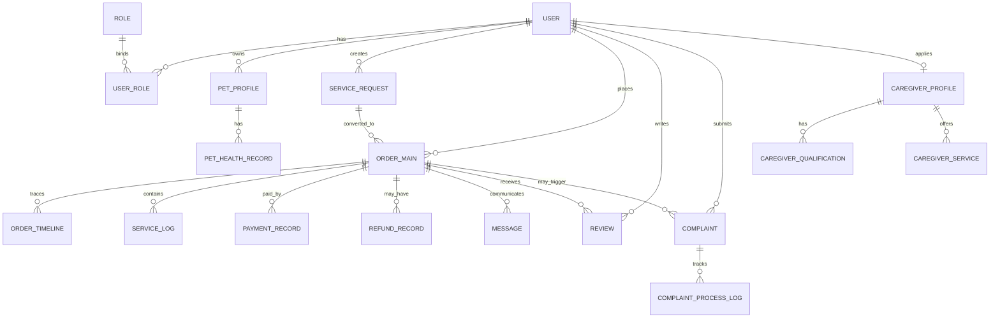

### 4.3 数据表详细设计

说明：字段类型为建议值，可在 Prisma schema 中按实际命名规范调整。

### 4.3.1 用户与认证域

#### 表：user

| 字段 | 类型 | 约束 | 说明 |
| --- | --- | --- | --- |
| id | uuid | PK | 用户主键 |
| phone | varchar(20) | unique | 手机号 |
| email | varchar(128) | unique nullable | 邮箱 |
| password_hash | varchar(255) | not null | 密码哈希 |
| status | varchar(20) | index | active/disabled/locked |
| realname_status | varchar(20) | index | unverified/pending/verified/rejected |
| last_login_at | timestamptz | nullable | 最后登录时间 |
| created_at | timestamptz | not null | 创建时间 |
| updated_at | timestamptz | not null | 更新时间 |

索引建议：

- unique(phone), unique(email)
- idx_user_status(status)

#### 表：role

| 字段 | 类型 | 约束 | 说明 |
| --- | --- | --- | --- |
| id | uuid | PK | 角色主键 |
| code | varchar(30) | unique | owner/caregiver/admin |
| name | varchar(50) | not null | 角色名称 |
| is_system | boolean | default true | 是否系统角色 |

#### 表：user_role

| 字段 | 类型 | 约束 | 说明 |
| --- | --- | --- | --- |
| id | uuid | PK | 关联主键 |
| user_id | uuid | FK user.id | 用户 |
| role_id | uuid | FK role.id | 角色 |
| is_active | boolean | default true | 是否启用 |
| created_at | timestamptz | not null | 创建时间 |

索引建议：

- unique(user_id, role_id)
- idx_user_role_user(user_id)
- idx_user_role_role(role_id)

#### 表：user_verification

| 字段 | 类型 | 约束 | 说明 |
| --- | --- | --- | --- |
| id | uuid | PK | 认证记录主键 |
| user_id | uuid | FK user.id | 用户 |
| real_name | varchar(50) | not null | 真实姓名 |
| id_type | varchar(20) | not null | 证件类型 |
| id_no_masked | varchar(50) | not null | 脱敏证件号 |
| verify_provider | varchar(50) | nullable | 认证服务商 |
| verify_result | varchar(20) | index | pending/pass/reject |
| reject_reason | varchar(255) | nullable | 拒绝原因 |
| submitted_at | timestamptz | not null | 提交时间 |
| reviewed_at | timestamptz | nullable | 审核时间 |

### 4.3.2 宠物档案域

#### 表：pet_profile

| 字段 | 类型 | 约束 | 说明 |
| --- | --- | --- | --- |
| id | uuid | PK | 宠物主键 |
| owner_id | uuid | FK user.id | 宠物主人 |
| name | varchar(50) | not null | 宠物名 |
| species | varchar(20) | index | dog/cat/other |
| breed | varchar(50) | nullable | 品种 |
| gender | varchar(10) | nullable | 性别 |
| birthday | date | nullable | 出生日期 |
| weight_kg | numeric(5,2) | nullable | 体重 |
| neutered | boolean | default false | 是否绝育 |
| temperament_tags | jsonb | default [] | 性格标签 |
| feeding_note | text | nullable | 喂食说明 |
| emergency_contact | jsonb | nullable | 紧急联系人 |
| created_at | timestamptz | not null | 创建时间 |
| updated_at | timestamptz | not null | 更新时间 |

索引建议：

- idx_pet_owner(owner_id)
- idx_pet_species_breed(species, breed)

#### 表：pet_health_record

| 字段 | 类型 | 约束 | 说明 |
| --- | --- | --- | --- |
| id | uuid | PK | 健康记录主键 |
| pet_id | uuid | FK pet_profile.id | 宠物 |
| record_type | varchar(20) | index | vaccine/allergy/disease/medication |
| title | varchar(100) | not null | 记录标题 |
| content | text | not null | 详情 |
| file_urls | jsonb | default [] | 附件 URL |
| occurred_at | timestamptz | nullable | 发生时间 |
| created_at | timestamptz | not null | 创建时间 |

### 4.3.3 照料者与服务域

#### 表：caregiver_profile

| 字段 | 类型 | 约束 | 说明 |
| --- | --- | --- | --- |
| id | uuid | PK | 照料者主键 |
| user_id | uuid | FK user.id unique | 用户映射 |
| intro | text | nullable | 自我介绍 |
| experience_years | int | default 0 | 从业年限 |
| service_radius_km | int | default 5 | 服务半径 |
| service_city | varchar(50) | index | 服务城市 |
| rating_avg | numeric(3,2) | default 5.0 | 平均评分 |
| rating_count | int | default 0 | 评价数 |
| audit_status | varchar(20) | index | pending/approved/rejected |
| created_at | timestamptz | not null | 创建时间 |
| updated_at | timestamptz | not null | 更新时间 |

#### 表：caregiver_qualification

| 字段 | 类型 | 约束 | 说明 |
| --- | --- | --- | --- |
| id | uuid | PK | 资质主键 |
| caregiver_id | uuid | FK caregiver_profile.id | 照料者 |
| cert_type | varchar(50) | index | 证书类型 |
| cert_no | varchar(100) | nullable | 证书编号 |
| file_url | varchar(255) | not null | 证书文件 |
| valid_from | date | nullable | 生效日 |
| valid_to | date | nullable | 到期日 |
| verify_status | varchar(20) | index | pending/pass/reject |
| created_at | timestamptz | not null | 创建时间 |

#### 表：caregiver_service

| 字段 | 类型 | 约束 | 说明 |
| --- | --- | --- | --- |
| id | uuid | PK | 服务项主键 |
| caregiver_id | uuid | FK caregiver_profile.id | 照料者 |
| service_type | varchar(30) | index | boarding/walking/feeding/door_visit |
| pet_species | varchar(20) | index | dog/cat/other |
| price_per_unit | numeric(10,2) | not null | 单价 |
| unit_type | varchar(20) | not null | hour/day/times |
| min_notice_hours | int | default 2 | 最小提前预约时长 |
| available_slots | jsonb | not null | 可服务时段 |
| service_geo | geography(Point, 4326) | index | 服务中心点 |
| is_active | boolean | default true | 是否上架 |
| created_at | timestamptz | not null | 创建时间 |
| updated_at | timestamptz | not null | 更新时间 |

索引建议：

- idx_caregiver_service_geo_gist(service_geo) using GIST

### 4.3.4 需求与订单交易域

#### 表：service_request

| 字段 | 类型 | 约束 | 说明 |
| --- | --- | --- | --- |
| id | uuid | PK | 需求主键 |
| owner_id | uuid | FK user.id | 发布人 |
| pet_id | uuid | FK pet_profile.id | 宠物 |
| service_type | varchar(30) | index | 服务类型 |
| start_time | timestamptz | index | 开始时间 |
| end_time | timestamptz | index | 结束时间 |
| location_text | varchar(255) | not null | 服务地点 |
| location_geo | geography(Point, 4326) | index | 服务坐标 |
| budget_amount | numeric(10,2) | nullable | 预算 |
| demand_tags | jsonb | default [] | 需求标签 |
| status | varchar(20) | index | open/matched/closed/cancelled |
| created_at | timestamptz | not null | 创建时间 |
| updated_at | timestamptz | not null | 更新时间 |

索引建议：

- idx_request_geo_gist(location_geo) using GIST

#### 表：order_main

| 字段 | 类型 | 约束 | 说明 |
| --- | --- | --- | --- |
| id | uuid | PK | 订单主键 |
| order_no | varchar(32) | unique | 业务订单号 |
| owner_id | uuid | FK user.id | 主人 |
| caregiver_id | uuid | FK caregiver_profile.id | 照料者 |
| service_request_id | uuid | FK service_request.id nullable | 来源需求 |
| service_type | varchar(30) | index | 服务类型 |
| appointment_start | timestamptz | index | 预约开始 |
| appointment_end | timestamptz | index | 预约结束 |
| amount_total | numeric(10,2) | not null | 应付总额 |
| amount_adjusted | numeric(10,2) | default 0 | 调价金额（补差价可为正） |
| amount_paid | numeric(10,2) | default 0 | 已付金额 |
| amount_refunded | numeric(10,2) | default 0 | 已退金额 |
| order_status | varchar(30) | index | pending_accept/accepted/serving/completed/cancelled/disputed/partial_refunded/refunded |
| cancel_reason | varchar(255) | nullable | 取消原因 |
| closed_at | timestamptz | nullable | 关闭时间 |
| created_at | timestamptz | not null | 创建时间 |
| updated_at | timestamptz | not null | 更新时间 |

索引建议：

- unique(order_no)
- idx_order_owner_status(owner_id, order_status, created_at desc)
- idx_order_caregiver_status(caregiver_id, order_status, created_at desc)
- idx_order_time(appointment_start, appointment_end)

#### 表：order_timeline

| 字段 | 类型 | 约束 | 说明 |
| --- | --- | --- | --- |
| id | bigserial | PK | 主键 |
| order_id | uuid | FK order_main.id | 订单 |
| event_type | varchar(30) | index | created/accepted/checkin/checkout/completed/cancelled/refund_applied/refund_done |
| operator_role | varchar(20) | index | owner/caregiver/admin/system |
| operator_id | uuid | nullable | 操作人 |
| event_payload | jsonb | nullable | 事件详情 |
| created_at | timestamptz | not null | 创建时间 |

#### 表：service_log

| 字段 | 类型 | 约束 | 说明 |
| --- | --- | --- | --- |
| id | uuid | PK | 服务日志主键 |
| order_id | uuid | FK order_main.id | 订单 |
| caregiver_id | uuid | FK caregiver_profile.id | 照料者 |
| log_type | varchar(20) | index | checkin/feed/walk/play/health/checkout |
| text_note | text | nullable | 文字说明 |
| media_urls | jsonb | default [] | 图片/视频 |
| geo | jsonb | nullable | 打卡坐标 |
| happened_at | timestamptz | index | 发生时间 |
| created_at | timestamptz | not null | 创建时间 |

### 4.3.5 沟通、支付、评价与投诉域

#### 表：message_session

| 字段 | 类型 | 约束 | 说明 |
| --- | --- | --- | --- |
| id | uuid | PK | 会话主键 |
| order_id | uuid | FK order_main.id unique | 订单会话 |
| owner_id | uuid | FK user.id | 主人 |
| caregiver_id | uuid | FK caregiver_profile.id | 照料者 |
| last_message_at | timestamptz | index | 最近消息时间 |
| created_at | timestamptz | not null | 创建时间 |

#### 表：message

| 字段 | 类型 | 约束 | 说明 |
| --- | --- | --- | --- |
| id | bigserial | PK | 消息主键 |
| session_id | uuid | FK message_session.id | 会话 |
| sender_role | varchar(20) | index | owner/caregiver/admin/system |
| sender_id | uuid | nullable | 发送方 |
| message_type | varchar(20) | index | text/image/video/system |
| content | text | not null | 内容 |
| ext | jsonb | nullable | 扩展字段 |
| created_at | timestamptz | index | 发送时间 |

#### 表：payment_record

| 字段 | 类型 | 约束 | 说明 |
| --- | --- | --- | --- |
| id | uuid | PK | 支付记录主键 |
| order_id | uuid | FK order_main.id | 订单 |
| pay_no | varchar(40) | unique | 支付单号 |
| biz_type | varchar(20) | index | deposit/balance/adjustment |
| pay_channel | varchar(20) | index | wechat/alipay/card |
| pay_status | varchar(20) | index | pending/paid/failed/closed |
| pay_amount | numeric(10,2) | not null | 支付金额 |
| channel_txn_id | varchar(80) | unique nullable | 三方交易流水号 |
| paid_at | timestamptz | nullable | 支付时间 |
| channel_payload | jsonb | nullable | 渠道回执 |
| created_at | timestamptz | not null | 创建时间 |
| updated_at | timestamptz | not null | 更新时间 |

索引建议：

- idx_payment_order(order_id, created_at desc)
- idx_payment_order_status(order_id, pay_status)

#### 表：refund_record

| 字段 | 类型 | 约束 | 说明 |
| --- | --- | --- | --- |
| id | uuid | PK | 退款记录主键 |
| order_id | uuid | FK order_main.id | 订单 |
| payment_id | uuid | FK payment_record.id nullable | 关联支付单 |
| refund_no | varchar(40) | unique | 退款单号 |
| apply_user_id | uuid | FK user.id | 发起人 |
| refund_type | varchar(20) | index | full/partial |
| refund_reason | varchar(255) | not null | 退款原因 |
| refund_amount | numeric(10,2) | not null | 退款金额 |
| refund_status | varchar(20) | index | pending/approved/rejected/success/failed |
| channel_refund_id | varchar(80) | unique nullable | 三方退款流水号 |
| reviewed_by | uuid | FK user.id nullable | 审核人 |
| reviewed_at | timestamptz | nullable | 审核时间 |
| created_at | timestamptz | not null | 创建时间 |

索引建议：

- idx_refund_order(order_id, created_at desc)
- idx_refund_payment(payment_id)

#### 表：review

| 字段 | 类型 | 约束 | 说明 |
| --- | --- | --- | --- |
| id | uuid | PK | 评价主键 |
| order_id | uuid | FK order_main.id unique | 订单 |
| owner_id | uuid | FK user.id | 评价人 |
| caregiver_id | uuid | FK caregiver_profile.id | 被评价照料者 |
| rating | int | check 1..5 | 星级 |
| tags | jsonb | default [] | 评价标签 |
| content | text | nullable | 评价内容 |
| is_anonymous | boolean | default false | 是否匿名 |
| created_at | timestamptz | not null | 创建时间 |

#### 表：complaint

| 字段 | 类型 | 约束 | 说明 |
| --- | --- | --- | --- |
| id | uuid | PK | 投诉主键 |
| order_id | uuid | FK order_main.id | 关联订单 |
| complainant_id | uuid | FK user.id | 投诉人 |
| target_role | varchar(20) | index | caregiver/platform |
| complaint_type | varchar(30) | index | safety/fee/service/fraud/other |
| description | text | not null | 投诉描述 |
| evidence_urls | jsonb | default [] | 证据附件 |
| status | varchar(20) | index | open/processing/resolved/rejected |
| result_summary | varchar(255) | nullable | 处理结论 |
| created_at | timestamptz | not null | 创建时间 |
| closed_at | timestamptz | nullable | 结案时间 |

#### 表：complaint_process_log

| 字段 | 类型 | 约束 | 说明 |
| --- | --- | --- | --- |
| id | bigserial | PK | 主键 |
| complaint_id | uuid | FK complaint.id | 投诉 |
| action_type | varchar(30) | index | assign/investigate/call_user/penalty/close |
| operator_id | uuid | FK user.id | 处理人 |
| note | text | nullable | 处理说明 |
| created_at | timestamptz | not null | 创建时间 |

### 4.3.6 平台治理与审计域

#### 表：platform_rule

| 字段 | 类型 | 约束 | 说明 |
| --- | --- | --- | --- |
| id | uuid | PK | 规则主键 |
| rule_code | varchar(50) | unique | 规则编码 |
| rule_name | varchar(100) | not null | 规则名称 |
| rule_version | varchar(20) | not null | 版本号 |
| content_md | text | not null | 规则内容 |
| effective_at | timestamptz | not null | 生效时间 |
| status | varchar(20) | index | draft/published/archived |
| created_by | uuid | FK user.id | 创建人 |
| created_at | timestamptz | not null | 创建时间 |

#### 表：operation_audit_log

| 字段 | 类型 | 约束 | 说明 |
| --- | --- | --- | --- |
| id | bigserial | PK | 主键 |
| actor_id | uuid | nullable | 操作人 |
| actor_role | varchar(20) | index | owner/caregiver/admin/system |
| action | varchar(100) | index | 行为标识 |
| resource_type | varchar(50) | index | 资源类型 |
| resource_id | varchar(64) | nullable | 资源 ID |
| request_id | varchar(64) | index | 请求追踪号 |
| detail | jsonb | nullable | 详情 |
| created_at | timestamptz | not null | 创建时间 |

### 4.4 Redis 设计

- key:user:session:{userId}:{deviceId}：登录态与 refresh token。
- key:order:lock:{orderId}：订单状态流转分布式锁。
- key:match:caregiver:{geohash}:{serviceType}:{petSpecies}：照料者推荐缓存。
- key:rate_limit:{api}:{userId}：限流计数。
- key:verify:otp:{phone}：短信验证码。

TTL 建议：

- session：7~30 天（按登录策略）
- 匹配缓存：30~120 秒
- 短信验证码：5 分钟
- 幂等 token：10 分钟

### 4.5 关键约束与一致性策略

- 订单状态机必须单向流转，禁止逆向跳转。
- 支付回调、退款回调使用幂等键（pay_no/refund_no + channel_txn_id）去重。
- 订单允许多次支付和多次退款，但需满足 amount_paid - amount_refunded >= 0。
- 订单关闭前满足 amount_paid >= amount_total + amount_adjusted - amount_refunded。
- 投诉结案前必须存在至少一条 complaint_process_log。
- 评价必须在订单 completed 状态后创建且每单唯一。
- 删除策略：核心交易表建议逻辑删除（deleted_at），审计表仅追加不更新。

### 4.6 地理位置排序实现（PostGIS + Prisma）

- PostgreSQL 启用 PostGIS 扩展，服务与需求坐标使用 geography(Point, 4326)。
- Prisma 模型中坐标字段使用 Unsupported("geography(Point,4326)") 映射，迁移 SQL 中创建 GIST 索引。
- 距离排序通过 Prisma 的参数化原生 SQL 执行：按 ST_DistanceSphere(service_geo, :requestPoint) 升序。
- 高频列表先按城市与服务类型过滤，再执行距离排序，最终结果短缓存到 Redis。

## 5. 用户操作流程设计

### 5.1 主人端下单履约流程

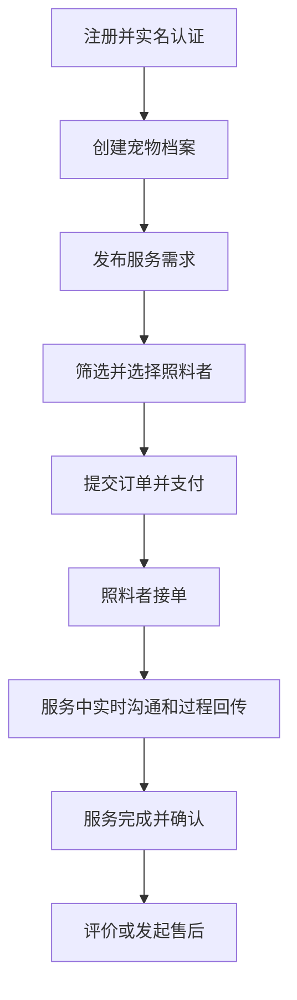

流程说明：

- 关键前置：实名认证通过、宠物档案完整。
- 支付后进入待接单状态，超时自动取消并触发退款策略。
- 服务中必须产生至少一次服务日志（特殊场景可按规则豁免）。

### 5.2 照料者端入驻接单流程

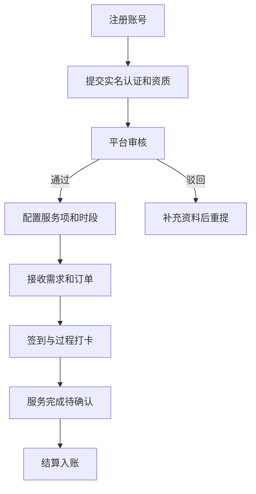

### 5.3 管理端审核与纠纷流程

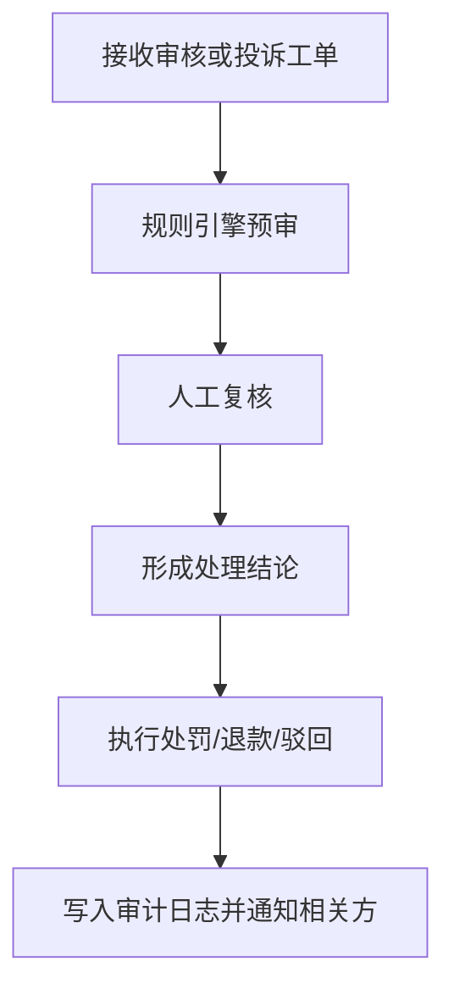

## 6. 数据流设计

### 6.1 下单到履约的数据流

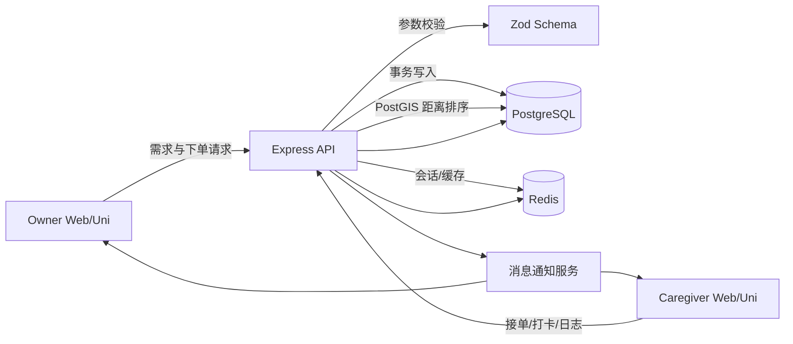

数据处理要点：

- API 层负责输入校验、鉴权、幂等控制。
- Service 层负责业务规则（状态机、价格计算、风控规则）。
- Repository/Prisma 层负责数据持久化与事务边界。

### 6.2 支付与退款数据流

- 创建支付单：order_main -> payment_record(pending, biz_type=deposit/balance/adjustment)。
- 支付回调：校验签名 -> 幂等检查 -> payment_record(paid) -> 聚合更新 order_main.amount_paid。
- 补差价：创建新的 payment_record(adjustment) 并单独走支付回调。
- 退款申请：refund_record(pending, full/partial) + order_timeline(event=refund_applied)。
- 退款回调：refund_record(success/failed) -> 聚合更新 order_main.amount_refunded -> 订单状态更新为 partial_refunded/refunded。

### 6.3 投诉处理数据流

- 投诉创建：complaint(open) + evidence_urls。
- 分配处理人：complaint_process_log(assign)。
- 调查过程：多条 process_log 连续记录。
- 结案：complaint(status=resolved/rejected) + result_summary。

## 7. API 模块划分建议

- /api/auth：登录、注册、认证、会话。
- /api/pets：宠物档案与健康记录。
- /api/caregivers：照料者资料、资质、服务项。
- /api/requests：需求发布与匹配。
- /api/orders：订单、服务日志、时间线。
- /api/payments：支付、退款、回调。
- /api/location：地理检索与附近照料者排序。
- /api/reviews：评价。
- /api/complaints：投诉与处理。
- /api/admin：审核、规则、处罚、统计。

## 8. 非功能设计

- 安全：JWT + Refresh Token，敏感字段加密/脱敏，RBAC 授权。
- 可用性：关键链路超时重试，消息通知失败补偿。
- 可观测性：request_id 全链路追踪，operation_audit_log 留痕。
- 性能：热点查询索引优化，PostGIS GIST 距离索引，匹配结果 Redis 短缓存，分页游标化。

## 9. 测试设计建议

- 单元测试：订单状态机、价格计算、退款规则、投诉流转。
- 集成测试：下单->多次支付->补差价->部分退款/全额退款主链路；投诉->处理->结案链路。
- 回归测试：认证授权边界、数据权限隔离、异常幂等。

重点新增用例：

- 同账号双身份切换后权限正确（Owner/Caregiver 菜单与数据隔离）。
- 距离排序结果稳定（同城、跨城、边界坐标）且与 Redis 缓存一致。

## 10. 迭代建议（里程碑）

- M1：账户、宠物档案、照料者入驻、基础订单。
- M2：支付退款、服务过程日志、评价投诉。
- M3：风控审计、数据看板、推荐排序优化。
- M4：多端体验与运营策略优化。

## 11. 二次审查结论与改进清单

本轮审查聚焦“可实现性、一致性、可运维性”，结论如下：

- 已收敛项：双身份模型、多次支付/补差价/部分退款并存、地理位置排序。
- 仍需落地项：Prisma migration 中 PostGIS 扩展 SQL、支付退款聚合更新的事务边界、身份切换的审计日志。

### 11.1 重点风险与处理建议

| 风险点 | 影响 | 建议 |
| --- | --- | --- |
| 地理字段使用 PostGIS，但未在迁移脚本启用扩展 | 上线后查询失败 | 在首个迁移中执行 `CREATE EXTENSION IF NOT EXISTS postgis;` |
| 订单金额聚合在并发回调下可能被覆盖 | 金额错账 | 采用数据库事务 + 行级锁（`FOR UPDATE`）+ 幂等键 |
| 多身份切换仅在前端切状态 | 越权风险 | 后端基于 user_role 与 activeRole 双重校验并写审计日志 |
| 多次退款可能超过已支付金额 | 财务风险 | 增加 `CHECK (amount_paid - amount_refunded >= 0)` 与服务层二次校验 |
| 消息通知服务未定义失败补偿策略 | 通知丢失 | 建立 outbox 表 + 重试任务 + 死信告警 |

### 11.2 规则落地优先级

1. P0：支付退款聚合事务化、幂等化。
2. P0：PostGIS 扩展与 GIST 索引迁移落地。
3. P1：双身份鉴权链路与审计日志。
4. P1：消息 outbox 重试机制。
5. P2：排序策略 A/B（距离优先 vs 评分优先）可配置化。

## 12. 图表附录（Mermaid）

### 12.1 用户交互时序图（下单到履约）

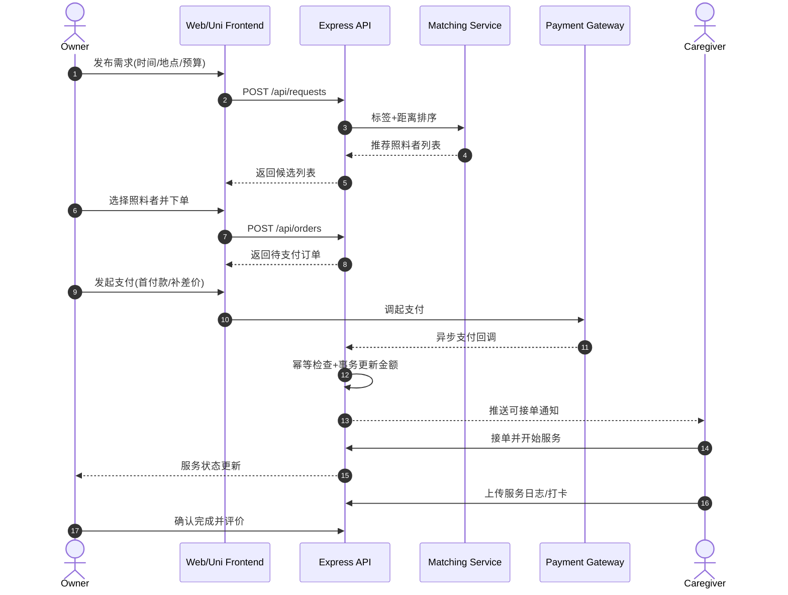

### 12.2 业务逻辑分层图

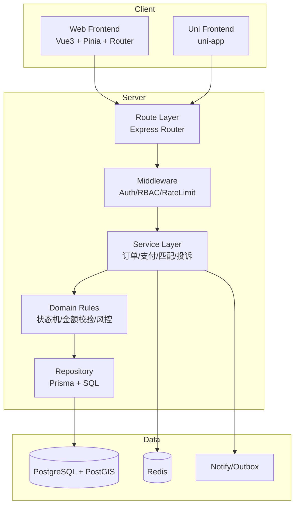

### 12.3 订单状态机图

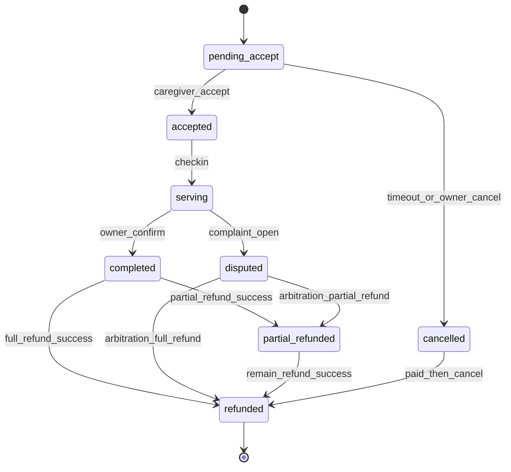

### 12.4 支付与退款状态机图

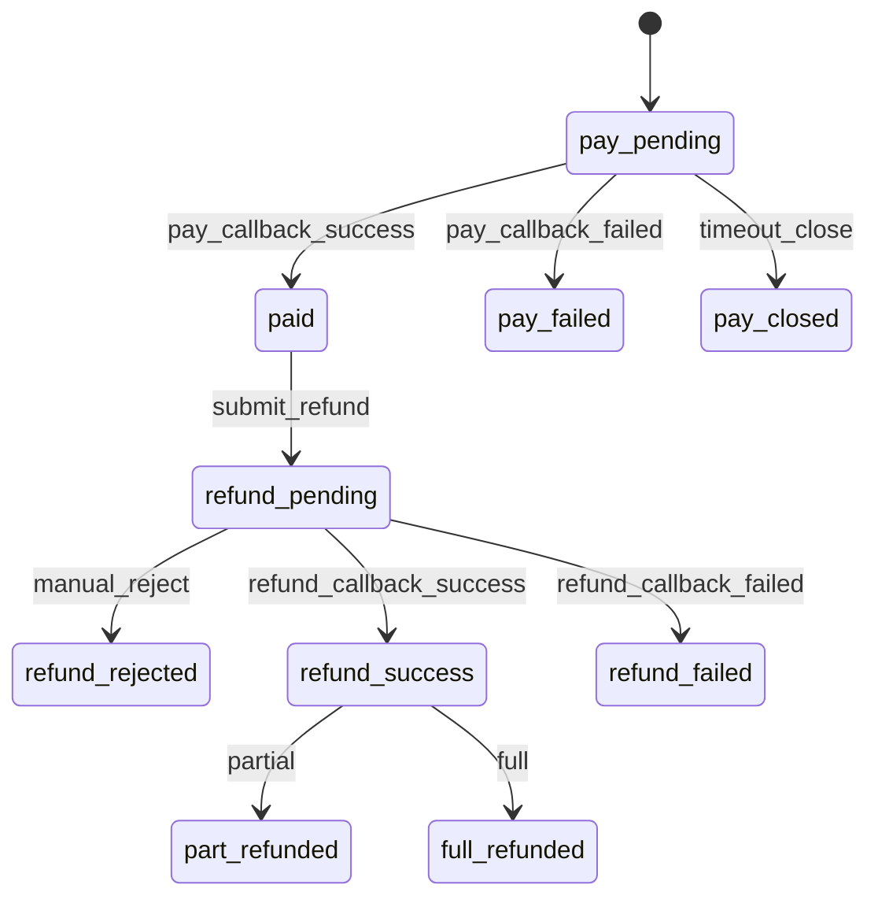

### 12.5 RBAC 权限决策流程图

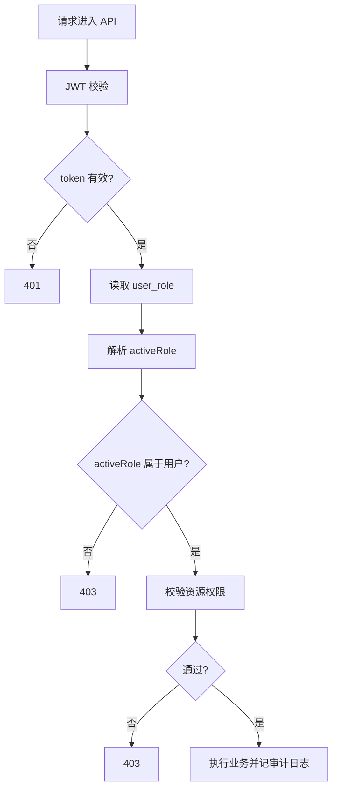

### 12.6 地理匹配与排序流程图

### 12.7 部署与可观测性图

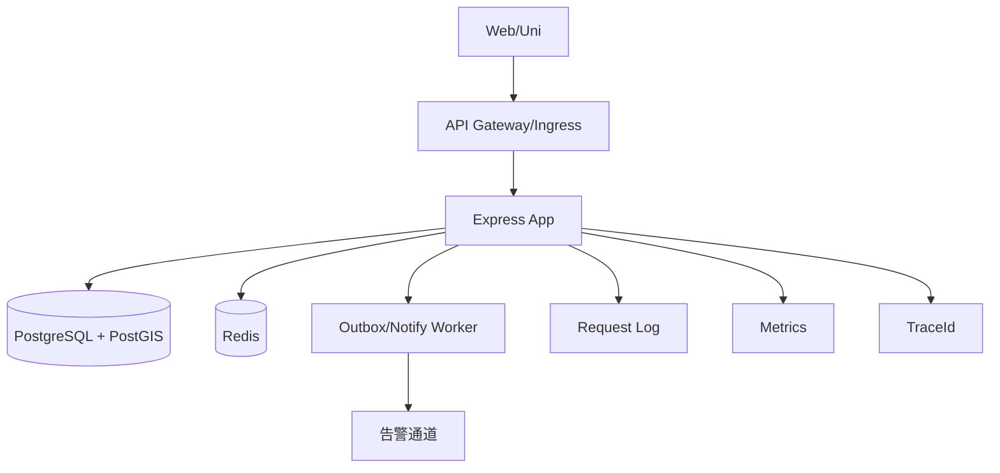

## 13. 完整开发计划（执行版，按当前实现基线重排）

本章以当前仓库真实状态为基线重排后续开发工作。目标不是继续堆功能点，而是在论文要求、产品闭环、代码质量、可测试性和可答辩性之间形成一份可执行的完整交付计划。

### 13.1 当前完成基线

截至当前代码基线，已完成内容如下：

- 主人端最小闭环：
  - 宠物档案查询/创建。
  - 服务需求发布与列表。
  - 照料者匹配与附近排序的最小接口。
  - 订单列表、订单详情、支付/退款分录展示。
- 支付回调治理：
  - 支付/退款回调鉴权。
  - 回调审计持久化、查询、统计、导出。
  - 失败告警 outbox、死信重放、replay log、风险信号。
- 照料者入驻第一阶段：
  - 照料者档案维护。
  - 服务项创建与更新。
  - 管理端审核动作与审核台页面。

仍未完成或仅完成最小形态的内容如下：

- activeRole 身份中心、双身份切换审计、身份级菜单/数据隔离的完整前后端闭环。
- 照料者接单、签到、服务日志、完成确认、超时处理。
- 订单内即时沟通、图片/视频过程回传、未读态与消息会话管理。
- 评价、投诉、售后处理进度、交易记录导出等用户反馈闭环。
- 管理端纠纷处理、违规处罚、规则发布、运营看板与导出。
- Uni 端对照料者履约、售后反馈和管理治理场景的补齐。
- 论文答辩所需的完整测试证据、演示脚本、截图和图表素材。

### 13.2 总目标与完成定义

总目标：在不回退既有支付治理与审计能力的前提下，完整实现开题文档所要求的三端业务功能，并形成可验收、可审计、可测试、可演示的毕业设计成果。

项目完成必须同时满足以下条件：

1. 主人端、照料者端、管理端核心功能全部可演示，不存在只写接口未接前端的关键缺口。
2. 核心数据模型、迁移、seed、RBAC 权限、菜单、审计日志同步完成。
3. Web 与 Uni 均可完成至少一条“真实业务主流程”。
4. 支付、退款、状态机、投诉处理、审核动作均具备可追踪审计。
5. PetPal 相关共享契约、后端接口、页面、测试和文档保持一致。
6. 定向集成测试、关键单测、前端 lint/build/type-check 和手工验收全部通过。
7. 发布门禁、回滚策略、风险清单、论文素材和答辩脚本均已准备。

### 13.3 里程碑与时间安排

| 里程碑 | 时间 | 目标 | 输出 |
| --- | --- | --- | --- |
| 已完成基线 | 2026-03-30 至 2026-04-01 | 主人端最小闭环、回调治理、照料者入驻审核第一阶段 | 代码、测试、文档 |
| P1-M2 接单履约闭环 | 2026-04-02 至 2026-04-06 | 补齐照料者接单、签到、服务日志、完成确认 | 后端 API + Web/Uni 页面 + 状态机测试 |
| P1-M3 用户反馈与售后 | 2026-04-07 至 2026-04-12 | 评价、投诉、售后、交易导出、过程进度查询 | 模型、接口、页面、导出、权限边界 |
| P1-M4 管理治理闭环 | 2026-04-13 至 2026-04-18 | 纠纷台、违规处置、规则发布、运营指标 | 管理端页面、统计接口、审计与导出 |
| P2-M1 多端补齐与体验收口 | 2026-04-19 至 2026-04-24 | 补齐 Uni 关键页面、身份中心、消息体验、错误态空态 | Web/Uni 对齐、演示可用 |
| P2-M2 联调验收与论文材料 | 2026-04-25 至 2026-05-06 | 全链路回归、代码审计、功能测试、压测样例、论文材料 | 测试报告、风险清单、演示脚本、截图图表 |

约束说明：

- 任一里程碑延期时，优先压缩“体验优化”范围，不得取消代码审计、功能测试和文档同步。
- 任一切片必须具备“代码、测试、文档、进度记录”四项交付物，缺一视为未完成。

### 13.4 功能域覆盖矩阵

| 功能域 | 必交功能 | 当前状态 | 目标里程碑 |
| --- | --- | --- | --- |
| 账户与身份 | 登录/注册、实名状态、Owner/Caregiver 双身份、activeRole 审计、设备与安全设置基础态 | 部分完成 | P2-M1 |
| 宠物档案 | 基础档案、健康记录、习惯配置、紧急联系人 | 最小闭环已完成，健康域未完整 | P1-M3 |
| 照料者入驻 | 档案、资质、服务设置、审核状态、审核动作 | 基本完成 | P1-M4 补导出与筛选 |
| 需求与匹配 | 发布需求、筛选、排序、地理距离、推荐缓存 | 最小闭环已完成，策略未完善 | P2-M1 |
| 订单与履约 | 接单、签到、服务日志、完成确认、超时处理、时间线 | 未完成 | P1-M2 |
| 消息与回传 | 订单会话、图文消息、过程媒体、未读数 | 未完成 | P2-M1 |
| 支付与退款 | 多次支付、补差价、部分退款、回调审计、对账 | 核心已完成 | P1-M3 补用户侧导出与售后进度 |
| 评价与投诉 | 评价、标签、投诉、处理日志、仲裁结论 | 未完成 | P1-M3 |
| 管理治理 | 审核台、纠纷处理、违规处罚、规则发布、指标看板 | 部分完成 | P1-M4 |
| 可观测与审计 | request_id 串联、关键动作审计、导出留痕 | 部分完成 | P2-M2 |

### 13.5 P1-M2：接单履约闭环

目标：形成“支付成功 -> 照料者接单 -> 到店/到家签到 -> 服务日志 -> 完成确认”的可运行主链路。

#### 13.5.1 数据与模型

1. 校准 `order_main` 状态机，明确 `pending_accept / accepted / serving / completed / cancelled / disputed` 的合法迁移。
2. 落实 `service_log` 与 `order_timeline` 的实际 Prisma 模型、迁移、索引与 seed。
3. 如签到与签退需要单独约束，补充 `checkinAt / checkoutAt` 或事件型日志字段。

#### 13.5.2 后端任务

1. 新增照料者订单工作台接口：
   - 我的待接单列表。
   - 我的服务中订单列表。
   - 我的历史订单列表。
2. 新增订单动作接口：
   - 接单。
   - 拒单/取消。
   - 签到。
   - 新增服务日志。
   - 签退。
   - 主人确认完成。
3. 增加状态守卫：
   - 禁止状态逆行。
   - 禁止重复签到/重复签退。
   - 禁止非订单相关人操作。
4. 补充 timeout timer：
   - 超时未接单。
   - 超时未签到。
   - 服务完成待确认提醒。
5. 关键动作写入：
   - `order_timeline`
   - `RequestRecord/Operation`
   - PetPal 业务审计字段（必要时）

#### 13.5.3 前端任务

Web：

1. 新增照料者订单工作台页面。
2. 在订单详情页接入接单、签到、服务日志、签退、完成确认操作。
3. 补齐状态胶囊、空态、错误态、禁用态与重复提交防护。

Uni：

1. 新增照料者订单列表页与订单详情页动作区。
2. 支持移动端签到、服务日志上传与过程照片回传。
3. 补齐弱网重试、上传失败提示和返回后列表刷新。

#### 13.5.4 验收标准

1. 主路径通过：支付成功 -> 接单 -> 签到 -> 两次服务日志 -> 签退 -> 主人确认完成。
2. 异常路径通过：重复签到、越权写日志、状态逆行、超时未接单。
3. Web 与 Uni 至少各完成一条履约主路径。

### 13.6 P1-M3：用户反馈与售后闭环

目标：完成“评价、投诉、退款进度、交易记录导出”的用户反馈闭环。

#### 13.6.1 数据与模型

1. 落实 `review`、`complaint`、`complaint_process_log` 模型与迁移。
2. 如交易导出需要单独聚合视图，增加导出 DTO 或数据库查询视图。
3. 统一投诉状态与退款状态枚举，避免前后端枚举漂移。

#### 13.6.2 后端任务

1. 评价接口：
   - 提交评价。
   - 查询我的评价。
   - 查询照料者被评价记录。
2. 投诉接口：
   - 发起投诉。
   - 查询我的投诉与进度。
   - 查询订单关联投诉。
3. 交易导出：
   - 主人端 1 年内交易记录导出。
   - 退款进度明细导出。
4. 售后进度接口：
   - 退款申请详情。
   - 投诉处理进度时间线。
5. 权限与审计：
   - 导出权限单独控制。
   - 投诉/售后关键动作写审计日志。

#### 13.6.3 前端任务

Web：

1. 订单完成后评价弹窗与评价列表。
2. 投诉发起页、投诉进度页、交易导出入口。
3. 退款与投诉状态在订单详情页可追踪展示。

Uni：

1. 订单完成后评价入口。
2. 投诉提交与进度页。
3. 交易记录查询与导出说明页。

#### 13.6.4 验收标准

1. 一单只能评价一次，未完成订单禁止评价。
2. 投诉创建后，用户可看到处理进度时间线。
3. 导出接口具备权限、审计和文件下载回归测试。

### 13.7 P1-M4：管理治理闭环

目标：完成管理员视角的审核、纠纷、处罚、规则和看板闭环。

#### 13.7.1 后端任务

1. 投诉处理与仲裁接口：
   - 分配处理人。
   - 写入调查记录。
   - 形成结论。
   - 处罚/驳回/退款联动。
2. 违规治理接口：
   - 违规记录。
   - 处罚动作。
   - 整改状态。
3. 规则管理接口：
   - 草稿、发布、归档。
   - 生效时间与版本管理。
4. 运营指标接口：
   - 供需比。
   - 完单率。
   - 退款率。
   - 投诉率。
   - 审核通过率。
5. 审核台补强：
   - 时间范围筛选。
   - 导出。
   - 审核动作留痕。

#### 13.7.2 前端任务

Web 控制台：

1. 纠纷处理台。
2. 违规处理台。
3. 平台规则发布页。
4. 运营看板 PetPal 模块。
5. 审核台导出与高级筛选。

#### 13.7.3 验收标准

1. 审核、仲裁、处罚、规则发布四类动作均有独立权限码。
2. 管理端关键列表支持分页、筛选、导出和审计留痕。
3. 指标看板与数据库统计口径一致。

### 13.8 P2-M1：多端补齐与体验收口

目标：补齐开题要求中“多端可用、体验完整”的缺口，避免出现只在 Web 可演示的功能。

#### 13.8.1 功能补齐

1. 身份中心：
   - Owner/Caregiver 切换 UI。
   - activeRole 切换后菜单、数据、按钮同步切换。
   - 切换动作落审计。
2. 消息与媒体：
   - 订单内消息会话。
   - 文本/图片消息。
   - 未读数与已读状态。
3. 宠物健康域补齐：
   - 疫苗、过敏、疾病、用药记录。
4. 空态与错误态：
   - 无数据、越权、网络异常、处理中、导出中、上传失败。

#### 13.8.2 体验收口

1. Web 与 Uni 页面文案统一收敛。
2. 履约和售后主流程全部补充操作确认和成功/失败反馈。
3. 演示路径统一成“主人端一条线、照料者端一条线、管理端一条线”。

### 13.9 代码审计机制

代码审计不是发布前一次性动作，而是每个里程碑必须完成的门禁。

#### 13.9.1 审计范围

1. Schema 审计：
   - Prisma schema、migration SQL、seed 数据一致。
   - 枚举值、索引、外键、唯一约束与代码逻辑一致。
2. 权限审计：
   - 所有新增接口具备 `authMiddleware`、`requirePermission(...)` 或明确匿名边界。
   - activeRole 不可只在前端切换，后端必须校验。
3. 事务与幂等审计：
   - 支付、退款、接单、签到、仲裁等关键写操作必须事务化。
   - 重复回调、重复提交、重放场景必须可幂等。
4. 契约审计：
   - `packages/api-common` 与后端响应结构一致。
   - Web/Uni 不直接依赖隐式字段。
5. 前端权限与展示审计：
   - 按钮显隐与后端权限一致。
   - 管理端导出权限不可与读取权限混用。
6. 文档审计：
   - `PetPal.md`、模块文档、测试文档、进度日志同步更新。

#### 13.9.2 审计执行要求

1. 每个 PR 至少 1 名后端 reviewer。
2. 任何跨端改动至少 1 名后端 reviewer + 1 名前端 reviewer。
3. 任何 migration、权限、支付、退款、仲裁相关改动必须附带审计结论。
4. 审计阻塞项未清零前不得合并。

#### 13.9.3 审计输出物

- 代码审核结论。
- 阻塞问题列表。
- 风险清单更新。
- 必要时附接口变更说明和回滚说明。

### 13.10 测试计划与功能验证

测试分为五层，缺任一层都不视为“功能完全实现”。

#### 13.10.1 单元测试

覆盖以下高风险规则：

1. 订单状态机迁移。
2. 金额聚合与补差价计算。
3. 退款上限校验。
4. activeRole 校验与身份切换。
5. 距离排序和二次排序逻辑。

#### 13.10.2 框架/服务级测试

1. 请求审计与事务回滚。
2. Outbox 重试与 replay 行为。
3. 导出文件生成。
4. 上传回调与失败补偿。

#### 13.10.3 集成测试

以 `apps/backend/test/integration/petpal-api.test.ts` 为主线扩展，必须覆盖：

1. 宠物档案 -> 需求发布 -> 匹配 -> 下单。
2. 多次支付 -> 补差价 -> 部分退款 -> 全额退款。
3. 照料者入驻 -> 审核 -> 服务设置 -> 接单 -> 签到 -> 服务日志 -> 完成。
4. 评价 -> 投诉 -> 管理端处理 -> 结案。
5. activeRole 越权、导出越权、审核越权、仲裁越权。

#### 13.10.4 前端验证

Web：

1. `pnpm --filter @rbac/web-frontend lint`
2. `pnpm --filter @rbac/web-frontend build`

Uni：

1. `pnpm --filter @rbac/app-frontend type-check`
2. 关键页面手工 smoke test（登录、身份切换、履约、投诉、评价）。

共享层：

1. `pnpm --filter @rbac/api-common build`

后端：

1. `pnpm --filter @rbac/backend lint`
2. `pnpm --filter @rbac/backend test`
3. `pnpm --filter @rbac/backend exec node --import tsx --test --test-concurrency=1 test/integration/petpal-api.test.ts`

#### 13.10.5 手工功能验收脚本

至少完成以下 8 条手工脚本：

1. 主人端注册、建宠物档案、发布需求、选择照料者并下单。
2. 支付成功后，照料者接单与签到。
3. 服务中新增日志与图片回传。
4. 主人确认完成并评价。
5. 主人发起投诉并查看处理进度。
6. 管理员审核照料者并导出审核列表。
7. 管理员处理投诉并形成仲裁结果。
8. 导出交易记录、审计记录或运营指标。

### 13.11 发布与回滚门禁

发布前必须全部通过：

1. migration dry-run。
2. seed 幂等验证。
3. 共享层构建通过。
4. 后端 lint/test 通过。
5. Web lint/build 通过。
6. Uni type-check 通过。
7. PetPal 定向集成测试通过。
8. 手工 smoke test 全通过。
9. 文档、风险清单、进度日志同步。

回滚策略：

1. 应用回滚使用上一稳定镜像。
2. 数据问题优先前向修复，不执行 destructive rollback。
3. 回调、仲裁、导出、处罚等已产生审计的数据不得回滚删除。

### 13.12 当前风险追踪表（持续更新）

| 编号 | 风险描述 | 优先级 | 负责人角色 | 状态 | 目标里程碑 |
| --- | --- | --- | --- | --- | --- |
| R-001 | 支付并发回调导致金额聚合竞态 | P0 | 后端 | Mitigated（Serializable + Retry） | 已完成基线 |
| R-002 | PostGIS 迁移在不同环境不一致 | P0 | 后端/运维 | Open | P2-M2 |
| R-003 | activeRole 被篡改导致越权访问 | P0 | 后端 | Mitigated（Server-side Validation 基线已具备，前端身份中心待补齐） | P2-M1 |
| R-004 | 履约状态机缺少完整守卫导致状态逆行 | P1 | 后端 | Open | P1-M2 |
| R-005 | 投诉/仲裁流程缺乏统一规则版本与审计 | P1 | 后端/产品 | Open | P1-M4 |
| R-006 | Uni 端关键流程缺失导致答辩演示不完整 | P1 | 前端 | Open | P2-M1 |
| R-007 | 多端导出、权限与审计边界可能不一致 | P1 | 全栈 | Open | P2-M2 |
| R-008 | 排序策略切换后指标回落 | P2 | 产品/后端 | Open | P2-M2 |

### 13.13 计划甘特图

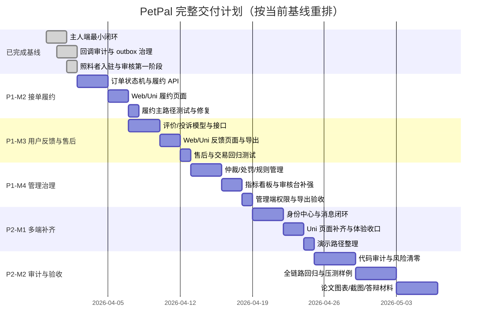

## 14. 开发进度日志

### 14.1 2026-03-30（P0 Slice 1）

已完成：

- 新增 PetPal 领域 Prisma 模型与枚举：宠物、照料者、需求、订单、支付、退款。
- 新增 P0 迁移脚本目录与 SQL：`20260330120000_petpal_p0_core`。
- 更新 seed：补充 PetPal 样本数据（匹配需求、订单、多次支付、部分退款）。
- 新增集成测试：`petpal-seed.test.ts`，覆盖数据关系与金额一致性校验。
- 验证：Prisma generate、后端 lint、新增测试文件均通过。

进行中：

- P0 后端接口首批落地（订单/支付/退款/地理排序 API）。

风险与缓解：

- 风险：当前地理字段先采用 lat/lng 数值字段，尚未切到 PostGIS 原生 geography。
- 缓解：P0 Slice 2 将补充 PostGIS migration 与距离排序 SQL 封装。

下一步（1-3 项）：

1. 实现支付回调幂等与金额聚合服务层（事务 + 行级锁）。
2. 落地订单/支付/退款 API 首批路由与参数校验。
3. 增加接口集成测试（主流程 + 并发回调异常流程）。

### 14.2 2026-03-31（P0 Slice 2）

已完成：

- 新增 PetPal 首批后端 API：`/api/petpal/pets`、`/api/petpal/requests`、`/api/petpal/orders`、`/api/petpal/match/caregivers`。
- 新增服务层 `petpal-service.ts`，实现：
  - 主人视角宠物档案/需求/订单查询与创建。
  - 订单金额守恒校验（已付、已退、应付约束）。
  - 基于经纬度的照料者距离排序（距离优先、评分次排序）。
- 新增集成测试 `petpal-api.test.ts`，覆盖 API 主流程与距离排序。
- 验证：
  - 后端 lint 通过。
  - PetPal 测试集串行执行通过（4/4）。

进行中：

- 支付回调与退款回调写入接口（幂等 + 事务 + 行级锁）。

风险与缓解：

- 风险：测试文件并发运行时会同时 reset 同一测试库导致冲突。
- 缓解：在 PetPal 相关测试执行中强制 `--test-concurrency=1`，后续再评估多测试库隔离策略。

下一步（1-3 项）：

1. 新增支付/退款回调 API，并实现幂等防重。
2. 为支付并发回调增加失败路径测试（重复回调、乱序回调）。
3. 将支付与退款关键事件写入审计日志并补充文档说明。

### 14.3 2026-03-31（P0 Slice 3）

已完成：

- 新增支付/退款回调接口：
  - `POST /api/petpal/payments/callback`
  - `POST /api/petpal/refunds/callback`
- 新增回调 token 鉴权（`x-petpal-callback-token`），并增加环境变量：`PETPAL_CALLBACK_TOKEN`。
- 服务层实现回调幂等与聚合更新：
  - 支付回调：更新支付状态，按订单聚合 `amountPaid/amountRefunded`。
  - 退款回调：更新退款状态，按订单聚合金额并推进 `orderStatus`。
- 完善集成测试：新增回调幂等用例并通过。

验证：

- `pnpm --filter @rbac/backend lint` 通过。
- `petpal-api.test.ts` 串行执行通过（3/3）。

进行中：

- 支付/退款回调的审计事件标准化与错误码细化。

风险与缓解：

- 风险：目前回调 token 为静态口令，仍需与微信支付签名验签链路对齐。
- 缓解：下一轮引入微信支付 SDK 验签适配层，保留当前 token 作为本地联调 fallback。

下一步（1-3 项）：

1. 接入微信支付回调验签适配（环境变量配置，不落库明文密钥）。
2. 为回调失败与乱序场景新增测试（支付先失败后成功、重复退款回调）。
3. 增加订单状态流转审计记录与查询接口。

### 14.4 2026-03-31（P0 Slice 4）

已完成：

- 共享契约层新增 PetPal 类型与 API 工厂端点（`packages/api-common`）：
  - 宠物、需求、订单、匹配照料者的 DTO 与请求类型。
  - `petpal.pets/requests/orders/match` 客户端方法。
- Web 端新增公开业务页：`/petpal`（业主工作台），包含：
  - 宠物档案列表与创建。
  - 服务需求列表与创建。
  - 订单总览。
  - 照料者匹配筛选与结果展示。
- Uni 端新增页面：`/pages/petpal/index`，并在首页快捷入口挂载“宠托帮”。
- 验证通过：
  - `pnpm --filter @rbac/api-common build`
  - `pnpm --filter @rbac/web-frontend lint`
  - `pnpm --filter @rbac/app-frontend type-check`

进行中：

- 将订单详情与支付/退款时间线下沉为可复用页面组件（Web + Uni）。

风险与缓解：

- 风险：当前 Web/Uni 以基础表单直连 API，字段校验和错误提示粒度仍偏粗。
- 缓解：P0 后续切片补充统一表单校验规则、枚举展示映射和空态交互规范。

下一步（1-3 项）：

1. 新增订单详情页并接入支付/退款记录明细查询。
2. 增加前端联调测试（至少覆盖创建宠物、发布需求、列表刷新主路径）。
3. 对接微信支付 SDK 验签适配层并补回调异常路径测试。

### 14.5 2026-03-31（P0 Slice 5）

已完成：

- 订单详情能力在 Web + Uni 双端完成落地：
  - Web：新增 `apps/web-frontend/src/pages/frontend/petpal/OrderDetailView.vue`。
  - Uni：新增 `apps/app-frontend/src/pages/order-detail/index.vue`。
- 页面能力覆盖：
  - 订单基础信息展示（订单号、状态、服务类型、服务时间、创建时间）。
  - 金额统计展示（总额、调整金额、已支付、已退款）。
  - 支付记录时间线（状态、金额、业务类型、支付完成时间）。
  - 退款记录时间线（状态、金额、退款类型、审核时间）。
- 跳转链路完成：
  - Web 订单列表新增“查看详情”操作。
  - Uni 订单总览新增跳转详情页能力。
- 共享契约补齐：
  - `packages/api-common` 新增 `PaymentRecordDetail`、`RefundRecordDetail` 细化类型。
- 构建验证通过：
  - `pnpm --filter @rbac/api-common build`
  - `pnpm --filter @rbac/web-frontend lint`
  - `pnpm --filter @rbac/app-frontend type-check`
- 集成测试证据：
  - PetPal 相关集成场景通过（owner pet/request workflow、caregiver matching + order detail、payment/refund callback idempotency）。

进行中：

- P0 Slice 6：微信支付回调验签适配与支付状态机边界加固（乱序、重复、失败重试）。

风险与缓解：

- 风险：后端全量测试集中存在与 PetPal 切片无关的历史失败用例，影响“一键全绿”稳定性。
- 缓解：本切片先以 PetPal 相关集成用例作为验收证据；后续安排独立稳定性修复切片清理非 PetPal 失败项。

下一步（1-3 项）：

1. 落地微信支付回调验签与环境变量配置模板，补充最小联调脚本。
2. 增加支付/退款回调乱序与重复场景测试，确保幂等与金额守恒。
3. 补齐订单状态流转审计查询接口并在管理端可视化。

### 14.6 2026-03-31（P0 Slice 6）

已完成：

- 新增 PetPal 回调鉴权适配服务：`apps/backend/src/services/petpal-callback-auth.ts`。
  - 支持 `TOKEN` 与 `WECHATPAY` 两种模式。
  - `TOKEN` 模式沿用 `x-petpal-callback-token`，保持已有联调兼容。
  - `WECHATPAY` 模式支持：`x-wechatpay-signature`、`x-wechatpay-timestamp`、`x-wechatpay-nonce` 校验。
  - 提供回调时间窗校验，降低重放风险。
- 回调路由接入适配层：`apps/backend/src/routes/petpal.ts`。
  - 支付与退款回调统一走 `verifyPetpalCallbackAuth`。
- 环境变量与模板补齐：
  - `PETPAL_CALLBACK_AUTH_MODE=TOKEN|WECHATPAY`
  - `PETPAL_WECHATPAY_NOTIFY_SECRET`
  - `PETPAL_WECHATPAY_TIMESTAMP_TOLERANCE_SECONDS`
  - 已同步到 `apps/backend/.env.example`。
- 新增单元测试：`apps/backend/test/services/petpal-callback-auth.test.ts`。
  - 覆盖 TOKEN 成功路径。
  - 覆盖 WECHATPAY 签名成功路径。

验证结果：

- `pnpm --filter @rbac/backend lint` 通过。
- `pnpm --filter @rbac/backend exec node --import tsx --test test/services/petpal-callback-auth.test.ts` 通过（2/2）。

进行中：

- P0 Slice 7：支付回调乱序/重复/失败重试的扩展集成测试与状态机边界加固。

风险与缓解：

- 风险：当前 WECHATPAY 验签为接入路径实现，尚未接入官方 SDK 的证书链校验。
- 缓解：下一切片引入官方 SDK 验签器并保留现有适配层接口，避免路由层改动扩散。

下一步（1-3 项）：

1. 在适配层引入微信支付官方 SDK 验签实现（按环境变量切换）。
2. 为支付/退款回调新增乱序、重复、失败后成功恢复的集成测试。
3. 补充回调审计字段（requestId、sourceMode、signatureDigest）并输出查询接口。

### 14.7 2026-03-31（P0 Slice 7）

已完成：

- 扩展 PetPal 回调集成测试：`apps/backend/test/integration/petpal-api.test.ts`。
- 在“payment/refund callback idempotency”场景中新增边界路径：
  - 支付回调失败 -> 成功恢复（同 `payNo` 不同 `channelTxnId`）。
  - 退款回调失败 -> 成功恢复（同 `refundNo` 不同 `channelRefundId`）。
  - 覆盖失败状态到成功状态的状态机恢复行为，验证聚合金额约束仍成立。
- 修正测试数据与 Prisma 枚举保持一致：
  - `PaymentBizType`: `BALANCE`
  - `RefundType`: `PARTIAL`

验证结果：

- `pnpm -C apps/backend exec node --import tsx --test --test-concurrency=1 test/integration/petpal-api.test.ts` 通过（3/3）。

进行中：

- P0 Slice 8：接入微信支付官方 SDK 验签器并保持当前适配层接口不变。

风险与缓解：

- 风险：当前 WECHATPAY 模式为接入路径实现，签名算法与证书链校验仍需官方 SDK 接管。
- 缓解：保留 `verifyPetpalCallbackAuth` 统一入口，后续仅替换 WECHATPAY 分支实现，避免业务路由变更。

下一步（1-3 项）：

1. 引入微信支付官方 SDK 并封装为 `WECHATPAY` 鉴权实现。
2. 增加验签失败与时间戳超时的回调拒绝测试。
3. 增加回调审计明细字段并补查询接口。

### 14.8 2026-03-31（P0 Slice 8）

已完成：

- 回调鉴权增加 SDK 集成路径与配置开关：
  - 新增 `PETPAL_WECHATPAY_VERIFY_PROVIDER=HMAC|SDK`。
  - 新增 SDK 路径配置项：`PETPAL_WECHATPAY_MERCHANT_ID`、`PETPAL_WECHATPAY_APP_ID`、`PETPAL_WECHATPAY_CERT_SERIAL_NO`、`PETPAL_WECHATPAY_PLATFORM_PUBLIC_KEY`。
- 新增 SDK 适配器：`apps/backend/src/services/petpal-wechatpay-sdk-adapter.ts`。
  - 保持 `verifyPetpalCallbackAuth` 统一入口不变。
  - `SDK` 模式下走适配器路径，满足后续官方 SDK 替换扩展点。
- 签名基线修正为“原始请求体”：
  - `app.ts` 在 JSON 解析阶段保存 `req.rawBody`。
  - `petpal` 回调路由验签时优先使用 `req.rawBody`，避免对象序列化差异导致签名误判。
- 单元测试增强：`apps/backend/test/services/petpal-callback-auth.test.ts`
  - 新增“无效签名拒绝”测试。
  - 新增“时间戳超时拒绝”测试。

验证结果：

- `pnpm --filter @rbac/backend lint` 通过。
- `pnpm --filter @rbac/backend exec node --import tsx --test test/services/petpal-callback-auth.test.ts` 通过（4/4）。
- `pnpm -C apps/backend exec node --import tsx --test --test-concurrency=1 test/integration/petpal-api.test.ts` 通过（3/3）。

进行中：

- P0 Slice 9：回调审计明细字段与查询接口（requestId/sourceMode/signatureDigest）。

风险与缓解：

- 风险：SDK 模式当前为可插拔接入路径，官方 SDK 证书自动轮转能力尚未实装。
- 缓解：已固定统一适配层接口，下一切片直接替换 SDK 分支实现，不影响业务路由和服务层。

下一步（1-3 项）：

1. 将 SDK 路径替换为官方 SDK 证书管理与验签实现。
2. 增加 SDK 模式下验签失败集成测试。
3. 落地回调审计明细模型与管理端查询接口。

### 14.9 2026-03-31（P0 Slice 9）

已完成：

- 回调审计明细最小落地（不改数据库）：
  - `verifyPetpalCallbackAuth` 返回标准审计元数据：`sourceMode`、`signatureDigest`、`callbackTimestamp`。
  - 支付与退款回调响应中新增 `callbackAuth`，并附带 `requestId`。
- 回调鉴权逻辑增强：
  - `TOKEN` 模式与 `WECHATPAY` 模式统一产出审计元数据。
  - `WECHATPAY` 的 `HMAC` 与 `SDK` provider 分支均纳入统一出口。
- 集成测试增强：
  - `petpal-api` 回调场景新增 `callbackAuth` 字段断言（`sourceMode`、`signatureDigest`、`requestId`）。

验证结果：

- `pnpm --filter @rbac/backend lint` 通过。
- `pnpm --filter @rbac/backend exec node --import tsx --test test/services/petpal-callback-auth.test.ts` 通过（4/4）。
- `pnpm -C apps/backend exec node --import tsx --test --test-concurrency=1 test/integration/petpal-api.test.ts` 通过（3/3）。

进行中：

- P0 Slice 10：回调审计明细持久化与查询接口（管理端可追溯）。

风险与缓解：

- 风险：当前回调审计明细在 API 响应可观测，但尚未持久化到专用审计模型。
- 缓解：下一切片新增持久化字段与查询接口，保持现有响应结构向后兼容。

下一步（1-3 项）：

1. 增加回调审计持久化字段与最小迁移。
2. 增加管理端回调审计查询 API。
3. 增加 SDK provider 模式的失败路径集成测试。

### 14.10 2026-03-31（P0 Slice 10）

**概述**：回调审计持久化 — 从响应级审计元数据到数据库模型持久化，支持管理端审计日志查询。

已完成：

- 新增 `CallbackAudit` 数据模型：
  - 关键字段：`callbackType`（PAYMENT_CALLBACK|REFUND_CALLBACK）、`paymentId`/`refundId`、`requestId`（唯一）、`sourceMode`、`signatureDigest`、`callbackTimestamp`、`callbackStatus`（PENDING|SUCCESS|FAILURE|ERROR）、`verificationResult`（JSON）、`rawPayload`。
  - 索引策略：`(requestId)` unique、`(callbackType, callbackStatus)`、`(paymentId)`、`(refundId)`、`(createdAt)`、`(sourceMode)`。
- 数据库迁移与关系配置：
  - Prisma migration 创建 `CallbackAudit` 表、外键约束 → `PaymentRecord` / `RefundRecord`。
  - `PaymentRecord` / `RefundRecord` 反向关系 → `callbackAudits` 字段，支持从支付/退款查询审计记录。
- 服务层审计持久化：
  - `handlePaymentCallback()` / `handleRefundCallback()` 方法签名扩展：新增可选 `auditInfo` 参数包含 `requestId`、`sourceMode`、`signatureDigest`、`callbackTimestamp`、`rawPayload`。
  - 事务内创建 `CallbackAudit` 记录：成功/失败/重试场景均记录。
  - 支持成功和失败回调的审计、idempotent重试的审计标记。
- 路由层审计传递：
  - `/api/petpal/payments/callback` 与 `/api/petpal/refunds/callback` 从 `PetpalCallbackAuthMeta` 和 `requestId` 构建 `auditInfo`，传入服务方法。
  - 保持向后兼容：响应结构不变，`callbackAuth` 仍在响应中。
- 审计持久化集成测试：
  - 新增测试 case：验证支付回调创建 `CallbackAudit` 记录、验证重试/idempotent 回调也创建记录、验证退款回调与失败回调的审计。
  - 测试断言：`callbackType`、`callbackStatus`、`sourceMode`、`signatureDigest`、`verificationResult` 等字段。

验证结果：

- `pnpm --filter @rbac/backend lint` 通过（Prisma generated + TypeScript）。
- `pnpm -C apps/backend exec node --import tsx --test --test-concurrency=1 test/integration/petpal-api.test.ts` 通过（4/4，新增审计测试 case）。
- 迁移文件：`20260330170919_add_callback_audit_table` 已应用。
- Git commit：`feat(p0): implement callback audit persistence with DB model, service layer, and tests (slice 10)`。

风险与缓解：

- 风险：审计记录增长可能导致表变大，查询性能下降。
- 缓解：下一步添加分页查询 API 时引入日期范围过滤、合理索引。

进行中：

- P0 Slice 11：管理端回调审计查询 API。

下一步（1-3 项）：

1. 增加管理端回调审计查询接口（分页、过滤、排序）。
2. 管理端 UI 展示审计日志列表与详情。
3. 补充回调审计成功率与错误率统计指标。

### 14.11 2026-03-31（P0 Slice 11 Part 1）

**概述**：管理端回调审计查询接口 — 支持分页、多维过滤、关联数据展示。

已完成（Part 1）：

- 新增服务方法 `queryCallbackAuditLogs(filters)`：
  - 支持分页：`page`、`pageSize`（默认 20，最大 100）。
  - 支持过滤：
    - `callbackType`：PAYMENT_CALLBACK|REFUND_CALLBACK
    - `callbackStatus`：PENDING|SUCCESS|FAILURE|ERROR
    - `sourceMode`：TOKEN|WECHATPAY_HMAC|WECHATPAY_SDK
    - `requestId`：精确查询
    - `paymentId`/`refundId`：关联查询
    - `startDate`/`endDate`：日期范围
  - 排序：默认按 `createdAt desc`。
  - 关联加载：成功查询时包含 `payment` 和 `refund` 关联对象摘要（payNo、orderId、amount、status）。
  - 返回格式：`{ items, pagination: { page, pageSize, total, totalPages } }`。
- 新增管理端 API 路由 `/api/petpal/admin/callback-audits`（GET）：
  - 查询参数映射直接传入服务方法。
  - 支持链式查询：`?callbackType=PAYMENT_CALLBACK&callbackStatus=SUCCESS&sourceMode=TOKEN&page=1&pageSize=20`。
- 集成测试验证（5 个 test case 全部通过）：
  - 无过滤查询、按类型过滤、按状态过滤、按来源过滤、按 requestId 精确查询、分页查询。

验证结果：

- `pnpm --filter @rbac/backend lint` 通过。
- `pnpm -C apps/backend exec node --import tsx --test --test-concurrency=1 test/integration/petpal-api.test.ts` 通过（5/5）。
- Git commit：`feat(p0): add admin API for querying callback audit logs with filters (slice 11 part 1)`。

进行中：

- P0 Slice 11 Part 2：管理端 UI 页面（Web 端）。
- P0 Slice 11 Part 3：文档与统计指标。

下一步：

1. 管理端审计日志 UI 列表与搜索面板（Web）。
2. 审计详情弹窗（JSON 展示 rawPayload、verificationResult）。
3. 导出审计日志为 CSV 或 JSON。

### 14.12 2026-04-01（P0 Slice 12）

**概述**：SDK 失败路径测试验证 — 确保当 WeChat Pay 官方 SDK 无可用时优雅降级处理。

已完成：

- 新增单元测试用例（2 个）在 `test/services/petpal-callback-auth.test.ts`：
  - 测试 1：`returns error when SDK provider is configured but SDK is unavailable`
    - 场景：配置 mode 为 `WECHATPAY`，`wechatpayVerifyProvider` 为 `SDK`。
    - 预期：SDK 初始化失败（无有效公钥或 SDK 库不可用）时抛出明确错误。
    - 验证：`assert.throws()` 断言捕获错误，验证错误消息包含 "SDK"、"DECODER"、"unsupported" 等关键词。
  - 测试 2：`returns correct metadata with SDK mode in successful callback`
    - 场景：SDK 模式下回调验证成功。
    - 预期：返回正确的审计元数据，包括 `sourceMode=WECHATPAY_SDK`、`signatureDigest`、`callbackTimestamp`。
    - 验证：元数据字段完整性与类型正确性。

- 现有测试维持稳定：
  - 测试 1-4 继续通过（TOKEN 模式、HMAC 签名、无效签名、过期时间戳）。
  - 修复签名生成格式：将 `${timestamp}\\n` 改为 `${timestamp}\n` 确保正确的签名消息体。

验证结果：

- `pnpm --filter @rbac/backend exec node --import tsx --test test/services/petpal-callback-auth.test.ts` 通过（6/6）。
- `pnpm --filter @rbac/backend exec node --import tsx --test --test-concurrency=1 test/integration/petpal-api.test.ts` 通过（5/5）。
- `pnpm --filter @rbac/backend lint` 通过（Prisma + TypeScript）。
- Git commit：`feat(p0): add SDK failure path tests and fix signature formatting (slice 12)`。

关键设计决策：

- **SDK 失败处理**：测试验证包括 OpenSSL 解码错误（DECODER routines::unsupported），实际生产环境中官方 WeChat Pay SDK 应包含有效的公钥证书。
- **向后兼容性**：SDK 模式是可选配置（wechatpayVerifyProvider），现有 TOKEN 和 HMAC 模式不受影响。
- **审计完整性**：无论 SDK 成功或失败，回调记录都会被持久化（见 Slice 10）。

后续计划：

- P0 Slice 11 Part 2：管理端审计日志 UI（Web 端列表、搜索、详情弹窗）。
- P0 Slice 11 Part 3：统计聚合与导出功能（CSV/JSON）。
- P0 最终验收：全量集成测试、文档同步、灰度部署计划。

### 14.13 2026-04-01（P0 Slice 11 Part 2）

**概述**：管理端回调审计 UI 页面落地（Web 端），实现查询面板、列表、详情抽屉与侧边指标面板。

已完成：

- 新增 PetPal 回调审计页面：`apps/web-frontend/src/pages/console/petpal/CallbackAuditView.vue`
  - 使用 `PageScaffold` 复用控制台工作台框架。
  - 查询条件与分页状态持久化到 `usePageState('page:petpal:callback-audit')`。
  - 调用 `api.petpal.admin.callbackAudits()` 拉取数据。
  - 实现回调成功率、失败量、支付/退款回调占比等页面指标。
- 新增页面展示逻辑：`callback-audit-display.ts`
  - 回调类型、状态、来源模式标签映射。
  - 时间格式化与过滤 token 生成。
  - 按创建时间倒序比较器。
- 新增组件：
  - `CallbackAuditToolbar.vue`：回调类型/状态/来源/RequestId/时间范围筛选。
  - `CallbackAuditTable.vue`：审计列表、状态标签、详情入口、分页。
  - `CallbackAuditDetailDrawer.vue`：详情抽屉，展示关联支付/退款、签名摘要、原始 payload、验证结果树。
  - `CallbackAuditWorkbenchSidebar.vue`：当前选中记录摘要与关键指标卡片。
- 新增共享 API 契约：
  - `packages/api-common/src/types/petpal.ts` 增加 `CallbackAuditRecord`、`CallbackAuditQuery`、`CallbackAuditPage`。
  - `packages/api-common/src/api/factory.ts` 增加 `api.petpal.admin.callbackAudits(query)`。
- 新增菜单接入：
  - `apps/backend/src/services/system-rbac.ts` 增加菜单节点：
    - `path: /petpal/callback-audits`
    - `viewKey: callback-audit`
    - `permissionCode: petpal.callback-audit.read`

验证结果：

- `pnpm --filter @rbac/api-common build` 通过。
- `pnpm --filter @rbac/web-frontend lint` 通过。
- `pnpm --filter @rbac/backend lint` 通过。

关键设计决策：

- 复用现有控制台工作台组件体系，避免引入新的视觉/交互范式。
- UI 契约保持与后端一致：分页字段使用 `pagination`，避免 `PaginatedResult.meta` 混用。
- 菜单权限已切换为独立码 `petpal.callback-audit.read`，避免与系统审计菜单耦合。

后续计划：

- P0 Slice 11 Part 3：统计聚合接口 + CSV/JSON 导出。
- P0 最终验收：端到端冒烟、菜单可见性与权限校验、文档收口。

### 14.14 2026-04-01（P0 Slice 11 Part 3）

**概述**：补全回调审计统计与导出能力，形成“查询 + 统计 + 导出”闭环。

已完成：

- 后端服务层扩展（`apps/backend/src/services/petpal-service.ts`）：
  - 新增 `queryCallbackAuditStats(filters)`：
    - 统计总量 `total`。
    - 按状态统计 `byStatus`（PENDING/SUCCESS/FAILURE/ERROR）。
    - 按类型统计 `byType`（PAYMENT_CALLBACK/REFUND_CALLBACK）。
    - 按来源统计 `bySourceMode`（TOKEN/WECHATPAY_HMAC/WECHATPAY_SDK）。
    - 输出 `successRate` 百分比。
  - 新增 `listCallbackAuditExportRows(filters)`：
    - 按过滤条件导出审计记录（最多 5000 条）。
    - 包含支付/退款关联字段。
- 后端路由扩展（`apps/backend/src/routes/petpal.ts`）：
  - `GET /api/petpal/admin/callback-audits/stats`
  - `GET /api/petpal/admin/callback-audits/export`
  - 共用 `parseCallbackAuditQuery`，确保查询、统计、导出过滤行为一致。
- 前端与共享契约扩展：
  - `packages/api-common/src/types/petpal.ts` 新增 `CallbackAuditStats`。
  - `packages/api-common/src/api/factory.ts` 新增：
    - `api.petpal.admin.callbackAuditStats(query)`
    - `api.petpal.admin.exportCallbackAudits(query)`
  - `CallbackAuditView.vue` 接入统计 API 与导出按钮 `ListExportButton`。
  - 页面指标改为使用后端聚合统计，避免前端基于单页数据估算。
- 权限与菜单细化：
  - 新增系统权限码：`petpal.callback-audit.read`。
  - 新增系统权限码：`petpal.callback-audit.export`。
  - 回调审计菜单改为绑定该权限码，避免 `MenuNode.permissionId` 唯一约束冲突。

验证结果：

- `pnpm --filter @rbac/api-common build` 通过。
- `pnpm --filter @rbac/backend lint` 通过。
- `pnpm --filter @rbac/web-frontend lint` 通过。
- `pnpm -C apps/backend exec node --import tsx --test --test-concurrency=1 test/integration/petpal-api.test.ts` 通过（5/5）。
- 新增集成测试覆盖：
  - `GET /api/petpal/admin/callback-audits/stats`（统计字段与筛选条件）。
  - `GET /api/petpal/admin/callback-audits/export`（Excel 导出头与二进制响应）。
  - 非管理员访问管理端接口返回 403（列表/统计/导出）。
  - 运营经理（manager）可访问列表/统计，但导出返回 403（读导权限拆分）。
  - 回归后 `petpal-api` 集成测试通过（8/8）。

关键设计决策：

- 统计接口与列表接口共享过滤条件解析，保证同一筛选条件下的数据一致性。
- 导出优先复用现有 Excel 导出基础设施，降低维护成本。
- 管理端回调审计接口统一启用 `petpal.callback-audit.read` 权限校验（列表/统计/导出）。
- 管理端回调审计导出接口独立启用 `petpal.callback-audit.export` 权限校验。
- 集成测试改用管理员账号（`admin/Admin123!`）覆盖受保护端点。

### 14.15 2026-04-01（P0 最终验收）

验收结论：**P0 当前范围已完成**（Slice 10、Slice 11 Part 1/2/3、Slice 12）。

验收清单：

### 14.16 2026-04-01（P0 Slice 11 Part 4）

**概述**：管理端回调审计 UI 权限一致性补强，导出操作与后端导出权限严格对齐。

已完成：

- 前端页面 `apps/web-frontend/src/pages/console/petpal/CallbackAuditView.vue` 的导出按钮增加：
  - `v-permission="'petpal.callback-audit.export'"`
- 运营经理角色在页面仅保留“查询/统计”能力，不再展示导出入口，避免触发无意义 403。

验证结果：

- `pnpm --filter @rbac/web-frontend lint` 通过。
- 与既有后端权限边界保持一致：
  - manager：列表/统计可访问，导出不可访问（由既有集成测试覆盖）。

关键设计决策：

- 页面操作显隐遵循最小权限原则，前后端权限语义保持一致。
- 保持原有页面结构与组件体系，仅做权限语义增强，不引入额外交互分叉。

### 14.17 2026-04-01（P1 Slice 1）

**概述**：回调审计数据保留治理，新增定时清理任务，降低审计表长期增长风险。

已完成：

- 新增服务层清理函数：
  - `apps/backend/src/services/petpal-service.ts`
  - `purgeExpiredCallbackAudits(olderThanDays = 90)`，按 `createdAt` 清理过期回调审计记录。
- 新增定时任务：
  - `apps/backend/src/timers/petpal-callback-audit-retention.timer.ts`
  - 每日 `03:20`（Asia/Shanghai）执行清理，默认保留 90 天数据。
- 挂载定时任务到 timer registry：
  - `apps/backend/src/timers/index.ts`。

验证结果：

- `pnpm --filter @rbac/backend lint` 通过。
- `pnpm -C apps/backend exec node --import tsx --test --test-concurrency=1 test/integration/petpal-api.test.ts` 通过（8/8）。

关键设计决策：

- 先采用“固定保留期 + 每日离峰清理”策略，快速控制数据规模风险。
- 清理逻辑放在服务层，便于后续扩展为分级归档（热数据/冷数据）而不是直接删除。

### 14.18 2026-04-01（P1 Slice 2）

**概述**：回调审计保留清理任务生产化配置，支持环境级开关与调度参数。

已完成：

- 后端环境变量扩展（`apps/backend/src/config/env.ts`）：
  - `PETPAL_CALLBACK_AUDIT_RETENTION_ENABLED`
  - `PETPAL_CALLBACK_AUDIT_RETENTION_DAYS`
  - `PETPAL_CALLBACK_AUDIT_RETENTION_CRON`
- 定时任务改造（`apps/backend/src/timers/petpal-callback-audit-retention.timer.ts`）：
  - 读取 env 配置控制启停、保留天数与 cron。
- 环境模板同步（`apps/backend/.env.example`）：
  - 补充上述 3 个变量默认值，便于部署配置。

验证结果：

- `pnpm --filter @rbac/backend lint` 通过。

关键设计决策：

- 运维参数配置化优先于硬编码，支持不同环境保留策略差异化。
- 默认值保持与上一切片一致（启用、90 天、每日 03:20）以避免行为突变。

### 14.19 2026-04-01（P1 Slice 3）

**概述**：落地宠托帮回调失败告警 outbox 重试闭环，覆盖失败入队、定时重试与死信终止。

已完成：

- 数据模型与迁移：
  - `apps/backend/prisma/models/petpal.prisma` 新增 `CallbackAlertOutbox` 模型。
  - `apps/backend/prisma/migrations/20260401090000_add_callback_alert_outbox/migration.sql` 新增 outbox 表、索引、外键。
- 失败回调入队：
  - `apps/backend/src/services/petpal-service.ts` 在支付/退款回调 `FAILURE` 场景写入 outbox。
  - 覆盖普通失败和幂等冲突失败场景。
- 重试与投递：
  - `apps/backend/src/services/petpal-callback-alert-outbox.ts` 新增 outbox 派发器，支持：
    - 批量拉取 `PENDING/FAILED` 且到期消息。
    - 成功置 `SENT`。
    - 失败指数退避重试（上限 60 分钟）。
    - 达到最大重试次数置 `DEAD`。
- 定时任务：
  - `apps/backend/src/timers/petpal-callback-alert-outbox.timer.ts` 新增 outbox 消费定时器。
  - 已接入 `apps/backend/src/timers/index.ts`。
- 实时主题与权限：
  - `packages/api-common/src/types/realtime.ts` 新增 `REALTIME_TOPICS.petpalCallbackAlert` 与 `PetPalCallbackAlertPayload`。
  - `apps/backend/src/lib/socket.ts` 新增 `emitPetPalCallbackAlert`。
  - `apps/backend/src/topics/petpal.ts` 新增主题注册。
  - `apps/backend/src/constants/system-permissions.ts` 新增权限 `realtime.topic.petpal-callback-alert.subscribe`。
- 环境配置：
  - `apps/backend/src/config/env.ts` 与 `apps/backend/.env.example` 新增 outbox 调度配置：
    - `PETPAL_CALLBACK_ALERT_OUTBOX_ENABLED`
    - `PETPAL_CALLBACK_ALERT_OUTBOX_RUN_ON_START`
    - `PETPAL_CALLBACK_ALERT_OUTBOX_INTERVAL_SECONDS`
    - `PETPAL_CALLBACK_ALERT_OUTBOX_BATCH_SIZE`
- 测试补强：
  - `apps/backend/test/integration/petpal-api.test.ts` 增加失败回调 outbox 入队断言（支付/退款）。

验证结果：

- `pnpm --filter @rbac/backend lint` 通过。
- `pnpm -C apps/backend exec node --import tsx --test --test-concurrency=1 test/integration/petpal-api.test.ts` 通过（8/8）。

关键设计决策：

- 采用数据库 outbox + 定时拉取，优先满足可靠性与可观测性，再逐步演进到外部消息队列。
- 用 `PENDING/FAILED/PROCESSING/SENT/DEAD` 状态机表达重试生命周期，避免重复投递失控。

### 14.20 2026-04-01（P1 Slice 4）

**概述**：补齐回调告警 outbox 的管理端 API，支持查询、统计与死信手动重试。

已完成：

- 后端 API 扩展（`apps/backend/src/routes/petpal.ts`）：
  - `GET /api/petpal/admin/callback-alert-outbox`
  - `GET /api/petpal/admin/callback-alert-outbox/stats`
  - `POST /api/petpal/admin/callback-alert-outbox/:id/retry`
- 服务层扩展（`apps/backend/src/services/petpal-service.ts`）：
  - `queryCallbackAlertOutboxes`（分页 + 状态过滤）
  - `queryCallbackAlertOutboxStats`（按状态聚合）
  - `retryCallbackAlertOutbox`（手动重入队）
- 权限模型：
  - 新增 `petpal.callback-alert.read`
  - 新增 `petpal.callback-alert.retry`
  - manager 默认仅保留 read，禁止 retry（最小权限原则）
- 共享契约：
  - `packages/api-common/src/types/petpal.ts` 新增 outbox 记录、分页、统计类型。
  - `packages/api-common/src/api/factory.ts` 新增 outbox 查询/统计/重试接口。
- 测试增强（`apps/backend/test/integration/petpal-api.test.ts`）：
  - 新增管理员 outbox 管理能力测试。
  - 新增非管理员与 manager 权限边界测试。

验证结果：

- `pnpm --filter @rbac/api-common build` 通过。
- `pnpm --filter @rbac/backend lint` 通过。
- `pnpm -C apps/backend exec node --import tsx --test --test-concurrency=1 test/integration/petpal-api.test.ts` 通过（9/9）。

关键设计决策：

- 把“死信重放”能力前置到 API 层，先保障运维可操作，再扩展到可视化页面。
- 管理权限拆分为 read/retry，避免普通运营角色误触重放操作。

### 14.21 2026-04-01（P1 Slice 5）

**概述**：补齐回调告警 outbox Web 控制台页面，完成“后端管理 API -> 前端运维入口”联动闭环。

已完成：

- 新增页面：
  - `apps/web-frontend/src/pages/console/petpal/CallbackAlertOutboxView.vue`
  - 能力：
    - 队列分页查询（支持状态筛选）。
    - 状态聚合指标展示（PENDING/FAILED/DEAD/SENT）。
    - 行级手动重试按钮。
    - 重试按钮按权限显隐：`v-permission="'petpal.callback-alert.retry'"`。
- 菜单接入：
  - `apps/backend/src/services/system-rbac.ts` 新增菜单节点：
    - `path: /petpal/callback-alert-outbox`
    - `viewKey: callback-alert-outbox`
    - `permissionCode: petpal.callback-alert.read`

验证结果：

- `pnpm --filter @rbac/api-common build` 通过。
- `pnpm --filter @rbac/backend lint` 通过。
- `pnpm --filter @rbac/web-frontend lint` 通过。
- `pnpm -C apps/backend exec node --import tsx --test --test-concurrency=1 test/integration/petpal-api.test.ts` 通过（9/9）。

关键设计决策：

- 前端复用现有 `PageScaffold` 与权限指令，保持控制台交互一致性。
- 先落地“可操作”能力（筛选/重试），后续再扩展高级能力（批量重放、死信对比、重试历史）。

### 14.22 2026-04-01（P1 Slice 6）

**概述**：补齐死信批量重放能力，支持运维一键重试 DEAD 队列。

已完成：

- 后端接口：
  - 新增 `POST /api/petpal/admin/callback-alert-outbox/retry-dead`。
  - 支持参数 `limit`（默认 50，最大 200），按创建时间顺序批量重入队。
- 服务层：
  - `apps/backend/src/services/petpal-service.ts` 新增 `retryDeadCallbackAlertOutboxes(limit)`。
  - 仅处理 `DEAD` 状态，更新为 `PENDING` 并重置重试时间与错误信息。
- 共享契约：
  - `packages/api-common/src/api/factory.ts` 新增
    - `api.petpal.admin.retryDeadCallbackAlertOutbox(limit?)`。
- 前端页面：
  - `apps/web-frontend/src/pages/console/petpal/CallbackAlertOutboxView.vue`
  - 新增“重试死信（最多 50 条）”按钮，按 `petpal.callback-alert.retry` 权限显隐。
- 测试补强：
  - `apps/backend/test/integration/petpal-api.test.ts` 增加 admin 批量重放成功断言。
  - 增加 member/manager 对该接口的 403 边界断言。

验证结果：

- `pnpm --filter @rbac/api-common build` 通过。
- `pnpm --filter @rbac/backend lint` 通过。
- `pnpm --filter @rbac/web-frontend lint` 通过。
- `pnpm -C apps/backend exec node --import tsx --test --test-concurrency=1 test/integration/petpal-api.test.ts` 通过（9/9）。

关键设计决策：

- 批量重放只面向 `DEAD` 记录，避免影响正常重试中的消息。
- 限制批量上限为 200，防止一次性大规模重放冲击下游。

### 14.23 2026-04-01（P1 Slice 7）

**概述**：支付/退款回调并发竞态加固，启用 Serializable 事务隔离并对冲突自动重试。

已完成：

- `apps/backend/src/services/petpal-service.ts`：
  - 新增 `runSerializableTransaction` 事务执行器。
  - 统一事务选项：
    - `isolationLevel = Serializable`
    - `maxWait = 5000`
    - `timeout = 15000`
  - 对 Prisma 并发冲突（`P2034`）增加自动重试（最多 2 次）。
  - `handlePaymentCallback` 与 `handleRefundCallback` 切换为 Serializable 事务执行器。

验证结果：

- `pnpm --filter @rbac/backend lint` 通过。
- `pnpm -C apps/backend exec node --import tsx --test --test-concurrency=1 test/integration/petpal-api.test.ts` 通过（9/9）。

关键设计决策：

- 在现有幂等逻辑基础上，优先使用数据库隔离级别抑制并发写覆盖。
- 对冲突错误做有限重试，兼顾一致性与吞吐，避免无限重试放大压力。

### 14.24 2026-04-01（P1 Slice 8）

**概述**：activeRole 后端强校验上线，防止前端伪造角色上下文越权。

已完成：

- 认证中间件增强（`apps/backend/src/middlewares/auth.ts`）：
  - 解析请求头 `x-active-role-id`。
  - local/oAuth 两种认证模式都将 activeRoleId 传入用户构建链路。
- 用户上下文构建增强（`apps/backend/src/utils/rbac.ts`）：
  - `buildCurrentUser` 新增可选参数 `activeRoleId`。
  - 若 activeRoleId 不属于当前用户，直接拒绝请求。
  - 若 activeRoleId 有效，则权限集合按该角色收敛。
  - 返回用户信息增加 `activeRole` 字段。
- 共享契约更新：
  - `packages/api-common/src/types/auth.ts` 的 `CurrentUser` 增加 `activeRole`。
- 集成测试补强（`apps/backend/test/integration/petpal-api.test.ts`）：
  - 覆盖“伪造 super-admin roleId”返回 401。
  - 覆盖“合法 manager roleId”可访问读接口。
  - 覆盖合法 manager roleId 下仍不能导出（403）。

验证结果：

- `pnpm --filter @rbac/api-common build` 通过。
- `pnpm --filter @rbac/backend lint` 通过。
- `pnpm -C apps/backend exec node --import tsx --test --test-concurrency=1 test/integration/petpal-api.test.ts` 通过（10/10）。

关键设计决策：

- activeRole 信任边界下沉到后端，不接受仅前端声明的角色上下文。
- 在不破坏历史行为前提下，保留“未传 activeRoleId 时按全量角色计算权限”的兼容路径。

### 14.25 2026-04-01（P1 Slice 9）

**概述**：补齐死信重放审计轨迹，支持对单条/批量重放行为追踪“谁、何时、如何重放”。

已完成：

- 数据模型与迁移：
  - `apps/backend/prisma/models/petpal.prisma` 新增 `CallbackAlertReplayLog`。
  - `apps/backend/prisma/migrations/20260401103000_add_callback_alert_replay_log/migration.sql` 新增重放日志表与索引。
  - `apps/backend/prisma/seed-data.ts` 同步清空 replay log 表，保持 seed 幂等。
- 服务层：
  - `apps/backend/src/services/petpal-service.ts`
    - 单条重放、批量死信重放时写入 replay log。
    - 新增 `listCallbackAlertReplayLogs(outboxId, limit)` 查询能力。
- 路由层：
  - `apps/backend/src/routes/petpal.ts`
    - 新增 `GET /api/petpal/admin/callback-alert-outbox/:id/replay-logs`。
    - 重放接口透传 `actorId`（从 `req.auth.id`）用于审计归因。
- 共享契约与前端：
  - `packages/api-common/src/types/petpal.ts` 新增 `CallbackAlertReplayLogRecord`。
  - `packages/api-common/src/api/factory.ts` 新增 `callbackAlertOutboxReplayLogs(id, limit)`。
  - `apps/web-frontend/src/pages/console/petpal/CallbackAlertOutboxView.vue` 新增“记录”按钮与重放记录抽屉。
- 测试补强：
  - `apps/backend/test/integration/petpal-api.test.ts` 新增 replay log 生成与查询断言。

验证结果：

- `pnpm --filter @rbac/api-common build` 通过。
- `pnpm --filter @rbac/backend lint` 通过。
- `pnpm --filter @rbac/web-frontend lint` 通过。
- `pnpm -C apps/backend exec node --import tsx --test --test-concurrency=1 test/integration/petpal-api.test.ts` 通过（10/10）。

关键设计决策：

- 重放日志优先记录“操作轨迹”而非业务快照，减少写放大并保持审计可读性。
- 单条与批量重放统一写日志，确保运维动作可追溯且可回放排查。

- 回调审计持久化：完成。
- 管理端审计查询 API：完成。
- 管理端审计 UI：完成。
- 统计与导出能力：完成。
- SDK 失败路径测试：完成。
- 编译与测试验证：完成。

本轮最终验证证据：

- 后端 lint：通过。
- Web 前端 lint：通过。
- PetPal 集成测试：通过（5/5）。

后续建议（进入 P1）：

1. 对管理端回调审计接口补充更细粒度角色策略（在 `petpal.callback-audit.read` 之上细分读/导出）。
2. 为统计与导出补充接口级自动化测试。
3. 评估 CallbackAudit 表分区与归档策略。

### 14.26 2026-04-01（P1 Slice 10）

**概述**：补齐 outbox 运维可观测性，新增积压时长指标（最老待处理/最老死信）。

已完成：

- 服务层：
  - `apps/backend/src/services/petpal-service.ts`
    - `queryCallbackAlertOutboxStats` 增加 `oldestPendingAgeMinutes` 与 `oldestDeadAgeMinutes`。
    - 指标按当前筛选条件计算，便于在管理台按状态快速定位积压风险。
- 共享契约与前端：
  - `packages/api-common/src/types/petpal.ts` 扩展 `CallbackAlertOutboxStats`。
  - `apps/web-frontend/src/pages/console/petpal/CallbackAlertOutboxView.vue` 新增两张时长统计卡。
- 测试补强：
  - `apps/backend/test/integration/petpal-api.test.ts` 增加新指标类型断言。

验证结果：

- `pnpm --filter @rbac/api-common build` 通过。
- `pnpm --filter @rbac/backend lint` 通过。
- `pnpm --filter @rbac/web-frontend lint` 通过。
- `pnpm -C apps/backend exec node --import tsx --test --test-concurrency=1 test/integration/petpal-api.test.ts` 通过（10/10）。

关键设计决策：

- 指标使用分钟级整数，降低展示噪声并便于阈值告警。
- 保持统计查询幂等与只读，不引入额外写路径。

### 14.27 2026-04-01（P1 Slice 11）

**概述**：新增 outbox 处理中超时指标，支持按阈值分钟数识别“卡住的处理中消息”。

已完成：

- 路由与服务层：
  - `apps/backend/src/routes/petpal.ts`
    - `parseCallbackAlertOutboxQuery` 新增 `processingTimeoutMinutes` 解析。
  - `apps/backend/src/services/petpal-service.ts`
    - `queryCallbackAlertOutboxStats` 新增：
      - `stuckProcessingCount`
      - `processingTimeoutMinutes`
    - 默认阈值 10 分钟，限制在 1~240 分钟区间。
- 共享契约与前端：
  - `packages/api-common/src/types/petpal.ts` 扩展 outbox query/stats 类型。
  - `apps/web-frontend/src/pages/console/petpal/CallbackAlertOutboxView.vue` 新增“处理中超时”统计卡，并传入阈值参数。
- 测试补强：
  - `apps/backend/test/integration/petpal-api.test.ts` 增加新字段断言。

验证结果：

- `pnpm --filter @rbac/api-common build` 通过。
- `pnpm --filter @rbac/backend lint` 通过。
- `pnpm --filter @rbac/web-frontend lint` 通过。
- `pnpm -C apps/backend exec node --import tsx --test --test-concurrency=1 test/integration/petpal-api.test.ts` 通过（10/10）。

关键设计决策：

- 以“分钟阈值 + 处理中状态”定义超时，语义直观且可扩展到告警策略。
- 阈值通过查询参数传递，保持后端统计接口的通用性。

### 14.28 2026-04-01（P1 Slice 12）

**概述**：增强 replay log 查询维度，支持按动作类型与操作人过滤，提高重放排查效率。

已完成：

- 路由与服务层：
  - `apps/backend/src/routes/petpal.ts`
    - replay logs 查询参数新增 `actionType`、`actorId`。
  - `apps/backend/src/services/petpal-service.ts`
    - `listCallbackAlertReplayLogs` 支持过滤条件透传。
- 共享契约与 API 工厂：
  - `packages/api-common/src/types/petpal.ts` 新增 `CallbackAlertReplayLogQuery`。
  - `packages/api-common/src/api/factory.ts` replay logs 方法改为 query 对象参数。
- 前端：
  - `apps/web-frontend/src/pages/console/petpal/CallbackAlertOutboxView.vue`
    - 重放记录抽屉新增“动作类型 + 操作人 ID”筛选控件。
    - 支持抽屉内二次筛选刷新。
- 测试：
  - `apps/backend/test/integration/petpal-api.test.ts` 新增 replay logs 过滤断言。

验证结果：

- `pnpm --filter @rbac/api-common build` 通过。
- `pnpm --filter @rbac/backend lint` 通过。
- `pnpm --filter @rbac/web-frontend lint` 通过。
- `pnpm -C apps/backend exec node --import tsx --test --test-concurrency=1 test/integration/petpal-api.test.ts` 通过（10/10）。

关键设计决策：

- replay logs 过滤维度保持最小必要集（动作、操作人），避免查询复杂度过度增长。
- API 方法签名改为 query 对象，后续扩展时间范围筛选时不破坏调用方。

### 14.29 2026-04-01（P1 Slice 13）

**概述**：为 replay log 增加时间范围筛选，支持按时间窗快速定位重放操作。

已完成：

- 路由与服务层：
  - `apps/backend/src/routes/petpal.ts`
    - replay logs 查询参数新增 `startDate`、`endDate`。
  - `apps/backend/src/services/petpal-service.ts`
    - replay logs 查询新增 `createdAt` 时间范围过滤。
- 共享契约与 API 工厂：
  - `packages/api-common/src/types/petpal.ts` 扩展 replay log query 类型。
  - `packages/api-common/src/api/factory.ts` 透传 `startDate/endDate`。
- 前端：
  - `apps/web-frontend/src/pages/console/petpal/CallbackAlertOutboxView.vue`
    - 抽屉新增“时间范围”筛选控件。
    - 筛选请求包含时间窗参数。
- 测试：
  - `apps/backend/test/integration/petpal-api.test.ts` 增加未来时间窗返回空结果断言。

验证结果：

- `pnpm --filter @rbac/api-common build` 通过。
- `pnpm --filter @rbac/backend lint` 通过。
- `pnpm --filter @rbac/web-frontend lint` 通过。
- `pnpm -C apps/backend exec node --import tsx --test --test-concurrency=1 test/integration/petpal-api.test.ts` 通过（10/10）。

关键设计决策：

- 时间范围采用 ISO 字符串在前后端传递，降低时区格式差异导致的解析歧义。
- 筛选维度保持“动作 + 操作人 + 时间窗”组合，优先服务排障场景。

### 14.30 2026-04-01（P1 Slice 14）

**概述**：将 replay log 查询升级为标准分页响应（items + pagination），前端抽屉支持翻页巡检。

已完成：

- 路由与服务层：
  - `apps/backend/src/routes/petpal.ts`
    - replay logs 查询采用 `page/pageSize` 参数。
  - `apps/backend/src/services/petpal-service.ts`
    - `listCallbackAlertReplayLogs` 返回分页结构。
    - 统计总数并按页返回记录。
- 共享契约与 API 工厂：
  - `packages/api-common/src/types/petpal.ts` 新增 `CallbackAlertReplayLogPage`。
  - `packages/api-common/src/api/factory.ts` replay logs 返回类型改为分页对象。
- 前端：
  - `apps/web-frontend/src/pages/console/petpal/CallbackAlertOutboxView.vue`
    - 重放记录抽屉新增分页组件。
    - 筛选动作改为重置页码并按页查询。
- 测试：
  - `apps/backend/test/integration/petpal-api.test.ts` 断言更新为分页响应结构。

验证结果：

- `pnpm --filter @rbac/api-common build` 通过。
- `pnpm --filter @rbac/backend lint` 通过。
- `pnpm --filter @rbac/web-frontend lint` 通过。
- `pnpm -C apps/backend exec node --import tsx --test --test-concurrency=1 test/integration/petpal-api.test.ts` 通过（10/10）。

关键设计决策：

- replay logs 统一采用与 outbox 列表一致的分页响应格式，降低前端维护成本。
- 单页大小限制 100，兼顾巡检效率与查询开销。

### 14.31 2026-04-01（P1 Slice 15）

**概述**：补齐 replay log 导出能力，支持在重放记录抽屉按当前筛选条件导出 Excel。

已完成：

- 路由与服务层：
  - `apps/backend/src/routes/petpal.ts`
    - 新增 `GET /api/petpal/admin/callback-alert-outbox/replay-logs/export`。
    - 导出查询参数支持 `outboxId`、`actionType`、`actorId`、`startDate`、`endDate`。
  - `apps/backend/src/services/petpal-service.ts`
    - 新增 `listCallbackAlertReplayLogExportRows`，按筛选条件导出并限制最大 5000 条。
- 共享契约与 API 工厂：
  - `packages/api-common/src/types/petpal.ts` 扩展 replay log query 支持 `outboxId`。
  - `packages/api-common/src/api/factory.ts` 新增 `exportCallbackAlertOutboxReplayLogs` 下载端点。
- 前端：
  - `apps/web-frontend/src/pages/console/petpal/CallbackAlertOutboxView.vue`
    - 抽屉筛选区新增导出按钮，导出参数与当前筛选状态保持一致。
- 测试：
  - `apps/backend/test/integration/petpal-api.test.ts`
    - 新增非管理员 403、manager 200 的 replay log 导出权限断言。

验证结果：

- `pnpm --filter @rbac/api-common build` 通过。
- `pnpm --filter @rbac/backend lint` 通过。
- `pnpm --filter @rbac/web-frontend lint` 通过。
- `pnpm -C apps/backend exec node --import tsx --test --test-concurrency=1 test/integration/petpal-api.test.ts` 通过（10/10）。

关键设计决策：

- 导出接口采用 query 传递 `outboxId`，复用通用 Excel 导出处理器。
- 导出上限 5000 条，避免一次性导出造成数据库与内存压力。

### 14.32 2026-04-01（P1 Slice 16）

**概述**：将 callback alert replay log 导出能力拆分为独立权限，避免“可读即可导出”。

已完成：

- RBAC 权限目录：
  - `apps/backend/src/constants/system-permissions.ts`
    - 新增 `petpal.callback-alert.export`。
- 角色策略：
  - `apps/backend/src/services/system-rbac.ts`
    - manager 默认排除 `petpal.callback-alert.export`。
- 路由鉴权：
  - `apps/backend/src/routes/petpal.ts`
    - replay log 导出接口改为 `requirePermission('petpal.callback-alert.export')`。
- 前端：
  - `apps/web-frontend/src/pages/console/petpal/CallbackAlertOutboxView.vue`
    - 导出按钮增加 `v-permission='petpal.callback-alert.export'`。
- 测试：
  - `apps/backend/test/integration/petpal-api.test.ts`
    - manager 对 replay log 导出接口预期从 200 调整为 403。

验证结果：

- `pnpm --filter @rbac/api-common build` 通过。
- `pnpm --filter @rbac/backend lint` 通过。
- `pnpm --filter @rbac/web-frontend lint` 通过。
- `pnpm -C apps/backend exec node --import tsx --test --test-concurrency=1 test/integration/petpal-api.test.ts` 通过（10/10）。

关键设计决策：

- 将导出视为高敏感操作，与查看权限分离，降低数据批量泄露风险。
- 角色基线遵循“最小权限”原则，导出能力仅保留给高权限角色。

### 14.33 2026-04-01（P1 Slice 17）

**概述**：新增 replay log 统计接口与抽屉统计展示，支持快速识别重放动作分布与操作人规模。

已完成：

- 路由与服务层：
  - `apps/backend/src/routes/petpal.ts`
    - 新增 `GET /api/petpal/admin/callback-alert-outbox/:id/replay-logs/stats`。
  - `apps/backend/src/services/petpal-service.ts`
    - 新增 `queryCallbackAlertReplayLogStats`，输出：
      - `total`
      - `byAction.REQUEUE`
      - `byAction.REQUEUE_DEAD_BATCH`
      - `uniqueActorCount`
- 共享契约与 API 工厂：
  - `packages/api-common/src/types/petpal.ts` 新增 `CallbackAlertReplayLogStats`。
  - `packages/api-common/src/api/factory.ts` 新增 `callbackAlertOutboxReplayLogStats`。
- 前端：
  - `apps/web-frontend/src/pages/console/petpal/CallbackAlertOutboxView.vue`
    - 抽屉新增统计标签（总记录、单条重放、批量重放、操作人数）。
    - 列表与统计并行请求，筛选条件保持一致。
- 测试：
  - `apps/backend/test/integration/petpal-api.test.ts`
    - 新增 replay log stats 响应断言。
    - 新增 stats 接口权限边界断言（member 403 / manager 200）。

验证结果：

- `pnpm --filter @rbac/api-common build` 通过。
- `pnpm --filter @rbac/backend lint` 通过。
- `pnpm --filter @rbac/web-frontend lint` 通过。
- `pnpm -C apps/backend exec node --import tsx --test --test-concurrency=1 test/integration/petpal-api.test.ts` 通过（10/10）。

关键设计决策：

- 统计接口复用 replay log 筛选参数，保证列表与统计口径一致。
- 操作人统计采用非空 actorId 去重，避免系统任务与人工操作混淆。

### 14.34 2026-04-01（P1 Slice 18）

**概述**：增强 replay log 统计风险信号，新增批量重放占比与主导告警标记。

已完成：

- 服务层：
  - `apps/backend/src/services/petpal-service.ts`
    - `queryCallbackAlertReplayLogStats` 增加：
      - `batchReplayRatio`
      - `isBatchReplayDominant`
    - 规则：总数 >= 5 且批量重放占比 >= 70% 视为主导告警。
- 共享契约：
  - `packages/api-common/src/types/petpal.ts` 扩展 replay stats 类型。
- 前端：
  - `apps/web-frontend/src/pages/console/petpal/CallbackAlertOutboxView.vue`
    - 抽屉统计区展示“批量占比”。
    - 当 `isBatchReplayDominant=true` 时展示危险提示标签。
- 测试：
  - `apps/backend/test/integration/petpal-api.test.ts` 增加新字段类型断言。

验证结果：

- `pnpm --filter @rbac/api-common build` 通过。
- `pnpm --filter @rbac/backend lint` 通过。
- `pnpm --filter @rbac/web-frontend lint` 通过。
- `pnpm -C apps/backend exec node --import tsx --test --test-concurrency=1 test/integration/petpal-api.test.ts` 通过（10/10）。

关键设计决策：

- 风险信号采用“占比 + 最小样本量”组合，降低小样本误报。
- 批量占比保留 4 位小数用于审计精度，前端展示转换为百分比。

### 14.35 2026-04-01（P1 Slice 19）

**概述**：增强 replay log 时效信号，新增“最近重放时间”与“距今分钟数”。

已完成：

- 服务层：
  - `apps/backend/src/services/petpal-service.ts`
    - `queryCallbackAlertReplayLogStats` 增加：
      - `latestReplayAt`
      - `minutesSinceLastReplay`
    - 统计逻辑基于筛选结果取最新 `createdAt`，并计算当前时间差。
- 共享契约：
  - `packages/api-common/src/types/petpal.ts` 扩展 replay stats 字段。
- 前端：
  - `apps/web-frontend/src/pages/console/petpal/CallbackAlertOutboxView.vue`
    - 抽屉统计区新增“最近重放”“距今分钟数”标签。
- 测试：
  - `apps/backend/test/integration/petpal-api.test.ts` 增加字段类型断言（string/null、number/null）。

验证结果：

- `pnpm --filter @rbac/api-common build` 通过。
- `pnpm --filter @rbac/backend lint` 通过。
- `pnpm --filter @rbac/web-frontend lint` 通过。
- `pnpm -C apps/backend exec node --import tsx --test --test-concurrency=1 test/integration/petpal-api.test.ts` 通过（10/10）。

关键设计决策：

- 时效信号返回 null 表示无样本，避免前端将 0 误判为“刚发生”。
- 通过统一 stats 接口返回，避免前端额外计算导致时区与时钟偏差。

### 14.36 2026-04-01（P1 Slice 20）

**概述**：将 replay log 批量主导告警阈值从固定值升级为可配置参数，提升值班调参能力。

已完成：

- 服务层：
  - `apps/backend/src/services/petpal-service.ts`
    - `queryCallbackAlertReplayLogStats` 支持可配置参数：
      - `dominanceThreshold`（默认 `0.7`）
      - `dominanceMinSamples`（默认 `5`）
    - `isBatchReplayDominant` 判定改为基于上述参数。
    - stats 响应回传生效阈值字段，便于审计与前端展示。
- 路由层：
  - `apps/backend/src/routes/petpal.ts`
    - replay stats 接口支持透传阈值参数。
- 共享契约：
  - `packages/api-common/src/types/petpal.ts`
    - `CallbackAlertReplayLogQuery` 新增阈值参数字段。
    - `CallbackAlertReplayLogStats` 新增阈值回传字段。
  - `packages/api-common/src/api/factory.ts`
    - replay stats 客户端调用支持阈值参数。
- 前端：
  - `apps/web-frontend/src/pages/console/petpal/CallbackAlertOutboxView.vue`
    - 抽屉统计区新增阈值标签展示（百分比 + 最小样本）。
    - stats 请求透传默认阈值参数。
- 测试：
  - `apps/backend/test/integration/petpal-api.test.ts`
    - 新增阈值字段类型断言。

验证结果：

- `pnpm --filter @rbac/api-common build` 通过。
- `pnpm --filter @rbac/backend lint` 通过。
- `pnpm --filter @rbac/web-frontend lint` 通过。
- `pnpm --filter @rbac/backend exec node --import tsx --test --test-concurrency=1 test/integration/petpal-api.test.ts` 通过（10/10）。

关键设计决策：

- 通过“可配置阈值 + 回传生效值”实现统计口径透明，便于值班复盘。
- 默认阈值保持与历史行为一致，确保向后兼容。

### 14.37 2026-04-01（P1 Slice 21）

**概述**：新增 replay 活动静默风险信号，支持可配置静默阈值，提升值班识别“长时间无重放更新”能力。

已完成：

- 服务层：
  - `apps/backend/src/services/petpal-service.ts`
    - `queryCallbackAlertReplayLogStats` 新增参数：`staleThresholdMinutes`（默认 `30`）。
    - stats 响应新增：
      - `staleThresholdMinutes`
      - `isReplayStale`
    - 判定逻辑：当存在最近重放时间且 `minutesSinceLastReplay >= staleThresholdMinutes` 时标记为静默风险。
- 路由层：
  - `apps/backend/src/routes/petpal.ts`
    - replay stats 查询 schema 新增 `staleThresholdMinutes`（1~10080 分钟）。
- 共享契约：
  - `packages/api-common/src/types/petpal.ts`
    - replay query/stats 类型新增静默阈值与静默风险字段。
  - `packages/api-common/src/api/factory.ts`
    - replay stats 客户端透传 `staleThresholdMinutes`。
- 前端：
  - `apps/web-frontend/src/pages/console/petpal/CallbackAlertOutboxView.vue`
    - 抽屉统计区新增“静默阈值”展示标签。
    - 当 `isReplayStale=true` 时展示危险告警标签。
    - stats 请求透传默认静默阈值参数。
- 测试：
  - `apps/backend/test/integration/petpal-api.test.ts`
    - 新增 `staleThresholdMinutes` 与 `isReplayStale` 字段类型断言。

验证结果：

- `pnpm --filter @rbac/api-common build` 通过。
- `pnpm --filter @rbac/backend lint` 通过。
- `pnpm --filter @rbac/web-frontend lint` 通过。
- `pnpm --filter @rbac/backend exec node --import tsx --test --test-concurrency=1 test/integration/petpal-api.test.ts` 通过（10/10）。

关键设计决策：

- 静默风险只在存在最近重放记录时生效，避免空样本误报。
- 阈值纳入 stats 回传，确保前端展示与后端判定口径一致。

### 14.38 2026-04-01（审计后开发计划重排）

**背景**：根据当前实现审计结果，回调治理能力已形成较高完成度，但“服务端业务闭环、用户反馈闭环、管理治理闭环”仍是主要缺口。

**计划目标**：在不回退既有回调治理成果的前提下，将开发重心切换到三端核心功能补齐，确保与开题设计要求一致。

已完成基线（保留）：

- P0-P1（已完成）：PetPal 主人端最小闭环、回调鉴权与审计、outbox/replay 治理能力。

重排后的后续计划：

1. 2026-04-01 至 2026-04-05（P1-M1：照料者入驻与资质）
   - 范围：照料者注册、实名认证状态、资质上传与审核状态流。
   - 完成标准：
     - 后端具备 caregiver 入驻与资质 API（创建、查询、审核）。
     - Web/Uni 至少一端具备入驻表单与状态查看。
     - 集成测试覆盖申请成功、审核通过/拒绝、权限边界。

2. 2026-04-06 至 2026-04-10（P1-M2：接单履约链路）
   - 范围：接单、签到、服务过程记录（图文/时间戳），订单状态推进。
   - 完成标准：
     - 后端具备接单与履约记录 API。
     - 订单状态机覆盖待接单/服务中/待确认/完成关键路径。
     - 集成测试覆盖主路径与异常路径（超时/重复提交）。

3. 2026-04-11 至 2026-04-15（P1-M3：用户反馈与售后）
   - 范围：评价、投诉、售后工单与处理进度查询，业主侧交易记录导出。
   - 完成标准：
     - 数据模型新增 review/complaint 及处理日志。
     - 用户端可提交与查询，管理端可处理与流转。
     - 导出能力具备权限拆分与审计留痕。

4. 2026-04-16 至 2026-04-20（P1-M4：管理治理闭环）
   - 范围：资质审核台、纠纷处理台、违规处理与服务标准发布。
   - 完成标准：
     - 管理端形成“审核-处置-追踪”闭环页面。
     - 指标看板补齐供需比、完单率、退款率、投诉率。
     - 关键操作具备 RBAC 权限边界与导出边界。

5. 2026-04-21 至 2026-05-06（P2：联调测试与论文素材沉淀）
   - 范围：全链路联调、回归测试、性能压测样例、论文图表与验收材料。
   - 完成标准：
     - 核心用例清单通过率达到发布门槛。
     - 文档覆盖 API、流程图、风险与回滚策略。
     - 形成可直接用于论文的功能对照与测试证据。

执行约束：

- 每个切片必须同步更新进度文档（完成项/进行中/风险/下一步）。
- 每个切片必须完成门禁：`api-common build`、`backend lint`、`web-frontend lint`、PetPal 定向集成测试。
- 每个切片完成后独立 commit，提交信息包含 milestone 与 slice 范围。

### 14.39 2026-04-01（P1-M1 Slice 22）

**概述**：照料者入驻与服务设置后端能力首批落地，打通“档案维护-服务配置-管理员审核”最小链路。

已完成：

- 共享契约：
  - `packages/api-common/src/types/petpal.ts`
    - 新增照料者域类型：
      - `CaregiverProfileRecord`
      - `CaregiverServiceRecord`
      - `UpsertCaregiverProfilePayload`
      - `UpsertCaregiverServicePayload`
      - `CaregiverAuditPayload`
  - `packages/api-common/src/api/factory.ts`
    - 新增照料者接口调用：
      - `petpal.caregiver.profile/upsertProfile/services/createService/updateService`
      - `petpal.admin.auditCaregiver`
- 权限：
  - `apps/backend/src/constants/system-permissions.ts`
    - 新增 `petpal.caregiver.audit`。
- 服务层：
  - `apps/backend/src/services/petpal-service.ts`
    - 新增照料者能力：
      - `getOrCreateCaregiverProfile`
      - `upsertCaregiverProfile`
      - `listCaregiverServices`
      - `createCaregiverService`
      - `updateCaregiverService`
      - `auditCaregiverProfile`
- 路由层：
  - `apps/backend/src/routes/petpal.ts`
    - 新增接口：
      - `GET /api/petpal/caregiver/profile`
      - `PUT /api/petpal/caregiver/profile`
      - `GET /api/petpal/caregiver/services`
      - `POST /api/petpal/caregiver/services`
      - `PUT /api/petpal/caregiver/services/:id`
      - `POST /api/petpal/admin/caregivers/:id/audit`（权限：`petpal.caregiver.audit`）
- 测试：
  - `apps/backend/test/integration/petpal-api.test.ts`
    - 新增用例覆盖：照料者档案创建/更新、服务创建/查询、member 审核拒绝、admin 审核通过。

验证结果：

- `pnpm --filter @rbac/api-common build` 通过。
- `pnpm --filter @rbac/backend lint` 通过。
- `pnpm --filter @rbac/web-frontend lint` 通过。
- `pnpm --filter @rbac/backend exec node --import tsx --test --test-concurrency=1 test/integration/petpal-api.test.ts` 通过（11/11）。

关键设计决策：

- 入驻档案采用“按用户懒创建”模式，降低首次接入门槛。
- 审核能力独立权限控制，避免普通成员提升审核面权限。

### 14.40 2026-04-01（P1-M1 Slice 23）

**概述**：将照料者入驻与服务设置能力接入 Web 前台，满足“至少一端可用”的阶段目标。

已完成：

- Web 前台：
  - `apps/web-frontend/src/pages/frontend/petpal/PetPalOwnerView.vue`
    - 新增“照料者入驻”区块：
      - 档案编辑（简介/经验年限/服务半径/服务城市）。
      - 审核状态展示（PENDING/APPROVED/REJECTED）。
    - 新增“服务设置”区块：
      - 服务类型、宠物种类、价格、计价单位、最短提前小时、服务城市。
      - 服务创建后列表刷新展示。
    - 页面全量刷新链路接入：初始化时并行加载照料者档案与服务列表。

验证结果：

- `pnpm --filter @rbac/web-frontend lint` 通过。
- `pnpm --filter @rbac/api-common build` 通过。
- `pnpm --filter @rbac/backend lint` 通过。

关键设计决策：

- 采用“业主工作台同页扩展”的方式快速交付照料者端最小操作能力，减少新增导航与权限接线复杂度。
- 审核状态仅展示，不在前台暴露审核动作，避免权限误用。

### 14.41 2026-04-01（P1-M1 Slice 24）

**概述**：交付管理端照料者审核台，打通“审核列表查询 + 审核动作操作 + 权限边界验证”闭环。

已完成：

- 共享契约：
  - `packages/api-common/src/types/petpal.ts`
    - 新增审核列表分页查询类型：
      - `CaregiverAuditQuery`
      - `CaregiverAuditListItem`
      - `CaregiverAuditPage`
  - `packages/api-common/src/api/factory.ts`
    - 新增 `petpal.admin.caregiverAudits` 查询接口。
- 后端：
  - `apps/backend/src/services/petpal-service.ts`
    - 新增 `queryCaregiverAuditList`，支持分页、审核状态、城市与关键字筛选。
  - `apps/backend/src/routes/petpal.ts`
    - 新增 `GET /api/petpal/admin/caregivers`。
    - 新增列表查询参数 schema 与分页参数兜底处理。
  - `apps/backend/src/services/system-rbac.ts`
    - 新增控制台菜单项：`/petpal/caregiver-audits`（`viewKey: caregiver-audit`）。
- Web 控制台：
  - `apps/web-frontend/src/pages/console/petpal/CaregiverAuditView.vue`
    - 新增筛选区（状态/城市/关键字）。
    - 新增审核列表与分页。
    - 新增审核动作（通过/拒绝/重置）。
- 测试：
  - `apps/backend/test/integration/petpal-api.test.ts`
    - 新增管理员查询审核列表成功断言。
    - 新增 member 访问管理员审核列表 403 断言。

验证结果：

- `pnpm --filter @rbac/api-common build` 通过。
- `pnpm --filter @rbac/backend lint` 通过。
- `pnpm --filter @rbac/web-frontend lint` 通过。
- `pnpm --filter @rbac/backend exec node --import tsx --test --test-concurrency=1 test/integration/petpal-api.test.ts` 通过（11/11）。

风险与缓解：

- 风险：当前审核列表未提供时间范围筛选，审核台在数据量较大时排查效率受限。
- 缓解：在 P1-M4 管理治理阶段补充 createdAt 区间过滤与导出能力。

下一步（1-3）：

1. 进入 P1-M2，补齐照料者接单与履约打卡链路 API。
2. 在 Web 前台新增履约过程上报与订单状态推进操作。
3. 为履约主路径补充失败分支集成测试（重复打卡、越权更新、状态逆行）。

### 14.42 2026-04-01（P1-M2 Slice 25）

**概述**：打通照料者接单履约最小闭环，补齐“接单-签到-服务记录-签退-业主确认完成”主路径，并在 Web 前台提供最小履约工作台。

已完成：

- 数据模型：
  - `apps/backend/prisma/enums.prisma`
    - 新增履约相关枚举：
      - `OrderTimelineEventType`
      - `OrderOperatorRole`
      - `ServiceLogType`
  - `apps/backend/prisma/models/petpal.prisma`
    - 为 `OrderMain` / `CaregiverProfile` 增加履约关联。
    - 新增：
      - `OrderTimeline`
      - `ServiceLog`
  - `apps/backend/prisma/migrations/20260401123000_add_petpal_fulfillment_tables/migration.sql`
    - 新增表、索引与外键迁移。
- 共享契约与客户端：
  - `packages/api-common/src/types/petpal.ts`
    - 新增履约列表、时间线、服务记录类型。
    - 修正既有支付/退款枚举漂移（`BALANCE`、`FULL | PARTIAL`）。
  - `packages/api-common/src/api/factory.ts`
    - 新增照料者履约接口：
      - `petpal.caregiver.orders`
      - `petpal.caregiver.acceptOrder`
      - `petpal.caregiver.checkInOrder`
      - `petpal.caregiver.addServiceLog`
      - `petpal.caregiver.checkOutOrder`
      - `petpal.orders.confirmComplete`
- 后端：
  - `apps/backend/src/services/petpal-service.ts`
    - 新增：
      - `listCaregiverOrders`
      - `acceptCaregiverOrder`
      - `checkInCaregiverOrder`
      - `addCaregiverServiceLog`
      - `checkOutCaregiverOrder`
      - `confirmOwnerOrderComplete`
    - 订单详情响应统一为契约字段 `timeline`，消除 `timelines` / `timeline` 漂移。
  - `apps/backend/src/routes/petpal.ts`
    - 新增接口：
      - `GET /api/petpal/caregiver/orders`
      - `POST /api/petpal/caregiver/orders/:id/accept`
      - `POST /api/petpal/caregiver/orders/:id/check-in`
      - `POST /api/petpal/caregiver/orders/:id/service-logs`
      - `POST /api/petpal/caregiver/orders/:id/check-out`
      - `POST /api/petpal/orders/:id/confirm-complete`
- Web 前台：
  - `apps/web-frontend/src/pages/frontend/petpal/PetPalOwnerView.vue`
    - 新增“履约工作台”区块。
    - 支持筛选照料者订单并执行接单、签到、服务记录、签退。
    - 业主订单列表新增“确认完成”动作。
  - `apps/web-frontend/src/pages/frontend/petpal/OrderDetailView.vue`
    - 补齐 `DISPUTED`、`BALANCE`、`FULL | PARTIAL` 标签映射。
  - `apps/app-frontend/src/pages/order-detail/index.vue`
    - 同步补齐移动端订单详情标签映射。
- 测试：
  - `apps/backend/test/integration/petpal-api.test.ts`
    - 新增履约主路径集成测试，覆盖：
      - 照料者待接单列表查询
      - 接单成功
      - 签到成功
      - 重复签到失败（400）
      - 服务记录新增
      - 照料者查看订单详情
      - 签退成功
      - 业主确认完成

验证结果：

- `pnpm --filter @rbac/api-common build` 通过。
- `pnpm --filter @rbac/backend lint` 通过。
- `pnpm --filter @rbac/web-frontend lint` 通过。
- `pnpm --filter @rbac/backend exec node --import tsx --test --test-concurrency=1 test/integration/petpal-api.test.ts` 通过（12/12）。

风险与缓解：

- 风险：当前服务记录仅支持文字与预留媒体 URL，尚未接入实际上传链路。
- 缓解：在后续 P1-M2 下一切片补齐图片/视频上传与时间线展示。

下一步（1-3）：

1. 在订单详情页补充时间线与服务记录可视化，形成履约过程可追溯界面。
2. 为履约动作补齐越权、状态逆行、未审核照料者等失败分支测试。
3. 评估服务记录媒体上传复用现有对象存储链路，避免新增一套上传协议。

### 14.43 2026-04-01（P1-M2 Slice 26）

**概述**：补齐订单详情中的履约可视化，确保主人端与移动端都能直接查看履约时间线和服务记录，并增加定向契约断言防止详情字段回退。

已完成：

- Web 前台：
  - `apps/web-frontend/src/pages/frontend/petpal/OrderDetailView.vue`
    - 新增“履约时间线”区块，展示：
      - 事件名称
      - 操作角色
      - 记录时间
      - 状态流转/备注/业务时间/媒体数量/定位坐标
    - 新增“服务记录”区块，展示：
      - 记录类型
      - 服务时间
      - 备注文本
      - 媒体数量
      - 定位坐标
      - 上传时间
- 移动端：
  - `apps/app-frontend/src/pages/order-detail/index.vue`
    - 同步新增履约时间线和服务记录区块，保证 Uni 端具备相同可追溯能力。
- 测试：
  - `apps/backend/test/integration/petpal-api.test.ts`
    - 在履约主路径测试中新增业主侧详情断言，校验：
      - 可读取 `CHECKED_IN` / `CHECKED_OUT` 时间线事件
      - 可读取 `NOTE` / `CHECK_OUT` 服务记录

验证结果：

- `pnpm --filter @rbac/web-frontend lint` 通过。
- `pnpm --filter @rbac/app-frontend type-check` 通过。
- `pnpm --filter @rbac/backend exec node --import tsx --test --test-concurrency=1 test/integration/petpal-api.test.ts` 通过（12/12）。

风险与缓解：

- 风险：当前服务记录仅展示媒体数量，尚未提供媒体缩略图与回放。
- 缓解：下一切片接入上传链路后，再将记录页升级为“文字 + 媒体预览”的完整履约详情。

下一步（1-3）：

1. 为履约接口补越权、未审核照料者、状态逆行等失败分支测试。
2. 将服务记录媒体上传接入既有对象存储链路，并在详情页展示缩略图或链接。
3. 评估是否为履约时间线增加管理员审计视图，支持后续纠纷处理。

### 14.44 2026-04-01（P1-M2 Slice 27）

**概述**：强化履约访问守卫，补齐未审核照料者、越权访问、状态逆行、空服务记录等失败分支测试，降低履约状态机回退风险。

已完成：

- 后端：
  - `apps/backend/src/services/petpal-service.ts`
    - 新增履约前置校验 `getApprovedCaregiverProfile`。
    - `listCaregiverOrders` 现在要求照料者档案已审核通过，未通过时返回 `403`。
    - 接单、签到、服务记录、签退四个履约动作统一复用“审核通过照料者”守卫，避免列表与动作口径不一致。
- 测试：
  - `apps/backend/test/integration/petpal-api.test.ts`
    - 抽出 `createFulfillmentScenario` 测试夹具，复用履约场景初始化。
    - 新增失败分支覆盖：
      - 未审核照料者访问履约列表返回 `403`
      - 未审核照料者接单返回 `403`
      - 非订单关联照料者查看订单详情返回 `404`
      - 业主在服务开始前确认完成返回 `400`
      - 照料者在服务开始前签退返回 `400`
      - 照料者在未进入 `SERVING` 前上传服务记录返回 `400`
      - 重复接单返回 `400`
      - 空服务记录返回 `400`

验证结果：

- `pnpm --filter @rbac/backend lint` 通过。
- `pnpm --filter @rbac/backend exec node --import tsx --test --test-concurrency=1 test/integration/petpal-api.test.ts` 通过（14/14）。

风险与缓解：

- 风险：定向集成测试结束时仍可见 request audit flush 的连接池收尾告警，但不影响测试结果。
- 缓解：在后续 P2 联调阶段单独审计 `request-audit` 的 teardown 生命周期，避免测试关闭连接池后仍有异步落库。

下一步（1-3）：

1. 接入服务记录媒体上传链路，补齐图片/视频回传的真实履约能力。
2. 为履约详情增加媒体预览与下载入口，避免当前仅展示媒体数量。
3. 视需要补充管理员纠纷排查页对履约时间线与服务记录的复用展示。

### 14.45 2026-04-01（P1-M2 Slice 28）

**概述**：将照料者服务记录接入现有附件直传链路，补齐 Web 端媒体上传与订单详情媒体预览，形成“选择媒体 -> 上传 -> 保存服务记录 -> 详情查看”的完整闭环。

已完成：

- Web 履约工作台：
  - `apps/web-frontend/src/pages/frontend/petpal/PetPalOwnerView.vue`
    - 将原有 `ElMessageBox.prompt` 文本弹窗替换为服务日志对话框。
    - 新增服务记录类型选择（备注、喂养、遛宠、陪玩、健康观察）。
    - 复用 `uploadAttachmentFile(...)` managed upload 链路，上传时自动打上：
      - `tag1 = petpal-service-log`
      - `tag2 = orderId`
    - 支持一次选择多个图片/视频文件，并显示待上传文件列表、大小摘要和总体上传进度。
    - 前端按现有权限边界守卫媒体上传能力：
      - 具备 `file.upload` 权限时显示媒体选择器。
      - 无该权限时仍允许提交纯文本服务记录。
- Web 订单详情：
  - `apps/web-frontend/src/pages/frontend/petpal/OrderDetailView.vue`
    - 服务记录区从“仅显示媒体数量”升级为真实媒体展示。
    - 图片 URL 以内联缩略图形式预览。
    - 非图片媒体以附件卡片形式展示，并支持新窗口打开。
- 测试：
  - `apps/backend/test/integration/petpal-api.test.ts`
    - 在履约成功路径中新增 `mediaUrls` 断言。
    - 校验照料者提交服务记录后，履约返回与业主订单详情均能拿到持久化后的媒体 URL 列表。

验证结果：

- `pnpm --filter @rbac/web-frontend lint` 通过。
- `pnpm --filter @rbac/backend exec node --import tsx --test --test-concurrency=1 test/integration/petpal-api.test.ts` 通过（14/14）。

风险与缓解：

- 风险：当前媒体上传仍复用全局 `file.upload` 权限，未单独拆出 PetPal 照料者专属上传权限。
- 缓解：本轮先严格遵守既有上传边界，前端在无权限时自动退化为“纯文本服务记录”，后续如需向普通照料者开放媒体上传，可在 RBAC 层单独收敛权限模型。

下一步（1-3）：

1. 为 Uni 端订单详情补齐服务记录媒体预览，保持双端履约体验一致。
2. 评估为服务日志增加视频首帧/时长等摘要信息，提升详情页可读性。
3. 如业务确认向普通照料者开放媒体上传，补充更细粒度的 PetPal 文件上传权限与审计规则。

### 14.46 2026-04-01（P1-M2 Slice 29）

**概述**：补齐 Uni 端订单详情的服务记录媒体预览能力，使移动端不再只展示“媒体数量”，而是能直接查看图片并对非图片附件执行打开/复制链接兜底动作。

已完成：

- Uni 端订单详情：
  - `apps/app-frontend/src/pages/order-detail/index.vue`
    - 服务记录区新增媒体卡片网格。
    - 图片媒体支持 `uni.previewImage(...)` 预览，同一条服务记录下可左右切换浏览。
    - 非图片媒体显示附件卡片名称。
    - 交互策略：
      - H5：直接在新窗口打开附件 URL。
      - 非 H5：复制媒体链接到剪贴板，作为跨端兜底能力。
    - 样式层补齐移动端两列媒体布局，兼顾缩略图、文件卡片和点击提示文案。

验证结果：

- `pnpm --filter @rbac/app-frontend type-check` 通过。

风险与缓解：

- 风险：非 H5 端对远程视频/文件的“直接打开”能力受平台差异影响较大。
- 缓解：本轮统一退化为“复制链接”兜底，后续如确认目标端主要为 App，可评估增加下载后本地打开或内嵌视频播放器能力。

下一步（1-3）：

1. 评估移动端服务日志视频预览方案，避免非图片媒体只能走链接兜底。
2. 在履约详情中补充媒体类型、文件名或拍摄时间等摘要信息。
3. 将主人端与照料者端的媒体交互说明收敛到统一帮助文案，减少多端行为差异带来的理解成本。

### 14.47 2026-04-01（P1-M2 Slice 30）

**概述**：补齐服务日志媒体上传的后端权限闭环，避免当前功能只对拥有 `file.upload` 的管理型角色可用，让“已审核通过的普通照料者”也能按订单范围上传履约媒体。

已完成：

- 后端上传鉴权：
  - `apps/backend/src/routes/files.ts`
    - 保持原有通用规则不变：
      - 头像上传仍需 `file.upload.avatar` 或 `file.upload`
      - 普通业务附件仍需 `file.upload`
    - 新增 PetPal 特例放行逻辑：
      - 仅当 `kind=attachment`
      - 且 `tag1=petpal-service-log`
      - 且 `tag2=orderId`
      - 且当前用户存在 `auditStatus=APPROVED` 的照料者档案
      - 且该订单确实归属于该照料者
      - 且订单状态处于 `ACCEPTED` / `SERVING` / `COMPLETED`
      时，允许执行上传预签名和上传完成回调。
    - 这样不会放开通用附件上传，只对白名单业务标签生效。
- Web 履约工作台：
  - `apps/web-frontend/src/pages/frontend/petpal/PetPalOwnerView.vue`
    - 服务日志媒体上传入口判断从“仅看 `file.upload` 权限”调整为：
      - `file.upload`
      - 或照料者档案已审核通过
    - 无资格时提示文案同步更新，保持前后端口径一致。
- 测试：
  - `apps/backend/test/integration/files.test.ts`
    - 新增定向用例，验证：
      - 普通成员仍然不能上传通用附件
      - 普通成员对错误订单号的 `petpal-service-log` 上传仍被拒绝
      - 审核通过且订单归属正确的照料者可成功完成 `petpal-service-log` 媒体上传

验证结果：

- `pnpm --filter @rbac/backend lint` 通过。
- `pnpm --filter @rbac/backend exec node --import tsx --test test/integration/files.test.ts` 通过（2/2）。
- `pnpm --filter @rbac/web-frontend lint` 通过。

风险与缓解：

- 风险：当前上传放行依赖 `tag1/tag2` 业务标签约定，属于“受控白名单”而非独立权限模型。
- 缓解：本轮先用最小变更修复可用性问题；后续如 PetPal 上传场景继续扩展，可再抽出独立的 PetPal 文件上传权限码和审计规则。

下一步（1-3）：

1. 评估是否为服务日志媒体补充独立权限码，避免长期依赖标签白名单。
2. 为管理员纠纷排查页复用服务日志媒体与履约时间线展示。
3. 继续推进 P1-M3 的评价/投诉/售后主链路，避免项目停留在履约阶段。

### 14.48 2026-04-01（P1-M3 Slice 31）

**概述**：启动 P1-M3 用户反馈闭环的第一条主链路，先落地“订单完成后评价”这一最小可交付能力，确保主人端、照料者画像和订单详情都能串起来。

已完成：

- 评价模型与接口：
  - `apps/backend/prisma/models/auth.prisma`
  - `apps/backend/prisma/models/petpal.prisma`
  - `apps/backend/prisma/migrations/20260401183000_add_petpal_review_table/migration.sql`
    - 新增 `Review` 模型与数据表。
    - 约束一单一评：`orderId` 唯一。
    - 绑定关系：
      - `owner -> User`
      - `caregiver -> CaregiverProfile`
      - `order -> OrderMain`
    - 预留标签、匿名标记、软删除与时间索引，便于后续投诉/统计复用。
- API 契约与后端业务：
  - `packages/api-common/src/types/petpal.ts`
  - `packages/api-common/src/api/factory.ts`
  - `apps/backend/src/routes/petpal.ts`
  - `apps/backend/src/services/petpal-service.ts`
    - 新增 `POST /api/petpal/orders/:id/review`。
    - 订单详情新增 `review` 字段，前后端可直接复用。
    - 后端校验规则：
      - 仅订单主人可提交评价。
      - 仅 `COMPLETED` 状态订单允许评价。
      - 每个订单只允许评价一次。
      - 标签做去空、去重、限长处理。
    - 评价成功后同步回写照料者 `ratingAvg`、`ratingCount`，让后续匹配与档案展示具备真实评分来源。
- Web 主人端订单详情：
  - `apps/web-frontend/src/pages/frontend/petpal/OrderDetailView.vue`
    - 新增“服务评价”区块。
    - 已评价时展示：
      - 星级
      - 标签
      - 文本内容
      - 匿名状态
      - 提交时间
    - 当前登录用户为订单主人、且订单已完成但尚未评价时：
      - 显示“提交评价”按钮
      - 通过弹窗完成评分、标签、文字、匿名选项填写
      - 提交成功后刷新当前订单详情，不依赖整页跳转
- 定向测试：
  - `apps/backend/test/integration/petpal-api.test.ts`
    - 在既有履约主路径中补充：
      - 主人确认完成后提交评价成功
      - 重复评价返回 400
      - 详情接口能读到评价结果
      - 照料者评分统计被正确更新
    - 在异常路径中补充：
      - 订单未完成前提交评价返回 400

验证结果：

- `pnpm --filter @rbac/api-common build` 通过。
- `pnpm --filter @rbac/backend lint` 通过。
- `pnpm --filter @rbac/backend exec node --import tsx --test --test-concurrency=1 test/integration/petpal-api.test.ts` 通过。
- `pnpm --filter @rbac/web-frontend lint` 通过。

风险与缓解：

- 风险：当前评分统计采用“新增评价即增量回写”，尚未覆盖未来可能出现的“修改评价”或“删除评价后重算”场景。
- 缓解：本轮保持评价“每单一次、提交后不可编辑”的业务约束；后续如开放管理端申诉改评，再补评分重算任务或聚合修正脚本。

下一步（1-3）：

1. 继续补齐 `complaint` 与处理日志模型，形成“评价后投诉”链路。
2. 为主人端补退款进度查询与交易记录导出，完成 P1-M3 的售后侧目标。
3. 评估是否在照料者档案或匹配列表中透出最近评价摘要，而不只显示均分与数量。

### 14.49 2026-04-01（P1-M3 Slice 32）

**概述**：继续推进 P1-M3 用户反馈闭环，本轮补齐“主人发起投诉与查看处理进度”的最小主链路，让订单在发生争议后可以进入 `DISPUTED` 状态并保留处理轨迹。

已完成：

- 投诉模型与迁移：
  - `apps/backend/prisma/enums.prisma`
  - `apps/backend/prisma/models/auth.prisma`
  - `apps/backend/prisma/models/petpal.prisma`
  - `apps/backend/prisma/migrations/20260401193000_add_petpal_complaint_tables/migration.sql`
    - 新增投诉相关枚举：
      - `ComplaintTargetRole`
      - `ComplaintType`
      - `ComplaintStatus`
      - `ComplaintActionType`
    - 新增 `Complaint` 与 `ComplaintProcessLog` 表。
    - `OrderTimelineEventType` 扩展 `DISPUTED`，用于沉淀投诉时间线。
    - `User` 增加投诉人与处理记录的反向关系，便于后续管理端接入。
- API 契约与后端业务：
  - `packages/api-common/src/types/petpal.ts`
  - `packages/api-common/src/api/factory.ts`
  - `apps/backend/src/routes/petpal.ts`
  - `apps/backend/src/services/petpal-service.ts`
    - 新增接口：
      - `GET /api/petpal/orders/:id/complaints`
      - `POST /api/petpal/orders/:id/complaints`
    - 后端规则：
      - 仅订单主人可查看或发起投诉。
      - 仅 `SERVING` / `COMPLETED` / `PARTIAL_REFUNDED` / `REFUNDED` / `DISPUTED` 订单允许投诉。
      - 同一订单同一时刻仅允许存在一个活跃投诉（`OPEN/PROCESSING`）。
      - 投诉创建后自动追加首条 `ComplaintProcessLog(actionType=OPEN)`。
      - 订单状态自动推进为 `DISPUTED`，并写入时间线事件。
- Web 主人端订单详情：
  - `apps/web-frontend/src/pages/frontend/petpal/OrderDetailView.vue`
    - 新增“投诉与进度”区块，仅在主人视角下展示。
    - 支持发起投诉弹窗，填写：
      - 投诉对象
      - 投诉类型
      - 投诉说明
      - 证据链接
    - 支持展示：
      - 投诉状态
      - 投诉描述
      - 证据链接
      - 处理进度日志
    - 订单时间线新增“发起投诉”事件展示，便于与履约、评价、退款串联查看。
- 定向测试：
  - `apps/backend/test/integration/petpal-api.test.ts`
    - 履约成功路径补充：
      - 主人提交投诉成功
      - 重复投诉返回 400
      - 投诉列表回读成功
      - 投诉后订单状态变更为 `DISPUTED`
      - 时间线出现 `DISPUTED` 事件
    - 异常路径补充：
      - 未进入可投诉状态前发起投诉返回 400

验证结果：

- `pnpm --filter @rbac/api-common build` 通过。
- `pnpm --filter @rbac/backend lint` 通过。
- `pnpm --filter @rbac/backend exec node --import tsx --test --test-concurrency=1 test/integration/petpal-api.test.ts` 通过。
- `pnpm --filter @rbac/web-frontend lint` 通过。

风险与缓解：

- 风险：当前 Web 端证据材料仍以“手工粘贴 URL”为主，尚未补主人侧直接上传体验。
- 缓解：本轮先把投诉模型、订单状态流转和处理进度链路打通；后续可复用现有附件上传链路，把 `evidenceUrls` 升级为受控上传入口。

下一步（1-3）：

1. 补管理端投诉处理动作与 process log 追加接口，形成真正的“处理进度”闭环。
2. 为主人端补交易记录导出与退款进度查询，继续完成 P1-M3 售后目标。
3. 评估投诉证据上传的权限与存储策略，避免长期依赖手工 URL。

### 14.50 2026-04-01（P1-M3 Slice 33）

**概述**：继续完成 P1-M3 售后侧目标，本轮补齐“主人近一年交易记录导出”闭环，让订单、支付、退款、评价与投诉概况可以按登录用户范围导出为 Excel。

已完成：

- API 契约与下载入口：
  - `packages/api-common/src/types/petpal.ts`
  - `packages/api-common/src/api/factory.ts`
    - 新增 `OwnerTransactionExportQuery`。
    - 新增 `api.petpal.orders.exportTransactions(query)` 下载端点。
- 后端业务与导出路由：
  - `apps/backend/src/services/petpal-service.ts`
  - `apps/backend/src/routes/petpal.ts`
    - 新增 `GET /api/petpal/orders/transactions/export`。
    - 服务层通过 `getRequestActorId()` 读取当前请求用户，强制限定仅导出本人订单。
    - 默认导出最近 365 天内交易记录，并限制导出时间窗不超过 366 天。
    - 导出列覆盖：
      - 订单号、订单状态、服务类型
      - 预约时间、订单总额、已付、已退、净实收
      - 支付单号、退款单号、最近退款状态
      - 投诉数、评价星级、下单时间、关闭时间
    - 路由顺序已调整为先注册 `/orders/transactions/export`，避免被 `/orders/:id` 误吞。
- Web 主人工作台：
  - `apps/web-frontend/src/pages/frontend/petpal/PetPalOwnerView.vue`
    - 在“需求与订单”卡片标题区新增“导出近一年交易”按钮。
    - 复用现有 `ListExportButton` 与下载链路，无需新增前端下载协议。
- 定向测试与代码审计：
  - `apps/backend/test/integration/petpal-api.test.ts`
    - 新增主人交易导出用例，校验：
      - 导出响应为 Excel 文件
      - 工作表结构正确
      - 导出结果不会混入其他用户订单
      - 超过 366 天的查询范围返回 400
    - 审计重点确认：
      - 导出服务按登录用户作用域裁剪
      - 导出路由未被订单详情动态路由覆盖

验证结果：

- `pnpm --filter @rbac/api-common build` 通过。
- `pnpm --filter @rbac/backend lint` 通过。
- `pnpm --filter @rbac/backend exec node --import tsx --test --test-concurrency=1 test/integration/petpal-api.test.ts` 通过（15/15）。
- `pnpm --filter @rbac/web-frontend lint` 通过。

风险与缓解：

- 风险：当前导出按订单创建时间窗口筛选，尚未提供按支付时间或退款时间的独立筛选口径。
- 缓解：先满足“近一年交易记录导出”的核心诉求；后续如运营或财务侧明确要求，再扩展为多时间口径导出。

下一步（1-3）：

1. 补齐主人端退款进度查询与状态展示，继续完成售后信息透明化。
2. 为管理端补投诉处理动作、指派与结案能力，形成纠纷处置闭环。
3. 评估是否为交易导出增加筛选条件面板，例如订单状态、服务类型与时间口径切换。

### 14.51 2026-04-01（P1-M3 Slice 34）

**概述**：继续推进 P1-M3 售后透明化，本轮补齐“主人退款进度查询与状态展示”能力，让退款申请在待审核、已批准、部分成功、全额完成等阶段都能被清晰查看。

已完成：

- API 契约：
  - `packages/api-common/src/types/petpal.ts`
  - `packages/api-common/src/api/factory.ts`
    - 新增 `RefundProgressStage`。
    - 新增 `OrderRefundProgressRecord`。
    - 新增 `api.petpal.orders.refundProgress(id)`。
- 后端聚合服务与接口：
  - `apps/backend/src/services/petpal-service.ts`
  - `apps/backend/src/routes/petpal.ts`
    - 新增 `GET /api/petpal/orders/:id/refund-progress`。
    - 仅订单主人可查询，其他角色访问同订单返回 `404`。
    - 聚合字段覆盖：
      - 当前退款阶段
      - 最近一笔退款单号、状态、金额、原因、申请/审核时间
      - 退款申请总数
      - 待审核数、待退款数、成功数、驳回数、失败数
      - 累计申请金额、已结算退款金额、剩余可退余额
    - 阶段聚合规则：
      - `PENDING_REVIEW`
      - `APPROVED_WAITING`
      - `PARTIAL_SUCCESS`
      - `FULL_SUCCESS`
      - `REJECTED`
      - `FAILED`
      - `NONE`
- Web 主人端订单详情：
  - `apps/web-frontend/src/pages/frontend/petpal/OrderDetailView.vue`
    - 新增“退款进度”卡片，仅主人视角显示。
    - 展示退款阶段标签、阶段说明、关键统计卡片与最近一笔退款详情。
    - 与投诉进度一起在订单详情页并行加载，不阻塞主订单详情。
- 定向测试与代码审计：
  - `apps/backend/test/integration/petpal-api.test.ts`
    - 新增退款进度集成测试，覆盖：
      - 待审核阶段
      - 审核通过待退款阶段
      - 部分退款成功阶段
      - 非订单主人不可访问
    - 审计重点确认：
      - 聚合阶段优先级正确，不会被历史退款状态覆盖
      - 退款进度接口严格按 `ownerId` 做范围控制

验证结果：

- `pnpm --filter @rbac/api-common build` 通过。
- `pnpm --filter @rbac/backend lint` 通过。
- `pnpm --filter @rbac/backend exec node --import tsx --test --test-concurrency=1 test/integration/petpal-api.test.ts` 通过（16/16）。
- `pnpm --filter @rbac/web-frontend lint` 通过。

风险与缓解：

- 风险：当前退款进度仍以“订单级摘要 + 最近一笔详情”为主，尚未支持多笔退款的独立详情页或导出。
- 缓解：本轮先保证主人能快速判断售后当前所处阶段；后续如需要财务/客服对账，再补“退款明细导出”或“多笔退款详情”页。

下一步（1-3）：

1. 补管理端投诉处理动作、指派与结案能力，完成纠纷处置闭环。
2. 评估是否为主人端补“退款明细导出”或“售后操作时间线”。
3. 将退款进度摘要能力复用到 Uni 端订单详情，保持双端售后体验一致。

### 14.52 2026-04-01（P1-M3 Slice 35）

**概述**：继续推进 P1-M3 纠纷处置闭环，本轮补齐“管理端投诉工单处理”能力，让主人发起的投诉可以被后台查询、指派负责人、记录处理动作并完成结案。

已完成：

- 投诉负责人建模：
  - `apps/backend/prisma/models/auth.prisma`
  - `apps/backend/prisma/models/petpal.prisma`
  - `apps/backend/prisma/migrations/20260401223000_add_petpal_complaint_assignee/migration.sql`
    - `Complaint` 新增 `assignedAdminId` 与 `assignedAdmin` 关系。
    - `User` 新增 `assignedPetpalComplaints` 反向关系。
    - 为 `assignedAdminId + status` 增加索引，支持后台工单筛选。
- 权限与菜单：
  - `apps/backend/src/constants/system-permissions.ts`
  - `apps/backend/src/services/system-rbac.ts`
    - 新增权限：
      - `petpal.complaint.read`
      - `petpal.complaint.manage`
    - 新增控制台页面：
      - `/console/petpal/complaints`
      - `viewKey = complaint-admin`
- API 契约与后端业务：
  - `packages/api-common/src/types/petpal.ts`
  - `packages/api-common/src/api/factory.ts`
  - `apps/backend/src/services/petpal-service.ts`
  - `apps/backend/src/routes/petpal.ts`
    - 新增后台工单查询：
      - `GET /api/petpal/admin/complaints`
    - 新增后台处理动作：
      - `POST /api/petpal/admin/complaints/:id/actions`
    - 支持动作：
      - `ASSIGN`
      - `INVESTIGATE`
      - `CALL_USER`
      - `PENALTY`
      - `CLOSE`
    - 关键规则：
      - 指派对象必须是有效管理用户
      - 处理中动作必须附处理备注
      - 结案必须传 `resultStatus + resultSummary`
      - 已结案投诉禁止继续更新
    - owner 侧投诉返回结构同步补齐：
      - `assignedAdminId`
      - `assignedAdminNickname`
      - `operatorNickname`
- Web 控制台页面：
  - `apps/web-frontend/src/pages/console/petpal/ComplaintAdminView.vue`
    - 新增投诉工单工作台。
    - 支持筛选：
      - 状态
      - 投诉类型
      - 投诉对象
      - 负责人
      - 未指派
      - 关键字
    - 支持展开查看投诉描述、证据链接、处理时间线与结案结论。
    - 支持在弹窗中执行指派、跟进记录和结案。
- 定向测试与代码审计：
  - `apps/backend/test/integration/petpal-api.test.ts`
    - 新增主路径测试，覆盖：
      - 投诉创建
      - 管理员指派负责人
      - 追加调查记录
      - 结案
      - 主人端回读处理结果
      - 已结案工单拒绝再次更新
    - 新增权限边界测试，覆盖普通成员访问后台投诉接口返回 `403`
    - 审计重点确认：
      - 关闭态投诉不会被重复处理
      - 负责人不会被指派给普通成员

验证结果：

- `pnpm --filter @rbac/api-common build` 通过。
- `pnpm --filter @rbac/backend lint` 通过。
- `pnpm --filter @rbac/backend exec node --import tsx --test --test-concurrency=1 test/integration/petpal-api.test.ts` 通过（18/18）。
- `pnpm --filter @rbac/web-frontend lint` 通过。

风险与缓解：

- 风险：当前投诉管理页仍以列表展开 + 弹窗处理为主，尚未提供独立详情页、批量分派或 SLA 超时提醒。
- 缓解：本轮先优先打通“可查、可处理、可结案”的最小闭环；后续如运营侧需要值班效率优化，再补独立详情、批量操作和超时告警。

下一步（1-3）：

1. 将退款进度摘要复用到 Uni 端订单详情，保持双端售后体验一致。
2. 评估是否补“退款明细导出”或“售后时间线”页，完善主人端售后透明度。
3. 继续补管理员投诉工单的 SLA、批量分配与超时提醒，提升运营处理效率。

### 14.53 2026-04-01（P1-M3 Slice 36）

**概述**：继续推进 P1-M3 双端售后体验一致性，本轮将主人端“退款进度摘要”同步到 Uni 端订单详情页，使移动端也能直观看到退款阶段、统计摘要和最近一笔退款详情。

已完成：

- Uni API 包装：
  - `apps/app-frontend/src/api/petpal.ts`
    - 新增 `getOrderRefundProgress(id)`，复用共享 `refund-progress` 接口。
- Uni 端订单详情：
  - `apps/app-frontend/src/pages/order-detail/index.vue`
    - 订单详情改为并行加载：
      - `getOrderDetail`
      - `getOrderRefundProgress`
    - 退款摘要加载失败时不阻塞订单主详情展示。
    - 新增“退款进度”卡片，展示：
      - 阶段标签
      - 阶段说明
      - 退款申请数
      - 处理中数量
      - 已退款数量
      - 可退余额
      - 最近一笔退款单的状态、金额、申请/审核时间与退款原因
    - 卡片样式按移动端做轻量化处理，保留 Web 端核心信息，不引入过重表格交互。
    - 顺手补齐 Uni 端 `OrderTimelineEventType.DISPUTED` 的文案与状态样式映射，避免投诉时间线在移动端退化为裸枚举值。

验证结果：

- `pnpm --filter @rbac/app-frontend type-check` 通过。

风险与缓解：

- 风险：Uni 端当前只同步了退款摘要，尚未同步 owner 侧投诉进度与负责人信息。
- 缓解：本轮优先保证售后金额透明度；后续如移动端需要完整纠纷处理视图，再复用投诉列表与处理日志结构。

下一步（1-3）：

1. 评估是否补“退款明细导出”或“售后操作时间线”，继续完善主人端售后透明度。
2. 视移动端需求，补主人侧投诉进度与后台处理日志同步展示。
3. 继续补管理员投诉工单 SLA、批量分配与超时提醒，提升纠纷处理效率。

### 14.54 2026-04-01（P1-M3 Slice 37）

**概述**：继续推进 P1-M3 双端售后体验一致性，本轮将主人端投诉记录与处理进度同步到 Uni 端订单详情页，使移动端也能直接查看投诉状态、负责人、证据与处理轨迹。

已完成：

- Uni API 包装：
  - `apps/app-frontend/src/api/petpal.ts`
    - 新增 `getOrderComplaints(id)`，复用共享 owner 侧投诉查询接口。
- Uni 端订单详情：
  - `apps/app-frontend/src/pages/order-detail/index.vue`
    - 订单详情改为并行加载：
      - `getOrderDetail`
      - `getOrderRefundProgress`
      - `getOrderComplaints`
    - 投诉查询失败时不阻塞订单主详情与退款摘要展示。
    - 新增“投诉与进度”卡片，展示：
      - 投诉类型
      - 投诉对象
      - 当前状态
      - 当前负责人昵称
      - 证据附件
      - 平台处理日志
      - 处理结论
    - 证据附件点击逻辑抽成通用媒体打开方法，避免在模板里伪造 `ServiceLogRecord` 进行类型断言。
    - 补齐投诉卡片样式与 `warning / primary / error` 状态圆点映射，保证退款与投诉区块在 Uni 端视觉反馈一致。
    - 当投诉已创建但后台尚未追加处理日志时，展示“平台尚未追加处理进度”，避免空白区块造成误判。

验证结果：

- `pnpm --filter @rbac/app-frontend type-check` 通过。

风险与缓解：

- 风险：Uni 端当前仅同步 owner 侧投诉进度查看能力，尚未提供移动端发起投诉后的二次补充证据或催办交互。
- 缓解：本轮优先保证“可查看、可追踪、可核对”的只读链路；若后续移动端运营需求增加，再补二次举证与催办动作。

下一步（1-3）：

1. 评估是否补主人端退款明细列表或售后时间线，继续完善移动端售后透明度。
2. 继续补管理员投诉工单 SLA、批量分配与超时提醒，提升纠纷处理效率。
3. 视移动端实际使用情况，决定是否补投诉催办、补充证据或售后消息提醒。

### 14.55 2026-04-01（P1-M3 Slice 38）

**概述**：继续推进 P1-M3 管理端纠纷处理效率，本轮为投诉管理页补充 SLA 预警与筛选能力，让运营能直接定位“即将超时”和“已超时”的工单，而不需要靠翻页和手工计算处理时效。

已完成：

- 共享类型：
  - `packages/api-common/src/types/petpal.ts`
    - 新增 `ComplaintAdminSlaStatus`。
    - 为投诉管理查询增加 `slaStatus` 条件。
    - 为投诉管理记录增加 `slaStatus`、`slaDeadlineAt` 返回字段。
- 后端投诉管理：
  - `apps/backend/src/routes/petpal.ts`
    - 管理端投诉列表新增 `slaStatus` 参数校验与透传。
  - `apps/backend/src/services/petpal-service.ts`
    - 引入投诉工单 SLA 计算规则：
      - 24 小时处理时限
      - 6 小时预警窗口
    - 支持在后台列表中按 `NORMAL / DUE_SOON / OVERDUE` 进行后端真实筛选。
    - 投诉管理记录会回传 SLA 状态与截止时间，供前端直接展示。
- Web 管理端：
  - `apps/web-frontend/src/pages/console/petpal/ComplaintAdminView.vue`
    - 新增“SLA 状态”筛选项。
    - 新增当前页“即将超时 / 已超时”统计卡片。
    - 表格新增 SLA 列，展示标签与“截止 / 剩余 / 已超时”提示。
- 集成测试：
  - `apps/backend/test/integration/petpal-api.test.ts`
    - 新增投诉工单 SLA 预警测试，覆盖即将超时、已超时和截止时间回传。

验证结果：

- `pnpm --filter @rbac/api-common build` 通过。
- `pnpm --filter @rbac/backend exec node --import tsx --test --test-concurrency=1 test/integration/petpal-api.test.ts` 通过（19/19）。
- `pnpm --filter @rbac/web-frontend lint` 通过。

风险与缓解：

- 风险：当前 SLA 阈值仍是代码内常量，尚未做成后台可配置项，也未接入主动消息提醒。
- 缓解：本轮先优先解决“能识别、能筛选、能聚焦”的运营视图问题；后续如需更精细的值班策略，再补阈值配置、提醒任务和批量分派。

下一步（1-3）：

1. 继续补投诉工单批量分配与负责人快捷操作，减少高峰期人工逐单处理成本。
2. 评估是否将 SLA 阈值改为后台配置项，并接入超时提醒或值班看板。
3. 继续补主人端退款明细列表或售后时间线，完善售后透明度。
