## 1. 文档目标与范围

本文档用于指导“宠托帮（PetPal）”平台的详细设计与后续开发，覆盖以下内容：

- 功能设计：用户端、照料者端、管理端的核心能力与边界。
- 信息架构与交互设计：Web / App 页面拆分、导航、动效、状态反馈与体验约束。
- 数据库设计：基于 PostgreSQL + Prisma 的逻辑模型、表结构建议、索引与约束。
- 用户操作流程设计：从注册认证到下单履约、评价投诉、售后退款的完整路径。
- 数据流设计：关键业务链路中的数据输入、处理、存储、输出与审计。

对应技术栈（与仓库当前一致）：

- 前端：Web（Vue 3 + Vite + Pinia + Vue Router + Element Plus）、移动端（uni-app）
- 后端：Node.js + Express 5 + TypeScript + Zod
- 数据：Prisma ORM + PostgreSQL + Redis
- 测试：node:test + supertest
- 部署：Docker 容器编排（PostgreSQL / Redis）

## 2. 角色与权限边界

### 2.1 角色定义

- 宠物主人（Owner）：发布照料需求、支付订单、跟踪服务、评价与投诉。
- 照料者（Caregiver）：提交资质、上架服务、接单履约、上传服务过程记录。
- 平台管理员（Admin）：资质审核、订单监管、纠纷处理、违规处罚、规则配置。

### 2.2 权限边界

- 同一账号允许同时拥有 Owner 与 Caregiver 身份，通过“当前身份上下文”切换菜单和默认操作。
- Owner 身份仅可访问自身宠物档案、订单、支付和投诉记录。
- Caregiver 身份仅可访问与自身相关的服务项、接单记录、收益与评价。
- Admin 可跨用户查看审核与运营数据，但敏感字段（证件号、手机号）需脱敏显示。

## 3. 功能设计

### 3.1 用户端（宠物主人）

#### 3.1.1 账户与身份

- 手机号/邮箱注册、登录、注销。
- 身份中心：支持一个账号同时申请并启用 Owner + Caregiver 两种业务身份。
- 身份切换：前端通过 Pinia 保存 activeRole，上下文透传到 API 鉴权层。
- 实名认证：证件信息提交、活体/人脸校验结果回填、认证状态跟踪。
- 安全设置：密码修改、设备管理、异常登录提醒。

#### 3.1.2 宠物档案管理

- 宠物基础信息：品种、年龄、性别、绝育、体重、性格标签。
- 健康信息：疫苗记录、过敏史、慢病史、禁忌食物、紧急联系人。
- 日常习惯：喂食时间、遛宠时段、活动强度、安抚偏好。

#### 3.1.3 需求与匹配

- 发布需求：服务类型、期望时间、地点、预算、特殊要求。
- 多维筛选：价格、距离、评级、资质、服务经验。
- 匹配推荐：按标签匹配度、历史好评率、响应时效综合排序。
- 地理位置排序：支持按“距离我最近”排序，优先使用 PostgreSQL PostGIS 距离计算。

#### 3.1.4 交易与售后

- 下单支付：支持首付款 + 补差价（多次支付）。
- 订单状态跟踪：待接单、已接单、服务中、待确认、已完成、已取消。
- 退款与售后：支持多次退款、部分退款并存、投诉仲裁。

#### 3.1.5 互动与反馈

- 即时沟通：订单内消息、图片/视频回传。
- 服务评价：星级、标签、文字评价。
- 投诉反馈：上传证据、记录处理进度。

### 3.2 服务端（照料者）

#### 3.2.1 入驻与认证

- 实名认证、从业资质上传。
- 服务能力标签设置：犬类护理、猫类护理、异宠护理等。
- 可服务范围设置：半径、服务时段、接单上限。

#### 3.2.2 接单与履约

- 接单决策：自动/手动接单。
- 到店/到家签到：定位打点与时间戳。
- 过程留痕：喂食/遛宠打卡、照片视频上传。

#### 3.2.3 收益与成长

- 订单收益报表：日/周/月维度。
- 服务质量指标：响应时长、完成率、投诉率、复购率。
- 违规提醒与整改任务。

### 3.3 管理端

#### 3.3.1 审核管理

- 用户实名审核、照料者资质审核。
- 审核策略：自动规则 + 人工复核。

#### 3.3.2 订单与风险控制

- 异常订单监控：超时未接单、超时未签到、服务记录缺失。
- 纠纷工单：分级处理、超时升级、责任判定。

#### 3.3.3 平台治理

- 服务标准发布与版本管理。
- 违规规则与处罚执行。
- 运营数据看板：供需比、完单率、退款率、投诉率。

## 4. 数据库设计（PostgreSQL + Prisma）

### 4.1 设计原则

- 一致性优先：核心交易表采用强约束（外键、唯一键、状态枚举）。
- 过程可追溯：关键状态变更必须记录操作日志和时间戳。
- 审计可用：支付、退款、投诉、审核全链路可查询。
- 性能分层：高频读写场景通过 Redis 做短期缓存与会话存储。
- 框架协同：优先使用 Prisma 事务与类型系统；地理计算场景使用 PostGIS + Prisma 参数化原生 SQL。

### 4.2 核心实体关系

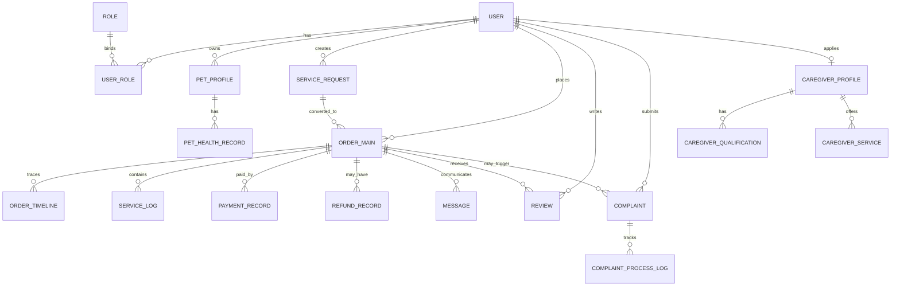

### 4.3 数据表详细设计

说明：字段类型为建议值，可在 Prisma schema 中按实际命名规范调整。

### 4.3.1 用户与认证域

#### 表：user

| 字段            | 类型         | 约束            | 说明                                 |
| --------------- | ------------ | --------------- | ------------------------------------ |
| id              | uuid         | PK              | 用户主键                             |
| phone           | varchar(20)  | unique          | 手机号                               |
| email           | varchar(128) | unique nullable | 邮箱                                 |
| password_hash   | varchar(255) | not null        | 密码哈希                             |
| status          | varchar(20)  | index           | active/disabled/locked               |
| realname_status | varchar(20)  | index           | unverified/pending/verified/rejected |
| last_login_at   | timestamptz  | nullable        | 最后登录时间                         |
| created_at      | timestamptz  | not null        | 创建时间                             |
| updated_at      | timestamptz  | not null        | 更新时间                             |

索引建议：

- unique(phone), unique(email)
- idx_user_status(status)

#### 表：role

| 字段      | 类型        | 约束         | 说明                  |
| --------- | ----------- | ------------ | --------------------- |
| id        | uuid        | PK           | 角色主键              |
| code      | varchar(30) | unique       | owner/caregiver/admin |
| name      | varchar(50) | not null     | 角色名称              |
| is_system | boolean     | default true | 是否系统角色          |

#### 表：user_role

| 字段       | 类型        | 约束         | 说明     |
| ---------- | ----------- | ------------ | -------- |
| id         | uuid        | PK           | 关联主键 |
| user_id    | uuid        | FK user.id   | 用户     |
| role_id    | uuid        | FK role.id   | 角色     |
| is_active  | boolean     | default true | 是否启用 |
| created_at | timestamptz | not null     | 创建时间 |

索引建议：

- unique(user_id, role_id)
- idx_user_role_user(user_id)
- idx_user_role_role(role_id)

#### 表：user_verification

| 字段            | 类型         | 约束       | 说明                |
| --------------- | ------------ | ---------- | ------------------- |
| id              | uuid         | PK         | 认证记录主键        |
| user_id         | uuid         | FK user.id | 用户                |
| real_name       | varchar(50)  | not null   | 真实姓名            |
| id_type         | varchar(20)  | not null   | 证件类型            |
| id_no_masked    | varchar(50)  | not null   | 脱敏证件号          |
| verify_provider | varchar(50)  | nullable   | 认证服务商          |
| verify_result   | varchar(20)  | index      | pending/pass/reject |
| reject_reason   | varchar(255) | nullable   | 拒绝原因            |
| submitted_at    | timestamptz  | not null   | 提交时间            |
| reviewed_at     | timestamptz  | nullable   | 审核时间            |

### 4.3.2 宠物档案域

#### 表：pet_profile

| 字段              | 类型         | 约束          | 说明                     |
| ----------------- | ------------ | ------------- | ------------------------ |
| id                | uuid         | PK            | 宠物主键                 |
| owner_id          | uuid         | FK user.id    | 宠物主人                 |
| name              | varchar(50)  | not null      | 宠物名                   |
| species           | varchar(20)  | index         | dog/cat/other            |
| breed             | varchar(50)  | nullable      | 品种                     |
| gender            | varchar(10)  | nullable      | 性别                     |
| birthday          | date         | nullable      | 出生日期                 |
| weight_kg         | numeric(5,2) | nullable      | 体重                     |
| neutered          | boolean      | default false | 是否绝育                 |
| temperament_tags  | jsonb        | default []    | 性格标签                 |
| feeding_note      | text         | nullable      | 喂食说明                 |
| allergy_note      | text         | nullable      | 过敏说明                 |
| medical_note      | text         | nullable      | 就诊史 / 用药 / 医疗说明 |
| emergency_contact | jsonb        | nullable      | 紧急联系人               |
| created_at        | timestamptz  | not null      | 创建时间                 |
| updated_at        | timestamptz  | not null      | 更新时间                 |

索引建议：

- idx_pet_owner(owner_id)
- idx_pet_species_breed(species, breed)

实现备注（2026-04-01 当前代码基线）：

- 当前后端已经把 `allergy_note`、`medical_note`、`emergency_contact` 直接落在 `pet_profile` 上，用于支撑主人端和 App 端的“轻量健康档案”主流程。
- `pet_health_record` 仍保留为后续可扩展设计，用于承载多条疫苗、处方、体检或附件化健康记录；当前切片尚未拆成独立子表闭环。

#### 表：pet_health_record

| 字段        | 类型         | 约束              | 说明                               |
| ----------- | ------------ | ----------------- | ---------------------------------- |
| id          | uuid         | PK                | 健康记录主键                       |
| pet_id      | uuid         | FK pet_profile.id | 宠物                               |
| record_type | varchar(20)  | index             | vaccine/allergy/disease/medication |
| title       | varchar(100) | not null          | 记录标题                           |
| content     | text         | not null          | 详情                               |
| file_urls   | jsonb        | default []        | 附件 URL                           |
| occurred_at | timestamptz  | nullable          | 发生时间                           |
| created_at  | timestamptz  | not null          | 创建时间                           |

### 4.3.3 照料者与服务域

#### 表：caregiver_profile

| 字段                    | 类型         | 约束              | 说明                      |
| ----------------------- | ------------ | ----------------- | ------------------------- |
| id                      | uuid         | PK                | 照料者主键                |
| user_id                 | uuid         | FK user.id unique | 用户映射                  |
| intro                   | text         | nullable          | 自我介绍                  |
| experience_years        | int          | default 0         | 从业年限                  |
| service_radius_km       | int          | default 5         | 服务半径                  |
| service_city            | varchar(50)  | index             | 服务城市                  |
| specialty_tags          | jsonb        | default []        | 照护专长标签              |
| service_commitment      | text         | nullable          | 服务承诺                  |
| qualification_materials | jsonb        | default []        | 资质材料摘要列表          |
| rating_avg              | numeric(3,2) | default 5.0       | 平均评分                  |
| rating_count            | int          | default 0         | 评价数                    |
| audit_status            | varchar(20)  | index             | pending/approved/rejected |
| created_at              | timestamptz  | not null          | 创建时间                  |
| updated_at              | timestamptz  | not null          | 更新时间                  |

实现备注（2026-04-01 当前代码基线）：

- 当前代码已经在 `caregiver_profile` 中落地：
  - `specialty_tags`
  - `service_commitment`
  - `qualification_materials`
- 这样可以先完成 Web/App 双端资质上传、后台审核预览和审核拦截闭环，避免在本轮继续引入新的明细表与联表复杂度。

#### 表：caregiver_qualification

| 字段          | 类型         | 约束                    | 说明                |
| ------------- | ------------ | ----------------------- | ------------------- |
| id            | uuid         | PK                      | 资质主键            |
| caregiver_id  | uuid         | FK caregiver_profile.id | 照料者              |
| cert_type     | varchar(50)  | index                   | 证书类型            |
| cert_no       | varchar(100) | nullable                | 证书编号            |
| file_url      | varchar(255) | not null                | 证书文件            |
| valid_from    | date         | nullable                | 生效日              |
| valid_to      | date         | nullable                | 到期日              |
| verify_status | varchar(20)  | index                   | pending/pass/reject |
| created_at    | timestamptz  | not null                | 创建时间            |

实现备注（2026-04-01 当前代码基线）：

- 本表仍作为后续“结构化资质档案”设计目标保留。
- 当前真实实现为了尽快形成可用闭环，先把资质材料以 JSON 摘要数组存放在 `caregiver_profile.qualification_materials` 中，并通过上传附件 `tag1=petpal-caregiver-qualification` 与照料者档案关联。
- 若后续需要补证书编号、有效期、复审记录、到期提醒与多证件类型治理，再把当前 JSON 摘要拆分到独立 `caregiver_qualification` 表。

#### 表：caregiver_service

| 字段             | 类型                   | 约束                    | 说明                                |
| ---------------- | ---------------------- | ----------------------- | ----------------------------------- |
| id               | uuid                   | PK                      | 服务项主键                          |
| caregiver_id     | uuid                   | FK caregiver_profile.id | 照料者                              |
| service_type     | varchar(30)            | index                   | boarding/walking/feeding/door_visit |
| pet_species      | varchar(20)            | index                   | dog/cat/other                       |
| price_per_unit   | numeric(10,2)          | not null                | 单价                                |
| unit_type        | varchar(20)            | not null                | hour/day/times                      |
| min_notice_hours | int                    | default 2               | 最小提前预约时长                    |
| available_slots  | jsonb                  | not null                | 可服务时段                          |
| service_geo      | geography(Point, 4326) | index                   | 服务中心点                          |
| is_active        | boolean                | default true            | 是否上架                            |
| created_at       | timestamptz            | not null                | 创建时间                            |
| updated_at       | timestamptz            | not null                | 更新时间                            |

索引建议：

- idx_caregiver_service_geo_gist(service_geo) using GIST

### 4.3.4 需求与订单交易域

#### 表：service_request

| 字段          | 类型                   | 约束              | 说明                          |
| ------------- | ---------------------- | ----------------- | ----------------------------- |
| id            | uuid                   | PK                | 需求主键                      |
| owner_id      | uuid                   | FK user.id        | 发布人                        |
| pet_id        | uuid                   | FK pet_profile.id | 宠物                          |
| service_type  | varchar(30)            | index             | 服务类型                      |
| start_time    | timestamptz            | index             | 开始时间                      |
| end_time      | timestamptz            | index             | 结束时间                      |
| location_text | varchar(255)           | not null          | 服务地点                      |
| location_geo  | geography(Point, 4326) | index             | 服务坐标                      |
| budget_amount | numeric(10,2)          | nullable          | 预算                          |
| demand_tags   | jsonb                  | default []        | 需求标签                      |
| status        | varchar(20)            | index             | open/matched/closed/cancelled |
| created_at    | timestamptz            | not null          | 创建时间                      |
| updated_at    | timestamptz            | not null          | 更新时间                      |

索引建议：

- idx_request_geo_gist(location_geo) using GIST

#### 表：order_main

| 字段               | 类型          | 约束                           | 说明                                                                                   |
| ------------------ | ------------- | ------------------------------ | -------------------------------------------------------------------------------------- |
| id                 | uuid          | PK                             | 订单主键                                                                               |
| order_no           | varchar(32)   | unique                         | 业务订单号                                                                             |
| owner_id           | uuid          | FK user.id                     | 主人                                                                                   |
| caregiver_id       | uuid          | FK caregiver_profile.id        | 照料者                                                                                 |
| service_request_id | uuid          | FK service_request.id nullable | 来源需求                                                                               |
| service_type       | varchar(30)   | index                          | 服务类型                                                                               |
| appointment_start  | timestamptz   | index                          | 预约开始                                                                               |
| appointment_end    | timestamptz   | index                          | 预约结束                                                                               |
| amount_total       | numeric(10,2) | not null                       | 应付总额                                                                               |
| amount_adjusted    | numeric(10,2) | default 0                      | 调价金额（补差价可为正）                                                               |
| amount_paid        | numeric(10,2) | default 0                      | 已付金额                                                                               |
| amount_refunded    | numeric(10,2) | default 0                      | 已退金额                                                                               |
| order_status       | varchar(30)   | index                          | pending_accept/accepted/serving/completed/cancelled/disputed/partial_refunded/refunded |
| cancel_reason      | varchar(255)  | nullable                       | 取消原因                                                                               |
| closed_at          | timestamptz   | nullable                       | 关闭时间                                                                               |
| created_at         | timestamptz   | not null                       | 创建时间                                                                               |
| updated_at         | timestamptz   | not null                       | 更新时间                                                                               |

索引建议：

- unique(order_no)
- idx_order_owner_status(owner_id, order_status, created_at desc)
- idx_order_caregiver_status(caregiver_id, order_status, created_at desc)
- idx_order_time(appointment_start, appointment_end)

#### 表：order_timeline

| 字段          | 类型        | 约束             | 说明                                                                             |
| ------------- | ----------- | ---------------- | -------------------------------------------------------------------------------- |
| id            | bigserial   | PK               | 主键                                                                             |
| order_id      | uuid        | FK order_main.id | 订单                                                                             |
| event_type    | varchar(30) | index            | created/accepted/checkin/checkout/completed/cancelled/refund_applied/refund_done |
| operator_role | varchar(20) | index            | owner/caregiver/admin/system                                                     |
| operator_id   | uuid        | nullable         | 操作人                                                                           |
| event_payload | jsonb       | nullable         | 事件详情                                                                         |
| created_at    | timestamptz | not null         | 创建时间                                                                         |

#### 表：service_log

| 字段         | 类型        | 约束                    | 说明                                   |
| ------------ | ----------- | ----------------------- | -------------------------------------- |
| id           | uuid        | PK                      | 服务日志主键                           |
| order_id     | uuid        | FK order_main.id        | 订单                                   |
| caregiver_id | uuid        | FK caregiver_profile.id | 照料者                                 |
| log_type     | varchar(20) | index                   | checkin/feed/walk/play/health/checkout |
| text_note    | text        | nullable                | 文字说明                               |
| media_urls   | jsonb       | default []              | 图片/视频                              |
| geo          | jsonb       | nullable                | 打卡坐标                               |
| happened_at  | timestamptz | index                   | 发生时间                               |
| created_at   | timestamptz | not null                | 创建时间                               |

### 4.3.5 沟通、支付、评价与投诉域

#### 表：message_session

| 字段            | 类型        | 约束                    | 说明         |
| --------------- | ----------- | ----------------------- | ------------ |
| id              | uuid        | PK                      | 会话主键     |
| order_id        | uuid        | FK order_main.id unique | 订单会话     |
| owner_id        | uuid        | FK user.id              | 主人         |
| caregiver_id    | uuid        | FK caregiver_profile.id | 照料者       |
| last_message_at | timestamptz | index                   | 最近消息时间 |
| created_at      | timestamptz | not null                | 创建时间     |

#### 表：message

| 字段         | 类型        | 约束                  | 说明                         |
| ------------ | ----------- | --------------------- | ---------------------------- |
| id           | bigserial   | PK                    | 消息主键                     |
| session_id   | uuid        | FK message_session.id | 会话                         |
| sender_role  | varchar(20) | index                 | owner/caregiver/admin/system |
| sender_id    | uuid        | nullable              | 发送方                       |
| message_type | varchar(20) | index                 | text/image/video/system      |
| content      | text        | not null              | 内容                         |
| ext          | jsonb       | nullable              | 扩展字段                     |
| created_at   | timestamptz | index                 | 发送时间                     |

#### 表：payment_record

| 字段            | 类型          | 约束             | 说明                       |
| --------------- | ------------- | ---------------- | -------------------------- |
| id              | uuid          | PK               | 支付记录主键               |
| order_id        | uuid          | FK order_main.id | 订单                       |
| pay_no          | varchar(40)   | unique           | 支付单号                   |
| biz_type        | varchar(20)   | index            | deposit/balance/adjustment |
| pay_channel     | varchar(20)   | index            | wechat/alipay/card         |
| pay_status      | varchar(20)   | index            | pending/paid/failed/closed |
| pay_amount      | numeric(10,2) | not null         | 支付金额                   |
| channel_txn_id  | varchar(80)   | unique nullable  | 三方交易流水号             |
| paid_at         | timestamptz   | nullable         | 支付时间                   |
| channel_payload | jsonb         | nullable         | 渠道回执                   |
| created_at      | timestamptz   | not null         | 创建时间                   |
| updated_at      | timestamptz   | not null         | 更新时间                   |

索引建议：

- idx_payment_order(order_id, created_at desc)
- idx_payment_order_status(order_id, pay_status)

#### 表：refund_record

| 字段              | 类型          | 约束                          | 说明                                     |
| ----------------- | ------------- | ----------------------------- | ---------------------------------------- |
| id                | uuid          | PK                            | 退款记录主键                             |
| order_id          | uuid          | FK order_main.id              | 订单                                     |
| payment_id        | uuid          | FK payment_record.id nullable | 关联支付单                               |
| refund_no         | varchar(40)   | unique                        | 退款单号                                 |
| apply_user_id     | uuid          | FK user.id                    | 发起人                                   |
| refund_type       | varchar(20)   | index                         | full/partial                             |
| refund_reason     | varchar(255)  | not null                      | 退款原因                                 |
| refund_amount     | numeric(10,2) | not null                      | 退款金额                                 |
| refund_status     | varchar(20)   | index                         | pending/approved/rejected/success/failed |
| channel_refund_id | varchar(80)   | unique nullable               | 三方退款流水号                           |
| reviewed_by       | uuid          | FK user.id nullable           | 审核人                                   |
| reviewed_at       | timestamptz   | nullable                      | 审核时间                                 |
| created_at        | timestamptz   | not null                      | 创建时间                                 |

索引建议：

- idx_refund_order(order_id, created_at desc)
- idx_refund_payment(payment_id)

#### 表：review

| 字段         | 类型        | 约束                    | 说明         |
| ------------ | ----------- | ----------------------- | ------------ |
| id           | uuid        | PK                      | 评价主键     |
| order_id     | uuid        | FK order_main.id unique | 订单         |
| owner_id     | uuid        | FK user.id              | 评价人       |
| caregiver_id | uuid        | FK caregiver_profile.id | 被评价照料者 |
| rating       | int         | check 1..5              | 星级         |
| tags         | jsonb       | default []              | 评价标签     |
| content      | text        | nullable                | 评价内容     |
| is_anonymous | boolean     | default false           | 是否匿名     |
| created_at   | timestamptz | not null                | 创建时间     |

#### 表：complaint

| 字段           | 类型         | 约束             | 说明                              |
| -------------- | ------------ | ---------------- | --------------------------------- |
| id             | uuid         | PK               | 投诉主键                          |
| order_id       | uuid         | FK order_main.id | 关联订单                          |
| complainant_id | uuid         | FK user.id       | 投诉人                            |
| target_role    | varchar(20)  | index            | caregiver/platform                |
| complaint_type | varchar(30)  | index            | safety/fee/service/fraud/other    |
| description    | text         | not null         | 投诉描述                          |
| evidence_urls  | jsonb        | default []       | 证据附件                          |
| status         | varchar(20)  | index            | open/processing/resolved/rejected |
| result_summary | varchar(255) | nullable         | 处理结论                          |
| created_at     | timestamptz  | not null         | 创建时间                          |
| closed_at      | timestamptz  | nullable         | 结案时间                          |

#### 表：complaint_process_log

| 字段         | 类型        | 约束            | 说明                                       |
| ------------ | ----------- | --------------- | ------------------------------------------ |
| id           | bigserial   | PK              | 主键                                       |
| complaint_id | uuid        | FK complaint.id | 投诉                                       |
| action_type  | varchar(30) | index           | assign/investigate/call_user/penalty/close |
| operator_id  | uuid        | FK user.id      | 处理人                                     |
| note         | text        | nullable        | 处理说明                                   |
| created_at   | timestamptz | not null        | 创建时间                                   |

### 4.3.6 平台治理与审计域

#### 表：platform_rule

| 字段         | 类型         | 约束                              | 说明                               |
| ------------ | ------------ | --------------------------------- | ---------------------------------- |
| id           | uuid         | PK                                | 规则主键                           |
| rule_code    | varchar(50)  | index                             | 规则编码，同一编码允许存在多版本   |
| rule_name    | varchar(100) | not null                          | 规则名称                           |
| rule_version | varchar(20)  | not null，unique with `rule_code` | 版本号                             |
| content_md   | text         | not null                          | 规则正文（Markdown）               |
| effective_at | timestamptz  | not null                          | 计划生效时间                       |
| status       | varchar(20)  | index                             | draft/published/archived           |
| created_by   | uuid         | FK user.id                        | 创建人                             |
| updated_by   | uuid         | FK user.id，nullable              | 最近更新人                         |
| created_at   | timestamptz  | not null                          | 创建时间                           |
| updated_at   | timestamptz  | not null                          | 更新时间                           |

补充约束说明：

- 平台规则当前采用 `(rule_code, rule_version)` 组合唯一，不再要求 `rule_code` 单字段唯一。
- 规则发布动作只把状态切到 `published`，不会自动归档旧版本；历史版本是否归档由管理员手动执行。

#### 表：operation_audit_log

| 字段          | 类型         | 约束     | 说明                         |
| ------------- | ------------ | -------- | ---------------------------- |
| id            | bigserial    | PK       | 主键                         |
| actor_id      | uuid         | nullable | 操作人                       |
| actor_role    | varchar(20)  | index    | owner/caregiver/admin/system |
| action        | varchar(100) | index    | 行为标识                     |
| resource_type | varchar(50)  | index    | 资源类型                     |
| resource_id   | varchar(64)  | nullable | 资源 ID                      |
| request_id    | varchar(64)  | index    | 请求追踪号                   |
| detail        | jsonb        | nullable | 详情                         |
| created_at    | timestamptz  | not null | 创建时间                     |

### 4.4 Redis 设计

- key:user:session:{userId}:{deviceId}：登录态与 refresh token。
- key:order:lock:{orderId}：订单状态流转分布式锁。
- key:match:caregiver:{geohash}:{serviceType}:{petSpecies}：照料者推荐缓存。
- key:rate_limit:{api}:{userId}：限流计数。
- key:verify:otp:{phone}：短信验证码。

TTL 建议：

- session：7~30 天（按登录策略）
- 匹配缓存：30~120 秒
- 短信验证码：5 分钟
- 幂等 token：10 分钟

### 4.5 关键约束与一致性策略

- 订单状态机必须单向流转，禁止逆向跳转。
- 支付回调、退款回调使用幂等键（pay_no/refund_no + channel_txn_id）去重。
- 订单允许多次支付和多次退款，但需满足 amount_paid - amount_refunded >= 0。
- 订单关闭前满足 amount_paid >= amount_total + amount_adjusted - amount_refunded。
- 投诉结案前必须存在至少一条 complaint_process_log。
- 评价必须在订单 completed 状态后创建且每单唯一。
- 删除策略：核心交易表建议逻辑删除（deleted_at），审计表仅追加不更新。

### 4.6 地理位置排序实现（PostGIS + Prisma）

- PostgreSQL 启用 PostGIS 扩展，服务与需求坐标使用 geography(Point, 4326)。
- Prisma 模型中坐标字段使用 Unsupported("geography(Point,4326)") 映射，迁移 SQL 中创建 GIST 索引。
- 距离排序通过 Prisma 的参数化原生 SQL 执行：按 ST_DistanceSphere(service_geo, :requestPoint) 升序。
- 高频列表先按城市与服务类型过滤，再执行距离排序，最终结果短缓存到 Redis。

## 5. 用户操作流程设计

### 5.1 主人端下单履约流程

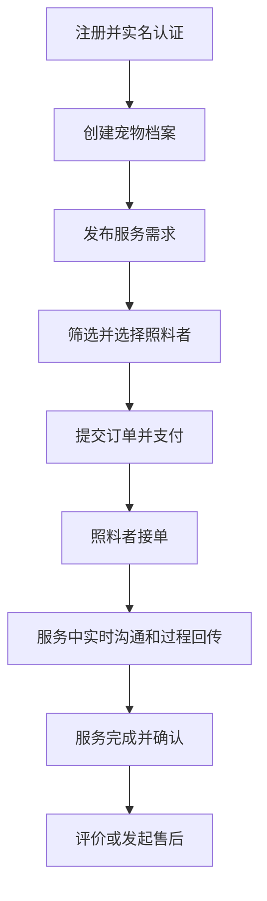

流程说明：

- 关键前置：实名认证通过、宠物档案完整。
- 支付后进入待接单状态，超时自动取消并触发退款策略。
- 服务中必须产生至少一次服务日志（特殊场景可按规则豁免）。

### 5.2 照料者端入驻接单流程

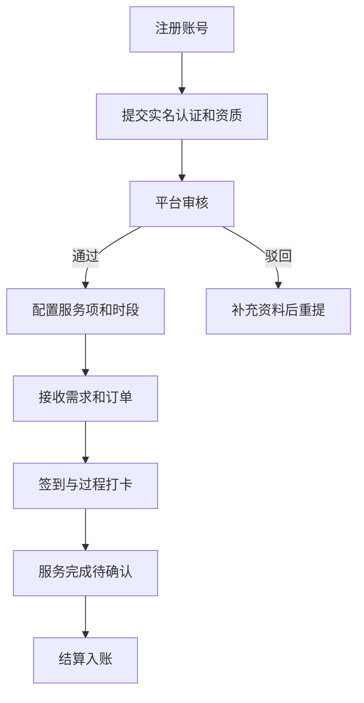

### 5.3 管理端审核与纠纷流程

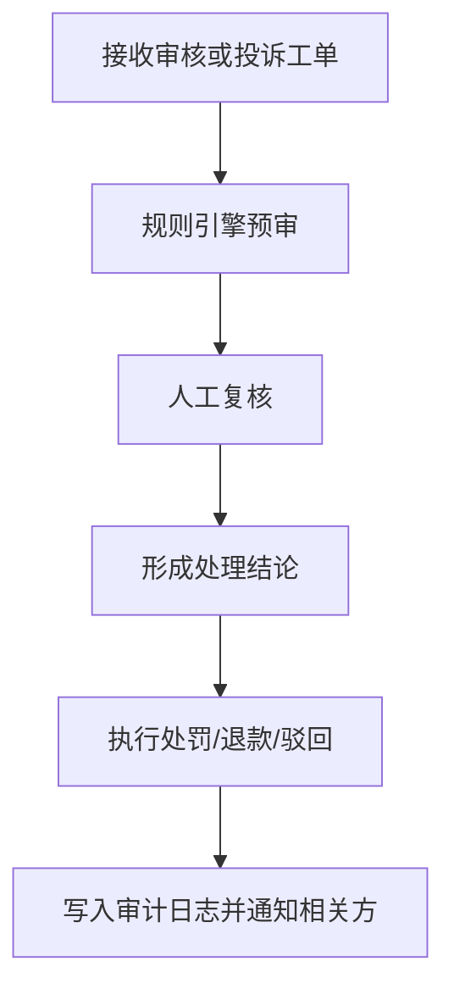

### 5.4 Web / App 页面信息架构重构原则（2026-04-01 起）

为避免继续沿用“单页堆叠全部功能”的实现方式，从 2026-04-01 起，PetPal 的前端重构遵循以下原则：

- 当前前端最高优先级不是继续追加零散功能，而是先完成 Web / App 用户操作逻辑页面的重构。
- App 端优先级高于 Web 端，且 App 端默认采用 **Material Design 3** 风格：
  - 使用 surface、elevation、阴影、层级和动效建立物理隐喻。
  - 使用统一色彩、组件规范和响应式规则形成跨设备一致体验。
- 角色优先拆分：
  - 主人端
  - 照料者端
  - 管理端
- 场景继续拆分：
  - 首页 / 工作摘要
  - 列表
  - 详情
  - 表单 / 向导
  - 沟通
  - 售后
  - 设置
- 订单详情类页面默认拆为：
  - 概览
  - 沟通
  - 服务记录
  - 售后
- App 不再允许把主人、照料者、售后、消息和账户设置都塞在一个工作台页面中。
- Web 不再允许继续把主人前台长期维持在一个超级页面里，后续按路由拆分。

详细执行方案见：

- [PetPal Web / App 体验重构执行方案](./PetPal-UX-Rebuild.md)

## 6. 数据流设计

### 6.1 下单到履约的数据流

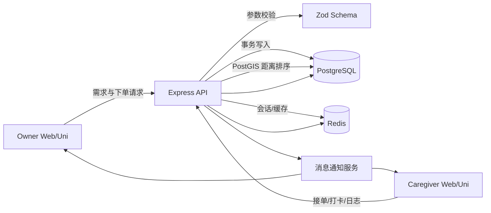

数据处理要点：

- API 层负责输入校验、鉴权、幂等控制。
- Service 层负责业务规则（状态机、价格计算、风控规则）。
- Repository/Prisma 层负责数据持久化与事务边界。

### 6.2 支付与退款数据流

- 创建支付单：order_main -> payment_record(pending, biz_type=deposit/balance/adjustment)。
- 支付回调：校验签名 -> 幂等检查 -> payment_record(paid) -> 聚合更新 order_main.amount_paid。
- 补差价：创建新的 payment_record(adjustment) 并单独走支付回调。
- 退款申请：refund_record(pending, full/partial) + order_timeline(event=refund_applied)。
- 退款回调：refund_record(success/failed) -> 聚合更新 order_main.amount_refunded -> 订单状态更新为 partial_refunded/refunded。

### 6.3 投诉处理数据流

- 投诉创建：complaint(open) + evidence_urls。
- 分配处理人：complaint_process_log(assign)。
- 调查过程：多条 process_log 连续记录。
- 结案：complaint(status=resolved/rejected) + result_summary。

## 7. API 模块划分建议

- /api/auth：登录、注册、认证、会话。
- /api/pets：宠物档案与健康记录。
- /api/caregivers：照料者资料、资质、服务项。
- /api/requests：需求发布与匹配。
- /api/orders：订单、服务日志、时间线。
- /api/payments：支付、退款、回调。
- /api/location：地理检索与附近照料者排序。
- /api/reviews：评价。
- /api/complaints：投诉与处理。
- /api/admin：审核、规则、处罚、统计。

## 8. 非功能设计

- 安全：JWT + Refresh Token，敏感字段加密/脱敏，RBAC 授权。
- 可用性：关键链路超时重试，消息通知失败补偿。
- 可观测性：request_id 全链路追踪，operation_audit_log 留痕。
- 性能：热点查询索引优化，PostGIS GIST 距离索引，匹配结果 Redis 短缓存，分页游标化。
- 体验一致性：
  - App 端采用 Material Design 3 设计体系。
  - Web 与 App 共享品牌色和核心状态语义，但按设备密度区分布局。
  - 页面、弹层、过渡动画、空态、错误态和上传反馈必须统一规范。
- 信息架构约束：
  - 一个页面只承担一个主任务。
  - 长表单优先拆为分步向导。
  - 列表、详情、执行动作和售后处理必须分层，不继续堆叠到单页。

## 9. 测试设计建议

- 单元测试：订单状态机、价格计算、退款规则、投诉流转。
- 集成测试：下单->多次支付->补差价->部分退款/全额退款主链路；投诉->处理->结案链路。
- 回归测试：认证授权边界、数据权限隔离、异常幂等。

重点新增用例：

- 同账号双身份切换后权限正确（Owner/Caregiver 菜单与数据隔离）。
- 距离排序结果稳定（同城、跨城、边界坐标）且与 Redis 缓存一致。

## 10. 迭代建议（里程碑）

- M1：账户、宠物档案、照料者入驻、基础订单。
- M2：支付退款、服务过程日志、评价投诉。
- M3：风控审计、数据看板、推荐排序优化。
- M4：多端体验与运营策略优化。

## 11. 二次审查结论与改进清单

本轮审查聚焦“可实现性、一致性、可运维性”，结论如下：

- 已收敛项：双身份模型、多次支付/补差价/部分退款并存、地理位置排序。
- 仍需落地项：Prisma migration 中 PostGIS 扩展 SQL、支付退款聚合更新的事务边界、身份切换的审计日志。

### 11.1 重点风险与处理建议

| 风险点                                       | 影响           | 建议                                                               |
| -------------------------------------------- | -------------- | ------------------------------------------------------------------ |
| 地理字段使用 PostGIS，但未在迁移脚本启用扩展 | 上线后查询失败 | 在首个迁移中执行 `CREATE EXTENSION IF NOT EXISTS postgis;`         |
| 订单金额聚合在并发回调下可能被覆盖           | 金额错账       | 采用数据库事务 + 行级锁（`FOR UPDATE`）+ 幂等键                    |
| 多身份切换仅在前端切状态                     | 越权风险       | 后端基于 user_role 与 activeRole 双重校验并写审计日志              |
| 多次退款可能超过已支付金额                   | 财务风险       | 增加 `CHECK (amount_paid - amount_refunded >= 0)` 与服务层二次校验 |
| 消息通知服务未定义失败补偿策略               | 通知丢失       | 建立 outbox 表 + 重试任务 + 死信告警                               |

### 11.2 规则落地优先级

1. P0：支付退款聚合事务化、幂等化。
2. P0：PostGIS 扩展与 GIST 索引迁移落地。
3. P1：双身份鉴权链路与审计日志。
4. P1：消息 outbox 重试机制。
5. P2：排序策略 A/B（距离优先 vs 评分优先）可配置化。

## 12. 图表附录（Mermaid）

### 12.1 用户交互时序图（下单到履约）

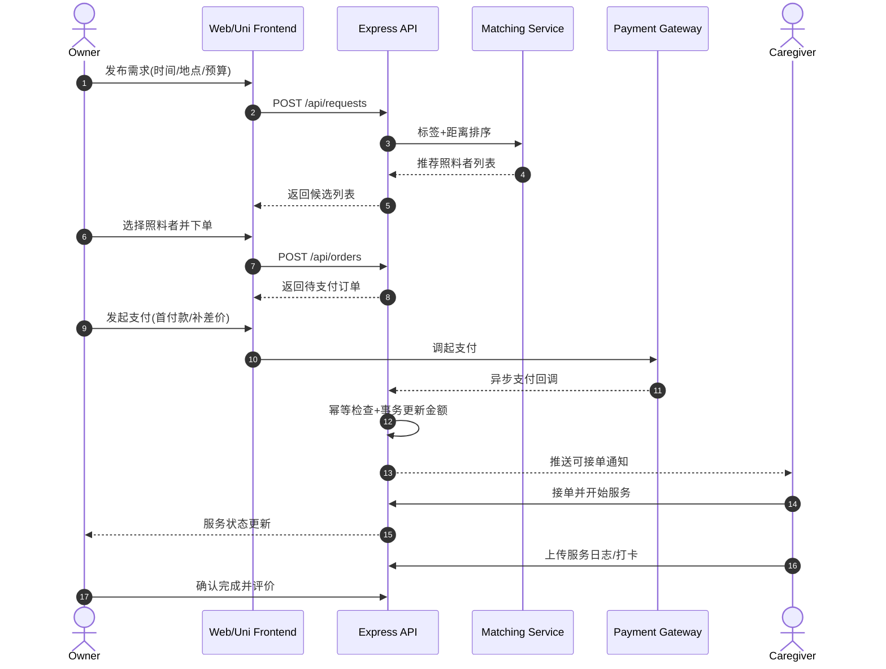

### 12.2 业务逻辑分层图

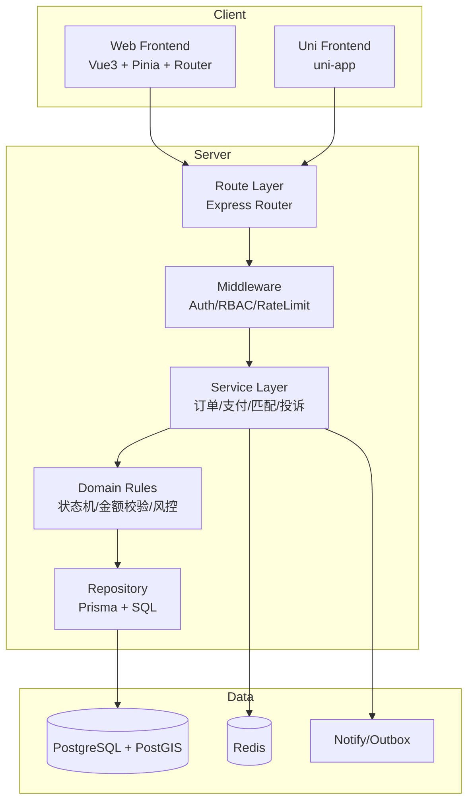

### 12.3 订单状态机图

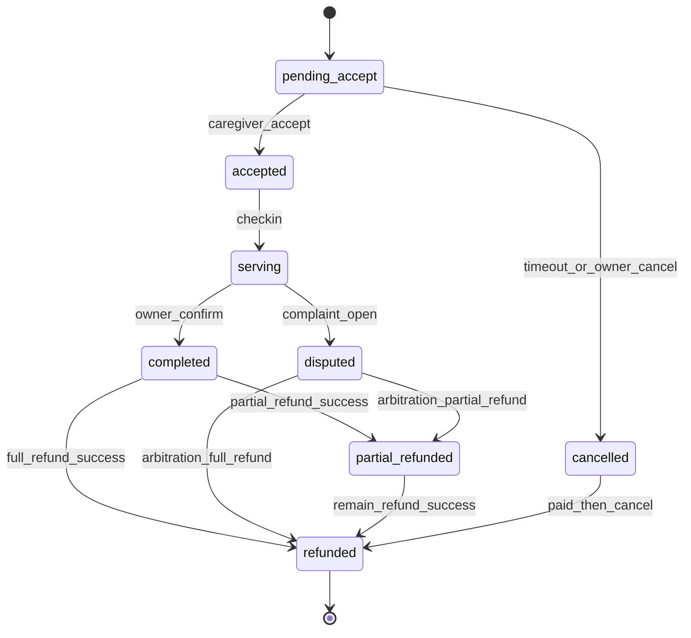

### 12.4 支付与退款状态机图

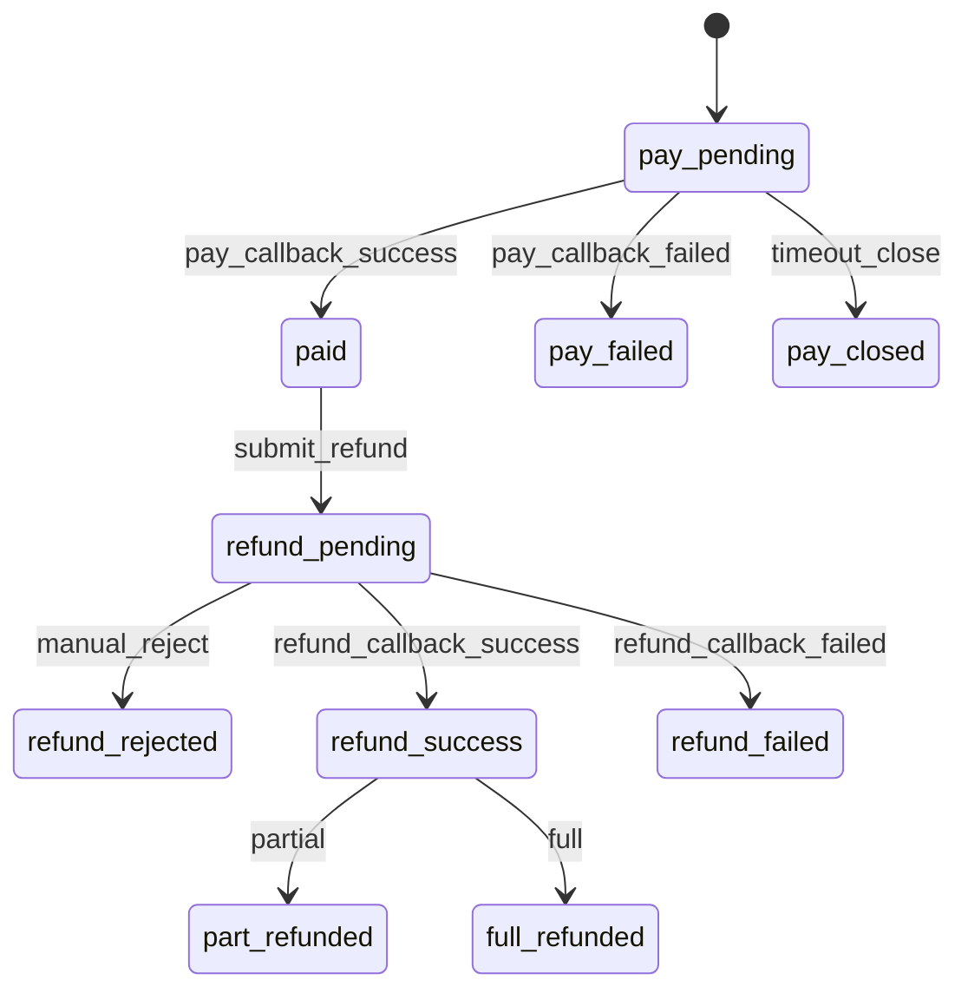

### 12.5 RBAC 权限决策流程图

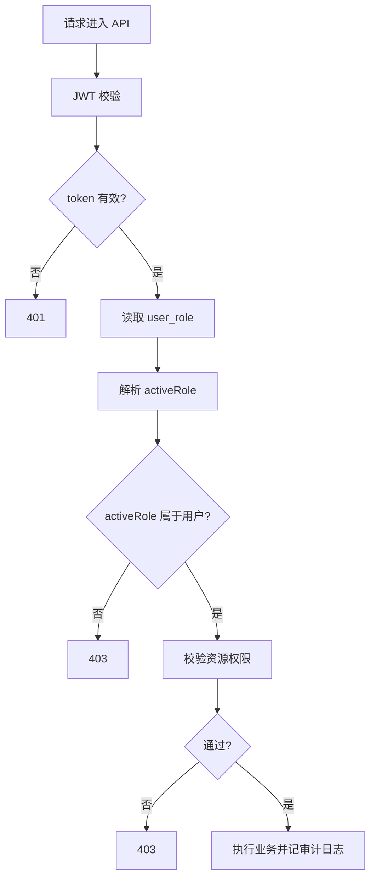

### 12.6 地理匹配与排序流程图

### 12.7 部署与可观测性图

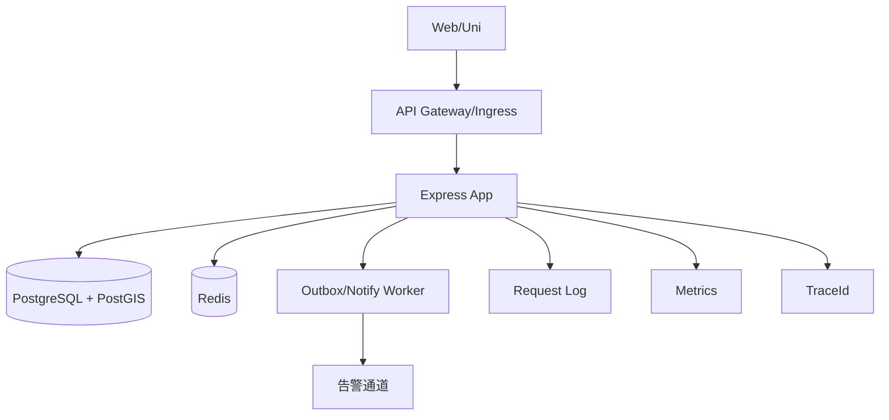

## 13. 完整开发计划（执行版，按当前实现基线重排）

本章以当前仓库真实状态为基线重排后续开发工作。目标不是继续堆功能点，而是在论文要求、产品闭环、代码质量、可测试性和可答辩性之间形成一份可执行的完整交付计划。

### 13.1 当前完成基线

截至当前代码基线，已完成内容如下：

- 主人端最小闭环：
  - 宠物档案查询/创建。
  - 服务需求发布与列表。
  - 照料者匹配与附近排序的最小接口。
  - 订单列表、订单详情、支付/退款分录展示。
- 支付回调治理：
  - 支付/退款回调鉴权。
  - 回调审计持久化、查询、统计、导出。
  - 失败告警 outbox、死信重放、replay log、风险信号。
- 照料者入驻第一阶段：
  - 照料者档案维护。
  - 服务项创建与更新。
  - 管理端审核动作与审核台页面。

仍未完成或仅完成最小形态的内容如下：

- activeRole 身份中心、双身份切换审计、身份级菜单/数据隔离的完整前后端闭环。
- 主动提醒、统一消息聚合与通知管理。
- 更细的经营数据、更多账户辅助页与帮助体系。
- 评价、投诉、售后处理进度、交易记录导出等用户反馈闭环。
- 管理端纠纷处理、违规处罚、规则发布、运营看板与导出。
- Uni 端对售后反馈、收益和更多治理辅助场景的补齐。
- 论文答辩所需的完整测试证据、演示脚本、截图和图表素材。

### 13.2 总目标与完成定义

总目标：在不回退既有支付治理与审计能力的前提下，完整实现开题文档所要求的三端业务功能，并形成可验收、可审计、可测试、可演示的毕业设计成果。

项目完成必须同时满足以下条件：

1. 主人端、照料者端、管理端核心功能全部可演示，不存在只写接口未接前端的关键缺口。
2. 核心数据模型、迁移、seed、RBAC 权限、菜单、审计日志同步完成。
3. Web 与 Uni 均可完成至少一条“真实业务主流程”。
4. 支付、退款、状态机、投诉处理、审核动作均具备可追踪审计。
5. PetPal 相关共享契约、后端接口、页面、测试和文档保持一致。
6. 定向集成测试、关键单测、前端 lint/build/type-check 和手工验收全部通过。
7. 发布门禁、回滚策略、风险清单、论文素材和答辩脚本均已准备。

### 13.2.1 当前开发优先级（只按优先级执行）

当前开发顺序不再按日期排，而是严格按优先级推进：

#### P1：App 用户操作逻辑页面全量重构

- 这是当前最高优先级。
- 目标是把移动端从“单页聚合工作台”重构为“按角色、场景、任务拆分”的真实应用。
- 当前已完成：
  - `pages/petpal/index` 角色入口重构
  - `pages/petpal/owner-home` 主人首页
  - `pages/petpal/pets` 宠物档案页
  - `pages/petpal/request` 需求发布页
  - `pages/petpal/orders` 主人订单列表
  - `pages/order-detail/index` 概览 / 沟通 / 履约 / 售后分段视图
- P1 当前结论：
  - 主人主流程拆分已完成
  - 已进入 P2，继续收口照料者、消息、售后与账户辅助页
- 必须优先完成：
  - 主人首页
  - 宠物中心
  - 需求向导
  - 主人订单列表
  - 订单详情的概览 / 沟通 / 服务记录 / 售后拆分

#### P2：App 照料者、消息、售后与账户体系收口

- 在 P1 完成后立即推进。
- 当前已完成：
  - 照料者首页
  - 收益与表现页
  - 入驻中心
  - 服务管理
  - 履约订单
  - 跨订单消息中心
  - 提醒中心
  - 通知中心
  - 起步向导与角色切换辅助页
  - 首页 / 角色入口 / 主人页 / 照料者页主动催办信号卡
- 重点补齐：
  - 评价 / 投诉 / 售后页
  - 收益中心
  - 资料 / 设置 / 帮助页
  - 系统级主动提醒 / 推送触达
  - 更深的动态 onboarding / 角色切换联动

#### P3：Web 用户操作逻辑页面重构

- 把主人与照料者前台从超级页面拆成清晰路由和页面层级。
- 新增功能只能落在新页面结构上，不再继续堆到旧页面中。

#### P4：业务缺口与治理能力补完

- 在新的 Web / App 页面结构上补齐剩余能力：
  - activeRole 身份中心完整闭环
  - 跨订单消息中心与主动提醒
  - 健康记录独立域
  - 收益分析
  - 规则发布
  - 违规处罚
  - 运营看板

#### P5：测试、审计、验收与答辩材料收口

- 定向集成测试
- 前端构建与类型检查
- 手工验收脚本
- 截图、图表、演示脚本和论文材料

执行约束：

- App 端默认采用 Material Design 3 风格与交互体系。
- Web 与 App 的 UX 设计都以“直观完成核心任务”为目标，而不是追求入口堆叠。
- 若页面结构与体验架构尚未重构完成，不优先继续追加边缘功能。
- 如果按未来一天内冲刺开发，必须先做完 `P1`，`P1` 未完成前不得展开 `P2` 及以下的大范围开发。

### 13.3 优先级开发计划

| 优先级 | 主题                                | 目标                                                             | 输出                           | 完成判定                                              |
| ------ | ----------------------------------- | ---------------------------------------------------------------- | ------------------------------ | ----------------------------------------------------- |
| P0     | 已完成基线                          | 保持现有回调治理、主人最小闭环、照料者入驻审核、订单消息基线稳定 | 现有代码、测试、文档           | 不回退已有能力                                        |
| P1     | App 主人主流程重构                  | 完成主人主流程页面拆分和订单详情分视图                           | App 新页面、导航、交互基线     | App 不再以单一超级页承载主人主流程                    |
| P2     | App 照料者 / 消息 / 售后 / 账户收口 | 完成照料者工作流、消息中心、售后页与账户页拆分                   | App 子页面、状态反馈、动效规则 | App 主人和照料者两条主流程都可独立完成                |
| P3     | Web 前台页面拆分                    | 将 Web 主人 / 照料者前台按路由拆分，弱化超级页面                 | Web 路由、新页面、兼容跳转     | Web 前台不再依赖 `PetPalOwnerView.vue` 承载完整业务树 |
| P4     | 业务缺口与治理补完                  | 补齐身份中心、跨订单消息、健康域、收益分析、规则治理和运营看板   | 模型、接口、页面、治理能力     | 剩余核心功能域不再存在明显空白                        |
| P5     | 审计、测试与答辩材料                | 完成定向测试、代码审计、手工验收和论文素材收口                   | 测试报告、风险清单、素材包     | 项目进入可验收、可答辩状态                            |

约束说明：

- 任一更高优先级未完成前，不启动更低优先级的大范围开发。
- 任一优先级都必须具备“代码、测试、文档、进度记录”四项交付物，缺一视为未完成。

### 13.4 功能域覆盖矩阵

| 功能域       | 必交功能                                                                           | 当前状态                                                         | 目标优先级 |
| ------------ | ---------------------------------------------------------------------------------- | ---------------------------------------------------------------- | ---------- |
| 账户与身份   | 登录/注册、实名状态、Owner/Caregiver 双身份、activeRole 审计、设备与安全设置基础态 | 部分完成                                                         | P2         |
| 宠物档案     | 基础档案、健康记录、习惯配置、紧急联系人                                           | 最小闭环已完成，健康域未完整                                     | P1         |
| 照料者入驻   | 档案、资质、服务设置、审核状态、审核动作                                           | 基本完成                                                         | P2         |
| 需求与匹配   | 发布需求、筛选、排序、地理距离、推荐缓存                                           | 最小闭环已完成，策略未完善                                       | P1         |
| 订单与履约   | 接单、签到、服务日志、完成确认、超时处理、时间线                                   | 基本完成，超时治理未完善                                         | P2         |
| 消息与回传   | 订单会话、图文消息、过程媒体、未读数                                               | 基本完成，跨订单聚合、提醒中心和通知中心已完成，仍缺系统主动通知 | P2         |
| 支付与退款   | 多次支付、补差价、部分退款、回调审计、对账                                         | 核心已完成                                                       | P4         |
| 评价与投诉   | 评价、标签、投诉、处理日志、仲裁结论                                               | 基本完成，售后中心、帮助体系和通知收口已落地，仍缺更主动触达     | P2         |
| 管理治理     | 审核台、纠纷处理、违规处罚、规则发布、指标看板                                     | 规则发布、违规处罚、处罚模板、整改材料回传与复核、单次申诉审核基础闭环已完成，深度看板与用户侧 / 多次申诉链路仍待补齐 | P4         |
| 可观测与审计 | request_id 串联、关键动作审计、导出留痕                                            | 部分完成                                                         | P5         |

### 13.5 P1-M2：接单履约闭环

目标：形成“支付成功 -> 照料者接单 -> 到店/到家签到 -> 服务日志 -> 完成确认”的可运行主链路。

#### 13.5.1 数据与模型

1. 校准 `order_main` 状态机，明确 `pending_accept / accepted / serving / completed / cancelled / disputed` 的合法迁移。
2. 落实 `service_log` 与 `order_timeline` 的实际 Prisma 模型、迁移、索引与 seed。
3. 如签到与签退需要单独约束，补充 `checkinAt / checkoutAt` 或事件型日志字段。

#### 13.5.2 后端任务

1. 新增照料者订单工作台接口：
   - 我的待接单列表。
   - 我的服务中订单列表。
   - 我的历史订单列表。
2. 新增订单动作接口：
   - 接单。
   - 拒单/取消。
   - 签到。
   - 新增服务日志。
   - 签退。
   - 主人确认完成。
3. 增加状态守卫：
   - 禁止状态逆行。
   - 禁止重复签到/重复签退。
   - 禁止非订单相关人操作。
4. 补充 timeout timer：
   - 超时未接单。
   - 超时未签到。
   - 服务完成待确认提醒。
5. 关键动作写入：
   - `order_timeline`
   - `RequestRecord/Operation`
   - PetPal 业务审计字段（必要时）

#### 13.5.3 前端任务

Web：

1. 新增照料者订单工作台页面。
2. 在订单详情页接入接单、签到、服务日志、签退、完成确认操作。
3. 补齐状态胶囊、空态、错误态、禁用态与重复提交防护。

Uni：

1. 新增照料者订单列表页与订单详情页动作区。
2. 支持移动端签到、服务日志上传与过程照片回传。
3. 补齐弱网重试、上传失败提示和返回后列表刷新。

#### 13.5.4 验收标准

1. 主路径通过：支付成功 -> 接单 -> 签到 -> 两次服务日志 -> 签退 -> 主人确认完成。
2. 异常路径通过：重复签到、越权写日志、状态逆行、超时未接单。
3. Web 与 Uni 至少各完成一条履约主路径。

### 13.6 P1-M3：用户反馈与售后闭环

目标：完成“评价、投诉、退款进度、交易记录导出”的用户反馈闭环。

#### 13.6.1 数据与模型

1. 落实 `review`、`complaint`、`complaint_process_log` 模型与迁移。
2. 如交易导出需要单独聚合视图，增加导出 DTO 或数据库查询视图。
3. 统一投诉状态与退款状态枚举，避免前后端枚举漂移。

#### 13.6.2 后端任务

1. 评价接口：
   - 提交评价。
   - 查询我的评价。
   - 查询照料者被评价记录。
2. 投诉接口：
   - 发起投诉。
   - 查询我的投诉与进度。
   - 查询订单关联投诉。
3. 交易导出：
   - 主人端 1 年内交易记录导出。
   - 退款进度明细导出。
4. 售后进度接口：
   - 退款申请详情。
   - 投诉处理进度时间线。
5. 权限与审计：
   - 导出权限单独控制。
   - 投诉/售后关键动作写审计日志。

#### 13.6.3 前端任务

Web：

1. 订单完成后评价弹窗与评价列表。
2. 投诉发起页、投诉进度页、交易导出入口。
3. 退款与投诉状态在订单详情页可追踪展示。

Uni：

1. 订单完成后评价入口。
2. 投诉提交与进度页。
3. 交易记录查询与导出说明页。

#### 13.6.4 验收标准

1. 一单只能评价一次，未完成订单禁止评价。
2. 投诉创建后，用户可看到处理进度时间线。
3. 导出接口具备权限、审计和文件下载回归测试。

### 13.7 P1-M4：管理治理闭环

目标：完成管理员视角的审核、纠纷、处罚、规则和看板闭环。

#### 13.7.1 后端任务

1. 投诉处理与仲裁接口：
   - 分配处理人。
   - 写入调查记录。
   - 形成结论。
   - 处罚/驳回/退款联动。
2. 违规治理接口：
   - 违规记录。
   - 处罚动作。
   - 整改状态。
   - 整改材料回传与复核。
3. 规则管理接口：
   - 草稿、发布、归档。
   - 生效时间与版本管理。
4. 运营指标接口：
   - 供需比。
   - 完单率。
   - 退款率。
   - 投诉率。
   - 审核通过率。
5. 审核台补强：
   - 时间范围筛选。
   - 导出。
   - 审核动作留痕。

#### 13.7.2 前端任务

Web 控制台：

1. 纠纷处理台。
2. 违规处理台。
3. 平台规则发布页。
4. 运营看板 PetPal 模块。
5. 审核台导出与高级筛选。

#### 13.7.3 验收标准

1. 审核、仲裁、处罚、规则发布四类动作均有独立权限码。
2. 管理端关键列表支持分页、筛选、导出和审计留痕。
3. 指标看板与数据库统计口径一致。

### 13.8 P2-M1：多端补齐与体验收口

目标：在新的页面信息架构基础上补齐多端体验，避免继续在旧超级页面上追加功能。

#### 13.8.1 功能补齐

1. 身份中心：
   - Owner/Caregiver 切换 UI。
   - activeRole 切换后菜单、数据、按钮同步切换。
   - 切换动作落审计。
2. 消息与媒体：
   - 跨订单消息聚合页。
   - 站内提醒 / 推送补偿。
   - 未读汇总与快捷跳转。
3. 宠物健康域补齐：
   - 疫苗、过敏、疾病、用药记录。
4. 空态与错误态：
   - 无数据、越权、网络异常、处理中、导出中、上传失败。

#### 13.8.2 体验收口

1. Web 与 Uni 页面文案统一收敛。
2. 履约和售后主流程全部补充操作确认和成功/失败反馈。
3. App 端动效、按钮层级、列表到详情过渡、弹层交互遵循 Material Design 3 规则。
4. 演示路径统一成“主人端一条线、照料者端一条线、管理端一条线”。

### 13.9 代码审计机制

代码审计不是发布前一次性动作，而是每个里程碑必须完成的门禁。

#### 13.9.1 审计范围

1. Schema 审计：
   - Prisma schema、migration SQL、seed 数据一致。
   - 枚举值、索引、外键、唯一约束与代码逻辑一致。
2. 权限审计：
   - 所有新增接口具备 `authMiddleware`、`requirePermission(...)` 或明确匿名边界。
   - activeRole 不可只在前端切换，后端必须校验。
3. 事务与幂等审计：
   - 支付、退款、接单、签到、仲裁等关键写操作必须事务化。
   - 重复回调、重复提交、重放场景必须可幂等。
4. 契约审计：
   - `packages/api-common` 与后端响应结构一致。
   - Web/Uni 不直接依赖隐式字段。
5. 前端权限与展示审计：
   - 按钮显隐与后端权限一致。
   - 管理端导出权限不可与读取权限混用。
6. 文档审计：
   - `PetPal.md`、模块文档、测试文档、进度日志同步更新。

#### 13.9.2 审计执行要求

1. 每个 PR 至少 1 名后端 reviewer。
2. 任何跨端改动至少 1 名后端 reviewer + 1 名前端 reviewer。
3. 任何 migration、权限、支付、退款、仲裁相关改动必须附带审计结论。
4. 审计阻塞项未清零前不得合并。

#### 13.9.3 审计输出物

- 代码审核结论。
- 阻塞问题列表。
- 风险清单更新。
- 必要时附接口变更说明和回滚说明。

### 13.10 测试计划与功能验证

测试分为五层，缺任一层都不视为“功能完全实现”。

#### 13.10.1 单元测试

覆盖以下高风险规则：

1. 订单状态机迁移。
2. 金额聚合与补差价计算。
3. 退款上限校验。
4. activeRole 校验与身份切换。
5. 距离排序和二次排序逻辑。

#### 13.10.2 框架/服务级测试

1. 请求审计与事务回滚。
2. Outbox 重试与 replay 行为。
3. 导出文件生成。
4. 上传回调与失败补偿。

#### 13.10.3 集成测试

以 `apps/backend/test/integration/petpal-api.test.ts` 为主线扩展，必须覆盖：

1. 宠物档案 -> 需求发布 -> 匹配 -> 下单。
2. 多次支付 -> 补差价 -> 部分退款 -> 全额退款。
3. 照料者入驻 -> 审核 -> 服务设置 -> 接单 -> 签到 -> 服务日志 -> 完成。
4. 评价 -> 投诉 -> 管理端处理 -> 结案。
5. activeRole 越权、导出越权、审核越权、仲裁越权。

#### 13.10.4 前端验证

Web：

1. `pnpm --filter @rbac/web-frontend lint`
2. `pnpm --filter @rbac/web-frontend build`

Uni：

1. `pnpm --filter @rbac/app-frontend type-check`
2. 关键页面手工 smoke test（登录、身份切换、履约、投诉、评价）。

共享层：

1. `pnpm --filter @rbac/api-common build`

后端：

1. `pnpm --filter @rbac/backend lint`
2. `pnpm --filter @rbac/backend test`
3. `pnpm --filter @rbac/backend exec node --import tsx --test --test-concurrency=1 test/integration/petpal-api.test.ts`

#### 13.10.5 手工功能验收脚本

至少完成以下 8 条手工脚本：

1. 主人端注册、建宠物档案、发布需求、选择照料者并下单。
2. 支付成功后，照料者接单与签到。
3. 服务中新增日志与图片回传。
4. 主人确认完成并评价。
5. 主人发起投诉并查看处理进度。
6. 管理员审核照料者并导出审核列表。
7. 管理员处理投诉并形成仲裁结果。
8. 导出交易记录、审计记录或运营指标。

### 13.11 发布与回滚门禁

发布前必须全部通过：

1. migration dry-run。
2. seed 幂等验证。
3. 共享层构建通过。
4. 后端 lint/test 通过。
5. Web lint/build 通过。
6. Uni type-check 通过。
7. PetPal 定向集成测试通过。
8. 手工 smoke test 全通过。
9. 文档、风险清单、进度日志同步。

回滚策略：

1. 应用回滚使用上一稳定镜像。
2. 数据问题优先前向修复，不执行 destructive rollback。
3. 回调、仲裁、导出、处罚等已产生审计的数据不得回滚删除。

### 13.12 当前风险追踪表（持续更新）

| 编号  | 风险描述                             | 风险优先级 | 负责人角色 | 状态                                                               | 目标优先级 |
| ----- | ------------------------------------ | ---------- | ---------- | ------------------------------------------------------------------ | ---------- |
| R-001 | 支付并发回调导致金额聚合竞态         | P0         | 后端       | Mitigated（Serializable + Retry）                                  | P0         |
| R-002 | PostGIS 迁移在不同环境不一致         | P0         | 后端/运维  | Open                                                               | P5         |
| R-003 | activeRole 被篡改导致越权访问        | P0         | 后端       | Mitigated（Server-side Validation 基线已具备，前端身份中心待补齐） | P2         |
| R-004 | 履约状态机缺少完整守卫导致状态逆行   | P1         | 后端       | Open                                                               | P2         |
| R-005 | 投诉/仲裁流程缺乏统一规则版本与审计  | P1         | 后端/产品  | Open                                                               | P4         |
| R-006 | Uni 端关键流程缺失导致答辩演示不完整 | P1         | 前端       | Open                                                               | P1         |
| R-007 | 多端导出、权限与审计边界可能不一致   | P1         | 全栈       | Open                                                               | P5         |
| R-008 | 排序策略切换后指标回落               | P2         | 产品/后端  | Open                                                               | P4         |

### 13.13 优先级执行序列图

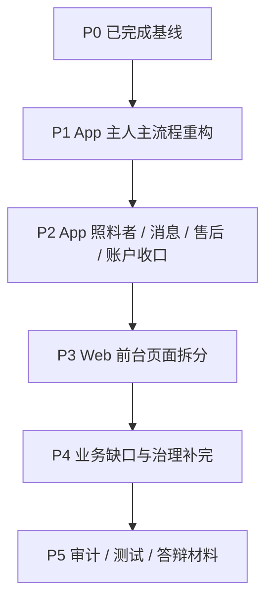

执行规则：

- 只允许按 `P1 -> P2 -> P3 -> P4 -> P5` 顺序推进。
- 如果未来一天内集中冲刺开发，最低要求是先完成 `P1`，再视剩余精力进入 `P2`。

### 13.14 当前真实进度复盘与后续安排（2026-04-01）

本节用于覆盖“文档计划”与“实际代码基线”之间的差异，结论以当前仓库代码、后端路由、前端页面和已存在测试为准，而不是以早期计划表为准。

评估口径：

- 已提交切片和当前主工作区代码均纳入检查范围。
- 未经过验证和提交的工作区改动只能记为“进行中”，不能记为“已完成交付”。
- 完成度按毕业设计“真实可演示、可审计、可测试”的标准估算，不按接口数量估算。

当前完成度估算：

| 维度       | 当前判断 | 说明                                                                                                                                                                                     |
| ---------- | -------- | ---------------------------------------------------------------------------------------------------------------------------------------------------------------------------------------- |
| 后端能力   | 约 85%   | 主人端、照料者端、售后、回调治理和后台治理核心接口已具备                                                                                                                                 |
| Web 端     | 约 80%   | 主人服务台、订单详情、退款/投诉、PetPal 后台治理工作区已基本成型                                                                                                                         |
| App 端     | 约 83%   | 主人与照料者核心流程页面已拆开，并完成 Material 3 设计基线、角色入口、起步向导、资料/设置/帮助/账户支持、提醒/通知与应用内主动催办信号等关键入口统一；仍缺系统级主动推送与更深的动态引导 |
| 测试与审计 | 约 75%   | 后端 PetPal 集成测试较完整，前端仍缺统一收口验证与验收材料                                                                                                                               |
| 整体项目   | 约 83%   | 已明显超出最小原型，App 主流程和体验基线更完整，但仍未达到文档定义的完整交付态                                                                                                           |

当前真实状态汇总：

| 功能域         | 当前状态 | 说明                                                                                                                               |
| -------------- | -------- | ---------------------------------------------------------------------------------------------------------------------------------- |
| 账户与身份     | 部分完成 | 登录注册、基础权限、activeRole 基线已具备，但双身份中心、切换审计和身份级隔离前端体验仍未完全收口                                  |
| 宠物档案       | 部分完成 | 基础建档、列表、需求挂接已完成；健康记录、精细化习惯信息仍未形成完整前后端闭环                                                     |
| 需求与匹配     | 基本完成 | 主人端发布需求、匹配照料者、订单关联已具备；推荐策略和体验层还可继续增强                                                           |
| 照料者入驻     | 基本完成 | 档案、服务项、审核状态、后台审核页已具备；资质实体化、材料上传和运营导出仍有缺口                                                   |
| 履约链路       | 基本完成 | 接单、签到、服务日志、签退、确认完成已落地到后端、Web 和 App；超时治理与收益联动仍未补齐                                           |
| 支付与退款     | 基本完成 | 支付/退款记录、回调审计、退款进度、导出能力已具备                                                                                  |
| 评价与投诉     | 基本完成 | Web 端已支持评价、投诉、售后时间线；App 端也已具备订单详情提交、独立售后中心、帮助体系、提醒与通知收口能力，但仍缺更主动的系统触达 |
| 管理后台       | 基本完成 | 根级 `/petpal-admin/*` 已承载投诉、违规处罚、整改材料回传与复核、处罚模板、单次处罚申诉审核、照料者审核、回调审计、告警队列、规则治理；更深运营看板与用户侧 / 多次申诉仍未补齐 |
| 消息与在线沟通 | 基本完成 | 订单详情会话、附件回传、跨订单消息中心、未读态、提醒中心、通知中心和 Web/App 摘要已落地；仍缺系统级主动提醒、推送与后台触达        |
| 收益与数据分析 | 部分完成 | App 已补收益与表现页，可基于订单聚合看净收入、评分和售后风险；后端专门统计接口与平台运营指标仍未完整实现                           |
| 文档与答辩材料 | 部分完成 | 计划、进度日志和实现历史持续更新中，但完整验收脚本、截图、演示素材尚未收齐                                                         |

已与文档目标基本对齐的部分：

- 主人端最核心的“宠物 -> 需求 -> 匹配 -> 订单 -> 售后”数据链已经落地。
- 照料者履约动作与状态机已经在后端和 Web 端形成闭环。
- 回调审计、失败告警 outbox、重放记录、后台值班能力已明显超出开题最小要求。
- 后台入口已经从模板式菜单依赖迁到根级 PetPal 工作区，更符合当前产品方向。

仍然存在的关键缺口：

1. `app-frontend` 已形成真实可用的 PetPal 主应用骨架，帮助中心、账户支持、提醒中心、通知中心、起步向导和应用内主动催办信号已落地，但系统级主动触达与更深的动态引导仍未收口。
2. Web 前台仍存在超级页面承载过多逻辑的问题，主人 / 照料者前台尚未按路由充分拆分。
3. 提醒中心与通知中心已落地，但真正的系统主动提醒、推送和更强的售后/消息到达能力仍未完成。
4. 健康记录、资质材料、收益分析纵深、用户侧 / 多次处罚申诉链路、整改材料附件化与审核队列和更深的运营看板仍缺完整前后端闭环；规则发布、处罚模板、处罚整改、整改材料回传与复核、单次申诉审核已补齐基础闭环。
5. 统一验收层尚未收口，前端定向验证、人工验收脚本、论文素材还不够完整。

当前工作区进行中但尚未完成交付的内容：

- App 端下一步准备继续补系统级主动提醒、推送触达和跨角色动态引导，不再继续扩大旧兼容工作台；应用内主动催办已先作为过渡方案落地。
- Web 前台下一步准备把主人 / 照料者超级页面按路由拆分，避免新功能继续堆到旧页面。

后续安排：

#### 第一优先级：Web / App 用户操作逻辑页面重构

1. App 端优先，以 Material Design 3 为设计标准，完成按角色与场景拆页：
   - 主人首页
   - 宠物中心
   - 需求向导
   - 主人订单列表
   - 订单概览 / 沟通 / 服务记录 / 售后
   - 照料者首页
   - 入驻中心
   - 服务管理
   - 照料订单与履约详情
   - 消息中心
   - 资料与设置
2. Web 前台紧随其后，按路由拆分主人 / 照料者前台，不再继续把功能堆在超级页面。
3. 所有新功能都必须优先落在新的页面结构上，不再继续扩张旧页面。

#### 第二优先级：在新页面结构上补齐业务缺口

1. 完成消息与沟通闭环：
   - 订单会话
   - 图文过程沟通
   - 未读数与消息提醒
2. 补齐健康记录、资质材料、收益分析和平台运营指标。
3. 继续补齐后台“用户侧 / 多次处罚申诉、整改材料附件化与审核队列 / 运营看板深化”能力，并在已落地的规则治理、处罚模板、处罚整改、整改材料回传与复核、单次申诉审核基础上完成从工单治理到平台治理的升级。

#### 第三优先级：验收收口

1. 按功能域执行定向测试，不做无差别全量跑。
2. 形成代码审计结论、功能验收脚本、截图、论文图表和答辩演示路径。
3. 将“文档计划、实现代码、测试结果、提交历史”四条线重新对齐，避免最终交付时出现文档与代码脱节。

### 13.15 本轮大迭代完成情况（2026-04-01）

在 13.14 所列“当前工作区进行中”基础上，本轮已经把其中两项真正落成代码：

- Web 端“PetPal 后台默认落点统一逻辑”已经完成，不再是进行中状态。
- App 端 `pages/petpal/index` 和 `pages/order-detail/index` 已经完成一轮真实工作流重构，不再只是只读看板。

本轮完成内容：

- `web-frontend`
  - 抽出 `utils/admin-entry.ts`，统一 `/console` 与 `/petpal-admin` 的默认落点判断。
  - 登录完成、控制台返回总览、路由守卫、实时权限同步全部改为复用统一判断逻辑。
  - 当用户仅具备 PetPal 后台治理权限时，会优先进入根级 `/petpal-admin`，而不是再回到菜单式控制台主页。
- `app-frontend`
  - `pages/petpal/index` 已重构为“主人工作台 + 照料者工作台”双模式页面。
  - 主人侧已具备：宠物建档、需求发布时间范围选择、需求标签填写、订单跟进、照料者推荐刷新。
  - 照料者侧已具备：档案维护、服务配置新增/编辑、履约订单筛选、接单、签到、服务记录、签退。
  - `pages/order-detail/index` 已补齐主人动作：确认完成、提交评价、发起投诉，并保留原有退款/投诉/履约时间线查看能力。

更新后的完成度判断：

| 维度     | 上一轮判断 | 本轮判断 | 说明                                                     |
| -------- | ---------- | -------- | -------------------------------------------------------- |
| Web 端   | 约 80%     | 约 82%   | 后台默认落点、权限回退与 PetPal 根级后台入口已进一步收口 |
| App 端   | 约 50%     | 约 65%   | 已从基础展示页提升到双工作台 + 订单动作闭环              |
| 整体项目 | 约 70%     | 约 76%   | 最大短板仍是消息、治理补完与最终验收层                   |

本轮后仍未完成的重点：

1. 消息与在线沟通尚未落地，订单过程仍缺即时会话与未读提醒。
2. 健康记录、资质材料、收益分析、规则发布、违规处罚、运营看板仍未形成完整闭环。
3. App 端虽然已经完成主工作流重构，但媒体上传、过程消息、身份中心与更细的用户体验收口还需继续推进。

### 13.16 本轮健康档案与资质材料补完（2026-04-01）

在 13.15 的大迭代基础上，本轮继续补齐两个此前明确缺口：

- 宠物健康档案不再只有基础信息，已经形成“轻量健康档案 + 编辑更新”闭环。
- 照料者资质材料不再停留在计划层，已经形成“上传材料 -> 提交档案 -> 后台审核预览 -> 无材料禁止审批”的闭环。

本轮完成内容：

- 后端与共享契约
  - `PetProfile` 已增加：
    - `allergyNote`
    - `medicalNote`
  - `CaregiverProfile` 已增加：
    - `specialtyTags`
    - `serviceCommitment`
    - `qualificationMaterials`
  - 共享契约与 API 工厂已同步支持：
    - 主人端宠物档案更新
    - 照料者资质材料结构
    - 管理端审核列表查看资质材料数量与明细
- Web 端
  - `PetPalOwnerView.vue` 已支持：
    - 新建 / 编辑宠物健康档案
    - 过敏说明、医疗说明、紧急联系人维护
    - 照料者专长标签、服务承诺、资质材料上传
  - 管理端照料者审核页已支持：
    - 查看专长标签
    - 查看服务承诺
    - 查看资质材料数量与明细预览
- App 端
  - `pages/petpal/index.vue` 已支持：
    - 主人编辑宠物健康信息
    - 照料者上传资质材料并维护专长/承诺
  - 已新增 `useManagedAttachmentUpload.ts`，把移动端资质材料上传接到当前附件链路
- 审核规则与上传授权
  - 管理端审批照料者时，若没有资质材料，后端会拒绝通过。
  - 附件上传链路已增加 `petpal-caregiver-qualification` 白名单，只允许上传到当前照料者自己的档案。

更新后的完成度判断：

| 维度     | 上一轮判断 | 本轮判断 | 说明                                                     |
| -------- | ---------- | -------- | -------------------------------------------------------- |
| Web 端   | 约 82%     | 约 85%   | 主人端健康档案与管理端资质审核可视化进一步收口           |
| App 端   | 约 65%     | 约 72%   | 主工作台新增宠物健康档案编辑与照料者资质材料上传         |
| 整体项目 | 约 76%     | 约 80%   | 真实业务闭环继续增强，但消息、收益与平台治理仍是主要缺口 |

本轮后仍未完成的重点：

1. 即时沟通、消息会话、未读提醒仍未落地。
2. 详细健康记录子表、收益分析、规则发布、违规处罚、运营看板仍未形成完整前后端闭环。
3. App 端虽然已经具备宠物健康档案和资质材料上传，但视觉一致性、过程消息和更多履约细节还需要继续打磨。

### 13.17 本轮订单消息闭环补完（2026-04-01）

在 13.16 的基础上，本轮已经把此前最大的业务缺口之一“订单内即时沟通”真正落成代码，而不再只是停留在规划项。

本轮完成内容：

- 后端与共享契约
  - 新增 `OrderConversation` / `OrderMessage` 数据模型与共享类型。
  - 新增订单消息查询、发送、标记已读接口。
  - 订单列表与详情同步返回最近消息摘要、未读计数。
  - 上传白名单新增 `petpal-order-message`，并收紧为“仅当前订单主人或照料者可上传”，不会被通用 `file.upload` 权限绕过。
- Web 端
  - `OrderDetailView.vue` 已支持订单内消息会话、附件上传、未读标记与消息时间线展示。
  - `PetPalOwnerView.vue` 的主人订单表与照料者履约表新增“最近消息 + 未读数”摘要列，用户不必先进入详情页才能发现待处理沟通。
- App 端
  - `pages/order-detail/index.vue` 已支持订单消息发送、附件上传、未读标记和媒体查看。
  - `pages/petpal/index.vue` 的主人/照料者订单卡片新增最近消息摘要、未读提示，并为照料者补齐详情入口，形成移动端沟通入口闭环。
- 测试与验证
  - `pnpm --filter @rbac/web-frontend build` 通过。
  - `pnpm --filter @rbac/app-frontend type-check` 通过。
  - `pnpm -C apps/backend exec node --import tsx --test --test-concurrency=1 --test-name-pattern "supports order messaging loop" test/integration/petpal-api.test.ts` 通过。
  - `pnpm -C apps/backend exec node --import tsx --test --test-concurrency=1 test/integration/files.test.ts` 通过。

更新后的完成度判断：

| 维度     | 上一轮判断 | 本轮判断 | 说明                                                       |
| -------- | ---------- | -------- | ---------------------------------------------------------- |
| Web 端   | 约 85%     | 约 87%   | 订单详情和工作台都已具备消息摘要与未读入口                 |
| App 端   | 约 72%     | 约 76%   | 订单详情已具备真实消息发送与附件回传，工作台入口同步补齐   |
| 整体项目 | 约 80%     | 约 83%   | 即时沟通主链路已补齐，主要缺口收敛到消息中心、收益与治理层 |

本轮后仍未完成的重点：

1. 还没有跨订单消息中心、统一未读聚合和主动提醒 / 推送能力。
2. 收益分析、规则发布、违规处罚、运营看板仍未形成完整前后端闭环。
3. 健康记录子表、结构化资质实体和最终验收材料仍需继续补齐。

## 14. 开发进度日志

### 14.1 2026-03-30（P0 Slice 1）

已完成：

- 新增 PetPal 领域 Prisma 模型与枚举：宠物、照料者、需求、订单、支付、退款。
- 新增 P0 迁移脚本目录与 SQL：`20260330120000_petpal_p0_core`。
- 更新 seed：补充 PetPal 样本数据（匹配需求、订单、多次支付、部分退款）。
- 新增集成测试：`petpal-seed.test.ts`，覆盖数据关系与金额一致性校验。
- 验证：Prisma generate、后端 lint、新增测试文件均通过。

进行中：

- P0 后端接口首批落地（订单/支付/退款/地理排序 API）。

风险与缓解：

- 风险：当前地理字段先采用 lat/lng 数值字段，尚未切到 PostGIS 原生 geography。
- 缓解：P0 Slice 2 将补充 PostGIS migration 与距离排序 SQL 封装。

下一步（1-3 项）：

1. 实现支付回调幂等与金额聚合服务层（事务 + 行级锁）。
2. 落地订单/支付/退款 API 首批路由与参数校验。
3. 增加接口集成测试（主流程 + 并发回调异常流程）。

### 14.2 2026-03-31（P0 Slice 2）

已完成：

- 新增 PetPal 首批后端 API：`/api/petpal/pets`、`/api/petpal/requests`、`/api/petpal/orders`、`/api/petpal/match/caregivers`。
- 新增服务层 `petpal-service.ts`，实现：
  - 主人视角宠物档案/需求/订单查询与创建。
  - 订单金额守恒校验（已付、已退、应付约束）。
  - 基于经纬度的照料者距离排序（距离优先、评分次排序）。
- 新增集成测试 `petpal-api.test.ts`，覆盖 API 主流程与距离排序。
- 验证：
  - 后端 lint 通过。
  - PetPal 测试集串行执行通过（4/4）。

进行中：

- 支付回调与退款回调写入接口（幂等 + 事务 + 行级锁）。

风险与缓解：

- 风险：测试文件并发运行时会同时 reset 同一测试库导致冲突。
- 缓解：在 PetPal 相关测试执行中强制 `--test-concurrency=1`，后续再评估多测试库隔离策略。

下一步（1-3 项）：

1. 新增支付/退款回调 API，并实现幂等防重。
2. 为支付并发回调增加失败路径测试（重复回调、乱序回调）。
3. 将支付与退款关键事件写入审计日志并补充文档说明。

### 14.3 2026-03-31（P0 Slice 3）

已完成：

- 新增支付/退款回调接口：
  - `POST /api/petpal/payments/callback`
  - `POST /api/petpal/refunds/callback`
- 新增回调 token 鉴权（`x-petpal-callback-token`），并增加环境变量：`PETPAL_CALLBACK_TOKEN`。
- 服务层实现回调幂等与聚合更新：
  - 支付回调：更新支付状态，按订单聚合 `amountPaid/amountRefunded`。
  - 退款回调：更新退款状态，按订单聚合金额并推进 `orderStatus`。
- 完善集成测试：新增回调幂等用例并通过。

验证：

- `pnpm --filter @rbac/backend lint` 通过。
- `petpal-api.test.ts` 串行执行通过（3/3）。

进行中：

- 支付/退款回调的审计事件标准化与错误码细化。

风险与缓解：

- 风险：目前回调 token 为静态口令，仍需与微信支付签名验签链路对齐。
- 缓解：下一轮引入微信支付 SDK 验签适配层，保留当前 token 作为本地联调 fallback。

下一步（1-3 项）：

1. 接入微信支付回调验签适配（环境变量配置，不落库明文密钥）。
2. 为回调失败与乱序场景新增测试（支付先失败后成功、重复退款回调）。
3. 增加订单状态流转审计记录与查询接口。

### 14.4 2026-03-31（P0 Slice 4）

已完成：

- 共享契约层新增 PetPal 类型与 API 工厂端点（`packages/api-common`）：
  - 宠物、需求、订单、匹配照料者的 DTO 与请求类型。
  - `petpal.pets/requests/orders/match` 客户端方法。
- Web 端新增公开业务页：`/petpal`（业主工作台），包含：
  - 宠物档案列表与创建。
  - 服务需求列表与创建。
  - 订单总览。
  - 照料者匹配筛选与结果展示。
- Uni 端新增页面：`/pages/petpal/index`，并在首页快捷入口挂载“宠托帮”。
- 验证通过：
  - `pnpm --filter @rbac/api-common build`
  - `pnpm --filter @rbac/web-frontend lint`
  - `pnpm --filter @rbac/app-frontend type-check`

进行中：

- 将订单详情与支付/退款时间线下沉为可复用页面组件（Web + Uni）。

风险与缓解：

- 风险：当前 Web/Uni 以基础表单直连 API，字段校验和错误提示粒度仍偏粗。
- 缓解：P0 后续切片补充统一表单校验规则、枚举展示映射和空态交互规范。

下一步（1-3 项）：

1. 新增订单详情页并接入支付/退款记录明细查询。
2. 增加前端联调测试（至少覆盖创建宠物、发布需求、列表刷新主路径）。
3. 对接微信支付 SDK 验签适配层并补回调异常路径测试。

### 14.5 2026-03-31（P0 Slice 5）

已完成：

- 订单详情能力在 Web + Uni 双端完成落地：
  - Web：新增 `apps/web-frontend/src/pages/frontend/petpal/OrderDetailView.vue`。
  - Uni：新增 `apps/app-frontend/src/pages/order-detail/index.vue`。
- 页面能力覆盖：
  - 订单基础信息展示（订单号、状态、服务类型、服务时间、创建时间）。
  - 金额统计展示（总额、调整金额、已支付、已退款）。
  - 支付记录时间线（状态、金额、业务类型、支付完成时间）。
  - 退款记录时间线（状态、金额、退款类型、审核时间）。
- 跳转链路完成：
  - Web 订单列表新增“查看详情”操作。
  - Uni 订单总览新增跳转详情页能力。
- 共享契约补齐：
  - `packages/api-common` 新增 `PaymentRecordDetail`、`RefundRecordDetail` 细化类型。
- 构建验证通过：
  - `pnpm --filter @rbac/api-common build`
  - `pnpm --filter @rbac/web-frontend lint`
  - `pnpm --filter @rbac/app-frontend type-check`
- 集成测试证据：
  - PetPal 相关集成场景通过（owner pet/request workflow、caregiver matching + order detail、payment/refund callback idempotency）。

进行中：

- P0 Slice 6：微信支付回调验签适配与支付状态机边界加固（乱序、重复、失败重试）。

风险与缓解：

- 风险：后端全量测试集中存在与 PetPal 切片无关的历史失败用例，影响“一键全绿”稳定性。
- 缓解：本切片先以 PetPal 相关集成用例作为验收证据；后续安排独立稳定性修复切片清理非 PetPal 失败项。

下一步（1-3 项）：

1. 落地微信支付回调验签与环境变量配置模板，补充最小联调脚本。
2. 增加支付/退款回调乱序与重复场景测试，确保幂等与金额守恒。
3. 补齐订单状态流转审计查询接口并在管理端可视化。

### 14.6 2026-03-31（P0 Slice 6）

已完成：

- 新增 PetPal 回调鉴权适配服务：`apps/backend/src/services/petpal-callback-auth.ts`。
  - 支持 `TOKEN` 与 `WECHATPAY` 两种模式。
  - `TOKEN` 模式沿用 `x-petpal-callback-token`，保持已有联调兼容。
  - `WECHATPAY` 模式支持：`x-wechatpay-signature`、`x-wechatpay-timestamp`、`x-wechatpay-nonce` 校验。
  - 提供回调时间窗校验，降低重放风险。
- 回调路由接入适配层：`apps/backend/src/routes/petpal.ts`。
  - 支付与退款回调统一走 `verifyPetpalCallbackAuth`。
- 环境变量与模板补齐：
  - `PETPAL_CALLBACK_AUTH_MODE=TOKEN|WECHATPAY`
  - `PETPAL_WECHATPAY_NOTIFY_SECRET`
  - `PETPAL_WECHATPAY_TIMESTAMP_TOLERANCE_SECONDS`
  - 已同步到 `apps/backend/.env.example`。
- 新增单元测试：`apps/backend/test/services/petpal-callback-auth.test.ts`。
  - 覆盖 TOKEN 成功路径。
  - 覆盖 WECHATPAY 签名成功路径。

验证结果：

- `pnpm --filter @rbac/backend lint` 通过。
- `pnpm --filter @rbac/backend exec node --import tsx --test test/services/petpal-callback-auth.test.ts` 通过（2/2）。

进行中：

- P0 Slice 7：支付回调乱序/重复/失败重试的扩展集成测试与状态机边界加固。

风险与缓解：

- 风险：当前 WECHATPAY 验签为接入路径实现，尚未接入官方 SDK 的证书链校验。
- 缓解：下一切片引入官方 SDK 验签器并保留现有适配层接口，避免路由层改动扩散。

下一步（1-3 项）：

1. 在适配层引入微信支付官方 SDK 验签实现（按环境变量切换）。
2. 为支付/退款回调新增乱序、重复、失败后成功恢复的集成测试。
3. 补充回调审计字段（requestId、sourceMode、signatureDigest）并输出查询接口。

### 14.7 2026-03-31（P0 Slice 7）

已完成：

- 扩展 PetPal 回调集成测试：`apps/backend/test/integration/petpal-api.test.ts`。
- 在“payment/refund callback idempotency”场景中新增边界路径：
  - 支付回调失败 -> 成功恢复（同 `payNo` 不同 `channelTxnId`）。
  - 退款回调失败 -> 成功恢复（同 `refundNo` 不同 `channelRefundId`）。
  - 覆盖失败状态到成功状态的状态机恢复行为，验证聚合金额约束仍成立。
- 修正测试数据与 Prisma 枚举保持一致：
  - `PaymentBizType`: `BALANCE`
  - `RefundType`: `PARTIAL`

验证结果：

- `pnpm -C apps/backend exec node --import tsx --test --test-concurrency=1 test/integration/petpal-api.test.ts` 通过（3/3）。

进行中：

- P0 Slice 8：接入微信支付官方 SDK 验签器并保持当前适配层接口不变。

风险与缓解：

- 风险：当前 WECHATPAY 模式为接入路径实现，签名算法与证书链校验仍需官方 SDK 接管。
- 缓解：保留 `verifyPetpalCallbackAuth` 统一入口，后续仅替换 WECHATPAY 分支实现，避免业务路由变更。

下一步（1-3 项）：

1. 引入微信支付官方 SDK 并封装为 `WECHATPAY` 鉴权实现。
2. 增加验签失败与时间戳超时的回调拒绝测试。
3. 增加回调审计明细字段并补查询接口。

### 14.8 2026-03-31（P0 Slice 8）

已完成：

- 回调鉴权增加 SDK 集成路径与配置开关：
  - 新增 `PETPAL_WECHATPAY_VERIFY_PROVIDER=HMAC|SDK`。
  - 新增 SDK 路径配置项：`PETPAL_WECHATPAY_MERCHANT_ID`、`PETPAL_WECHATPAY_APP_ID`、`PETPAL_WECHATPAY_CERT_SERIAL_NO`、`PETPAL_WECHATPAY_PLATFORM_PUBLIC_KEY`。
- 新增 SDK 适配器：`apps/backend/src/services/petpal-wechatpay-sdk-adapter.ts`。
  - 保持 `verifyPetpalCallbackAuth` 统一入口不变。
  - `SDK` 模式下走适配器路径，满足后续官方 SDK 替换扩展点。
- 签名基线修正为“原始请求体”：
  - `app.ts` 在 JSON 解析阶段保存 `req.rawBody`。
  - `petpal` 回调路由验签时优先使用 `req.rawBody`，避免对象序列化差异导致签名误判。
- 单元测试增强：`apps/backend/test/services/petpal-callback-auth.test.ts`
  - 新增“无效签名拒绝”测试。
  - 新增“时间戳超时拒绝”测试。

验证结果：

- `pnpm --filter @rbac/backend lint` 通过。
- `pnpm --filter @rbac/backend exec node --import tsx --test test/services/petpal-callback-auth.test.ts` 通过（4/4）。
- `pnpm -C apps/backend exec node --import tsx --test --test-concurrency=1 test/integration/petpal-api.test.ts` 通过（3/3）。

进行中：

- P0 Slice 9：回调审计明细字段与查询接口（requestId/sourceMode/signatureDigest）。

风险与缓解：

- 风险：SDK 模式当前为可插拔接入路径，官方 SDK 证书自动轮转能力尚未实装。
- 缓解：已固定统一适配层接口，下一切片直接替换 SDK 分支实现，不影响业务路由和服务层。

下一步（1-3 项）：

1. 将 SDK 路径替换为官方 SDK 证书管理与验签实现。
2. 增加 SDK 模式下验签失败集成测试。
3. 落地回调审计明细模型与管理端查询接口。

### 14.9 2026-03-31（P0 Slice 9）

已完成：

- 回调审计明细最小落地（不改数据库）：
  - `verifyPetpalCallbackAuth` 返回标准审计元数据：`sourceMode`、`signatureDigest`、`callbackTimestamp`。
  - 支付与退款回调响应中新增 `callbackAuth`，并附带 `requestId`。
- 回调鉴权逻辑增强：
  - `TOKEN` 模式与 `WECHATPAY` 模式统一产出审计元数据。
  - `WECHATPAY` 的 `HMAC` 与 `SDK` provider 分支均纳入统一出口。
- 集成测试增强：
  - `petpal-api` 回调场景新增 `callbackAuth` 字段断言（`sourceMode`、`signatureDigest`、`requestId`）。

验证结果：

- `pnpm --filter @rbac/backend lint` 通过。
- `pnpm --filter @rbac/backend exec node --import tsx --test test/services/petpal-callback-auth.test.ts` 通过（4/4）。
- `pnpm -C apps/backend exec node --import tsx --test --test-concurrency=1 test/integration/petpal-api.test.ts` 通过（3/3）。

进行中：

- P0 Slice 10：回调审计明细持久化与查询接口（管理端可追溯）。

风险与缓解：

- 风险：当前回调审计明细在 API 响应可观测，但尚未持久化到专用审计模型。
- 缓解：下一切片新增持久化字段与查询接口，保持现有响应结构向后兼容。

下一步（1-3 项）：

1. 增加回调审计持久化字段与最小迁移。
2. 增加管理端回调审计查询 API。
3. 增加 SDK provider 模式的失败路径集成测试。

### 14.10 2026-03-31（P0 Slice 10）

**概述**：回调审计持久化 — 从响应级审计元数据到数据库模型持久化，支持管理端审计日志查询。

已完成：

- 新增 `CallbackAudit` 数据模型：
  - 关键字段：`callbackType`（PAYMENT_CALLBACK|REFUND_CALLBACK）、`paymentId`/`refundId`、`requestId`（唯一）、`sourceMode`、`signatureDigest`、`callbackTimestamp`、`callbackStatus`（PENDING|SUCCESS|FAILURE|ERROR）、`verificationResult`（JSON）、`rawPayload`。
  - 索引策略：`(requestId)` unique、`(callbackType, callbackStatus)`、`(paymentId)`、`(refundId)`、`(createdAt)`、`(sourceMode)`。
- 数据库迁移与关系配置：
  - Prisma migration 创建 `CallbackAudit` 表、外键约束 → `PaymentRecord` / `RefundRecord`。
  - `PaymentRecord` / `RefundRecord` 反向关系 → `callbackAudits` 字段，支持从支付/退款查询审计记录。
- 服务层审计持久化：
  - `handlePaymentCallback()` / `handleRefundCallback()` 方法签名扩展：新增可选 `auditInfo` 参数包含 `requestId`、`sourceMode`、`signatureDigest`、`callbackTimestamp`、`rawPayload`。
  - 事务内创建 `CallbackAudit` 记录：成功/失败/重试场景均记录。
  - 支持成功和失败回调的审计、idempotent重试的审计标记。
- 路由层审计传递：
  - `/api/petpal/payments/callback` 与 `/api/petpal/refunds/callback` 从 `PetpalCallbackAuthMeta` 和 `requestId` 构建 `auditInfo`，传入服务方法。
  - 保持向后兼容：响应结构不变，`callbackAuth` 仍在响应中。
- 审计持久化集成测试：
  - 新增测试 case：验证支付回调创建 `CallbackAudit` 记录、验证重试/idempotent 回调也创建记录、验证退款回调与失败回调的审计。
  - 测试断言：`callbackType`、`callbackStatus`、`sourceMode`、`signatureDigest`、`verificationResult` 等字段。

验证结果：

- `pnpm --filter @rbac/backend lint` 通过（Prisma generated + TypeScript）。
- `pnpm -C apps/backend exec node --import tsx --test --test-concurrency=1 test/integration/petpal-api.test.ts` 通过（4/4，新增审计测试 case）。
- 迁移文件：`20260330170919_add_callback_audit_table` 已应用。
- Git commit：`feat(p0): implement callback audit persistence with DB model, service layer, and tests (slice 10)`。

风险与缓解：

- 风险：审计记录增长可能导致表变大，查询性能下降。
- 缓解：下一步添加分页查询 API 时引入日期范围过滤、合理索引。

进行中：

- P0 Slice 11：管理端回调审计查询 API。

下一步（1-3 项）：

1. 增加管理端回调审计查询接口（分页、过滤、排序）。
2. 管理端 UI 展示审计日志列表与详情。
3. 补充回调审计成功率与错误率统计指标。

### 14.11 2026-03-31（P0 Slice 11 Part 1）

**概述**：管理端回调审计查询接口 — 支持分页、多维过滤、关联数据展示。

已完成（Part 1）：

- 新增服务方法 `queryCallbackAuditLogs(filters)`：
  - 支持分页：`page`、`pageSize`（默认 20，最大 100）。
  - 支持过滤：
    - `callbackType`：PAYMENT_CALLBACK|REFUND_CALLBACK
    - `callbackStatus`：PENDING|SUCCESS|FAILURE|ERROR
    - `sourceMode`：TOKEN|WECHATPAY_HMAC|WECHATPAY_SDK
    - `requestId`：精确查询
    - `paymentId`/`refundId`：关联查询
    - `startDate`/`endDate`：日期范围
  - 排序：默认按 `createdAt desc`。
  - 关联加载：成功查询时包含 `payment` 和 `refund` 关联对象摘要（payNo、orderId、amount、status）。
  - 返回格式：`{ items, pagination: { page, pageSize, total, totalPages } }`。
- 新增管理端 API 路由 `/api/petpal/admin/callback-audits`（GET）：
  - 查询参数映射直接传入服务方法。
  - 支持链式查询：`?callbackType=PAYMENT_CALLBACK&callbackStatus=SUCCESS&sourceMode=TOKEN&page=1&pageSize=20`。
- 集成测试验证（5 个 test case 全部通过）：
  - 无过滤查询、按类型过滤、按状态过滤、按来源过滤、按 requestId 精确查询、分页查询。

验证结果：

- `pnpm --filter @rbac/backend lint` 通过。
- `pnpm -C apps/backend exec node --import tsx --test --test-concurrency=1 test/integration/petpal-api.test.ts` 通过（5/5）。
- Git commit：`feat(p0): add admin API for querying callback audit logs with filters (slice 11 part 1)`。

进行中：

- P0 Slice 11 Part 2：管理端 UI 页面（Web 端）。
- P0 Slice 11 Part 3：文档与统计指标。

下一步：

1. 管理端审计日志 UI 列表与搜索面板（Web）。
2. 审计详情弹窗（JSON 展示 rawPayload、verificationResult）。
3. 导出审计日志为 CSV 或 JSON。

### 14.12 2026-04-01（P0 Slice 12）

**概述**：SDK 失败路径测试验证 — 确保当 WeChat Pay 官方 SDK 无可用时优雅降级处理。

已完成：

- 新增单元测试用例（2 个）在 `test/services/petpal-callback-auth.test.ts`：
  - 测试 1：`returns error when SDK provider is configured but SDK is unavailable`
    - 场景：配置 mode 为 `WECHATPAY`，`wechatpayVerifyProvider` 为 `SDK`。
    - 预期：SDK 初始化失败（无有效公钥或 SDK 库不可用）时抛出明确错误。
    - 验证：`assert.throws()` 断言捕获错误，验证错误消息包含 "SDK"、"DECODER"、"unsupported" 等关键词。
  - 测试 2：`returns correct metadata with SDK mode in successful callback`
    - 场景：SDK 模式下回调验证成功。
    - 预期：返回正确的审计元数据，包括 `sourceMode=WECHATPAY_SDK`、`signatureDigest`、`callbackTimestamp`。
    - 验证：元数据字段完整性与类型正确性。

- 现有测试维持稳定：
  - 测试 1-4 继续通过（TOKEN 模式、HMAC 签名、无效签名、过期时间戳）。
  - 修复签名生成格式：将 `${timestamp}\\n` 改为 `${timestamp}\n` 确保正确的签名消息体。

验证结果：

- `pnpm --filter @rbac/backend exec node --import tsx --test test/services/petpal-callback-auth.test.ts` 通过（6/6）。
- `pnpm --filter @rbac/backend exec node --import tsx --test --test-concurrency=1 test/integration/petpal-api.test.ts` 通过（5/5）。
- `pnpm --filter @rbac/backend lint` 通过（Prisma + TypeScript）。
- Git commit：`feat(p0): add SDK failure path tests and fix signature formatting (slice 12)`。

关键设计决策：

- **SDK 失败处理**：测试验证包括 OpenSSL 解码错误（DECODER routines::unsupported），实际生产环境中官方 WeChat Pay SDK 应包含有效的公钥证书。
- **向后兼容性**：SDK 模式是可选配置（wechatpayVerifyProvider），现有 TOKEN 和 HMAC 模式不受影响。
- **审计完整性**：无论 SDK 成功或失败，回调记录都会被持久化（见 Slice 10）。

后续计划：

- P0 Slice 11 Part 2：管理端审计日志 UI（Web 端列表、搜索、详情弹窗）。
- P0 Slice 11 Part 3：统计聚合与导出功能（CSV/JSON）。
- P0 最终验收：全量集成测试、文档同步、灰度部署计划。

### 14.13 2026-04-01（P0 Slice 11 Part 2）

**概述**：管理端回调审计 UI 页面落地（Web 端），实现查询面板、列表、详情抽屉与侧边指标面板。

已完成：

- 新增 PetPal 回调审计页面：`apps/web-frontend/src/pages/console/petpal/CallbackAuditView.vue`
  - 使用 `PageScaffold` 复用控制台工作台框架。
  - 查询条件与分页状态持久化到 `usePageState('page:petpal:callback-audit')`。
  - 调用 `api.petpal.admin.callbackAudits()` 拉取数据。
  - 实现回调成功率、失败量、支付/退款回调占比等页面指标。
- 新增页面展示逻辑：`callback-audit-display.ts`
  - 回调类型、状态、来源模式标签映射。
  - 时间格式化与过滤 token 生成。
  - 按创建时间倒序比较器。
- 新增组件：
  - `CallbackAuditToolbar.vue`：回调类型/状态/来源/RequestId/时间范围筛选。
  - `CallbackAuditTable.vue`：审计列表、状态标签、详情入口、分页。
  - `CallbackAuditDetailDrawer.vue`：详情抽屉，展示关联支付/退款、签名摘要、原始 payload、验证结果树。
  - `CallbackAuditWorkbenchSidebar.vue`：当前选中记录摘要与关键指标卡片。
- 新增共享 API 契约：
  - `packages/api-common/src/types/petpal.ts` 增加 `CallbackAuditRecord`、`CallbackAuditQuery`、`CallbackAuditPage`。
  - `packages/api-common/src/api/factory.ts` 增加 `api.petpal.admin.callbackAudits(query)`。
- 新增菜单接入：
  - `apps/backend/src/services/system-rbac.ts` 增加菜单节点：
    - `path: /petpal/callback-audits`
    - `viewKey: callback-audit`
    - `permissionCode: petpal.callback-audit.read`

验证结果：

- `pnpm --filter @rbac/api-common build` 通过。
- `pnpm --filter @rbac/web-frontend lint` 通过。
- `pnpm --filter @rbac/backend lint` 通过。

关键设计决策：

- 复用现有控制台工作台组件体系，避免引入新的视觉/交互范式。
- UI 契约保持与后端一致：分页字段使用 `pagination`，避免 `PaginatedResult.meta` 混用。
- 菜单权限已切换为独立码 `petpal.callback-audit.read`，避免与系统审计菜单耦合。

后续计划：

- P0 Slice 11 Part 3：统计聚合接口 + CSV/JSON 导出。
- P0 最终验收：端到端冒烟、菜单可见性与权限校验、文档收口。

### 14.14 2026-04-01（P0 Slice 11 Part 3）

**概述**：补全回调审计统计与导出能力，形成“查询 + 统计 + 导出”闭环。

已完成：

- 后端服务层扩展（`apps/backend/src/services/petpal-service.ts`）：
  - 新增 `queryCallbackAuditStats(filters)`：
    - 统计总量 `total`。
    - 按状态统计 `byStatus`（PENDING/SUCCESS/FAILURE/ERROR）。
    - 按类型统计 `byType`（PAYMENT_CALLBACK/REFUND_CALLBACK）。
    - 按来源统计 `bySourceMode`（TOKEN/WECHATPAY_HMAC/WECHATPAY_SDK）。
    - 输出 `successRate` 百分比。
  - 新增 `listCallbackAuditExportRows(filters)`：
    - 按过滤条件导出审计记录（最多 5000 条）。
    - 包含支付/退款关联字段。
- 后端路由扩展（`apps/backend/src/routes/petpal.ts`）：
  - `GET /api/petpal/admin/callback-audits/stats`
  - `GET /api/petpal/admin/callback-audits/export`
  - 共用 `parseCallbackAuditQuery`，确保查询、统计、导出过滤行为一致。
- 前端与共享契约扩展：
  - `packages/api-common/src/types/petpal.ts` 新增 `CallbackAuditStats`。
  - `packages/api-common/src/api/factory.ts` 新增：
    - `api.petpal.admin.callbackAuditStats(query)`
    - `api.petpal.admin.exportCallbackAudits(query)`
  - `CallbackAuditView.vue` 接入统计 API 与导出按钮 `ListExportButton`。
  - 页面指标改为使用后端聚合统计，避免前端基于单页数据估算。
- 权限与菜单细化：
  - 新增系统权限码：`petpal.callback-audit.read`。
  - 新增系统权限码：`petpal.callback-audit.export`。
  - 回调审计菜单改为绑定该权限码，避免 `MenuNode.permissionId` 唯一约束冲突。

验证结果：

- `pnpm --filter @rbac/api-common build` 通过。
- `pnpm --filter @rbac/backend lint` 通过。
- `pnpm --filter @rbac/web-frontend lint` 通过。
- `pnpm -C apps/backend exec node --import tsx --test --test-concurrency=1 test/integration/petpal-api.test.ts` 通过（5/5）。
- 新增集成测试覆盖：
  - `GET /api/petpal/admin/callback-audits/stats`（统计字段与筛选条件）。
  - `GET /api/petpal/admin/callback-audits/export`（Excel 导出头与二进制响应）。
  - 非管理员访问管理端接口返回 403（列表/统计/导出）。
  - 运营经理（manager）可访问列表/统计，但导出返回 403（读导权限拆分）。
  - 回归后 `petpal-api` 集成测试通过（8/8）。

关键设计决策：

- 统计接口与列表接口共享过滤条件解析，保证同一筛选条件下的数据一致性。
- 导出优先复用现有 Excel 导出基础设施，降低维护成本。
- 管理端回调审计接口统一启用 `petpal.callback-audit.read` 权限校验（列表/统计/导出）。
- 管理端回调审计导出接口独立启用 `petpal.callback-audit.export` 权限校验。
- 集成测试改用管理员账号（`admin/Admin123!`）覆盖受保护端点。

### 14.15 2026-04-01（P0 最终验收）

验收结论：**P0 当前范围已完成**（Slice 10、Slice 11 Part 1/2/3、Slice 12）。

验收清单：

### 14.16 2026-04-01（P0 Slice 11 Part 4）

**概述**：管理端回调审计 UI 权限一致性补强，导出操作与后端导出权限严格对齐。

已完成：

- 前端页面 `apps/web-frontend/src/pages/console/petpal/CallbackAuditView.vue` 的导出按钮增加：
  - `v-permission="'petpal.callback-audit.export'"`
- 运营经理角色在页面仅保留“查询/统计”能力，不再展示导出入口，避免触发无意义 403。

验证结果：

- `pnpm --filter @rbac/web-frontend lint` 通过。
- 与既有后端权限边界保持一致：
  - manager：列表/统计可访问，导出不可访问（由既有集成测试覆盖）。

关键设计决策：

- 页面操作显隐遵循最小权限原则，前后端权限语义保持一致。
- 保持原有页面结构与组件体系，仅做权限语义增强，不引入额外交互分叉。

### 14.17 2026-04-01（P1 Slice 1）

**概述**：回调审计数据保留治理，新增定时清理任务，降低审计表长期增长风险。

已完成：

- 新增服务层清理函数：
  - `apps/backend/src/services/petpal-service.ts`
  - `purgeExpiredCallbackAudits(olderThanDays = 90)`，按 `createdAt` 清理过期回调审计记录。
- 新增定时任务：
  - `apps/backend/src/timers/petpal-callback-audit-retention.timer.ts`
  - 每日 `03:20`（Asia/Shanghai）执行清理，默认保留 90 天数据。
- 挂载定时任务到 timer registry：
  - `apps/backend/src/timers/index.ts`。

验证结果：

- `pnpm --filter @rbac/backend lint` 通过。
- `pnpm -C apps/backend exec node --import tsx --test --test-concurrency=1 test/integration/petpal-api.test.ts` 通过（8/8）。

关键设计决策：

- 先采用“固定保留期 + 每日离峰清理”策略，快速控制数据规模风险。
- 清理逻辑放在服务层，便于后续扩展为分级归档（热数据/冷数据）而不是直接删除。

### 14.18 2026-04-01（P1 Slice 2）

**概述**：回调审计保留清理任务生产化配置，支持环境级开关与调度参数。

已完成：

- 后端环境变量扩展（`apps/backend/src/config/env.ts`）：
  - `PETPAL_CALLBACK_AUDIT_RETENTION_ENABLED`
  - `PETPAL_CALLBACK_AUDIT_RETENTION_DAYS`
  - `PETPAL_CALLBACK_AUDIT_RETENTION_CRON`
- 定时任务改造（`apps/backend/src/timers/petpal-callback-audit-retention.timer.ts`）：
  - 读取 env 配置控制启停、保留天数与 cron。
- 环境模板同步（`apps/backend/.env.example`）：
  - 补充上述 3 个变量默认值，便于部署配置。

验证结果：

- `pnpm --filter @rbac/backend lint` 通过。

关键设计决策：

- 运维参数配置化优先于硬编码，支持不同环境保留策略差异化。
- 默认值保持与上一切片一致（启用、90 天、每日 03:20）以避免行为突变。

### 14.19 2026-04-01（P1 Slice 3）

**概述**：落地宠托帮回调失败告警 outbox 重试闭环，覆盖失败入队、定时重试与死信终止。

已完成：

- 数据模型与迁移：
  - `apps/backend/prisma/models/petpal.prisma` 新增 `CallbackAlertOutbox` 模型。
  - `apps/backend/prisma/migrations/20260401090000_add_callback_alert_outbox/migration.sql` 新增 outbox 表、索引、外键。
- 失败回调入队：
  - `apps/backend/src/services/petpal-service.ts` 在支付/退款回调 `FAILURE` 场景写入 outbox。
  - 覆盖普通失败和幂等冲突失败场景。
- 重试与投递：
  - `apps/backend/src/services/petpal-callback-alert-outbox.ts` 新增 outbox 派发器，支持：
    - 批量拉取 `PENDING/FAILED` 且到期消息。
    - 成功置 `SENT`。
    - 失败指数退避重试（上限 60 分钟）。
    - 达到最大重试次数置 `DEAD`。
- 定时任务：
  - `apps/backend/src/timers/petpal-callback-alert-outbox.timer.ts` 新增 outbox 消费定时器。
  - 已接入 `apps/backend/src/timers/index.ts`。
- 实时主题与权限：
  - `packages/api-common/src/types/realtime.ts` 新增 `REALTIME_TOPICS.petpalCallbackAlert` 与 `PetPalCallbackAlertPayload`。
  - `apps/backend/src/lib/socket.ts` 新增 `emitPetPalCallbackAlert`。
  - `apps/backend/src/topics/petpal.ts` 新增主题注册。
  - `apps/backend/src/constants/system-permissions.ts` 新增权限 `realtime.topic.petpal-callback-alert.subscribe`。
- 环境配置：
  - `apps/backend/src/config/env.ts` 与 `apps/backend/.env.example` 新增 outbox 调度配置：
    - `PETPAL_CALLBACK_ALERT_OUTBOX_ENABLED`
    - `PETPAL_CALLBACK_ALERT_OUTBOX_RUN_ON_START`
    - `PETPAL_CALLBACK_ALERT_OUTBOX_INTERVAL_SECONDS`
    - `PETPAL_CALLBACK_ALERT_OUTBOX_BATCH_SIZE`
- 测试补强：
  - `apps/backend/test/integration/petpal-api.test.ts` 增加失败回调 outbox 入队断言（支付/退款）。

验证结果：

- `pnpm --filter @rbac/backend lint` 通过。
- `pnpm -C apps/backend exec node --import tsx --test --test-concurrency=1 test/integration/petpal-api.test.ts` 通过（8/8）。

关键设计决策：

- 采用数据库 outbox + 定时拉取，优先满足可靠性与可观测性，再逐步演进到外部消息队列。
- 用 `PENDING/FAILED/PROCESSING/SENT/DEAD` 状态机表达重试生命周期，避免重复投递失控。

### 14.20 2026-04-01（P1 Slice 4）

**概述**：补齐回调告警 outbox 的管理端 API，支持查询、统计与死信手动重试。

已完成：

- 后端 API 扩展（`apps/backend/src/routes/petpal.ts`）：
  - `GET /api/petpal/admin/callback-alert-outbox`
  - `GET /api/petpal/admin/callback-alert-outbox/stats`
  - `POST /api/petpal/admin/callback-alert-outbox/:id/retry`
- 服务层扩展（`apps/backend/src/services/petpal-service.ts`）：
  - `queryCallbackAlertOutboxes`（分页 + 状态过滤）
  - `queryCallbackAlertOutboxStats`（按状态聚合）
  - `retryCallbackAlertOutbox`（手动重入队）
- 权限模型：
  - 新增 `petpal.callback-alert.read`
  - 新增 `petpal.callback-alert.retry`
  - manager 默认仅保留 read，禁止 retry（最小权限原则）
- 共享契约：
  - `packages/api-common/src/types/petpal.ts` 新增 outbox 记录、分页、统计类型。
  - `packages/api-common/src/api/factory.ts` 新增 outbox 查询/统计/重试接口。
- 测试增强（`apps/backend/test/integration/petpal-api.test.ts`）：
  - 新增管理员 outbox 管理能力测试。
  - 新增非管理员与 manager 权限边界测试。

验证结果：

- `pnpm --filter @rbac/api-common build` 通过。
- `pnpm --filter @rbac/backend lint` 通过。
- `pnpm -C apps/backend exec node --import tsx --test --test-concurrency=1 test/integration/petpal-api.test.ts` 通过（9/9）。

关键设计决策：

- 把“死信重放”能力前置到 API 层，先保障运维可操作，再扩展到可视化页面。
- 管理权限拆分为 read/retry，避免普通运营角色误触重放操作。

### 14.21 2026-04-01（P1 Slice 5）

**概述**：补齐回调告警 outbox Web 控制台页面，完成“后端管理 API -> 前端运维入口”联动闭环。

已完成：

- 新增页面：
  - `apps/web-frontend/src/pages/console/petpal/CallbackAlertOutboxView.vue`
  - 能力：
    - 队列分页查询（支持状态筛选）。
    - 状态聚合指标展示（PENDING/FAILED/DEAD/SENT）。
    - 行级手动重试按钮。
    - 重试按钮按权限显隐：`v-permission="'petpal.callback-alert.retry'"`。
- 菜单接入：
  - `apps/backend/src/services/system-rbac.ts` 新增菜单节点：
    - `path: /petpal/callback-alert-outbox`
    - `viewKey: callback-alert-outbox`
    - `permissionCode: petpal.callback-alert.read`

验证结果：

- `pnpm --filter @rbac/api-common build` 通过。
- `pnpm --filter @rbac/backend lint` 通过。
- `pnpm --filter @rbac/web-frontend lint` 通过。
- `pnpm -C apps/backend exec node --import tsx --test --test-concurrency=1 test/integration/petpal-api.test.ts` 通过（9/9）。

关键设计决策：

- 前端复用现有 `PageScaffold` 与权限指令，保持控制台交互一致性。
- 先落地“可操作”能力（筛选/重试），后续再扩展高级能力（批量重放、死信对比、重试历史）。

### 14.22 2026-04-01（P1 Slice 6）

**概述**：补齐死信批量重放能力，支持运维一键重试 DEAD 队列。

已完成：

- 后端接口：
  - 新增 `POST /api/petpal/admin/callback-alert-outbox/retry-dead`。
  - 支持参数 `limit`（默认 50，最大 200），按创建时间顺序批量重入队。
- 服务层：
  - `apps/backend/src/services/petpal-service.ts` 新增 `retryDeadCallbackAlertOutboxes(limit)`。
  - 仅处理 `DEAD` 状态，更新为 `PENDING` 并重置重试时间与错误信息。
- 共享契约：
  - `packages/api-common/src/api/factory.ts` 新增
    - `api.petpal.admin.retryDeadCallbackAlertOutbox(limit?)`。
- 前端页面：
  - `apps/web-frontend/src/pages/console/petpal/CallbackAlertOutboxView.vue`
  - 新增“重试死信（最多 50 条）”按钮，按 `petpal.callback-alert.retry` 权限显隐。
- 测试补强：
  - `apps/backend/test/integration/petpal-api.test.ts` 增加 admin 批量重放成功断言。
  - 增加 member/manager 对该接口的 403 边界断言。

验证结果：

- `pnpm --filter @rbac/api-common build` 通过。
- `pnpm --filter @rbac/backend lint` 通过。
- `pnpm --filter @rbac/web-frontend lint` 通过。
- `pnpm -C apps/backend exec node --import tsx --test --test-concurrency=1 test/integration/petpal-api.test.ts` 通过（9/9）。

关键设计决策：

- 批量重放只面向 `DEAD` 记录，避免影响正常重试中的消息。
- 限制批量上限为 200，防止一次性大规模重放冲击下游。

### 14.23 2026-04-01（P1 Slice 7）

**概述**：支付/退款回调并发竞态加固，启用 Serializable 事务隔离并对冲突自动重试。

已完成：

- `apps/backend/src/services/petpal-service.ts`：
  - 新增 `runSerializableTransaction` 事务执行器。
  - 统一事务选项：
    - `isolationLevel = Serializable`
    - `maxWait = 5000`
    - `timeout = 15000`
  - 对 Prisma 并发冲突（`P2034`）增加自动重试（最多 2 次）。
  - `handlePaymentCallback` 与 `handleRefundCallback` 切换为 Serializable 事务执行器。

验证结果：

- `pnpm --filter @rbac/backend lint` 通过。
- `pnpm -C apps/backend exec node --import tsx --test --test-concurrency=1 test/integration/petpal-api.test.ts` 通过（9/9）。

关键设计决策：

- 在现有幂等逻辑基础上，优先使用数据库隔离级别抑制并发写覆盖。
- 对冲突错误做有限重试，兼顾一致性与吞吐，避免无限重试放大压力。

### 14.24 2026-04-01（P1 Slice 8）

**概述**：activeRole 后端强校验上线，防止前端伪造角色上下文越权。

已完成：

- 认证中间件增强（`apps/backend/src/middlewares/auth.ts`）：
  - 解析请求头 `x-active-role-id`。
  - local/oAuth 两种认证模式都将 activeRoleId 传入用户构建链路。
- 用户上下文构建增强（`apps/backend/src/utils/rbac.ts`）：
  - `buildCurrentUser` 新增可选参数 `activeRoleId`。
  - 若 activeRoleId 不属于当前用户，直接拒绝请求。
  - 若 activeRoleId 有效，则权限集合按该角色收敛。
  - 返回用户信息增加 `activeRole` 字段。
- 共享契约更新：
  - `packages/api-common/src/types/auth.ts` 的 `CurrentUser` 增加 `activeRole`。
- 集成测试补强（`apps/backend/test/integration/petpal-api.test.ts`）：
  - 覆盖“伪造 super-admin roleId”返回 401。
  - 覆盖“合法 manager roleId”可访问读接口。
  - 覆盖合法 manager roleId 下仍不能导出（403）。

验证结果：

- `pnpm --filter @rbac/api-common build` 通过。
- `pnpm --filter @rbac/backend lint` 通过。
- `pnpm -C apps/backend exec node --import tsx --test --test-concurrency=1 test/integration/petpal-api.test.ts` 通过（10/10）。

关键设计决策：

- activeRole 信任边界下沉到后端，不接受仅前端声明的角色上下文。
- 在不破坏历史行为前提下，保留“未传 activeRoleId 时按全量角色计算权限”的兼容路径。

### 14.25 2026-04-01（P1 Slice 9）

**概述**：补齐死信重放审计轨迹，支持对单条/批量重放行为追踪“谁、何时、如何重放”。

已完成：

- 数据模型与迁移：
  - `apps/backend/prisma/models/petpal.prisma` 新增 `CallbackAlertReplayLog`。
  - `apps/backend/prisma/migrations/20260401103000_add_callback_alert_replay_log/migration.sql` 新增重放日志表与索引。
  - `apps/backend/prisma/seed-data.ts` 同步清空 replay log 表，保持 seed 幂等。
- 服务层：
  - `apps/backend/src/services/petpal-service.ts`
    - 单条重放、批量死信重放时写入 replay log。
    - 新增 `listCallbackAlertReplayLogs(outboxId, limit)` 查询能力。
- 路由层：
  - `apps/backend/src/routes/petpal.ts`
    - 新增 `GET /api/petpal/admin/callback-alert-outbox/:id/replay-logs`。
    - 重放接口透传 `actorId`（从 `req.auth.id`）用于审计归因。
- 共享契约与前端：
  - `packages/api-common/src/types/petpal.ts` 新增 `CallbackAlertReplayLogRecord`。
  - `packages/api-common/src/api/factory.ts` 新增 `callbackAlertOutboxReplayLogs(id, limit)`。
  - `apps/web-frontend/src/pages/console/petpal/CallbackAlertOutboxView.vue` 新增“记录”按钮与重放记录抽屉。
- 测试补强：
  - `apps/backend/test/integration/petpal-api.test.ts` 新增 replay log 生成与查询断言。

验证结果：

- `pnpm --filter @rbac/api-common build` 通过。
- `pnpm --filter @rbac/backend lint` 通过。
- `pnpm --filter @rbac/web-frontend lint` 通过。
- `pnpm -C apps/backend exec node --import tsx --test --test-concurrency=1 test/integration/petpal-api.test.ts` 通过（10/10）。

关键设计决策：

- 重放日志优先记录“操作轨迹”而非业务快照，减少写放大并保持审计可读性。
- 单条与批量重放统一写日志，确保运维动作可追溯且可回放排查。

- 回调审计持久化：完成。
- 管理端审计查询 API：完成。
- 管理端审计 UI：完成。
- 统计与导出能力：完成。
- SDK 失败路径测试：完成。
- 编译与测试验证：完成。

本轮最终验证证据：

- 后端 lint：通过。
- Web 前端 lint：通过。
- PetPal 集成测试：通过（5/5）。

后续建议（进入 P1）：

1. 对管理端回调审计接口补充更细粒度角色策略（在 `petpal.callback-audit.read` 之上细分读/导出）。
2. 为统计与导出补充接口级自动化测试。
3. 评估 CallbackAudit 表分区与归档策略。

### 14.26 2026-04-01（P1 Slice 10）

**概述**：补齐 outbox 运维可观测性，新增积压时长指标（最老待处理/最老死信）。

已完成：

- 服务层：
  - `apps/backend/src/services/petpal-service.ts`
    - `queryCallbackAlertOutboxStats` 增加 `oldestPendingAgeMinutes` 与 `oldestDeadAgeMinutes`。
    - 指标按当前筛选条件计算，便于在管理台按状态快速定位积压风险。
- 共享契约与前端：
  - `packages/api-common/src/types/petpal.ts` 扩展 `CallbackAlertOutboxStats`。
  - `apps/web-frontend/src/pages/console/petpal/CallbackAlertOutboxView.vue` 新增两张时长统计卡。
- 测试补强：
  - `apps/backend/test/integration/petpal-api.test.ts` 增加新指标类型断言。

验证结果：

- `pnpm --filter @rbac/api-common build` 通过。
- `pnpm --filter @rbac/backend lint` 通过。
- `pnpm --filter @rbac/web-frontend lint` 通过。
- `pnpm -C apps/backend exec node --import tsx --test --test-concurrency=1 test/integration/petpal-api.test.ts` 通过（10/10）。

关键设计决策：

- 指标使用分钟级整数，降低展示噪声并便于阈值告警。
- 保持统计查询幂等与只读，不引入额外写路径。

### 14.27 2026-04-01（P1 Slice 11）

**概述**：新增 outbox 处理中超时指标，支持按阈值分钟数识别“卡住的处理中消息”。

已完成：

- 路由与服务层：
  - `apps/backend/src/routes/petpal.ts`
    - `parseCallbackAlertOutboxQuery` 新增 `processingTimeoutMinutes` 解析。
  - `apps/backend/src/services/petpal-service.ts`
    - `queryCallbackAlertOutboxStats` 新增：
      - `stuckProcessingCount`
      - `processingTimeoutMinutes`
    - 默认阈值 10 分钟，限制在 1~240 分钟区间。
- 共享契约与前端：
  - `packages/api-common/src/types/petpal.ts` 扩展 outbox query/stats 类型。
  - `apps/web-frontend/src/pages/console/petpal/CallbackAlertOutboxView.vue` 新增“处理中超时”统计卡，并传入阈值参数。
- 测试补强：
  - `apps/backend/test/integration/petpal-api.test.ts` 增加新字段断言。

验证结果：

- `pnpm --filter @rbac/api-common build` 通过。
- `pnpm --filter @rbac/backend lint` 通过。
- `pnpm --filter @rbac/web-frontend lint` 通过。
- `pnpm -C apps/backend exec node --import tsx --test --test-concurrency=1 test/integration/petpal-api.test.ts` 通过（10/10）。

关键设计决策：

- 以“分钟阈值 + 处理中状态”定义超时，语义直观且可扩展到告警策略。
- 阈值通过查询参数传递，保持后端统计接口的通用性。

### 14.28 2026-04-01（P1 Slice 12）

**概述**：增强 replay log 查询维度，支持按动作类型与操作人过滤，提高重放排查效率。

已完成：

- 路由与服务层：
  - `apps/backend/src/routes/petpal.ts`
    - replay logs 查询参数新增 `actionType`、`actorId`。
  - `apps/backend/src/services/petpal-service.ts`
    - `listCallbackAlertReplayLogs` 支持过滤条件透传。
- 共享契约与 API 工厂：
  - `packages/api-common/src/types/petpal.ts` 新增 `CallbackAlertReplayLogQuery`。
  - `packages/api-common/src/api/factory.ts` replay logs 方法改为 query 对象参数。
- 前端：
  - `apps/web-frontend/src/pages/console/petpal/CallbackAlertOutboxView.vue`
    - 重放记录抽屉新增“动作类型 + 操作人 ID”筛选控件。
    - 支持抽屉内二次筛选刷新。
- 测试：
  - `apps/backend/test/integration/petpal-api.test.ts` 新增 replay logs 过滤断言。

验证结果：

- `pnpm --filter @rbac/api-common build` 通过。
- `pnpm --filter @rbac/backend lint` 通过。
- `pnpm --filter @rbac/web-frontend lint` 通过。
- `pnpm -C apps/backend exec node --import tsx --test --test-concurrency=1 test/integration/petpal-api.test.ts` 通过（10/10）。

关键设计决策：

- replay logs 过滤维度保持最小必要集（动作、操作人），避免查询复杂度过度增长。
- API 方法签名改为 query 对象，后续扩展时间范围筛选时不破坏调用方。

### 14.29 2026-04-01（P1 Slice 13）

**概述**：为 replay log 增加时间范围筛选，支持按时间窗快速定位重放操作。

已完成：

- 路由与服务层：
  - `apps/backend/src/routes/petpal.ts`
    - replay logs 查询参数新增 `startDate`、`endDate`。
  - `apps/backend/src/services/petpal-service.ts`
    - replay logs 查询新增 `createdAt` 时间范围过滤。
- 共享契约与 API 工厂：
  - `packages/api-common/src/types/petpal.ts` 扩展 replay log query 类型。
  - `packages/api-common/src/api/factory.ts` 透传 `startDate/endDate`。
- 前端：
  - `apps/web-frontend/src/pages/console/petpal/CallbackAlertOutboxView.vue`
    - 抽屉新增“时间范围”筛选控件。
    - 筛选请求包含时间窗参数。
- 测试：
  - `apps/backend/test/integration/petpal-api.test.ts` 增加未来时间窗返回空结果断言。

验证结果：

- `pnpm --filter @rbac/api-common build` 通过。
- `pnpm --filter @rbac/backend lint` 通过。
- `pnpm --filter @rbac/web-frontend lint` 通过。
- `pnpm -C apps/backend exec node --import tsx --test --test-concurrency=1 test/integration/petpal-api.test.ts` 通过（10/10）。

关键设计决策：

- 时间范围采用 ISO 字符串在前后端传递，降低时区格式差异导致的解析歧义。
- 筛选维度保持“动作 + 操作人 + 时间窗”组合，优先服务排障场景。

### 14.30 2026-04-01（P1 Slice 14）

**概述**：将 replay log 查询升级为标准分页响应（items + pagination），前端抽屉支持翻页巡检。

已完成：

- 路由与服务层：
  - `apps/backend/src/routes/petpal.ts`
    - replay logs 查询采用 `page/pageSize` 参数。
  - `apps/backend/src/services/petpal-service.ts`
    - `listCallbackAlertReplayLogs` 返回分页结构。
    - 统计总数并按页返回记录。
- 共享契约与 API 工厂：
  - `packages/api-common/src/types/petpal.ts` 新增 `CallbackAlertReplayLogPage`。
  - `packages/api-common/src/api/factory.ts` replay logs 返回类型改为分页对象。
- 前端：
  - `apps/web-frontend/src/pages/console/petpal/CallbackAlertOutboxView.vue`
    - 重放记录抽屉新增分页组件。
    - 筛选动作改为重置页码并按页查询。
- 测试：
  - `apps/backend/test/integration/petpal-api.test.ts` 断言更新为分页响应结构。

验证结果：

- `pnpm --filter @rbac/api-common build` 通过。
- `pnpm --filter @rbac/backend lint` 通过。
- `pnpm --filter @rbac/web-frontend lint` 通过。
- `pnpm -C apps/backend exec node --import tsx --test --test-concurrency=1 test/integration/petpal-api.test.ts` 通过（10/10）。

关键设计决策：

- replay logs 统一采用与 outbox 列表一致的分页响应格式，降低前端维护成本。
- 单页大小限制 100，兼顾巡检效率与查询开销。

### 14.31 2026-04-01（P1 Slice 15）

**概述**：补齐 replay log 导出能力，支持在重放记录抽屉按当前筛选条件导出 Excel。

已完成：

- 路由与服务层：
  - `apps/backend/src/routes/petpal.ts`
    - 新增 `GET /api/petpal/admin/callback-alert-outbox/replay-logs/export`。
    - 导出查询参数支持 `outboxId`、`actionType`、`actorId`、`startDate`、`endDate`。
  - `apps/backend/src/services/petpal-service.ts`
    - 新增 `listCallbackAlertReplayLogExportRows`，按筛选条件导出并限制最大 5000 条。
- 共享契约与 API 工厂：
  - `packages/api-common/src/types/petpal.ts` 扩展 replay log query 支持 `outboxId`。
  - `packages/api-common/src/api/factory.ts` 新增 `exportCallbackAlertOutboxReplayLogs` 下载端点。
- 前端：
  - `apps/web-frontend/src/pages/console/petpal/CallbackAlertOutboxView.vue`
    - 抽屉筛选区新增导出按钮，导出参数与当前筛选状态保持一致。
- 测试：
  - `apps/backend/test/integration/petpal-api.test.ts`
    - 新增非管理员 403、manager 200 的 replay log 导出权限断言。

验证结果：

- `pnpm --filter @rbac/api-common build` 通过。
- `pnpm --filter @rbac/backend lint` 通过。
- `pnpm --filter @rbac/web-frontend lint` 通过。
- `pnpm -C apps/backend exec node --import tsx --test --test-concurrency=1 test/integration/petpal-api.test.ts` 通过（10/10）。

关键设计决策：

- 导出接口采用 query 传递 `outboxId`，复用通用 Excel 导出处理器。
- 导出上限 5000 条，避免一次性导出造成数据库与内存压力。

### 14.32 2026-04-01（P1 Slice 16）

**概述**：将 callback alert replay log 导出能力拆分为独立权限，避免“可读即可导出”。

已完成：

- RBAC 权限目录：
  - `apps/backend/src/constants/system-permissions.ts`
    - 新增 `petpal.callback-alert.export`。
- 角色策略：
  - `apps/backend/src/services/system-rbac.ts`
    - manager 默认排除 `petpal.callback-alert.export`。
- 路由鉴权：
  - `apps/backend/src/routes/petpal.ts`
    - replay log 导出接口改为 `requirePermission('petpal.callback-alert.export')`。
- 前端：
  - `apps/web-frontend/src/pages/console/petpal/CallbackAlertOutboxView.vue`
    - 导出按钮增加 `v-permission='petpal.callback-alert.export'`。
- 测试：
  - `apps/backend/test/integration/petpal-api.test.ts`
    - manager 对 replay log 导出接口预期从 200 调整为 403。

验证结果：

- `pnpm --filter @rbac/api-common build` 通过。
- `pnpm --filter @rbac/backend lint` 通过。
- `pnpm --filter @rbac/web-frontend lint` 通过。
- `pnpm -C apps/backend exec node --import tsx --test --test-concurrency=1 test/integration/petpal-api.test.ts` 通过（10/10）。

关键设计决策：

- 将导出视为高敏感操作，与查看权限分离，降低数据批量泄露风险。
- 角色基线遵循“最小权限”原则，导出能力仅保留给高权限角色。

### 14.33 2026-04-01（P1 Slice 17）

**概述**：新增 replay log 统计接口与抽屉统计展示，支持快速识别重放动作分布与操作人规模。

已完成：

- 路由与服务层：
  - `apps/backend/src/routes/petpal.ts`
    - 新增 `GET /api/petpal/admin/callback-alert-outbox/:id/replay-logs/stats`。
  - `apps/backend/src/services/petpal-service.ts`
    - 新增 `queryCallbackAlertReplayLogStats`，输出：
      - `total`
      - `byAction.REQUEUE`
      - `byAction.REQUEUE_DEAD_BATCH`
      - `uniqueActorCount`
- 共享契约与 API 工厂：
  - `packages/api-common/src/types/petpal.ts` 新增 `CallbackAlertReplayLogStats`。
  - `packages/api-common/src/api/factory.ts` 新增 `callbackAlertOutboxReplayLogStats`。
- 前端：
  - `apps/web-frontend/src/pages/console/petpal/CallbackAlertOutboxView.vue`
    - 抽屉新增统计标签（总记录、单条重放、批量重放、操作人数）。
    - 列表与统计并行请求，筛选条件保持一致。
- 测试：
  - `apps/backend/test/integration/petpal-api.test.ts`
    - 新增 replay log stats 响应断言。
    - 新增 stats 接口权限边界断言（member 403 / manager 200）。

验证结果：

- `pnpm --filter @rbac/api-common build` 通过。
- `pnpm --filter @rbac/backend lint` 通过。
- `pnpm --filter @rbac/web-frontend lint` 通过。
- `pnpm -C apps/backend exec node --import tsx --test --test-concurrency=1 test/integration/petpal-api.test.ts` 通过（10/10）。

关键设计决策：

- 统计接口复用 replay log 筛选参数，保证列表与统计口径一致。
- 操作人统计采用非空 actorId 去重，避免系统任务与人工操作混淆。

### 14.34 2026-04-01（P1 Slice 18）

**概述**：增强 replay log 统计风险信号，新增批量重放占比与主导告警标记。

已完成：

- 服务层：
  - `apps/backend/src/services/petpal-service.ts`
    - `queryCallbackAlertReplayLogStats` 增加：
      - `batchReplayRatio`
      - `isBatchReplayDominant`
    - 规则：总数 >= 5 且批量重放占比 >= 70% 视为主导告警。
- 共享契约：
  - `packages/api-common/src/types/petpal.ts` 扩展 replay stats 类型。
- 前端：
  - `apps/web-frontend/src/pages/console/petpal/CallbackAlertOutboxView.vue`
    - 抽屉统计区展示“批量占比”。
    - 当 `isBatchReplayDominant=true` 时展示危险提示标签。
- 测试：
  - `apps/backend/test/integration/petpal-api.test.ts` 增加新字段类型断言。

验证结果：

- `pnpm --filter @rbac/api-common build` 通过。
- `pnpm --filter @rbac/backend lint` 通过。
- `pnpm --filter @rbac/web-frontend lint` 通过。
- `pnpm -C apps/backend exec node --import tsx --test --test-concurrency=1 test/integration/petpal-api.test.ts` 通过（10/10）。

关键设计决策：

- 风险信号采用“占比 + 最小样本量”组合，降低小样本误报。
- 批量占比保留 4 位小数用于审计精度，前端展示转换为百分比。

### 14.35 2026-04-01（P1 Slice 19）

**概述**：增强 replay log 时效信号，新增“最近重放时间”与“距今分钟数”。

已完成：

- 服务层：
  - `apps/backend/src/services/petpal-service.ts`
    - `queryCallbackAlertReplayLogStats` 增加：
      - `latestReplayAt`
      - `minutesSinceLastReplay`
    - 统计逻辑基于筛选结果取最新 `createdAt`，并计算当前时间差。
- 共享契约：
  - `packages/api-common/src/types/petpal.ts` 扩展 replay stats 字段。
- 前端：
  - `apps/web-frontend/src/pages/console/petpal/CallbackAlertOutboxView.vue`
    - 抽屉统计区新增“最近重放”“距今分钟数”标签。
- 测试：
  - `apps/backend/test/integration/petpal-api.test.ts` 增加字段类型断言（string/null、number/null）。

验证结果：

- `pnpm --filter @rbac/api-common build` 通过。
- `pnpm --filter @rbac/backend lint` 通过。
- `pnpm --filter @rbac/web-frontend lint` 通过。
- `pnpm -C apps/backend exec node --import tsx --test --test-concurrency=1 test/integration/petpal-api.test.ts` 通过（10/10）。

关键设计决策：

- 时效信号返回 null 表示无样本，避免前端将 0 误判为“刚发生”。
- 通过统一 stats 接口返回，避免前端额外计算导致时区与时钟偏差。

### 14.36 2026-04-01（P1 Slice 20）

**概述**：将 replay log 批量主导告警阈值从固定值升级为可配置参数，提升值班调参能力。

已完成：

- 服务层：
  - `apps/backend/src/services/petpal-service.ts`
    - `queryCallbackAlertReplayLogStats` 支持可配置参数：
      - `dominanceThreshold`（默认 `0.7`）
      - `dominanceMinSamples`（默认 `5`）
    - `isBatchReplayDominant` 判定改为基于上述参数。
    - stats 响应回传生效阈值字段，便于审计与前端展示。
- 路由层：
  - `apps/backend/src/routes/petpal.ts`
    - replay stats 接口支持透传阈值参数。
- 共享契约：
  - `packages/api-common/src/types/petpal.ts`
    - `CallbackAlertReplayLogQuery` 新增阈值参数字段。
    - `CallbackAlertReplayLogStats` 新增阈值回传字段。
  - `packages/api-common/src/api/factory.ts`
    - replay stats 客户端调用支持阈值参数。
- 前端：
  - `apps/web-frontend/src/pages/console/petpal/CallbackAlertOutboxView.vue`
    - 抽屉统计区新增阈值标签展示（百分比 + 最小样本）。
    - stats 请求透传默认阈值参数。
- 测试：
  - `apps/backend/test/integration/petpal-api.test.ts`
    - 新增阈值字段类型断言。

验证结果：

- `pnpm --filter @rbac/api-common build` 通过。
- `pnpm --filter @rbac/backend lint` 通过。
- `pnpm --filter @rbac/web-frontend lint` 通过。
- `pnpm --filter @rbac/backend exec node --import tsx --test --test-concurrency=1 test/integration/petpal-api.test.ts` 通过（10/10）。

关键设计决策：

- 通过“可配置阈值 + 回传生效值”实现统计口径透明，便于值班复盘。
- 默认阈值保持与历史行为一致，确保向后兼容。

### 14.37 2026-04-01（P1 Slice 21）

**概述**：新增 replay 活动静默风险信号，支持可配置静默阈值，提升值班识别“长时间无重放更新”能力。

已完成：

- 服务层：
  - `apps/backend/src/services/petpal-service.ts`
    - `queryCallbackAlertReplayLogStats` 新增参数：`staleThresholdMinutes`（默认 `30`）。
    - stats 响应新增：
      - `staleThresholdMinutes`
      - `isReplayStale`
    - 判定逻辑：当存在最近重放时间且 `minutesSinceLastReplay >= staleThresholdMinutes` 时标记为静默风险。
- 路由层：
  - `apps/backend/src/routes/petpal.ts`
    - replay stats 查询 schema 新增 `staleThresholdMinutes`（1~10080 分钟）。
- 共享契约：
  - `packages/api-common/src/types/petpal.ts`
    - replay query/stats 类型新增静默阈值与静默风险字段。
  - `packages/api-common/src/api/factory.ts`
    - replay stats 客户端透传 `staleThresholdMinutes`。
- 前端：
  - `apps/web-frontend/src/pages/console/petpal/CallbackAlertOutboxView.vue`
    - 抽屉统计区新增“静默阈值”展示标签。
    - 当 `isReplayStale=true` 时展示危险告警标签。
    - stats 请求透传默认静默阈值参数。
- 测试：
  - `apps/backend/test/integration/petpal-api.test.ts`
    - 新增 `staleThresholdMinutes` 与 `isReplayStale` 字段类型断言。

验证结果：

- `pnpm --filter @rbac/api-common build` 通过。
- `pnpm --filter @rbac/backend lint` 通过。
- `pnpm --filter @rbac/web-frontend lint` 通过。
- `pnpm --filter @rbac/backend exec node --import tsx --test --test-concurrency=1 test/integration/petpal-api.test.ts` 通过（10/10）。

关键设计决策：

- 静默风险只在存在最近重放记录时生效，避免空样本误报。
- 阈值纳入 stats 回传，确保前端展示与后端判定口径一致。

### 14.38 2026-04-01（审计后开发计划重排）

**背景**：根据当前实现审计结果，回调治理能力已形成较高完成度，但“服务端业务闭环、用户反馈闭环、管理治理闭环”仍是主要缺口。

**计划目标**：在不回退既有回调治理成果的前提下，将开发重心切换到三端核心功能补齐，确保与开题设计要求一致。

已完成基线（保留）：

- P0-P1（已完成）：PetPal 主人端最小闭环、回调鉴权与审计、outbox/replay 治理能力。

重排后的后续计划：

1. 2026-04-01 至 2026-04-05（P1-M1：照料者入驻与资质）
   - 范围：照料者注册、实名认证状态、资质上传与审核状态流。
   - 完成标准：
     - 后端具备 caregiver 入驻与资质 API（创建、查询、审核）。
     - Web/Uni 至少一端具备入驻表单与状态查看。
     - 集成测试覆盖申请成功、审核通过/拒绝、权限边界。

2. 2026-04-06 至 2026-04-10（P1-M2：接单履约链路）
   - 范围：接单、签到、服务过程记录（图文/时间戳），订单状态推进。
   - 完成标准：
     - 后端具备接单与履约记录 API。
     - 订单状态机覆盖待接单/服务中/待确认/完成关键路径。
     - 集成测试覆盖主路径与异常路径（超时/重复提交）。

3. 2026-04-11 至 2026-04-15（P1-M3：用户反馈与售后）
   - 范围：评价、投诉、售后工单与处理进度查询，业主侧交易记录导出。
   - 完成标准：
     - 数据模型新增 review/complaint 及处理日志。
     - 用户端可提交与查询，管理端可处理与流转。
     - 导出能力具备权限拆分与审计留痕。

4. 2026-04-16 至 2026-04-20（P1-M4：管理治理闭环）
   - 范围：资质审核台、纠纷处理台、违规处理与服务标准发布。
   - 完成标准：
     - 管理端形成“审核-处置-追踪”闭环页面。
     - 指标看板补齐供需比、完单率、退款率、投诉率。
     - 关键操作具备 RBAC 权限边界与导出边界。

5. 2026-04-21 至 2026-05-06（P2：联调测试与论文素材沉淀）
   - 范围：全链路联调、回归测试、性能压测样例、论文图表与验收材料。
   - 完成标准：
     - 核心用例清单通过率达到发布门槛。
     - 文档覆盖 API、流程图、风险与回滚策略。
     - 形成可直接用于论文的功能对照与测试证据。

执行约束：

- 每个切片必须同步更新进度文档（完成项/进行中/风险/下一步）。
- 每个切片必须完成门禁：`api-common build`、`backend lint`、`web-frontend lint`、PetPal 定向集成测试。
- 每个切片完成后独立 commit，提交信息包含 milestone 与 slice 范围。

### 14.39 2026-04-01（P1-M1 Slice 22）

**概述**：照料者入驻与服务设置后端能力首批落地，打通“档案维护-服务配置-管理员审核”最小链路。

已完成：

- 共享契约：
  - `packages/api-common/src/types/petpal.ts`
    - 新增照料者域类型：
      - `CaregiverProfileRecord`
      - `CaregiverServiceRecord`
      - `UpsertCaregiverProfilePayload`
      - `UpsertCaregiverServicePayload`
      - `CaregiverAuditPayload`
  - `packages/api-common/src/api/factory.ts`
    - 新增照料者接口调用：
      - `petpal.caregiver.profile/upsertProfile/services/createService/updateService`
      - `petpal.admin.auditCaregiver`
- 权限：
  - `apps/backend/src/constants/system-permissions.ts`
    - 新增 `petpal.caregiver.audit`。
- 服务层：
  - `apps/backend/src/services/petpal-service.ts`
    - 新增照料者能力：
      - `getOrCreateCaregiverProfile`
      - `upsertCaregiverProfile`
      - `listCaregiverServices`
      - `createCaregiverService`
      - `updateCaregiverService`
      - `auditCaregiverProfile`
- 路由层：
  - `apps/backend/src/routes/petpal.ts`
    - 新增接口：
      - `GET /api/petpal/caregiver/profile`
      - `PUT /api/petpal/caregiver/profile`
      - `GET /api/petpal/caregiver/services`
      - `POST /api/petpal/caregiver/services`
      - `PUT /api/petpal/caregiver/services/:id`
      - `POST /api/petpal/admin/caregivers/:id/audit`（权限：`petpal.caregiver.audit`）
- 测试：
  - `apps/backend/test/integration/petpal-api.test.ts`
    - 新增用例覆盖：照料者档案创建/更新、服务创建/查询、member 审核拒绝、admin 审核通过。

验证结果：

- `pnpm --filter @rbac/api-common build` 通过。
- `pnpm --filter @rbac/backend lint` 通过。
- `pnpm --filter @rbac/web-frontend lint` 通过。
- `pnpm --filter @rbac/backend exec node --import tsx --test --test-concurrency=1 test/integration/petpal-api.test.ts` 通过（11/11）。

关键设计决策：

- 入驻档案采用“按用户懒创建”模式，降低首次接入门槛。
- 审核能力独立权限控制，避免普通成员提升审核面权限。

### 14.40 2026-04-01（P1-M1 Slice 23）

**概述**：将照料者入驻与服务设置能力接入 Web 前台，满足“至少一端可用”的阶段目标。

已完成：

- Web 前台：
  - `apps/web-frontend/src/pages/frontend/petpal/PetPalOwnerView.vue`
    - 新增“照料者入驻”区块：
      - 档案编辑（简介/经验年限/服务半径/服务城市）。
      - 审核状态展示（PENDING/APPROVED/REJECTED）。
    - 新增“服务设置”区块：
      - 服务类型、宠物种类、价格、计价单位、最短提前小时、服务城市。
      - 服务创建后列表刷新展示。
    - 页面全量刷新链路接入：初始化时并行加载照料者档案与服务列表。

验证结果：

- `pnpm --filter @rbac/web-frontend lint` 通过。
- `pnpm --filter @rbac/api-common build` 通过。
- `pnpm --filter @rbac/backend lint` 通过。

关键设计决策：

- 采用“业主工作台同页扩展”的方式快速交付照料者端最小操作能力，减少新增导航与权限接线复杂度。
- 审核状态仅展示，不在前台暴露审核动作，避免权限误用。

### 14.41 2026-04-01（P1-M1 Slice 24）

**概述**：交付管理端照料者审核台，打通“审核列表查询 + 审核动作操作 + 权限边界验证”闭环。

已完成：

- 共享契约：
  - `packages/api-common/src/types/petpal.ts`
    - 新增审核列表分页查询类型：
      - `CaregiverAuditQuery`
      - `CaregiverAuditListItem`
      - `CaregiverAuditPage`
  - `packages/api-common/src/api/factory.ts`
    - 新增 `petpal.admin.caregiverAudits` 查询接口。
- 后端：
  - `apps/backend/src/services/petpal-service.ts`
    - 新增 `queryCaregiverAuditList`，支持分页、审核状态、城市与关键字筛选。
  - `apps/backend/src/routes/petpal.ts`
    - 新增 `GET /api/petpal/admin/caregivers`。
    - 新增列表查询参数 schema 与分页参数兜底处理。
  - `apps/backend/src/services/system-rbac.ts`
    - 新增控制台菜单项：`/petpal/caregiver-audits`（`viewKey: caregiver-audit`）。
- Web 控制台：
  - `apps/web-frontend/src/pages/console/petpal/CaregiverAuditView.vue`
    - 新增筛选区（状态/城市/关键字）。
    - 新增审核列表与分页。
    - 新增审核动作（通过/拒绝/重置）。
- 测试：
  - `apps/backend/test/integration/petpal-api.test.ts`
    - 新增管理员查询审核列表成功断言。
    - 新增 member 访问管理员审核列表 403 断言。

验证结果：

- `pnpm --filter @rbac/api-common build` 通过。
- `pnpm --filter @rbac/backend lint` 通过。
- `pnpm --filter @rbac/web-frontend lint` 通过。
- `pnpm --filter @rbac/backend exec node --import tsx --test --test-concurrency=1 test/integration/petpal-api.test.ts` 通过（11/11）。

风险与缓解：

- 风险：当前审核列表未提供时间范围筛选，审核台在数据量较大时排查效率受限。
- 缓解：在 P1-M4 管理治理阶段补充 createdAt 区间过滤与导出能力。

下一步（1-3）：

1. 进入 P1-M2，补齐照料者接单与履约打卡链路 API。
2. 在 Web 前台新增履约过程上报与订单状态推进操作。
3. 为履约主路径补充失败分支集成测试（重复打卡、越权更新、状态逆行）。

### 14.42 2026-04-01（P1-M2 Slice 25）

**概述**：打通照料者接单履约最小闭环，补齐“接单-签到-服务记录-签退-业主确认完成”主路径，并在 Web 前台提供最小履约工作台。

已完成：

- 数据模型：
  - `apps/backend/prisma/enums.prisma`
    - 新增履约相关枚举：
      - `OrderTimelineEventType`
      - `OrderOperatorRole`
      - `ServiceLogType`
  - `apps/backend/prisma/models/petpal.prisma`
    - 为 `OrderMain` / `CaregiverProfile` 增加履约关联。
    - 新增：
      - `OrderTimeline`
      - `ServiceLog`
  - `apps/backend/prisma/migrations/20260401123000_add_petpal_fulfillment_tables/migration.sql`
    - 新增表、索引与外键迁移。
- 共享契约与客户端：
  - `packages/api-common/src/types/petpal.ts`
    - 新增履约列表、时间线、服务记录类型。
    - 修正既有支付/退款枚举漂移（`BALANCE`、`FULL | PARTIAL`）。
  - `packages/api-common/src/api/factory.ts`
    - 新增照料者履约接口：
      - `petpal.caregiver.orders`
      - `petpal.caregiver.acceptOrder`
      - `petpal.caregiver.checkInOrder`
      - `petpal.caregiver.addServiceLog`
      - `petpal.caregiver.checkOutOrder`
      - `petpal.orders.confirmComplete`
- 后端：
  - `apps/backend/src/services/petpal-service.ts`
    - 新增：
      - `listCaregiverOrders`
      - `acceptCaregiverOrder`
      - `checkInCaregiverOrder`
      - `addCaregiverServiceLog`
      - `checkOutCaregiverOrder`
      - `confirmOwnerOrderComplete`
    - 订单详情响应统一为契约字段 `timeline`，消除 `timelines` / `timeline` 漂移。
  - `apps/backend/src/routes/petpal.ts`
    - 新增接口：
      - `GET /api/petpal/caregiver/orders`
      - `POST /api/petpal/caregiver/orders/:id/accept`
      - `POST /api/petpal/caregiver/orders/:id/check-in`
      - `POST /api/petpal/caregiver/orders/:id/service-logs`
      - `POST /api/petpal/caregiver/orders/:id/check-out`
      - `POST /api/petpal/orders/:id/confirm-complete`
- Web 前台：
  - `apps/web-frontend/src/pages/frontend/petpal/PetPalOwnerView.vue`
    - 新增“履约工作台”区块。
    - 支持筛选照料者订单并执行接单、签到、服务记录、签退。
    - 业主订单列表新增“确认完成”动作。
  - `apps/web-frontend/src/pages/frontend/petpal/OrderDetailView.vue`
    - 补齐 `DISPUTED`、`BALANCE`、`FULL | PARTIAL` 标签映射。
  - `apps/app-frontend/src/pages/order-detail/index.vue`
    - 同步补齐移动端订单详情标签映射。
- 测试：
  - `apps/backend/test/integration/petpal-api.test.ts`
    - 新增履约主路径集成测试，覆盖：
      - 照料者待接单列表查询
      - 接单成功
      - 签到成功
      - 重复签到失败（400）
      - 服务记录新增
      - 照料者查看订单详情
      - 签退成功
      - 业主确认完成

验证结果：

- `pnpm --filter @rbac/api-common build` 通过。
- `pnpm --filter @rbac/backend lint` 通过。
- `pnpm --filter @rbac/web-frontend lint` 通过。
- `pnpm --filter @rbac/backend exec node --import tsx --test --test-concurrency=1 test/integration/petpal-api.test.ts` 通过（12/12）。

风险与缓解：

- 风险：当前服务记录仅支持文字与预留媒体 URL，尚未接入实际上传链路。
- 缓解：在后续 P1-M2 下一切片补齐图片/视频上传与时间线展示。

下一步（1-3）：

1. 在订单详情页补充时间线与服务记录可视化，形成履约过程可追溯界面。
2. 为履约动作补齐越权、状态逆行、未审核照料者等失败分支测试。
3. 评估服务记录媒体上传复用现有对象存储链路，避免新增一套上传协议。

### 14.43 2026-04-01（P1-M2 Slice 26）

**概述**：补齐订单详情中的履约可视化，确保主人端与移动端都能直接查看履约时间线和服务记录，并增加定向契约断言防止详情字段回退。

已完成：

- Web 前台：
  - `apps/web-frontend/src/pages/frontend/petpal/OrderDetailView.vue`
    - 新增“履约时间线”区块，展示：
      - 事件名称
      - 操作角色
      - 记录时间
      - 状态流转/备注/业务时间/媒体数量/定位坐标
    - 新增“服务记录”区块，展示：
      - 记录类型
      - 服务时间
      - 备注文本
      - 媒体数量
      - 定位坐标
      - 上传时间
- 移动端：
  - `apps/app-frontend/src/pages/order-detail/index.vue`
    - 同步新增履约时间线和服务记录区块，保证 Uni 端具备相同可追溯能力。
- 测试：
  - `apps/backend/test/integration/petpal-api.test.ts`
    - 在履约主路径测试中新增业主侧详情断言，校验：
      - 可读取 `CHECKED_IN` / `CHECKED_OUT` 时间线事件
      - 可读取 `NOTE` / `CHECK_OUT` 服务记录

验证结果：

- `pnpm --filter @rbac/web-frontend lint` 通过。
- `pnpm --filter @rbac/app-frontend type-check` 通过。
- `pnpm --filter @rbac/backend exec node --import tsx --test --test-concurrency=1 test/integration/petpal-api.test.ts` 通过（12/12）。

风险与缓解：

- 风险：当前服务记录仅展示媒体数量，尚未提供媒体缩略图与回放。
- 缓解：下一切片接入上传链路后，再将记录页升级为“文字 + 媒体预览”的完整履约详情。

下一步（1-3）：

1. 为履约接口补越权、未审核照料者、状态逆行等失败分支测试。
2. 将服务记录媒体上传接入既有对象存储链路，并在详情页展示缩略图或链接。
3. 评估是否为履约时间线增加管理员审计视图，支持后续纠纷处理。

### 14.44 2026-04-01（P1-M2 Slice 27）

**概述**：强化履约访问守卫，补齐未审核照料者、越权访问、状态逆行、空服务记录等失败分支测试，降低履约状态机回退风险。

已完成：

- 后端：
  - `apps/backend/src/services/petpal-service.ts`
    - 新增履约前置校验 `getApprovedCaregiverProfile`。
    - `listCaregiverOrders` 现在要求照料者档案已审核通过，未通过时返回 `403`。
    - 接单、签到、服务记录、签退四个履约动作统一复用“审核通过照料者”守卫，避免列表与动作口径不一致。
- 测试：
  - `apps/backend/test/integration/petpal-api.test.ts`
    - 抽出 `createFulfillmentScenario` 测试夹具，复用履约场景初始化。
    - 新增失败分支覆盖：
      - 未审核照料者访问履约列表返回 `403`
      - 未审核照料者接单返回 `403`
      - 非订单关联照料者查看订单详情返回 `404`
      - 业主在服务开始前确认完成返回 `400`
      - 照料者在服务开始前签退返回 `400`
      - 照料者在未进入 `SERVING` 前上传服务记录返回 `400`
      - 重复接单返回 `400`
      - 空服务记录返回 `400`

验证结果：

- `pnpm --filter @rbac/backend lint` 通过。
- `pnpm --filter @rbac/backend exec node --import tsx --test --test-concurrency=1 test/integration/petpal-api.test.ts` 通过（14/14）。

风险与缓解：

- 风险：定向集成测试结束时仍可见 request audit flush 的连接池收尾告警，但不影响测试结果。
- 缓解：在后续 P2 联调阶段单独审计 `request-audit` 的 teardown 生命周期，避免测试关闭连接池后仍有异步落库。

下一步（1-3）：

1. 接入服务记录媒体上传链路，补齐图片/视频回传的真实履约能力。
2. 为履约详情增加媒体预览与下载入口，避免当前仅展示媒体数量。
3. 视需要补充管理员纠纷排查页对履约时间线与服务记录的复用展示。

### 14.45 2026-04-01（P1-M2 Slice 28）

**概述**：将照料者服务记录接入现有附件直传链路，补齐 Web 端媒体上传与订单详情媒体预览，形成“选择媒体 -> 上传 -> 保存服务记录 -> 详情查看”的完整闭环。

已完成：

- Web 履约工作台：
  - `apps/web-frontend/src/pages/frontend/petpal/PetPalOwnerView.vue`
    - 将原有 `ElMessageBox.prompt` 文本弹窗替换为服务日志对话框。
    - 新增服务记录类型选择（备注、喂养、遛宠、陪玩、健康观察）。
    - 复用 `uploadAttachmentFile(...)` managed upload 链路，上传时自动打上：
      - `tag1 = petpal-service-log`
      - `tag2 = orderId`
    - 支持一次选择多个图片/视频文件，并显示待上传文件列表、大小摘要和总体上传进度。
    - 前端按现有权限边界守卫媒体上传能力：
      - 具备 `file.upload` 权限时显示媒体选择器。
      - 无该权限时仍允许提交纯文本服务记录。
- Web 订单详情：
  - `apps/web-frontend/src/pages/frontend/petpal/OrderDetailView.vue`
    - 服务记录区从“仅显示媒体数量”升级为真实媒体展示。
    - 图片 URL 以内联缩略图形式预览。
    - 非图片媒体以附件卡片形式展示，并支持新窗口打开。
- 测试：
  - `apps/backend/test/integration/petpal-api.test.ts`
    - 在履约成功路径中新增 `mediaUrls` 断言。
    - 校验照料者提交服务记录后，履约返回与业主订单详情均能拿到持久化后的媒体 URL 列表。

验证结果：

- `pnpm --filter @rbac/web-frontend lint` 通过。
- `pnpm --filter @rbac/backend exec node --import tsx --test --test-concurrency=1 test/integration/petpal-api.test.ts` 通过（14/14）。

风险与缓解：

- 风险：当前媒体上传仍复用全局 `file.upload` 权限，未单独拆出 PetPal 照料者专属上传权限。
- 缓解：本轮先严格遵守既有上传边界，前端在无权限时自动退化为“纯文本服务记录”，后续如需向普通照料者开放媒体上传，可在 RBAC 层单独收敛权限模型。

下一步（1-3）：

1. 为 Uni 端订单详情补齐服务记录媒体预览，保持双端履约体验一致。
2. 评估为服务日志增加视频首帧/时长等摘要信息，提升详情页可读性。
3. 如业务确认向普通照料者开放媒体上传，补充更细粒度的 PetPal 文件上传权限与审计规则。

### 14.46 2026-04-01（P1-M2 Slice 29）

**概述**：补齐 Uni 端订单详情的服务记录媒体预览能力，使移动端不再只展示“媒体数量”，而是能直接查看图片并对非图片附件执行打开/复制链接兜底动作。

已完成：

- Uni 端订单详情：
  - `apps/app-frontend/src/pages/order-detail/index.vue`
    - 服务记录区新增媒体卡片网格。
    - 图片媒体支持 `uni.previewImage(...)` 预览，同一条服务记录下可左右切换浏览。
    - 非图片媒体显示附件卡片名称。
    - 交互策略：
      - H5：直接在新窗口打开附件 URL。
      - 非 H5：复制媒体链接到剪贴板，作为跨端兜底能力。
    - 样式层补齐移动端两列媒体布局，兼顾缩略图、文件卡片和点击提示文案。

验证结果：

- `pnpm --filter @rbac/app-frontend type-check` 通过。

风险与缓解：

- 风险：非 H5 端对远程视频/文件的“直接打开”能力受平台差异影响较大。
- 缓解：本轮统一退化为“复制链接”兜底，后续如确认目标端主要为 App，可评估增加下载后本地打开或内嵌视频播放器能力。

下一步（1-3）：

1. 评估移动端服务日志视频预览方案，避免非图片媒体只能走链接兜底。
2. 在履约详情中补充媒体类型、文件名或拍摄时间等摘要信息。
3. 将主人端与照料者端的媒体交互说明收敛到统一帮助文案，减少多端行为差异带来的理解成本。

### 14.47 2026-04-01（P1-M2 Slice 30）

**概述**：补齐服务日志媒体上传的后端权限闭环，避免当前功能只对拥有 `file.upload` 的管理型角色可用，让“已审核通过的普通照料者”也能按订单范围上传履约媒体。

已完成：

- 后端上传鉴权：
  - `apps/backend/src/routes/files.ts`
    - 保持原有通用规则不变：
      - 头像上传仍需 `file.upload.avatar` 或 `file.upload`
      - 普通业务附件仍需 `file.upload`
    - 新增 PetPal 特例放行逻辑：
      - 仅当 `kind=attachment`
      - 且 `tag1=petpal-service-log`
      - 且 `tag2=orderId`
      - 且当前用户存在 `auditStatus=APPROVED` 的照料者档案
      - 且该订单确实归属于该照料者
      - 且订单状态处于 `ACCEPTED` / `SERVING` / `COMPLETED`
        时，允许执行上传预签名和上传完成回调。
    - 这样不会放开通用附件上传，只对白名单业务标签生效。
- Web 履约工作台：
  - `apps/web-frontend/src/pages/frontend/petpal/PetPalOwnerView.vue`
    - 服务日志媒体上传入口判断从“仅看 `file.upload` 权限”调整为：
      - `file.upload`
      - 或照料者档案已审核通过
    - 无资格时提示文案同步更新，保持前后端口径一致。
- 测试：
  - `apps/backend/test/integration/files.test.ts`
    - 新增定向用例，验证：
      - 普通成员仍然不能上传通用附件
      - 普通成员对错误订单号的 `petpal-service-log` 上传仍被拒绝
      - 审核通过且订单归属正确的照料者可成功完成 `petpal-service-log` 媒体上传

验证结果：

- `pnpm --filter @rbac/backend lint` 通过。
- `pnpm --filter @rbac/backend exec node --import tsx --test test/integration/files.test.ts` 通过（2/2）。
- `pnpm --filter @rbac/web-frontend lint` 通过。

风险与缓解：

- 风险：当前上传放行依赖 `tag1/tag2` 业务标签约定，属于“受控白名单”而非独立权限模型。
- 缓解：本轮先用最小变更修复可用性问题；后续如 PetPal 上传场景继续扩展，可再抽出独立的 PetPal 文件上传权限码和审计规则。

下一步（1-3）：

1. 评估是否为服务日志媒体补充独立权限码，避免长期依赖标签白名单。
2. 为管理员纠纷排查页复用服务日志媒体与履约时间线展示。
3. 继续推进 P1-M3 的评价/投诉/售后主链路，避免项目停留在履约阶段。

### 14.48 2026-04-01（P1-M3 Slice 31）

**概述**：启动 P1-M3 用户反馈闭环的第一条主链路，先落地“订单完成后评价”这一最小可交付能力，确保主人端、照料者画像和订单详情都能串起来。

已完成：

- 评价模型与接口：
  - `apps/backend/prisma/models/auth.prisma`
  - `apps/backend/prisma/models/petpal.prisma`
  - `apps/backend/prisma/migrations/20260401183000_add_petpal_review_table/migration.sql`
    - 新增 `Review` 模型与数据表。
    - 约束一单一评：`orderId` 唯一。
    - 绑定关系：
      - `owner -> User`
      - `caregiver -> CaregiverProfile`
      - `order -> OrderMain`
    - 预留标签、匿名标记、软删除与时间索引，便于后续投诉/统计复用。
- API 契约与后端业务：
  - `packages/api-common/src/types/petpal.ts`
  - `packages/api-common/src/api/factory.ts`
  - `apps/backend/src/routes/petpal.ts`
  - `apps/backend/src/services/petpal-service.ts`
    - 新增 `POST /api/petpal/orders/:id/review`。
    - 订单详情新增 `review` 字段，前后端可直接复用。
    - 后端校验规则：
      - 仅订单主人可提交评价。
      - 仅 `COMPLETED` 状态订单允许评价。
      - 每个订单只允许评价一次。
      - 标签做去空、去重、限长处理。
    - 评价成功后同步回写照料者 `ratingAvg`、`ratingCount`，让后续匹配与档案展示具备真实评分来源。
- Web 主人端订单详情：
  - `apps/web-frontend/src/pages/frontend/petpal/OrderDetailView.vue`
    - 新增“服务评价”区块。
    - 已评价时展示：
      - 星级
      - 标签
      - 文本内容
      - 匿名状态
      - 提交时间
    - 当前登录用户为订单主人、且订单已完成但尚未评价时：
      - 显示“提交评价”按钮
      - 通过弹窗完成评分、标签、文字、匿名选项填写
      - 提交成功后刷新当前订单详情，不依赖整页跳转
- 定向测试：
  - `apps/backend/test/integration/petpal-api.test.ts`
    - 在既有履约主路径中补充：
      - 主人确认完成后提交评价成功
      - 重复评价返回 400
      - 详情接口能读到评价结果
      - 照料者评分统计被正确更新
    - 在异常路径中补充：
      - 订单未完成前提交评价返回 400

验证结果：

- `pnpm --filter @rbac/api-common build` 通过。
- `pnpm --filter @rbac/backend lint` 通过。
- `pnpm --filter @rbac/backend exec node --import tsx --test --test-concurrency=1 test/integration/petpal-api.test.ts` 通过。
- `pnpm --filter @rbac/web-frontend lint` 通过。

风险与缓解：

- 风险：当前评分统计采用“新增评价即增量回写”，尚未覆盖未来可能出现的“修改评价”或“删除评价后重算”场景。
- 缓解：本轮保持评价“每单一次、提交后不可编辑”的业务约束；后续如开放管理端申诉改评，再补评分重算任务或聚合修正脚本。

下一步（1-3）：

1. 继续补齐 `complaint` 与处理日志模型，形成“评价后投诉”链路。
2. 为主人端补退款进度查询与交易记录导出，完成 P1-M3 的售后侧目标。
3. 评估是否在照料者档案或匹配列表中透出最近评价摘要，而不只显示均分与数量。

### 14.49 2026-04-01（P1-M3 Slice 32）

**概述**：继续推进 P1-M3 用户反馈闭环，本轮补齐“主人发起投诉与查看处理进度”的最小主链路，让订单在发生争议后可以进入 `DISPUTED` 状态并保留处理轨迹。

已完成：

- 投诉模型与迁移：
  - `apps/backend/prisma/enums.prisma`
  - `apps/backend/prisma/models/auth.prisma`
  - `apps/backend/prisma/models/petpal.prisma`
  - `apps/backend/prisma/migrations/20260401193000_add_petpal_complaint_tables/migration.sql`
    - 新增投诉相关枚举：
      - `ComplaintTargetRole`
      - `ComplaintType`
      - `ComplaintStatus`
      - `ComplaintActionType`
    - 新增 `Complaint` 与 `ComplaintProcessLog` 表。
    - `OrderTimelineEventType` 扩展 `DISPUTED`，用于沉淀投诉时间线。
    - `User` 增加投诉人与处理记录的反向关系，便于后续管理端接入。
- API 契约与后端业务：
  - `packages/api-common/src/types/petpal.ts`
  - `packages/api-common/src/api/factory.ts`
  - `apps/backend/src/routes/petpal.ts`
  - `apps/backend/src/services/petpal-service.ts`
    - 新增接口：
      - `GET /api/petpal/orders/:id/complaints`
      - `POST /api/petpal/orders/:id/complaints`
    - 后端规则：
      - 仅订单主人可查看或发起投诉。
      - 仅 `SERVING` / `COMPLETED` / `PARTIAL_REFUNDED` / `REFUNDED` / `DISPUTED` 订单允许投诉。
      - 同一订单同一时刻仅允许存在一个活跃投诉（`OPEN/PROCESSING`）。
      - 投诉创建后自动追加首条 `ComplaintProcessLog(actionType=OPEN)`。
      - 订单状态自动推进为 `DISPUTED`，并写入时间线事件。
- Web 主人端订单详情：
  - `apps/web-frontend/src/pages/frontend/petpal/OrderDetailView.vue`
    - 新增“投诉与进度”区块，仅在主人视角下展示。
    - 支持发起投诉弹窗，填写：
      - 投诉对象
      - 投诉类型
      - 投诉说明
      - 证据链接
    - 支持展示：
      - 投诉状态
      - 投诉描述
      - 证据链接
      - 处理进度日志
    - 订单时间线新增“发起投诉”事件展示，便于与履约、评价、退款串联查看。
- 定向测试：
  - `apps/backend/test/integration/petpal-api.test.ts`
    - 履约成功路径补充：
      - 主人提交投诉成功
      - 重复投诉返回 400
      - 投诉列表回读成功
      - 投诉后订单状态变更为 `DISPUTED`
      - 时间线出现 `DISPUTED` 事件
    - 异常路径补充：
      - 未进入可投诉状态前发起投诉返回 400

验证结果：

- `pnpm --filter @rbac/api-common build` 通过。
- `pnpm --filter @rbac/backend lint` 通过。
- `pnpm --filter @rbac/backend exec node --import tsx --test --test-concurrency=1 test/integration/petpal-api.test.ts` 通过。
- `pnpm --filter @rbac/web-frontend lint` 通过。

风险与缓解：

- 风险：当前 Web 端证据材料仍以“手工粘贴 URL”为主，尚未补主人侧直接上传体验。
- 缓解：本轮先把投诉模型、订单状态流转和处理进度链路打通；后续可复用现有附件上传链路，把 `evidenceUrls` 升级为受控上传入口。

下一步（1-3）：

1. 补管理端投诉处理动作与 process log 追加接口，形成真正的“处理进度”闭环。
2. 为主人端补交易记录导出与退款进度查询，继续完成 P1-M3 售后目标。
3. 评估投诉证据上传的权限与存储策略，避免长期依赖手工 URL。

### 14.50 2026-04-01（P1-M3 Slice 33）

**概述**：继续完成 P1-M3 售后侧目标，本轮补齐“主人近一年交易记录导出”闭环，让订单、支付、退款、评价与投诉概况可以按登录用户范围导出为 Excel。

已完成：

- API 契约与下载入口：
  - `packages/api-common/src/types/petpal.ts`
  - `packages/api-common/src/api/factory.ts`
    - 新增 `OwnerTransactionExportQuery`。
    - 新增 `api.petpal.orders.exportTransactions(query)` 下载端点。
- 后端业务与导出路由：
  - `apps/backend/src/services/petpal-service.ts`
  - `apps/backend/src/routes/petpal.ts`
    - 新增 `GET /api/petpal/orders/transactions/export`。
    - 服务层通过 `getRequestActorId()` 读取当前请求用户，强制限定仅导出本人订单。
    - 默认导出最近 365 天内交易记录，并限制导出时间窗不超过 366 天。
    - 导出列覆盖：
      - 订单号、订单状态、服务类型
      - 预约时间、订单总额、已付、已退、净实收
      - 支付单号、退款单号、最近退款状态
      - 投诉数、评价星级、下单时间、关闭时间
    - 路由顺序已调整为先注册 `/orders/transactions/export`，避免被 `/orders/:id` 误吞。
- Web 主人工作台：
  - `apps/web-frontend/src/pages/frontend/petpal/PetPalOwnerView.vue`
    - 在“需求与订单”卡片标题区新增“导出近一年交易”按钮。
    - 复用现有 `ListExportButton` 与下载链路，无需新增前端下载协议。
- 定向测试与代码审计：
  - `apps/backend/test/integration/petpal-api.test.ts`
    - 新增主人交易导出用例，校验：
      - 导出响应为 Excel 文件
      - 工作表结构正确
      - 导出结果不会混入其他用户订单
      - 超过 366 天的查询范围返回 400
    - 审计重点确认：
      - 导出服务按登录用户作用域裁剪
      - 导出路由未被订单详情动态路由覆盖

验证结果：

- `pnpm --filter @rbac/api-common build` 通过。
- `pnpm --filter @rbac/backend lint` 通过。
- `pnpm --filter @rbac/backend exec node --import tsx --test --test-concurrency=1 test/integration/petpal-api.test.ts` 通过（15/15）。
- `pnpm --filter @rbac/web-frontend lint` 通过。

风险与缓解：

- 风险：当前导出按订单创建时间窗口筛选，尚未提供按支付时间或退款时间的独立筛选口径。
- 缓解：先满足“近一年交易记录导出”的核心诉求；后续如运营或财务侧明确要求，再扩展为多时间口径导出。

下一步（1-3）：

1. 补齐主人端退款进度查询与状态展示，继续完成售后信息透明化。
2. 为管理端补投诉处理动作、指派与结案能力，形成纠纷处置闭环。
3. 评估是否为交易导出增加筛选条件面板，例如订单状态、服务类型与时间口径切换。

### 14.51 2026-04-01（P1-M3 Slice 34）

**概述**：继续推进 P1-M3 售后透明化，本轮补齐“主人退款进度查询与状态展示”能力，让退款申请在待审核、已批准、部分成功、全额完成等阶段都能被清晰查看。

已完成：

- API 契约：
  - `packages/api-common/src/types/petpal.ts`
  - `packages/api-common/src/api/factory.ts`
    - 新增 `RefundProgressStage`。
    - 新增 `OrderRefundProgressRecord`。
    - 新增 `api.petpal.orders.refundProgress(id)`。
- 后端聚合服务与接口：
  - `apps/backend/src/services/petpal-service.ts`
  - `apps/backend/src/routes/petpal.ts`
    - 新增 `GET /api/petpal/orders/:id/refund-progress`。
    - 仅订单主人可查询，其他角色访问同订单返回 `404`。
    - 聚合字段覆盖：
      - 当前退款阶段
      - 最近一笔退款单号、状态、金额、原因、申请/审核时间
      - 退款申请总数
      - 待审核数、待退款数、成功数、驳回数、失败数
      - 累计申请金额、已结算退款金额、剩余可退余额
    - 阶段聚合规则：
      - `PENDING_REVIEW`
      - `APPROVED_WAITING`
      - `PARTIAL_SUCCESS`
      - `FULL_SUCCESS`
      - `REJECTED`
      - `FAILED`
      - `NONE`
- Web 主人端订单详情：
  - `apps/web-frontend/src/pages/frontend/petpal/OrderDetailView.vue`
    - 新增“退款进度”卡片，仅主人视角显示。
    - 展示退款阶段标签、阶段说明、关键统计卡片与最近一笔退款详情。
    - 与投诉进度一起在订单详情页并行加载，不阻塞主订单详情。
- 定向测试与代码审计：
  - `apps/backend/test/integration/petpal-api.test.ts`
    - 新增退款进度集成测试，覆盖：
      - 待审核阶段
      - 审核通过待退款阶段
      - 部分退款成功阶段
      - 非订单主人不可访问
    - 审计重点确认：
      - 聚合阶段优先级正确，不会被历史退款状态覆盖
      - 退款进度接口严格按 `ownerId` 做范围控制

验证结果：

- `pnpm --filter @rbac/api-common build` 通过。
- `pnpm --filter @rbac/backend lint` 通过。
- `pnpm --filter @rbac/backend exec node --import tsx --test --test-concurrency=1 test/integration/petpal-api.test.ts` 通过（16/16）。
- `pnpm --filter @rbac/web-frontend lint` 通过。

风险与缓解：

- 风险：当前退款进度仍以“订单级摘要 + 最近一笔详情”为主，尚未支持多笔退款的独立详情页或导出。
- 缓解：本轮先保证主人能快速判断售后当前所处阶段；后续如需要财务/客服对账，再补“退款明细导出”或“多笔退款详情”页。

下一步（1-3）：

1. 补管理端投诉处理动作、指派与结案能力，完成纠纷处置闭环。
2. 评估是否为主人端补“退款明细导出”或“售后操作时间线”。
3. 将退款进度摘要能力复用到 Uni 端订单详情，保持双端售后体验一致。

### 14.52 2026-04-01（P1-M3 Slice 35）

**概述**：继续推进 P1-M3 纠纷处置闭环，本轮补齐“管理端投诉工单处理”能力，让主人发起的投诉可以被后台查询、指派负责人、记录处理动作并完成结案。

已完成：

- 投诉负责人建模：
  - `apps/backend/prisma/models/auth.prisma`
  - `apps/backend/prisma/models/petpal.prisma`
  - `apps/backend/prisma/migrations/20260401223000_add_petpal_complaint_assignee/migration.sql`
    - `Complaint` 新增 `assignedAdminId` 与 `assignedAdmin` 关系。
    - `User` 新增 `assignedPetpalComplaints` 反向关系。
    - 为 `assignedAdminId + status` 增加索引，支持后台工单筛选。
- 权限与菜单：
  - `apps/backend/src/constants/system-permissions.ts`
  - `apps/backend/src/services/system-rbac.ts`
    - 新增权限：
      - `petpal.complaint.read`
      - `petpal.complaint.manage`
    - 新增控制台页面：
      - `/console/petpal/complaints`
      - `viewKey = complaint-admin`
- API 契约与后端业务：
  - `packages/api-common/src/types/petpal.ts`
  - `packages/api-common/src/api/factory.ts`
  - `apps/backend/src/services/petpal-service.ts`
  - `apps/backend/src/routes/petpal.ts`
    - 新增后台工单查询：
      - `GET /api/petpal/admin/complaints`
    - 新增后台处理动作：
      - `POST /api/petpal/admin/complaints/:id/actions`
    - 支持动作：
      - `ASSIGN`
      - `INVESTIGATE`
      - `CALL_USER`
      - `PENALTY`
      - `CLOSE`
    - 关键规则：
      - 指派对象必须是有效管理用户
      - 处理中动作必须附处理备注
      - 结案必须传 `resultStatus + resultSummary`
      - 已结案投诉禁止继续更新
    - owner 侧投诉返回结构同步补齐：
      - `assignedAdminId`
      - `assignedAdminNickname`
      - `operatorNickname`
- Web 控制台页面：
  - `apps/web-frontend/src/pages/console/petpal/ComplaintAdminView.vue`
    - 新增投诉工单工作台。
    - 支持筛选：
      - 状态
      - 投诉类型
      - 投诉对象
      - 负责人
      - 未指派
      - 关键字
    - 支持展开查看投诉描述、证据链接、处理时间线与结案结论。
    - 支持在弹窗中执行指派、跟进记录和结案。
- 定向测试与代码审计：
  - `apps/backend/test/integration/petpal-api.test.ts`
    - 新增主路径测试，覆盖：
      - 投诉创建
      - 管理员指派负责人
      - 追加调查记录
      - 结案
      - 主人端回读处理结果
      - 已结案工单拒绝再次更新
    - 新增权限边界测试，覆盖普通成员访问后台投诉接口返回 `403`
    - 审计重点确认：
      - 关闭态投诉不会被重复处理
      - 负责人不会被指派给普通成员

验证结果：

- `pnpm --filter @rbac/api-common build` 通过。
- `pnpm --filter @rbac/backend lint` 通过。
- `pnpm --filter @rbac/backend exec node --import tsx --test --test-concurrency=1 test/integration/petpal-api.test.ts` 通过（18/18）。
- `pnpm --filter @rbac/web-frontend lint` 通过。

风险与缓解：

- 风险：当前投诉管理页仍以列表展开 + 弹窗处理为主，尚未提供独立详情页、批量分派或 SLA 超时提醒。
- 缓解：本轮先优先打通“可查、可处理、可结案”的最小闭环；后续如运营侧需要值班效率优化，再补独立详情、批量操作和超时告警。

下一步（1-3）：

1. 将退款进度摘要复用到 Uni 端订单详情，保持双端售后体验一致。
2. 评估是否补“退款明细导出”或“售后时间线”页，完善主人端售后透明度。
3. 继续补管理员投诉工单的 SLA、批量分配与超时提醒，提升运营处理效率。

### 14.53 2026-04-01（P1-M3 Slice 36）

**概述**：继续推进 P1-M3 双端售后体验一致性，本轮将主人端“退款进度摘要”同步到 Uni 端订单详情页，使移动端也能直观看到退款阶段、统计摘要和最近一笔退款详情。

已完成：

- Uni API 包装：
  - `apps/app-frontend/src/api/petpal.ts`
    - 新增 `getOrderRefundProgress(id)`，复用共享 `refund-progress` 接口。
- Uni 端订单详情：
  - `apps/app-frontend/src/pages/order-detail/index.vue`
    - 订单详情改为并行加载：
      - `getOrderDetail`
      - `getOrderRefundProgress`
    - 退款摘要加载失败时不阻塞订单主详情展示。
    - 新增“退款进度”卡片，展示：
      - 阶段标签
      - 阶段说明
      - 退款申请数
      - 处理中数量
      - 已退款数量
      - 可退余额
      - 最近一笔退款单的状态、金额、申请/审核时间与退款原因
    - 卡片样式按移动端做轻量化处理，保留 Web 端核心信息，不引入过重表格交互。
    - 顺手补齐 Uni 端 `OrderTimelineEventType.DISPUTED` 的文案与状态样式映射，避免投诉时间线在移动端退化为裸枚举值。

验证结果：

- `pnpm --filter @rbac/app-frontend type-check` 通过。

风险与缓解：

- 风险：Uni 端当前只同步了退款摘要，尚未同步 owner 侧投诉进度与负责人信息。
- 缓解：本轮优先保证售后金额透明度；后续如移动端需要完整纠纷处理视图，再复用投诉列表与处理日志结构。

下一步（1-3）：

1. 评估是否补“退款明细导出”或“售后操作时间线”，继续完善主人端售后透明度。
2. 视移动端需求，补主人侧投诉进度与后台处理日志同步展示。
3. 继续补管理员投诉工单 SLA、批量分配与超时提醒，提升纠纷处理效率。

### 14.54 2026-04-01（P1-M3 Slice 37）

**概述**：继续推进 P1-M3 双端售后体验一致性，本轮将主人端投诉记录与处理进度同步到 Uni 端订单详情页，使移动端也能直接查看投诉状态、负责人、证据与处理轨迹。

已完成：

- Uni API 包装：
  - `apps/app-frontend/src/api/petpal.ts`
    - 新增 `getOrderComplaints(id)`，复用共享 owner 侧投诉查询接口。
- Uni 端订单详情：
  - `apps/app-frontend/src/pages/order-detail/index.vue`
    - 订单详情改为并行加载：
      - `getOrderDetail`
      - `getOrderRefundProgress`
      - `getOrderComplaints`
    - 投诉查询失败时不阻塞订单主详情与退款摘要展示。
    - 新增“投诉与进度”卡片，展示：
      - 投诉类型
      - 投诉对象
      - 当前状态
      - 当前负责人昵称
      - 证据附件
      - 平台处理日志
      - 处理结论
    - 证据附件点击逻辑抽成通用媒体打开方法，避免在模板里伪造 `ServiceLogRecord` 进行类型断言。
    - 补齐投诉卡片样式与 `warning / primary / error` 状态圆点映射，保证退款与投诉区块在 Uni 端视觉反馈一致。
    - 当投诉已创建但后台尚未追加处理日志时，展示“平台尚未追加处理进度”，避免空白区块造成误判。

验证结果：

- `pnpm --filter @rbac/app-frontend type-check` 通过。

风险与缓解：

- 风险：Uni 端当前仅同步 owner 侧投诉进度查看能力，尚未提供移动端发起投诉后的二次补充证据或催办交互。
- 缓解：本轮优先保证“可查看、可追踪、可核对”的只读链路；若后续移动端运营需求增加，再补二次举证与催办动作。

下一步（1-3）：

1. 评估是否补主人端退款明细列表或售后时间线，继续完善移动端售后透明度。
2. 继续补管理员投诉工单 SLA、批量分配与超时提醒，提升纠纷处理效率。
3. 视移动端实际使用情况，决定是否补投诉催办、补充证据或售后消息提醒。

### 14.55 2026-04-01（P1-M3 Slice 38）

**概述**：继续推进 P1-M3 管理端纠纷处理效率，本轮为投诉管理页补充 SLA 预警与筛选能力，让运营能直接定位“即将超时”和“已超时”的工单，而不需要靠翻页和手工计算处理时效。

已完成：

- 共享类型：
  - `packages/api-common/src/types/petpal.ts`
    - 新增 `ComplaintAdminSlaStatus`。
    - 为投诉管理查询增加 `slaStatus` 条件。
    - 为投诉管理记录增加 `slaStatus`、`slaDeadlineAt` 返回字段。
- 后端投诉管理：
  - `apps/backend/src/routes/petpal.ts`
    - 管理端投诉列表新增 `slaStatus` 参数校验与透传。
  - `apps/backend/src/services/petpal-service.ts`
    - 引入投诉工单 SLA 计算规则：
      - 24 小时处理时限
      - 6 小时预警窗口
    - 支持在后台列表中按 `NORMAL / DUE_SOON / OVERDUE` 进行后端真实筛选。
    - 投诉管理记录会回传 SLA 状态与截止时间，供前端直接展示。
- Web 管理端：
  - `apps/web-frontend/src/pages/console/petpal/ComplaintAdminView.vue`
    - 新增“SLA 状态”筛选项。
    - 新增当前页“即将超时 / 已超时”统计卡片。
    - 表格新增 SLA 列，展示标签与“截止 / 剩余 / 已超时”提示。
- 集成测试：
  - `apps/backend/test/integration/petpal-api.test.ts`
    - 新增投诉工单 SLA 预警测试，覆盖即将超时、已超时和截止时间回传。

验证结果：

- `pnpm --filter @rbac/api-common build` 通过。
- `pnpm --filter @rbac/backend exec node --import tsx --test --test-concurrency=1 test/integration/petpal-api.test.ts` 通过（19/19）。
- `pnpm --filter @rbac/web-frontend lint` 通过。

风险与缓解：

- 风险：当前 SLA 阈值仍是代码内常量，尚未做成后台可配置项，也未接入主动消息提醒。
- 缓解：本轮先优先解决“能识别、能筛选、能聚焦”的运营视图问题；后续如需更精细的值班策略，再补阈值配置、提醒任务和批量分派。

下一步（1-3）：

1. 继续补投诉工单批量分配与负责人快捷操作，减少高峰期人工逐单处理成本。
2. 评估是否将 SLA 阈值改为后台配置项，并接入超时提醒或值班看板。
3. 继续补主人端退款明细列表或售后时间线，完善售后透明度。

### 14.56 2026-04-01（P1-M3 Slice 39）

**概述**：继续推进 P1-M3 投诉工单处理效率，本轮在后台投诉管理页补充“我的工单”快捷筛选和一键“指派给我 / 转给我”操作，让管理员能更快接手待处理工单。

已完成：

- Web 管理端：
  - `apps/web-frontend/src/pages/console/petpal/ComplaintAdminView.vue`
    - 接入当前登录管理员信息。
    - 新增“我的工单 / 查看全部”快捷筛选按钮，直接切换为当前管理员负责人视角。
    - 在操作列新增一键：
      - `指派给我`
      - `转给我`
    - 快捷接手复用既有投诉处理接口 `handleComplaint(..., { actionType: 'ASSIGN' })`，不新增后端接口。
    - 已由当前管理员负责或已结案的工单不再展示快捷接手入口，避免重复指派与无效日志。

验证结果：

- `pnpm --filter @rbac/web-frontend lint` 通过。

风险与缓解：

- 风险：当前仍是逐单快捷接手，尚未支持真正的批量分配或批量接手。
- 缓解：本轮先优先补单条工单的高频快捷动作；后续如投诉量持续增大，再补表格勾选与批量分配能力。

下一步（1-3）：

1. 继续补投诉工单批量分配，减少高峰期逐单接手成本。
2. 评估是否将 SLA 阈值改为后台配置项，并接入超时提醒或值班看板。
3. 继续补主人端退款明细列表或售后时间线，完善售后透明度。

### 14.57 2026-04-01（P1-M3 Slice 40）

**概述**：继续推进 P1-M3 投诉工单处理效率，本轮在后台投诉管理页补充批量分配能力，支持当前页勾选多条未结案工单后统一指派负责人。

已完成：

- Web 管理端：
  - `apps/web-frontend/src/pages/console/petpal/ComplaintAdminView.vue`
    - 新增表格勾选列，仅允许选择未结案工单。
    - 新增“批量分配”按钮与弹窗，可统一选择负责人并填写批量备注。
    - 批量分配阶段复用既有单条投诉指派接口 `handleComplaint(..., { actionType: 'ASSIGN' })` 循环调用，不新增后端接口。
    - 刷新、翻页和重新筛选后会自动清空选中状态，避免旧勾选残留导致误操作。
    - 对部分成功、部分失败的批量结果做显式提示，便于运营发现失败项并重试。

验证结果：

- `pnpm --filter @rbac/web-frontend lint` 通过。

风险与缓解：

- 风险：当前批量分配仍是前端对既有单条接口逐条调用，投诉量特别大时会增加请求数。
- 缓解：本轮先优先打通“可用”的批量操作入口；后续如运营批量处理频次明显上升，再补专用批量接口与服务端事务化处理。

下一步（1-3）：

1. 评估是否为投诉管理补专用批量分配接口，降低高频批处理时的请求开销。
2. 评估是否将 SLA 阈值改为后台配置项，并接入超时提醒或值班看板。
3. 继续补主人端退款明细列表或售后时间线，完善售后透明度。

### 14.58 2026-04-01（P1-M3 Slice 41）

**概述**：继续推进 P1-M3 投诉工单批处理效率，本轮将前端“逐条调用单条指派接口”的批量分配实现收敛为真正的后端批量分配接口，降低请求数并统一后端校验语义。

已完成：

- 共享契约：
  - `packages/api-common/src/types/petpal.ts`
    - 新增 `BatchAssignComplaintsPayload`、`BatchAssignComplaintsResult`。
  - `packages/api-common/src/api/factory.ts`
    - 新增 `api.petpal.admin.batchAssignComplaints(...)`。
- 后端投诉管理：
  - `apps/backend/src/routes/petpal.ts`
    - 新增 `POST /api/petpal/admin/complaints/batch-assign`。
  - `apps/backend/src/services/petpal-service.ts`
    - 抽出投诉负责人校验和指派逻辑，供单条/批量共享。
    - 批量分配在单次事务内完成：
      - 工单存在性校验
      - 关闭态阻断
      - 负责人合法性校验
      - 统一写入指派结果和处理日志
    - 返回批量分配结果摘要及更新后的工单记录。
- Web 管理端：
  - `apps/web-frontend/src/pages/console/petpal/ComplaintAdminView.vue`
    - 批量分配改为调用新的后端批量接口，不再由前端逐条发送单条指派请求。
- 集成测试：
  - `apps/backend/test/integration/petpal-api.test.ts`
    - 新增投诉批量分配成功用例。
    - 越权测试新增对批量分配接口的 `403` 校验。

验证结果：

- `pnpm --filter @rbac/api-common build` 通过。
- `pnpm --filter @rbac/backend exec node --import tsx --test --test-concurrency=1 test/integration/petpal-api.test.ts` 通过（20/20）。
- `pnpm --filter @rbac/web-frontend lint` 通过。

风险与缓解：

- 风险：当前批量分配仍是单一负责人统一接手，尚未支持批量催办、批量备注模板或更复杂的分派规则。
- 缓解：本轮先优先解决批量分配请求过多和校验逻辑分散的问题；后续如运营需求增加，再补批量催办、模板备注和智能分派。

下一步（1-3）：

1. 评估是否将投诉 SLA 阈值改为后台配置项，并接入超时提醒或值班看板。
2. 继续补主人端退款明细列表或售后时间线，完善售后透明度。
3. 视运营需求，评估是否增加投诉批量催办、批量备注模板或批量关闭能力。

### 14.59 2026-04-01（P1-M3 Slice 42）

**概述**：继续推进 P1-M3 投诉工单时效治理，本轮将后台投诉 SLA 阈值从代码常量改为后端环境配置项，让不同部署环境可以按运营班次灵活调整处理时限与预警窗口，同时用独立集成测试验证配置边界真实生效。

已完成：

- 后端配置：
  - `apps/backend/src/config/env.ts`
    - 新增：
      - `PETPAL_COMPLAINT_SLA_LIMIT_HOURS`
      - `PETPAL_COMPLAINT_SLA_WARNING_HOURS`
    - 增加配置约束：预警窗口必须小于处理时限。
  - `apps/backend/.env.example`
    - 补充投诉 SLA 示例环境变量，便于本地和部署环境直接配置。
- 后端投诉管理：
  - `apps/backend/src/services/petpal-service.ts`
    - 投诉管理列表中的 SLA 截止时间计算、预警识别和筛选边界改为读取环境配置。
    - 保持 `NORMAL / DUE_SOON / OVERDUE` 语义不变，只收敛阈值来源。
- 集成测试：
  - `apps/backend/test/integration/petpal-complaint-sla-config.test.ts`
    - 独立启动一套带自定义配置的测试应用。
    - 验证自定义 `30h` 处理时限、`10h` 预警窗口下：
      - `19h` 工单仍为 `NORMAL`
      - `27h` 工单为 `DUE_SOON`
      - 截止时间按 `30h` 计算并回传

验证结果：

- `pnpm --filter @rbac/backend lint` 通过。
- `pnpm --filter @rbac/backend exec node --import tsx --test --test-concurrency=1 test/integration/petpal-complaint-sla-config.test.ts` 通过（1/1）。

风险与缓解：

- 风险：当前 SLA 虽已支持环境级配置，但仍属于部署时静态配置，尚未做到后台页面动态调参，也未接入主动提醒任务。
- 缓解：本轮先优先解决“不同环境阈值可调”和“配置边界可验证”的问题；后续如运营确有需要，再补后台可视化配置、值班看板和提醒任务。

下一步（1-3）：

1. 继续评估是否为投诉工单接入超时提醒或值班看板，提升主动治理能力。
2. 继续补主人端退款明细列表或售后时间线，完善售后透明度。
3. 视运营需求，评估是否增加投诉批量催办、批量备注模板或批量关闭能力。

### 14.60 2026-04-01（P1-M3 Slice 43）

**概述**：继续推进 P1-M3 管理端纠纷治理，本轮为投诉管理页补充专用 stats 接口和全量统计卡，让运营不用翻页也能看到当前检索范围内的状态分布、SLA 风险、未指派积压和“我的处理中”负载，形成轻量值班看板。

已完成：

- 共享契约：
  - `packages/api-common/src/types/petpal.ts`
    - 新增 `ComplaintAdminStats`。
  - `packages/api-common/src/api/factory.ts`
    - 新增 `api.petpal.admin.complaintStats(...)`。
- 后端投诉管理：
  - `apps/backend/src/routes/petpal.ts`
    - 新增 `GET /api/petpal/admin/complaints/stats`。
  - `apps/backend/src/services/petpal-service.ts`
    - 新增投诉值班看板 stats 聚合。
    - 返回：
      - 当前范围总量
      - 各状态数量
      - 即将超时 / 已超时数量
      - 未指派数量
      - 当前管理员负责数量 / 当前管理员处理中数量
      - 生效中的 SLA 阈值
    - 统计保留 `complaintType / targetRole / assignedAdminId / unassignedOnly / keyword` 范围条件，但忽略 `status / slaStatus` 单项筛选，避免看板被单列筛选锁死。
- Web 管理端：
  - `apps/web-frontend/src/pages/console/petpal/ComplaintAdminView.vue`
    - 统计卡改为调用后端 stats 接口，不再使用“当前页列表近似统计”。
    - 新增“我负责”“我的处理中”两张运营视角统计卡。
- 集成测试：
  - `apps/backend/test/integration/petpal-complaint-admin-stats.test.ts`
    - 验证投诉 stats 返回真实状态/SLA/负责人分布。
    - 验证 `status=OPEN` 时看板统计仍能识别 `PROCESSING` 工单。
    - 验证非管理员访问 stats 接口返回 `403`。

验证结果：

- `pnpm --filter @rbac/api-common build` 通过。
- `pnpm --filter @rbac/backend lint` 通过。
- `pnpm --filter @rbac/backend exec node --import tsx --test --test-concurrency=1 test/integration/petpal-complaint-admin-stats.test.ts` 通过（2/2）。
- `pnpm --filter @rbac/web-frontend lint` 通过。

风险与缓解：

- 风险：当前值班看板仍是查询时拉取的静态聚合，尚未接入主动消息提醒或定时播报。
- 缓解：本轮先优先解决“翻页前先看全局负载”的问题；后续如运营确有需要，再接入超时提醒任务、值班轮值规则或独立看板页。

下一步（1-3）：

1. 继续评估是否为投诉工单接入超时提醒或值班看板独立页，提升主动治理能力。
2. 继续补主人端退款明细列表或售后时间线，完善售后透明度。
3. 视运营需求，评估是否增加投诉批量催办、批量备注模板或批量关闭能力。

### 14.61 2026-04-01（P1-M3 Slice 44）

**概述**：继续推进 P1-M3 管理端纠纷处理效率，本轮为投诉管理补充真正的批量结案能力，支持运营对多条已核实工单统一选择结案结果并填写统一结论，减少逐单关闭的重复操作。

已完成：

- 共享契约：
  - `packages/api-common/src/types/petpal.ts`
    - 新增：
      - `BatchCloseComplaintsPayload`
      - `BatchCloseComplaintsResult`
  - `packages/api-common/src/api/factory.ts`
    - 新增 `api.petpal.admin.batchCloseComplaints(...)`。
- 后端投诉管理：
  - `apps/backend/src/routes/petpal.ts`
    - 新增 `POST /api/petpal/admin/complaints/batch-close`。
  - `apps/backend/src/services/petpal-service.ts`
    - 抽出投诉结案事务逻辑，供单条结案与批量结案共享。
    - 批量结案在单次事务内完成：
      - 工单存在性校验
      - 关闭态阻断
      - 统一写入结案状态、结论、关闭时间与处理日志
      - 未指派工单自动记录为当前操作管理员负责
- Web 管理端：
  - `apps/web-frontend/src/pages/console/petpal/ComplaintAdminView.vue`
    - 新增“批量结案”按钮与弹窗。
    - 支持对勾选工单统一选择“已解决 / 已驳回”并填写统一结案结论。
- 集成测试：
  - `apps/backend/test/integration/petpal-complaint-batch-close.test.ts`
    - 验证投诉批量结案成功路径。
    - 验证非管理员访问批量结案接口返回 `403`。

验证结果：

- `pnpm --filter @rbac/api-common build` 通过。
- `pnpm --filter @rbac/backend lint` 通过。
- `pnpm --filter @rbac/backend exec node --import tsx --test --test-concurrency=1 test/integration/petpal-complaint-batch-close.test.ts` 通过（2/2）。
- `pnpm --filter @rbac/web-frontend lint` 通过。

风险与缓解：

- 风险：当前批量结案仍要求同一批工单使用同一个结案结果和统一结论，尚未支持模板库、分组结案或差异化结论。
- 缓解：本轮先优先解决高频的“统一核实后批量收口”场景；后续如运营需要，再补模板备注、批量催办或更复杂的分组结案能力。

下一步（1-3）：

1. 继续评估是否为投诉工单接入超时提醒或独立值班页，提升主动治理能力。
2. 继续补主人端退款明细列表或售后时间线，完善售后透明度。
3. 视运营需求，评估是否增加投诉批量催办、模板结论或更细粒度的批量关闭能力。

### 14.62 2026-04-01（P1-M3 Slice 45）

**概述**：继续推进 P1-M3 主人端售后透明度，本轮在订单详情页补齐“统一售后时间线”，把退款申请、退款审核、退款结果与投诉处理日志按时间聚合展示，让用户可以直接在一个视图里回看整条售后处理轨迹。

已完成：

- 共享契约：
  - `packages/api-common/src/types/petpal.ts`
    - 修正 `OrderDetailRecord`，覆盖详情场景专用的：
      - `payments: PaymentRecordDetail[]`
      - `refunds: RefundRecordDetail[]`
    - 让订单详情页可以类型安全使用退款 `createdAt / updatedAt / reviewedBy / refundReason` 等完整字段。
- Web 主人端订单详情：
  - `apps/web-frontend/src/pages/frontend/petpal/OrderDetailView.vue`
    - 新增“售后时间线”区块，仅在主人视角下展示。
    - 汇总展示：
      - 退款申请节点
      - 退款审核节点
      - 退款结果节点（成功/失败）
      - 投诉处理日志节点
    - 每个节点补齐时间、退款单号或投诉类型引用信息、当前状态、退款原因/投诉描述/处理结论等说明。
    - 对投诉自动生成的首条 `OPEN` 处理日志做去重，避免“投诉已提交”重复显示。
- Uni 端订单详情：
  - `apps/app-frontend/src/pages/order-detail/index.vue`
    - 同步新增“售后时间线”区块，保持移动端与 Web 端售后视图一致。
    - 复用现有移动端时间线、备注卡与状态圆点样式，不新增额外接口请求。

验证结果：

- `pnpm --filter @rbac/api-common build` 通过。
- `pnpm --filter @rbac/web-frontend lint` 通过。
- `pnpm --filter @rbac/app-frontend lint` 通过。

风险与缓解：

- 风险：当前售后时间线仍以订单详情已返回的退款字段和投诉日志为基础，尚未包含后续可能新增的售后消息提醒、催办记录或站内通知事件。
- 缓解：本轮先优先统一已有退款/投诉主轨迹；后续如补消息中心或催办能力，再把新事件类型接入同一时间线聚合器。

下一步（1-3）：

1. 继续评估是否为主人端补退款明细导出、售后消息提醒或催办入口。
2. 继续补投诉工单的独立值班页或超时提醒，提升后台主动治理能力。
3. 视售后字段扩展情况，考虑抽离双端共用的时间线聚合逻辑，减少页面内重复映射代码。

### 14.78 2026-04-01（P1-M3 Slice 61）

**概述**：继续清理移动端剩余模板语义，本轮重构 `app-frontend` 的“我的”页，把原先的角色/权限统计信息改成 PetPal 账户定位、工作区和业务能力表达。

已完成：

- `apps/app-frontend/src/pages/me/me.vue`
  - 页面顶部标签从原始角色名切换为 PetPal 账户定位：
    - `平台全量治理账号`
    - `运营协同账号`
    - `主人服务账号`
  - 新增基于现有权限前缀的后台治理入口推导：
    - `petpal.complaint.*`
    - `petpal.caregiver.*`
    - `petpal.callback-*`
  - 新增基于 `file.upload.avatar / file.upload` 的资料上传可用性判断。
  - “账号状态”区重构为“账户能力”：
    - 账号状态
    - 账号定位
    - 可用工作区
    - 资料上传
    - 已开通能力
    - 当前体验设置
  - 删除移动端直接展示的“角色数量 / 当前角色 / 权限数量”字段，改为产品化账户能力视图。

验证结果：

- `pnpm --filter @rbac/app-frontend type-check` 通过。

代码审计结论：

- 已确认移动端“我的”页不再暴露 RBAC 数量型信息，但底层能力判断仍使用同一份用户权限数据，没有引入前后端判定漂移。
- 已确认“可用工作区”仅是当前账号能力提示，不影响实际后台路由守卫和接口鉴权。
- 已确认本轮没有改动请求结构、接口契约或持久化模型，属于安全的前端表达层收口。

风险与缓解：

- 风险：账户层级目前仍通过通用系统角色推导，后续如引入更明确的 PetPal 业务身份体系，需要同步调整映射规则。
- 缓解：本轮把表达层聚合逻辑集中在单页计算属性中，后续可直接替换为业务身份字段，不影响页面结构。

下一步（1-3）：

1. 继续清理 Web 公开异常页与 OAuth 授权页中的“控制台 / 权限范围”模板措辞。
2. 继续把 `/petpal-admin` 首页往业务指挥台推进，补更直接的治理摘要和待办提醒。
3. 继续排查移动端与 Web 端残留的 RBAC 模板语言，确保 PetPal 作为主产品而非附属模块呈现。

### 14.79 2026-04-01（P1-M3 Slice 62）

**概述**：继续清理 Web 公开面中的模板式措辞，本轮把 404、OAuth 授权页和主人端媒体上传提示统一改为 PetPal 产品入口语义，并同步收口公开首页中的内部实现表述。

已完成：

- `apps/web-frontend/src/pages/frontend/not-found/NotFoundView.vue`
  - 404 页不再提示“进入控制台”。
  - 未登录用户主按钮改为进入 `/petpal` 主人服务台；已登录用户主按钮改为返回 `/petpal-admin`。
- `apps/web-frontend/src/pages/frontend/oauth/OAuthAuthorizeView.vue`
  - 加载态提示改为“准备应用信息与本次授权内容”。
  - 应用描述从“账号信息和授权范围”改为“PetPal 账号资料与本次授权内容”。
  - 授权清单标题改为“本次授权内容”。
- `apps/web-frontend/src/pages/frontend/oauth/OAuthAuthorizeErrorView.vue`
  - 错误页主按钮按登录态动态切换：
    - 已登录：返回主人服务台
    - 未登录：前往登录
  - 错误说明统一改为“返回发起接入的业务应用后重新发起授权”。
- `apps/web-frontend/src/pages/frontend/frontend-content.ts`
  - 公开页能力卡、架构层和原则说明中的内部术语同步收口：
    - `按权限显示` -> `按账号已开通能力显示`
    - `权限校验` -> `访问控制`
    - `RBAC 介绍` -> `通用框架介绍`
- `apps/web-frontend/src/pages/frontend/architecture/ArchitectureView.vue`
  - 首屏说明改为强调后台入口已改成根级直达。
- `apps/web-frontend/src/pages/frontend/petpal/PetPalOwnerView.vue`
  - 服务记录媒体上传提示不再直接暴露 `file.upload` 权限码。
  - 媒体上传失败提示改为产品化能力提示。

验证结果：

- `pnpm --filter @rbac/web-frontend lint` 通过。

代码审计结论：

- 已确认 OAuth 授权页和错误页没有改动会话获取、决策提交和错误跳转逻辑，仅调整了用户可见文案与目标入口。
- 已确认 404 页未引入新的受保护入口，未登录用户只会被导向公开的主人服务台。
- 已确认主人端媒体上传仍沿用原有能力判定逻辑，只去掉了直接面对用户的权限码暴露。

风险与缓解：

- 风险：OAuth 页面仍保留标准 `OAuth` 术语和 scope 列表结构，后续如要进一步做业务化包装，需要保证不影响协议理解和第三方接入定位。
- 缓解：本轮只收口用户可见描述，不更改字段结构和协议流程；后续如需再包装，可继续保持底层数据结构不变。

下一步（1-3）：

1. 继续把 `/petpal-admin` 首页做成更直接的业务治理指挥台，而不是仅做入口聚合。
2. 继续排查 Web 与 App 端残留的技术术语提示，特别是错误态、空态和上传提示。
3. 继续把 PetPal 后台常用工作流从旧 `console/petpal` 语义中抽离，逐步弱化模板目录痕迹。

### 14.80 2026-04-01（P1-M3 Slice 63）

**概述**：继续强化根级后台直达体验，本轮把 `/petpal-admin` 首页从入口聚合页升级为治理摘要页，在不增加后端接口的前提下直接聚合投诉、照料者审核、回调审计和告警队列统计。

已完成：

- `apps/web-frontend/src/pages/petpal-admin/PetPalAdminHubView.vue`
  - 首页新增治理摘要加载流程，按当前账号实际能力动态拉取：
    - 投诉统计 `complaintStats`
    - 待审核照料者数量（复用 `caregiverAudits` 分页总数）
    - 回调审计统计 `callbackAuditStats`
    - 告警队列统计 `callbackAlertOutboxStats`
  - 页面结构升级为三层：
    - 顶部信号卡：可访问工作区、当前账号、最近刷新
    - 核心指标卡：已超时投诉、待审照料者、回调成功率、死信告警
    - 优先关注区：直接给出超时工单、待审档案、死信告警的处理入口
  - 新增“刷新治理摘要”按钮，支持首页就地重拉统计。
  - 统计加载失败时给出非阻断提示，仍允许直接进入具体工作区。

验证结果：

- `pnpm --filter @rbac/web-frontend lint` 通过。

代码审计结论：

- 已确认首页只请求当前账号有权访问的统计接口，没有为方便展示而绕过权限判断。
- 已确认待审核照料者数量通过现有分页总数复用实现，没有新增临时后端聚合接口。
- 已确认治理摘要失败时只做提示，不阻塞原有后台卡片导航，保证根级入口始终可用。

风险与缓解：

- 风险：根级后台首页当前仍聚合的是统计摘要，尚未直接承载批量操作或值班动作。
- 缓解：本轮先把“发现问题”前移到首页；后续如继续推进，可再把批量分派、批量重试等动作以内嵌面板方式前移。

下一步（1-3）：

1. 继续评估是否把投诉批量分派、告警死信重试等高频动作前移到根级后台首页。
2. 继续把旧 `console/petpal` 目录语义向根级后台组件层抽离，弱化模板式目录痕迹。
3. 继续围绕后台首页补更贴近运营值班的 SLA、待办和失败重放摘要。

### 14.81 2026-04-01（P1-M3 Slice 64）

**概述**：继续强化根级后台“直达可用”的目标，本轮把 `/petpal-admin` 首页摘要卡升级为带预设过滤的快捷入口，并让各治理页支持通过 URL 查询参数恢复筛选状态。

已完成：

- `apps/web-frontend/src/pages/petpal-admin/PetPalAdminHubView.vue`
  - 治理摘要卡和优先关注卡改为带查询参数跳转：
    - 超时投诉 -> `slaStatus`
    - 待审照料者 -> `auditStatus=PENDING`
    - 回调成功率异常 -> `callbackStatus=FAILURE/ERROR`
    - 死信告警 -> `status=DEAD/PROCESSING`
- `apps/web-frontend/src/pages/console/petpal/ComplaintAdminView.vue`
  - 新增 URL 筛选同步，支持通过根级后台快捷入口直接恢复投诉页预设状态。
  - 覆盖字段：
    - `page`
    - `status`
    - `complaintType`
    - `targetRole`
    - `slaStatus`
    - `assignedAdminId`
    - `unassignedOnly`
    - `keyword`
  - 筛选、重置、翻页和“我的工单”切换改为同步 URL。
- `apps/web-frontend/src/pages/console/petpal/CaregiverAuditView.vue`
  - 新增 `page / auditStatus / city / keyword` URL 同步。
- `apps/web-frontend/src/pages/console/petpal/CallbackAuditView.vue`
  - 新增 `page / callbackType / callbackStatus / sourceMode / requestId / startDate / endDate` URL 同步。
- `apps/web-frontend/src/pages/console/petpal/CallbackAlertOutboxView.vue`
  - 新增 `page / status` URL 同步。

验证结果：

- `pnpm --filter @rbac/web-frontend lint` 通过。

代码审计结论：

- 已确认本轮只改前端路由同步行为，不涉及后端接口和鉴权逻辑。
- 已确认治理页在没有查询参数时仍沿用原有页面状态；只有存在已知查询参数时才会按 URL 重建过滤条件。
- 已确认根级后台摘要卡现在可以直接落到具体异常视图，减少二次手工筛选。

风险与缓解：

- 风险：治理页目前仍是“URL 驱动筛选 + 页面状态持久化”并存模型，后续如果再增加更多筛选项，需要保持 URL 字段与页面状态同步规则一致。
- 缓解：本轮已经把查询参数白名单显式写在各页面内，后续新增筛选时可以按同一模式扩展，不会隐式污染现有状态。

下一步（1-3）：

1. 继续把根级后台的高频动作前移，例如死信重试、投诉批量分派等。
2. 继续把旧 `console/petpal` 页面语义向 `petpal-admin` 根级命名空间抽离。
3. 继续补针对值班场景的预设入口，例如“我的工单”“仅死信”“仅待审”等更细粒度链接。

### 14.82 2026-04-01（P1-M3 Slice 65）

**概述**：继续把根级后台首页从“看板”推进成“可直接值班”的工作台，本轮在 `/petpal-admin` 首页前移高频操作，让管理员可以直接跳我的工单、待审审核，并在有权限时直接重试死信告警。

已完成：

- `apps/web-frontend/src/pages/petpal-admin/PetPalAdminHubView.vue`
  - 新增“值班动作”区块。
  - 支持从首页直接进入：
    - 我的投诉工单（携带 `assignedAdminId`）
    - 待审照料者（携带 `auditStatus=PENDING`）
  - 支持在首页直接触发“重试死信告警”：
    - 复用现有 `retryDeadCallbackAlertOutbox(50)` 接口
    - 完成后自动刷新根级治理摘要
  - 值班动作按当前账号权限动态显示：
    - 只有具备读取投诉权限时才显示“我的工单”
    - 只有具备照料者审核权限时才显示“待审照料者”
    - 只有具备死信重试权限时才显示“重试死信告警”

验证结果：

- `pnpm --filter @rbac/web-frontend lint` 通过。

代码审计结论：

- 已确认首页前移的“重试死信告警”仍走既有权限点和原有 API，不会绕开后台治理权限控制。
- 已确认首页动作主要是“预设过滤直达 + 原接口复用”，没有新增独立状态机或重复逻辑。
- 已确认动作执行后会同步刷新首页摘要，保证根级后台不会展示过期治理数据。

风险与缓解：

- 风险：当前首页值班动作仍聚焦少量高频场景，尚未覆盖投诉批量分配、批量结案等更重操作。
- 缓解：本轮先把最直接的“看见问题 -> 进入处理 / 立即重试”链路前移；后续再评估是否继续把批量动作以内嵌面板方式上提。

下一步（1-3）：

1. 继续把投诉批量分配、死信列表重试等高频治理动作从二级页面前移到根级后台。
2. 继续把旧 `console/petpal` 页面语义抽到 `petpal-admin` 命名空间，进一步弱化模板残留。
3. 继续补更贴近值班场景的快捷入口，例如“仅未指派工单”“仅 ERROR 回调”“仅卡住处理中的告警”。

### 14.83 2026-04-01（P1-M3 Slice 66）

**概述**：继续弱化旧 `console/petpal` 模板目录语义，本轮把根级 `/petpal-admin/*` 路由入口切到 `pages/petpal-admin` 命名空间，为后续后台治理页彻底迁出旧目录做准备。

已完成：

- 新增根级后台路由入口文件：
  - `apps/web-frontend/src/pages/petpal-admin/PetPalComplaintAdminRouteView.vue`
  - `apps/web-frontend/src/pages/petpal-admin/PetPalCaregiverAuditRouteView.vue`
  - `apps/web-frontend/src/pages/petpal-admin/PetPalCallbackAuditRouteView.vue`
  - `apps/web-frontend/src/pages/petpal-admin/PetPalCallbackAlertOutboxRouteView.vue`
- `apps/web-frontend/src/router/index.ts`
  - 以下根级后台路由已改为引用新的 `petpal-admin` 入口文件：
    - `/petpal-admin/complaints`
    - `/petpal-admin/caregiver-audits`
    - `/petpal-admin/callback-audits`
    - `/petpal-admin/callback-alert-outbox`
- 新入口当前继续复用原有治理页实现，不改变业务逻辑，只做根级后台命名空间抽离。

验证结果：

- `pnpm --filter @rbac/web-frontend lint` 通过。

代码审计结论：

- 已确认本轮只改路由入口引用关系，不影响治理页内部状态、接口调用和鉴权。
- 已确认后续若继续把投诉、审核、回调治理页及其组件迁入 `petpal-admin` 目录，可以在新入口文件基础上逐步替换，不需要再次调整根级路由定义。
- 已确认当前根级后台路径已经在“公开入口、布局层、路由层”三处完成与旧控制台路径的语义切割。

风险与缓解：

- 风险：当前治理页内部实现仍复用旧目录文件，目录语义上的迁移尚未彻底完成。
- 缓解：本轮先完成最外层路由命名空间切割；后续可逐页把实现和组件平移到 `petpal-admin` 目录，降低一次性迁移风险。

下一步（1-3）：

1. 继续把投诉工单、照料者审核、回调审计、告警队列页面的实现逐步迁到 `petpal-admin` 命名空间。
2. 继续前移根级后台高频值班动作，减少进入二级页面后的重复点击。
3. 继续排查 Web 端剩余的 `console` 语义暴露点，确保 PetPal 后台作为独立产品呈现。

### 14.84 2026-04-01（P1-M3 Slice 67）

**概述**：继续把根级后台首页从“快捷入口”推进成“可直接值班”的工作台，本轮新增首页级的投诉接手动作，管理员可直接在 `/petpal-admin` 接手未指派的紧急工单。

已完成：

- `apps/web-frontend/src/pages/petpal-admin/PetPalAdminHubView.vue`
  - 新增首页动作“接手未指派紧急工单”。
  - 动作执行逻辑：
    - 先查询 `unassignedOnly=true + slaStatus=OVERDUE` 的投诉工单（最多 20 条）
    - 若没有超时工单，则回退查询 `slaStatus=DUE_SOON`
    - 复用现有 `batchAssignComplaints` 批量分配给当前管理员
  - 成功后会：
    - 刷新根级后台治理摘要
    - 自动跳转到 `/petpal-admin/complaints?assignedAdminId=<当前管理员>`
  - 该动作仅在当前账号同时具备投诉读取与投诉管理权限时显示。

验证结果：

- `pnpm --filter @rbac/web-frontend lint` 通过。

代码审计结论：

- 已确认首页级接手动作只复用原有投诉查询和批量分配接口，没有增加新的后端特判逻辑。
- 已确认接手顺序优先 `OVERDUE`，再回退到 `DUE_SOON`，符合投诉值班优先级。
- 已确认动作完成后自动跳到“我的工单”筛选视图，减少管理员二次操作。

风险与缓解：

- 风险：当前首页接手动作采用“最多 20 条”的保护阈值，极端积压场景下仍需进入投诉工单页分批处理。
- 缓解：本轮优先提供安全的首页值班入口；后续如需要，可继续补首页侧的批量阈值配置或更细粒度批次策略。

下一步（1-3）：

1. 继续把投诉批量结案、未指派工单分流等动作前移到根级后台首页。
2. 继续将治理页内部实现逐步从 `console/petpal` 平移到 `petpal-admin` 命名空间。
3. 继续补更细粒度的值班动作，例如“仅接手超时工单”“仅查看 ERROR 回调”“仅处理死信告警”。

### 14.85 2026-04-01（P1-M3 Slice 68）

**概述**：继续把 PetPal 后台治理页从旧模板目录剥离，本轮将回调审计页的真实实现迁入根级 `petpal-admin` 命名空间，并补上分页尺寸的路由状态同步，使根级后台不再只是包装层。

已完成：

- `apps/web-frontend/src/pages/petpal-admin/callback-audits/PetPalCallbackAuditAdminView.vue`
  - 新增根级后台回调审计页面主实现。
  - 支持筛选、导出、详情抽屉、侧边工作台和 URL 状态恢复。
  - 新增 `pageSize` 路由同步，切换分页尺寸后自动回到第一页并更新查询参数。
- `apps/web-frontend/src/pages/petpal-admin/callback-audits/callback-audit-display.ts`
- `apps/web-frontend/src/pages/petpal-admin/callback-audits/components/CallbackAuditToolbar.vue`
- `apps/web-frontend/src/pages/petpal-admin/callback-audits/components/CallbackAuditTable.vue`
- `apps/web-frontend/src/pages/petpal-admin/callback-audits/components/CallbackAuditDetailDrawer.vue`
- `apps/web-frontend/src/pages/petpal-admin/callback-audits/components/CallbackAuditWorkbenchSidebar.vue`
  - 将回调审计页的展示辅助与 UI 组件整体迁入根级后台目录。
- `apps/web-frontend/src/pages/petpal-admin/PetPalCallbackAuditRouteView.vue`
  - 根级 `/petpal-admin/callback-audits` 路由包装层改为直接引用新的根级页面实现。
- `apps/web-frontend/src/pages/console/petpal/CallbackAuditView.vue`
  - 旧页面改为兼容壳层，仅负责转发到新的根级后台实现。
- 已移除旧副本：
  - `apps/web-frontend/src/pages/console/petpal/callback-audit-display.ts`
  - `apps/web-frontend/src/pages/console/petpal/components/CallbackAuditDetailDrawer.vue`
  - `apps/web-frontend/src/pages/console/petpal/components/CallbackAuditTable.vue`
  - `apps/web-frontend/src/pages/console/petpal/components/CallbackAuditToolbar.vue`
  - `apps/web-frontend/src/pages/console/petpal/components/CallbackAuditWorkbenchSidebar.vue`

验证结果：

- `pnpm --filter @rbac/web-frontend lint` 通过。

代码审计结论：

- 已确认根级 `/petpal-admin/callback-audits` 不再仅仅依赖旧 `console/petpal` 实现，治理页代码开始在根命名空间落地。
- 已确认旧页面仍保留兼容入口，迁移期间不会因为内部残留跳转而直接失效。
- 已确认分页尺寸与页码一并进入 URL 状态，便于后台运营刷新页面、复制链接或从首页直达后保持一致视图。

风险与缓解：

- 风险：投诉、照料者审核和告警队列页面仍有一部分真实实现保留在旧 `console/petpal` 目录，当前根级后台与旧目录仍处于并存迁移期。
- 缓解：本轮已经建立“根级目录持有页面实现、旧页面仅做兼容壳”的迁移模式，后续页面可按同样路径逐步切换。

下一步（1-3）：

1. 继续把投诉、照料者审核、告警队列等治理页的真实实现迁入 `petpal-admin` 根级命名空间。
2. 继续排查 Web 端残余的 `console`、模板式目录和术语暴露点。
3. 继续围绕 PetPal 后台值班效率补齐更贴近运营的首页入口和筛选预设。

### 14.86 2026-04-01（P1-M3 Slice 69）

**概述**：继续按“根级后台直接拥有页面实现”的方向推进，本轮将告警队列页的真实实现迁入 `petpal-admin` 根级命名空间，使 `/petpal-admin/callback-alert-outbox` 不再依赖旧 `console/petpal` 页面文件。

已完成：

- `apps/web-frontend/src/pages/petpal-admin/callback-alert-outbox/PetPalCallbackAlertOutboxAdminView.vue`
  - 新增根级后台告警队列页面主实现。
  - 保留现有筛选、死信重试、重放记录抽屉、重放记录导出与统计摘要能力。
- `apps/web-frontend/src/pages/petpal-admin/PetPalCallbackAlertOutboxRouteView.vue`
  - 根级后台路由包装层改为直接引用新的根级页面实现。
- `apps/web-frontend/src/pages/console/petpal/CallbackAlertOutboxView.vue`
  - 旧页面改为兼容壳层，仅转发到新的根级后台实现。

验证结果：

- `pnpm --filter @rbac/web-frontend lint` 通过。

代码审计结论：

- 已确认根级 `/petpal-admin/callback-alert-outbox` 已开始直接持有页面实现，而不是继续借用旧模板目录中的页面文件。
- 已确认旧 `console/petpal` 入口仍可兼容访问，不会因迁移导致内部跳转断裂。
- 已确认本轮只迁移前端实现位置，没有修改回调告警的权限点、接口调用或交互语义。

风险与缓解：

- 风险：投诉工单页和照料者审核页的真实实现仍在旧 `console/petpal` 目录，当前仍有并存期。
- 缓解：本轮继续复用“根级持有真实实现、旧页仅保留兼容壳”的迁移模式，后续页面可以按同一路径平移。

下一步（1-3）：

1. 继续将投诉工单页和照料者审核页的真实实现迁入 `petpal-admin` 根级命名空间。
2. 继续围绕 PetPal 后台首页和值班流转补更多直接入口，减少二级页面切换。
3. 继续清理 Web 端残余的模板语义和旧目录暴露点。

### 14.87 2026-04-01（P1-M3 Slice 70）

**概述**：继续把 PetPal 后台治理页的真实实现迁入根级命名空间，本轮将照料者审核页迁入 `petpal-admin/caregiver-audits`，使 `/petpal-admin/caregiver-audits` 不再依赖旧模板目录中的页面实现。

已完成：

- `apps/web-frontend/src/pages/petpal-admin/caregiver-audits/PetPalCaregiverAuditAdminView.vue`
  - 新增根级后台照料者审核页面主实现。
  - 保留现有筛选、分页、查询参数恢复与审核状态流转能力。
- `apps/web-frontend/src/pages/petpal-admin/PetPalCaregiverAuditRouteView.vue`
  - 根级后台路由包装层改为直接引用新的根级页面实现。
- `apps/web-frontend/src/pages/console/petpal/CaregiverAuditView.vue`
  - 旧页面改为兼容壳层，仅转发到新的根级后台实现。

验证结果：

- `pnpm --filter @rbac/web-frontend lint` 通过。

代码审计结论：

- 已确认根级 `/petpal-admin/caregiver-audits` 已开始直接持有页面实现，而不是继续借用旧 `console/petpal` 页面文件。
- 已确认本轮未修改照料者审核接口契约、查询参数和审核状态流转，仅做前端实现平移。
- 已确认旧入口仍然可兼容访问，迁移期间不会打断已有页面跳转。

风险与缓解：

- 风险：投诉工单页仍然是最后一个留在旧 `console/petpal` 中的主要治理页，根级后台与旧目录仍有最后一段并存期。
- 缓解：本轮继续复用统一迁移模式，下一步可集中处理投诉工单页，完成主要治理页的根级收口。

下一步（1-3）：

1. 继续将投诉工单页真实实现迁入 `petpal-admin` 根级命名空间。
2. 继续围绕 PetPal 后台首页补更贴近值班的投诉入口和批量动作。
3. 继续排查 Web 端残余模板术语与旧目录暴露点，收尾根级后台改造。

### 14.88 2026-04-01（P1-M3 Slice 71）

**概述**：继续收口根级后台最后一个主要治理页，本轮将投诉工单页迁入 `petpal-admin/complaints`，使 `/petpal-admin/complaints` 不再依赖旧 `console/petpal` 页面文件。

已完成：

- `apps/web-frontend/src/pages/petpal-admin/complaints/PetPalComplaintAdminView.vue`
  - 将投诉工单页真实实现迁入根级后台目录。
  - 保留筛选、批量分配、批量结案、快捷接手、SLA 展示、处理进度展开区和处理弹窗能力。
  - 页面 `viewKey` 调整为根级后台语义，进一步弱化旧模板命名。
- `apps/web-frontend/src/pages/petpal-admin/PetPalComplaintAdminRouteView.vue`
  - 根级后台路由包装层改为直接引用新的根级页面实现。
- `apps/web-frontend/src/pages/console/petpal/ComplaintAdminView.vue`
  - 旧页面改为兼容壳层，仅转发到新的根级后台实现。

验证结果：

- `pnpm --filter @rbac/web-frontend lint` 通过。

代码审计结论：

- 已确认根级 `/petpal-admin/complaints` 已开始直接持有页面实现，主要治理页已完成根级命名空间收口。
- 已确认本轮没有修改投诉工单接口、权限点或处理动作语义，仅迁移前端实现位置并调整根级命名。
- 已确认旧 `console/petpal` 入口仍可兼容访问，迁移过程中不会打断已有链接和内部跳转。

风险与缓解：

- 风险：虽然主要治理页已经迁到根级目录，但 Web 端仍可能存在零散的旧模板术语、兼容壳层和残余引用。
- 缓解：本轮完成主要页面收口后，后续可以转入清理兼容层、收束命名和补首页值班动作的阶段。

下一步（1-3）：

1. 继续清理 Web 端残余的旧模板语义、旧目录暴露点和兼容层引用。
2. 继续围绕根级后台首页补更贴近值班的投诉快捷动作与汇总能力。
3. 继续审查 App 端与 Web 端是否仍有 RBAC 模板式文案未替换为 PetPal 产品表达。

### 14.89 2026-04-01（P1-M3 Slice 72）

**概述**：主要治理页已经完成根级迁移后，本轮继续收口后台入口与运行时细节，补齐登录后的根级后台默认落点、根级后台的实时同步适配，并清理公开前台和后台壳层中残留的 `console` / `RBAC Control` 语义。

已完成：

- `apps/web-frontend/src/realtime/admin-sync.ts`
  - 实时同步后的路由校正逻辑同时覆盖 `/console/**` 与 `/petpal-admin/**`。
  - 根级后台页面权限被回收时，会自动回退到 `/petpal-admin`。
- `apps/web-frontend/src/pages/console/auth/LoginView.vue`
  - 登录、注册和 OAuth 登录完成后，当当前账号具备 PetPal 后台权限时，默认优先进入 `/petpal-admin`。
  - 登录页能力说明改为更贴近 PetPal 产品的表达。
- `apps/web-frontend/src/layouts/FrontendLayout.vue`
- `apps/web-frontend/src/pages/frontend/components/FrontendHeader.vue`
- `apps/web-frontend/src/pages/frontend/components/FrontendFooter.vue`
- `apps/web-frontend/src/pages/frontend/home/HomeView.vue`
- `apps/web-frontend/src/pages/frontend/home/components/HomeHero.vue`
- `apps/web-frontend/src/pages/frontend/home/components/HomeAdminPreview.vue`
- `apps/web-frontend/src/pages/frontend/frontend-content.ts`
  - 公开前台组件中的 `console` 命名统一切换为 `admin` 语义，继续强调根级 PetPal 后台入口。
- `apps/web-frontend/src/layouts/ConsoleLayout.vue`
  - 后台壳层用户可见品牌从 `RBAC Control` / `RBAC Admin` 调整为 `PetPal Admin` / `宠托帮后台`。

验证结果：

- `pnpm --filter @rbac/web-frontend lint` 通过。

代码审计结论：

- 已确认根级 `/petpal-admin/**` 现在纳入后台实时同步的权限校正范围，不会继续只照顾旧 `/console/**`。
- 已确认登录与第三方登录在有 PetPal 后台权限时优先落到根级后台，避免重新引导回模板式控制台入口。
- 已确认本轮清理的是入口语义、运行时适配和品牌文案，没有改变业务 API、权限点或治理页功能。

风险与缓解：

- 风险：仓库级文档和通用开发指南仍保留较多历史 RBAC/console 架构描述，和当前 PetPal 产品化落地方向还存在差异。
- 缓解：本轮先优先清理用户可见入口与运行时行为；后续可集中整理仓库级说明文档与工程记忆，减少历史模板叙述。

下一步（1-3）：

1. 继续审查并清理仓库级与产品文档中残留的旧 RBAC/console 模板叙述。
2. 继续围绕根级后台首页补更贴近值班的摘要和快捷动作。
3. 继续排查 App 端与 Web 端零散的旧术语、兼容壳层和非 PetPal 主产品表达。

### 14.90 2026-04-01（P1-M3 Slice 73）

**概述**：继续清理用户直接可见的旧模板语言，本轮把登录页、注册页和认证展示面板中的“控制台”表述统一切换为 PetPal 后台语义，并同步调整动态菜单页默认标题。

已完成：

- `apps/web-frontend/src/pages/console/auth/components/AuthShowcasePanel.vue`
  - 登录展示面板顶部标识改为 `PetPal Admin`。
  - 说明文案聚焦 PetPal 后台治理区，不再强调通用权限控制台。
- `apps/web-frontend/src/pages/console/auth/components/AuthAccessPanel.vue`
  - `控制台入口`、`登录控制台`、`注册后进入控制台` 等文案统一改为 `PetPal 后台` 语义。
- `apps/web-frontend/src/pages/console/auth/components/AuthLoginStrategyForm.vue`
- `apps/web-frontend/src/pages/console/auth/components/AuthRegisterStrategyForm.vue`
  - 提交按钮文案分别改为“登录 PetPal 后台”“注册并进入 PetPal 后台”。
- `apps/web-frontend/src/stores/menus.ts`
  - 动态菜单页缺省标题从 `控制台` 调整为 `宠托帮后台`。

验证结果：

- `pnpm --filter @rbac/web-frontend lint` 通过。

代码审计结论：

- 已确认登录页和注册页的用户可见入口语言已经进一步贴近 PetPal 产品，不再保留模板式“控制台”措辞。
- 已确认本轮没有修改认证接口、账号字段或登录流程，只做入口文案和动态页面默认标题收敛。
- 已确认动态菜单页如果已有显式标题，会继续优先使用业务标题，本轮默认值调整不会覆盖已有配置。

风险与缓解：

- 风险：仓库中仍有一部分面向开发者的架构文档、计划文档和工程说明保留历史 RBAC / console 表述。
- 缓解：本轮优先清理终端用户能直接看到的入口；后续可以集中收束开发者文档和项目记忆，减少历史模板叙述干扰。

下一步（1-3）：

1. 继续清理开发者文档和产品文档中的历史 RBAC / console 模板叙述。
2. 继续围绕根级 PetPal 后台首页补更贴近值班的摘要与直接动作。
3. 继续审查 App 端与 Web 端零散的兼容壳层和旧命名，收尾产品化替换。

### 14.91 2026-04-01（文档同步：真实进度复盘与后续安排）

**概述**：基于当前代码、后端路由、前端页面和测试文件，对 PetPal 实现状态进行一次文档级复盘，补齐“当前真实完成度、未完成缺口、下一阶段优先级”说明，避免计划文档继续滞后于代码。

已完成：

- `apps/docs/project/PetPal.md`
  - 新增 `13.14 当前真实进度复盘与后续安排`。
  - 明确后端、Web、App、测试与整体完成度的估算。
  - 明确各功能域的真实状态，不再沿用早期“仅完成最小形态”的旧判断。
  - 明确当前工作区仍在进行中的 Web 后台默认落点统一和 App API 扩展工作，不把在途改动误记为已完成交付。
- 文档层已重新确认下一阶段开发顺序：
  1. App 端完全 PetPal 化
  2. 补齐消息、健康记录、资质、收益分析和平台治理缺口
  3. 收口测试、审计、验收与论文材料

验证结果：

- 本轮为文档同步，不涉及业务逻辑变更，未额外执行代码测试。

代码审计结论：

- 已确认当前仓库实际进度明显高于早期计划基线，但仍未达到“真实可用三端产品完全交付”的标准。
- 已确认当前最大缺口已经从“后端接口缺失”转为“App 端产品化不足 + 消息/治理补完不足”。
- 已确认后续排期应优先围绕 App 端完整工作流，而不是继续做模板式术语替换或零散兼容壳层迁移。

下一步（1-3）：

1. 继续推进 App 端完整 PetPal 重构，把主人、照料者和售后动作接成真实工作流。
2. 完成根级 PetPal 后台默认落点统一逻辑，并在验证后提交本地。
3. 在下一轮功能完成后再集中执行定向测试、文档同步和提交，保持进度优先。

### 14.92 2026-04-01（P2-M1 Slice 74）

**概述**：完成一轮面向真实可用性的 PetPal 大迭代，重点收口 Web 根级后台默认落点逻辑，并把移动端 `PetPal` 服务台从基础展示页重构为“主人工作台 + 照料者工作台 + 订单动作面板”的业务闭环页面。

已完成：

- `apps/web-frontend/src/utils/admin-entry.ts`
  - 新增统一的后台默认落点解析工具。
  - 抽出 `CONSOLE_NAMESPACE`、`PETPAL_ADMIN_NAMESPACE`、`hasPetPalAdminAccess`、`resolvePreferredAdminEntry`。
- `apps/web-frontend/src/router/index.ts`
  - 路由守卫统一复用默认落点逻辑。
  - 对 PetPal 后台权限不足场景增加统一回退。
- `apps/web-frontend/src/realtime/admin-sync.ts`
  - 实时权限同步逻辑改为复用统一落点解析，避免控制台与 PetPal 后台回跳策略不一致。
- `apps/web-frontend/src/layouts/ConsoleLayout.vue`
  - 顶部“返回总览”动作统一跳转到当前账号最合适的后台入口。
- `apps/web-frontend/src/pages/console/auth/LoginView.vue`
  - 登录后默认进入逻辑改为复用统一解析函数，不再在页面内部硬编码 PetPal 权限列表。
- `apps/app-frontend/src/api/petpal.ts`
  - 补齐主人端确认完成、评价、投诉 API 封装。
  - 补齐照料者档案、服务、履约订单与履约动作 API 封装。
- `apps/app-frontend/src/pages/petpal/index.vue`
  - 完整重构为双模式 PetPal 工作台。
  - 主人侧支持：宠物档案、需求时间范围、预算与标签、订单跟进、推荐照料者刷新。
  - 照料者侧支持：档案维护、服务配置新增/编辑、履约订单筛选、接单、签到、服务记录、签退。
- `apps/app-frontend/src/pages/order-detail/index.vue`
  - 新增主人动作面板。
  - 支持：确认完成、提交评价、发起投诉、查看进行中投诉、查看已提交评价。
  - 同时修正页面壳层使用方式，使页面进入可稳定构建状态。
- `apps/app-frontend/src/pages.json`
  - 同步页面标题元信息为 `PetPal 工作台`。
- `apps/web-frontend/src/components.d.ts`
  - 构建同步生成组件类型，补入 `ElRate`。

验证结果：

- `pnpm --filter @rbac/api-common build` 通过。
- `pnpm --filter @rbac/app-frontend type-check` 通过。
- `pnpm --filter @rbac/app-frontend build` 通过。
- `pnpm --filter @rbac/web-frontend build` 通过。

代码审计结论：

- 已确认 App 端不再停留在“只看数据”的基础看板，主人和照料者的主流程已经具备可执行动作。
- 已确认移动端订单详情页已具备主人侧售后入口，不再只有查看退款/投诉进度而缺少提交能力。
- 已确认 Web 后台默认落点逻辑已经统一，登录、路由守卫、实时权限同步和返回总览不再各自维护一套判断。
- 已确认本轮仍未覆盖消息会话、媒体上传、收益分析和平台治理补完，这些仍是下一阶段重点。

下一步（1-3）：

1. 补齐消息会话、过程沟通、未读提醒，把 PetPal 主流程从“可办业务”提升到“可持续协同”。
2. 补齐健康记录、资质材料、收益分析、规则发布、违规处罚和运营看板。
3. 在下一轮大功能完成后继续执行定向测试、代码审计、文档同步和本地提交。

### 14.93 2026-04-01（P2-M1 Slice 76）

**概述**：继续推进 P2-M1 多端体验收口，本轮补齐“订单内即时沟通”主链路，让主人与照料者可以在订单详情中发送文字与附件消息，并在 Web/App 工作台直接看到最近消息和未读计数。

已完成：

- `apps/backend/prisma/models/petpal.prisma`
  - 新增 `OrderConversation`、`OrderMessage` 模型，并与 `OrderMain` 建立一对一会话关系。
- `packages/api-common/src/types/petpal.ts`
  - 新增订单会话、消息、发送消息载荷等共享类型。
- `packages/api-common/src/api/factory.ts`
  - 新增订单消息查询、发送、已读接口工厂方法。
- `apps/backend/src/services/petpal-service.ts`
  - 新增订单消息查询、发送、标记已读实现。
  - 主人订单列表、照料者订单列表和订单详情补齐最近消息摘要与未读数映射。
- `apps/backend/src/routes/petpal.ts`
  - 新增：
    - `GET /api/petpal/orders/:id/messages`
    - `POST /api/petpal/orders/:id/messages`
    - `POST /api/petpal/orders/:id/messages/read`
- `apps/backend/src/routes/files.ts`
  - 上传白名单新增 `petpal-order-message`。
  - 特殊业务附件权限改为优先走订单参与者校验，避免被通用上传权限绕过。
- `apps/backend/test/support/backend-testkit.ts`
  - 上传测试 helper 改为复用应用内本地上传路由，避免集成测试依赖外部对象存储可达性。
- `apps/web-frontend/src/pages/frontend/petpal/OrderDetailView.vue`
  - 新增订单消息会话区、附件选择与上传进度、发送与标记已读动作。
- `apps/web-frontend/src/pages/frontend/petpal/PetPalOwnerView.vue`
  - 主人订单表和照料者履约表新增最近消息摘要与未读标记。
- `apps/app-frontend/src/api/petpal.ts`
  - 新增订单消息查询、发送、已读 API 封装。
- `apps/app-frontend/src/pages/order-detail/index.vue`
  - 新增移动端订单消息区、附件上传、未读标记与媒体查看。
- `apps/app-frontend/src/pages/petpal/index.vue`
  - 主人/照料者订单卡片新增消息摘要与未读提示，照料者补齐订单详情入口。

验证结果：

- `pnpm --filter @rbac/web-frontend build` 通过。
- `pnpm --filter @rbac/app-frontend type-check` 通过。
- `pnpm -C apps/backend exec node --import tsx --test --test-concurrency=1 --test-name-pattern "supports order messaging loop" test/integration/petpal-api.test.ts` 通过（1/1）。
- `pnpm -C apps/backend exec node --import tsx --test --test-concurrency=1 test/integration/files.test.ts` 通过（4/4）。

代码审计结论：

- 已确认订单消息接口严格按“主人本人 / 当前订单照料者”裁剪，不会向无关用户暴露消息会话。
- 已确认 `petpal-order-message` 附件上传不会因为管理员或其他高权限账号具备通用上传权限而绕过订单参与者边界。
- 已确认 Web/App 两端工作台都已暴露最近消息与未读摘要，消息能力不再只存在于隐藏详情页。

下一步（1-3）：

1. 补跨订单消息中心、统一未读聚合与主动提醒，把消息闭环从“订单详情可用”提升到“日常协同可用”。
2. 补照料者收益分析、平台规则发布、违规处罚和运营看板，继续完成治理层闭环。
3. 按当前主链路继续执行定向测试、截图沉淀与答辩材料收口。

### 14.94 2026-04-01（P3-M1 Slice 78）

**概述**：继续推进 App 端真实业务重构，本轮把照料者主流程从兼容工作台中拆出为独立页面，并补齐跨订单消息中心，让主人与照料者都能按角色直接进入更清晰的任务流。

已完成：

- `apps/app-frontend/src/pages/petpal/owner-shared.ts`
  - 扩展照料者主流程页面常量、共享导航项、审核状态文案、履约筛选项与消息中心路由常量。
- `apps/app-frontend/src/pages/petpal/index.vue`
  - hub 入口中的照料者主按钮改为默认跳转新的照料者首页。
  - 旧 `workbench` 仍保留为兼容入口，避免现有流程硬切断。
- `apps/app-frontend/src/pages/petpal/components/caregiver-flow-nav.vue`
  - 新增照料者主流程共享导航，统一首页、入驻中心、服务管理、履约订单和消息中心跳转。
- `apps/app-frontend/src/pages/petpal/caregiver-home.vue`
  - 新增照料者首页。
  - 汇总审核状态、上架服务、待接单、未读沟通，并提供入驻、服务、履约、消息等快捷入口。
- `apps/app-frontend/src/pages/petpal/caregiver-profile.vue`
  - 新增入驻中心。
  - 支持维护介绍、经验、服务城市、专长标签、服务承诺和资质材料上传。
- `apps/app-frontend/src/pages/petpal/caregiver-services.vue`
  - 新增服务管理页。
  - 支持新增/编辑照料服务、配置价格、计价单位、提前量、适配宠物与上架状态。
- `apps/app-frontend/src/pages/petpal/caregiver-orders.vue`
  - 新增履约订单页。
  - 支持订单筛选、接单、签到、服务日志提交、签退和跳转聊天/详情。
- `apps/app-frontend/src/pages/petpal/messages.vue`
  - 新增跨订单消息中心。
  - 汇总主人侧与照料者侧订单沟通，支持按角色和未读状态筛选，并直接跳转订单聊天分栏。
- `apps/app-frontend/src/pages/petpal/components/owner-flow-nav.vue`
  - 主人侧导航按钮改为直达消息中心，避免继续从主人流直接跳回旧照料者工作台。
- `apps/app-frontend/src/pages.json`
  - 注册照料者首页、入驻中心、服务管理、履约订单和消息中心路由。
- `apps/app-frontend/src/types/uni-pages.d.ts`
  - 同步补齐新增 app 页面路由类型声明。

验证结果：

- `pnpm --filter @rbac/app-frontend type-check` 通过。
- `pnpm --filter @rbac/app-frontend build` 通过。

代码审计结论：

- 已确认照料者主入口不再默认落到旧综合工作台，而是进入新的拆分页面体系。
- 已确认主人与照料者两侧都可从 app 内进入跨订单消息中心，消息能力不再只停留在订单详情页。
- 已确认旧 `workbench` 仍保留兼容入口，当前切换不会直接打断已有使用路径。

下一步（1-3）：

1. 继续补照料者收益中心、售后辅助页和更多账户/帮助页，完成 P2 收口。
2. 在 Web 前台开始按路由拆分主人 / 照料者超级页面，避免新功能继续堆到旧页面。
3. 继续围绕主动提醒、统一通知流和运营治理能力补齐后续缺口。

### 14.95 2026-04-01（P3-M1 Slice 79）

**概述**：继续推进 App 端照料者体验收口，本轮补齐“收益与表现页”，让照料者在移动端不只是能接单履约，也能查看收入、评分、完成率和售后风险。

已完成：

- `apps/app-frontend/src/pages/petpal/owner-shared.ts`
  - 新增 `PETPAL_CAREGIVER_EARNINGS_PAGE` 常量。
  - 照料者共享导航项补入“收益表现”入口。
  - 新增 `formatPercent()`，用于经营指标展示。
- `apps/app-frontend/src/pages/petpal/caregiver-earnings.vue`
  - 新增照料者收益与表现页。
  - 基于照料者订单分页聚合计算：
    - 已落定净收入
    - 在途已收
    - 退款扣减
    - 平均评分
    - 完成率
    - 售后风险率
    - 平均客单价
  - 支持近 7 / 30 / 90 天与全部订单切换。
  - 补充月度净收入、服务类型贡献、近期收益订单和经营提醒区块。
- `apps/app-frontend/src/pages/petpal/caregiver-home.vue`
  - hero 操作区新增“收益表现”按钮。
  - 快捷入口区新增“查看收益表现”卡片。
- `apps/app-frontend/src/pages/me/me.vue`
  - 常用入口新增“照料者收益表现”，让用户从“我的”页也能进入经营视角。
- `apps/app-frontend/src/pages.json`
  - 注册 `pages/petpal/caregiver-earnings` 页面路由。
- `apps/app-frontend/src/types/uni-pages.d.ts`
  - 同步补齐收益页路由类型声明。

验证结果：

- `pnpm --filter @rbac/app-frontend type-check` 通过。
- `pnpm --filter @rbac/app-frontend build` 通过。

代码审计结论：

- 已确认收益页完全复用现有照料者订单、档案和服务接口，没有额外放宽数据访问边界。
- 已确认收益统计口径明确为“基于当前可加载订单聚合”，不会伪装成独立结算系统或后台财务统计结果。
- 已确认照料者首页和“我的”页都已接入收益页入口，页面不再成为孤立路由。

下一步（1-3）：

1. 继续补系统级主动提醒、推送触达和跨角色动态引导，完成 P2 收口。
2. 继续围绕更主动的售后 / 消息催办与运营治理能力补齐后续缺口。
3. 在 Web 前台开始按路由拆分主人 / 照料者超级页面，避免新功能继续堆到旧页面。

### 14.111 2026-04-01（P3-M1 Slice 95）

**概述**：继续推进 P3 Web 前台重构，本轮把恢复态策略继续扩到主人服务台、照料者工作台和 `legacy` 兼容入口，让核心工作台页不再只靠 toast 表达加载问题，并补齐登录前和关键空态下的可操作引导。

已完成：

- 主人服务台恢复态收口：
  - `apps/web-frontend/src/pages/frontend/petpal/PetPalOwnerView.vue`
    - 补齐未登录、整页加载失败、局部数据未完整加载和关键空态的页面内联恢复态。
    - 宠物列表、近期需求、订单跟进和匹配结果都补入可操作空态，不再只留下空表格。
    - `reloadAll()` 改为聚合式收口，失败时优先在页面顶层显示恢复提示，而不是只弹 toast。
- 照料者工作台恢复态收口：
  - `apps/web-frontend/src/pages/frontend/petpal/PetPalCaregiverView.vue`
    - 补齐未登录、整页加载失败、局部数据未完整加载和关键空态的页面内联恢复态。
    - 对“尚未创建照料者档案”这类 404 场景做了 onboarding 降级，不再把首次进入误报成系统异常。
    - 服务列表和履约列表都补入空态引导，避免工作台首屏只剩空表格。
- 兼容入口恢复态收口：
  - `apps/web-frontend/src/pages/frontend/petpal/PetPalLegacyWorkbenchView.vue`
    - 补齐未登录、整页加载失败、局部数据未完整加载，以及主人/照料者兼容概览各自的区块降级与错误恢复。
    - 当主人侧或照料者侧兼容订单不可用时，只降级对应区块，不再让整个兼容入口失效。

验证结果：

- `pnpm --filter @rbac/web-frontend build` 通过。

代码审计结论：

- 已确认本轮仍只在前端页面层补状态编排与可恢复 UI，没有新增 API、没有修改权限边界，也没有把新功能回堆到 `legacy`。
- 已确认主人服务台、照料者工作台和兼容入口都保持“能展示的区块继续展示，失败的区块局部降级”的策略，和提醒/消息/售后三页保持一致。
- 已确认照料者工作台对“首次进入尚未建档”的场景做了资源缺失降级，不会把正常 onboarding 误导为系统故障。

下一步（1-3）：

1. 继续补工作台页内部更细的动作反馈，例如表单提交后的更明确结果引导、区块级重试入口和弱网态提示。
2. 评估是否把工作台页的聚合加载与 notice 拼接逻辑抽成共享 helper，减少后续 Web 场景页继续复制。
3. 在 Web 主路径恢复态基本统一后，回到 App 端继续推进更深的 Material 3 动效与引导收口。

### 14.112 2026-04-01（P3-M1 Slice 96）

**概述**：继续推进 P3 Web 前台重构，本轮把主人服务台和照料者工作台从“整页可恢复”继续下沉到“分区可恢复”，让关键区块失败时可以局部降级和局部重试，而不是要求用户整页刷新。

已完成：

- 主人服务台分区级恢复态补完：
  - `apps/web-frontend/src/pages/frontend/petpal/PetPalOwnerView.vue`
    - 补齐“匹配照料者”区块的错误态、空态和分区重试，和宠物列表、需求列表、订单列表保持同一恢复策略。
    - 当匹配接口失败时，只降级匹配区块，不影响主人继续处理宠物、需求和订单主路径。
- 照料者工作台分区级恢复态补完：
  - `apps/web-frontend/src/pages/frontend/petpal/PetPalCaregiverView.vue`
    - 为照料者档案、服务设置、履约工作台补齐分区级错误态和局部重试入口。
    - 保留“首次进入尚未建档 / 尚无服务 / 尚无订单”的 onboarding 空态，不把 404 资源缺失误报成系统错误。
    - 履约区空态的刷新动作从整页刷新改为局部刷新，降低恢复成本。

验证结果：

- `pnpm --filter @rbac/web-frontend build` 通过。

代码审计结论：

- 已确认本轮仍只改前端页面状态编排，没有新增 API、没有调整权限边界，也没有把混合能力重新堆回 `legacy`。
- 已确认主人服务台与照料者工作台都采用“页面级兜底 + 分区级恢复”的双层策略，单区块失败时不会拖垮整页。
- 已确认照料者工作台继续对 404 onboarding 场景走 `ready` 降级，正常首次进入会显示可编辑空表单，而不是错误面板。

下一步（1-3）：

1. 继续补动作完成后的结果引导、弱网提示和更细的禁用态，避免恢复态只覆盖加载阶段。
2. 评估是否把工作台页的区块加载状态与 notice 聚合逻辑抽成共享 helper，减少剩余 Web 页面重复状态编排。
3. 在 Web 工作台分区级恢复态稳定后，回到 App 端继续推进更深的 Material 3 动效与主动引导收口。

### 14.113 2026-04-01（P3-M1 Slice 97）

**概述**：继续推进 P3 Web 前台重构，本轮把多个 PetPal 前台页面里重复的恢复态编排抽成共享 helper，优先收口页面级 notice 拼接和分区重试逻辑，为后续继续补弱网态与动作结果引导做准备。

已完成：

- 新增共享恢复态 helper：
  - `apps/web-frontend/src/pages/frontend/petpal/recovery.ts`
    - 抽离 `mergePetPalPageNotice(...)`，统一页面级提示文案拼接。
    - 抽离 `runPetPalSectionRetry(...)`，统一分区重试时的 loading key、成功提示和收尾逻辑。
    - 抽离共享分区状态类型，兼容普通错误态与 `role_unavailable` 语义。
- 主人服务台与照料者工作台接入共享 helper：
  - `apps/web-frontend/src/pages/frontend/petpal/PetPalOwnerView.vue`
  - `apps/web-frontend/src/pages/frontend/petpal/PetPalCaregiverView.vue`
    - 统一复用页面级 notice 拼接与分区重试工具，减少页面内重复函数。
- 消息中心与兼容入口同步收口：
  - `apps/web-frontend/src/pages/frontend/petpal/PetPalMessagesView.vue`
    - 主人 / 照料者消息区块的重试逻辑改为复用共享 helper，并保留失败时继续展示内联恢复态。
  - `apps/web-frontend/src/pages/frontend/petpal/PetPalLegacyWorkbenchView.vue`
    - 页面级 notice 拼接与角色感知区块状态类型改为复用共享 helper，避免兼容入口继续复制同类状态工具。

验证结果：

- `pnpm --filter @rbac/web-frontend build` 通过。

代码审计结论：

- 已确认本轮只抽离前端状态编排 helper，没有新增 API、没有改变权限边界，也没有改变现有恢复态的交互语义。
- 已确认消息中心继续保持“区块失败时以内联恢复态承接，而不是整页失败或仅弹 toast”的策略。
- 已确认兼容入口、主人服务台和照料者工作台已开始复用同一套 notice 拼接规则，减少后续继续扩展时的状态分叉风险。

下一步（1-3）：

1. 继续补工作台动作完成后的结果引导与弱网提示，把当前恢复态能力从“加载阶段”扩展到“动作阶段”。
2. 评估是否把更多区块状态创建逻辑也下沉到共享 composable，进一步减小主人页和照料者页脚本体量。
3. 在 Web 前台恢复态 helper 稳定后，回到 App 端继续推进 Material 3 动效、主动提醒和跨页面引导收口。

### 14.110 2026-04-01（P3-M1 Slice 94）

**概述**：继续推进 P3 Web 前台重构，本轮不再让提醒中心、消息中心和售后中心只依赖 toast 提示来表达失败，而是补齐真正可恢复的页面状态，让单角色账号、局部加载失败和筛选为空时都能在页面内自解释并继续操作。

已完成：

- 新增 Web 前台共享恢复态面板：
  - `apps/web-frontend/src/pages/frontend/petpal/PetPalStatePanel.vue`
    - 统一承载信息提示、警告和错误三种语义样式。
    - 支持标题、说明和动作区插槽，避免各页面继续复制粘贴状态卡片。
- 提醒中心恢复态收口：
  - `apps/web-frontend/src/pages/frontend/petpal/PetPalRemindersView.vue`
    - 把主人提醒和照料者提醒改为按能力区块分别加载，不再一处失败拖垮整个页面。
    - 补齐未登录、角色未开通、区块错误、局部数据未完整加载和筛选为空等状态面板。
    - 为主人侧和照料者侧分别提供重试动作，并把“恢复默认筛选”纳入空态操作。
    - 主人售后信号聚合不再通过 warning toast 表达局部失败，而是改为页面内联提示。
- 消息中心恢复态补完：
  - `apps/web-frontend/src/pages/frontend/petpal/PetPalMessagesView.vue`
    - 补齐未登录、主人/照料者能力未开通、区块加载失败和筛选为空的内联恢复态。
    - 增加分区重试，避免只能整页刷新。
- 售后中心恢复态补完：
  - `apps/web-frontend/src/pages/frontend/petpal/PetPalAftersalesView.vue`
    - 补齐未登录、整页加载失败、局部售后信号未完整加载和筛选为空的内联恢复态。
    - 保留售后优先级主路径，同时把局部失败显式降级为“仍可继续处理其余订单”。

验证结果：

- `pnpm --filter @rbac/web-frontend build` 通过。

代码审计结论：

- 已确认本轮只在前端页面层增加恢复态和重试逻辑，没有新增后端接口、没有调整权限边界，也没有把 `legacy` 再次扩展回主路径。
- 已确认提醒中心、消息中心和售后中心都保持“能展示的区块继续展示，失败的区块局部降级”策略，避免单接口异常导致整页不可用。
- 已确认共享恢复态面板只负责语义承载，不引入新的业务状态耦合，后续可继续复用到剩余 Web 前台页面。

下一步（1-3）：

1. 把相同的恢复态策略继续扩到主人服务台、照料者工作台和兼容入口页，补齐剩余 Web 页面的一致性。
2. 评估是否抽离主人/照料者提醒与售后信号的聚合 helper，减少页面层继续扩展时的重复状态编排。
3. 在 Web 主路径恢复态基本稳定后，再回到 App 端继续推进更深的 Material 3 交互收口与主动引导。

### 14.109 2026-04-01（P3-M1 Slice 93）

**概述**：继续推进 P3 Web 前台重构，本轮补齐独立提醒中心，把主人、照料者、消息与售后相关待办聚合成一个统一分发入口，避免用户在多个独立路由之间自己判断优先级。

已完成：

- Web 前台新增独立提醒中心路由：
  - `apps/web-frontend/src/router/index.ts`
    - 新增 `/petpal/reminders` 路由。
    - 页面标题定义为“宠托帮提醒中心”，继续保持前台根路径直达。
- 新增提醒中心页面：
  - `apps/web-frontend/src/pages/frontend/petpal/PetPalRemindersView.vue`
    - 聚合主人宠物、需求、订单、照料者档案、服务、订单与主人侧售后信号。
    - 支持全部 / 主人视角 / 照料者视角切换。
    - 支持“仅看高优先”和关键词筛选。
    - 提供高优先提醒、近 48 小时安排、主人提醒和照料者提醒四层结构，不再把所有判断压回 `legacy` 或单一角色页。
    - 登录前提供明确空态与登录引导，登录后才加载业务数据。
- 共享文案补齐：
  - `apps/web-frontend/src/pages/frontend/petpal/shared.ts`
    - 补齐服务类型、主人需求状态和照料者审核状态的共享标签格式化，避免提醒中心再单独散落一套映射逻辑。
- Web 前台入口联动：
  - `apps/web-frontend/src/pages/frontend/petpal/PetPalOwnerView.vue`
    - hero 和侧边快捷入口新增“提醒中心”直达按钮。
  - `apps/web-frontend/src/pages/frontend/petpal/PetPalCaregiverView.vue`
    - hero 和侧边快捷入口新增“提醒中心”直达按钮。
  - `apps/web-frontend/src/pages/frontend/petpal/PetPalMessagesView.vue`
    - hero 区新增“提醒中心”直达按钮。
  - `apps/web-frontend/src/pages/frontend/petpal/PetPalAftersalesView.vue`
    - hero 区新增“提醒中心”直达按钮。
  - `apps/web-frontend/src/pages/frontend/petpal/PetPalLegacyWorkbenchView.vue`
    - 兼容入口新增提醒中心跳转，并把“统一待办”加入迁移卡片。
  - `apps/web-frontend/src/pages/frontend/frontend-content.ts`
    - 前台导航、能力卡片和结构说明补入提醒中心。

验证结果：

- `pnpm --filter @rbac/web-frontend build` 通过。

代码审计结论：

- 已确认提醒中心完全复用现有主人宠物、需求、订单、照料者档案、服务、订单、退款进度和投诉接口，没有新增后端协议面或放宽权限边界。
- 已确认提醒中心对单角色账号做了降级处理：当主人侧或照料者侧接口返回 401 / 403 / 404 时，仅清空对应视角数据，不会把“未开通该角色能力”误报为页面故障。
- 已确认提醒中心只是聚合与分发入口，没有重新把写操作和混合表单堆回单页，`legacy` 继续维持兼容入口职责。

下一步（1-3）：

1. 继续优化主人页、照料者页、提醒中心、消息中心和售后中心的空态、弱网态、错误恢复与更主动的跨页面引导。
2. 评估是否抽离 Web 端提醒/售后信号的共享聚合 helper，减少后续路由继续扩展时的重复逻辑。
3. 在 Web/App 主要路由稳定后，集中推进定向测试、审计补充与最终交付材料收口。

### 14.108 2026-04-01（P3-M1 Slice 92）

**概述**：继续推进 P3 Web 前台重构，本轮把主人侧退款、投诉和售后协同从订单详情里抽成独立售后中心，让主人可以先按售后优先级集中处理，再进入具体订单。

已完成：

- Web 前台新增独立售后中心路由：
  - `apps/web-frontend/src/router/index.ts`
    - 新增 `/petpal/aftersales` 路由。
    - `legacy` 路由标题同步改为“宠托帮兼容入口”，避免继续把旧入口误解为主工作台。
- 新增主人售后中心页面：
  - `apps/web-frontend/src/pages/frontend/petpal/PetPalAftersalesView.vue`
    - 聚合主人订单、退款进度和投诉记录，形成主人侧售后队列。
    - 支持全部 / 处理中 / 退款 / 投诉 / 已结案视角切换。
    - 支持“仅看待跟进”和关键词筛选。
    - 按退款风险、投诉状态和未读沟通做优先级排序，不再要求用户手工逐单查找。
    - 支持直达订单详情、消息中心和导出单订单退款明细。
- 共享文案补齐：
  - `apps/web-frontend/src/pages/frontend/petpal/shared.ts`
    - 补齐退款进度、投诉状态、投诉类型与投诉对象的共享文案格式化，避免售后中心和后续页面各自散落一套标签映射。
- 入口联动：
  - `apps/web-frontend/src/pages/frontend/petpal/PetPalOwnerView.vue`
    - hero 和侧边快捷入口新增“售后中心”直达按钮。
  - `apps/web-frontend/src/pages/frontend/petpal/PetPalLegacyWorkbenchView.vue`
    - 兼容入口增加售后中心跳转，并将原“后台治理”迁移卡片改为“售后处理”卡片。
  - `apps/web-frontend/src/pages/frontend/frontend-content.ts`
    - 前台导航、能力卡片和结构说明补入主人售后中心。

验证结果：

- `pnpm --filter @rbac/web-frontend build` 通过。

代码审计结论：

- 已确认售后中心完全复用现有主人订单、退款进度和投诉查询接口，没有新增后端协议面或新的越权路径。
- 已确认售后中心只聚合当前登录主人的订单范围，不会把后台治理侧的投诉处理数据暴露到主人端。
- 已确认售后处理主路径已经从“只能进入订单详情回看”提升为“可先在独立售后中心按优先级筛单，再进入订单详情处理”，继续压缩旧混合路径依赖。

下一步（1-3）：

1. 继续优化主人页、照料者页、消息中心、售后中心和兼容入口的空态、弱网态、错误恢复与更主动的跨页面引导。
2. 回到 App 端继续补系统级主动提醒、推送触达和更深的动态引导收口。
3. 在 Web/App 主要路由稳定后，集中推进定向测试、审计补充与最终交付材料收口。

### 14.107 2026-04-01（P3-M1 Slice 91）

**概述**：继续推进 P3 Web 前台重构，本轮不再让 `legacy` 维持一套完整的主人+照料者混合超级页面，而是把它压缩为真正的兼容入口页，只保留旧链接兼容、概览汇总和任务分发职责。

已完成：

- `apps/web-frontend/src/pages/frontend/petpal/PetPalLegacyWorkbenchView.vue`
  - 重写为轻量兼容入口页，不再继续承载宠物建档、需求发布、照料者档案、服务配置和履约动作的整页表单。
  - 页面聚合宠物数、需求数、主人侧优先订单、照料者侧优先订单和未读会话概览，用于旧书签进入后的快速分流。
  - 新增“主人主流程 / 照料者主流程 / 跨订单沟通 / 后台治理”四个迁移卡片，直接跳转到对应独立路由。
  - 新增主人侧与照料者侧优先处理列表，继续复用订单详情页做真正的沟通、履约和售后处理。
- `apps/web-frontend/src/pages/frontend/petpal/PetPalOwnerView.vue`
  - 兼容入口相关按钮和说明改为“兼容入口 / 旧链接兼容入口”语义，明确 `legacy` 已不再承担主流程。
- `apps/web-frontend/src/pages/frontend/petpal/PetPalCaregiverView.vue`
  - 兼容入口相关按钮和说明同步改为旧链接兼容语义，避免照料者高频动作再回流到 `legacy`。
- `apps/web-frontend/src/pages/frontend/frontend-content.ts`
  - 前台能力说明和结构描述同步更新，明确 `legacy` 已收缩为旧链接兼容与概览入口，而不是继续保留高级混合操作。

验证结果：

- `pnpm --filter @rbac/web-frontend build` 通过。

代码审计结论：

- 已确认 `legacy` 改造后继续复用现有主人宠物、需求、订单和照料者订单接口，没有新增后端协议面或新的权限路径。
- 已确认旧入口现在只做概览与跳转，不再持有一整套重复的主人/照料者写操作，减少了重复逻辑漂移和多页面行为不一致的风险。
- 已确认单角色账号访问兼容入口时，对另一侧角色能力缺失仍会做 401 / 403 / 404 降级处理，不会把未开通能力误报为页面故障。

下一步（1-3）：

1. 继续补主人侧更明确的独立场景页，例如售后中心或更主动的异常恢复入口。
2. 回到 App 端继续补系统级主动提醒、推送触达和更深的动态引导收口。
3. 在 Web/App 主要路由稳定后，集中推进定向测试、审计补充与最终交付材料收口。

### 14.106 2026-04-01（P3-M1 Slice 90）

**概述**：继续推进 P3 Web 前台重构，本轮把跨订单沟通从主人页、照料者页和兼容页中进一步抽离，落地独立的消息中心路由，让未读消息、最近沟通和订单跳转不再依赖逐单进入详情页处理。

已完成：

- Web 前台新增独立消息中心路由：
  - `apps/web-frontend/src/router/index.ts`
    - 新增 `/petpal/messages` 路由。
    - 页面标题定义为“宠托帮消息中心”，继续保持前台根路径直达。
- 新增跨订单消息中心页面：
  - `apps/web-frontend/src/pages/frontend/petpal/PetPalMessagesView.vue`
    - 聚合主人侧订单列表与照料者侧订单列表，集中展示跨订单沟通概览。
    - 支持全部 / 主人视角 / 照料者视角范围切换。
    - 支持“仅看未读”和关键词筛选，按未读优先和最近沟通时间排序。
    - 支持按订单标记已读，并可直接跳转订单详情继续处理沟通。
  - `apps/web-frontend/src/pages/frontend/petpal/shared.ts`
    - 抽出订单状态文案、会话预览、会话元信息和未读统计格式化逻辑，避免主人页、照料者页和消息中心各自散落一套实现。
- Web 前台入口联动：
  - `apps/web-frontend/src/pages/frontend/petpal/PetPalOwnerView.vue`
    - hero 和侧边快捷入口新增“消息中心”直达按钮。
  - `apps/web-frontend/src/pages/frontend/petpal/PetPalCaregiverView.vue`
    - hero 和侧边快捷入口新增“消息中心”直达按钮。
  - `apps/web-frontend/src/pages/frontend/frontend-content.ts`
    - 前台导航、能力卡片和结构说明补入消息中心，明确消息聚合已升级为独立场景页。

验证结果：

- `pnpm --filter @rbac/web-frontend build` 通过。

代码审计结论：

- 已确认消息中心完全复用现有主人订单列表、照料者订单列表和订单消息已读接口，没有新增后端协议面或放宽权限边界。
- 已确认消息中心对单角色账号做了降级处理：当另一侧角色接口返回 401 / 403 / 404 时仅清空对应列表，不再把“未开通该角色能力”误报为页面故障。
- 已确认“标记已读”只回写当前页面已加载订单的会话摘要，不会误改其他订单或引入跨角色缓存污染。
- 已确认消息处理主路径已经从“只能进订单详情逐条看”提升为“可先在消息中心筛未读再进入订单处理”，`legacy` 继续失去主路径职责。

下一步（1-3）：

1. 继续梳理 `legacy` 中剩余的少量混合兼容动作，评估是否再拆出更明确的独立路由。
2. 继续优化主人页、照料者页和消息中心的空态、弱网态与动作反馈，补齐真实产品体验细节。
3. 在 Web 继续压缩 `legacy` 的同时，回到 App 端补系统级主动提醒、推送触达与更深的动态引导。

### 14.105 2026-04-01（P3-M1 Slice 89）

**概述**：继续推进 P3 Web 前台重构，本轮把主人页仍依赖 `legacy` 的高频能力迁回独立路由，让主人工作台直接覆盖交易导出、退款导出、导出筛选模板和服务完成确认动作，进一步压缩兼容页职责。

已完成：

- 主人页补齐高级导出：
  - `apps/web-frontend/src/pages/frontend/petpal/PetPalOwnerView.vue`
    - 在主人订单区块接入近一年交易导出与退款明细导出按钮。
    - 把退款导出筛选条、最近一次筛选恢复、模板保存/删除/应用能力迁回独立主人页。
    - 继续复用现有 owner 退款导出接口与 workbench 页面状态存储，不新增协议面。
- 主人页补齐订单完成动作：
  - `apps/web-frontend/src/pages/frontend/petpal/PetPalOwnerView.vue`
    - 在服务中订单上新增“确认完成”动作。
    - 同步补齐动作 loading 和定向刷新，避免用户必须回退到兼容页或详情页做收尾。
- 主人页职责收口：
  - `apps/web-frontend/src/pages/frontend/petpal/PetPalOwnerView.vue`
    - 页面文案改为说明主人页已经承接导出与确认完成。
    - 兼容页入口降级为少量混合视图保底入口，而不再承担主人主流程中的高频动作。

验证结果：

- `pnpm --filter @rbac/web-frontend build` 通过。

代码审计结论：

- 已确认退款导出筛选、最近一次筛选和常用模板继续复用既有 `page:petpal:owner-refund-export-filters` workbench page state 键，不会破坏之前已保存的模板与恢复逻辑。
- 已确认主人页新增“确认完成”继续复用既有订单确认接口，只在当前主人订单列表内刷新，不扩张权限边界。
- 已确认主人端“宠物 -> 需求 -> 订单跟进 -> 导出 / 完成确认”主路径已经基本脱离 `legacy`，兼容页依赖继续缩小。

下一步（1-3）：

1. 继续梳理 `legacy` 中仍未迁出的少量混合能力，评估是否需要拆出独立消息聚合或兼容运维入口。
2. 继续优化主人页和照料者页的空态、弱网态与动作反馈，让 Web 前台更接近真实可用产品。
3. 在继续压缩 Web `legacy` 的同时，回到 App 端补系统级主动提醒与更深的动态引导收口。

### 14.104 2026-04-01（P3-M1 Slice 88）

**概述**：继续推进 P3 Web 前台重构，本轮把照料者页仍依赖 `legacy` 的高频动作迁回独立路由，让照料者工作台直接覆盖资质材料上传、服务记录媒体上传和签退动作，继续压缩兼容页职责。

已完成：

- 照料者档案补齐资质材料上传：
  - `apps/web-frontend/src/pages/frontend/petpal/PetPalCaregiverView.vue`
    - 在照料者档案表单中接入资质材料上传、进度反馈、预览和移除能力。
    - 复用现有附件直传链路与 `qualificationMaterials` 结构，不新增协议面。
- 照料者履约补齐高级动作：
  - `apps/web-frontend/src/pages/frontend/petpal/PetPalCaregiverView.vue`
    - 在照料者订单表中补齐“服务记录”和“签退”动作。
    - 新增服务记录弹窗，支持记录类型、文字说明和图片/视频上传。
    - 沿用现有媒体上传权限判定：已开通 `file.upload` 或审核通过的照料者可以直接上传服务媒体。
- 照料者页职责收口：
  - `apps/web-frontend/src/pages/frontend/petpal/PetPalCaregiverView.vue`
    - 页面说明和兼容入口文案同步更新，明确当前页已经承接照料者高频操作。
    - 兼容页入口从“资质材料上传 / 高级履约”降级为通用混合工作台入口。

验证结果：

- `pnpm --filter @rbac/web-frontend build` 通过。

代码审计结论：

- 已确认资质材料上传继续复用既有 `petpal-caregiver-qualification` 附件标签和 `qualificationMaterials` 数据结构，没有引入新的后端状态或破坏后台审核预览链路。
- 已确认服务记录媒体上传继续复用既有 `petpal-service-log` 上传链路和照料者履约接口，行为与兼容页保持一致。
- 已确认照料者页已经可以独立完成“档案 -> 资质材料 -> 服务 -> 接单 -> 签到 -> 服务记录 -> 签退”主链路，`legacy` 依赖面明显收窄。

下一步（1-3）：

1. 继续梳理 `legacy` 中仍未迁出的混合能力，优先评估主人端高级导出与剩余混合动作的拆分路径。
2. 继续优化照料者页交互细节，例如更明确的审核提示、履约状态提示和空态引导。
3. 在 Web 端继续压缩 `legacy` 的同时，维持 App 端 Material Design 3 主流程体验收口。

### 14.103 2026-04-01（P3-M1 Slice 87）

**概述**：继续推进 P3 Web 前台重构，本轮正式把旧的 `PetPalOwnerView.vue` 超级页面切出角色路由，先落地“主人页 / 照料者页 / 兼容页”三段式结构，避免新功能继续堆回混合工作台。

已完成：

- Web 前台路由拆分：
  - `apps/web-frontend/src/router/index.ts`
    - `/petpal` 改为新的主人服务台入口。
    - 新增 `/petpal/caregiver` 独立照料者工作台入口。
    - 新增 `/petpal/legacy` 兼容混合工作台入口，用于承接暂未完全拆出的高级导出、资质上传和高级履约操作。
- 主人前台首批收口：
  - `apps/web-frontend/src/pages/frontend/petpal/PetPalOwnerView.vue`
    - 重写为主人聚焦页，只保留宠物建档、需求发布、订单跟进和照料者匹配。
    - 把照料者入驻、服务配置与履约动作从主人页移除，改为跳转到独立照料者页或兼容页。
- 照料者前台首批落地：
  - `apps/web-frontend/src/pages/frontend/petpal/PetPalCaregiverView.vue`
    - 新增照料者工作台。
    - 先承接照料者档案、服务配置、待接单/履约订单与基础接单、签到动作。
- 兼容路由保底：
  - `apps/web-frontend/src/pages/frontend/petpal/PetPalLegacyWorkbenchView.vue`
    - 保留原混合页面能力，作为当前 Web 拆分过渡期的兼容工作台。
    - 页面文案已明确标记为兼容入口，而不再伪装成默认主入口。
- 公共前台入口同步：
  - `apps/web-frontend/src/pages/frontend/frontend-content.ts`
    - 首页导航、能力说明和架构说明改为显式展示主人页、照料者页和后台直达入口。
  - `apps/web-frontend/src/pages/frontend/home/components/HomeHero.vue`
    - 首页 hero 补充照料者工作台快捷入口。

验证结果：

- `pnpm --filter @rbac/web-frontend build` 通过。

代码审计结论：

- 已确认旧混合能力没有被直接删除，而是迁移到 `/petpal/legacy` 保底，避免本轮路由拆分造成主人导出或照料者高级履约回归不可用。
- 已确认 `/petpal` 与 `/petpal/caregiver` 的职责边界已经清晰收窄，不再继续把主人与照料者工作流压在同一页面状态树中。
- 已确认首页导航、能力说明和根路由入口已同步切向新结构，后续新功能可以直接落在拆分后的页面职责上。

下一步（1-3）：

1. 继续把照料者资质材料上传、服务记录媒体上传和签退等高频动作从 `legacy` 迁到独立照料者页。
2. 继续把剩余高级导出和混合依赖能力按角色拆出，逐步压缩 `legacy` 的职责。
3. 在 Web 拆分继续推进的同时，保持 App 端 Material Design 3 主流程体验继续收口。

### 14.102 2026-04-01（P3-M1 Slice 86）

**概述**：继续推进 App 端主动触达能力收口，本轮不新增新的中心页，而是把“主动催办信号卡”直接放到首页、角色入口、主人首页和照料者首页，让用户在进入主流程的第一屏就能看到最值得先处理的事项。

已完成：

- 新增主动催办信号组件：
  - `apps/app-frontend/src/pages/petpal/components/action-signal-card.vue`
    - 新增应用内主动催办信号卡组件。
    - 基于现有通知中心 store 直接读取当前最高优先级通知，优先展示未读事项。
    - 支持按范围展示：
      - 全局
      - 主人
      - 照料者
    - 每条信号都可直接执行动作、标记稍后处理或进入通知中心。
- 页面前置接入：
  - `apps/app-frontend/src/pages/index/index.vue`
    - 首页新增“主动信号”区块，直接展示当前最值得优先处理的事项。
  - `apps/app-frontend/src/pages/petpal/index.vue`
    - 角色入口新增跨角色主动信号卡，帮助用户先判断是否有更紧急的事项，再决定进入哪条任务流。
  - `apps/app-frontend/src/pages/petpal/owner-home.vue`
    - 主人首页新增主人范围主动催办区块，把建档、需求、订单、沟通和售后相关信号前置。
  - `apps/app-frontend/src/pages/petpal/caregiver-home.vue`
    - 照料者首页新增照料者范围主动催办区块，把入驻、审核、服务、接单和履约相关信号前置。
- 跳转与通知联动：
  - `apps/app-frontend/src/pages/petpal/owner-shared.ts`
    - 新增 `openPetPalAction` 跳转 helper。
    - 对 `redirect` 失败场景回退为 `navigate`，保证从首页或 tab 页触发主动信号时也能正常进入目标页。
  - `apps/app-frontend/src/pages/notifications/index.vue`
    - 通知中心动作跳转改为复用统一 helper。
  - `apps/app-frontend/src/pages/petpal/reminders.vue`
    - 提醒中心动作跳转改为复用统一 helper。

验证结果：

- `pnpm --filter @rbac/app-frontend type-check` 通过。
- `pnpm --filter @rbac/app-frontend build` 通过。

代码审计结论：

- 已确认主动催办信号只复用已有通知聚合数据，没有新增后端协议面。
- 已确认本轮没有再创建新的“中心页”，而是把主动信号直接下沉到首页和角色页，符合当前 App 端“按角色、按场景拆页，但在第一屏前置关键信号”的 UX 方向。
- 已确认首页和 tab 页触发的主动信号跳转通过统一 helper 做了降级处理，避免 `redirect` 在某些页面上下文下失效。

下一步（1-3）：

1. 在应用内主动催办基础上继续补系统级主动提醒、推送触达和更深的动态 onboarding。
2. 继续围绕售后催办、消息催办和跨角色状态联动补齐剩余体验缺口。
3. 在 Web 前台开始按路由拆分主人 / 照料者超级页面，避免继续把真实流程堆在旧容器内。

### 14.101 2026-04-01（P3-M1 Slice 85）

**概述**：继续推进 App 端引导与角色切换辅助流收口，本轮新增“起步向导”独立页，把主人路径、照料者路径和角色切换建议拆成明确步骤，并把首页、角色入口、帮助中心、账户支持、通知场景统一接入这一页。

已完成：

- 新增起步向导独立页：
  - `apps/app-frontend/src/pages/petpal/getting-started.vue`
    - 新增 App 端起步向导页。
    - 把主人路径拆为“宠物建档 -> 需求发布 -> 订单跟进 -> 通知/售后习惯”四步。
    - 把照料者路径拆为“档案 -> 审核 -> 服务 -> 接单履约 -> 收益复盘”五步。
    - 提供角色切换 chips、路径进度、当前优先步骤和辅助入口，不再让新用户从多个页面自行拼接流程。
- 路由与共享常量：
  - `apps/app-frontend/src/pages/petpal/owner-shared.ts`
    - 新增 `PETPAL_GETTING_STARTED_PAGE`、`PETPAL_HELP_PAGE`、`PETPAL_ACCOUNT_SUPPORT_PAGE` 常量。
  - `apps/app-frontend/src/pages.json`
    - 注册 `pages/petpal/getting-started` 页面路由。
- 页面入口接入：
  - `apps/app-frontend/src/pages/petpal/index.vue`
    - 角色入口 hero 和辅助入口新增“起步向导”。
  - `apps/app-frontend/src/pages/help/index.vue`
    - 新增起步向导场景卡片、hero 按钮与帮助入口卡片。
    - FAQ 中补充“角色入口 / 起步向导”的职责边界。
  - `apps/app-frontend/src/pages/account/support.vue`
    - hero 与帮助入口新增起步向导。
    - 当主人尚未建档、照料者尚未入驻时，推荐动作优先跳到起步向导，而不是直接把用户推到某个深层页。
  - `apps/app-frontend/src/pages/index/index.vue`
    - 首页快捷操作新增“起步向导”。
  - `apps/app-frontend/src/pages/me/me.vue`
    - “我的”页快捷进入与常用入口新增“起步向导”。
- 通知联动：
  - `apps/app-frontend/src/store/notifications.ts`
    - 当主人尚未建档、照料者尚未建档或尚未上架服务时，通知动作优先落到起步向导，对应锁定主人 / 照料者视角。

验证结果：

- `pnpm --filter @rbac/app-frontend type-check` 通过。
- `pnpm --filter @rbac/app-frontend build` 通过。

代码审计结论：

- 已确认起步向导仍只复用现有主人端、照料者端和通知相关查询接口，没有新增后端协议面。
- 已确认起步向导不把逻辑重新堆回首页或帮助页，而是作为独立页面承接流程教学，符合“按角色、按场景拆页”的 UX 方向。
- 已确认通知中心与账户支持中的引导动作会落到起步向导的具体角色视角，减少用户被直接抛到深层页后迷失。

下一步（1-3）：

1. 在起步向导和通知中心基础上继续补系统级主动提醒、推送触达和更深的动态 onboarding。
2. 继续围绕售后催办、消息催办和跨角色状态联动补齐剩余体验缺口。
3. 在 Web 前台开始按路由拆分主人 / 照料者超级页面，避免继续把真实流程堆在旧容器内。

### 14.100 2026-04-01（P3-M1 Slice 84）

**概述**：继续推进 App 端通知与辅助流收口，本轮补齐“通知中心”独立页，并引入已读状态持久化，让提醒、未读沟通、账户提示和下一步动作形成统一收件箱，而不再只停留在提醒卡片和局部未读徽标上。

已完成：

- 新增通知中心与已读追踪：
  - `apps/app-frontend/src/store/notifications.ts`
    - 新增 App 端通知聚合 store。
    - 只复用现有主人 / 照料者查询接口，不扩张新的后端协议面。
    - 基于 `id + updatedAtKey` 跟踪已读状态，保证通知内容更新后会重新回到未读。
  - `apps/app-frontend/src/pages/notifications/index.vue`
    - 新增 App 端通知中心独立页。
    - 提供未读概览、高优先级统计、范围筛选、已读筛选和批量标记已读能力。
    - 每条通知都带有明确的下一步动作，可直达提醒中心、消息中心、订单、售后、入驻和账户相关页面。
- 入口接入：
  - `apps/app-frontend/src/pages/index/index.vue`
    - 首页快捷操作新增“通知中心”，并在顶部补未读通知标签。
  - `apps/app-frontend/src/pages/me/me.vue`
    - “我的”页 hero、快捷进入和常用入口统一接入通知中心。
  - `apps/app-frontend/src/pages/help/index.vue`
    - 常见问题新增“通知中心 / 提醒中心 / 消息中心”的职责区分说明。
  - `apps/app-frontend/src/pages/account/support.vue`
    - 账户支持页新增通知中心入口。
  - `apps/app-frontend/src/pages/petpal/messages.vue`
    - 消息中心 hero 操作区新增通知中心入口。
  - `apps/app-frontend/src/pages/petpal/reminders.vue`
    - 提醒中心 hero 操作区新增通知中心入口。
- 路由与会话清理：
  - `apps/app-frontend/src/pages/petpal/owner-shared.ts`
    - 新增 `PETPAL_NOTIFICATIONS_PAGE` 常量。
  - `apps/app-frontend/src/pages.json`
    - 注册 `pages/notifications/index` 页面路由。
  - `apps/app-frontend/src/types/uni-pages.d.ts`
    - 同步补齐通知中心路由类型声明。
  - `apps/app-frontend/src/store/token.ts`
    - 退出登录时清理通知持久化状态，避免不同账号间残留已读记录。

验证结果：

- `pnpm --filter @rbac/app-frontend type-check` 通过。
- `pnpm --filter @rbac/app-frontend build` 通过。

代码审计结论：

- 已确认通知中心只复用当前登录用户已有权限范围内的主人端、照料者端与账户侧查询接口，没有新增越权接口。
- 已确认通知中心与提醒中心、消息中心职责分离：
  - 通知中心负责统一收件、已读状态与下一步入口。
  - 提醒中心负责待办优先级与任务推进。
  - 消息中心负责跨订单沟通收件箱。
- 已确认退出登录会清理通知持久化状态，避免多账号切换后继续沿用上一账号的已读版本。

下一步（1-3）：

1. 在通知中心基础上继续补系统级主动提醒、推送触达和更细的新手引导。
2. 继续围绕售后催办、消息催办和角色切换辅助流补齐剩余体验缺口。
3. 在 Web 前台开始按路由拆分主人 / 照料者超级页面，避免继续把真实流程堆在旧容器内。

### 14.99 2026-04-01（P3-M1 Slice 83）

**概述**：继续推进 App 端账户辅助流收口，本轮补齐“帮助中心”和“账户支持中心”两个独立页面，并把“我的 / 资料 / 设置”接入新入口，避免账户帮助逻辑继续散落在旧页面说明里。

已完成：

- 新增帮助中心：
  - `apps/app-frontend/src/pages/help/index.vue`
    - 新增 App 端帮助中心独立页。
    - 把主人主流程、照料者入驻、消息与提醒、售后处理拆成明确场景卡片。
    - 增加常见问题区块，解释角色入口、提醒中心、消息中心和账户辅助页的职责边界。
    - 提供帮助、资料、设置和账户支持之间的互跳入口。
- 新增账户支持中心：
  - `apps/app-frontend/src/pages/account/support.vue`
    - 新增账户支持独立页。
    - 基于现有宠物、需求、订单和照料者档案接口聚合账号概览与推荐动作。
    - 把“账号状态 / 工作区 / 推荐动作 / 帮助入口”从“我的”页拆成独立承载页。
- 账户入口统一：
  - `apps/app-frontend/src/pages/me/me.vue`
    - 快捷进入区新增“账户支持”和“帮助中心”卡片。
    - 常用入口新增“账户支持”和“帮助中心”。
  - `apps/app-frontend/src/pages/me/profile.vue`
    - hero 操作区新增“账户支持”按钮。
    - 新增“帮助与辅助”区块，统一跳转到账户支持 / 帮助中心 / 设置页。
  - `apps/app-frontend/src/pages/settings/index.vue`
    - 新增“帮助与辅助”区块，直接承接到账户支持与帮助中心。
- 路由与类型：
  - `apps/app-frontend/src/pages.json`
    - 注册：
      - `pages/help/index`
      - `pages/account/support`
  - `apps/app-frontend/src/types/uni-pages.d.ts`
    - 同步补齐新页面路由类型声明。

验证结果：

- `pnpm --filter @rbac/app-frontend type-check` 通过。
- `pnpm --filter @rbac/app-frontend build` 通过。

代码审计结论：

- 已确认本轮只复用现有用户、宠物、需求、订单和照料者档案接口，没有扩张新的后端协议面。
- 已确认帮助中心允许未登录浏览，但需要登录的主流程入口会在点击时回落到登录页，避免跳到会立刻重定向的空页面。
- 已确认账户支持页对照料者档案查询使用 `Promise.allSettled` 做降级处理，不会因为当前账号未开通照料者能力而导致整页不可用。

下一步（1-3）：

1. 在帮助中心、账户支持和提醒中心基础上继续补真正的主动提醒与统一通知流。
2. 继续补更细的新手引导、角色切换辅助流和售后催办能力。
3. 在 Web 前台开始按路由拆分主人 / 照料者超级页面，避免新功能继续落在旧容器内。

### 14.98 2026-04-01（P3-M1 Slice 82）

**概述**：继续推进 App 端体验重构，本轮不新增后端协议，集中把 App 主题 token、通用组件和关键入口页统一到 Material Design 3 设计基线，减少“首页已重构、二级页仍停留旧样式”的割裂感。

已完成：

- 主题与设计 token：
  - `apps/app-frontend/src/store/ui.ts`
    - 重整浅色 / 深色预设色板。
    - 新增 `surface container`、`outline`、形状、分层阴影、动效时长和页面最大宽度等 token。
  - `apps/app-frontend/src/style/index.scss`
    - 统一页面背景、容器层级、section 进入动效、卡片轮廓与响应式宽度基线。
- 通用组件 Material 3 基线：
  - `apps/app-frontend/src/components/app-button/app-button.vue`
    - 统一主按钮、次按钮、危险按钮的圆角、阴影和按压反馈。
  - `apps/app-frontend/src/components/app-card/app-card.vue`
    - 统一卡片层级、圆角和标题文案节奏。
  - `apps/app-frontend/src/components/app-choice-chips/app-choice-chips.vue`
    - 强化 Chip 的选中态、悬浮态和容器层级。
  - `apps/app-frontend/src/components/app-list/app-list.vue`
  - `apps/app-frontend/src/components/app-list-item/app-list-item.vue`
    - 统一列表分组、交互反馈和信息层次。
  - `apps/app-frontend/src/components/app-nav-bar/app-nav-bar.vue`
    - 顶栏返回动作改为更贴近 Material 设计的浮起式容器。
- 关键入口页与账户辅助页统一：
  - `apps/app-frontend/src/pages/index/index.vue`
    - 首页概览卡片切到统一层级与配色。
  - `apps/app-frontend/src/pages/me/me.vue`
    - 新增快捷进入卡片区，强化“服务台 / 提醒 / 资料 / 设置”高频动作。
    - 最近订单文案改为复用统一订单状态和金额格式化。
  - `apps/app-frontend/src/pages/me/profile.vue`
    - 新增资料总览 hero 和摘要卡片，补齐前往提醒中心 / 设置页的捷径。
  - `apps/app-frontend/src/pages/settings/index.vue`
    - 新增 Material 3 预览区、主题摘要卡片和更清晰的保存动作区。
  - `apps/app-frontend/src/pages/petpal/index.vue`
    - 角色入口页补齐主人 / 照料者 / 提醒的首屏操作和辅助入口卡片。
- PetPal 主流程页面统一：
  - `apps/app-frontend/src/pages/petpal/owner-home.vue`
  - `apps/app-frontend/src/pages/petpal/caregiver-home.vue`
  - `apps/app-frontend/src/pages/petpal/reminders.vue`
  - `apps/app-frontend/src/pages/petpal/components/owner-flow-nav.vue`
  - `apps/app-frontend/src/pages/petpal/components/caregiver-flow-nav.vue`
    - 统一主人端、照料者端与提醒中心的 hero、卡片、渐变和动作区层级，让主流程不再混用旧视觉语义。

验证结果：

- `pnpm --filter @rbac/app-frontend type-check` 通过。
- `pnpm --filter @rbac/app-frontend build` 通过。

代码审计结论：

- 已确认本轮只涉及前端主题 token、组件样式和页面交互结构，没有扩张后端协议面或权限面。
- 已确认角色入口、资料页、设置页和提醒中心全部复用既有路由与数据源，不引入新的越权查询路径。
- 已确认主题 token 集中在 `ui` store 和全局样式层，避免把颜色、阴影和动效再次散落回单页样式中。

下一步（1-3）：

1. 继续补 App 帮助中心、账户辅助页和真正的主动提醒，把 P2 体验收口做完整。
2. 在提醒中心基础上继续补统一通知流和更主动的售后 / 沟通催办机制。
3. 在 Web 前台开始按路由拆分主人 / 照料者超级页面，避免新功能继续落在旧容器内。

### 14.97 2026-04-01（P3-M1 Slice 81）

**概述**：继续推进 App 端提醒与辅助流收口，本轮补齐“提醒中心”独立页，把主人端、照料者端和售后相关待办从各自首页的零散提示汇总为一个可直接进入处理动作的统一入口。

已完成：

- `apps/app-frontend/src/pages/petpal/reminders.vue`
  - 新增 App 端提醒中心独立页。
  - 基于现有主人订单、主人需求、宠物档案、照料者档案、照料者服务和照料者订单接口聚合提醒，不新增后端协议面。
  - 把提醒分为高优先、主人提醒、照料者提醒和“今天与明天”时间提醒四个区块。
  - 每条提醒都附带明确的下一步动作，可直达：
    - 宠物档案
    - 需求页
    - 订单详情
    - 消息中心
    - 售后中心
    - 照料者入驻 / 服务 / 履约 / 收益页
- `apps/app-frontend/src/pages/petpal/components/owner-flow-nav.vue`
  - 主人任务流导航动作区新增“提醒中心”入口。
- `apps/app-frontend/src/pages/petpal/components/caregiver-flow-nav.vue`
  - 照料者任务流导航动作区新增“提醒中心”入口。
- `apps/app-frontend/src/pages/petpal/caregiver-home.vue`
  - hero 操作区新增“提醒中心”按钮。
  - 快捷推进区新增提醒中心卡片，帮助照料者先看待接单、履约和沟通风险。
- `apps/app-frontend/src/pages/index/index.vue`
  - 首页快捷操作新增“提醒中心”。
  - 售后关注数改为复用统一售后判断逻辑。
- `apps/app-frontend/src/pages/me/me.vue`
  - “常用入口”新增“提醒中心”。
- `apps/app-frontend/src/pages/petpal/owner-shared.ts`
  - 新增 `PETPAL_REMINDERS_PAGE` 常量。
- `apps/app-frontend/src/pages.json`
  - 注册 `pages/petpal/reminders` 页面路由。
- `apps/app-frontend/src/types/uni-pages.d.ts`
  - 同步补齐提醒中心路由类型声明。

验证结果：

- `pnpm --filter @rbac/app-frontend type-check` 通过。
- `pnpm --filter @rbac/app-frontend build` 通过。

代码审计结论：

- 已确认提醒中心只复用当前登录用户已有权限范围内的主人端与照料者端查询接口，没有新增越权接口。
- 已确认照料者侧数据全部通过 `Promise.allSettled` 做降级处理，不会因为当前账号未开通照料者能力而导致提醒页整体不可用。
- 已确认提醒中心里的每条提醒都带有明确的落脚动作，不是纯展示型统计卡片。

下一步（1-3）：

1. 继续补 App 帮助中心、账户辅助页和角色切换辅助流，把“资料 / 设置 / 帮助”彻底拆成清晰页面。
2. 在提醒中心基础上继续补真正的主动提醒、统一通知流和更细的售后催办机制。
3. 在 Web 前台开始按路由拆分主人 / 照料者超级页面，避免继续把真实流程堆在旧容器内。

### 14.96 2026-04-01（P3-M1 Slice 80）

**概述**：继续推进 App 端主人体验收口，本轮补齐“售后中心”独立页，让主人不再只能从订单列表筛选或订单详情深链进入售后，而是可以集中查看退款、投诉和争议订单的处理优先级与进展摘要。

已完成：

- `apps/app-frontend/src/pages/petpal/aftersales.vue`
  - 新增主人端售后中心独立页。
  - 基于现有订单、退款进度和投诉接口聚合展示售后跟进订单、退款处理中订单、投诉处理中数量和累计已退金额。
  - 新增“处理建议”区块，把退款、投诉和沟通未读转换为明确的下一步提示。
  - 新增“优先处理”区块，优先突出争议单、失败退款、驳回退款和处理中投诉。
  - 每个售后订单卡片内聚合退款阶段、投诉摘要、沟通未读和直达售后详情 / 沟通入口。
- `apps/app-frontend/src/pages/petpal/owner-shared.ts`
  - 新增 `PETPAL_AFTERSALES_PAGE` 常量。
  - 主人任务流导航补入“售后中心”。
  - 抽出退款阶段、投诉状态、投诉类型文案和 `isOrderAftersalesTracked()` 复用判断。
- `apps/app-frontend/src/pages/petpal/owner-home.vue`
  - hero 操作区新增“售后中心”按钮。
  - 快捷推进区新增独立售后入口卡片。
  - 售后关注数改为复用统一售后判断逻辑。
- `apps/app-frontend/src/pages/petpal/orders.vue`
  - “售后”筛选改为复用统一售后判断逻辑，不再只靠少数订单状态硬编码。
  - 筛选区新增“进入售后中心”按钮。
- `apps/app-frontend/src/pages/me/me.vue`
  - “常用入口”新增“售后中心”，从账户页也能直接进入售后工作流。
- `apps/app-frontend/src/pages.json`
  - 注册 `pages/petpal/aftersales` 页面路由。
- `apps/app-frontend/src/types/uni-pages.d.ts`
  - 同步补齐售后页路由类型声明。

验证结果：

- `pnpm --filter @rbac/app-frontend type-check` 通过。
- `pnpm --filter @rbac/app-frontend build` 通过。

代码审计结论：

- 已确认售后中心完全复用现有主人订单、退款进度和投诉查询接口，没有新增越权读取面。
- 已确认售后中心只聚合当前登录主人的订单范围，不会把平台侧投诉治理数据直接暴露到主人端。
- 已确认主人首页、订单页、我的页面和主人共享导航都已接入售后中心，页面不是孤立入口。

下一步（1-3）：

1. 继续补 App 账户辅助页、帮助中心与主动提醒，把主人端辅助流彻底从旧工作台剥离。
2. 在 Web 前台开始按路由拆分主人 / 照料者超级页面，避免继续把真实流程堆在旧容器内。
3. 继续围绕统一通知流、运营治理能力和最终验收材料做收口。

### 14.77 2026-04-01（P1-M3 Slice 60）

**概述**：继续清理移动端残余模板语义，本轮重构 `app-frontend` 的资料页，不再直接暴露“权限标识 / 权限码”视图，而改成 PetPal 账户资料和可用能力表达。

已完成：

- `apps/app-frontend/src/pages/me/profile.vue`
  - 页面标题从“个人信息”改为“PetPal 资料”。
  - 页面说明改为围绕昵称、邮箱、头像和当前账号能力，不再以通用权限中心视角组织页面。
  - 头像提示文案不再直接暴露底层权限码，而是改为“当前账号暂未开通头像上传能力”的产品化表达。
  - “账号状态”区重构为“PetPal 账户”：
    - 用户名
    - 账号状态
    - 当前身份
    - 邮箱状态
    - 头像上传
  - 删除原“权限标识”区块，不再向移动端用户展示原始权限字符串列表。
  - 新增“当前账号能力”区块，用产品语言汇总：
    - 主人服务台
    - 头像上传
    - PetPal 后台
    - 资料同步
- `apps/app-frontend/src/pages.json`
  - 同步页面标题为 `PetPal 资料`，保持生成配置与页面实现一致。

验证结果：

- `pnpm --filter @rbac/app-frontend type-check` 通过。

代码审计结论：

- 已确认资料页仍保留头像上传的真实可用性判断，但不再把底层权限码直接暴露给移动端用户。
- 已确认“PetPal 后台”能力仅用于展示当前账号是否具备后台治理入口，不放宽任何实际访问控制。
- 已确认本轮只做移动端资料页表达重构，没有改动鉴权、接口或持久化逻辑。

风险与缓解：

- 风险：移动端“我的”页里仍保留少量角色与权限数量类的底层账户信息，用于辅助判断账号状态。
- 缓解：本轮先优先清掉资料页中最直接的权限码暴露；后续如继续收口，可再把“我的”页中剩余底层账户字段改成更业务化的身份表达。

下一步（1-3）：

1. 继续收紧移动端“我的”页中的角色/权限数量表达。
2. 继续检查 Web 辅助页和异常页中的模板式措辞，补最后一轮清理。
3. 继续把 `/petpal-admin` 首页向真实业务指挥台推进，补更直接的摘要和待办信息。

### 14.76 2026-04-01（P1-M3 Slice 59）

**概述**：继续响应“项目模板要完全改成 PetPal 落地实现”的方向，本轮把 `web-frontend` 公开前台中残留的“权限控制台 / RBAC 示例”文案整体替换为 PetPal 产品表达。

已完成：

- 公开前台品牌与首页表达全面切换：
  - `apps/web-frontend/src/pages/frontend/frontend-content.ts`
  - `apps/web-frontend/src/pages/frontend/home/HomeView.vue`
  - `apps/web-frontend/src/pages/frontend/home/components/HomeHero.vue`
  - `apps/web-frontend/src/pages/frontend/home/components/HomeConsolePreview.vue`
  - 首页信号、能力卡片、后台亮点、结构说明与认证流程描述全部改为 PetPal 业务语境：
    - 主人服务台
    - PetPal 后台直达治理
    - 履约与售后留痕
    - 投诉工单、照料者审核、回调审计、告警队列
- 公共品牌与页脚同步去模板化：
  - `apps/web-frontend/src/pages/frontend/components/FrontendHeader.vue`
  - `apps/web-frontend/src/pages/frontend/components/FrontendFooter.vue`
  - 品牌从“权限控制台 / 访问管理示例”改为“宠托帮 PetPal / Trusted Pet Care”
  - 页脚介绍改为 PetPal 公开页、主人服务台和后台治理的产品分工
- 结构页与认证页同步改写：
  - `apps/web-frontend/src/pages/frontend/architecture/ArchitectureView.vue`
  - `apps/web-frontend/src/pages/frontend/authentication/AuthenticationView.vue`
  - 对外说明不再强调通用 RBAC 架构，而是明确：
    - 公开前台
    - 主人服务台
    - PetPal 后台
    - 认证与偏好同步

验证结果：

- `pnpm --filter @rbac/web-frontend lint` 通过。

代码审计结论：

- 已确认本轮只替换公开前台文案和品牌表达，没有改动后台权限判断、路由守卫和业务接口，不会影响已落地的 PetPal 主流程。
- 已确认首页 CTA 仍然指向已完成的 PetPal 主人服务台与根级后台入口，没有重新引回旧的模板式 `/console` 入口。
- 已确认结构页和认证页对外说明已与当前项目真实实现保持一致，避免用户从公开页读到已经失效的模板能力描述。

风险与缓解：

- 风险：当前公开页已经 PetPal 化，但 `app-frontend` 个别二级页和 `web-frontend` 个别错误页/辅助页仍有少量底层账户或权限术语。
- 缓解：本轮先优先清理用户一眼能看到的公开前台；下一步继续处理移动端资料页等残余模板表达。

下一步（1-3）：

1. 继续重构 `apps/app-frontend/src/pages/me/profile.vue`，去掉权限中心式资料页表达。
2. 继续清理 Web 端剩余辅助页和错误页里的模板式“控制台”措辞。
3. 继续按 PetPal 产品流补更多后台摘要信息，让 `/petpal-admin` 首页更接近真实业务指挥台。

### 14.75 2026-04-01（P1-M3 Slice 58）

**概述**：响应“app 端不能继续保留 RBAC 模板式门户”的方向，本轮直接替换 Uni 端首页、我的页和设置页实现，把移动端主入口重构为 PetPal 产品工作台。

已完成：

- `apps/app-frontend/src/pages/index/index.vue`
  - 移除原先基于 `dashboard.summary` 的 RBAC 门户概览。
  - 首页改为直接拉取 PetPal 业务数据：
    - 宠物档案
    - 服务需求
    - 订单列表
    - 照料者匹配
  - 重构为 PetPal 首页结构：
    - 同步状态
    - 今日概览
    - 快捷操作
    - 宠物档案预览
    - 近期需求
    - 订单跟进
    - 推荐照料者
  - 首页描述和统计完全围绕宠物、需求、订单与售后组织，不再出现角色分布、模块覆盖、审计动态等模板式数据。
- `apps/app-frontend/src/pages/me/me.vue`
  - “我的”页改为“我的 PetPal”。
  - 新增账户与业务合并视图：
    - 宠物档案数
    - 服务需求数
    - 进行中订单数
    - 售后关注数
  - 常用入口改为服务台、个人资料、PetPal 设置和返回首页，减少原模板式“个人信息/应用设置”单一账户导向。
- `apps/app-frontend/src/pages/settings/index.vue`
  - “应用设置”改为“PetPal 设置”。
  - 保留现有主题、密度、底栏和首页布局能力，但整体文案改为 PetPal 产品语境：
    - 首页布局
    - 底栏样式
    - 卡片风格
    - 页面动效
- 品牌与导航语义同步调整：
  - `apps/app-frontend/pages.config.ts`
  - `apps/app-frontend/src/pages.json`
  - `apps/app-frontend/src/tabbar/config.ts`
  - `apps/app-frontend/src/pages/petpal/index.vue`
  - 全局标题改为 `宠托帮 PetPal`。
  - 首页 tabbar 文案改为“工作台”。
  - 服务台页面标题改为 `PetPal 服务台`。

验证结果：

- `pnpm --filter @rbac/app-frontend type-check` 通过。

代码审计结论：

- 已确认首页主数据源全部切换为 PetPal 业务接口，不再混入 RBAC dashboard 汇总，移动端主入口已经完成产品语义替换。
- 已确认“我的”页仍保留账号状态、角色与权限数量展示，但仅作为账户状态辅助信息，不再主导页面结构和首屏内容。
- 已确认本轮仅重构移动端页面与导航语义，没有改动 PetPal 接口契约和后端逻辑，因此不会引入双端协议不一致问题。

风险与缓解：

- 风险：当前移动端仍保留部分账号中心能力（如资料编辑、设置偏好），页面内仍会展示角色和权限数量，尚未完全从底层领域模型上剥离 RBAC 表达。
- 缓解：本轮优先完成首页和主入口产品化；后续可继续收紧资料页和设置页中的通用权限语义，只保留对 PetPal 实际有意义的账户状态信息。

下一步（1-3）：

1. 继续重构 `pages/me/profile.vue` 与更多二级页文案，进一步弱化底层 RBAC 术语。
2. 评估是否把 PetPal 首页与服务台之间的表单和概览状态抽成共享 composable，减少页面重复拉数。
3. 继续补齐移动端的售后提醒、投诉入口或消息聚合页，让主人主流程更完整。

### 14.74 2026-04-01（P1-M3 Slice 57）

**概述**：响应“PetPal 不应继续依赖模板式菜单后台”的方向，本轮把核心 PetPal 后台能力从 `/console` 菜单树路径中剥离出来，新增根级 `/petpal-admin/*` 直达工作台。

已完成：

- Web 后台直达入口：
  - `apps/web-frontend/src/layouts/PetPalAdminLayout.vue`
  - `apps/web-frontend/src/pages/petpal-admin/navigation.ts`
  - `apps/web-frontend/src/pages/petpal-admin/PetPalAdminHubView.vue`
  - 新布局不再依赖动态菜单树，而是固定提供 PetPal 业务导航：
    - 后台总览
    - 投诉工单
    - 照料者审核
    - 回调审计
    - 告警队列
  - 当前账号仅会看到自己有权限进入的工作区，避免“能看到但进不去”的菜单噪音。
- `apps/web-frontend/src/router/index.ts`
  - 新增根级路由分支 `/petpal-admin`。
  - 复用现有 PetPal 控制台页面组件作为直达子路由：
    - `/petpal-admin/complaints`
    - `/petpal-admin/caregiver-audits`
    - `/petpal-admin/callback-audits`
    - `/petpal-admin/callback-alert-outbox`
  - 路由守卫补齐 `PetPalAdmin` 命名空间判断：
    - 未登录访问时统一回到 `/login`
    - 缺少业务权限时统一回退到 `/petpal-admin` 总览，而不是依赖菜单首页
- 公开前台入口同步切换到 PetPal 后台直达路径：
  - `apps/web-frontend/src/layouts/FrontendLayout.vue`
  - `apps/web-frontend/src/pages/frontend/home/HomeView.vue`
  - `apps/web-frontend/src/pages/frontend/not-found/NotFoundView.vue`
  - 前台页头、首页 CTA 与 404 页入口，登录后默认引导进入 `/petpal-admin`，不再优先落到 `/console`

验证结果：

- `pnpm --filter @rbac/web-frontend lint` 通过。

代码审计结论：

- 已确认 `/petpal-admin/*` 路由不依赖后台菜单配置即可进入，避免菜单树错误或路径调整时阻断 PetPal 后台主链路。
- 已确认各业务子路由继续沿用原有权限码做访问控制，页面内部按钮权限和路由级权限判断保持一致，没有放宽后台权限边界。
- 已确认本轮只新增直达入口与专用布局，不移除既有 `/console` 菜单后台，避免对其他非 PetPal 控制台能力造成回归。

风险与缓解：

- 风险：当前 PetPal 后台直达入口和原有 `/console` 仍然并存，短期内存在双入口。
- 缓解：本轮先确保 PetPal 后台能直接使用，后续再按范围逐步把更多 PetPal 能力迁离模板式菜单后台，最终收敛入口。

下一步（1-3）：

1. 继续按用户要求重构 `app-frontend` 首页、我的页与主流程页面，去掉 RBAC 门户表达。
2. 评估是否把现有 PetPal 控制台页面进一步抽成独立后台命名空间目录，弱化 `console/petpal` 目录语义。
3. 继续补齐 PetPal 后台直达首页的实时统计或任务摘要，减少进入后再逐页查找的成本。

### 14.73 2026-04-01（P1-M3 Slice 56）

**概述**：继续推进 P1-M3 主人端售后透明度，本轮把退款导出“最近一次筛选 + 常用模板”从页面私有 `localStorage` 升级到 workbench 账户偏好，支持跟随登录账号同步，不再局限于单浏览器局部存储。

已完成：

- Web 主人端工作台：
  - `apps/web-frontend/src/pages/frontend/petpal/PetPalOwnerView.vue`
    - 新增 `page:petpal:owner-refund-export-filters` workbench page state 键，作为主人端退款导出模板的主存储位置。
    - 退款导出模板与最近一次筛选不再直接写入页面私有 `localStorage`，而是通过 `useWorkbenchStore().setPageState()` 进入 workbench 偏好同步链路。
    - 读取逻辑改为：
      - 优先读取 workbench `pageStateMap`
      - 若不存在，再兼容读取旧版本地 `v2 / v1` 存储
      - 一旦命中旧版本地存储，立即迁移到 workbench page state，并清理旧 key，避免双写和陈旧数据残留
    - 现有模板能力保持不变：
      - 恢复上次筛选
      - 清空筛选
      - 保存模板
      - 应用模板
      - 删除模板
    - 页面现有交互、模板数量限制和同名覆盖策略保持不变，本轮只替换底层存储与迁移逻辑。

验证结果：

- `pnpm --filter @rbac/web-frontend lint` 通过。

代码审计结论：

- 已确认退款导出模板的新主存储与现有 workbench 用户偏好链路一致，可复用既有本地持久化与远端偏好同步，不新增接口和数据库结构。
- 已确认旧版 `v2 / v1` 本地存储只在首次读取时做一次性迁移，迁移后会清理旧 key，避免 workbench page state 与 `localStorage` 双源竞争。
- 已确认模板仍按 `ownerUserId` 隔离，切换账号时不会串用其他主人的退款导出模板与最近一次筛选快照。

风险与缓解：

- 风险：本轮虽然已经接入 workbench 偏好同步，但实际跨设备生效仍依赖用户偏好同步链路成功执行；离线场景下仍先落本地，远端同步会延后。
- 缓解：现有 workbench 已具备本地持久化与远端重试机制，本轮沿用同一链路，避免额外引入新的模板同步基础设施。

下一步（1-3）：

1. 继续把 Web 端 PetPal 后台从菜单依赖中剥离，提供根级直达入口。
2. 按用户要求继续重构 `app-frontend` 首页与主流程页面，去掉 RBAC 模板式门户表达。
3. 继续评估是否把主人端交易导出与退款导出筛选进一步抽象成共用工具条。

### 14.72 2026-04-01（P1-M3 Slice 55）

**概述**：继续推进 P1-M3 主人端售后透明度，本轮在“最近一次筛选复用”基础上继续补齐“常用导出模板”，让主人可以把高频退款导出条件保存为命名模板并重复套用。

已完成：

- Web 主人端工作台：
  - `apps/web-frontend/src/pages/frontend/petpal/PetPalOwnerView.vue`
    - 将退款导出本地存储从“单一最近一次快照”升级为“按主人隔离的最近一次快照 + 常用模板集合”。
    - 保留对旧版 `petpal-owner-refund-export-filters-v1` 单快照存储的兼容读取，首次写入新版结构时自动迁移到 `v2`。
    - 新增常用模板能力：
      - 模板下拉选择
      - “应用模板”
      - “保存为模板”
      - “删除模板”
    - 模板名称支持用户自定义，单主人最多保存 5 个模板；同名模板会覆盖更新，不重复新增。
    - 现有“恢复上次筛选 / 清空筛选”继续保留：
      - “恢复上次筛选”针对最近一次真实执行过的退款导出条件
      - “清空筛选”只清空当前页面筛选并移除最近一次快照，不删除已保存模板
    - 页面加载与会话切换时会同步当前主人的最近一次快照与模板列表，避免不同账号之间互相污染。

验证结果：

- `pnpm --filter @rbac/web-frontend lint` 通过。

代码审计结论：

- 已确认退款导出模板与最近一次筛选都按当前登录主人 `ownerUserId` 隔离存储，不会把其他账号的模板或历史导出条件误恢复到当前主人页面。
- 已确认旧版 `v1` 单快照存储可被安全读取并迁移到新版结构，不会因为版本升级导致已有最近一次筛选丢失。
- 已确认本轮未新增后端接口、数据库结构或异步任务，仅在 Web 主人端做本地增强，不影响既有退款导出接口与文件结构。

风险与缓解：

- 风险：当前常用模板仍是浏览器本地能力，不支持跨设备同步、模板共享或 Uni 端复用。
- 缓解：本轮先优先解决主人在同一终端上重复退款对账时的效率问题；后续再按使用频率评估是否接入用户偏好同步或扩展到多端共用。

下一步（1-3）：

1. 评估是否把退款导出模板从“本地常用模板”扩展为“跨设备同步模板”。
2. 继续评估是否补售后消息提醒、催办入口或统一售后通知流。
3. 视导出条件继续增长情况，评估抽离主人端交易/退款导出的共用筛选工具条与本地模板逻辑。

### 14.71 2026-04-01（P1-M3 Slice 54）

**概述**：继续推进 P1-M3 主人端售后透明度，本轮为主人端退款导出补齐“最近一次筛选复用”，让主人在重复对账时可以直接恢复上次导出条件，而不需要逐项重选。

已完成：

- Web 主人端工作台：
  - `apps/web-frontend/src/pages/frontend/petpal/PetPalOwnerView.vue`
    - 新增退款导出筛选本地快照，按当前登录主人 `ownerUserId` 隔离存储。
    - 覆盖保存：
      - 退款日期范围
      - 退款状态
      - 退款类型
      - 投诉状态
      - 投诉类型
      - 投诉对象
      - 服务类型
      - 订单号关键词
    - 新增“恢复上次筛选”按钮，仅在当前主人存在本地快照时可用。
    - 新增“清空筛选”按钮，同时清空页面筛选状态与当前主人的本地退款导出快照。
    - 调整退款导出请求构建，只有在真正发起退款导出时才写入本地快照，避免临时草稿覆盖最近一次有效导出条件。
    - 页面加载与会话切换时会自动检查当前主人是否存在历史导出筛选，命中则恢复并更新按钮可用性。

验证结果：

- `pnpm --filter @rbac/web-frontend lint` 通过。

代码审计结论：

- 已确认退款导出筛选快照按当前登录主人 `ownerUserId` 做隔离，不会把其他账号的历史导出条件误恢复到当前主人页面。
- 已确认本轮未新增后端接口、持久化表结构或异步任务，仅在 Web 主人端做本地增强，不影响现有导出接口边界与导出文件结构。
- 已确认仅在点击“导出近一年退款”时持久化快照，避免页面上的临时未完成修改覆盖真正的最近一次导出条件。

风险与缓解：

- 风险：当前导出条件复用仍停留在“最近一次本地快照”，尚未支持多套常用模板、跨设备同步或与 Uni 端共用。
- 缓解：本轮先优先补齐主人重复对账时最常用的“恢复上次筛选”能力；后续再按使用频率评估是否抽象成多模板或接入用户偏好同步。

下一步（1-3）：

1. 评估是否把退款导出从“最近一次筛选复用”扩展为“多套常用导出模板”。
2. 继续评估是否补售后消息提醒、催办入口或统一售后通知流。
3. 视导出条件继续增长情况，评估抽离主人端交易/退款导出的共用筛选工具条与本地快照逻辑。

### 14.70 2026-04-01（P1-M3 Slice 53）

**概述**：继续推进 P1-M3 主人端售后透明度，本轮为退款明细导出补齐“投诉对象”联动筛选，让主人在工作台可以区分“照料者责任”与“平台责任”相关的退款记录。

已完成：

- 共享契约：
  - `packages/api-common/src/types/petpal.ts`
    - 扩展 `OwnerRefundExportQuery`，新增 `complaintTargetRole` 共享参数。
- 后端 owner 退款导出投诉对象筛选：
  - `apps/backend/src/routes/petpal.ts`
    - 扩展 `GET /api/petpal/orders/refunds/export` 查询参数校验。
    - 支持接收 `CAREGIVER` / `PLATFORM` 投诉对象过滤条件。
  - `apps/backend/src/services/petpal-service.ts`
    - 扩展 `listOwnerRefundExportRows(filters)`。
    - 将关联投诉过滤从“状态 + 类型”扩展为“状态 + 类型 + 对象”组合过滤，支持单独按投诉对象筛选，也支持与投诉状态、投诉类型联合收窄结果集。
- Web 主人端工作台：
  - `apps/web-frontend/src/pages/frontend/petpal/PetPalOwnerView.vue`
    - 在退款导出筛选条中新增“投诉对象”选择。
    - 可与既有退款日期、退款状态、退款类型、投诉状态、投诉类型、服务类型和订单号关键词组合使用。
- 集成测试：
  - `apps/backend/test/integration/petpal-api.test.ts`
    - 验证退款导出可按投诉对象过滤。
    - 复跑投诉类型过滤用例，确认组合投诉过滤逻辑未回归。
    - 验证当前主人命中的 `PLATFORM` 投诉关联退款会被导出。
    - 验证照料者责任退款、无投诉退款和他人 `PLATFORM` 投诉退款不会进入导出结果。

验证结果：

- `pnpm --filter @rbac/api-common build` 通过。
- `pnpm --filter @rbac/backend lint` 通过。
- `pnpm --filter @rbac/web-frontend lint` 通过。
- `pnpm -C apps/backend exec node --import tsx --test --test-concurrency=1 --test-name-pattern "filters owner refund export by complaint target role" test/integration/petpal-api.test.ts` 通过（1/1）。
- `pnpm -C apps/backend exec node --import tsx --test --test-concurrency=1 --test-name-pattern "filters owner refund export by complaint type" test/integration/petpal-api.test.ts` 通过（1/1）。

代码审计结论：

- 已确认投诉对象筛选仍严格限定在当前登录主人的订单退款集合内，不会因为命中相同责任对象而越权导出他人售后记录。
- 已确认投诉状态、投诉类型与投诉对象共用同一关联投诉 `some` 过滤分支，支持组合过滤且不会放宽既有筛选边界。
- 已确认新增筛选项复用既有退款导出链路，不改变导出列结构、排序规则或后台执行模式。

风险与缓解：

- 风险：当前退款导出筛选已覆盖时间、退款状态、退款类型、投诉状态、投诉类型、投诉对象、服务类型和订单关键词，但仍未支持常用导出条件模板保存或更复杂的售后聚合视图。
- 缓解：本轮先优先补齐主人做售后对账时最直接的“责任归属对象”区分能力；后续再按使用频率评估是否补常用导出模板或售后联动视图。

下一步（1-3）：

1. 评估是否为退款导出补常用导出条件保存或一键复用最近一次筛选。
2. 继续评估是否补售后消息提醒、催办入口或统一售后通知流。
3. 视导出条件继续增长情况，评估抽离主人端交易/退款导出的共用筛选工具条。

### 14.69 2026-04-01（P1-M3 Slice 52）

**概述**：继续推进 P1-M3 主人端售后透明度，本轮为退款明细导出补齐“投诉类型”联动筛选，让主人在工作台可以区分安全、费用、服务、欺诈等不同售后原因对应的退款记录。

已完成：

- 共享契约：
  - `packages/api-common/src/types/petpal.ts`
    - 扩展 `OwnerRefundExportQuery`，新增 `complaintType` 共享参数。
- 后端 owner 退款导出投诉类型筛选：
  - `apps/backend/src/routes/petpal.ts`
    - 扩展 `GET /api/petpal/orders/refunds/export` 查询参数校验。
    - 支持接收 `SAFETY` / `FEE` / `SERVICE` / `FRAUD` / `OTHER` 投诉类型过滤条件。
  - `apps/backend/src/services/petpal-service.ts`
    - 扩展 `listOwnerRefundExportRows(filters)`。
    - 将关联投诉过滤从“仅状态”扩展为“状态 + 类型”组合过滤，支持单独按投诉类型筛选，也支持与投诉状态联合收窄结果集。
- Web 主人端工作台：
  - `apps/web-frontend/src/pages/frontend/petpal/PetPalOwnerView.vue`
    - 在退款导出筛选条中新增“投诉类型”选择。
    - 可与既有退款日期、退款状态、投诉状态、退款类型、服务类型和订单号关键词组合使用。
- 集成测试：
  - `apps/backend/test/integration/petpal-api.test.ts`
    - 验证退款导出可按投诉类型过滤。
    - 复跑投诉状态过滤用例，确认组合投诉过滤逻辑未回归。
    - 验证当前主人命中的 `SERVICE` 投诉关联退款会被导出。
    - 验证费用投诉退款、无投诉退款和他人 `SERVICE` 投诉退款不会进入导出结果。

验证结果：

- `pnpm --filter @rbac/api-common build` 通过。
- `pnpm --filter @rbac/backend lint` 通过。
- `pnpm --filter @rbac/web-frontend lint` 通过。
- `pnpm -C apps/backend exec node --import tsx --test --test-concurrency=1 --test-name-pattern "filters owner refund export by complaint type" test/integration/petpal-api.test.ts` 通过（1/1）。
- `pnpm -C apps/backend exec node --import tsx --test --test-concurrency=1 --test-name-pattern "filters owner refund export by complaint status" test/integration/petpal-api.test.ts` 通过（1/1）。

代码审计结论：

- 已确认投诉类型筛选仍严格限定在当前登录主人的订单退款集合内，不会因为命中相同投诉类型而越权导出他人售后记录。
- 已确认投诉状态与投诉类型采用同一关联投诉 `some` 过滤分支，支持组合过滤且不会放宽既有筛选边界。
- 已确认新增筛选项复用既有退款导出链路，不改变导出列结构、排序规则或后台执行模式。

风险与缓解：

- 风险：当前退款导出筛选已覆盖时间、退款状态、退款类型、投诉状态、投诉类型、服务类型和订单关键词，但仍未支持常用导出条件模板保存或更复杂的售后聚合视图。
- 缓解：本轮先优先补齐主人做售后对账时最直接的“售后原因类型”区分能力；后续再按使用频率评估是否补常用导出模板或售后联动视图。

下一步（1-3）：

1. 评估是否为退款导出补常用导出条件保存或一键复用最近一次筛选。
2. 继续评估是否补售后消息提醒、催办入口或统一售后通知流。
3. 视导出条件继续增长情况，评估抽离主人端交易/退款导出的共用筛选工具条。

### 14.68 2026-04-01（P1-M3 Slice 51）

**概述**：继续推进 P1-M3 主人端售后透明度，本轮为退款明细导出补齐“投诉状态”联动筛选，让主人在工作台可以直接区分与待处理、处理中或已结案投诉相关的退款记录。

已完成：

- 共享契约：
  - `packages/api-common/src/types/petpal.ts`
    - 扩展 `OwnerRefundExportQuery`，新增 `complaintStatus` 共享参数。
- 后端 owner 退款导出投诉状态筛选：
  - `apps/backend/src/routes/petpal.ts`
    - 扩展 `GET /api/petpal/orders/refunds/export` 查询参数校验。
    - 支持接收 `OPEN` / `PROCESSING` / `RESOLVED` / `REJECTED` 投诉状态过滤条件。
  - `apps/backend/src/services/petpal-service.ts`
    - 扩展 `listOwnerRefundExportRows(filters)`。
    - 在原有主人范围、时间窗、退款状态、退款类型和订单维度过滤基础上，追加按关联投诉状态过滤。
- Web 主人端工作台：
  - `apps/web-frontend/src/pages/frontend/petpal/PetPalOwnerView.vue`
    - 在退款导出筛选条中新增“投诉状态”选择。
    - 可与既有退款日期、退款状态、退款类型、服务类型和订单号关键词组合使用。
- 集成测试：
  - `apps/backend/test/integration/petpal-api.test.ts`
    - 验证退款导出可按投诉状态过滤。
    - 验证当前主人命中的 `OPEN` 投诉关联退款会被导出。
    - 验证已解决投诉退款、无投诉退款和他人 `OPEN` 投诉退款不会进入导出结果。

验证结果：

- `pnpm --filter @rbac/api-common build` 通过。
- `pnpm --filter @rbac/backend lint` 通过。
- `pnpm --filter @rbac/web-frontend lint` 通过。
- `pnpm -C apps/backend exec node --import tsx --test --test-concurrency=1 --test-name-pattern "filters owner refund export by complaint status" test/integration/petpal-api.test.ts` 通过（1/1）。

代码审计结论：

- 已确认投诉状态筛选仍以当前登录主人的订单退款集合为边界，不会因为投诉状态命中而越权导出他人售后记录。
- 已确认投诉状态过滤基于订单关联的未删除投诉记录做 `some` 匹配，只收窄结果集，不改变既有导出列结构和排序规则。
- 已确认前端新增筛选项复用既有退款导出链路，不引入新的后端状态、异步导出任务或配置持久化逻辑。

风险与缓解：

- 风险：当前退款导出筛选已覆盖时间、退款状态、投诉状态、退款类型、服务类型和订单关键词，但仍未支持常用导出条件模板保存或更复杂的售后聚合视图。
- 缓解：本轮先优先补齐主人做售后对账时最直接的“投诉处理阶段”区分能力；后续再按使用频率评估是否补常用导出模板或售后联动视图。

下一步（1-3）：

1. 评估是否为退款导出补常用导出条件保存或一键复用最近一次筛选。
2. 继续评估是否补售后消息提醒、催办入口或统一售后通知流。
3. 视导出条件继续增长情况，评估抽离主人端交易/退款导出的共用筛选工具条。

### 14.67 2026-04-01（P1-M3 Slice 50）

**概述**：继续推进 P1-M3 主人端售后透明度，本轮为退款明细导出补齐“退款类型”筛选，让主人在工作台可以区分整单退款与部分退款的对账结果。

已完成：

- 共享契约：
  - `packages/api-common/src/types/petpal.ts`
    - 扩展 `OwnerRefundExportQuery`，新增 `refundType` 共享参数。
- 后端 owner 退款导出退款类型筛选：
  - `apps/backend/src/routes/petpal.ts`
    - 扩展 `GET /api/petpal/orders/refunds/export` 查询参数校验。
    - 支持接收 `FULL` / `PARTIAL` 退款类型过滤条件。
  - `apps/backend/src/services/petpal-service.ts`
    - 扩展 `listOwnerRefundExportRows(filters)`。
    - 在原有主人范围、时间窗、退款状态和订单维度过滤基础上，追加按退款类型过滤。
- Web 主人端工作台：
  - `apps/web-frontend/src/pages/frontend/petpal/PetPalOwnerView.vue`
    - 在退款导出筛选条中新增“退款类型”选择。
    - 可与既有日期范围、退款状态、服务类型和订单号关键词组合使用。
- 集成测试：
  - `apps/backend/test/integration/petpal-api.test.ts`
    - 验证退款导出可按退款类型过滤。
    - 验证当前主人命中的全额退款会被导出。
    - 验证部分退款与他人全额退款不会进入导出结果。

验证结果：

- `pnpm --filter @rbac/api-common build` 通过。
- `pnpm --filter @rbac/backend lint` 通过。
- `pnpm --filter @rbac/web-frontend lint` 通过。
- `pnpm -C apps/backend exec node --import tsx --test --test-concurrency=1 test/integration/petpal-api.test.ts` 通过（25/25）。

代码审计结论：

- 已确认退款类型筛选只在当前主人退款集合内部生效，不会因为选择“全额退款”而越权导出他人整单退款记录。
- 已确认新增筛选不改变既有导出列结构和排序规则，只收窄结果集。
- 已确认前端新增筛选项复用既有导出链路，不引入新的后端状态、配置持久化或异步任务。

风险与缓解：

- 风险：当前退款导出筛选已覆盖时间、状态、服务类型、订单关键词和退款类型，但仍未支持投诉状态联动过滤、导出条件模板保存或更多售后聚合维度。
- 缓解：本轮先优先补齐主人对账中最直接的“全额/部分退款”区分能力；后续再按使用频率评估是否补投诉联动筛选或常用导出模板。

下一步（1-3）：

1. 评估是否为退款导出补投诉状态联动筛选或常用导出条件保存。
2. 继续评估是否补售后消息提醒、催办入口或统一售后通知流。
3. 视导出条件继续增长情况，评估抽离主人端交易/退款导出的共用筛选工具条。

### 14.66 2026-04-01（P1-M3 Slice 49）

**概述**：继续推进 P1-M3 主人端售后透明度，本轮为退款明细导出补齐“订单号关键词 + 服务类型”筛选，让主人在工作台可以直接按订单维度收窄退款对账范围。

已完成：

- 共享契约：
  - `packages/api-common/src/types/petpal.ts`
    - 扩展 `OwnerRefundExportQuery`，新增：
      - `serviceType`
      - `orderNoKeyword`
- 后端 owner 退款导出订单维度筛选：
  - `apps/backend/src/routes/petpal.ts`
    - 扩展 `GET /api/petpal/orders/refunds/export` 查询参数校验。
    - 支持接收服务类型和订单号关键词过滤条件。
  - `apps/backend/src/services/petpal-service.ts`
    - 扩展 `listOwnerRefundExportRows(filters)`。
    - 在原有主人范围、时间窗和退款状态过滤基础上，追加：
      - 按 `order.serviceType` 过滤
      - 按 `order.orderNo` 模糊匹配过滤
- Web 主人端工作台：
  - `apps/web-frontend/src/pages/frontend/petpal/PetPalOwnerView.vue`
    - 在退款导出筛选条中新增服务类型选择。
    - 新增订单号关键词输入。
    - 与既有日期范围、退款状态筛选组合后统一生成导出请求参数。
- 集成测试：
  - `apps/backend/test/integration/petpal-api.test.ts`
    - 验证退款导出可按服务类型和订单号关键词联合筛选。
    - 验证服务类型不匹配、订单号关键词不匹配和他人订单退款均不会被导出。

验证结果：

- `pnpm --filter @rbac/api-common build` 通过。
- `pnpm --filter @rbac/backend lint` 通过。
- `pnpm --filter @rbac/web-frontend lint` 通过。
- `pnpm -C apps/backend exec node --import tsx --test --test-concurrency=1 test/integration/petpal-api.test.ts` 通过（24/24）。

风险与缓解：

- 风险：当前退款导出筛选已覆盖时间、状态、服务类型和订单关键词，但尚未支持退款类型、投诉状态或更复杂的多条件模板保存。
- 缓解：本轮先优先解决主人做退款对账时最直接的订单维度定位需求；后续如需要，再补退款类型、投诉联动筛选或常用导出条件保存。

下一步（1-3）：

1. 评估是否为退款导出补退款类型筛选或退款与投诉联合筛选。
2. 继续评估是否补售后消息提醒、催办入口或统一售后通知流。
3. 视导出条件继续增长情况，评估抽离主人端交易/退款导出的共用筛选工具条。

### 14.65 2026-04-01（P1-M3 Slice 48）

**概述**：继续推进 P1-M3 主人端售后透明度，本轮为跨订单退款明细导出补齐“日期范围 + 退款状态”筛选，让主人在工作台导出退款流水时可以直接收窄对账范围。

已完成：

- 共享契约：
  - `packages/api-common/src/types/petpal.ts`
    - 扩展 `OwnerRefundExportQuery`，新增 `refundStatus`。
- 后端 owner 退款导出筛选：
  - `apps/backend/src/routes/petpal.ts`
    - 扩展 `GET /api/petpal/orders/refunds/export` 查询参数校验。
    - 支持接收 `refundStatus` 并继续沿用最近一年时间窗约束。
  - `apps/backend/src/services/petpal-service.ts`
    - 扩展 `listOwnerRefundExportRows(filters)`。
    - 在原有“当前主人 + 时间窗”范围上追加退款状态过滤。
- Web 主人端工作台：
  - `apps/web-frontend/src/pages/frontend/petpal/PetPalOwnerView.vue`
    - 在退款导出入口旁新增退款日期范围选择。
    - 新增退款状态选择。
    - 前端会把日期筛选转换为整日开始/结束时间后再发起导出请求。
- 集成测试：
  - `apps/backend/test/integration/petpal-api.test.ts`
    - 验证退款导出可按日期范围与退款状态联合筛选。
    - 验证超出日期范围、状态不匹配和他人退款均不会被导出。

验证结果：

- `pnpm --filter @rbac/api-common build` 通过。
- `pnpm --filter @rbac/backend lint` 通过。
- `pnpm --filter @rbac/web-frontend lint` 通过。
- `pnpm -C apps/backend exec node --import tsx --test --test-concurrency=1 test/integration/petpal-api.test.ts` 通过（23/23）。

风险与缓解：

- 风险：当前退款导出筛选仍聚焦“时间范围 + 单一退款状态”，尚未支持退款类型、订单号关键词或投诉联动过滤。
- 缓解：本轮先优先解决主人做退款对账时最常见的两类收窄条件；后续如需要，再补退款类型、订单维度或退款与投诉联合筛选。

下一步（1-3）：

1. 评估是否为退款导出补退款类型、订单号或服务类型筛选。
2. 继续评估是否补售后消息提醒、催办入口或退款与投诉联合导出。
3. 视导出需求增长情况，评估抽离主人端交易/退款导出的共用筛选工具条。

### 14.64 2026-04-01（P1-M3 Slice 47）

**概述**：继续推进 P1-M3 主人端售后透明度，本轮补齐“跨订单退款明细导出”能力，让用户在主人工作台即可按最近一年时间窗导出退款流水，便于跨订单对账、售后留档和年度汇总。

已完成：

- 共享契约：
  - `packages/api-common/src/types/petpal.ts`
    - 新增 `OwnerRefundExportQuery`。
  - `packages/api-common/src/api/factory.ts`
    - 新增 `api.petpal.orders.exportRefundDetails()` 下载配置方法。
- 后端 owner 跨订单退款导出：
  - `apps/backend/src/services/petpal-service.ts`
    - 新增 `listOwnerRefundExportRows(filters)`，按当前主人和最近一年时间窗聚合退款明细。
    - 复用主人交易导出时间窗校验，限制导出区间最大为 366 天。
    - 导出行覆盖：
      - 订单号 / 订单状态 / 服务类型
      - 预约开始 / 结束时间
      - 退款单号 / 退款类型 / 退款状态
      - 退款金额 / 原因
      - 申请人 / 审核人
      - 申请时间 / 审核时间 / 最后更新时间
  - `apps/backend/src/routes/petpal.ts`
    - 新增 `GET /api/petpal/orders/refunds/export`。
    - 复用现有 Excel 导出工具生成“PetPal Owner Refunds”工作表。
- Web 主人端工作台：
  - `apps/web-frontend/src/pages/frontend/petpal/PetPalOwnerView.vue`
    - 在订单导出操作区新增“导出退款明细”按钮。
    - 与“导出交易记录”并列，支持直接下载跨订单退款流水。
- 集成测试：
  - `apps/backend/test/integration/petpal-api.test.ts`
    - 验证当前主人跨订单退款明细导出成功。
    - 验证导出结果包含当前主人新增退款、排除他人退款，并校验导出订单全部归属当前主人。
    - 验证超出 366 天的导出时间窗返回 `400`。

验证结果：

- `pnpm --filter @rbac/api-common build` 通过。
- `pnpm --filter @rbac/backend lint` 通过。
- `pnpm -C apps/backend exec node --import tsx --test --test-concurrency=1 test/integration/petpal-api.test.ts` 通过（22/22）。
- `pnpm --filter @rbac/web-frontend lint` 通过。

风险与缓解：

- 风险：当前跨订单退款导出仍是固定“最近一年”窗口，主人端还不能在页面上直接配置起止时间或做更细的筛选。
- 缓解：本轮先优先解决“主人工作台可直接做退款对账导出”的高频场景；后续如需要，再补时间筛选、退款状态筛选或退款与投诉联合导出。

下一步（1-3）：

1. 评估是否为主人工作台补退款时间范围、退款状态等筛选后再导出。
2. 继续评估是否补售后消息提醒、催办入口或退款与投诉联合导出。
3. 视导出需求增长情况，评估抽离主人端交易/退款导出的共用筛选与下载辅助逻辑。

### 14.63 2026-04-01（P1-M3 Slice 46）

**概述**：继续推进 P1-M3 主人端售后透明度，本轮补齐“当前订单退款明细导出”能力，让用户在订单详情页即可导出本单退款记录，便于对账、售后沟通和留档。

已完成：

- 共享契约：
  - `packages/api-common/src/types/petpal.ts`
    - 新增 `OwnerOrderRefundExportQuery`。
  - `packages/api-common/src/api/factory.ts`
    - 新增 `api.petpal.orders.exportRefunds(id)` 下载配置方法。
- 后端 owner 退款导出：
  - `apps/backend/src/services/petpal-service.ts`
    - 新增 `listOwnerOrderRefundExportRows(ownerId, orderId)`，按当前主人和当前订单范围聚合退款明细。
    - 导出行覆盖：
      - 退款单号
      - 退款类型 / 状态
      - 退款金额 / 原因
      - 申请人 / 审核人
      - 申请时间 / 审核时间 / 最后更新时间
  - `apps/backend/src/routes/petpal.ts`
    - 新增 `GET /api/petpal/orders/:id/refunds/export`。
    - 复用现有 Excel 导出工具生成“PetPal Order Refunds”工作表。
- Web 主人端订单详情：
  - `apps/web-frontend/src/pages/frontend/petpal/OrderDetailView.vue`
    - 在“退款记录”区块新增“导出退款明细”按钮。
    - 仅在主人视角且当前订单存在退款记录时展示。
- 集成测试：
  - `apps/backend/test/integration/petpal-api.test.ts`
    - 验证当前主人导出本单退款明细成功。
    - 验证主人导出他人订单退款明细返回 `404`。

验证结果：

- `pnpm --filter @rbac/api-common build` 通过。
- `pnpm --filter @rbac/backend lint` 通过。
- `pnpm -C apps/backend exec node --import tsx --test --test-concurrency=1 test/integration/petpal-api.test.ts` 通过（21/21）。
- `pnpm --filter @rbac/web-frontend lint` 通过。

风险与缓解：

- 风险：当前退款明细导出仍聚焦单订单退款记录，尚未覆盖跨订单退款对账、批量时间窗导出或退款相关投诉联动信息。
- 缓解：本轮先优先解决“当前订单售后凭证可直接导出”的高频场景；后续如财务或客服需要，再补跨订单退款对账导出或退款与投诉联合导出。

下一步（1-3）：

1. 继续评估是否为主人端补售后消息提醒、催办入口或跨订单退款对账导出。
2. 继续补投诉工单独立值班页或超时提醒，提升后台主动治理能力。
3. 视双端共用逻辑增长情况，评估抽离订单详情里的售后聚合与导出辅助函数。

### 14.114 2026-04-02（P3-M1 Slice 103）

**概述**：继续推进 App 端真实用户操作流收口，本轮把主人“活跃需求 -> 继续结算 -> 订单支付”补成可重复进入的链路，并同步收紧消息页与“我的”页的说明式布局。

已完成：

- 主人下单与支付回流：
  - `apps/app-frontend/src/pages/petpal/request.vue`
    - 新增“继续已有需求”队列。
    - 支持恢复活跃需求的宠物、时间、地点、预算与要求。
    - 已匹配需求支持直接再次进入结算。
  - `apps/app-frontend/src/pages/petpal/checkout.vue`
    - 允许只凭 `requestId` 恢复结算上下文。
    - 返回需求页时继续携带当前需求，避免丢上下文。
  - `apps/app-frontend/src/pages/petpal/orders.vue`
    - 待支付订单主动作改为显式“去支付”。
- 高频页去说明化：
  - `apps/app-frontend/src/pages/petpal/messages.vue`
    - 首屏改为“未读数量 + 立即回消息 + 紧凑筛选”。
  - `apps/app-frontend/src/pages/me/me.vue`
    - 重构为“账号概览 + 现在处理 + 账户工具”。
    - 移除重复入口和说明式账户能力列表。
- 蓝图与执行方案同步：
  - `apps/docs/project/PetPal-Frontend-Blueprint.md`
    - Mermaid 用户流补入“继续已有需求”分支。
  - `apps/docs/project/PetPal-UX-Rebuild.md`
    - 同步记录活跃需求恢复、结算回流和消息/我的页收口进度。
  - `docs/implementation-history.md`
    - 更新当前总览与下一步重点。

验证结果：

- `pnpm --filter @rbac/app-frontend type-check` 通过。
- `pnpm --filter @rbac/api-common build` 通过。
- `pnpm --filter @rbac/backend exec node --import tsx --test --test-concurrency=1 test/integration/petpal-api.test.ts` 通过（31/31）。

代码审计结论：

- 已确认活跃需求恢复不新增后端协议面，只复用现有 `requestId`、匹配接口和结算页解析逻辑，没有放宽订单创建边界。
- 已确认结算页仍沿用后端“同一需求只保留一个有效订单”的约束，不会因为重复进入结算而创建多笔同需求有效订单。
- 已确认消息页与“我的”页的重构主要收紧前端结构和文案，没有改变权限判断或后端数据边界。

风险与缓解：

- 风险：主人端虽然已能恢复活跃需求并重新进入结算，但独立的需求详情 / 匹配详情页仍未拆出，后续更多请求管理逻辑继续堆在单页时会再次复杂化。
- 缓解：本轮先优先打通真实交易闭环和高频页可用性；下一轮优先评估独立请求详情页或匹配详情页拆分。

下一步（1-3）：

1. 继续拆主人端“需求详情 / 匹配详情”页，避免活跃需求队列继续承担过多上下文管理职责。
2. 继续补 App / Web 的弱网反馈、动作后结果引导和跨页面主动引导。
3. 在主链路继续稳定后，再集中收口系统级提醒、推送和答辩验收材料。

### 14.115 2026-04-02（P3-M1 Slice 104）

**概述**：继续推进 App 主人端真实任务流拆分，本轮把“新建需求”和“跟进已发布需求”彻底拆开，新增独立需求详情页承接匹配、复制条件和继续下单。

已完成：

- 主人需求流拆分：
  - `apps/app-frontend/src/pages/petpal/request-detail.vue`
    - 新增独立需求详情页。
    - 承接活跃需求状态查看、匹配选择、复制条件和继续结算动作。
    - 页面头部补齐 `UX Blueprint` 注释。
  - `apps/app-frontend/src/pages/petpal/request.vue`
    - 收回为纯新建需求向导。
    - 发布成功后直接回流到需求详情页，不再在新建页里继续管理匹配和支付。
  - `apps/app-frontend/src/pages/petpal/checkout.vue`
    - 返回路径改为优先回到需求详情页，而不是新建需求页。
- 跨页面入口收口：
  - `apps/app-frontend/src/pages/petpal/owner-home.vue`
    - 最近需求和“继续当前需求”主动作已直接进入需求详情页。
  - `apps/app-frontend/src/pages/petpal/reminders.vue`
    - 活跃需求提醒已优先跳到对应需求详情。
  - `apps/app-frontend/src/pages/petpal/getting-started.vue`
    - 已存在活跃需求时，主人路径步骤会优先进入对应需求详情。
- 路由与共享逻辑：
  - `apps/app-frontend/src/pages/petpal/owner-shared.ts`
    - 新增 `PETPAL_REQUEST_DETAIL_PAGE` 与请求状态共享判定函数。
  - `apps/app-frontend/src/pages.json`
  - `apps/app-frontend/src/types/uni-pages.d.ts`
    - 注册 `request-detail` 页面并清理重复 `checkout` 路由定义。
- 文档同步：
  - `apps/docs/project/PetPal-UX-Rebuild.md`
    - 补入主人需求推进流 Mermaid 图，并明确 `request / request-detail / checkout` 的职责边界。
  - `docs/implementation-history.md`
    - 更新当前总览与下一步重点。

验证结果：

- `pnpm --filter @rbac/app-frontend type-check` 通过。

代码审计结论：

- 已确认本轮没有扩张后端协议面，仍旧复用 `listServiceRequests` 与 `matchCaregivers` 恢复上下文。
- 已确认“新建需求”和“继续已发布需求”职责已拆开，避免请求流再次堆回单页。
- 已确认提醒、首页和起步向导中的活跃需求入口已开始统一落到需求详情页，回退链路更连贯。

风险与缓解：

- 风险：需求详情页目前仍以“快速继续下单”为第一优先，照料者对比、请求改期和更细匹配筛选还未补齐。
- 缓解：下一轮继续在 `request-detail` 内补更细的匹配筛选、候选对比和请求变更动作，不再回退到新建页堆逻辑。

下一步（1-3）：

1. 继续补需求详情页里的匹配筛选、候选对比和请求变更能力。
2. 继续清理 App / Web 页面中的残余说明式文案和低效回退链路。
3. 在主人需求流稳定后，再继续推进更深的系统提醒、推送和验收材料收口。

### 14.116 2026-04-02（P3-M1 Slice 105）

**概述**：继续推进 App 主人需求详情页交互收口，本轮补齐候选排序、快速切换和按步骤回到向导修改条件的能力，让需求详情更像真实任务页而不是候选卡片列表。

已完成：

- 需求详情页交互增强：
  - `apps/app-frontend/src/pages/petpal/request-detail.vue`
    - 新增匹配排序：综合 / 更省 / 高分 / 更近。
    - 新增候选快速切换 chips，支持在同页快速换人，不再只靠卡片扫描。
    - 新增选中照料者紧凑摘要，集中展示报价、评分和距离。
    - 新增“改时间地点 / 改预算要求 / 重新确认”直达动作，可回到向导对应步骤继续调整。
- 向导页回流增强：
  - `apps/app-frontend/src/pages/petpal/request.vue`
    - 新增 `step` 查询参数解析。
    - 从需求详情页回到向导时，可以直接落到时间、要求或确认步骤。
- 通用组件增强：
  - `apps/app-frontend/src/components/app-choice-chips/app-choice-chips.vue`
    - 新增可选副标题能力，为候选快速切换和更细的分段控件提供基础。
- 文档同步：
  - `apps/docs/project/PetPal-Frontend-Blueprint.md`
    - 主人主流程 Mermaid 图更新为“需求向导 -> 需求详情 -> 候选排序 / 条件微调 -> 结算确认”。
  - `apps/docs/project/PetPal-UX-Rebuild.md`
  - `docs/implementation-history.md`
    - 同步记录需求详情页增强和下一步重点。

验证结果：

- `pnpm --filter @rbac/app-frontend type-check` 通过。

代码审计结论：

- 已确认本轮没有新增协议面，只继续复用现有请求列表和照料者匹配接口。
- 已确认“改时间地点 / 改预算要求 / 重新确认”只是把用户带回现有向导页的对应步骤，没有新增隐式更新逻辑。
- 已确认通用 chips 组件新增的副标题能力为可选开关，不会把说明文本扩散到其它页面。

风险与缓解：

- 风险：需求详情页虽然已经具备基础排序和快速切换，但真正的照料者详情、服务说明和更深筛选仍未落地。
- 缓解：下一轮继续在需求详情页补更深的对比和筛选，不再回退到“再加更多候选卡片”的低效结构。

下一步（1-3）：

1. 继续补需求详情页里的照料者对比、筛选和更细的服务信息展示。
2. 继续清理 App / Web 页面中的残余说明式文案和低效回退链路。
3. 在主人需求流稳定后，再继续推进更深的系统提醒、推送和验收材料收口。

### 14.117 2026-04-02（P3-M1 Slice 106）

**概述**：继续推进 App 主人需求详情页可用性，本轮把基础筛选和横向候选对比补到位，让用户不用在脑中手动比较多个照料者。

已完成：

- 需求详情页筛选与对比：
  - `apps/app-frontend/src/pages/petpal/request-detail.vue`
    - 新增基础筛选：全部 / 预算内 / 更近 / 更稳。
    - 新增横向候选对比区，可直接比较预估金额、评分、距离和计价方式。
    - 筛选为空时新增“清空筛选 / 换一批”恢复动作。
    - 候选快速切换、选中摘要和继续下单动作继续保留在同页，不再回退到卡片堆叠式浏览。
- 蓝图与执行文档同步：
  - `apps/docs/project/PetPal-Frontend-Blueprint.md`
    - 明确需求详情页至少要提供一组直接可用的筛选维度。
  - `apps/docs/project/PetPal-UX-Rebuild.md`
  - `docs/implementation-history.md`
    - 同步记录筛选和候选对比已落地。

验证结果：

- `pnpm --filter @rbac/app-frontend type-check` 通过。

代码审计结论：

- 已确认本轮仍未新增后端协议面，筛选和对比全部基于现有匹配结果做前端收口。
- 已确认预算内筛选使用当前需求时长和候选计价方式估算预估金额，避免继续只按单价做误导性比较。
- 已确认筛选为空时提供显式恢复动作，不会把用户留在死路空态里。

风险与缓解：

- 风险：当前对比仍以基础交易维度为主，照料者更深的服务说明、经验摘要和异常处理能力还不可见。
- 缓解：下一轮继续补更深的照料者详情展示，但不再回到“多张卡片自行阅读”的旧结构。

下一步（1-3）：

1. 继续补需求详情页里的照料者详情、服务说明和更细的筛选维度。
2. 继续清理 App / Web 页面中的残余说明式文案和低效回退链路。
3. 在主人需求流稳定后，再继续推进更深的系统提醒、推送和验收材料收口。

### 14.118 2026-04-02（P3-M1 Slice 107）

**概述**：继续推进 App 主人需求详情页真实决策能力，本轮把照料者可信信息快照从种子数据正式打通到匹配接口、需求详情页和结算页，减少用户只看价格做判断。

已完成：

- 匹配接口补齐照料者可信信息：
  - `packages/api-common/src/types/petpal.ts`
    - 为 `MatchedCaregiverRecord` 新增 `intro`、`experienceYears`、`serviceRadiusKm`、`specialtyTags`、`serviceCommitment`、`minNoticeHours` 字段。
  - `apps/backend/src/services/petpal-service.ts`
    - `listMatchedCaregivers(...)` 已把照料者介绍、经验、服务范围、专长、服务承诺和提前预约时长纳入返回结果。
- 主人需求详情页增强：
  - `apps/app-frontend/src/pages/petpal/request-detail.vue`
    - 选中照料者区域新增可信信息 tags、介绍、服务承诺。
    - 对比板新增经验、接单前时长和专长维度。
    - 候选 chips 描述与候补列表同步转向“预估金额 + 距离/经验/预约限制”的直接决策信息。
- 结算页增强：
  - `apps/app-frontend/src/pages/petpal/checkout.vue`
    - 支付前新增照料者可信信息区，可直接看到介绍、标签、评分、距离、服务圈和服务承诺。
- 测试补强：
  - `apps/backend/test/integration/petpal-api.test.ts`
    - 已为 `/api/petpal/match/caregivers` 补充新增字段断言。
- 文档同步：
  - `apps/docs/project/PetPal-Frontend-Blueprint.md`
  - `apps/docs/project/PetPal-UX-Rebuild.md`
  - `docs/implementation-history.md`

验证结果：

- `pnpm --filter @rbac/api-common build` 通过。
- `pnpm --filter @rbac/app-frontend type-check` 通过。
- `pnpm --filter @rbac/backend exec node --import tsx --test --test-concurrency=1 test/integration/petpal-api.test.ts` 通过。

代码审计结论：

- 已确认本轮没有新增新的匹配入口或额外查询协议，只是把现有种子和照料者档案里已有的信息补入匹配返回，协议扩张可控。
- 已确认需求详情和结算页均沿用现有页面壳层与操作路径，没有把说明性文案重新堆回首屏。
- 已确认新增可信信息优先以 chips、指标块和短承诺文本承载，避免又退回“多张说明卡 + 手动跳详情页”的低效结构。

风险与缓解：

- 风险：当前照料者可信信息仍然是静态档案快照，尚未结合服务日志质量、最近响应时效和售后风险做更深评分。
- 缓解：下一轮优先继续补订单页、售后页和评价页的状态化重构，同时评估是否引入更细的照料者履约可信指标。

下一步（1-3）：

1. 继续按同一标准重构订单详情、售后和评价相关页面，减少说明文字，强化状态和动作。
2. 继续补主人需求流中的更深筛选与原地改期能力，但不再回退到卡片堆和新页面跳转优先的旧结构。
3. 在 App 主人主链路稳定后，再继续推进 Web 对应页面的相同收口策略。

### 14.119 2026-04-02（P3-M1 Slice 108）

**概述**：继续推进 App 主人端交易后半段收口，本轮优先重构订单详情总览首屏，把“当前阶段、下一步、沟通、履约、售后”压回第一屏，减少用户在长详情里找入口。

已完成：

- 订单详情首屏动作收口：
  - `apps/app-frontend/src/pages/order-detail/index.vue`
    - 总览 banner 新增阶段标签，直接显示待支付、售后处理中、已评价等当前状态。
    - 新增快速动作 chips，支持支付、沟通、看履约、看售后、确认完成、评价和投诉的直接进入。
    - 新增沟通 / 履约 / 售后信号卡，把未读消息、服务记录数量和售后状态从长详情里前置。
    - 保留评价和投诉摘要面板，但不再要求用户先滚长页再找到动作入口。
- 文档同步：
  - `apps/docs/project/PetPal-Frontend-Blueprint.md`
  - `apps/docs/project/PetPal-UX-Rebuild.md`
  - `docs/implementation-history.md`

验证结果：

- `pnpm --filter @rbac/app-frontend type-check` 通过。

代码审计结论：

- 已确认本轮没有新增后端协议面，只基于现有 `OrderDetailRecord`、会话摘要、退款进度和投诉记录做首屏重排。
- 已确认首屏重构优先使用 chips 和信号卡组织动作入口，没有再退回“说明文字 + 长详情后找按钮”的旧结构。
- 已确认沟通、履约和售后仍然保留原有分栏详情页内容，本轮只缩短入口路径，不改变既有交易状态边界。

风险与缓解：

- 风险：订单详情总览首屏虽然已收口，但评价页、投诉页和售后页内部仍存在说明式布局，体验尚未完全统一。
- 缓解：下一轮优先继续重构评价页、投诉页和售后页，让整个主人售后链路都转成同一套状态优先、动作优先的结构。

下一步（1-3）：

1. 继续收口评价页、投诉页和售后页，把说明式表单布局改成更直接的任务页。
2. 继续补订单详情里更细的支付结果反馈和售后结果反馈，但不再增加冗长说明区。
3. 在订单详情和售后链路稳定后，再继续回到 Web 对应页面做同样的首屏收口。

### 14.120 2026-04-02（P3-M1 Slice 109）

**概述**：继续推进 App 主人端售后与反馈链路收口，本轮优先重构评价页和投诉页，让这两个页面从说明式表单转成真正的任务页。

已完成：

- 评价页任务化重构：
  - `apps/app-frontend/src/pages/order-review/index.vue`
    - 新增阶段标签和信号卡，先告诉用户这单是否能评、当前填写状态和履约记录数量。
    - 评分与展示方式 chips 已切到带描述模式，首屏可直接理解差异。
    - 保留快速标签，但整体结构已从“长表单”改成“先判断阶段，再直接完成反馈”。
- 投诉页任务化重构：
  - `apps/app-frontend/src/pages/order-complaint/index.vue`
    - 新增阶段标签和投诉信号卡，先展示当前是否可投诉、记录数量和退款联动。
    - 当前投诉和历史投诉都补入证据入口，不再只显示文字描述。
    - 发起投诉表单补入问题补充 chips，并把对象 / 类型切到带描述模式。
- 文档同步：
  - `apps/docs/project/PetPal-Frontend-Blueprint.md`
  - `apps/docs/project/PetPal-UX-Rebuild.md`
  - `docs/implementation-history.md`

验证结果：

- `pnpm --filter @rbac/app-frontend type-check` 通过。

代码审计结论：

- 已确认本轮没有新增后端协议面，评价页和投诉页全部基于现有订单详情与投诉记录返回做前端重排。
- 已确认评价页和投诉页的首屏都改为状态优先、动作优先，没有再引入新的说明式 hero 或开发者文案。
- 已确认投诉页补入证据入口时仍沿用当前 URL 直开 / 复制兜底逻辑，没有扩张新的上传或鉴权边界。

风险与缓解：

- 风险：虽然售后中心已经收口到“当前最急 + 就地展开”的处理台结构，但支付结果、退款结果和投诉结果反馈仍未完全统一到同样的任务页标准。
- 缓解：下一轮优先继续补结果反馈页和动作后的明确回流，引导用户在完成支付、退款或投诉后回到正确的下一步。

下一步（1-3）：

1. 继续补主人端支付结果、退款结果和投诉结果的更明确反馈，但不再增加长文案说明区。
2. 在主人端售后链路基本稳定后，再同步推进 Web 对应页面的同类重构。
3. 继续压缩跨页面回跳成本，让售后、沟通和订单结果页形成更顺的闭环。

### 14.121 2026-04-02（P3-M1 Slice 111）

**概述**：继续推进 App 主人端交易结果反馈，本轮优先把支付成功后的反馈从结算页里拆出，形成独立的支付结果任务页，并同步把结算页主动作收口为“一次点击创建并支付”。

已完成：

- 新增支付结果页：
  - `apps/app-frontend/src/pages/petpal/payment-result.vue`
    - 新增独立支付结果页，首屏直接展示支付结果、当前订单阶段、未读沟通和下一步动作。
    - 支付记录已在同页收口，不再要求用户回结算页确认是否到账。
    - 主动作会根据当前订单状态切到“进入订单 / 看服务 / 写评价 / 继续支付”。
- 继续收口结算页：
  - `apps/app-frontend/src/pages/petpal/checkout.vue`
    - 主按钮已改为直接串起“创建订单并支付”，不再要求用户先创建订单再点第二次支付。
    - 已支付状态不再继续停留在结算页解释，而是直接进入支付结果页。
- 路由与共享常量同步：
  - `apps/app-frontend/src/pages/petpal/owner-shared.ts`
  - `apps/app-frontend/src/pages.json`
  - `apps/app-frontend/src/types/uni-pages.d.ts`
- 文档同步：
  - `apps/docs/project/PetPal-Frontend-Blueprint.md`
  - `apps/docs/project/PetPal-UX-Rebuild.md`
  - `docs/implementation-history.md`

验证结果：

- `pnpm --filter @rbac/app-frontend type-check` 通过。

代码审计结论：

- 已确认本轮没有新增后端协议面，支付结果页全部基于现有 `OrderDetailRecord` 和支付记录返回做前端重排。
- 已确认支付成功后的主路径已经变为“checkout -> payment-result -> order-detail / review”，不再要求用户自己回订单页判断是否成功。
- 已确认 `checkout` 的主按钮已经和页面职责一致，回到“确认并支付”而不是停留在“创建订单后再解释下一步”的旧状态。

风险与缓解：

- 风险：支付结果页已经独立，但退款结果和投诉结果仍未统一到同样的任务页标准。
- 缓解：下一轮优先补退款结果和投诉结果的明确反馈与回流动作，让交易后段体验继续收口。

下一步（1-3）：

1. 继续补主人端退款结果和投诉结果的独立反馈，不再把结果说明散回订单详情长页里。
2. 在主人端交易结果链路稳定后，再同步推进 Web 对应页面的同类重构。
3. 继续压缩支付、售后和评价之间的回跳成本，让结果页都能直接指向正确下一步。

### 14.122 2026-04-02（P3-M1 Slice 112）

**概述**：继续推进 App 主人端交易后段反馈收口，本轮补齐独立退款结果页，并把售后中心与订单详情里的退款主动作统一接到结果页。

已完成：

- 新增退款结果页：
  - `apps/app-frontend/src/pages/petpal/refund-result.vue`
    - 新增独立退款结果页，首屏直接展示退款阶段、已退金额、可退余额和下一步动作。
    - 驳回、失败、部分退款和全额退款都已给出明确回流，不再要求用户自己回订单长页判断下一步。
    - 历史退款记录已在同页收口，退款结果回看不再依赖售后时间线长滚动。
- 接通退款结果入口：
  - `apps/app-frontend/src/pages/petpal/aftersales.vue`
    - 售后中心中与退款相关的主动作已优先进入退款结果页，先看结果，再决定是否继续售后或投诉。
  - `apps/app-frontend/src/pages/order-detail/index.vue`
    - 订单详情售后分栏已新增“看退款进度 / 查看退款结果”直达动作，减少在长详情中来回翻动。
- 路由与共享常量同步：
  - `apps/app-frontend/src/pages/petpal/owner-shared.ts`
  - `apps/app-frontend/src/pages.json`
  - `apps/app-frontend/src/types/uni-pages.d.ts`
- 文档同步：
  - `apps/docs/project/PetPal-Frontend-Blueprint.md`
  - `apps/docs/project/PetPal-UX-Rebuild.md`
  - `docs/implementation-history.md`

验证结果：

- `pnpm --filter @rbac/app-frontend type-check` 通过。

代码审计结论：

- 已确认本轮没有新增后端协议面，退款结果页全部基于现有 `OrderDetailRecord`、退款进度和投诉记录做前端重排。
- 已确认售后中心和订单详情里的退款主动作都已接到退款结果页，不再把用户直接送回订单长页里自己找退款状态。
- 已确认退款结果页继续沿用现有投诉、沟通和订单跳转边界，没有扩张新的交易状态入口。

风险与缓解：

- 风险：退款结果页已经独立，但投诉结果反馈仍未统一到同样的任务页标准。
- 缓解：下一轮优先补投诉结果或投诉处理结果页，让主人售后链路的结果反馈全部统一。

下一步（1-3）：

1. 继续补主人端投诉结果的独立反馈，不再把投诉处理结论散回订单详情长页里。
2. 在主人端交易结果链路进一步稳定后，再同步推进 Web 对应页面的同类重构。
3. 继续压缩退款、投诉和评价之间的回跳成本，让售后结果页都能直接指向正确下一步。

### 14.123 2026-04-02（P3-M1 Slice 113）

**概述**：继续推进 App 主人端交易后段反馈收口，本轮补齐独立投诉结果页，并把售后中心、订单详情和投诉提交成功回流统一接到结果页。

已完成：

- 新增投诉结果页：
  - `apps/app-frontend/src/pages/petpal/complaint-result.vue`
    - 新增独立投诉结果页，首屏直接展示投诉状态、最近处理时间、退款联动和下一步动作。
    - 处理中、已解决和已驳回都已给出明确回流，不再要求用户自己回投诉页或订单长页判断下一步。
    - 处理日志、证据和历史投诉记录已在同页收口，投诉结果回看不再依赖长滚动。
- 接通投诉结果入口：
  - `apps/app-frontend/src/pages/petpal/aftersales.vue`
    - 售后中心中与投诉相关的主动作已优先进入投诉结果页，先看结果，再决定是否继续售后或重新投诉。
  - `apps/app-frontend/src/pages/order-detail/index.vue`
    - 订单详情里的投诉入口已按是否已有投诉记录自动切到投诉结果页，避免继续进入混合页。
  - `apps/app-frontend/src/pages/order-complaint/index.vue`
    - 投诉提交成功后已直接回流到投诉结果页，投诉页本身继续收回为“发起投诉”任务页。
- 路由与共享常量同步：
  - `apps/app-frontend/src/pages/petpal/owner-shared.ts`
  - `apps/app-frontend/src/pages.json`
  - `apps/app-frontend/src/types/uni-pages.d.ts`
- 文档同步：
  - `apps/docs/project/PetPal-Frontend-Blueprint.md`
  - `apps/docs/project/PetPal-UX-Rebuild.md`
  - `docs/implementation-history.md`

验证结果：

- `pnpm --filter @rbac/app-frontend type-check` 通过。

代码审计结论：

- 已确认本轮没有新增后端协议面，投诉结果页全部基于现有 `OrderDetailRecord` 与投诉记录做前端重排。
- 已确认售后中心、订单详情和投诉提交成功回流都已接到投诉结果页，投诉链路不再依赖用户自己翻日志判断当前状态。
- 已确认投诉结果页没有暴露开发态枚举词，处理日志动作已收口为用户语言。

风险与缓解：

- 风险：主人端售后结果页已经基本统一，但系统级主动提醒和 Web 对应结果页仍未同步到同样标准。
- 缓解：下一轮优先补主动提醒与 Web 对应结果页，避免 App 与 Web 在结果反馈上再次分叉。

下一步（1-3）：

1. 继续推进 Web 对应的交易结果 / 售后结果页收口，减少前后端多端体验分裂。
2. 继续补系统级主动提醒、跨页面主动引导和更细的结果回流。
3. 在结果页链路基本稳定后，再集中补更多弱网态和最终验收收口。

### 14.143 2026-04-02（P3-M1 Slice 143）

**概述**：继续推进 Web 前台体验收口，本轮把结果页、提醒中心、订单队列、消息中心、售后中心、履约队列和订单详情之间的上下文回流统一起来，并补齐局部失败后的定向重试，避免用户被重新丢回无焦点页面。

已完成：

- 新增 Web 前台统一 notice 与 handoff 工具：
  - `apps/web-frontend/src/pages/frontend/petpal/rebuild/petpal-desk-notice.vue`
    - 新增紧凑 notice 组件，统一承接“从上一页回流而来”的提示和“当前分区尚未刷新完成”的状态说明。
  - `apps/web-frontend/src/pages/frontend/petpal/rebuild/petpal-desk-page.vue`
    - 已新增 `notice` 槽位，工作台页首屏现在可以稳定承接回流提示，不再只能依赖 toast。
  - `apps/web-frontend/src/pages/frontend/petpal/recovery.ts`
    - 已补齐 `notice / focusOrderId / focusRole / focusFilter / tab` 一组 handoff query 解析与构建工具。
    - 继续复用 `runPetPalSectionRetry`，把“只重试当前分区”固定为统一模式。
- 收口 Web 主工作台的焦点回流：
  - `apps/web-frontend/src/pages/frontend/petpal/PetPalOwnerOrdersView.vue`
    - 订单队列已支持按 query 恢复筛选和焦点订单。
    - 回流订单会带高亮，不再要求用户进来后重新找是哪一笔。
    - 当订单队列刷新失败时，已支持只重试订单队列。
  - `apps/web-frontend/src/pages/frontend/petpal/PetPalMessagesView.vue`
    - 已支持按 query 恢复主人 / 照料者视角和焦点会话。
    - 主人侧和照料者侧会话现在可以分开重试，不再整页全刷。
  - `apps/web-frontend/src/pages/frontend/petpal/PetPalAftersalesView.vue`
    - 已支持按 query 恢复焦点售后订单，并提示退款 / 投诉摘要是否有部分未刷新完成。
    - 售后中心现在支持只重试当前售后摘要，不再整页退回空态。
  - `apps/web-frontend/src/pages/frontend/petpal/PetPalCaregiverOrdersView.vue`
    - 已支持按 query 恢复焦点履约订单，并把提醒或结果回流定位到正确订单。
    - 履约队列刷新失败时，已支持只重试履约队列。
- 收口订单详情的定向落点与局部恢复：
  - `apps/web-frontend/src/pages/frontend/petpal/OrderDetailView.vue`
    - 已支持按 `tab=messages|service|aftersales` 直接滚动到沟通 / 履约 / 售后分区。
    - 沟通区和售后区现在各自维护加载状态，可只重试沟通区或售后区，不再一处失败整页都失去上下文。
- 接通结果页与提醒中心的上下文回流：
  - `apps/web-frontend/src/pages/frontend/petpal/PetPalOrderResultWorkbench.vue`
    - 支付 / 退款 / 投诉 / 评价结果页返回时，已改为带上下文跳回订单队列、售后中心、消息中心或订单详情。
    - 结果页首屏“下一步”统计现在会根据当前模式和订单状态动态变化，不再统一写成泛化提示。
  - `apps/web-frontend/src/pages/frontend/petpal/PetPalRemindersView.vue`
    - 待支付、售后中、未读消息、待履约等提醒现在会把用户直接带到正确工作台并锁定当前最该处理的一笔订单。
- 文档同步：
  - `apps/docs/project/PetPal.md`
  - `docs/implementation-history.md`

验证结果：

- `pnpm --filter @rbac/web-frontend build` 通过。

代码审计结论：

- 已确认本轮没有新增后端协议面，所有回流、焦点恢复和局部重试都基于现有订单、消息、退款进度、投诉记录和履约列表接口完成。
- 已确认“局部失败恢复态”没有回退为整页 toast 逻辑，而是落到对应工作台和对应分区，减少用户重新找上下文的成本。
- 已确认结果页、提醒中心和订单详情之间已经形成一套统一的 handoff query 约定，后续页面可以继续沿用同一机制扩展。

风险与缓解：

- 风险：Web 端核心工作台虽然已经补齐上下文回流和局部重试，但主人 / 照料者总览及少量辅助页仍有残余说明式布局，系统级主动提醒也仍未真正落地。
- 缓解：下一轮继续优先清理总览与辅助页里的残余说明块，并把更多主动引导从“静态入口”推进到“按当前焦点订单直接分发任务”。

下一步（1-3）：

1. 继续清理主人总览、照料者总览和其他辅助页里的残余说明式布局，把 notice / handoff / retry 机制继续推广到剩余高频页。
2. 继续补更细的系统级主动提醒、跨角色动态引导和更多弱网恢复细节，避免当前只停留在页面内回流。
3. 在 Web / App 主路径都稳定后，再集中补更多验收向测试、审计收口与最终交付材料。

### 14.145 2026-04-03（P3-M1 Slice 145）

**概述**：继续推进 Web 前台收口，本轮把提醒中心从“静默空态聚合页”改成真正可恢复的双分区待办页，并把照料者入驻资料页纳入统一 handoff / retry 体系，补齐保存后回到工作台的高频回流。

已完成：

- 收口提醒中心的角色级恢复：
  - `apps/web-frontend/src/pages/frontend/petpal/PetPalRemindersView.vue`
    - 主人侧与照料者侧待办现在分别维护加载状态，可单独重试，不再因为一侧失败就整页静默降成空态。
    - 已补齐 `role_unavailable` 降级，单角色账号进入提醒中心时会明确说明当前只保留另一侧分流，而不是误报为空。
    - 已开始消费 `focusRole / notice` handoff，上下文回到提醒中心时会直接高亮对应角色分区。
    - 主人侧活跃需求与照料者资料审核等待办动作已补齐更明确的焦点跳转，不再只是泛跳转到列表默认态。
- 收口照料者资料页：
  - `apps/web-frontend/src/pages/frontend/petpal/PetPalCaregiverProfileView.vue`
    - 已区分“尚未建档”和“资料加载失败”，避免把网络故障误呈现成空白可编辑表单。
    - 页面已接入 notice 展示和资料页定向重试。
    - 保存成功后会回到照料者工作台，并带回“继续查看审核状态 / 维护服务”的 notice，不再停留在单页闭环里。
- 文档同步：
  - `apps/docs/project/PetPal.md`
  - `docs/implementation-history.md`

验证结果：

- `pnpm --filter @rbac/web-frontend build` 通过。

代码审计结论：

- 已确认本轮只改动 Web 前台路由上下文、失败态和跳转编排，没有新增后端协议或数据模型变更。
- 已确认提醒中心仍复用既有主人 / 照料者查询接口，单角色降级继续建立在现有 401 / 403 / 404 行为上，没有放宽权限边界。
- 已确认照料者资料页保存后开始回到照料者工作台统一继续，不再形成“资料页保存成功但下一步仍要自己判断”的断点。

风险与缓解：

- 风险：提醒中心与资料页已经纳入统一恢复态，但剩余少量兼容入口与更深层的跨页面催办链路仍未完全统一。
- 缓解：下一轮继续优先补剩余辅助页 handoff、更多基于焦点角色的主动分发，以及最终验收前的 Web/App 联动测试收口。

下一步（1-3）：

1. 继续把 handoff 和 notice 链路推广到剩余兼容页与更深表单完成路径，清掉最后一批无上下文跳转。
2. 继续补更多系统级主动提醒、角色聚焦入口和更细的弱网恢复说明，减少提醒中心仍需用户自己判断的部分。
3. 在 Web / App 高频链路继续稳定后，再集中补验收向测试、审计收口与最终交付材料。

### 14.145 2026-04-03（P3-M1 Slice 145）

**概述**：继续推进 Web 前台收口，本轮把提醒中心从“静默空态聚合页”改成真正可恢复的双分区待办页，并把照料者入驻资料页纳入统一 handoff / retry 体系，补齐保存后回到工作台的高频回流。

已完成：

- 收口提醒中心的角色级恢复：
  - `apps/web-frontend/src/pages/frontend/petpal/PetPalRemindersView.vue`
    - 主人侧与照料者侧待办现在分别维护加载状态，可单独重试，不再因为一侧失败就整页静默降成空态。
    - 已补齐 `role_unavailable` 降级，单角色账号进入提醒中心时会明确说明当前只保留另一侧分流，而不是误报为空。
    - 已开始消费 `focusRole / notice` handoff，上下文回到提醒中心时会直接高亮对应角色分区。
    - 主人侧活跃需求与照料者资料审核等待办动作已补齐更明确的焦点跳转，不再只是泛跳转到列表默认态。
- 收口照料者资料页：
  - `apps/web-frontend/src/pages/frontend/petpal/PetPalCaregiverProfileView.vue`
    - 已区分“尚未建档”和“资料加载失败”，避免把网络故障误呈现成空白可编辑表单。
    - 页面已接入 notice 展示和资料页定向重试。
    - 保存成功后会回到照料者工作台，并带回“继续查看审核状态 / 维护服务”的 notice，不再停留在单页闭环里。
- 文档同步：
  - `apps/docs/project/PetPal.md`
  - `docs/implementation-history.md`

验证结果：

- `pnpm --filter @rbac/web-frontend build` 通过。

代码审计结论：

- 已确认本轮只改动 Web 前台路由上下文、失败态和跳转编排，没有新增后端协议或数据模型变更。
- 已确认提醒中心仍复用既有主人 / 照料者查询接口，单角色降级继续建立在现有 401 / 403 / 404 行为上，没有放宽权限边界。
- 已确认照料者资料页保存后开始回到照料者工作台统一继续，不再形成“资料页保存成功但下一步仍要自己判断”的断点。

风险与缓解：

- 风险：提醒中心与资料页已经纳入统一恢复态，但剩余少量兼容入口与更深层的跨页面催办链路仍未完全统一。
- 缓解：下一轮继续优先补剩余辅助页 handoff、更多基于焦点角色的主动分发，以及最终验收前的 Web/App 联动测试收口。

下一步（1-3）：

1. 继续把 handoff 和 notice 链路推广到剩余兼容页与更深表单完成路径，清掉最后一批无上下文跳转。
2. 继续补更多系统级主动提醒、角色聚焦入口和更细的弱网恢复说明，减少提醒中心仍需用户自己判断的部分。
3. 在 Web / App 高频链路继续稳定后，再集中补验收向测试、审计收口与最终交付材料。

### 14.147 2026-04-03（P3-M1 Slice 147）

**概述**：继续推进 Web 前台收口，本轮把主人侧残余的高频裸跳转补齐，并让宠物 / 需求两个表单页真正承接 handoff notice，避免 owner 侧入口只带 query 但目标页没有反馈。

已完成：

- 补齐主人侧高频入口 handoff：
  - `apps/web-frontend/src/pages/frontend/petpal/PetPalOwnerView.vue`
    - “主按钮 / 当前下一步 / 宠物卡片动作 / 宠物与需求空态动作” 现在都改走统一 helper，进入建档、编辑宠物、发需求时都会带明确 notice，不再存在同页内部分入口有上下文、部分入口裸跳转。
    - 新建需求入口现在会优先带上当前宠物上下文，减少进入表单后还要重新选择宠物的步骤。
  - `apps/web-frontend/src/pages/frontend/petpal/PetPalOwnerPetsView.vue`
    - “新建宠物 / 继续编辑这只宠物 / 编辑资料 / 为它发需求” 已统一接入 handoff query，宠物清单与主人总览之间的跳转语义保持一致。
- 让主人侧表单页真正承接 notice：
  - `apps/web-frontend/src/pages/frontend/petpal/PetPalOwnerRequestFormView.vue`
    - 已新增 notice 区块，能显示上一页带来的 handoff 说明和当前预选宠物。
    - “去建宠物档案” 空态入口已补齐 notice，不再是无说明跳到宠物表单。
  - `apps/web-frontend/src/pages/frontend/petpal/PetPalOwnerPetFormView.vue`
    - 已新增 notice 区块，能承接来自主人总览、宠物清单和需求表单的 handoff 说明。
    - 编辑页在目标宠物不存在时，现会带 notice 回到宠物清单，而不是静默跳回列表。
- 文档同步：
  - `apps/docs/project/PetPal.md`
  - `docs/implementation-history.md`

验证结果：

- `pnpm --filter @rbac/web-frontend build` 通过。

代码审计结论：

- 已确认本轮只改动 Web 前台主人侧路由跳转与表单页 notice 承接，没有新增后端接口或数据模型变更。
- 已确认主人总览、宠物清单、宠物表单、需求表单之间的高频入口现在都遵循同一套 notice / handoff 规则，owner 侧回流语义已与前几轮 caregiver 侧收口保持一致。
- 已确认缺失宠物对象的编辑回流现在具备明确说明，避免静默跳转造成用户误判为页面未响应。

风险与缓解：

- 风险：主人侧主入口已基本收口，但订单详情、售后中心与结果页仍可能残留少量辅助入口没有完全对齐 handoff 规则。
- 缓解：下一轮继续扫描结果页和详情辅助动作，补齐最后一批裸跳转与 notice 不一致点。

下一步（1-3）：

1. 继续扫描订单详情、售后中心和结果页的辅助入口，收掉最后一批 handoff 不一致点。
2. 继续补更细的主动提醒、角色聚焦与弱网恢复说明，让回流后的下一步更明确。
3. 在 Web / App 高频链路继续稳定后，再集中补验收向测试、审计收口与最终交付材料。

### 14.148 2026-04-03（P3-M1 Slice 148）

**概述**：继续推进 Web 前台收口，本轮把订单队列、订单详情、售后中心、需求队列和交易结果页之间的结果回流统一起来，让支付 / 退款 / 投诉 / 评价不再出现“入口带上下文、结果页不显示”或“结果页返回后丢焦点”的分叉。

已完成：

- 收口订单链路里的结果页入口：
  - `apps/web-frontend/src/pages/frontend/petpal/PetPalOwnerOrdersView.vue`
    - 订单队列里的“直接看这笔订单 / 查看详情 / 继续支付” 已统一接入 handoff query，进入详情或支付结果页时都会带订单焦点与当前筛选上下文。
  - `apps/web-frontend/src/pages/frontend/petpal/OrderDetailView.vue`
    - 订单详情里的“回订单队列 / 消息中心 / 去支付结果页 / 评价结果页 / 投诉结果页 / 退款结果页” 现已全部带 notice 和焦点订单，不再从详情页裸跳到下一层页面。
  - `apps/web-frontend/src/pages/frontend/petpal/PetPalAftersalesView.vue`
    - 售后中心里的“订单队列 / 查看退款结果页 / 查看投诉结果页 / 回订单详情” 已统一按当前售后订单拼接 handoff，上下文不再丢失。
- 让交易结果页真正承接 handoff：
  - `apps/web-frontend/src/pages/frontend/petpal/PetPalOrderResultWorkbench.vue`
    - 已新增 notice 区块，支付 / 退款 / 投诉 / 评价结果页现在会明确显示上一页带来的 handoff 说明，不再只是接收 query 但界面无反馈。
- 补齐需求建单后的支付回流：
  - `apps/web-frontend/src/pages/frontend/petpal/PetPalOwnerRequestsView.vue`
    - 需求队列创建订单后，现会带 notice 进入支付结果页。
    - 需求队列里的“新建需求”主按钮与空态动作也已补齐 notice，保持 owner 侧入口规则一致。
- 文档同步：
  - `apps/docs/project/PetPal.md`
  - `docs/implementation-history.md`

验证结果：

- `pnpm --filter @rbac/web-frontend build` 通过。

代码审计结论：

- 已确认本轮只改动 Web 前台交易结果回流、页面 notice 承接与 query 拼接，没有新增后端接口或数据模型变更。
- 已确认订单队列、订单详情、售后中心、需求队列和结果页之间的高频结果入口已遵循同一套 handoff 规则，支付 / 退款 / 投诉 / 评价的跨页动作不再各自为政。
- 已确认结果页现在会真实展示 handoff notice，避免之前“路由有上下文但页面看不出来”的体验断层。

风险与缓解：

- 风险：交易结果主链路已收口，但提醒中心、照料者服务管理和少量跨角色辅助入口仍可能残留零散裸跳转。
- 缓解：下一轮继续扫描提醒中心与照料者侧剩余入口，清掉最后一批 notice / handoff 不一致点。

下一步（1-3）：

1. 继续扫描提醒中心、照料者服务管理和剩余辅助入口，收掉最后一批 handoff 不一致点。
2. 继续补更细的主动提醒、角色聚焦与弱网恢复说明，让回流后的下一步更明确。
3. 在 Web / App 高频链路继续稳定后，再集中补验收向测试、审计收口与最终交付材料。

### 14.164 2026-04-03（P3-M1 Slice 164）

**概述**：延续上一轮的收益导出状态持久化，本轮继续把照料者收益导出补到“能重复复用”的层面，新增命名模板能力，让高频对账条件不再只能靠最近一次快照恢复。

已完成：

- Web 收益页补常用导出模板：
  - `apps/web-frontend/src/pages/frontend/petpal/PetPalCaregiverEarningsView.vue`
    - 在已有快捷时间窗和导出筛选条基础上，新增常用模板工具条：
      - 选择模板
      - 应用模板
      - 保存为模板
      - 删除模板
    - 模板数据继续复用既有 `usePageState('page:petpal:caregiver-earnings-export-filters')`，不新增接口和数据库结构。
    - 模板名称支持用户自定义，同名模板会覆盖更新，不重复新增。
    - 单账号最多保存 5 套经营导出模板，超过上限时会直接提示，避免无限堆积历史条件。
    - 清空筛选现在只会清当前导出条件，不会误删已经保存的模板。
- 文档同步：
  - `apps/docs/project/PetPal.md`
  - `docs/implementation-history.md`

验证结果：

- `pnpm --filter @rbac/web-frontend lint` 通过。
- `pnpm --filter @rbac/web-frontend build` 通过。

代码审计结论：

- 本轮没有改后端导出契约、收益摘要接口或导出文件结构，只增强 Web 收益页对既有导出筛选状态的复用能力，变更面保持在前端页面内部。
- 已确认模板仍按 workbench 当前登录账号的 `pageStateMap` 存储，不会把别的账号模板串到当前照料者页面。
- 已确认“清空筛选”与“删除模板”职责已经拆开，避免把临时筛选重置误做成模板清空，降低误操作风险。

风险与缓解：

- 风险：当前收益导出模板仍只在收益页内部使用，尚未抽成共用导出工具条，也没有跨角色共享模板管理能力。
- 缓解：下一轮如继续扩收益导出，可再评估是否抽出共用筛选/模板组件，或继续补售后风险专项导出视角。

下一步（1-3）：

1. 继续评估是否把收益导出模板与主人端导出筛选抽成共用工具条和模板存储结构。
2. 继续评估是否围绕退款敞口和售后风险补更偏经营复盘的专项导出视角。
3. 在 Web / App 高频链路继续稳定后，再集中补验收向测试、审计收口与最终交付材料。

### 14.165 2026-04-03（P3-M1 Slice 165）

**概述**：延续照料者收益导出能力，本轮继续把经营明细补到“能直接做售后风险复盘”的层面，新增只导出退款风险单的专项视角，并把布尔查询参数收口为精确的 `true / false` 解析，避免筛选条件被字符串误判。

已完成：

- 照料者收益导出补退款风险筛选：
  - `packages/api-common/src/types/petpal.ts`
    - 照料者经营导出查询契约新增 `riskOnly`，统一 Web 与后端导出参数。
  - `apps/backend/src/routes/petpal.ts`
    - 照料者收益导出查询新增 `riskOnly`。
    - 导出查询与投诉后台查询里的布尔参数改为精确解析 `true / false`，不再把字符串 `'false'` 误识别成真值。
  - `apps/backend/src/services/petpal-service.ts`
    - 照料者经营导出筛选新增 `riskOnly`。
    - 当 `riskOnly=true` 时，导出只保留当前照料者名下、已完成且发生退款的订单，继续保留服务类型与完成时间区间筛选。
- Web 收益页补风险导出入口：
  - `apps/web-frontend/src/pages/frontend/petpal/PetPalCaregiverEarningsView.vue`
    - 导出筛选条新增“仅导出退款风险单”复选框。
    - 最近一次导出条件和常用模板现在都会一并记住 `riskOnly`，切换模板时不会丢专项筛选。
    - 导出说明文案已明确这是“只影响经营明细导出，不改变摘要和趋势口径”的专项视角。
- 定向集成测试补齐：
  - `apps/backend/test/integration/petpal-api.test.ts`
    - 新增风险导出用例，验证 `riskOnly=true` 时只导出当前照料者的退款完成单。
    - 同一用例继续验证 `riskOnly=false` 字符串查询不会被误判为真值，普通完成单仍会导出。
- 文档同步：
  - `apps/docs/project/PetPal.md`
  - `docs/implementation-history.md`

验证结果：

- `pnpm -C apps/backend lint` 通过。
- `pnpm --filter @rbac/web-frontend build` 通过。
- `pnpm -C apps/backend exec node --import tsx --test --test-concurrency=1 --test-name-pattern "filters caregiver earnings export by refunded risk only" test/integration/petpal-api.test.ts` 通过。

代码审计结论：

- 本轮后端导出仍严格限定在“当前照料者 + 已完成订单”范围内，`riskOnly` 只是进一步把经营明细收窄到已退款订单，没有扩大数据暴露面。
- 已确认 `riskOnly` 会随最近一次筛选和命名模板一起持久化，风险复盘场景不需要反复手动重配筛选条件。
- 已确认查询层对 `'false'` 的解析已收口，避免把显式关闭的筛选条件误判成开启状态。

风险与缓解：

- 风险：当前风险专项导出仍只提供单一退款口径，尚未继续细分为投诉中、部分退款、全额退款等更深的经营复盘维度。
- 缓解：下一轮如继续扩收益分析，可在保持现有导出契约稳定的前提下，再按售后阶段补更细的风险标签或模板预设。

下一步（1-3）：

1. 继续评估是否围绕退款类型、投诉状态和时间窗补更细的经营风险导出维度。
2. 继续评估是否把主人端与照料者端的导出筛选能力抽成共用工具条和共享模板基础设施。
3. 在收益与售后视角继续稳定后，再集中补验收向测试、审计收口与最终交付材料。

### 14.166 2026-04-03（P3-M1 Slice 166）

**概述**：延续上一轮的退款风险专项导出，本轮继续把照料者经营明细补到“能按投诉进度复盘售后”的层面，新增投诉状态筛选，让照料者可以单独导出待受理、处理中或已结案的风险订单。

已完成：

- 照料者收益导出补投诉状态筛选：
  - `packages/api-common/src/types/petpal.ts`
    - 照料者经营导出查询契约新增 `complaintStatus`。
  - `apps/backend/src/routes/petpal.ts`
    - 照料者收益导出查询新增投诉状态枚举筛选。
  - `apps/backend/src/services/petpal-service.ts`
    - 照料者经营导出筛选新增 `complaintStatus`。
    - 当指定投诉状态时，导出只保留当前照料者名下、已完成且存在对应状态投诉单的订单，继续保留服务类型、退款风险和完成时间区间筛选。
- Web 收益页补投诉状态导出入口：
  - `apps/web-frontend/src/pages/frontend/petpal/shared.ts`
    - 新增可复用的投诉状态选项集，统一收益页和后续售后视图的枚举文案。
  - `apps/web-frontend/src/pages/frontend/petpal/PetPalCaregiverEarningsView.vue`
    - 导出筛选条新增“导出全部投诉状态”下拉。
    - 最近一次导出条件与常用模板现在会一并记住 `complaintStatus`，切换模板不会丢投诉风险视角。
    - 导出提示文案已更新为“可按退款风险单或投诉状态导出经营明细”。
- 定向集成测试补齐：
  - `apps/backend/test/integration/petpal-api.test.ts`
    - 新增投诉状态导出用例，验证 `complaintStatus=OPEN` 时只导出当前照料者名下仍待处理的投诉订单。
- 文档同步：
  - `apps/docs/project/PetPal.md`
  - `docs/implementation-history.md`

验证结果：

- `pnpm -C apps/backend lint` 通过。
- `pnpm --filter @rbac/web-frontend build` 通过。
- `pnpm -C apps/backend exec node --import tsx --test --test-concurrency=1 --test-name-pattern "filters caregiver earnings export by complaint status" test/integration/petpal-api.test.ts` 通过。

代码审计结论：

- 本轮仍未扩大导出数据域，投诉状态筛选只在当前照料者、已完成订单范围内做 `complaints.some(...)` 收窄。
- 已确认投诉状态筛选与退款风险筛选、服务类型筛选、时间范围筛选可以并存，且模板持久化不会丢失任一维度。
- 已确认投诉状态文案已收敛到共享选项集，避免收益页后续再次手写一套枚举文案。

风险与缓解：

- 风险：当前投诉风险视角仍只支持按状态导出，尚未继续细分投诉类型、责任角色和关闭结果摘要。
- 缓解：下一轮如继续扩经营风险复盘，可再补投诉类型或责任角色筛选，或把退款 / 投诉组合条件沉淀为预设模板。

下一步（1-3）：

1. 继续评估是否围绕投诉类型、责任角色和退款类型补更细的经营风险导出维度。
2. 继续评估是否把主人端与照料者端的导出筛选能力抽成共用工具条和共享模板基础设施。
3. 在收益与售后视角继续稳定后，再集中补验收向测试、审计收口与最终交付材料。

### 14.167 2026-04-03（P3-M1 Slice 167）

**概述**：延续投诉状态专项导出，本轮继续把照料者经营明细补到“能按问题类别复盘”的层面，新增投诉类型筛选，让照料者可以单独导出费用争议、服务质量、安全问题等不同类型的风险订单。

已完成：

- 照料者收益导出补投诉类型筛选：
  - `packages/api-common/src/types/petpal.ts`
    - 照料者经营导出查询契约新增 `complaintType`。
  - `apps/backend/src/routes/petpal.ts`
    - 照料者收益导出查询新增投诉类型枚举筛选。
  - `apps/backend/src/services/petpal-service.ts`
    - 照料者经营导出筛选新增 `complaintType`。
    - 当指定投诉类型时，导出只保留当前照料者名下、已完成且存在对应投诉类型的订单，并继续与服务类型、投诉状态、退款风险和完成时间区间筛选叠加生效。
- Web 收益页补投诉类型导出入口：
  - `apps/web-frontend/src/pages/frontend/petpal/PetPalCaregiverEarningsView.vue`
    - 导出筛选条新增“导出全部投诉类型”下拉。
    - 最近一次导出条件与常用模板现在会一并记住 `complaintType`，切换模板不会丢失问题类别视角。
    - 导出提示文案已更新为“可按退款风险单、投诉状态或投诉类型导出经营明细”。
- 定向集成测试补齐：
  - `apps/backend/test/integration/petpal-api.test.ts`
    - 新增投诉类型导出用例，验证 `complaintType=FEE` 时只导出当前照料者名下的费用争议订单。
- 文档同步：
  - `apps/docs/project/PetPal.md`
  - `docs/implementation-history.md`

验证结果：

- `pnpm -C apps/backend lint` 通过。
- `pnpm --filter @rbac/web-frontend build` 通过。
- `pnpm -C apps/backend exec node --import tsx --test --test-concurrency=1 --test-name-pattern "filters caregiver earnings export by complaint type" test/integration/petpal-api.test.ts` 通过。

代码审计结论：

- 本轮投诉筛选仍只在当前照料者、已完成订单作用域内做 `complaints.some(...)` 收窄，没有扩大导出数据域。
- 已确认投诉类型筛选会和投诉状态、退款风险、服务类型、时间范围一起持久化到最近筛选和模板状态。
- 已确认前端直接复用共享投诉类型枚举文案，没有新增重复常量。

风险与缓解：

- 风险：当前投诉风险视角仍缺责任角色和退款类型的组合筛选，经营复盘还不能一步区分“平台责任”与“照料者责任”。
- 缓解：下一轮可继续补责任角色或退款类型筛选，逐步把经营风险导出从单维过滤扩到组合复盘。

下一步（1-3）：

1. 继续评估是否围绕投诉责任角色和退款类型补更细的经营风险导出维度。
2. 继续评估是否把主人端与照料者端的导出筛选能力抽成共用工具条和共享模板基础设施。
3. 在收益与售后视角继续稳定后，再集中补验收向测试、审计收口与最终交付材料。

### 14.173 2026-04-03（P3-M1 Slice 173）

**概述**：延续投诉摘要关键词专项导出，本轮继续把照料者经营明细推进到“能按订单号快速检索复盘”的层面，新增订单号关键词筛选，让照料者可以直接定位某个经营批次、对账编号片段或争议订单编号对应的完成订单。

已完成：

- 照料者收益导出补订单号关键词筛选：
  - `packages/api-common/src/types/petpal.ts`
    - 照料者经营导出查询契约新增 `orderNoKeyword`。
  - `apps/backend/src/routes/petpal.ts`
    - 照料者收益导出查询新增订单号关键词校验。
  - `apps/backend/src/services/petpal-service.ts`
    - 照料者经营导出筛选新增 `orderNoKeyword`，并在归一化阶段统一做去空白处理。
    - 当指定订单号关键词时，导出会在当前照料者、已完成订单作用域内对 `orderNo` 做不区分大小写的包含匹配，并继续与服务类型、退款类型、退款状态、退款原因关键词、退款风险、投诉状态、投诉类型、投诉摘要关键词、责任角色和完成时间区间筛选叠加生效。
- Web 收益页补订单号检索入口：
  - `apps/web-frontend/src/pages/frontend/petpal/PetPalCaregiverEarningsView.vue`
    - 导出筛选条新增“订单号关键词”输入框。
    - 最近一次导出条件与常用模板现在会一并记住 `orderNoKeyword`，切换模板不会丢失订单号检索视角。
    - 导出提示文案已更新为“可按订单号关键词、退款类型、退款状态、退款原因关键词、退款风险单、投诉状态、投诉类型、投诉摘要关键词或责任角色导出经营明细”。
- 定向集成测试补齐：
  - `apps/backend/test/integration/petpal-api.test.ts`
    - 新增订单号关键词导出用例，验证 `orderNoKeyword=order-focus` 时会以大小写不敏感方式命中当前照料者的目标完成订单。
    - 同一用例额外验证活跃订单和外部照料者的同关键词订单都不会被误导出。
- 文档同步：
  - `apps/docs/project/PetPal.md`
  - `docs/implementation-history.md`

验证结果：

- `pnpm -C apps/backend lint` 通过。
- `pnpm --filter @rbac/web-frontend build` 通过。
- `pnpm -C apps/backend exec node --import tsx --test --test-concurrency=1 --test-name-pattern "filters caregiver earnings export by order number keyword" test/integration/petpal-api.test.ts` 通过。

代码审计结论：

- 本轮订单号关键词筛选仍只在当前照料者、已完成订单作用域内做 `orderNo` 收窄，没有扩大导出数据域。
- 已确认订单号关键词筛选会和服务类型、退款类型、退款状态、退款原因关键词、退款风险、投诉状态、投诉类型、投诉摘要关键词、责任角色、时间范围一起持久化到最近筛选和模板状态。
- 已确认订单号关键词匹配采用不区分大小写的包含检索，方便照料者按编号片段快速复盘。

风险与缓解：

- 风险：当前经营风险导出已支持订单号关键词、退款类型、退款状态、退款原因关键词、退款风险、投诉状态、投诉类型、投诉摘要关键词和责任角色，但主人端与照料者端的导出工具条仍有重复实现。
- 缓解：下一轮可继续评估抽离主人端与照料者端共用的导出筛选工具条和模板基础设施，避免两条导出链持续平行演进。

下一步（1-3）：

1. 继续评估是否把主人端与照料者端的导出筛选能力抽成共用工具条和共享模板基础设施。
2. 继续评估是否围绕更细的经营归因视角补额外导出维度，而不是继续堆叠孤立筛选项。
3. 在收益与售后视角继续稳定后，再集中补验收向测试、审计收口与最终交付材料。

### 14.174 2026-04-03（P3-M1 Slice 174）

**概述**：延续上一轮对导出筛选的收口，本轮先不继续叠加新筛选项，而是开始提取 Web 端命名导出模板的共享基础设施，先把模板名称校验、模板 upsert 和删除逻辑从照料者收益页中抽离成纯函数 helper，为后续主人端退款导出和更多导出页复用做准备。

已完成：

- 提取 PetPal 命名导出模板 helper：
  - `apps/web-frontend/src/pages/frontend/petpal/export-template-state.ts`
    - 新增 `PETPAL_EXPORT_TEMPLATE_LIMIT` 和 `PETPAL_EXPORT_TEMPLATE_NAME_MAX_LENGTH` 常量。
    - 新增模板名称校验、模板查找、模板 upsert、模板删除四个纯函数，收口“名称不能为空 / 长度限制 / 超限不新增 / 更新时前置”等规则。
- 照料者收益页改走共享 helper：
  - `apps/web-frontend/src/pages/frontend/petpal/PetPalCaregiverEarningsView.vue`
    - 选择模板时不再页内手写查找逻辑，改为复用共享 `find` helper。
    - 保存模板时不再页内手写数组插入 / 覆盖 / 限额判断，改为复用共享 `upsert` helper。
    - 删除模板时不再页内手写过滤逻辑，改为复用共享 `remove` helper。
    - 模板名称输入校验改为复用共享 `validate` helper，避免后续多个导出页再复制同一套文案和限制。
- 定向测试补齐：
  - `apps/web-frontend/test/petpal-export-template-state.test.ts`
    - 新增纯函数测试，覆盖模板名称校验、模板新增不变异原数组、更新前置、超限阻止新增、查找和删除行为。
- 文档同步：
  - `apps/docs/project/PetPal.md`
  - `docs/implementation-history.md`

验证结果：

- `pnpm --filter @rbac/web-frontend build` 通过。
- `pnpm -C apps/backend exec node --import tsx --test ..\\web-frontend\\test\\petpal-export-template-state.test.ts` 通过。

代码审计结论：

- 本轮没有新增后端接口、数据库结构或导出契约，全部改动都发生在 Web 前端命名导出模板的共享基础设施层。
- 已确认收益页现有“应用模板 / 保存模板 / 删除模板”用户行为保持不变，只是底层模板规则开始共享化。
- 已确认新增 helper 采用纯函数设计，后续迁移主人端退款导出或更多导出页时不需要耦合 Vue 状态对象本身。

风险与缓解：

- 风险：虽然模板规则已经开始共享，但目前真正接入该 helper 的还只有照料者收益页，主人端导出链路还没有一起迁入，重复实现问题尚未完全消除。
- 缓解：下一轮继续优先把主人端退款导出或后续导出页迁到同一套 helper，避免共享层只停留在单页内部重构。

下一步（1-3）：

1. 继续评估并优先把主人端退款导出模板逻辑迁到同一套共享 helper。
2. 继续评估是否把导出筛选快照和模板状态进一步抽成更高层的 composable，而不只是共享数组操作规则。
3. 在导出链路共享层稳定后，再继续推进更细的经营归因导出维度或最终验收收口。

### 14.175 2026-04-03（P3-M1 Slice 175）

**概述**：延续上一轮命名导出模板 helper 的共享化，本轮继续把“模板选中态 + 应用 / 保存 / 删除”这层 Vue 状态管理从照料者收益页内抽离成 composable，让页面只保留导出筛选快照本身，模板交互不再散落在单页里手写。

已完成：

- 提取 PetPal 命名导出模板 composable：
  - `apps/web-frontend/src/composables/use-petpal-export-templates.ts`
    - 新增 `usePetPalExportTemplates`，统一管理当前选中的模板名称、模板查找结果，以及模板应用 / 保存 / 删除动作。
    - composable 底层继续复用上一轮的纯函数 helper，保持模板限额、更新前置和删除规则的一致性。
- 照料者收益页接入 composable：
  - `apps/web-frontend/src/pages/frontend/petpal/PetPalCaregiverEarningsView.vue`
    - 页面改为把 `exportPageState.templates` 包装成可写 computed 后注入 composable。
    - “应用模板 / 保存模板 / 删除模板”现在统一走 composable 返回的方法，页内不再重复处理模板查找、数组写回和选中项清理。
- 定向测试补齐：
  - `apps/web-frontend/test/use-petpal-export-templates.test.ts`
    - 新增 composable 测试，覆盖模板选中与应用、模板新增 / 更新、模板删除与清空选中、超限时保持原状态不被污染。
- 文档同步：
  - `apps/docs/project/PetPal.md`
  - `docs/implementation-history.md`

验证结果：

- `pnpm -C apps/backend exec node --import tsx --test ..\\web-frontend\\test\\use-petpal-export-templates.test.ts` 通过。
- `pnpm -C apps/backend exec node --import tsx --test ..\\web-frontend\\test\\petpal-export-template-state.test.ts ..\\web-frontend\\test\\use-petpal-export-templates.test.ts` 通过。
- `pnpm --filter @rbac/web-frontend build` 通过。

代码审计结论：

- 本轮仍未改动后端接口、数据库结构和导出契约，改动范围继续限定在 Web 前端的模板状态管理层。
- 已确认照料者收益页现有模板交互行为保持不变，只是模板状态开始通过 composable 收口，后续迁移其它导出页时可以直接复用。
- 已确认 composable 在模板超限时不会改写原模板列表，也不会错误清空当前选中项。

风险与缓解：

- 风险：目前 composable 的真实消费方仍只有照料者收益页，主人端和更多导出页还没有一起迁入，跨页面复用收益暂时还没完全兑现。
- 缓解：下一轮继续优先寻找仍在线上的导出页，把模板状态管理一起迁到这套 composable，而不是继续在新页面复制模板交互。

下一步（1-3）：

1. 继续评估主人端导出页或后续新增导出页，优先把模板状态管理接到 `usePetPalExportTemplates`。
2. 继续评估是否把导出筛选快照的读取 / 清空 / 预设应用也进一步收口成更完整的导出工具条基础设施。
3. 在导出链路共享层稳定后，再继续推进更细的经营归因导出维度或最终验收收口。

### 14.176 2026-04-03（P3-M1 Slice 176）

**概述**：延续上一轮对导出模板共享层的收口，本轮不再只停留在照料者收益页内部重构，而是把主人端售后中心的退款导出正式接到同一套模板基础设施上，让主人也能按退款、投诉、服务类型和订单号关键词筛选导出，并保存常用模板。

已完成：

- 主人端退款导出补筛选与模板入口：
  - `apps/web-frontend/src/pages/frontend/petpal/PetPalAftersalesView.vue`
    - 售后中心顶部不再只有“导出全部退款明细”单按钮，现已新增退款导出筛选工具条。
    - 新增时间范围、服务类型、订单号关键词、退款类型、退款状态、投诉状态、投诉类型、责任角色筛选。
    - 新增最近一次退款导出条件持久化，以及“应用模板 / 保存为模板 / 删除模板”交互。
    - 当前订单级退款导出入口保持不变，仍可就地导出单订单退款。
- 新增主人端退款导出状态 helper：
  - `apps/web-frontend/src/pages/frontend/petpal/owner-refund-export-state.ts`
    - 提供空快照、快照克隆、快照应用、日期范围解析、筛选存在性判断和导出查询构建纯函数。
    - 让售后中心页面状态与退款导出规则分离，后续继续抽更高层导出工具条时不必再从页面里拆业务规则。
- 共享模板基础设施开始出现第二个消费方：
  - 主人端售后中心现已复用前两轮提取的模板校验 helper 和 `usePetPalExportTemplates` composable。
  - 共享层不再只服务照料者收益页，跨页面复用开始落到真实业务入口。
- 定向测试补齐：
  - `apps/web-frontend/test/owner-refund-export-state.test.ts`
    - 新增纯函数测试，覆盖退款导出快照克隆 / 应用、日期范围解析、筛选存在性判断和导出查询构建。
- 文档同步：
  - `apps/docs/project/PetPal.md`
  - `docs/implementation-history.md`

验证结果：

- `pnpm -C apps/backend exec node --import tsx --test ..\\web-frontend\\test\\owner-refund-export-state.test.ts ..\\web-frontend\\test\\use-petpal-export-templates.test.ts` 通过。
- `pnpm --filter @rbac/web-frontend build` 通过。

代码审计结论：

- 本轮没有新增后端接口或导出契约，主人端售后页直接接通了已有的退款导出查询能力。
- 已确认主人端退款导出模板和筛选只影响导出文件，不会改变售后页左侧订单选择或右侧当前订单摘要逻辑。
- 已确认共享模板 helper / composable 现在至少被两个真实页面消费，后续继续抽共用导出工具条的收益开始可验证。

风险与缓解：

- 风险：主人端退款导出与照料者收益导出虽然都开始使用共享模板基础设施，但两页的筛选快照和表单控件仍各自维护，导出工具条层还没有完全统一。
- 缓解：下一轮继续优先评估是否把时间范围、关键词输入和筛选快照读写抽成更完整的共用导出工具条基础设施。

下一步（1-3）：

1. 继续评估主人端退款导出与照料者收益导出之间可共享的筛选快照、日期范围和工具条壳层。
2. 继续评估是否为主人端交易记录导出补筛选和模板，而不是继续维持“交易导出无筛选、退款导出有模板”的不对称状态。
3. 在导出链路共享层稳定后，再继续推进更细的经营归因导出维度或最终验收收口。

### 14.177 2026-04-03（P3-M1 Slice 177）

**概述**：延续上一轮对主人端退款导出模板的收口，本轮继续补齐主人订单页的交易导出能力，不再让“交易导出只有一个裸按钮、退款导出已有筛选和模板”继续不对称。主人现在可以按时间范围、服务类型、订单状态和订单号关键词导出交易记录，并保存常用模板。

已完成：

- 主人交易导出补后端筛选契约：
  - `packages/api-common/src/types/petpal.ts`
    - `OwnerTransactionExportQuery` 新增 `serviceType`、`orderStatus`、`orderNoKeyword`。
  - `apps/backend/src/routes/petpal.ts`
    - 主人交易导出查询新增服务类型、订单状态和订单号关键词校验。
  - `apps/backend/src/services/petpal-service.ts`
    - 主人交易导出新增筛选归一化逻辑，补齐订单号关键词去空白处理。
    - 交易导出查询现支持在当前主人、最近一年范围内继续按服务类型、订单状态和订单号关键词收窄。
- 主人订单页补交易导出筛选与模板：
  - `apps/web-frontend/src/pages/frontend/petpal/PetPalOwnerOrdersView.vue`
    - 订单队列页不再只有“导出交易记录”单按钮，现已新增交易导出筛选工具条。
    - 新增时间范围、服务类型、订单状态、订单号关键词筛选。
    - 新增最近一次交易导出条件持久化，以及“应用模板 / 保存为模板 / 删除模板”交互。
- 新增主人交易导出状态 helper：
  - `apps/web-frontend/src/pages/frontend/petpal/owner-transaction-export-state.ts`
    - 提供空快照、快照克隆、快照应用、日期范围解析、筛选存在性判断和导出查询构建纯函数。
- 共享状态补充：
  - `apps/web-frontend/src/pages/frontend/petpal/shared.ts`
    - 新增 `petPalOrderStatusOptions`，让主人订单页和后续页面可复用统一订单状态选项。
- 定向测试补齐：
  - `apps/backend/test/integration/petpal-api.test.ts`
    - 新增主人交易导出组合筛选用例，验证订单号关键词、服务类型和订单状态可叠加过滤，同时不会误导出其他主人订单。
  - `apps/web-frontend/test/owner-transaction-export-state.test.ts`
    - 新增纯函数测试，覆盖交易导出快照克隆 / 应用、日期范围解析、筛选存在性判断和导出查询构建。
- 文档同步：
  - `apps/docs/project/PetPal.md`
  - `docs/implementation-history.md`

验证结果：

- `pnpm -C apps/backend exec node --import tsx --test --test-concurrency=1 --test-name-pattern "filters owner transaction export by order number keyword, service type, and order status" test/integration/petpal-api.test.ts` 通过。
- `pnpm -C apps/backend exec node --import tsx --test ..\\web-frontend\\test\\owner-transaction-export-state.test.ts ..\\web-frontend\\test\\use-petpal-export-templates.test.ts` 通过。
- `pnpm --filter @rbac/web-frontend build` 通过。

代码审计结论：

- 本轮没有新增新的交易导出接口，只是在已有主人交易导出能力上补齐更细筛选和前端模板入口。
- 已确认主人交易导出筛选只影响导出文件，不会改变订单队列顶部当前标签筛选。
- 已确认共享模板 helper / composable 现在已经覆盖照料者收益导出、主人退款导出和主人交易导出三条实际业务链路。

风险与缓解：

- 风险：主人退款导出和主人交易导出都已经有模板和最近筛选，但两套页面的筛选快照 helper 仍然是并行文件，共用导出工具条层还没有彻底抽象出来。
- 缓解：下一轮继续优先评估把日期范围、关键词输入、清空动作和模板区壳层抽成更完整的导出工具条基础设施。

下一步（1-3）：

1. 继续评估主人交易导出、主人退款导出、照料者收益导出之间可共享的导出工具条壳层与筛选快照桥接逻辑。
2. 继续评估是否为交易导出补更细的退款状态或支付状态筛选，前提是不把简单导出链路重新做成过重表单。
3. 在导出链路共享层稳定后，再继续推进更细的经营归因导出维度或最终验收收口。

### 14.178 2026-04-03（P3-M1 Slice 178）

**概述**：延续上一轮把主人交易导出模板补齐后的收口，本轮不再继续叠加新的导出字段，而是先把 Web 端已经重复三次的“模板选择 + 应用 / 保存 / 删除”操作壳层抽成共享组件，避免照料者收益页、主人售后中心和主人订单页后续继续并行维护同一段模板交互 UI。

已完成：

- 提取共享导出模板动作组件：
  - `apps/web-frontend/src/pages/frontend/petpal/rebuild/petpal-export-template-actions.vue`
    - 新增 `PetPalExportTemplateActions` 共享组件，统一承接模板标签、模板下拉、应用模板、保存模板和删除模板动作。
    - 组件通过 `modelValue`、`templates`、`applyDisabled`、`saveDisabled`、`canRemove` 和 `apply/save/remove` 事件对外暴露状态与交互，不接管页面自己的筛选快照和业务逻辑。
    - 组件内部已补齐桌面端横向排布和移动端纵向拉伸，避免三个页面继续各自维护相同响应式样式。
- 三个页面切到共享模板动作壳层：
  - `apps/web-frontend/src/pages/frontend/petpal/PetPalCaregiverEarningsView.vue`
    - 收益页现已改用共享模板动作组件，保留快捷时间窗和经营导出筛选区自身逻辑。
  - `apps/web-frontend/src/pages/frontend/petpal/PetPalAftersalesView.vue`
    - 售后中心退款导出模板区现已改用共享组件，退款 / 投诉筛选区保持原样。
  - `apps/web-frontend/src/pages/frontend/petpal/PetPalOwnerOrdersView.vue`
    - 订单队列交易导出模板区现已改用共享组件，时间范围、服务类型、订单状态和订单号关键词筛选仍由页面自身维护。
- 页面样式收口：
  - 上述三个页面已删除重复的模板标签、模板下拉宽度和模板区对齐样式，减少导出工具条样式散落复制。
- 文档同步：
  - `apps/docs/project/PetPal.md`
  - `docs/implementation-history.md`

验证结果：

- `pnpm -C apps/backend exec node --import tsx --test ..\\web-frontend\\test\\use-petpal-export-templates.test.ts` 通过。
- `pnpm --filter @rbac/web-frontend build` 通过。

代码审计结论：

- 本轮没有新增后端接口、导出参数、页面状态结构或模板存储结构，只收口 Web 端重复的模板动作 UI 壳层。
- 已确认照料者收益页、主人售后中心和主人订单页继续各自保留筛选快照、模板保存逻辑和导出请求构建，不会因为共用壳层把不同导出业务错误耦合到一起。
- 已确认共享组件只负责模板动作区本身，移动端和桌面端布局也已同步统一，后续新增导出页时不需要再复制同一段模板操作 UI。

风险与缓解：

- 风险：当前导出工具条仍只共享了模板动作区，日期范围、关键词输入、清空动作和筛选快照桥接还分散在各页面。
- 缓解：下一轮继续优先评估是否把导出筛选条剩余公共壳层也逐步抽成更完整的共享工具条，同时保持各页筛选字段差异不被过度抽象。

下一步（1-3）：

1. 继续评估是否把日期范围、关键词输入、清空筛选和模板动作组合成更完整的 PetPal 导出工具条组件。
2. 继续评估主人交易导出、主人退款导出和照料者收益导出的筛选快照桥接逻辑，减少重复 computed 和样式壳层。
3. 在导出工具条共享层稳定后，再继续推进更细的经营归因导出维度或最终验收收口。

### 14.179 2026-04-03（P3-M1 Slice 179）

**概述**：延续上一轮只抽出“模板动作区”的收口，本轮继续把三页仍然重复的导出工具条壳层抽成共享组件，统一承接工具条容器、筛选区布局和提示文案，让页面只保留各自真正不同的筛选字段和业务逻辑。

已完成：

- 提取共享导出工具条壳层：
  - `apps/web-frontend/src/pages/frontend/petpal/rebuild/petpal-export-toolbar.vue`
    - 新增 `PetPalExportToolbar` 共享组件，统一承接导出工具条容器、筛选区布局和提示文案。
    - 组件通过 `presets`、`template-actions`、`filters` 三个 slot 暴露页面差异位，只负责结构和响应式布局，不接管页面筛选快照本身。
    - 移动端下筛选区拉伸规则现已统一落到共享组件，不再散落在三个页面里重复维护。
- 三个页面切到共享导出工具条壳层：
  - `apps/web-frontend/src/pages/frontend/petpal/PetPalCaregiverEarningsView.vue`
    - 收益页现已把快捷时间窗、模板动作区和经营筛选区都挂到共享工具条壳层上，页面只保留快捷时间窗样式和控件宽度。
  - `apps/web-frontend/src/pages/frontend/petpal/PetPalAftersalesView.vue`
    - 售后中心退款导出区现已切到共享工具条壳层，保留退款 / 投诉筛选字段与导出请求逻辑。
  - `apps/web-frontend/src/pages/frontend/petpal/PetPalOwnerOrdersView.vue`
    - 主人订单页交易导出区现已切到共享工具条壳层，页面只保留交易导出字段与顶部额外间距。
- 页面样式进一步收口：
  - 三页已删除重复的工具条容器、筛选区和提示文案样式，只保留页内确实不同的边距、快捷时间窗和控件宽度样式。
- 文档同步：
  - `apps/docs/project/PetPal.md`
  - `docs/implementation-history.md`

验证结果：

- `pnpm -C apps/backend exec node --import tsx --test ..\\web-frontend\\test\\use-petpal-export-templates.test.ts` 通过。
- `pnpm --filter @rbac/web-frontend build` 通过。

代码审计结论：

- 本轮没有新增后端导出接口、查询参数或页面状态结构，变更范围继续限制在 Web 前端导出工具条共享层。
- 已确认共享工具条只接管结构壳层，不接管收益页、售后页、订单页各自不同的筛选字段、清空逻辑和导出请求构建。
- 已确认收益页仍保留快捷时间窗这类页面特有入口，不会因为抽壳层而被压成对三页都不合适的最低公共形式。

风险与缓解：

- 风险：当前已共享到“模板动作区 + 工具条壳层”，但日期范围、关键词输入和筛选快照桥接仍然由各页独立维护，重复的 computed 和快照读写还在。
- 缓解：下一轮继续优先评估把日期范围与关键词类筛选桥接 helper 抽到共享层，同时保持不同导出字段的组合灵活性。

下一步（1-3）：

1. 继续评估是否把日期范围与关键词筛选的 computed 桥接抽成共享 helper，减少三页重复读写 page state。
2. 继续评估主人交易导出、主人退款导出和照料者收益导出的清空筛选与快照应用逻辑能否继续收口。
3. 在导出筛选桥接层稳定后，再继续推进更细的经营归因导出维度或最终验收收口。

### 14.180 2026-04-03（P3-M1 Slice 180）

**概述**：延续上一轮导出工具条壳层共享化，本轮继续收口三页里重复成片的字段桥接 `computed`，把“普通字段透传 / clearable 选择框回落空串 / 文本输入统一 `trimStart()`”这层 page-state 绑定规则抽成共享 helper，减少后续继续做筛选快照共享时的噪音。

已完成：

- 提取导出字段绑定 helper：
  - `apps/web-frontend/src/pages/frontend/petpal/export-field-bindings.ts`
    - 新增 `createPetPalFieldBinding`，统一承接普通字段的 `get/set` 透传绑定。
    - 新增 `createPetPalClearableFieldBinding`，统一承接 clearable 选择框清空后回落到空串的绑定规则。
    - 新增 `createPetPalTrimmedTextFieldBinding`，统一承接文本输入仅裁掉前导空白的绑定规则。
- 三个页面迁到共享字段绑定层：
  - `apps/web-frontend/src/pages/frontend/petpal/PetPalOwnerOrdersView.vue`
    - 交易导出的模板数组、时间范围、服务类型、订单状态和订单号关键词绑定现已改走共享 helper。
  - `apps/web-frontend/src/pages/frontend/petpal/PetPalAftersalesView.vue`
    - 退款导出的模板数组、时间范围、服务类型、订单号关键词、退款状态和投诉相关筛选绑定现已改走共享 helper。
  - `apps/web-frontend/src/pages/frontend/petpal/PetPalCaregiverEarningsView.vue`
    - 收益导出的模板数组、时间范围、服务类型、订单号、退款筛选、投诉筛选和 `riskOnly` 绑定现已改走共享 helper。
- 新增定向单测：
  - `apps/web-frontend/test/petpal-export-field-bindings.test.ts`
    - 覆盖普通字段透传、clearable 字段清空回落和文本输入前导空白裁剪三类共享绑定规则。
- 文档同步：
  - `apps/docs/project/PetPal.md`
  - `docs/implementation-history.md`

验证结果：

- `pnpm -C apps/backend exec node --import tsx --test ..\\web-frontend\\test\\petpal-export-field-bindings.test.ts ..\\web-frontend\\test\\use-petpal-export-templates.test.ts` 通过。
- `pnpm --filter @rbac/web-frontend build` 通过。

代码审计结论：

- 本轮没有新增后端导出参数、接口契约或筛选字段，只收口 Web 前端 page-state 字段绑定层。
- 已确认 clearable 下拉仍会在清空时回落到空串，文本关键词输入仍只会裁掉前导空白，不会改变既有导出查询的最终序列化规则。
- 已确认收益页、售后页、订单页仍各自保留自己的快照应用逻辑和导出请求构建，helper 只负责字段绑定规则，不负责业务决策。

风险与缓解：

- 风险：当前“工具条壳层 + 模板动作区 + 字段绑定规则”都已共享，但日期范围解析、快照 clone/apply 和清空动作仍按页面并行维护。
- 缓解：下一轮继续优先评估是否把 start/end 日期解析和快照应用规则再往上抽成共享 helper，逐步收口导出筛选快照桥接层。

下一步（1-3）：

1. 继续评估主人交易导出、主人退款导出和照料者收益导出之间可共享的日期范围解析与快照应用 helper。
2. 继续评估清空筛选与模板应用时的快照写回逻辑能否进一步统一，减少页面内重复动作函数。
3. 在导出快照桥接层稳定后，再继续推进更细的经营归因导出维度或最终验收收口。

### 14.181 2026-04-03（P3-M1 Slice 181）

**概述**：延续上一轮对字段绑定规则的共享化，本轮继续把导出日期范围桥接单独抽到共享 helper，统一承接日期字符串解析、`[Date, Date]` 序列化以及带 `startDate/endDate` 快照的写回逻辑，避免主人退款、主人交易和照料者收益页继续各自维护一套日期转换代码。

已完成：

- 提取导出日期范围 helper：
  - `apps/web-frontend/src/pages/frontend/petpal/export-date-range.ts`
    - 新增 `parsePetPalExportDate`，统一处理单个导出日期字符串解析与非法值兜底。
    - 新增 `parsePetPalExportDateRange`，统一把 `startDate/endDate` 快照转成 `[Date, Date] | null`。
    - 新增 `serializePetPalExportDateRange` 与 `withPetPalExportDateRange`，统一把日期范围写回快照对象。
- 主人退款 / 主人交易导出状态改走共享日期 helper：
  - `apps/web-frontend/src/pages/frontend/petpal/owner-refund-export-state.ts`
  - `apps/web-frontend/src/pages/frontend/petpal/owner-transaction-export-state.ts`
    - 两份状态文件已移除各自的本地日期解析实现，统一改走共享 helper。
    - `with*DateRange` 现在会先克隆快照再复用共享日期写回逻辑，保持原有行为不变。
- 收益页改走共享日期 helper：
  - `apps/web-frontend/src/pages/frontend/petpal/PetPalCaregiverEarningsView.vue`
    - 收益页已删除本地 `parseDate` 实现。
    - 导出日期范围读取和 `setExportDateRange` 写回现已统一走共享 helper，同时继续保留 `datePreset` 的页面特有逻辑。
- 新增定向单测：
  - `apps/web-frontend/test/petpal-export-date-range.test.ts`
    - 覆盖单个日期解析、日期范围解析/序列化以及快照写回三类共享行为。
- 文档同步：
  - `apps/docs/project/PetPal.md`
  - `docs/implementation-history.md`

验证结果：

- `pnpm -C apps/backend exec node --import tsx --test ..\\web-frontend\\test\\petpal-export-date-range.test.ts ..\\web-frontend\\test\\owner-refund-export-state.test.ts ..\\web-frontend\\test\\owner-transaction-export-state.test.ts` 通过。
- `pnpm --filter @rbac/web-frontend build` 通过。

代码审计结论：

- 本轮没有新增导出字段、后端契约或页面交互，只收口日期范围转换与快照写回逻辑。
- 已确认主人退款与主人交易导出状态文件对外暴露的 `parse*DateRange` / `with*DateRange` API 保持不变，因此既有页面和测试无需调整调用方式。
- 已确认收益页仍然保留 `datePreset` 这一页内特有状态，日期 helper 只负责纯日期范围转换，不会吞掉快捷时间窗逻辑。

风险与缓解：

- 风险：当前日期范围、字段绑定和工具条壳层都已共享，但快照 clone / apply / clear 仍在不同页面和平行状态文件里重复维护。
- 缓解：下一轮继续优先评估快照 clone/apply 与清空动作 helper，逐步把导出筛选快照桥接层收口到更少文件。

下一步（1-3）：

1. 继续评估主人交易导出、主人退款导出和照料者收益导出的快照 clone / apply / clear helper 是否可以继续共享化。
2. 继续评估模板应用与清空筛选动作能否收口到统一的导出筛选桥接层，减少页面动作函数重复。
3. 在导出快照桥接层稳定后，再继续推进更细的经营归因导出维度或最终验收收口。

### 14.182 2026-04-03（P3-M1 Slice 182）

**概述**：延续上一轮把日期范围桥接抽成共享 helper 的收口，本轮继续把照料者收益页里仍然内联的导出快照状态抽成独立模块，统一承接空快照、快照克隆、快照应用、日期范围桥接、筛选存在性判断和导出查询构建，减少收益页继续把整套导出状态规则写在单文件里。

已完成：

- 提取照料者收益导出状态模块：
  - `apps/web-frontend/src/pages/frontend/petpal/caregiver-earnings-export-state.ts`
    - 新增 `createEmptyCaregiverEarningsExportFilterSnapshot`，统一承接收益导出默认快照。
    - 新增 `cloneCaregiverEarningsExportFilterSnapshot`、`applyCaregiverEarningsExportFilterSnapshot`，统一承接收益导出快照 clone / apply 逻辑。
    - 新增 `parseCaregiverEarningsExportDateRange`、`withCaregiverEarningsExportDateRange`，在共享日期 helper 之上补齐收益导出的日期桥接。
    - 新增 `hasCaregiverEarningsExportFilters` 与 `buildCaregiverEarningsExportQuery`，统一承接筛选存在性判断和导出请求序列化。
- 收益页切到独立状态模块：
  - `apps/web-frontend/src/pages/frontend/petpal/PetPalCaregiverEarningsView.vue`
    - 页面已移除内联的收益导出快照类型、快照读写和导出请求组装。
    - 清空筛选、应用模板、保存模板、时间范围写回和导出请求构建现已统一改走新的状态模块。
    - 快捷时间窗 `datePreset` 的页面特有逻辑继续保留在收益页，不和主人侧导出页过度耦合。
- 新增定向单测：
  - `apps/web-frontend/test/caregiver-earnings-export-state.test.ts`
    - 覆盖收益导出快照创建 / 克隆 / 应用、日期范围桥接、筛选存在性判断和导出查询构建。
- 文档同步：
  - `apps/docs/project/PetPal.md`
  - `docs/implementation-history.md`

验证结果：

- `pnpm -C apps/backend exec node --import tsx --test ..\\web-frontend\\test\\caregiver-earnings-export-state.test.ts ..\\web-frontend\\test\\petpal-export-date-range.test.ts ..\\web-frontend\\test\\petpal-export-field-bindings.test.ts` 通过。
- `pnpm --filter @rbac/web-frontend build` 通过。

代码审计结论：

- 本轮没有新增后端导出契约、筛选字段或页面交互，只继续收口 Web 前端照料者收益导出的状态桥接层。
- 已确认收益页的快捷时间窗、模板持久化和导出入口行为保持不变，变化只在于快照状态从页面内联逻辑迁到独立模块。
- 已确认 `buildCaregiverEarningsExportQuery` 继续复用现有筛选语义，关键词仍会在导出时做 `trim()`，`riskOnly` 仍只在为 `true` 时才透传。

风险与缓解：

- 风险：照料者收益导出状态已抽出独立模块，但主人退款导出和主人交易导出状态文件之间仍存在平行的 clone / apply / has-filters 模式，导出状态层还没有彻底统一。
- 缓解：下一轮继续优先评估三份导出状态模块之间可共享的快照基础 helper，避免后续再在更多页面复制同构状态函数。

下一步（1-3）：

1. 继续评估主人交易导出、主人退款导出和照料者收益导出之间可共享的快照基础 helper，减少三个状态模块的平行实现。
2. 继续评估快捷时间窗与日期范围写回之间是否需要更轻量的桥接层，同时避免把收益页特有的 `datePreset` 泛化到所有页面。
3. 在导出状态层进一步稳定后，再继续推进更细的经营归因导出维度或最终验收收口。

### 14.238 2026-04-04（P3-M1 Slice 238）

**概述**：上一轮已经把消息缓存按 `owner / caregiver / shared` 作用域分桶，但真正的缓存主键仍只有 `orderId`。这意味着同一订单号下如果出现不同账号切换，或极端情况下同一账号以不同角色命中同一订单，会话草稿与恢复提示仍存在串扰边界。本轮继续沿消息状态主链路把缓存 identity 升级为“用户 + 角色 + 订单”复合键，彻底收掉跨账号和同订单双角色的歧义。

已完成：

- Web 端已补消息缓存复合 identity：
  - `apps/web-frontend/src/pages/frontend/petpal/message-composer-state.ts`
    - 新增 `PetPalMessageComposerIdentity` 与 `buildPetPalMessageComposerStorageKey(...)`，本地草稿 / 恢复态现在统一按 `userId + scope + orderId` 复合键存取。
    - 持久化记录已补 `orderId`、`userId`、`scope`、`updatedAt` 元数据，并继续兼容旧版本只按 `orderId` 存储、缺少 `scope` 或缺少 `userId` 的本地快照。
    - 读取显式作用域时会优先命中当前 `userId + scope + orderId`，必要时仅回退到同一用户同一订单的 `shared` 记录；写入显式作用域时会主动清掉该用户该订单遗留的 `shared` 记录，避免旧桶长期并存。
    - 本地缓存裁剪粒度已进一步收口到 `userId + scope` 分桶，不同账号之间不再共享同一批缓存名额。
- App 端已补同一套复合 identity 规则：
  - `apps/app-frontend/src/pages/petpal/message-composer-state.ts`
    - `uni` 本地存储中的消息草稿 / 恢复态也已对齐为 `userId + scope + orderId` 复合键，并继续兼容旧版按 `orderId` 的历史快照。
    - 同一用户不同角色、同一订单不同用户的本地缓存现在都会自然隔离，不再依赖“作用域不冲突”的前提假设。
- 四个消息入口页已对齐透传当前用户 identity：
  - `apps/web-frontend/src/pages/frontend/petpal/PetPalMessagesView.vue`
  - `apps/web-frontend/src/pages/frontend/petpal/OrderDetailView.vue`
  - `apps/app-frontend/src/pages/petpal/messages.vue`
  - `apps/app-frontend/src/pages/order-detail/index.vue`
    - 消息中心和订单详情沟通区现在都会显式透传当前 `userId + scope + orderId` 读写草稿 / 恢复态，不再只依赖订单号和页面当前角色推断。
    - 当前线程草稿提示、失败恢复提示、上传失败写回、发送失败写回以及切单前自动保存都已统一切到复合 identity。
- Web 定向单测已补复合 key 覆盖：
  - `apps/web-frontend/test/petpal-message-composer-state.test.ts`
    - 现已改为断言复合 storage key 输出，并补了旧版 `orderId` key 兼容恢复。
    - 新增“同订单不同用户并存”的定向单测，保证后续不会再把缓存主键退回单一 `orderId`。

验证结果：

- `pnpm -C apps/backend exec node --import tsx --test ..\\web-frontend\\test\\petpal-message-composer-state.test.ts` 通过。
- `pnpm --filter @rbac/web-frontend build` 通过。
- `pnpm --filter @rbac/app-frontend type-check` 通过。

代码审计结论：

- 已确认本轮没有改动订单消息接口、附件上传标签、消息发送协议或订单详情数据结构，变化继续收敛在消息状态模块和页面侧 identity 透传链路。
- 已确认旧版只按 `orderId` 存储的本地快照仍可恢复，并会在下一次写入时自然升级到复合 key，不会因为结构升级直接丢历史草稿。
- 已确认消息中心、订单详情、Web 与 App 四个入口的本地草稿 / 恢复提示现在都要求同一用户 identity 才会命中，不会把别的账号在同订单下的本地缓存误恢复出来。

风险与缓解：

- 风险：在极早的登录态恢复窗口内，如果当前用户 identity 还没准备好，页面不会立即把输入落到本地缓存。
- 缓解：本轮优先保证“有明确用户 identity 时绝不串缓存”；消息发送本身也要求已登录，登录态完成后后续输入仍会正常持久化。

- 风险：为了兼容旧版 `shared` 快照，当前显式作用域读取仍保留“同用户同订单 shared 回退”逻辑，极少数陈旧旧桶会在下一次写入或清理前暂时存在。
- 缓解：本轮已经把写入链路改为自动清掉同用户同订单的 `shared` 旧记录，并把裁剪粒度收口到 `userId + scope`，历史歧义会随着正常使用逐步被自然消解。

下一步（1-3）：

1. 继续评估是否需要对旧版匿名 `shared` 快照补一次显式迁移或清理，让本地结构更快完全收口到复合 identity。
2. 继续评估订单消息与投诉证据是否要统一升级为带 `fileId` 的受控附件快照，进一步提升附件引用追踪可靠性。
3. 继续按切片节奏推进局部改动、定向验证、本地提交和文档同步，不回到无边界大改。

### 14.237 2026-04-04（P3-M1 Slice 237）

**概述**：上一轮已经给消息草稿 / 恢复态补了本地持久化和统一淘汰规则，但缓存容量仍按单一线程池计算。对于同时拥有主人与照料者身份的账号，某一侧高频切单会把另一侧的本地草稿挤掉。本轮继续沿消息状态主链路补齐“按角色作用域分桶缓存”，让双身份用户在两套工作上下文之间切换时仍能分别保留最近会话。

已完成：

- Web 端已补消息缓存作用域元数据与分桶裁剪：
  - `apps/web-frontend/src/pages/frontend/petpal/message-composer-state.ts`
    - 持久化草稿 / 恢复态现在会记录 `owner` / `caregiver` / `shared` 作用域，并兼容旧版本未带 `scope` 的本地快照。
    - 本地缓存淘汰已从“全局最近 12 条线程”改为“每个作用域各自保留最近 12 条线程”，双身份下不会互相挤占名额。
    - 新增 `getPetPalMessageComposerScope(orderId)`，用于页面在恢复草稿时先拿到已存作用域，避免恢复后被错误重写到别的角色桶里。
- App 端已补同一套作用域隔离规则：
  - `apps/app-frontend/src/pages/petpal/message-composer-state.ts`
    - `uni` 本地存储中的消息草稿 / 恢复态也已对齐记录作用域，并按作用域独立裁剪容量。
    - 旧版本不带 `scope` 的移动端快照会自动落到 `shared`，不会因结构升级直接失效。
- 四个消息入口页已对齐透传当前作用域：
  - `apps/web-frontend/src/pages/frontend/petpal/PetPalMessagesView.vue`
  - `apps/web-frontend/src/pages/frontend/petpal/OrderDetailView.vue`
  - `apps/app-frontend/src/pages/petpal/messages.vue`
  - `apps/app-frontend/src/pages/order-detail/index.vue`
    - 消息中心现在会跟踪“当前选中线程所属作用域”，在角色切换或线程切换时先用旧作用域落盘上一条草稿，再切到新作用域恢复下一条线程。
    - 订单详情沟通区现在会在上传失败 / 发送失败 / 草稿自动保存时透传当前角色作用域，并在订单切换时优先恢复已存作用域，避免加载下一笔订单前沿用上一笔订单角色。
- Web 定向单测已补作用域隔离覆盖：
  - `apps/web-frontend/test/petpal-message-composer-state.test.ts`
    - 新增 owner / caregiver 两个作用域分别保留最近线程的测试，确保后续裁剪逻辑不会回退为全局统一线程池。

验证结果：

- `pnpm -C apps/backend exec node --import tsx --test ..\\web-frontend\\test\\petpal-message-composer-state.test.ts` 通过。
- `pnpm --filter @rbac/web-frontend build` 通过。
- `pnpm --filter @rbac/app-frontend type-check` 通过。

代码审计结论：

- 已确认本轮没有改动消息发送接口、附件上传标签、订单消息数据结构或页面交互入口，变化继续收敛在消息状态模块与页面侧作用域透传链路。
- 已确认角色切换时上一条线程会继续按旧作用域保存，不会把主人侧草稿误写进照料者侧桶里。
- 已确认旧版本不带 `scope` 的本地快照仍可恢复，并会在下一次同步时自动升级到新结构。

风险与缓解：

- 风险：当前读草稿 / 恢复态仍以 `orderId` 为主键，默认建立在“同一账号不会以双角色同时持有同一订单会话”的业务前提上。
- 缓解：本轮先解决更高频的“双身份跨订单互相挤占缓存”问题；若后续出现同订单双角色共存诉求，再评估把作用域显式并入主键。

- 风险：订单详情页在新订单尚未完成详情加载前，如用户立即输入，新草稿会先落到 `shared` 或已存作用域，再在详情返回后校正到真实角色。
- 缓解：本轮优先避免错误沿用上一笔订单角色；真正角色确定后，后续自动保存会回写到正确作用域，不会长期停留在错误桶。

下一步（1-3）：

1. 继续评估消息草稿 / 恢复态是否需要从单纯 `orderId` 主键演进到“用户 + 角色 + 订单”复合键，彻底消除极端边界下的作用域歧义。
2. 继续评估订单消息与投诉证据是否要统一升级为带 `fileId` 的受控附件快照，进一步提升附件引用追踪可靠性。
3. 继续按切片节奏推进局部改动、定向验证、本地提交和文档同步，不回到无边界大改。

### 14.236 2026-04-04（P3-M1 Slice 236）

**概述**：上一轮已经把消息草稿 / 恢复态补到本地存储，解决了刷新和重进后丢失未发送内容的问题，但如果一直不清理，本地缓存会随着订单线程不断累积。本轮继续沿消息状态模块补齐“过期淘汰 + 最大保留线程数”约束，让本地消息缓存既能恢复高频会话，又不会无限堆积旧快照。

已完成：

- Web 端已补消息缓存淘汰策略：
  - `apps/web-frontend/src/pages/frontend/petpal/message-composer-state.ts`
    - 本地持久化快照现在会记录每条线程最后更新时间，并在读取 / 写入时自动裁剪。
    - 超过 7 天未更新的旧草稿 / 恢复态会被自动淘汰，不再长期滞留在 `localStorage` 里。
    - 本地只保留最近更新的 12 条线程缓存，避免高频切单后无限堆积旧订单状态。
- App 端已补同一套淘汰策略：
  - `apps/app-frontend/src/pages/petpal/message-composer-state.ts`
    - `uni` 本地存储中的消息草稿 / 恢复态也已对齐记录更新时间、过期淘汰和最大线程数裁剪规则。
    - 旧版本未带更新时间的持久化快照在恢复时会自动补默认时间并继续参与后续裁剪，不会直接失效。
- Web 定向单测已补淘汰规则：
  - `apps/web-frontend/test/petpal-message-composer-state.test.ts`
    - 新增 stale entry 裁剪和最大线程数裁剪两组测试，确保后续改动不会把缓存上限或过期规则意外放宽。

验证结果：

- `pnpm -C apps/backend exec node --import tsx --test ..\\web-frontend\\test\\petpal-message-composer-state.test.ts` 通过。
- `pnpm --filter @rbac/web-frontend build` 通过。
- `pnpm --filter @rbac/app-frontend type-check` 通过。

代码审计结论：

- 已确认本轮没有改动消息页面模板、发送接口、上传协议或附件治理规则，变化继续收敛在 Web / App 两端共享状态模块内部。
- 已确认缓存淘汰仍以 `orderId` 为边界执行，不会把一条线程的草稿或恢复态串到另一条订单会话。
- 已确认旧版本不带 `updatedAt` 的本地快照仍能被恢复，并会在下一次同步时自动升级到新格式。

风险与缓解：

- 风险：当前淘汰规则使用统一的“7 天 + 最近 12 条线程”口径，后续如果消息量明显增加，单一阈值可能需要按端或按角色微调。
- 缓解：本轮先冻结一个简单、可预测的上限；如果后续出现真实使用压力，再基于埋点或回访数据调整阈值。

- 风险：本地恢复仍不会自动续传失败前未完成的文件，只会保留已经成功上传的附件和恢复提示。
- 缓解：本轮继续优先控制缓存规模和旧数据堆积；自动续传仍保持为后续独立议题。

下一步（1-3）：

1. 继续评估消息本地缓存是否需要按主人 / 照料者视角分开统计容量，避免单账号双身份时互相挤占缓存名额。
2. 继续评估订单消息与投诉证据是否要统一升级为带 `fileId` 的受控附件快照，进一步提升附件引用追踪可靠性。
3. 继续按切片节奏推进局部改动、定向验证、本地提交和文档同步，不回到无边界大改。

### 14.235 2026-04-04（P3-M1 Slice 235）

**概述**：上一轮已经把消息中心与订单详情沟通区补成共用同一份按订单草稿 / 恢复态，但这份状态仍只保留在运行时内存里，刷新 Web 页面或重进 App 后还是会丢。本轮继续沿消息主链路补齐“本地持久化消息草稿 / 恢复态”，让用户在弱网、误刷新或重新进入应用后还能回到当前订单继续发送。

已完成：

- Web 端已补消息沟通状态本地持久化：
  - `apps/web-frontend/src/pages/frontend/petpal/message-composer-state.ts`
    - 共享消息状态模块现在会把按 `orderId` 隔离的草稿 / 恢复态写入 `localStorage`。
    - 模块初始化时会自动恢复本地快照，并过滤空草稿、非法附件和非法恢复阶段，避免历史脏数据污染当前会话。
    - 草稿和恢复态全部清空后会主动移除本地存储，不继续保留无意义空快照。
- App 端已补消息沟通状态本地持久化：
  - `apps/app-frontend/src/pages/petpal/message-composer-state.ts`
    - 移动端共享消息状态模块现在会把同一份按 `orderId` 隔离的草稿 / 恢复态写入 `uni` 本地存储。
    - App 重新进入后会先恢复本地草稿与恢复提示，再由消息中心和订单详情页复用同一份运行时状态。
    - 本地恢复同样会过滤空草稿、非法附件与非法恢复阶段，避免旧快照把错误状态带回页面。
- 新增定向单测：
  - `apps/web-frontend/test/petpal-message-composer-state.test.ts`
    - 覆盖 JSON 字符串快照恢复与非法草稿 / 恢复态过滤，保证 Web 端本地快照解析规则稳定。

验证结果：

- `pnpm -C apps/backend exec node --import tsx --test ..\\web-frontend\\test\\petpal-message-composer-state.test.ts` 通过。
- `pnpm --filter @rbac/web-frontend build` 通过。
- `pnpm --filter @rbac/app-frontend type-check` 通过。

代码审计结论：

- 已确认本轮没有改动消息发送接口、上传协议、附件标签或页面交互入口，变化继续收敛在 Web / App 两端共享状态模块内部。
- 已确认本地持久化仍以 `orderId` 为边界，不会把一笔订单的未发送内容恢复到另一笔订单。
- 已确认持久化恢复会过滤空草稿、非法附件和非法恢复阶段，避免旧数据直接污染当前沟通区。

风险与缓解：

- 风险：当前本地持久化仍未设置过期时间，极少数长期未处理的旧草稿会一直留在本地存储中，直到发送成功或手动清空。
- 缓解：本轮优先解决“刷新 / 重进即丢”的高频问题；如果后续出现明显堆积，再单独补按时间淘汰策略。

- 风险：上传失败后的补传仍需要用户重新选择本地图片，当前不会自动续传失败前尚未完成的本地文件句柄。
- 缓解：本轮优先保证已上传成功的附件、未发送文本和恢复提示都能跨刷新回来；自动续传仍可在后续单独评估。

下一步（1-3）：

1. 继续评估本地持久化消息草稿是否要补过期时间或最大保留线程数，避免长期积累无用旧快照。
2. 继续评估订单消息与投诉证据是否要统一升级为带 `fileId` 的受控附件快照，进一步提升附件引用追踪可靠性。
3. 继续按切片节奏推进局部改动、定向验证、本地提交和文档同步，不回到无边界大改。

### 14.234 2026-04-04（P3-M1 Slice 234）

**概述**：上一轮已经把消息中心补成“按线程保留草稿 + 失败恢复提示”，但用户一旦从消息中心跳进订单详情继续沟通，当前订单的未发送内容和恢复状态仍然不会自动带过去。本轮继续沿订单消息主链路补齐“消息中心与订单详情共用按订单草稿 / 恢复态”，让跨页面往返时也能回到同一笔订单继续发送。

已完成：

- Web 端已补共享消息编辑状态：
  - `apps/web-frontend/src/pages/frontend/petpal/message-composer-state.ts`
    - 新增按 `orderId` 隔离的消息草稿 / 恢复态共享模块，统一承接文字内容、已上传附件和上传 / 发送失败提示。
  - `apps/web-frontend/src/pages/frontend/petpal/PetPalMessagesView.vue`
    - 跨订单消息中心已切到共享状态模块，线程草稿与恢复提示不再只停留在消息中心局部状态里。
  - `apps/web-frontend/src/pages/frontend/petpal/OrderDetailView.vue`
    - 订单详情沟通区已接入同一份共享状态，用户从消息中心进入订单详情后仍能继续编辑当前订单草稿，并可继续重试发送或补传图片。
- App 端已补共享消息编辑状态：
  - `apps/app-frontend/src/pages/petpal/message-composer-state.ts`
    - 新增移动端按 `orderId` 隔离的消息草稿 / 恢复态共享模块，对齐 Web 端边界。
  - `apps/app-frontend/src/pages/petpal/messages.vue`
    - App 消息中心已切到共享状态模块，主人 / 照料者视角内的线程草稿和恢复提示可继续跨页面保留。
  - `apps/app-frontend/src/pages/order-detail/index.vue`
    - App 订单详情沟通区已接入同一份共享状态，并补齐恢复重试与上传忙碌态约束，避免在发送中或上传中重复触发动作。

验证结果：

- `pnpm --filter @rbac/web-frontend build` 通过。
- `pnpm --filter @rbac/app-frontend type-check` 通过。

代码审计结论：

- 已确认本轮没有改动后端消息接口、上传白名单、附件治理标签或订单消息协议，变化继续收敛在 Web / App 两端前端状态管理层。
- 已确认共享状态仍以 `orderId` 为边界，不会把某笔订单的未发送内容或恢复提示串到另一笔订单。
- 已确认发送成功后会同步清空共享草稿和恢复提示，避免消息中心与订单详情之间残留已经完成的旧状态。

风险与缓解：

- 风险：当前共享状态仍只保留在运行时内存中，刷新 Web 页面或完全重启 App 后不会自动恢复。
- 缓解：本轮优先解决“跨页面往返丢草稿 / 丢恢复提示”的高频问题；若后续需要跨刷新恢复，可再单独评估落本地存储。

- 风险：上传失败后的再次补传仍需要用户重新选择本地图片，当前不会自动续传失败前尚未完成的本地文件句柄。
- 缓解：本轮优先保证已成功上传的图片不会丢、失败原因可见且能回到当前订单继续补传；自动续传可在后续需要时再独立评估。

下一步（1-3）：

1. 继续评估消息草稿 / 恢复态是否需要按用户 + `orderId` 持久化到本地存储，覆盖刷新和重启场景。
2. 继续评估订单消息与投诉证据是否要统一升级为带 `fileId` 的受控附件快照，进一步提升附件引用追踪可靠性。
3. 继续按切片节奏推进局部改动、定向验证、本地提交和文档同步，不回到无边界大改。

### 14.233 2026-04-04（P3-M1 Slice 233）

**概述**：上一轮已经把消息中心补成“按线程保留草稿”，但上传失败和发送失败时仍只有一次 toast，用户切到别的线程后很容易忘记哪条会话还需要恢复。本轮继续沿消息中心主链路补齐“按线程保留失败恢复提示 + 就地重试入口”，让草稿、附件和失败状态能一起回到原线程继续处理。

已完成：

- Web 跨订单消息中心已补线程级恢复提示：
  - `apps/web-frontend/src/pages/frontend/petpal/PetPalMessagesView.vue`
    - 上传消息图片失败时，现在会保留已完成上传的图片草稿，并在当前线程和会话列表上标记“待恢复”。
    - 发送消息失败时，现在会明确提示“当前输入和已上传图片都已保留”，并可在当前线程就地重试发送。
    - 当前线程恢复提示支持区分“重新上传图片”与“重试发送”，不再只依赖瞬时错误 toast。
- App 跨订单消息中心已补线程级恢复提示：
  - `apps/app-frontend/src/pages/petpal/messages.vue`
    - 上传失败和发送失败现在都会按 `orderId` 保留恢复提示，切换线程后再回来仍能看到待恢复状态。
    - 直接回复区已新增恢复卡片，用户可以在当前线程直接“重新上传图片”或“重试发送”。
    - 优先线程区、当前线程区和会话队列也会提示线程仍有待恢复事项，避免遗漏。

验证结果：

- `pnpm --filter @rbac/web-frontend build` 通过。
- `pnpm --filter @rbac/app-frontend type-check` 通过。

代码审计结论：

- 已确认本轮没有改动后端消息接口、订单消息上传标签或附件治理协议，变化继续收敛在 Web / App 两端消息中心页面内部状态管理。
- 已确认恢复提示继续以 `orderId` 为边界，不会把某条线程的失败状态显示到另一条订单会话。
- 已确认发送成功或上传成功后会自动清掉当前线程的恢复提示，避免用户在已经恢复完成后仍被旧告警干扰。

风险与缓解：

- 风险：上传重试仍需要用户重新选择图片，当前不会自动复用上一次失败时尚未完成的本地文件句柄。
- 缓解：本轮优先保证已成功上传的图片不丢、失败原因可见且能回到原线程继续补传；自动续传可在后续需要时再单独评估。

- 风险：失败恢复提示当前仍只在消息中心内存中保存，刷新页面后不会继续保留。
- 缓解：本轮先解决“切线程后忘记哪条会话失败过”的高频问题；若后续要跨页面或跨刷新恢复，可再评估持久化到本地存储。

下一步（1-3）：

1. 继续评估消息中心是否要把草稿和失败恢复状态下沉到共享存储，覆盖消息中心与订单详情沟通区之间的跨页面恢复。
2. 继续评估订单消息和投诉证据是否要从 URL 数组升级为带 `fileId` 的受控附件快照，进一步收紧引用识别可靠性。
3. 继续按切片节奏推进局部改动、定向测试、本地提交和文档同步，不回到无边界大改。

### 14.232 2026-04-04（P3-M1 Slice 232）

**概述**：上一轮已经把 Web / App 两端的跨订单消息中心都补成可直接回复的线程页，但当前线程一旦切换，正在输入的文字和已上传图片草稿仍会直接丢失，高频沟通场景里容易中断。本轮继续沿消息中心主链路补齐“按线程保留未发送草稿”，让用户在不同订单之间切换时能安全回来继续发送。

已完成：

- Web 跨订单消息中心已补线程草稿缓存：
  - `apps/web-frontend/src/pages/frontend/petpal/PetPalMessagesView.vue`
    - 当前线程输入中的文字和已上传图片现在会按 `orderId` 保留，切到另一条会话后再回来仍可继续发送。
    - 会话队列和当前线程摘要区现在会提示“草稿”，避免用户忘记某条订单里还有未发送内容。
    - 消息发送成功后会自动清掉当前线程草稿，不会把已发送内容继续留在本地草稿里。
- App 跨订单消息中心已补线程草稿缓存：
  - `apps/app-frontend/src/pages/petpal/messages.vue`
    - 当前线程输入中的文字和已上传图片现在会按 `orderId` 保留，切换主人 / 照料者视角或切换会话后都能恢复。
    - 优先线程区、当前线程区和会话列表现在都会提示当前线程是否仍有未发送草稿。
    - 当前线程切换时会先保存旧草稿，再恢复新线程草稿，继续保持“草稿不会串到别的订单”。

验证结果：

- `pnpm --filter @rbac/web-frontend build` 通过。
- `pnpm --filter @rbac/app-frontend type-check` 通过。

代码审计结论：

- 已确认本轮没有改动后端消息协议、上传白名单或附件治理规则，变化只发生在 Web / App 两端消息中心页面内部的本地草稿状态管理。
- 已确认草稿缓存继续以 `orderId` 为边界，不会把一笔订单的未发送内容恢复到另一笔订单。
- 已确认发送成功后会同步清空当前线程草稿，避免用户看到已经发出的旧内容仍被标成“草稿待发”。

风险与缓解：

- 风险：当前草稿缓存仍只在页面会话内存中保留，刷新页面或重新进入消息中心后不会恢复。
- 缓解：本轮优先解决“切换线程立即丢草稿”的高频问题；后续如果需要跨页面恢复，可再单独评估按用户 + `orderId` 落本地存储。

- 风险：草稿状态目前只用于消息中心，不会自动同步到订单详情页的沟通区。
- 缓解：本轮先保证消息中心内部切换体验连续；后续若需要跨页面共用草稿，可再评估抽出共享消息草稿存储。

下一步（1-3）：

1. 继续评估消息中心是否需要补更细的弱网重试提示、上传失败残留处理和草稿恢复提示，减少高频沟通时的中断感。
2. 继续评估订单消息和投诉证据是否要从 URL 数组升级为带 `fileId` 的受控附件快照，进一步收紧引用识别可靠性。
3. 继续按切片节奏推进局部改动、定向测试、本地提交和文档同步，不回到无边界大改。

### 14.231 2026-04-04（P3-M1 Slice 231）

**概述**：上一轮已经把 Web 跨订单消息中心补成可直接回复的线程页，但 App 端 `messages` 仍只停留在会话摘要，用户还必须先进订单详情才能真正回消息。本轮继续沿双端消息链路补齐“App 消息中心线程详情 + 快捷回复 + 图片上传”，把移动端收件箱也变成可直接处理当前会话的页面。

已完成：

- App 跨订单消息中心已升级为线程工作台：
  - `apps/app-frontend/src/pages/petpal/messages.vue`
    - 页面现在会同时拉取主人侧和照料者侧会话；如果当前账号已开通照料者身份，消息中心会显示双视角切换，不再只看主人订单。
    - 当前线程区现在会展示订单状态、服务类型、未读数和当前消息数，并支持：
      - 就地标记已读
      - 进入订单详情继续沟通
      - 在线程内直接发送文本消息
      - 在线程内直接发送图片消息
      - 文本 + 图片混合发送
    - 图片上传继续复用订单范围受管附件口径，上传标签会绑定：
      - `tag1 = petpal-order-message`
      - `tag2 = orderId`
    - 历史消息中的图片附件现在也可在消息中心内直接预览，不再只能回订单详情查看。
    - 当前线程切换时会重置发送草稿，上传 / 发送过程中会禁用会话切换，避免把消息误发到另一笔订单。

验证结果：

- `pnpm --filter @rbac/app-frontend type-check` 通过。

代码审计结论：

- 已确认本轮没有改动后端订单消息协议、上传白名单或附件治理规则，App 消息中心只是开始消费现有 `listOrders / listCaregiverOrders / getOrderMessages / sendOrderMessage / markOrderMessagesRead` 与 `petpal-order-message` 上传口径，因此不会影响 Web 端或后台既有逻辑。
- 已确认消息中心对照料者视角做了按身份开通条件的显式切换，未开通照料者身份时不会额外展示无效视角或多发请求。
- 已确认当前线程详情加载失败只影响消息记录分区，线程摘要区、会话队列和进入订单详情的回退路径仍保持可用。

风险与缓解：

- 风险：当前 App 消息中心的发送草稿不会按线程持久化，切换线程时会直接清空当前草稿。
- 缓解：本轮优先保证“不会把消息发错订单”的边界；后续如果确实需要跨线程保留草稿，再为每个 `orderId` 单独增加本地草稿缓存。

- 风险：消息中心仍然只支持图片附件，不支持 PDF、视频或其他文件类型。
- 缓解：本轮继续复用已有移动端图片上传 helper，先把现场照片和截图场景打通；后续若要扩展文件类型，再单独扩充上传 helper 和展示层。

下一步（1-3）：

1. 继续评估双端消息中心是否需要补更细的线程草稿缓存或弱网重试提示，减少高频沟通场景的中断感。
2. 继续评估订单消息和投诉证据是否要从 URL 数组升级为带 `fileId` 的受控附件快照，进一步收紧引用识别可靠性。
3. 继续按切片节奏推进局部改动、定向测试、本地提交和文档同步，不回到无边界大改。

### 14.230 2026-04-04（P3-M1 Slice 230）

**概述**：上一轮已经把 Web 端订单详情沟通区接上订单范围图片上传，但跨订单消息中心右侧仍只展示摘要，用户还必须先跳进订单详情才能真正回复当前线程。本轮继续沿同一条前台消息链路补齐“Web 消息中心快捷回复 + 图片上传”，让用户在跨订单收件箱里也能直接处理当前会话。

已完成：

- Web 跨订单消息中心已接入线程详情与快捷回复：
  - `apps/web-frontend/src/pages/frontend/petpal/PetPalMessagesView.vue`
    - 右侧当前会话区现在会按选中订单直接拉取线程详情，不再只停留在摘要卡片。
    - 当前线程支持直接发送三类消息：
      - 纯文本消息
      - 纯图片消息
      - 文本 + 图片消息
    - 图片上传继续复用订单范围受管附件口径，上传标签会绑定：
      - `tag1 = petpal-order-message`
      - `tag2 = orderId`
    - 发送区新增待发送图片预览、移除和进度条反馈，最多 3 张。
    - 历史消息中的图片附件也已在消息中心内直接可预览，不再要求先进入订单详情查看。
    - 当前线程支持就地标记已读、局部重试和进入订单详情继续沟通。

验证结果：

- `pnpm --filter @rbac/web-frontend build` 通过。

代码审计结论：

- 已确认本轮没有改动后端订单消息协议、上传白名单或附件治理规则，Web 消息中心只是开始消费现有 `orders.messages / orders.sendMessage / orders.markMessagesRead` 与 `petpal-order-message` 上传口径，因此不会影响 App 端或后台既有逻辑。
- 已确认消息中心线程切换时会重置当前发送草稿，并在上传 / 发送过程中禁用线程切换，避免把已上传附件误发到另一笔订单。
- 已确认当前线程详情加载失败只影响右侧局部分区，左侧会话队列和跳转到订单详情的入口仍保持可用。

风险与缓解：

- 风险：当前消息中心的发送草稿不会按线程持久化，切换到另一笔订单时会直接清空当前草稿。
- 缓解：本轮优先保证“不会把消息发错订单”的安全边界；后续如果确实需要跨线程保留草稿，再单独为每个 `orderId` 增加草稿缓存。

- 风险：消息中心目前只对当前选中线程拉取详情，没有在列表页做更激进的多线程预取。
- 缓解：本轮继续保持单线程按需加载，避免一次进入消息中心就为全部订单发起额外消息详情请求；后续若要优化感知速度，可再评估轻量缓存或预取策略。

下一步（1-3）：

1. 继续评估 App 端跨订单消息中心是否也需要补同一套线程内快捷回复和图片上传，收齐双端消息中心能力。
2. 继续评估订单消息和投诉证据是否要从 URL 数组升级为带 `fileId` 的受控附件快照，进一步收紧引用识别可靠性。
3. 继续按切片节奏推进局部改动、定向测试、本地提交和文档同步，不回到无边界大改。

### 14.229 2026-04-04（P3-M1 Slice 229）

**概述**：上一轮已经把 App 端订单详情页接上消息图片上传，但 Web 端订单详情的沟通区仍只能发送纯文本消息，双端体验还没有收齐。本轮继续沿同一条前台消息链路补齐“Web 订单详情消息图片上传”，让主人和照料者在浏览器里也能直接把订单范围受管图片发进当前会话。

已完成：

- Web 端订单详情页已接入消息图片上传：
  - `apps/web-frontend/src/pages/frontend/petpal/OrderDetailView.vue`
    - 沟通区发送消息前，当前订单参与方现在可以直接上传图片附件，上传标签会绑定：
      - `tag1 = petpal-order-message`
      - `tag2 = orderId`
    - 发送区新增“待发送图片”预览、移除和进度条反馈，最多 3 张。
    - 现在支持三种消息发送方式：
      - 纯文本消息
      - 纯图片消息
      - 文本 + 图片消息
    - 发送成功后会清空输入框和待发送图片，继续留在当前订单会话。
    - 历史消息中的附件也已开始展示为可点击预览图片或外链附件，不再只显示“发送了一条附件消息”的占位文案。

验证结果：

- `pnpm --filter @rbac/web-frontend build` 通过。

代码审计结论：

- 已确认本轮没有改动后端订单消息协议、上传白名单或附件治理规则，Web 端只是开始消费现有 `CreateOrderMessagePayload.mediaUrls` 和 `petpal-order-message` 上传口径，因此不会影响 App 或后台既有消息查询逻辑。
- 已确认发送区做了图片类型和 8 MB 大小约束，并按剩余槽位限制本次可选数量，避免浏览器侧一次选择过多图片后再由页面静默截断。
- 已确认历史消息中的附件现在能直接打开查看，Web 端沟通区不再只剩文本占位，消息附件的可见性与 App 端已基本对齐。

风险与缓解：

- 风险：当前 Web 端消息发送区仍只支持图片上传，不支持视频、PDF 或其他文件类型。
- 缓解：本轮继续复用仓库里已有的图片直传链路，先把最常见的订单沟通截图/照片场景打通；后续若要扩展文件类型，可沿同一上传工具继续做增量扩展。

- 风险：发送前移除待发送图片只会从前端草稿列表里移除，不会立即删除已上传的受管附件记录。
- 缓解：这些未发出的订单消息图片已经纳入 `petpal-order-message` 孤儿附件清理，后端会按既有缓冲期策略自动回收。

下一步（1-3）：

1. 继续评估跨订单消息中心是否也需要补同一套受管图片上传，避免用户必须先进入订单详情才能发图片。
2. 继续评估订单消息和投诉证据是否要从 URL 数组升级为带 `fileId` 的受控附件快照，进一步收紧引用识别可靠性。
3. 继续按切片节奏推进局部改动、定向测试、本地提交和文档同步，不回到无边界大改。

### 14.228 2026-04-04（P3-M1 Slice 228）

**概述**：上一轮已经把订单消息附件的上传白名单、引用治理和孤儿清理补齐，但 App 端订单详情页仍只能发送纯文本消息，主人或照料者实际上还不能把图片消息真正发进订单会话。本轮继续沿移动端主流程补齐“订单详情消息图片上传”，把后端已具备的订单范围受管上传能力真正接到 App 消息发送区。

已完成：

- App 受管上传 helper 支持按剩余名额选择文件：
  - `apps/app-frontend/src/composables/useManagedAttachmentUpload.ts`
    - `selectAndUploadAttachments(...)` 新增运行时 `maxCount` 参数，页面可以按当前剩余槽位限制本次选择数量，避免一次多传后立刻产生多余附件。
- App 订单详情页已接入消息图片上传：
  - `apps/app-frontend/src/pages/order-detail/index.vue`
    - 沟通区发送消息前，当前订单参与方现在可以上传图片附件，上传标签会绑定：
      - `tag1 = petpal-order-message`
      - `tag2 = orderId`
    - 发送区新增“已上传图片”预览与移除动作，最多 3 张。
    - 现在支持两种消息发送方式：
      - 纯文本消息
      - 纯图片 / 文本 + 图片消息
    - 发送成功后会清空输入框和待发送图片，继续回到当前订单会话。
    - 历史消息气泡中的图片附件也已改为可预览，不再只显示“发送了一条附件消息”的占位文案。

验证结果：

- `pnpm --filter @rbac/app-frontend type-check` 通过。

代码审计结论：

- 已确认本轮没有改动后端订单消息协议和上传白名单，App 端只是开始消费现有 `CreateOrderMessagePayload.mediaUrls` 与 `petpal-order-message` 上传口径，因此不会影响 Web 端或后台既有消息查询逻辑。
- 已确认发送区对图片上传数量做了“按剩余槽位上传”的限制，避免单次追加过量图片后只能在页面里本地丢弃一部分的情况。
- 已确认订单详情消息气泡现在能直接预览历史附件，移动端沟通区不再只剩一行“附件消息”占位提示。

风险与缓解：

- 风险：当前 App 端消息附件仍只支持图片，不支持 PDF、视频或其他文件类型。
- 缓解：本轮继续复用现有移动端图片上传 helper，先把主人/照料者最常见的截图和现场照片链路打通；后续若需要扩展文件类型，再单独扩充 helper 和消息展示层。

- 风险：发送前移除图片只会从当前页面待发送列表中移除，不会立即删除已上传的受管附件记录。
- 缓解：这些未发送成功的消息图片已经纳入 `petpal-order-message` 孤儿附件清理，后端会按既有缓冲期策略自动回收。

下一步（1-3）：

1. 继续评估 Web 端订单详情或消息中心是否也需要补同一套受管图片上传，收齐双端体验。
2. 继续评估订单消息和投诉证据是否要从 URL 数组升级为带 `fileId` 的受控附件快照，进一步收紧引用识别可靠性。
3. 继续按切片节奏推进局部改动、定向测试、本地提交和文档同步，不回到无边界大改。

### 14.227 2026-04-04（P3-M1 Slice 227）

**概述**：上一轮已经把投诉证据纳入附件引用治理，但订单消息附件虽然已经有订单范围上传白名单，附件中心仍不知道这些 URL 正在被订单消息引用，上传清理定时器也不会清理长期未发送成功的消息附件。本轮继续沿同一套受管附件治理链路补齐“订单消息引用识别 + 孤儿清理”，避免消息附件成为治理盲区。

已完成：

- 共享附件引用类型扩展：
  - `packages/api-common/src/types/files.ts`
    - `MediaAssetReferenceKind` 新增 `PETPAL_ORDER_MESSAGE`，用于统一表达“订单消息附件”引用来源。
- 后端附件引用扫描已纳入订单消息：
  - `apps/backend/src/services/media-asset-references.ts`
    - 新增订单消息附件引用扫描，按 `OrderMessage.mediaUrls` 中的 URL 反查 `MediaAsset.url`，把命中的受管附件回填为订单消息引用。
    - 当前附件引用扫描已覆盖四类 PetPal 业务引用：
      - `CaregiverProfile.qualificationMaterials`
      - `OrderMessage.mediaUrls`
      - `Complaint.evidenceUrls`
      - `PenaltyRecord.rectifyEvidenceMaterials`
- 孤儿业务附件回收已纳入订单消息：
  - `apps/backend/src/timers/upload-reconcile/cleanup-orphan-managed-attachments.ts`
    - 临时业务附件回收范围新增 `tag1 = petpal-order-message`。
    - 旧但未被任何订单消息引用的消息附件现在会和资质/投诉/整改附件一起进入回收候选。
- 控制台附件引用文案补齐：
  - `apps/web-frontend/src/pages/console/attachments/attachment-management.ts`
    - 新增 `PETPAL_ORDER_MESSAGE -> 订单消息` 文案映射，列表与详情的引用摘要不再回落到枚举值。
- 定向集成测试补齐：
  - `apps/backend/test/integration/attachments.test.ts`
    - 新增“订单消息附件会出现在附件引用摘要里，且删除会被拦截”的覆盖。
    - 孤儿清理用例已扩展到订单消息附件，验证“旧但未引用的消息附件会被清理、旧但已引用的不删”。

验证结果：

- `pnpm -C apps/backend exec node --import tsx --test test/integration/attachments.test.ts` 通过。
- `pnpm --filter @rbac/api-common build` 通过。
- `pnpm --filter @rbac/web-frontend build` 通过。

代码审计结论：

- 已确认本轮没有改动订单消息创建协议面，`OrderMessage.mediaUrls` 仍沿用现有 URL 数组；变化只在附件治理层新增 URL 反查，因此不会影响消息发送、消息中心或订单详情的既有交互。
- 已确认附件中心现在已能同时识别资质材料、订单消息附件、订单投诉证据和处罚整改材料；被订单消息引用的附件在列表、详情和删除动作上都会继续走同一套保护。
- 已确认上传清理定时器现在会把 `petpal-order-message` 一并纳入候选，但只有“超过缓冲时间且未被任何订单消息引用”的附件才会删，不会误伤已发出的消息附件。

风险与缓解：

- 风险：订单消息附件引用识别当前依赖 `MediaAsset.url == OrderMessage.mediaUrls[*]` 的字符串匹配，若后续消息 URL 生成策略变化或消息数据被人工改写，可能导致引用识别失真。
- 缓解：本轮先在不改协议面的前提下补齐现有闭环；后续若继续深化，可把订单消息附件升级为带 `fileId` 的受控附件快照，从根源上去掉 URL 匹配依赖。

- 风险：当前主人侧附件治理已覆盖订单消息和投诉证据，但其他未来可能接入的业务附件类型仍需要逐项纳入统一引用扫描和临时回收范围。
- 缓解：引用扫描和孤儿清理仍集中在单一服务内，后续新增业务附件时可继续沿现有模式做小步扩展，而不必重做附件中心或上传清理基础设施。

下一步（1-3）：

1. 继续评估是否把订单消息与投诉证据从 URL 数组升级为带 `fileId` 的受控附件快照，进一步收紧引用识别可靠性。
2. 继续梳理主人侧或履约侧其他业务附件是否也需要补引用识别与孤儿回收。
3. 继续按切片节奏推进局部改动、定向测试、本地提交和文档同步，不回到无边界大改。

### 14.226 2026-04-04（P3-M1 Slice 226）

**概述**：上一轮已经把投诉证据上传切到订单范围治理，但投诉记录仍只保存 `evidenceUrls`，附件中心还不能识别这些投诉证据 URL 正在被业务使用，上传清理定时器也不会处理长期未被投诉记录引用的投诉附件。本轮继续沿既有附件治理链路补齐“投诉证据引用感知 + 孤儿清理”，在不推翻投诉模型的前提下把投诉附件纳入同一套治理闭环。

已完成：

- 共享附件引用类型扩展：
  - `packages/api-common/src/types/files.ts`
    - `MediaAssetReferenceKind` 新增 `PETPAL_ORDER_COMPLAINT`，用于统一表达“订单投诉证据”引用来源。
- 后端附件引用扫描已纳入投诉证据：
  - `apps/backend/src/services/media-asset-references.ts`
    - 新增投诉证据引用扫描，按 `Complaint.evidenceUrls` 中的 URL 反查 `MediaAsset.url`，把命中的受管附件回填为订单投诉引用。
    - 附件引用扫描现在覆盖三类 PetPal 业务引用：
      - `CaregiverProfile.qualificationMaterials`
      - `Complaint.evidenceUrls`
      - `PenaltyRecord.rectifyEvidenceMaterials`
    - 即便投诉记录当前仍未升级为 `fileId` 快照，附件中心也能通过 URL 匹配识别真实业务引用。
- 孤儿业务附件回收已纳入投诉证据：
  - `apps/backend/src/timers/upload-reconcile/cleanup-orphan-managed-attachments.ts`
    - 临时业务附件回收范围新增 `tag1 = petpal-order-complaint`。
    - 旧但未被任何投诉记录引用的投诉附件现在会和资质/整改附件一起进入回收候选。
- 控制台附件引用文案补齐：
  - `apps/web-frontend/src/pages/console/attachments/attachment-management.ts`
    - 新增 `PETPAL_ORDER_COMPLAINT -> 订单投诉` 文案映射，列表与详情的引用摘要不再回落到枚举值。
- 定向集成测试补齐：
  - `apps/backend/test/integration/attachments.test.ts`
    - 新增“投诉证据 URL 也会出现在附件引用摘要里，且删除会被拦截”的覆盖。
    - 孤儿清理用例已扩展到投诉附件，验证“旧但未引用的投诉附件会被清理、旧但已引用的不删”。

验证结果：

- `pnpm -C apps/backend exec node --import tsx --test test/integration/attachments.test.ts` 通过。
- `pnpm --filter @rbac/api-common build` 通过。
- `pnpm --filter @rbac/web-frontend build` 通过。

代码审计结论：

- 已确认本轮没有改动投诉记录 `evidenceUrls` 的协议面，只是在附件治理层把 URL 反查纳入引用扫描，因此不会影响现有投诉创建、结果页或后台投诉治理接口。
- 已确认附件中心现在不只知道资质和整改材料，也能识别订单投诉证据附件；被投诉记录引用的附件在列表、详情和删除动作上都会继续走同一套保护。
- 已确认上传清理定时器现在会把 `petpal-order-complaint` 一并纳入候选，但只有“超过缓冲时间且未被投诉记录引用”的附件才会删，不会误伤已提交的证据材料。

风险与缓解：

- 风险：投诉证据引用识别当前依赖 `MediaAsset.url == Complaint.evidenceUrls[*]` 的字符串匹配，若后续 URL 生成策略变化或投诉数据被人工改写，可能导致引用识别失真。
- 缓解：本轮先在不改协议面的前提下补齐现有闭环；后续若继续深化，可把投诉证据升级为带 `fileId` 的受控附件快照，从根源上去掉 URL 匹配依赖。

- 风险：投诉附件现已纳入孤儿清理，但订单消息附件仍未纳入同一类自动回收范围。
- 缓解：当前已把回收候选继续集中在单一 cleanup 服务内，后续若确认消息附件也存在“先上传后放弃”的沉淀风险，可按同一方式继续扩展标签与引用规则。

下一步（1-3）：

1. 继续评估是否把投诉证据从 `evidenceUrls` 升级为带 `fileId` 的受控附件快照，进一步收紧引用识别可靠性。
2. 继续梳理订单消息或其他主人侧业务附件是否也需要补引用识别与孤儿回收。
3. 继续按切片节奏推进局部改动、定向测试、本地提交和文档同步，不回到无边界大改。

### 14.225 2026-04-04（P3-M1 Slice 225）

**概述**：上一轮已经把移动端照料者资质材料上传切到后端治理标签，但 App 端投诉页的证据上传仍沿用 `tag1=petpal`、`tag2=complaint` 的旧通用口径，普通订单参与方也依然需要依赖通用 `file.upload` 才能走通这条链路。本轮继续把投诉证据上传收口到订单范围治理：后端新增 PetPal 投诉附件白名单，移动端投诉页同步改成按订单 ID 上传。

已完成：

- 后端新增订单投诉附件上传白名单：
  - `apps/backend/src/routes/files.ts`
    - 新增 `petpal-order-complaint` 上传标签识别。
    - 订单范围附件权限判断已抽成共享的订单参与方校验，`petpal-order-message` 与 `petpal-order-complaint` 共用同一条“仅当前订单主人或照料者可上传”的鉴权链路。
    - 普通订单参与方现在可以在没有通用 `file.upload` 权限时，按订单范围上传投诉证据附件。
- 移动端投诉页上传标签对齐：
  - `apps/app-frontend/src/pages/order-complaint/index.vue`
    - 投诉证据上传改为：
      - `tag1 = petpal-order-complaint`
      - `tag2 = orderId`
    - 缺少订单 ID 时会直接阻止上传并提示，避免继续发起脱离订单上下文的旧标签上传。
- 通用上传提示文案收口：
  - `apps/app-frontend/src/composables/useManagedAttachmentUpload.ts`
    - 上传分片异常提示已从“资质图片”改为通用“单张图片”，避免投诉页复用时出现错误业务语义。
- 定向集成测试补齐：
  - `apps/backend/test/integration/files.test.ts`
    - 新增“订单主人 / 照料者可上传投诉附件、管理员即便具备通用上传权限也不能绕过订单参与方边界”的用例。

验证结果：

- `pnpm -C apps/backend exec node --import tsx --test test/integration/files.test.ts` 通过。
- `pnpm --filter @rbac/app-frontend type-check` 通过。

代码审计结论：

- 已确认投诉证据上传现在与订单消息附件一样，采用订单级受管标签，不再继续沿用脱离业务实体的 `petpal / complaint` 组合。
- 已确认本轮没有改动投诉记录的 `evidenceUrls` 数据结构，投诉页仍然保存上传后的附件 URL；变化只在于上传权限边界与标签治理口径。
- 已确认管理员或其他高权限账号不能仅凭通用 `file.upload` 绕过订单参与方边界上传投诉附件，避免再次回到“有权限就能给任意订单塞附件”的状态。

风险与缓解：

- 风险：投诉证据当前仍落成 `evidenceUrls`，附件中心还无法像资质材料/整改材料那样识别其 JSON 业务引用。
- 缓解：本轮先把上传权限和标签边界收口到订单范围，后续若要继续补投诉附件引用保护，可在现有受管标签基础上再把 `evidenceUrls` 升级为受控附件快照或 `fileId` 列表。

- 风险：移动端目前只在投诉页补了订单范围治理，其他未来新增的主人侧证据上传入口若继续复用旧通用标签，仍可能再次偏离后端规则。
- 缓解：本轮已经把“订单参与方附件上传”抽成后端共享校验，并明确了 `petpal-order-complaint` 这类标签口径，后续新增订单范围附件来源时可继续复用同一模式。

下一步（1-3）：

1. 继续评估投诉证据是否要从 `evidenceUrls` 升级为带 `fileId` 的受控附件快照，以便后续纳入附件引用保护。
2. 继续梳理 App / Web 中是否还有其他业务附件入口仍在使用旧的通用上传标签。
3. 继续按切片节奏推进局部改动、定向测试、本地提交和文档同步，不回退到全量大改。

### 14.224 2026-04-04（P3-M1 Slice 224）

**概述**：上一轮已经把后端照料者资质附件的白名单、业务引用保护和孤儿回收补成闭环，但移动端照料者资料页仍沿用早期 `tag1=petpal`、`tag2=qualification` 的旧上传口径，和当前后端治理规则不一致。本轮继续收口 App 端资质上传链路，让移动端也直接绑定真实照料者档案 ID，避免多端附件治理标签长期分叉。

已完成：

- App 端照料者资质上传标签对齐：
  - `apps/app-frontend/src/pages/petpal/caregiver-profile.vue`
    - 新增 `resolveCurrentCaregiverProfileId()`，上传前优先复用当前页面已加载的照料者档案 ID。
    - 当页面还没有拿到 `profile.id` 时，会额外请求一次当前照料者档案，只回填 `profile.id`，避免为拿 ID 再次 `hydrate` 掉用户本地未保存表单。
    - 若仍拿不到照料者档案 ID，则直接提示“请先保存照料者档案，再上传资质材料”，不再继续发起旧标签上传。
    - 资质材料上传现已改为：
      - `tag1 = petpal-caregiver-qualification`
      - `tag2 = caregiverProfile.id`
    - 上传成功后仍沿用既有 `qualificationMaterials` 前端追加逻辑，没有新增协议字段或改动保存接口。

验证结果：

- `pnpm -C apps/backend exec node --import tsx --test test/integration/files.test.ts` 通过。
- `pnpm --filter @rbac/app-frontend type-check` 通过。

代码审计结论：

- 已确认移动端照料者资质上传现在与后端 `file.presign/file.callback` 中的 PetPal 资质白名单使用同一标签口径，不再继续依赖历史 `petpal / qualification` 组合。
- 已确认本轮没有修改后端接口、附件结构或 `qualificationMaterials` JSON 摘要格式，只修正了 App 端发起上传时的治理标签和前置校验。
- 已确认“必须先有照料者档案 ID 才能上传资质材料”的限制现在在移动端显式可见，减少了上传成功但后续无法纳入治理链路的歧义状态。

风险与缓解：

- 风险：首次入驻的新照料者若尚未保存档案，会在上传资质材料前被阻止，和之前“先传后存”的宽松体验不同。
- 缓解：当前后端治理已经要求资质上传必须绑定真实照料者档案 ID，本轮把这一约束前置到 App 端提示，避免用户先上传再发现材料不受当前治理规则保护。

- 风险：移动端目前只对齐了照料者资质材料上传标签，后续若新增更多“先上传后提交”的 App 业务附件来源，仍可能再次出现多端标签漂移。
- 缓解：本轮已经把当前最敏感的资质材料入口切到后端治理口径，后续继续新增 App 业务附件时应默认复用同一类“受管标签 + 业务实体 ID”策略。

下一步（1-3）：

1. 继续梳理 App 端是否还有其他 managed upload 入口仍在使用旧的通用标签，避免附件治理规则再次分叉。
2. 继续评估照料者资料页是否需要把“先保存档案再上传资质”的前置约束显式写入页面提示文案，减少首次入驻理解成本。
3. 继续按切片节奏推进小范围改动、定向验证、本地提交和文档同步，不回到大范围无边界修改。

### 14.223 2026-04-04（P3-M1 Slice 223）

**概述**：上一轮已经把附件中心补成“能识别业务引用、能阻止误删”，但处罚整改和照料者资质上传仍存在另一个现实问题：后台或照料者试传后如果没有真正提交到业务记录里，附件会一直留在存储与 `MediaAsset` 表中，形成孤儿资源。本轮继续沿上传治理链路补“临时业务附件回收”，让附件治理从“不会误删已引用材料”继续推进到“也能清掉长期未被引用的试传材料”。

已完成：

- 上传清理配置补齐：
  - `apps/backend/src/config/env.ts`
    - 新增 `UPLOAD_ORPHAN_GRACE_PERIOD_MINUTES`，用于控制临时业务附件的回收缓冲时间。
  - `apps/backend/.env.example`
    - 同步新增示例配置。
- 孤儿业务附件回收服务落地：
  - `apps/backend/src/timers/upload-reconcile/cleanup-orphan-managed-attachments.ts`
    - 新增“临时业务附件回收”逻辑，当前只覆盖两类明确存在试传风险的附件：
      - `tag1 = petpal-caregiver-qualification`
      - `tag1 = petpal-penalty` 且 `tag2 = rectify`
    - 只会处理 `uploadStatus = COMPLETED` 且超过缓冲时间的附件。
    - 删除前会先批量查询 PetPal 业务引用；若附件已被照料者资质材料或处罚整改材料引用，则保留。
    - 删除时继续走现有 `MediaAsset.delete()` 和附件清理触发器，确保数据库软删与存储文件删除保持一致。
- 上传清理定时器已接入孤儿附件回收：
  - `apps/backend/src/timers/upload-reconcile.timer.ts`
    - 现有上传清理定时器除了继续做 pending upload reconcile，也会在同一轮里执行临时业务附件回收，并输出独立统计。
- 定向集成测试补齐：
  - `apps/backend/test/integration/attachments.test.ts`
    - 新增“旧但未引用的资质/整改附件会被清理、旧但已引用的不删、普通附件不误删”的用例。
    - 测试同时验证数据库软删状态和本地上传文件实际被移除。

验证结果：

- `pnpm -C apps/backend exec node --import tsx --test test/integration/attachments.test.ts` 通过。
- `pnpm --filter @rbac/backend lint` 通过。

代码审计结论：

- 已确认本轮回收逻辑只针对当前明确存在“先上传、后提交”风险的两类临时业务附件，没有把普通附件中心文件一起纳入自动删除范围。
- 已确认删除前仍会再次经过现有业务引用校验，即便清理任务和业务提交并发发生，也会被最后一道删除保护挡住。
- 已确认附件存储删除没有绕过既有 `MediaAsset` 删除触发器，数据库与本地/S3 文件生命周期继续由统一链路处理。

风险与缓解：

- 风险：当前自动回收只覆盖照料者资质材料和处罚整改附件，其他未来新增的“先上传后提交”业务附件仍可能沉淀孤儿资源。
- 缓解：本轮已把回收范围集中到单一 cleanup 服务里，后续新增业务附件来源时只需要继续扩充标签/引用规则，不必重写定时器骨架。

- 风险：自动回收使用时间阈值而非人工确认，若未来某条业务链路允许“上传后隔很久再提交”，可能出现策略偏紧。
- 缓解：本轮通过 `UPLOAD_ORPHAN_GRACE_PERIOD_MINUTES` 把策略参数化，后续可按真实使用情况调整窗口，不影响现有引用保护逻辑。

下一步（1-3）：

1. 继续梳理更多“先上传后提交”的业务附件来源，决定是否纳入同一回收链路。
2. 继续评估 App 端照料者资质上传的旧标签口径，避免多端附件治理规则长期分叉。
3. 继续按切片节奏做定向测试、局部验证、本地提交和文档同步，不回退到全量无边界改动。

### 14.222 2026-04-04（P3-M1 Slice 222）

**概述**：上一轮已经把处罚整改材料切到真实附件实体，但附件中心仍不知道这些 JSON 快照里的 `fileId` 正在被业务使用，后台依然可能误删照料者资质材料或整改凭证。本轮继续沿现有附件治理链路补“业务引用感知”，让附件中心从“只能挡数据库外键”升级到“也能挡 PetPal JSON 业务引用”的更稳闭环。

已完成：

- 共享附件契约补齐业务引用元数据：
  - `packages/api-common/src/types/files.ts`
    - 新增 `MediaAssetReferenceKind`、`MediaAssetReferenceRecord`。
    - `MediaAssetRecord` 新增 `referenceCount` 和 `references`，统一承载业务引用摘要。
- 后端附件业务引用扫描与删除保护落地：
  - `apps/backend/src/services/media-asset-references.ts`
    - 新增 PetPal 附件引用扫描服务，当前覆盖：
      - `CaregiverProfile.qualificationMaterials`
      - `PenaltyRecord.rectifyEvidenceMaterials`
    - 会回填引用类型、实体 ID、标题和说明，供附件中心直接消费。
  - `apps/backend/src/services/media-asset-options.ts`
    - 附件列表查询已补引用汇总回填。
  - `apps/backend/src/routes/attachments.ts`
    - 附件详情 / 更新响应已补引用元数据。
    - 删除前会先检查业务引用；若仍被 PetPal 业务记录引用，则直接拒绝删除。
  - `apps/backend/src/utils/file-records.ts`
    - 附件序列化已统一输出引用计数与引用列表。
- 定向集成测试补齐：
  - `apps/backend/test/integration/attachments.test.ts`
    - 新增“照料者资质材料 + 处罚整改材料”双引用场景。
    - 已覆盖附件列表 / 详情返回引用元数据，以及删除时的 400 拦截。
- 控制台附件管理页已开始消费业务引用：
  - `apps/web-frontend/src/pages/console/attachments/attachment-management.ts`
    - 新增引用类型文案与摘要格式化 helper。
  - `apps/web-frontend/src/pages/console/attachments/components/AttachmentsTable.vue`
    - 列表新增引用列，显示引用计数与摘要。
    - 已被引用附件在列表操作中直接禁删。
  - `apps/web-frontend/src/pages/console/attachments/AttachmentsView.vue`
    - 详情页新增“业务引用”区块，展示引用类型、实体 ID、标题和说明。
    - 详情页删除动作和右键菜单删除动作已同步禁删并提示原因。

验证结果：

- `pnpm --filter @rbac/api-common build` 通过。
- `pnpm -C apps/backend exec node --import tsx --test test/integration/attachments.test.ts` 通过。
- `pnpm --filter @rbac/backend lint` 通过。
- `pnpm --filter @rbac/web-frontend build` 通过。

代码审计结论：

- 已确认附件中心现在不只依赖外键级删除保护，也能识别 PetPal JSON 快照里的 `fileId` 业务引用。
- 已确认照料者资质材料与处罚整改材料两条链路都会把引用摘要透出到附件列表和详情，后台值班可以先看“谁在引用”，再决定是否处理业务记录。
- 已确认未被引用的附件能力没有被回退，现有附件 CRUD、头像外键保护和图片选项接口继续可用。

风险与缓解：

- 风险：当前业务引用仍来自 JSON 快照扫描，不是数据库显式关系；随着引用来源继续增加，扫描规则需要同步维护。
- 缓解：本轮先把引用扫描集中到单一服务里，后续新增 PetPal 附件引用点时只需要继续扩展该服务，不必把逻辑散在多个路由里。

- 风险：当前仅拦截“已引用附件”的误删，尚未处理“已上传但最终没有被任何业务记录引用”的孤儿附件。
- 缓解：后续可在现有附件清理链路上继续补“按上传时间窗口清理未引用附件”的回收策略，本轮先优先保证已引用材料不会被误删。

下一步（1-3）：

1. 继续补未引用整改附件和未引用资质材料的回收策略，避免后台试传后长期沉淀孤儿文件。
2. 继续评估是否把高价值附件关系从 JSON 快照升级为显式关系表，减少后续引用扫描维护成本。
3. 继续按切片节奏补更多附件业务引用来源，并保持定向测试、局部构建验证、本地提交和文档同步。

### 14.221 2026-04-04（P3-M1 Slice 221）

**概述**：上一轮已经把整改材料复核补到根级后台，但整改材料本体仍然只是 URL 文本，后台无法确认链接是否对应真实附件，也无法直接展示文件元数据。本轮继续沿根级 `/petpal-admin` 治理工作区把处罚整改材料升级为附件化提交，让处罚治理从“材料可复核”推进到“材料来自真实上传实体、可直接展示附件元数据”的更稳闭环。

已完成：

- 整改附件化数据模型与共享契约落地：
  - `apps/backend/prisma/models/petpal.prisma`
    - `PenaltyRecord` 新增 `rectifyEvidenceMaterials`，用于沉淀整改附件快照。
  - `apps/backend/prisma/migrations/20260404033000_add_petpal_penalty_rectify_materials/migration.sql`
    - 新增处罚整改附件快照字段迁移。
  - `packages/api-common/src/types/petpal.ts`
    - 新增 `PenaltyRectifyMaterialRecord`。
    - `PenaltyAdminRecord` 新增 `rectifyEvidenceMaterials`，并继续保留 `rectifyEvidenceUrls` 作为派生/兼容字段。
    - `RectifyPenaltyPayload` 改为提交 `rectifyEvidenceFileIds`，不再直接回传 URL 文本。
- 后端整改附件校验与落库链路落地：
  - `apps/backend/src/routes/petpal.ts`
    - 整改接口 schema 已改为接收附件 `fileId` 列表。
  - `apps/backend/src/services/petpal-service.ts`
    - 整改提交会校验附件必须真实存在、类型为 `attachment`、上传状态为 `COMPLETED`。
    - 服务层会按 `fileId` 回填附件 URL、文件名、MIME、大小和上传时间，再统一落到 `rectifyEvidenceMaterials`。
    - 为兼容旧数据和旧展示口径，处罚返回值仍会附带 `rectifyEvidenceUrls`；新数据由附件快照自动派生 URL。
    - 申诉通过后改为豁免处罚时，会同时清空整改附件快照和旧 URL 字段，避免遗留脏数据。
- 根级后台处罚页整改附件直传与展示落地：
  - `apps/web-frontend/src/pages/petpal-admin/penalties/PetPalPenaltyAdminView.vue`
    - 整改弹窗已改为直接上传附件，复用现有 `MediaAsset` 直传能力，不再要求人工粘贴链接。
    - 已上传整改附件会展示文件名、类型、大小和上传时间，并支持移除。
    - 整改详情展开区和整改复核弹窗会直接展示结构化附件列表。
    - 旧的 URL 型整改材料仍保留只读展示，避免历史处罚记录不可见。
- 定向测试与文档同步：
  - `apps/backend/test/integration/petpal-penalty-admin.test.ts`
    - 处罚定向集成测试已切到“先上传附件、再提交整改”的链路，覆盖：
      - 完成整改时附件校验与快照持久化；
      - 无附件或无效附件 ID 时拒绝；
      - 驳回复核后的重新补件；
      - 申诉驳回后继续按附件链路完成整改。
  - 文档已同步：
    - `README.md`
    - `docs/project-memory.md`
    - `docs/implementation-history.md`
    - `apps/docs/project/PetPal.md`

验证结果：

- `pnpm --filter @rbac/backend exec -- prisma migrate deploy` 通过。
- `pnpm --filter @rbac/backend exec -- prisma generate` 通过。
- `pnpm -C apps/backend exec node --import tsx --test test/integration/petpal-penalty-admin.test.ts` 通过。
- `pnpm --filter @rbac/api-common build` 通过。
- `pnpm --filter @rbac/backend lint` 通过。
- `pnpm --filter @rbac/web-frontend build` 通过。

代码审计结论：

- 已确认本轮把处罚整改材料从 URL 文本升级为附件实体驱动的提交流程，后台现在可以确认材料来自真实上传记录而不是任意字符串。
- 已确认整改复核状态机没有被重做，只是在现有链路上把材料输入源切换为 `MediaAsset`，避免继续扩散改动面。
- 已确认旧处罚记录仍能通过 `rectifyEvidenceUrls` 继续展示，不会因为本轮切换附件化而失去历史可读性。

风险与缓解：

- 风险：当前整改附件仍以 JSON 快照形式挂在处罚记录上，没有建立严格的数据库外键或独立附件关系表。
- 缓解：现阶段已通过 `fileId` 校验把输入收口到真实 `MediaAsset`；后续如需更强约束，可继续把快照升级为关系表，不必推翻当前页面和状态机。

- 风险：当前已上传但最终未提交到处罚记录的附件，仍可能形成孤儿资源。
- 缓解：后续可在现有上传治理或附件清理链路里继续补“未引用整改附件”的回收策略，本轮先保证处罚闭环可用。

下一步（1-3）：

1. 继续补整改附件引用治理和孤儿附件回收，避免后台多轮试传后沉淀无主资源。
2. 继续评估是否把整改附件从 JSON 快照升级为显式关系表，并补审计轨迹。
3. 继续按切片节奏做定向测试、局部构建验证、本地提交和文档更新，不回退到无边界全量验证。

### 14.220 2026-04-04（P3-M1 Slice 220）

**概述**：上一轮已经把整改材料回传补到根级后台，但处罚链路仍停留在“材料已提交、没有复核结论”的状态，后台值班无法区分“已补件待看”与“复核通过”。本轮继续沿根级 `/petpal-admin` 治理工作区补齐整改材料复核，把处罚治理从“有证据回传”推进到“证据可复核、驳回可退回重提”的更完整执行闭环。

已完成：

- 整改材料复核数据模型与共享契约落地：
  - `apps/backend/prisma/enums.prisma`
    - 新增 `PenaltyRectifyReviewStatus`，支持 `NOT_REQUIRED / PENDING / APPROVED / REJECTED`。
  - `apps/backend/prisma/models/petpal.prisma`
    - `PenaltyRecord` 新增整改复核状态、复核意见、复核时间、复核人字段。
  - `apps/backend/prisma/models/auth.prisma`
    - 为整改复核人补上 `User` 反向关联。
  - `apps/backend/prisma/migrations/20260404023000_add_petpal_penalty_rectify_review/migration.sql`
    - 新增整改复核枚举、字段、索引和复核人外键迁移。
  - `packages/api-common/src/types/petpal.ts`
    - `PenaltyAdminRecord`、`PenaltyAdminQuery`、`PenaltyAdminStats` 已补整改复核状态与复核元数据。
    - 新增 `ReviewPenaltyRectifyPayload`。
  - `packages/api-common/src/api/factory.ts`
    - 新增 `api.petpal.admin.reviewPenaltyRectify()`。
- 后端整改复核状态机落地：
  - `apps/backend/src/routes/petpal.ts`
    - 新增 `POST /api/petpal/admin/penalties/:id/rectify/review`。
    - 处罚列表 / 统计查询 schema 已支持 `rectifyReviewStatus`。
  - `apps/backend/src/services/petpal-service.ts`
    - 完成整改时不再直接视为最终闭环，而是进入 `rectifyReviewStatus = PENDING`。
    - 新增整改复核服务：复核通过会把整改材料正式确认；复核驳回会把处罚退回 `PENDING`，允许重新补件。
    - 驳回后再次提交整改材料会自动清空旧复核意见并重新进入待复核。
    - 处罚列表返回值、筛选条件、统计聚合与关键字搜索已补整改复核状态、复核意见和复核人。
    - 申诉通过改为豁免处罚时，会把整改复核状态重置为 `NOT_REQUIRED`，避免复核链路与豁免链路并行冲突。
- 根级后台处罚页整改复核展示与操作落地：
  - `apps/web-frontend/src/pages/petpal-admin/penalties/penalty-admin-options.ts`
    - 新增整改复核状态 options、标签和 tag type 映射。
  - `apps/web-frontend/src/pages/petpal-admin/penalties/PetPalPenaltyAdminView.vue`
    - 处罚筛选条新增整改复核状态筛选。
    - 整改状态列已补“整改状态 + 复核状态”双标签展示。
    - 展开详情已展示整改复核意见、审核人和审核时间。
    - 新增整改复核弹窗，支持“通过整改 / 驳回整改”。
    - 整改被驳回后，重新补件时会预带上一版说明和材料链接，减少重复录入成本。
- 定向测试与文档同步：
  - `apps/backend/test/integration/petpal-penalty-admin.test.ts`
    - 继续扩展处罚定向集成测试，覆盖：
      - 完成整改后进入待复核；
      - 整改复核通过；
      - 整改复核驳回并允许重新补件；
      - 豁免整改保持 `NOT_REQUIRED`；
      - 申诉通过后会重置整改复核链路。
  - 文档已同步：
    - `README.md`
    - `docs/project-memory.md`
    - `docs/implementation-history.md`
    - `apps/docs/project/PetPal.md`

验证结果：

- `pnpm --filter @rbac/backend exec -- prisma migrate deploy` 通过。
- `pnpm --filter @rbac/backend exec -- prisma generate` 通过。
- `pnpm -C apps/backend exec node --import tsx --test test/integration/petpal-penalty-admin.test.ts` 通过。
- `pnpm --filter @rbac/api-common build` 通过。
- `pnpm --filter @rbac/backend lint` 通过。
- `pnpm --filter @rbac/web-frontend build` 通过。

代码审计结论：

- 已确认本轮把处罚治理从“整改材料已回传”推进到“整改材料待复核 / 已通过 / 已驳回”的最小复核闭环。
- 已确认范围继续收口在后台治理侧，不扩到用户侧自助补件、附件实体或多轮审核队列。
- 已确认“驳回复核 -> 退回待整改 -> 允许重提”这条链已经在后端状态机和后台页面两侧保持一致。

风险与缓解：

- 风险：当前整改复核仍基于 URL 级材料，没有接到附件实体、上传有效性校验或独立审核队列。
- 缓解：后续可在现有 `rectifyEvidenceUrls + rectifyReviewStatus` 基础上继续挂接附件实体和审核任务，不必重做处罚主流程。

- 风险：当前整改复核仍是后台值班动作，没有用户侧自助提交或多轮补件历史。
- 缓解：后续如补用户侧入口或补件历史，可继续复用现有复核状态机，把记录链路从单条最新状态扩展到历史轨迹。

下一步（1-3）：

1. 继续补整改材料附件实体、上传接入和审核队列，让整改复核不再停留在 URL 文本层。
2. 继续补用户侧提交入口与多轮补件历史，让处罚治理从后台单向处置继续升级到双向仲裁。
3. 继续按切片节奏做定向测试、局部构建验证、本地提交和文档更新，不回退到无边界全量验证。

### 14.219 2026-04-03（P3-M1 Slice 219）

**概述**：上一轮已经把处罚模板治理补到根级后台，但处罚整改仍只有文字说明，没有材料回传，处罚闭环还停留在“状态变更已记录、证据未沉淀”。本轮继续沿根级 `/petpal-admin` 治理工作区补齐整改材料回传，把处罚治理从“可整改”推进到“整改有证据、后台可复核”的更完整执行闭环。

已完成：

- 处罚整改材料数据模型与共享契约落地：
  - `apps/backend/prisma/models/petpal.prisma`
    - `PenaltyRecord` 新增 `rectifyEvidenceUrls`，用于沉淀整改材料链接。
  - `apps/backend/prisma/migrations/20260404013000_add_petpal_penalty_rectify_evidence/migration.sql`
    - 新增处罚整改材料字段迁移。
  - `packages/api-common/src/types/petpal.ts`
    - `PenaltyAdminRecord` 新增 `rectifyEvidenceUrls`。
    - `RectifyPenaltyPayload` 新增 `rectifyEvidenceUrls` 载荷。
- 后端整改材料校验与返回映射落地：
  - `apps/backend/src/routes/petpal.ts`
    - 整改接口 schema 已支持最多 10 条材料 URL。
  - `apps/backend/src/services/petpal-service.ts`
    - 处罚记录返回值已补整改材料数组映射。
    - 新增约束：`COMPLETED` 必须至少回传 1 条整改材料；`WAIVED` 允许无材料。
    - 整改材料会在服务层去重、裁剪并落库，避免后台重复填报。
- 根级后台处罚页整改材料录入与展示落地：
  - `apps/web-frontend/src/pages/petpal-admin/penalties/PetPalPenaltyAdminView.vue`
    - 整改弹窗新增“整改材料链接”输入区，按每行一个 URL 回传。
    - 已完成 / 已豁免处罚的展开详情现可直接查看整改材料链接，方便值班复核。
    - 前端在提交前会先拦截“完成整改但未填写材料”的场景，减少无效请求。
- 定向测试与文档同步：
  - `apps/backend/test/integration/petpal-penalty-admin.test.ts`
    - 继续扩展处罚定向集成测试，覆盖：
      - 完成整改时材料回传持久化；
      - 完成整改但缺材料时拒绝；
      - 整改豁免允许无材料；
      - 申诉驳回后的整改完成继续要求补材料。
  - 文档已同步：
    - `README.md`
    - `docs/project-memory.md`
    - `docs/implementation-history.md`
    - `apps/docs/project/PetPal.md`

验证结果：

- `pnpm --filter @rbac/backend exec -- prisma migrate deploy` 通过。
- `pnpm --filter @rbac/backend exec -- prisma generate` 通过。
- `pnpm -C apps/backend exec node --import tsx --test test/integration/petpal-penalty-admin.test.ts` 通过。
- `pnpm --filter @rbac/api-common build` 通过。
- `pnpm --filter @rbac/backend lint` 通过。
- `pnpm --filter @rbac/web-frontend build` 通过。

代码审计结论：

- 已确认本轮把处罚治理从“整改状态有记录”推进到“整改材料可回传、可查看、可校验”的最小证据闭环。
- 已确认范围继续收口在后台值班侧，不扩到用户侧自助材料上传、材料审核队列或多轮整改机制。
- 已确认完成整改的强校验放在后端，前端只做前置提示，避免状态机约束仅停留在展示层。

风险与缓解：

- 风险：当前整改材料仍是 URL 回传，没有独立文件上传、材料有效性校验和审核结论字段。
- 缓解：后续可在现有 `rectifyEvidenceUrls` 基础上继续挂接附件实体、审核状态和模板要求，而不必推翻当前闭环。

- 风险：当前仍只支持后台单次整改流转，没有用户侧提交入口和多轮补件机制。
- 缓解：后续如补用户侧或材料审核队列，可继续复用现有处罚记录与整改材料字段，不必重做处罚主状态机。

下一步（1-3）：

1. 继续补整改材料审核、审核结论和附件实体化，让“有材料回传”进一步升级到“材料可审”。
2. 继续补用户侧 / 多次申诉与补件能力，让处罚链路从后台单向处置逐步过渡到双向仲裁。
3. 继续按切片节奏做定向测试、局部构建验证、本地提交和文档更新，不回退到无边界全量验证。

### 14.218 2026-04-03（P3-M1 Slice 218）

**概述**：上一轮已经把单次处罚申诉闭环补到根级后台，但处罚动作仍然依赖管理员每次手填类型、等级、原因和措施，缺少可复用的处罚策略来源。本轮继续沿根级 `/petpal-admin` 治理工作区补齐处罚模板治理，把“规则发布 + 处罚执行 + 申诉复核”继续推进到“可维护模板、可在投诉处理中一键套用”的更稳定执行链路。

已完成：

- 处罚模板数据模型与共享契约落地：
  - `apps/backend/prisma/models/petpal.prisma`
    - 新增 `PenaltyTemplate`，包含模板编码、模板名称、适用对象、处罚类型、严重等级、默认处罚原因、默认处罚措施、默认整改天数、启停状态、使用次数和最近使用时间。
  - `apps/backend/prisma/models/auth.prisma`
    - 为处罚模板创建人、更新人补上 `User` 反向关联。
  - `apps/backend/prisma/migrations/20260404001000_add_petpal_penalty_templates/migration.sql`
    - 新增处罚模板表、索引和创建人 / 更新人外键迁移。
  - `packages/api-common/src/types/petpal.ts`
    - 新增处罚模板列表记录、分页 / 统计查询、创建 / 更新载荷与启停载荷类型，并把投诉处罚动作载荷补上 `penaltyTemplateId`。
  - `packages/api-common/src/api/factory.ts`
    - 新增：
      - `api.petpal.admin.penaltyTemplates()`
      - `api.petpal.admin.penaltyTemplateStats()`
      - `api.petpal.admin.createPenaltyTemplate()`
      - `api.petpal.admin.updatePenaltyTemplate()`
      - `api.petpal.admin.togglePenaltyTemplate()`
- 后端处罚模板治理与投诉套用逻辑落地：
  - `apps/backend/src/services/petpal-service.ts`
    - 新增处罚模板列表、统计、创建、编辑、启停服务。
    - 新增模板套用约束：模板必须处于启用状态，且适用对象必须与当前投诉对象匹配或为通用模板。
    - 投诉处罚动作现在支持仅传 `penaltyTemplateId`，由后端自动回填处罚字段、默认整改截止时间，并在模板被使用时递增 `usageCount`、更新 `lastUsedAt`。
    - 处罚流程日志会额外写入本次使用的模板编码 / 名称，保证模板化治理仍可审计。
  - `apps/backend/src/routes/petpal.ts`
    - 新增：
      - `GET /api/petpal/admin/penalty-templates`
      - `GET /api/petpal/admin/penalty-templates/stats`
      - `POST /api/petpal/admin/penalty-templates`
      - `PUT /api/petpal/admin/penalty-templates/:id`
      - `POST /api/petpal/admin/penalty-templates/:id/status`
    - 投诉处罚动作 schema 已支持 `penaltyTemplateId`。
    - 继续复用 `petpal.penalty.read` / `petpal.penalty.manage`，不额外新增模板权限码。
- 根级后台模板页与投诉处罚弹窗落地：
  - `apps/web-frontend/src/router/index.ts`
  - `apps/web-frontend/src/pages/petpal-admin/navigation.ts`
  - `apps/web-frontend/src/pages/petpal-admin/PetPalPenaltyTemplateAdminRouteView.vue`
    - 根级后台新增 `/petpal-admin/penalty-templates` 页面入口。
  - `apps/web-frontend/src/pages/petpal-admin/penalty-templates/PetPalPenaltyTemplateAdminView.vue`
  - `apps/web-frontend/src/pages/petpal-admin/penalty-templates/penalty-template-options.ts`
    - 新增处罚模板治理页，支持筛选、统计、展开详情、新建 / 编辑和启停管理。
  - `apps/web-frontend/src/pages/petpal-admin/complaints/PetPalComplaintAdminView.vue`
    - 处罚动作弹窗新增模板选择区，选择模板后会自动带入处罚类型、严重等级、原因、措施和默认整改时间，同时仍允许管理员按当前工单场景微调字段。
- 定向测试与文档同步：
  - `apps/backend/test/integration/petpal-penalty-template-admin.test.ts`
    - 新增处罚模板定向集成测试，覆盖模板创建 / 列表 / 统计、投诉处罚套用、使用次数递增，以及对象不匹配 / 已停用模板的非法套用。
  - 文档已同步：
    - `README.md`
    - `docs/project-memory.md`
    - `docs/implementation-history.md`
    - `apps/docs/project/PetPal.md`

验证结果：

- `pnpm --filter @rbac/backend exec -- prisma migrate deploy` 通过。
- `pnpm --filter @rbac/backend exec -- prisma generate` 通过。
- `pnpm -C apps/backend exec node --import tsx --test test/integration/petpal-penalty-template-admin.test.ts` 通过。
- `pnpm --filter @rbac/api-common build` 通过。
- `pnpm --filter @rbac/backend lint` 通过。
- `pnpm --filter @rbac/web-frontend build` 通过。

代码审计结论：

- 已确认本轮把处罚治理从“管理员重复手填处罚字段”推进到“模板可维护 + 投诉可套用”的复用形态，处罚执行开始具备更稳定的制度落地来源。
- 已确认模板治理继续刻意收口在后台侧，不扩散到自动规则命中、用户侧模板推荐或独立处罚立案。
- 已确认模板套用仍允许人工微调，既保证后台值班效率，也避免模板字段把真实工单场景锁死。

风险与缓解：

- 风险：当前模板仍是静态人工维护，尚未直接绑定平台规则版本、规则差异对比或自动触发条件。
- 缓解：后续如继续深化，可在现有模板主数据基础上再补规则关联、触发来源和版本差异审计，而不必推翻本轮模型。

- 风险：当前处罚对象完成整改时，整改材料仍未形成独立回传链路，模板也还无法约束材料清单。
- 缓解：下一轮优先评估整改材料回传与模板字段之间的最小关联，避免处罚模板继续停留在纯文本默认值层。

下一步（1-3）：

1. 继续补整改材料回传、材料审核和模板约束，让处罚治理从“文本模板”推进到“有证据回传”的执行闭环。
2. 继续补用户侧 / 多次申诉、规则版本关联和更细的触发来源，让处罚治理从后台值班工具升级到更完整的平台仲裁链路。
3. 继续按切片节奏做定向测试、局部构建验证、本地提交和文档更新，不回退到无边界全量验证。

### 14.217 2026-04-03（P3-M1 Slice 217）

**概述**：上一轮已经把违规处罚记录、整改流转和独立处罚工作台落到根级后台，但处罚仍停留在“平台发出处罚、对象执行整改”的单向流程，缺少最基本的复核闭环。本轮继续沿根级 `/petpal-admin` 治理工作区补齐单次处罚申诉流，把处罚治理从“有记录、可整改”推进到“可申诉、可审核、可豁免”。

已完成：

- 处罚申诉数据模型与共享契约落地：
  - `apps/backend/prisma/enums.prisma`
    - 新增 `PenaltyAppealStatus`，支持 `NONE / PENDING / APPROVED / REJECTED`。
  - `apps/backend/prisma/models/petpal.prisma`
    - `PenaltyRecord` 新增申诉状态、申诉原因、提交/审核时间、提交/审核人和审核说明字段。
  - `apps/backend/prisma/models/auth.prisma`
    - 为申诉提交人、申诉审核人补上 `User` 反向关联。
  - `apps/backend/prisma/migrations/20260403235930_add_petpal_penalty_appeal_fields/migration.sql`
    - 新增处罚申诉字段迁移。
  - `packages/api-common/src/types/petpal.ts`
    - 新增处罚申诉状态、列表返回字段、筛选条件、统计分布以及提交/审核载荷类型。
  - `packages/api-common/src/api/factory.ts`
    - 新增 `api.petpal.admin.submitPenaltyAppeal()` 与 `reviewPenaltyAppeal()`。
- 后端处罚申诉接口与状态约束落地：
  - `apps/backend/src/services/petpal-service.ts`
    - 处罚列表 / 统计已支持按申诉状态筛选与统计。
    - 新增处罚申诉提交与审核服务，并把“申诉通过”直接落成处罚豁免。
    - 新增约束：仅 `PENDING` 处罚允许发起单次申诉，申诉待审期间禁止再做整改流转。
  - `apps/backend/src/routes/petpal.ts`
    - 新增：
      - `POST /api/petpal/admin/penalties/:id/appeal`
      - `POST /api/petpal/admin/penalties/:id/appeal/review`
    - 继续复用 `petpal.penalty.manage` 作为申诉提交 / 审核权限，避免本轮继续膨胀权限面。
- 根级后台处罚页继续扩展：
  - `apps/web-frontend/src/pages/petpal-admin/penalties/penalty-admin-options.ts`
    - 新增申诉状态选项、文案与 tag 映射。
  - `apps/web-frontend/src/pages/petpal-admin/penalties/PetPalPenaltyAdminView.vue`
    - 新增申诉状态筛选、申诉信息展开区、发起申诉弹窗、审核申诉弹窗和申诉统计信号。
    - 待审申诉期间会隐藏整改动作，避免页面允许的操作与后端状态机冲突。
- 定向测试与文档同步：
  - `apps/backend/test/integration/petpal-penalty-admin.test.ts`
    - 继续扩展处罚定向集成测试，覆盖申诉提交、申诉通过 / 驳回、列表 / 统计筛选，以及重复申诉、重复审核、待审期间整改等非法状态流转。
  - 文档已同步：
    - `README.md`
    - `docs/project-memory.md`
    - `docs/implementation-history.md`
    - `apps/docs/project/PetPal.md`

验证结果：

- `pnpm -C apps/backend exec node --import tsx --test test/integration/petpal-penalty-admin.test.ts` 通过。
- `pnpm --filter @rbac/api-common build` 通过。
- `pnpm --filter @rbac/backend lint` 通过。
- `pnpm --filter @rbac/web-frontend build` 通过。

代码审计结论：

- 已确认本轮把处罚治理从“处罚记录 + 整改状态”补成“处罚记录 + 单次申诉 + 审核结论”的最小复核闭环。
- 已确认本轮刻意收口为“单次、后台侧、管理权限复用”的申诉模型，没有扩散到独立申诉表、用户侧提交门户或多次申诉历史。
- 已确认待审申诉期间前后端都会阻止继续整改，避免处罚状态和申诉状态并行漂移。

风险与缓解：

- 风险：当前申诉仍是单次、后台侧流程，尚未覆盖用户侧自助发起、多轮补证和申诉历史追踪。
- 缓解：后续如业务确认需要更完整的仲裁闭环，可在当前字段模型基础上再拆独立申诉实体。

- 风险：当前处罚治理仍缺处罚模板、整改材料回传和更细的规则触发来源。
- 缓解：下一轮优先补模板化治理或材料回传，而不把本轮再次扩成无边界的治理平台。

下一步（1-3）：

1. 继续补用户侧发起、多次申诉历史或模板化处罚治理，避免后台申诉仍停留在单条记录模型。
2. 继续补整改材料回传、规则差异对比和更主动的规则触发来源，把处罚治理进一步接到制度执行层。
3. 继续按切片节奏做定向测试、局部构建验证、本地提交和文档更新，不回退到无边界全量验证。

### 14.216 2026-04-03（P3-M1 Slice 216）

**概述**：上一轮已经把平台规则发布真正落到根级后台，但“规则执行”仍停留在投诉工单后的人工约定，没有形成独立处罚记录和整改跟踪。本轮继续沿根级 `/petpal-admin` 治理工作区补齐违规处罚执行层，新增处罚记录模型、投诉联动处罚动作、整改状态流转与独立处罚工作台，让规则治理从“能发规则”推进到“能执行规则”。

已完成：

- 处罚数据模型与共享契约落地：
  - `apps/backend/prisma/enums.prisma`
    - 新增 `PenaltyType`、`PenaltySeverity`、`PenaltyRectifyStatus`。
  - `apps/backend/prisma/models/petpal.prisma`
    - 新增 `PenaltyRecord`，并把处罚记录挂到 `Complaint` 与 `OrderMain`。
  - `apps/backend/prisma/models/auth.prisma`
    - 为处罚目标人、创建人、更新人补上 `User` 反向关联。
  - `apps/backend/prisma/migrations/20260403235500_add_petpal_penalty_records/migration.sql`
    - 新增处罚记录迁移。
  - `packages/api-common/src/types/petpal.ts`
    - 新增处罚列表、统计、整改载荷与管理端返回类型。
  - `packages/api-common/src/api/factory.ts`
    - 新增 `api.petpal.admin.penalties()`、`penaltyStats()`、`rectifyPenalty()`。
- 后端处罚治理接口与权限落地：
  - `apps/backend/src/constants/system-permissions.ts`
    - 新增 `petpal.penalty.read` 与 `petpal.penalty.manage`，把“看处罚”和“管处罚”拆成独立权限。
  - `apps/backend/src/services/system-rbac.ts`
    - PetPal 根级后台新增处罚工作台菜单与整改动作节点。
  - `apps/backend/src/services/petpal-service.ts`
    - 投诉处理动作 `PENALTY` 现会在事务内生成处罚记录、补投诉处理日志，并提供处罚列表、统计与整改流转服务。
  - `apps/backend/src/routes/petpal.ts`
    - 新增：
      - `GET /api/petpal/admin/penalties`
      - `GET /api/petpal/admin/penalties/stats`
      - `POST /api/petpal/admin/penalties/:id/rectify`
    - 投诉处罚动作现要求同时具备 `petpal.complaint.manage` 与 `petpal.penalty.manage`。
    - 处罚列表 / 统计页统一支持 `petpal.penalty.read` 或 `petpal.penalty.manage` 任一权限进入，避免入口可见但列表 403。
- 根级后台处罚页落地：
  - `apps/web-frontend/src/utils/admin-entry.ts`
    - PetPal 后台默认落点与路由守卫已支持 `permissionAny`，处罚工作台可被读权限或管权限账号进入。
  - `apps/web-frontend/src/pages/petpal-admin/navigation.ts`
  - `apps/web-frontend/src/router/index.ts`
    - 新增 `/petpal-admin/penalties` 根级后台路由和导航入口，并改成读/管任一权限放行。
  - `apps/web-frontend/src/pages/petpal-admin/PetPalAdminHubView.vue`
    - 首页文案已补处罚治理信号，与投诉、规则、审核和回调治理一起呈现平台执行层。
  - `apps/web-frontend/src/pages/petpal-admin/complaints/PetPalComplaintAdminView.vue`
    - 投诉处理弹窗已补处罚类型、严重级别、处罚原因、动作摘要与整改截止时间输入，并展示投诉关联处罚记录。
  - `apps/web-frontend/src/pages/petpal-admin/penalties/PetPalPenaltyAdminView.vue`
    - 新增处罚列表、整改状态筛选、逾期视图和整改完成 / 豁免动作。
- 定向测试与文档同步：
  - `apps/backend/test/integration/petpal-penalty-admin.test.ts`
    - 新增处罚定向集成测试，覆盖投诉生成处罚、处罚统计、整改流转、处罚权限拆分，以及 manage-only 账号访问处罚列表 / 统计的行为。
  - 文档已同步：
    - `README.md`
    - `docs/project-memory.md`
    - `docs/development-guidelines.md`
    - `docs/implementation-history.md`
    - `apps/docs/project/PetPal.md`

验证结果：

- `pnpm -C apps/backend exec node --import tsx --test test/integration/petpal-penalty-admin.test.ts` 通过。
- `pnpm --filter @rbac/backend lint` 通过。
- `pnpm --filter @rbac/api-common build` 通过。
- `pnpm --filter @rbac/web-frontend build` 通过。

代码审计结论：

- 已确认本轮把“违规处罚”从投诉工单附带说明补成真实数据模型、后端接口、独立权限码和根级后台页面，规则治理开始具备最小执行闭环。
- 已确认处罚创建当前刻意收口为“投诉处理动作触发”，没有额外开放独立新增处罚 API，避免在本轮把边界扩散到处罚模板、独立立案或申诉流程。
- 已确认处罚页读权限与管权限账号都能进入后台和处罚工作台，不会出现默认落点可进但导航 / 路由 / 列表接口仍被单一读权限拦住的权限割裂。

风险与缓解：

- 风险：当前处罚执行已落地，但处罚模板、整改材料回传、申诉流转与规则差异对比仍未补齐。
- 缓解：下一轮优先补处罚申诉 / 模板化治理，继续把“规则发布 + 处罚执行”推进成更完整的平台治理闭环。

- 风险：处罚当前只支持从投诉动作生成，尚未覆盖主动巡检、批量处罚或更细的规则触发器。
- 缓解：本轮先保留最小可用执行链路，后续如业务确认需要更主动的治理入口，再在现有处罚记录模型上扩展触发来源。

下一步（1-3）：

1. 继续补处罚申诉、整改材料回传和处罚模板，让处罚执行不只停留在记录与状态流转。
2. 继续增强平台治理纵深能力，例如更细的运营筛选、趋势钻取、城市 / 服务类型拆分和治理导出。
3. 继续按切片节奏补定向测试、提交历史和验收材料，不回退到无边界全量验证。

### 14.215 2026-04-03（P3-M1 Slice 215）

**概述**：上一轮已经把根级后台首页的经营信号补到位，但“平台规则发布”仍停留在文档要求，没有真正形成可操作的后台页和独立权限。本轮继续沿根级 `/petpal-admin` 治理工作区补齐规则治理，落地版本化规则模型、草稿/发布/归档接口、独立权限码和直接可进入的规则管理页，让平台治理从“看概览”进入“能发规则”。

已完成：

- 平台规则数据模型与共享契约落地：
  - `apps/backend/prisma/enums.prisma`
    - 新增 `PlatformRuleStatus`，统一 `DRAFT / PUBLISHED / ARCHIVED` 三态。
  - `apps/backend/prisma/models/petpal.prisma`
    - 新增 `PlatformRule` 模型，包含规则编码、名称、版本、正文、计划生效时间、状态和审计字段。
    - 当前唯一性约束为 `@@unique([ruleCode, ruleVersion])`，明确支持同一规则编码的多版本并存。
  - `apps/backend/prisma/models/auth.prisma`
    - 为规则创建人 / 更新人补上 `User` 反向关联。
  - `packages/api-common/src/types/petpal.ts`
    - 新增平台规则状态、列表查询、分页结果、统计结果与创建/更新载荷类型。
  - `packages/api-common/src/api/factory.ts`
    - 新增 `api.petpal.admin.rules()`、`ruleStats()`、`createRule()`、`updateRule()`、`publishRule()`、`archiveRule()`。
- 后端规则治理接口与权限落地：
  - `apps/backend/src/constants/system-permissions.ts`
    - 新增 `petpal.rule.read` 与 `petpal.rule.publish`，把“看规则”和“发规则”拆成独立权限。
  - `apps/backend/src/services/system-rbac.ts`
    - PetPal 后台菜单种子已补规则管理节点和发布动作子节点。
  - `apps/backend/src/routes/petpal.ts`
    - 新增：
      - `GET /api/petpal/admin/rules`
      - `GET /api/petpal/admin/rules/stats`
      - `POST /api/petpal/admin/rules`
      - `PUT /api/petpal/admin/rules/:id`
      - `POST /api/petpal/admin/rules/:id/publish`
      - `POST /api/petpal/admin/rules/:id/archive`
    - `/api/petpal/admin/overview` 的进入权限已补 `petpal.rule.read` / `petpal.rule.publish`，仅具备规则治理权限的管理员也能进入根级后台。
  - `apps/backend/src/services/petpal-service.ts`
    - 补齐规则列表、统计、创建、更新、发布、归档服务。
    - 当前发布语义只负责把状态切到 `PUBLISHED`，不会自动归档旧版本。
- 根级后台规则页落地：
  - `apps/web-frontend/src/utils/admin-entry.ts`
    - PetPal 后台默认落点判断已纳入规则权限，规则治理账号不再被挡在后台外。
  - `apps/web-frontend/src/pages/petpal-admin/navigation.ts`
  - `apps/web-frontend/src/router/index.ts`
    - 新增 `/petpal-admin/rules` 根级后台路由和导航入口。
  - `apps/web-frontend/src/pages/petpal-admin/PetPalAdminHubView.vue`
    - 首页文案已补规则治理信号，与投诉、审核、回调治理一起呈现平台治理工作区。
  - `apps/web-frontend/src/pages/petpal-admin/PetPalPlatformRulesRouteView.vue`
  - `apps/web-frontend/src/pages/petpal-admin/rules/PetPalPlatformRulesView.vue`
  - `apps/web-frontend/src/pages/petpal-admin/rules/platform-rule-options.ts`
  - `apps/web-frontend/src/pages/console/petpal/PlatformRulesView.vue`
    - 新增规则列表、统计卡、创建/编辑弹窗、发布/归档动作和旧入口兼容页。
- 定向测试与文档同步：
  - `apps/backend/test/integration/petpal-platform-rules.test.ts`
    - 新增平台规则定向集成测试，覆盖创建、更新、发布、归档和权限行为。
  - 文档已同步：
    - `apps/docs/project/PetPal.md`
    - `docs/implementation-history.md`
    - `docs/project-memory.md`
    - `README.md`
    - `docs/development-guidelines.md`

验证结果：

- `pnpm -C apps/backend prisma:generate` 通过。
- `pnpm -C apps/backend exec node --import tsx --test test/integration/petpal-platform-rules.test.ts` 通过。
- `pnpm --filter @rbac/api-common build` 通过。
- `pnpm --filter @rbac/backend lint` 通过。
- `pnpm --filter @rbac/web-frontend build` 通过。
  - 仍保留既有的大 chunk warning，本轮没有新增新的构建告警。

代码审计结论：

- 本轮已经把“规则发布”从文档项补成真实数据模型、后端接口、权限码和根级后台页面，但“违规处罚 / 整改跟踪”仍未开始落地，平台治理闭环尚未全部完成。
- 已确认平台规则当前采用 `(ruleCode, ruleVersion)` 组合唯一，避免同一规则编码发布新版本时被单字段唯一约束阻断。
- 已确认“发布”与“生效”仍是两个维度：`publish` 只切状态，`effectiveAt` 负责时间语义，历史版本是否归档需要管理员明确执行。
- 已确认只具备规则权限的管理员也能进入 `/petpal-admin` 和 `/petpal-admin/rules`，不会再因为首页权限守卫只认投诉/审核/回调类权限而被拦住。

风险与缓解：

- 风险：当前规则治理只覆盖规则文本和版本管理，还没有把处罚模板、整改要求、申诉闭环或规则差异对比一起落地。
- 缓解：下一轮优先补违规处罚与整改跟踪，把“规则发布”真正接到“规则执行”链路上，而不是继续停留在静态制度管理。

- 风险：当前允许同一 `ruleCode` 存在多个 `PUBLISHED` 版本，是否需要进一步限制“同编码仅一个已发布版本”仍待业务确认。
- 缓解：本轮先保留最小可用版本治理能力，后续如业务确认需要“唯一有效版本”语义，再补自动归档或发布前校验规则。

下一步（1-3）：

1. 继续补违规处罚、整改进度和申诉链路，让规则治理从“发布制度”推进到“执行制度”。
2. 继续增强平台治理纵深能力，例如规则版本差异、当前生效版本判定、治理导出或更细的运营筛选。
3. 继续按切片节奏补定向测试、提交历史和验收材料，不回退到无边界全量验证。

### 14.214 2026-04-03（P3-M1 Slice 214）

**概述**：上一轮已经把根级后台首页摘要聚合成单次请求，但“运营看板”在文档里要求的四个基础指标还没有真正落到后台首页。本轮继续沿同一条概览链路补齐近 30 天经营信号，把供需比、完单率、退款率、投诉率接入后台概览接口，并在 `/petpal-admin` 首页以独立经营信号区块展示，作为后续规则治理和更深经营分析的第一层看板基线。

已完成：

- 后台概览接口补齐经营指标：
  - `packages/api-common/src/types/petpal.ts`
    - 新增 `PetPalAdminOperationsMetrics`。
    - `PetPalAdminOverview` 现已包含 `operationsMetrics`，`unavailableScopes` 也新增 `operationsMetrics`。
  - `apps/backend/src/services/petpal-service.ts`
    - 新增 `queryAdminOperationsMetrics(windowDays = 30)`。
    - 当前口径：
      - 供需比 = 当前活跃供给数 / 近 30 天需求数。
      - 完单率 = 近 30 天 `COMPLETED + PARTIAL_REFUNDED` 订单数 / 近 30 天订单数。
      - 退款率 = 近 30 天发生 `APPROVED / SUCCESS` 退款的订单数 / 近 30 天已支付订单数。
      - 投诉率 = 近 30 天发生投诉的订单数 / 近 30 天订单数。
    - `queryAdminOverview()` 已并行聚合这组经营指标，并在失败时回填 `operationsMetrics` scope。
- 根级后台首页增加经营信号区块：
  - `apps/web-frontend/src/pages/petpal-admin/PetPalAdminHubView.vue`
    - 新增“经营信号”区块，展示供需比、完单率、退款率、投诉率四个指标。
    - 首页会同步显示指标窗口、分子分母和当前风险 tone，不再只有值班队列级摘要。
- 定向测试继续扩覆盖：
  - `apps/backend/test/integration/petpal-admin-overview.test.ts`
    - 继续复用后台概览独立测试文件。
    - 新增对 `operationsMetrics` 的数据库口径比对，直接校验接口返回值与测试库统计一致。
- 文档同步：
  - `apps/docs/project/PetPal.md`
  - `docs/implementation-history.md`

验证结果：

- `pnpm -C apps/backend exec node --import tsx --test test/integration/petpal-admin-overview.test.ts` 通过。
- `pnpm --filter @rbac/web-frontend build` 通过。
  - 仍保留既有的大 chunk warning，本轮没有新增新的构建告警。

代码审计结论：

- 本轮没有引入新的后台页面或新的权限模型，只是在现有概览接口内补齐文档里已经明确的四个基础经营指标。
- 已确认经营指标不是前端本地拼装，统计口径统一收口在后端，并由独立集成测试对齐数据库结果。
- 已确认后台首页现在同时具备“值班治理摘要”和“近 30 天经营信号”两层信息，不再把运营看板完全留在文档层。

风险与缓解：

- 风险：当前经营信号仍是基础总览，尚未覆盖规则发布、处罚执行、按城市/服务类型拆分、趋势钻取或导出。
- 缓解：下一轮继续优先补规则治理、处罚执行或更细分的经营筛选，而不把这四个首页指标误判为运营看板整体完成。

下一步（1-3）：

1. 继续补规则发布、违规处罚或更细的经营筛选维度，把治理层从“基础总览”推进到“可执行策略台”。
2. 如后台首页继续承接更多经营信号，优先保持后端统一统计和独立定向测试，不回退到前端本地二次聚合。
3. 在治理与经营链路进一步稳定后，再继续集中收口验收脚本、演示路径和答辩素材。

### 14.213 2026-04-03（P3-M1 Slice 213）

**概述**：根级 `/petpal-admin` 首页现在已经承担值班入口职责，但此前仍要分别请求投诉统计、待审照料者分页、回调审计统计和告警统计四条接口，首页刷新链路偏散。本轮补了后台概览聚合接口，把这四块治理摘要统一收口成单次请求，并保留按权限裁剪和局部失败提示，作为后续运营看板继续扩展的基础。

已完成：

- 新增后台概览聚合接口：
  - `packages/api-common/src/types/petpal.ts`
    - 新增 `PetPalAdminOverview` 与 `PetPalAdminOverviewScope`，统一描述后台首页治理摘要返回结构和局部失败 scope。
  - `packages/api-common/src/api/factory.ts`
    - 新增 `api.petpal.admin.overview()`，前端不再手动拼接四类摘要请求。
  - `apps/backend/src/routes/petpal.ts`
  - `apps/backend/src/services/petpal-service.ts`
    - 新增 `/api/petpal/admin/overview`。
    - 后端会按当前账号权限裁剪投诉摘要、待审照料者数、回调审计摘要和告警摘要。
    - 若个别摘要查询失败，接口会回传 `unavailableScopes`，保留其余可用摘要。
- 根级后台首页改为单次拉取治理摘要：
  - `apps/web-frontend/src/pages/petpal-admin/PetPalAdminHubView.vue`
    - `loadHubOverview()` 已改为调用新的聚合接口，不再在首页内维护四路统计请求和 `Promise.allSettled()`。
    - 页面仍会在摘要不完整或整次请求失败时保留值班提示文案。
- 新增定向集成测试：
  - `apps/backend/test/integration/petpal-admin-overview.test.ts`
    - 覆盖管理员查询聚合摘要成功。
    - 覆盖普通成员访问后台概览接口返回 403。
- 文档同步：
  - `apps/docs/project/PetPal.md`
  - `docs/implementation-history.md`

验证结果：

- `pnpm -C apps/backend exec node --import tsx --test test/integration/petpal-admin-overview.test.ts` 通过。
- `pnpm --filter @rbac/web-frontend build` 通过。
  - 仍保留既有的大 chunk warning，本轮没有新增新的构建告警。

代码审计结论：

- 本轮没有新增后台业务口径，只把后台首页已经依赖的四类摘要统一收口到后端聚合层。
- 已确认聚合接口不会越权返回摘要，是否拉取某块数据仍由当前账号权限决定。
- 已确认根级后台首页刷新不再为同一屏摘要发起四次请求，值班入口更接近真实运营总览。

风险与缓解：

- 风险：当前能力仍属于“治理摘要入口”，并不等于规则发布、处罚执行和经营指标分析都已经完成。
- 缓解：下一轮继续围绕规则治理、违规处罚和更完整的经营指标聚合扩后台看板，避免把首页摘要误判为运营看板整体收口。

下一步（1-3）：

1. 继续补规则发布、违规处罚和更深的经营指标聚合，形成真正可验收的治理看板。
2. 继续按“独立测试文件 + 局部验证”方式补后台剩余闭环，避免后期只能跑大而慢的全量集成。
3. 在治理链路继续稳定后，再集中收口最终验收脚本、截图和答辩材料。

### 14.212 2026-04-03（P3-M1 Slice 212）

**概述**：后台治理页的 route query 字符串桥接和 option value 校验都已经开始共享后，还剩最后一组明显的基础重复：已知 query key 检测、正整数页码解析，以及 callback audit 页的分页大小白名单恢复。这些判断继续散在页面里没有业务价值，本轮把它们一并收进 `route-query` helper，后台页的路由恢复逻辑进一步压缩到“读值 + 业务筛选判定”。

已完成：

- 后台治理页开始复用共享 route-query 解析 helper：
  - `apps/web-frontend/src/pages/petpal-admin/shared/route-query.ts`
    - 新增 `hasAnyStringRouteQuery`，统一判断当前 route query 是否包含已知字符串键。
    - 新增 `parsePositiveIntegerRouteQuery`，统一处理页码等正整数参数的恢复与 fallback。
    - 新增 `parseAllowedIntegerRouteQuery`，统一处理 callback audit 分页大小这类白名单整数参数。
  - `apps/web-frontend/src/pages/petpal-admin/callback-alert-outbox/PetPalCallbackAlertOutboxAdminView.vue`
  - `apps/web-frontend/src/pages/petpal-admin/callback-audits/PetPalCallbackAuditAdminView.vue`
  - `apps/web-frontend/src/pages/petpal-admin/complaints/PetPalComplaintAdminView.vue`
  - `apps/web-frontend/src/pages/petpal-admin/caregiver-audits/PetPalCaregiverAuditAdminView.vue`
    - 四页都已改为复用共享 helper，不再手写 `routeFilterKeys.some(...)`、`Number.isFinite(page) && page > 0` 以及 callback audit 的分页大小白名单判断。
- 定向测试继续兜底：
  - `apps/web-frontend/test/petpal-admin-route-query.test.ts`
    - 已补充已知字符串 query 检测、正整数解析和白名单整数解析单测，锁定 fallback 行为。
- 文档同步：
  - `apps/docs/project/PetPal.md`
  - `docs/implementation-history.md`

验证结果：

- `pnpm -C apps/backend exec node --import tsx --test ..\\web-frontend\\test\\petpal-admin-route-query.test.ts` 通过。
- `pnpm --filter @rbac/web-frontend build` 通过。
  - 仍保留既有的大 chunk warning，本轮没有新增新的构建告警。

代码审计结论：

- 本轮没有新增后台筛选语义、路由字段或接口契约，变化仅限于 route query 恢复基础解析层共享化。
- 已确认 callback audit 页的分页大小恢复现在也走统一白名单解析，不再把 `[10, 20, 50, 100]` 直接写在页面逻辑里。
- 已确认四个后台治理页对“是否存在已知 route query”与“页码默认值”的处理口径已经一致。

风险与缓解：

- 风险：route query 基础桥接层已经比较完整，继续沿这个方向抽象的收益会快速下降。
- 缓解：这一组基础 helper 先到这里为止；后续优先回到更高价值的验收补测、剩余业务闭环和交付材料整理，而不是继续过度抽基础工具。

下一步（1-3）：

1. 优先转向更高价值的 PetPal 剩余业务闭环、验收向测试和最终交付收口，而不是继续细碎抽 helper。
2. 如后台治理页后续再有明确的跨页同构逻辑，再按“小 helper + 单测 + 单 slice”方式补充。
3. 集中整理下一批更接近演示与答辩的缺口，避免项目后期只停留在代码洁癖式收口。

### 14.211 2026-04-03（P3-M1 Slice 211）

**概述**：route query 基础桥接层共享之后，后台治理页里还保留着另一组同构重复：`hydrateStateFromRoute()` 在四个页面里分别用 `includes()` 或 `options.some()` 校验 query 值是否合法，再配合类型断言写回筛选状态。这种逻辑小而散，继续复制只会放大维护噪音。本轮把这组“option value 合法性判断”提炼成共享 type guard，让后台页的 query 恢复直接基于选项源完成类型收窄。

已完成：

- 后台治理页开始复用共享 option-value helper：
  - `apps/web-frontend/src/pages/petpal-admin/shared/option-value.ts`
    - 新增 `hasSelectOptionValue`，统一基于 options 数组判断 query 值是否合法，同时把字符串值收窄为对应联合类型。
  - `apps/web-frontend/src/pages/petpal-admin/callback-audits/PetPalCallbackAuditAdminView.vue`
  - `apps/web-frontend/src/pages/petpal-admin/callback-alert-outbox/PetPalCallbackAlertOutboxAdminView.vue`
  - `apps/web-frontend/src/pages/petpal-admin/caregiver-audits/PetPalCaregiverAuditAdminView.vue`
  - `apps/web-frontend/src/pages/petpal-admin/complaints/PetPalComplaintAdminView.vue`
    - 四页的 route query 恢复现在都直接复用共享 type guard，不再分别写 `some(...)`、`includes(...)` 和 `as ...` 断言。
    - 投诉治理页的状态 / 类型 / 对象 / SLA 校验也已改成直接消费现有 admin option 源，不再重复手写原始枚举列表。
- 定向测试继续兜底：
  - `apps/web-frontend/test/petpal-admin-option-value.test.ts`
    - 新增后台 option-value helper 单测，锁定 callback outbox、callback audit、caregiver audit、complaint admin 四类 options 对合法值 / 非法值的判定行为。
- 文档同步：
  - `apps/docs/project/PetPal.md`
  - `docs/implementation-history.md`

验证结果：

- `pnpm -C apps/backend exec node --import tsx --test ..\\web-frontend\\test\\petpal-admin-option-value.test.ts` 通过。
- `pnpm --filter @rbac/web-frontend build` 通过。
  - 仍保留既有的大 chunk warning，本轮没有新增新的构建告警。

代码审计结论：

- 本轮没有新增后台筛选字段、路由参数或接口契约，变化只在于后台治理页 route query 恢复的类型安全和共享化。
- 已确认投诉治理页不再单独维护一份状态 / 类型 / 对象 / SLA 原始枚举列表，query 恢复直接与当前 admin option 源保持一致。
- 已确认 callback audit、callback outbox 和 caregiver audit 三页现在也不需要再通过显式类型断言把 query 值塞回页面状态。

风险与缓解：

- 风险：当前共享的是 option value 判定层，而不是 label / tone / route 构建的完整统一模型；如果继续过度抽象，页面可读性会下降。
- 缓解：保持 helper 只负责最稳定的基础 type guard，页面仍保留各自的业务筛选语义与 query 组织方式。

下一步（1-3）：

1. 继续盘点后台治理页剩余的轻量重复逻辑，只抽跨页稳定且不牺牲可读性的基础 helper。
2. 继续保持“小 helper + 单测 + 单 slice 提交”的节奏，把治理页收口做成可持续演进的基础层。
3. 在后台治理基础层再稳一轮后，优先回到更高价值的验收补测、演示链路和最终交付材料整理。

### 14.210 2026-04-03（P3-M1 Slice 210）

**概述**：后台投诉治理、照料者审核、回调审计和回调告警 outbox 页在枚举收口之外，还一直各自复制着同一套 route query 处理代码：单值取出、字符串裁剪、query 归一化、快照比较。逻辑虽然简单，但分散在四页里会持续抬高维护成本。本轮把这组路由桥接工具抽成共享 helper，并用独立单测固定下来。

已完成：

- 后台治理页开始复用共享 route query helper：
  - `apps/web-frontend/src/pages/petpal-admin/shared/route-query.ts`
    - 新增 `getSingleRouteQueryValue`，统一处理 route query 单值读取与 `trim()`。
    - 新增 `normalizeStringRouteQuery`，统一把 query 归一化成只包含非空字符串的对象。
    - 新增 `buildRouteQuerySnapshot`，统一对 query 做稳定排序快照比较，避免每页手写 `Object.entries(...).sort(...)`。
  - `apps/web-frontend/src/pages/petpal-admin/callback-audits/PetPalCallbackAuditAdminView.vue`
  - `apps/web-frontend/src/pages/petpal-admin/callback-alert-outbox/PetPalCallbackAlertOutboxAdminView.vue`
  - `apps/web-frontend/src/pages/petpal-admin/caregiver-audits/PetPalCaregiverAuditAdminView.vue`
  - `apps/web-frontend/src/pages/petpal-admin/complaints/PetPalComplaintAdminView.vue`
    - 四页的 query 单值读取、归一化和快照比较已全部切到共享 helper，不再平行维护同构函数。
- 定向测试继续兜底：
  - `apps/web-frontend/test/petpal-admin-route-query.test.ts`
    - 新增共享 route query helper 单测，锁定 `trim`、仅保留字符串 query、以及 key 顺序无关的稳定快照行为。
- 文档同步：
  - `apps/docs/project/PetPal.md`
  - `docs/implementation-history.md`

验证结果：

- `pnpm -C apps/backend exec node --import tsx --test ..\\web-frontend\\test\\petpal-admin-route-query.test.ts` 通过。
- `pnpm --filter @rbac/web-frontend build` 通过。
  - 仍保留既有的大 chunk warning，本轮没有新增新的构建告警。

代码审计结论：

- 本轮没有新增路由参数、筛选字段或接口语义，变化只在于后台治理页的 route query 桥接逻辑共享化。
- 已确认四个 PetPal admin 页现在对 query 的 `trim()`、空值过滤和快照比较规则一致，后续继续扩展筛选项时不需要再复制同一组辅助函数。

风险与缓解：

- 风险：当前共享的仍只是 query 基础桥接层，各页面自己的 `buildRouteQuery` 和 enum 合法值判定逻辑还保留在页面内，后续如果进一步抽离过度，反而会让页面语义变绕。
- 缓解：先把基础字符串 query 处理统一，保持页面级过滤语义仍留在各自容器；只有在后续出现明确同构逻辑时再继续抽离。

下一步（1-3）：

1. 继续盘点 PetPal admin 页里剩余的轻量重复逻辑，只抽真正跨页稳定复用的基础层 helper。
2. 继续以定向测试兜底后台治理展示层和路由桥接层，避免为共享化引入隐性回归。
3. 在这批后台治理页基础层稳定后，再回到更高优先级的验收补测、演示路径和交付材料整理。

### 14.209 2026-04-03（P3-M1 Slice 209）

**概述**：回调告警 outbox 页把状态和动作枚举收口后，回调审计页里同类问题也更明显了：toolbar 的类型 / 状态 / 来源筛选、详情区 / 表格 / 侧栏的状态显示和路由 query 的合法值判断，仍有多处并行常量。本轮继续按同一模式把 callback audit 的显示层枚举与标签规则收口到单一 helper，同时把 `el-tag` 需要的 tag type 与工作台信号卡使用的 tone 显式拆开，避免展示语义混用。

已完成：

- 回调审计页开始复用统一 display helper：
  - `apps/web-frontend/src/pages/petpal-admin/callback-audits/callback-audit-display.ts`
    - `CallbackAuditFilters` 已切到 `CallbackType / CallbackStatus / CallbackSourceMode` 强类型，不再维持字符串透传。
    - 新增 callback type / status / source mode options，统一维护 toolbar 筛选项和 query 合法值集合。
    - 新增 `resolveCallbackStatusTagType`，把 Element Plus `el-tag` 使用的 `success / warning / danger / info` 与信号卡 `tone` 的 `accent / neutral` 分离维护。
    - 类型、状态、来源 label helper 与 active filter token 继续统一从同一组 option / 映射派生。
  - `apps/web-frontend/src/pages/petpal-admin/callback-audits/components/CallbackAuditToolbar.vue`
    - 类型 / 状态 / 来源三个下拉都改为消费共享 options，不再手写内联 `el-option`。
  - `apps/web-frontend/src/pages/petpal-admin/callback-audits/PetPalCallbackAuditAdminView.vue`
    - 路由 query 恢复里的 `callbackType / callbackStatus / sourceMode` 合法性判断改为基于共享 options。
    - 过滤参数写回查询时不再依赖 `as any`。
  - `apps/web-frontend/src/pages/petpal-admin/callback-audits/components/CallbackAuditTable.vue`
  - `apps/web-frontend/src/pages/petpal-admin/callback-audits/components/CallbackAuditDetailDrawer.vue`
  - `apps/web-frontend/src/pages/petpal-admin/callback-audits/components/CallbackAuditWorkbenchSidebar.vue`
    - 三处状态 tag 统一改为复用共享 tag type helper，不再各自维护本地 `SUCCESS / PENDING / FAILURE / ERROR` 映射。
- 定向测试继续兜底：
  - `apps/web-frontend/test/callback-audit-display.test.ts`
    - 新增 callback audit display helper 单测，锁定筛选项顺序、label、tone、tag type、filter token 截断规则和 recency / duration 辅助行为。
- 文档同步：
  - `apps/docs/project/PetPal.md`
  - `docs/implementation-history.md`

验证结果：

- `pnpm -C apps/backend exec node --import tsx --test ..\\web-frontend\\test\\callback-audit-display.test.ts` 通过。
- `pnpm --filter @rbac/web-frontend build` 通过。
  - 仍保留既有的大 chunk warning，本轮没有新增新的构建告警。

代码审计结论：

- 本轮没有改回调审计接口、统计口径或筛选字段语义，只把页面里分散的显示层枚举和状态映射收回到单一 helper。
- 已确认 callback audit 的 toolbar、query 恢复和多处状态 tag 现在开始共用同一份 option / label 口径，不再出现局部枚举漂移。
- 已修正本轮重构中潜在的展示风险：工作台信号卡继续使用 `tone`，而 Element Plus 标签重新使用合法的 tag type，避免把 `accent / neutral` 直接传给 `el-tag`。

风险与缓解：

- 风险：callback audit 页虽然已经收口枚举与状态展示，但统计卡片文案和更复杂的 filter/query 解析逻辑仍主要留在页面容器里。
- 缓解：后续如继续治理后台 callback 模块，可优先评估统计卡与路由解析是否值得进一步抽出共享 helper，但先维持当前切片边界，避免把简单枚举收口过度扩散成大重构。

下一步（1-3）：

1. 继续盘点后台治理页剩余的统计卡片与页面内联文案，判断是否还有同构 helper 可继续抽离。
2. 继续以定向单测方式锁定后台 callback / complaint / audit 模块的展示层规则，避免后续页面扩展时再回到内联常量。
3. 在后台治理展示层进一步稳定后，再回到更高优先级的最终验收、补测与交付材料整理。

### 14.208 2026-04-03（P3-M1 Slice 208）

**概述**：在投诉治理页和照料者审核页都开始收口业务枚举后，回调告警 outbox 页也暴露出同样的问题：状态筛选、状态 tag、重放动作筛选和重放记录动作文案仍直接散在页面里。本轮把这些值迁入独立 helper，让 outbox 页的状态与重放动作口径不再依赖模板内联文本。

已完成：

- 回调告警 outbox 页开始复用独立状态 / 动作 helper：
  - `apps/web-frontend/src/pages/petpal-admin/callback-alert-outbox/callback-alert-outbox-options.ts`
    - 新增 outbox 状态 options、状态 label / tag type helper。
    - 新增重放动作 options 与 label helper，统一维护 `REQUEUE / REQUEUE_DEAD_BATCH` 的展示文本。
  - `apps/web-frontend/src/pages/petpal-admin/callback-alert-outbox/PetPalCallbackAlertOutboxAdminView.vue`
    - 工具条状态筛选改为消费共享 options。
    - outbox 状态列不再直接输出枚举值，改为展示中文 label。
    - 重放记录筛选、统计 tag 和日志表里的动作名称都改为复用同一套 replay action helper。
    - 路由 query 恢复里的状态合法性判断也改为基于共享 options，而不是手写枚举列表。
- 定向测试继续兜底：
  - `apps/web-frontend/test/callback-alert-outbox-options.test.ts`
    - 新增 outbox 状态与重放动作单测，锁定展示顺序、label 和 tag type。
- 文档同步：
  - `apps/docs/project/PetPal.md`
  - `docs/implementation-history.md`

验证结果：

- `pnpm -C apps/backend exec node --import tsx --test ..\\web-frontend\\test\\callback-alert-outbox-options.test.ts` 通过。
- `pnpm --filter @rbac/web-frontend build` 通过。
  - 保留既有的大 chunk warning，本轮没有新增新的构建告警。

代码审计结论：

- 本轮没有改回调告警 outbox 的接口、重试语义或权限判断，只把页面内联的状态/动作枚举迁入独立 helper。
- 已确认 outbox 页现在与此前收口的后台治理页保持一致，筛选项、表格标签和动作日志开始共享同一套展示口径。

风险与缓解：

- 风险：回调审计页本身的筛选项目前主要分散在子组件和 display helper 中，还没有纳入同一轮枚举收口。
- 缓解：先把 outbox 页单独收稳；下一轮如继续治理 callback 模块，可优先审查 callback audit toolbar 的筛选配置是否还存在平行常量。

下一步（1-3）：

1. 继续检查 callback audit toolbar / table 是否仍有内联业务枚举，按相同模式收口。
2. 继续盘点 PetPal 后台治理页里剩余的统计卡片和 CTA 文案，评估是否要进一步抽离。
3. 在后台治理枚举基本稳定后，再继续推进最终验收向测试、审计收口与交付材料整理。

### 14.207 2026-04-03（P3-M1 Slice 207）

**概述**：投诉治理页的后台专用枚举已经开始收口后，同类问题在照料者审核页也很明显：审核状态下拉、状态 tag 和“通过 / 拒绝 / 重置”动作都还由页面自行维护，而且后台文案与前台共享文案同样存在有意差异。本轮把照料者审核页也切到后台专用 helper，继续复用共享状态值集合，但保留后台“已拒绝”的值班表达。

已完成：

- 照料者审核页开始复用后台专用状态 helper：
  - `apps/web-frontend/src/pages/frontend/petpal/shared.ts`
    - 新增 `petPalCaregiverAuditOptions`，把照料者审核状态值集合提升为共享 option 定义，供前后台派生各自文案。
  - `apps/web-frontend/src/pages/petpal-admin/caregiver-audits/caregiver-audit-admin-options.ts`
    - 新增后台照料者审核页专用 helper，统一维护状态下拉、审核动作、状态 label 和 tag type。
    - 后台继续使用“已拒绝”，不直接复用前台的“已驳回”。
  - `apps/web-frontend/src/pages/petpal-admin/caregiver-audits/PetPalCaregiverAuditAdminView.vue`
    - 筛选下拉改为消费共享派生的后台状态 options。
    - 审核状态列改为显示后台 label helper，而不再直接输出枚举值。
    - “通过 / 拒绝 / 重置”动作改为统一消费 action options。
- 定向测试继续兜底：
  - `apps/web-frontend/test/caregiver-audit-admin-options.test.ts`
    - 新增后台审核选项与动作单测，锁定后台文案覆盖与 tag type。
  - `apps/web-frontend/test/petpal-shared.test.ts`
    - 新增共享审核状态 options 单测，避免前后台派生源漂移。
- 文档同步：
  - `apps/docs/project/PetPal.md`
  - `docs/implementation-history.md`

验证结果：

- `pnpm -C apps/backend exec node --import tsx --test ..\\web-frontend\\test\\caregiver-audit-admin-options.test.ts ..\\web-frontend\\test\\petpal-shared.test.ts` 通过。
- `pnpm --filter @rbac/web-frontend build` 通过。
  - 仍保留既有的大 chunk warning，本轮没有新增新的构建告警。

代码审计结论：

- 本轮没有改照料者审核接口、审核动作语义或路由行为，只把后台审核页的业务枚举收口成统一 helper。
- 已确认照料者审核页现在和投诉治理页一样，都开始从共享状态值集合派生后台专用文案，而不是直接在页面模板里手写常量。

风险与缓解：

- 风险：后台治理页之间目前已分别建立各自 helper，但尚未上升到更统一的“后台业务枚举层”，跨页面仍是并行模块。
- 缓解：先保持按页面切片收口，等投诉治理页和审核页都稳定后，再评估是否需要抽更高一层的后台枚举基础模块。

下一步（1-3）：

1. 继续盘点其他 PetPal 后台治理页是否还有同类内联业务枚举，按相同模式收口。
2. 继续评估是否要把后台统计卡片 / CTA 文案也逐步迁出页面脚本。
3. 在后台治理页枚举层基本稳定后，再继续推进最终验收向测试、审计收口与交付材料整理。

### 14.206 2026-04-03（P3-M1 Slice 206）

**概述**：上一轮已经把后台投诉页的筛选枚举和标签映射抽到独立 helper，但处理动作下拉、结案结果单选和处理进度 label 仍然保留在页面模板或脚本里，页面内部还是有第二层散落的投诉治理词汇。本轮继续把这些动作文案收口进同一模块，让后台投诉页的“筛选、展示、操作”三类枚举都由单一 helper 管理。

已完成：

- 后台投诉动作配置继续并入统一 helper：
  - `apps/web-frontend/src/pages/petpal-admin/complaints/complaint-admin-options.ts`
    - 新增 `complaintAdminActionOptions`，统一维护“指派负责人 / 补充调查 / 联系用户 / 处罚记录 / 结案”动作顺序与文案。
    - 新增 `complaintAdminCloseResultOptions`，统一维护“已解决 / 已驳回”结案结果。
    - 新增 `getComplaintAdminActionLabel` 与 `getComplaintAdminQuickAssignLabel`，统一处理进度日志和“指派给我 / 转给我”文案。
  - `apps/web-frontend/src/pages/petpal-admin/complaints/PetPalComplaintAdminView.vue`
    - 处理动作下拉、批量结案和单条结案的结果单选现已全部消费共享 action / close result options。
    - 处理进度区和快捷指派按钮现已改为复用共享 label helper，页面脚本不再内联第二份动作映射。
- 定向测试继续兜底：
  - `apps/web-frontend/test/complaint-admin-options.test.ts`
    - 补充处理动作、结案结果、进度标签和快捷指派文案断言，锁定后台投诉页的动作枚举行为。
- 文档同步：
  - `apps/docs/project/PetPal.md`
  - `docs/implementation-history.md`

验证结果：

- `pnpm -C apps/backend exec node --import tsx --test ..\\web-frontend\\test\\complaint-admin-options.test.ts` 通过。
- `pnpm --filter @rbac/web-frontend build` 通过。
  - 保留既有的大 chunk warning，本轮没有新增构建级风险。

代码审计结论：

- 本轮没有改后台投诉治理接口、批量操作语义或权限判断，只继续把页面内联的动作枚举定义迁入统一 helper。
- 已确认后台投诉页现在连同筛选项、表格标签、处理动作和结案结果都共用同一配置源，后续增删治理动作时不必再同时翻模板和脚本多处常量。

风险与缓解：

- 风险：投诉治理页的统计卡片与少数按钮标题仍然保留页面内联文案，尚未和当前 helper 一起完全归档。
- 缓解：下一轮如继续沿这条线推进，可只收口统计 / CTA 文案，不必再动已稳定的动作与筛选结构。

下一步（1-3）：

1. 继续盘点后台投诉页剩余的统计卡片和 CTA 文案，评估是否值得进一步抽成独立展示配置。
2. 继续检查其他 PetPal 后台治理页是否仍有类似的内联业务枚举，可复用同样的收口模式。
3. 在后台治理词汇基本稳定后，再继续推进最终验收向测试、审计收口与交付材料整理。

### 14.205 2026-04-03（P3-M1 Slice 205）

**概述**：上一轮已经把投诉 SLA 风险预设补齐到收益页，但后台投诉治理页里同一批状态 / 类型 / 对象 / SLA 选项仍然是模板内联硬编码，前后台已经开始出现同一枚举多处维护的风险。本轮把后台投诉页的筛选选项和标签 helper 抽成独立模块，直接复用前台已经稳定下来的 PetPal 投诉枚举定义，同时保留后台当前值班文案，不改变治理页的操作语义。

已完成：

- 后台投诉页开始复用共享投诉枚举定义：
  - `apps/web-frontend/src/pages/petpal-admin/complaints/complaint-admin-options.ts`
    - 新增后台投诉治理页专用选项与标签 helper。
    - `complaintAdminStatusOptions` 由共享投诉状态派生，但继续保留后台“待处理”文案。
    - `complaintAdminTypeOptions`、`complaintAdminTargetRoleOptions` 和 `complaintAdminSlaStatusOptions` 改为基于共享 PetPal 投诉定义派生，不再在页面模板中手写多份枚举。
  - `apps/web-frontend/src/pages/petpal-admin/complaints/PetPalComplaintAdminView.vue`
    - 工具条中的状态、投诉类型、投诉对象和 SLA 状态下拉改为统一消费新 helper。
    - 表格里的状态 / 类型 / 对象 / SLA 标签也改为复用同一组 helper，避免模板和脚本各自维护一份映射。
- 定向测试继续兜底：
  - `apps/web-frontend/test/complaint-admin-options.test.ts`
    - 新增后台投诉选项与标签单测，锁定后台保留文案、共享来源和 tag type 映射。
  - `apps/web-frontend/test/petpal-shared.test.ts`
    - 继续约束前台共享投诉 SLA 选项顺序，避免后台派生源发生漂移。
- 文档同步：
  - `apps/docs/project/PetPal.md`
  - `docs/implementation-history.md`

验证结果：

- `pnpm -C apps/backend exec node --import tsx --test ..\\web-frontend\\test\\complaint-admin-options.test.ts ..\\web-frontend\\test\\petpal-shared.test.ts` 通过。
- `pnpm --filter @rbac/web-frontend build` 通过。
  - 仍保留既有的大 chunk warning，本轮没有新增新的构建告警。

代码审计结论：

- 本轮没有改后台投诉接口或治理动作，只把页面层散落的枚举定义收口到可复用 helper。
- 已确认后台投诉页继续保留“待处理 / 已超时”这类值班文案，没有被前台“待受理 / 投诉已超时”的表达强行覆盖。
- 已确认前后台现在至少共用同一套投诉类型、责任角色和 SLA 值集合，后续扩展枚举时不再需要多处同步找模板文本。

风险与缓解：

- 风险：后台投诉页目前仍保留自己的状态与 SLA 展示文案，这意味着前后台词汇仍是“同值不同文案”的有意分叉，而不是完全统一文案。
- 缓解：先保留值班侧现有表达，后续如需要统一用户侧与运营侧措辞，再在共享层增加显式的“前台/后台 label profile”，避免直接覆盖现有运营文案。

下一步（1-3）：

1. 继续评估是否把后台投诉页其余动作文案和 badge label 也抽成同一类 helper，减少页面内联映射。
2. 继续盘点 PetPal 后台治理页里是否还有类似的硬编码业务枚举，需要按相同模式收口。
3. 在前后台投诉语义基本稳定后，再继续推进最终验收向测试、审计收口与交付材料整理。

### 14.204 2026-04-03（P3-M1 Slice 204）

**概述**：上一轮已经把投诉 SLA 手动筛选补进收益导出表单，但风险动作区仍只有“已超时投诉”快捷视角，手动筛选和快捷导出的覆盖面并不一致。本轮把 `DUE_SOON` 也补成独立风险预设，让照料者在真正超时前就能一键拉出“即将超时投诉”队列，提前介入处理。

已完成：

- 风险预设补齐即将超时视角：
  - `apps/web-frontend/src/pages/frontend/petpal/caregiver-risk-queue-preset-config.ts`
    - 新增 `dueSoonComplaint` 预设，统一维护标签、说明文案、快照 patch 和匹配规则。
    - 预设顺序放在“已超时投诉”之后、“处理中投诉”之前，继续按风险紧迫度组织动作区顺序。
- 风险导出状态识别继续对齐：
  - `apps/web-frontend/test/caregiver-earnings-export-state.test.ts`
    - 新增 `dueSoonComplaint` 快照生成与预设识别断言，确认 queue preset 和 `complaintSlaStatus: 'DUE_SOON'` 继续一一对应。
  - `apps/web-frontend/test/caregiver-risk-queue-export.test.ts`
    - 计数 map、动作区顺序、标签和说明文案断言都已补上“即将超时投诉”。
- 文档同步：
  - `apps/docs/project/PetPal.md`
  - `docs/implementation-history.md`

验证结果：

- `pnpm -C apps/backend exec node --import tsx --test ..\\web-frontend\\test\\caregiver-earnings-export-state.test.ts ..\\web-frontend\\test\\caregiver-risk-queue-export.test.ts` 通过。

代码审计结论：

- 本轮没有引入新的导出字段或页面局部状态，只是把既有的 `complaintSlaStatus: 'DUE_SOON'` 查询能力公开成统一预设，因此风险动作区、预设识别和导出快照仍然保持同一口径。
- 已确认本轮改动仍限制在照料者收益风险导出链路，没有扩散到后台投诉页或主人端导出流程。

风险与缓解：

- 风险：当前“即将超时投诉”与“已超时投诉”都按固定顺序出现在动作区，后续如果运营希望进一步前置或合并 SLA 风险入口，仍需要结合真实值班习惯再微调顺序。
- 缓解：先保持 `OVERDUE` 优先于 `DUE_SOON` 的顺序，后续若引入更多 SLA 预设或值班统计，再统一评估动作区排序。

下一步（1-3）：

1. 继续评估是否把投诉 SLA 预设与后台投诉治理入口做更统一的词汇和排序收口。
2. 继续盘点收益页剩余的验收缺口，优先处理直接影响毕业设计演示的链路。
3. 在风险导出入口稳定后，再继续推进最终验收向测试、审计收口与交付材料整理。

### 14.203 2026-04-03（P3-M1 Slice 203）

**概述**：上一轮已经把投诉 SLA 接进收益摘要、风险队列和经营导出 query，但导出表单仍只能依赖快捷预设或“导出同类风险”隐式带入条件。本轮把这个缺口补齐，让照料者可以在收益页直接手动选择投诉 SLA 口径，避免为了一次简单筛选还要先切风险视角。

已完成：

- 收益导出表单补齐投诉 SLA 手动筛选：
  - `apps/web-frontend/src/pages/frontend/petpal/shared.ts`
    - 新增 `petPalComplaintSlaStatusOptions`，统一维护 `NORMAL / DUE_SOON / OVERDUE` 的表单选项顺序和文案。
  - `apps/web-frontend/src/pages/frontend/petpal/PetPalCaregiverEarningsView.vue`
    - 经营导出工具条新增“投诉 SLA”下拉，可直接筛选 `SLA正常 / 即将超时 / 投诉已超时`。
    - 表单提示文案同步补充投诉 SLA 口径，避免用户误以为该维度只能走风险快捷导出。
    - 页面状态新增 `exportComplaintSlaStatus` 绑定，继续复用已有 snapshot / query / summary 链路，不引入额外局部状态。
- 定向测试继续兜底：
  - `apps/web-frontend/test/petpal-shared.test.ts`
    - 新增共享选项单测，锁定投诉 SLA 选项的顺序与标签，并校验与摘要标签 helper 一致。
  - `apps/web-frontend/test/caregiver-earnings-export-state.test.ts`
  - `apps/web-frontend/test/petpal-export-filter-summary.test.ts`
    - 继续验证投诉 SLA 字段在导出 query 和摘要清理中的行为没有回退。
- 文档同步：
  - `apps/docs/project/PetPal.md`
  - `docs/implementation-history.md`

验证结果：

- `pnpm -C apps/backend exec node --import tsx --test ..\\web-frontend\\test\\caregiver-earnings-export-state.test.ts ..\\web-frontend\\test\\petpal-export-filter-summary.test.ts ..\\web-frontend\\test\\petpal-shared.test.ts` 通过。
- `pnpm --filter @rbac/web-frontend build` 通过。
  - 保留既有的大 chunk warning，本轮未额外扩大构建风险。

代码审计结论：

- 本轮只是把既有 `complaintSlaStatus` 状态链路公开到表单层，没有新增第二套筛选状态，因此模板、最近一次筛选、命名模板和当前条件摘要仍然保持同一口径。
- 已确认这次变更仍然只落在 Web 收益导出表单，不涉及后端接口、导出字段或主人侧导出页面。

风险与缓解：

- 风险：当前快捷风险预设仍只开放“已超时投诉”，没有补“即将超时投诉”，因此 SLA 手动筛选与快捷视角的覆盖面还不完全对齐。
- 缓解：下一轮优先评估是否补 `dueSoonComplaint` 预设，并决定是否把其插入到当前风险动作区顺序中。

下一步（1-3）：

1. 继续评估是否追加“即将超时投诉”风险预设，让手动筛选与快捷导出覆盖面保持一致。
2. 继续评估是否把投诉 SLA 选项定义进一步复用到后台投诉页，减少前后台各自手写选项文案。
3. 在收益导出入口基本稳定后，再继续推进剩余验收向测试、审计收口与最终交付材料。

### 14.202 2026-04-03（P3-M1 Slice 202）

**概述**：延续上一轮把风险预设说明文案收口到配置源后的状态，本轮继续补上真正缺失的 SLA 业务语义：照料者收益摘要里的风险订单现在会直接回传主投诉的 SLA 状态和截止时间，经营明细导出 query 也同步支持投诉 SLA 筛选，收益页因此可以新增“已超时投诉”风险视角，并在风险队列里直接高亮超时 / 即将超时信号，不再只靠投诉状态和投诉条数近似表达时效风险。

已完成：

- 后端收益摘要与导出契约补齐投诉 SLA：
  - `packages/api-common/src/types/petpal.ts`
    - `CaregiverAftersalesRiskOrderRecord` 新增 `primaryComplaintSlaStatus` 和 `primaryComplaintSlaDeadlineAt`。
    - `CaregiverEarningsExportQuery` 新增 `complaintSlaStatus`。
  - `apps/backend/src/services/petpal-service.ts`
    - 收益摘要里的 `recentAftersalesOrders` 现在会复用后台投诉工单已有的 SLA 计算规则，回传主投诉的 SLA 状态与截止时间。
    - 经营明细导出筛选新增投诉 SLA 口径，支持按 `NORMAL / DUE_SOON / OVERDUE` 过滤。
  - `apps/backend/src/routes/petpal.ts`
    - 照料者经营导出 query schema 新增 `complaintSlaStatus` 校验。
- 收益导出状态补齐 SLA 快照字段：
  - `apps/web-frontend/src/pages/frontend/petpal/caregiver-earnings-export-state.ts`
    - 导出 snapshot / query / risk-order preset 生成规则新增 `complaintSlaStatus`。
    - “导出同类风险”现在会把当前风险单的投诉 SLA 一并带入导出条件，避免只按投诉状态近似匹配。
  - `apps/web-frontend/src/pages/frontend/petpal/export-filter-summary.ts`
    - 当前已生效导出条件摘要新增“投诉 SLA”条目，并支持逐项清除。
- 风险预设补上超时视角：
  - `apps/web-frontend/src/pages/frontend/petpal/caregiver-risk-queue-preset-config.ts`
    - 新增 `overdueComplaint` 预设，统一维护标签、说明、快照 patch 和计数规则。
  - `apps/web-frontend/src/pages/frontend/petpal/PetPalCaregiverEarningsView.vue`
    - 风险队列 pill 与摘要文案新增投诉 SLA 信号，超时和即将超时不再埋在后台概念里。
    - 快捷导出区现在会直接出现“已超时投诉”视角。
- 定向测试继续兜底：
  - `apps/backend/test/integration/petpal-api.test.ts`
    - 收益摘要聚合用例新增主投诉 SLA 返回断言。
    - 新增经营导出按投诉 SLA 筛选用例，覆盖 `OVERDUE` 和 `DUE_SOON`。
  - `apps/web-frontend/test/caregiver-earnings-export-state.test.ts`
  - `apps/web-frontend/test/caregiver-risk-queue-export.test.ts`
  - `apps/web-frontend/test/petpal-export-filter-summary.test.ts`
    - 覆盖 SLA 快照、预设识别、动作计数和摘要清理。
- 文档同步：
  - `apps/docs/project/PetPal.md`
  - `docs/implementation-history.md`

验证结果：

- `pnpm -C apps/backend exec node --import tsx --test ..\\web-frontend\\test\\caregiver-earnings-export-state.test.ts ..\\web-frontend\\test\\caregiver-risk-queue-export.test.ts ..\\web-frontend\\test\\petpal-export-filter-summary.test.ts` 通过。
- `pnpm --filter @rbac/web-frontend build` 通过。
- `pnpm -C apps/backend exec node --import tsx --test --test-concurrency=1 --test-name-pattern "supports caregiver earnings summary aggregation|filters caregiver earnings export by complaint SLA status" test/integration/petpal-api.test.ts` 通过。

代码审计结论：

- 本轮新增了真实可导出的投诉 SLA 业务语义，而不是只在前端做静态标签。
- 已确认收益摘要风险订单、风险快捷导出和当前导出条件摘要都使用同一套投诉 SLA 口径，不会出现“列表上看见超时、导出时却丢掉 SLA 条件”的语义漂移。
- 已确认这次变更仍然限定在照料者收益 / 风险复盘链路，没有扩散到主人退款导出或后台投诉筛选之外的页面。

风险与缓解：

- 风险：当前经营导出虽然已经支持投诉 SLA 筛选，但表单区还没有开放手动选择 SLA 的筛选控件，当前入口主要依赖风险快捷导出和“导出同类风险”。
- 缓解：下一轮如继续深化，可优先评估是否把 `complaintSlaStatus` 补成表单级可选筛选项，并决定是否追加“即将超时投诉”预设，而不是继续只走隐式 preset。

下一步（1-3）：

1. 继续评估是否为收益导出表单补“投诉 SLA”手动筛选项，让超时视角不只依赖快捷预设。
2. 继续评估是否追加“即将超时投诉”风险预设，并结合当前风险队列顺序决定是否需要把 SLA 风险进一步前置。
3. 在风险复盘入口基本稳定后，再继续补剩余验收向测试、审计收口与最终交付材料。

### 14.201 2026-04-03（P3-M1 Slice 201）

**概述**：延续上一轮把风险预设计数收口成共享 counter 后的状态，本轮继续把收益页里仍散落在页面层的“当前风险视角说明文案”也并回预设配置源。这样每个风险视角的标签、说明、快照 patch、匹配规则和计数口径都统一挂在同一份 preset definition 上，页面不再用通用模板字符串兜底说明。

已完成：

- 风险预设配置源补齐说明文案：
  - `apps/web-frontend/src/pages/frontend/petpal/caregiver-risk-queue-preset-config.ts`
    - 每个风险预设新增 `description` 字段，分别说明待受理投诉、待退款、高退款暴露、照料者重复投诉等视角的导出语义。
    - 新增共享 definition map，`label` / `description` / `patch` 的读取不再重复 `find`。
- 风险导出 helper 转导出说明 getter：
  - `apps/web-frontend/src/pages/frontend/petpal/caregiver-risk-queue-export.ts`
    - 新增 `getCaregiverRiskQueueExportPresetDescription`，让页面继续只依赖风险导出 helper 读取当前视角说明。
- 收益页改为消费共享说明：
  - `apps/web-frontend/src/pages/frontend/petpal/PetPalCaregiverEarningsView.vue`
    - 当前风险视角提示区改为直接读取预设配置中的 description，不再根据 label 拼接通用文案。
- 定向测试继续兜底：
  - `apps/web-frontend/test/caregiver-risk-queue-export.test.ts`
    - 新增风险视角说明 getter 断言，确认复合风险视角和待退款视角都返回稳定文案。
- 文档同步：
  - `apps/docs/project/PetPal.md`
  - `docs/implementation-history.md`

验证结果：

- `pnpm -C apps/backend exec node --import tsx --test ..\\web-frontend\\test\\caregiver-earnings-export-state.test.ts ..\\web-frontend\\test\\caregiver-risk-queue-export.test.ts` 通过。
- `pnpm --filter @rbac/web-frontend build` 通过。

代码审计结论：

- 本轮没有新增后端字段，也没有改动风险导出筛选口径，变更继续限定在 Web 风险预设配置与收益页展示层。
- 已确认当前风险视角说明不再由页面自行拼装，新增或调整风险视角时只需要维护同一份配置源。
- 已确认风险动作顺序、风险计数和快照映射单测仍全部通过，没有因为补说明文案带来行为漂移。

风险与缓解：

- 风险：当前风险视角说明已经收口，但如果后续真的引入“超时未结案”这类需要时间语义的新视角，现有前端配置仍然需要后端先补契约字段。
- 缓解：下一轮如继续补新风险视角，应优先先切后端契约 slice，把投诉时间 / SLA 语义补到 `recentAftersalesOrders`，再在配置源里加新 preset，避免前端猜测时效状态。

下一步（1-3）：

1. 继续评估是否为 `recentAftersalesOrders` 补投诉时间或 SLA 字段，以支撑“超时未结案”等更有业务价值的风险视角。
2. 继续评估是否把风险动作按钮的说明也直接透给悬浮提示或二级说明，进一步降低收益页复盘入口的理解成本。
3. 在风险复盘入口基本稳定后，再继续补剩余验收向测试、审计收口与最终交付材料。

### 14.200 2026-04-03（P3-M1 Slice 200）

**概述**：延续上一轮把风险预设元数据全部收口到单一配置源后的状态，本轮继续把风险队列统计从“每个预设各扫一次订单数组”收口成“共享一次遍历聚合”的通用 counter。这样风险动作区和后续可能复用这套口径的入口，都能直接消费同一份计数 map，而不是继续堆叠独立 `filter`。

已完成：

- 新增共享风险计数器：
  - `apps/web-frontend/src/pages/frontend/petpal/caregiver-risk-queue-preset-config.ts`
    - 新增 `CaregiverRiskQueueExportPresetCountMap`、`createCaregiverRiskQueueExportPresetCountMap` 和 `countCaregiverRiskQueueExportPresets`。
    - 风险队列计数现在会先创建完整 preset map，再单次遍历订单并按配置源里的 `matchesOrder` 规则累加。
- 风险动作 helper 改为消费共享 counter：
  - `apps/web-frontend/src/pages/frontend/petpal/caregiver-risk-queue-export.ts`
    - `buildCaregiverRiskQueueExportActions` 改为先读取共享计数 map，再按既有预设顺序拼装动作区。
    - helper 不再为每个预设重复执行一次 `orders.filter(...)`。
- 定向测试继续兜底：
  - `apps/web-frontend/test/caregiver-risk-queue-export.test.ts`
    - 新增共享计数 map 形状断言，确认所有预设都有稳定初始值。
    - 新增复合风险样例断言，确认待受理重复投诉、照料者重复投诉、高退款暴露等计数口径在共享 counter 下保持不变。
- 文档同步：
  - `apps/docs/project/PetPal.md`
  - `docs/implementation-history.md`

验证结果：

- `pnpm -C apps/backend exec node --import tsx --test ..\\web-frontend\\test\\caregiver-earnings-export-state.test.ts ..\\web-frontend\\test\\caregiver-risk-queue-export.test.ts` 通过。
- `pnpm --filter @rbac/web-frontend build` 通过。

代码审计结论：

- 本轮没有新增后端字段，也没有改动收益导出接口，变更面继续控制在 Web 前端风险导出模块内部。
- 已确认风险动作区展示顺序不变，复合风险预设的计数口径也未发生漂移。
- 已确认风险队列计数逻辑不再散落重复扫描订单数组，后续新增消费方时可以直接复用共享计数 map。

风险与缓解：

- 风险：当前实现虽然已经消除了“每个预设各做一次全量 `filter`”的重复扫描，但仍然是“每个订单按全部预设规则匹配一次”的通用嵌套遍历；若后续风险视角继续大量增长，仍可能需要进一步做分组索引。
- 缓解：下一轮如继续深化，可优先评估是否只为真正新增业务价值的时效风险视角补更细的分类或后端聚合，而不是继续在前端无限扩预设数量。

下一步（1-3）：

1. 继续评估是否补“超时未结案”“近 7 天高频争议”这类真正需要时效语义支撑的新风险视角。
2. 继续评估风险队列是否需要按投诉 / 退款信号预分组，再决定是否值得进一步压缩当前通用匹配循环。
3. 在风险复盘入口基本稳定后，再继续补剩余验收向测试、审计收口与最终交付材料。

### 14.199 2026-04-03（P3-M1 Slice 199）

**概述**：延续上一轮把风险预设标签和队列计数抽成 helper 的收口，本轮继续把最后一层维护风险收掉：预设清单、预设标签、快照映射和风险单匹配规则全部收口到单一配置源。这样后续再补新的风险视角时，不需要同时改状态模块和 helper 模块两套定义。

已完成：

- 新增单一配置源：
  - `apps/web-frontend/src/pages/frontend/petpal/caregiver-risk-queue-preset-config.ts`
    - 集中维护风险预设列表、展示标签、快照 patch 和 `matchesOrder` 规则。
    - 高退款暴露、重复投诉、待受理重复投诉、照料者重复投诉等复合视角现在都只在这一份配置中定义。
- 状态模块改为消费配置源：
  - `apps/web-frontend/src/pages/frontend/petpal/caregiver-earnings-export-state.ts`
    - 风险预设类型与常量改为从配置源导入并转导出。
    - `buildCaregiverRiskQueueExportSnapshot` 现在只负责套用基础风险快照和配置里的 patch，不再手写 `switch` 分支。
- 风险导出 helper 改为消费配置源：
  - `apps/web-frontend/src/pages/frontend/petpal/caregiver-risk-queue-export.ts`
    - 风险快捷导出动作和标签都改为直接消费配置源。
    - helper 不再单独维护预设顺序、标签和匹配逻辑。
- 定向测试继续兜底：
  - `apps/web-frontend/test/caregiver-earnings-export-state.test.ts`
  - `apps/web-frontend/test/caregiver-risk-queue-export.test.ts`
    - 当前继续从状态层和 helper 层双向覆盖风险预设快照、识别、顺序和计数口径。
- 文档同步：
  - `apps/docs/project/PetPal.md`
  - `docs/implementation-history.md`

验证结果：

- `pnpm -C apps/backend exec node --import tsx --test ..\\web-frontend\\test\\caregiver-earnings-export-state.test.ts ..\\web-frontend\\test\\caregiver-risk-queue-export.test.ts` 通过。
- `pnpm --filter @rbac/web-frontend build` 通过。

代码审计结论：

- 本轮没有新增后端字段，也没有改变经营导出接口，变更面保持在 Web 前端的预设组织方式。
- 已确认状态模块和 helper 模块不再分别维护一套风险预设定义，新增视角时只需要改一份配置。
- 已确认现有单测仍能覆盖风险预设的快照映射、当前视角识别、动作顺序和复合计数，避免这次收口造成语义漂移。

风险与缓解：

- 风险：虽然预设元数据已经收口，但队列计数目前仍按每个预设逐条 `filter` 统计；若后续视角继续显著增加，可能要再做一次性能和结构收口。
- 缓解：下一轮如继续深化，可优先评估是否把当前队列一次遍历聚合成通用 counter，再由配置源消费，而不是继续增加独立 `filter` 次数。

下一步（1-3）：

1. 继续评估是否把风险队列统计从“多次 filter”收口成“一次遍历聚合”的通用 counter。
2. 继续评估是否补“超时未结案”这类真正需要后端时效语义支撑的新风险视角。
3. 在风险复盘入口相对稳定后，再集中补剩余验收向测试、审计收口与最终交付材料。

### 14.198 2026-04-03（P3-M1 Slice 198）

**概述**：延续上一轮继续补复合风险视角后的状态，本轮先不再增加新按钮，而是把收益页里已经明显膨胀的风险预设标签和队列计数逻辑做一次共享化收口。这样后续继续扩风险视角时，不必再回到页面里维护一大段 preset / label / count 分支。

已完成：

- 抽离风险预设 helper：
  - `apps/web-frontend/src/pages/frontend/petpal/caregiver-risk-queue-export.ts`
    - 新增独立 helper，统一维护风险预设展示顺序、预设标签和风险队列计数规则。
    - `待受理重复投诉`、`照料者重复投诉` 等复合视角的计数口径现在不再散落在页面里。
- 收益页接回共享 helper：
  - `apps/web-frontend/src/pages/frontend/petpal/PetPalCaregiverEarningsView.vue`
    - 风险快捷导出动作改为直接消费 helper 输出。
    - 当前风险视角文案与切换成功提示也改为共用同一套预设标签来源。
- 补前端定向单测：
  - `apps/web-frontend/test/caregiver-risk-queue-export.test.ts`
    - 新增 helper 单测，覆盖预设顺序、复合视角计数和标签输出。
  - `apps/web-frontend/test/caregiver-earnings-export-state.test.ts`
    - 继续保留状态快照构建与当前视角识别断言，形成“状态层 + helper 层”双层兜底。
- 文档同步：
  - `apps/docs/project/PetPal.md`
  - `docs/implementation-history.md`

验证结果：

- `pnpm -C apps/backend exec node --import tsx --test ..\\web-frontend\\test\\caregiver-earnings-export-state.test.ts ..\\web-frontend\\test\\caregiver-risk-queue-export.test.ts` 通过。
- `pnpm --filter @rbac/web-frontend build` 通过。

代码审计结论：

- 本轮没有变更后端契约，也没有新增新的导出筛选字段，变更面保持在前端展示和共享逻辑层。
- 已确认风险预设标签、动作顺序和复合计数规则现在只在一个 helper 中维护，收益页不再复制这套业务组合判断。
- 已确认 helper 单测已经覆盖当前所有风险快捷视角的基础顺序和关键复合口径，后续扩展更容易发现回归。

风险与缓解：

- 风险：虽然页面层逻辑已经收口，但风险预设本身仍在状态模块和 helper 模块之间分开维护，后续继续增加新视角时仍可能出现“状态已加、helper 漏加”。
- 缓解：下一轮如继续深化，可优先评估是否把预设元数据再进一步抽成单一配置源，而不是继续在多个文件同步追加常量。

下一步（1-3）：

1. 继续评估是否把风险预设列表、标签与快照映射再收口成单一配置源。
2. 继续评估是否补“超时未结案”这类真正需要后端时效语义支撑的新风险视角。
3. 在风险复盘入口相对稳定后，再集中补剩余验收向测试、审计收口与最终交付材料。

### 14.197 2026-04-03（P3-M1 Slice 197）

**概述**：延续上一轮把“重复投诉 + 照料者责任”正式做进经营导出的收口，本轮继续补另一个同样无需新增契约、但更贴近售后优先级的复合视角：`待受理投诉 + 重复投诉`。照料者收益页现在可以直接切到“待受理重复投诉”队列，优先导出需要立即介入处理的多次争议订单。

已完成：

- 收益导出状态补复合风险预设：
  - `apps/web-frontend/src/pages/frontend/petpal/caregiver-earnings-export-state.ts`
    - 新增 `openRepeatedComplaint` 预设。
    - 该预设直接复用现有 `complaintStatus='OPEN'` 与 `minComplaintCount=2` 组合，不新增后端字段。
- Web 收益页补复合风险快捷视角：
  - `apps/web-frontend/src/pages/frontend/petpal/PetPalCaregiverEarningsView.vue`
    - 风险队列计数新增“待受理重复投诉”。
    - 当前风险视角高亮、快捷导出动作和提示文案同步支持新预设。
- 补前端定向单测：
  - `apps/web-frontend/test/caregiver-earnings-export-state.test.ts`
    - 新增 `openRepeatedComplaint` 快照构建与当前视角识别断言。
- 文档同步：
  - `apps/docs/project/PetPal.md`
  - `docs/implementation-history.md`

验证结果：

- `pnpm -C apps/backend exec node --import tsx --test ..\\web-frontend\\test\\caregiver-earnings-export-state.test.ts` 通过。
- `pnpm --filter @rbac/web-frontend build` 通过。

代码审计结论：

- 本轮继续保持“前端复合视角优先、后端契约最小化”的推进方式，没有再给经营导出增加新的查询字段。
- 已确认新视角继续保留当前日期窗口与 `datePreset`，不会因为切换到高优先级投诉队列而重置观察周期。
- 已确认“待受理投诉”和“重复投诉”单独视角仍能继续独立识别，不会被复合预设误吞。

风险与缓解：

- 风险：当前复合视角仍基于主导投诉状态和投诉条数，尚未表达真正的 SLA 超时或处理时长。
- 缓解：下一轮如继续深化，可优先评估是否补“超时未结案”这类需要后端时效语义支持的风险视角，而不是继续堆叠状态组合。

下一步（1-3）：

1. 继续评估是否补“超时未结案”这类需要后端时效语义支撑的风险视角。
2. 继续评估是否把风险队列计数与导出预设映射抽成共享 helper，减少收益页内联组合判断。
3. 在风险复盘入口相对稳定后，再集中补剩余验收向测试、审计收口与最终交付材料。

### 14.196 2026-04-03（P3-M1 Slice 196）

**概述**：延续上一轮把“重复投诉”正式做进经营导出的收口，本轮继续补一个不需要新增契约、但更贴近整改动作的复合视角：`重复投诉 + 照料者责任`。照料者收益页现在可以直接切到“照料者重复投诉”队列，快速导出需要优先自查和整改的重复争议订单。

已完成：

- 收益导出状态补复合风险预设：
  - `apps/web-frontend/src/pages/frontend/petpal/caregiver-earnings-export-state.ts`
    - 新增 `repeatCaregiverComplaint` 预设。
    - 该预设直接复用现有 `minComplaintCount=2` 与 `complaintTargetRole='CAREGIVER'` 组合，不新增后端字段。
- Web 收益页补复合风险快捷视角：
  - `apps/web-frontend/src/pages/frontend/petpal/PetPalCaregiverEarningsView.vue`
    - 风险队列计数新增“照料者重复投诉”。
    - 当前风险视角高亮、快捷导出动作和成功提示文案同步支持新预设。
- 补前端定向单测：
  - `apps/web-frontend/test/caregiver-earnings-export-state.test.ts`
    - 新增 `repeatCaregiverComplaint` 快照构建与当前视角识别断言。
- 文档同步：
  - `apps/docs/project/PetPal.md`
  - `docs/implementation-history.md`

验证结果：

- `pnpm -C apps/backend exec node --import tsx --test ..\\web-frontend\\test\\caregiver-earnings-export-state.test.ts` 通过。
- `pnpm --filter @rbac/web-frontend build` 通过。

代码审计结论：

- 本轮没有扩后端导出契约，继续复用现有 `minComplaintCount` 和 `complaintTargetRole` 组合实现复合视角，变更面保持在前端状态与展示层。
- 已确认复合视角仍保留当前日期窗口与 `datePreset`，不会因为切换风险队列而把观察周期重置。
- 已确认“重复投诉”和“照料者责任”单独视角仍可继续识别，不会被复合视角覆盖或误判。

风险与缓解：

- 风险：当前复合视角仍依赖主导投诉责任角色，若后续要表达“多次投诉但责任未定”或“多方分摊责任”，现有单角色口径还不够细。
- 缓解：下一轮如继续深化，可优先评估是否补“未定责重复投诉”或“超时未结案”这类真正需要新语义的风险视角，而不是继续堆前端标签。

下一步（1-3）：

1. 继续评估是否补“超时未结案”或“重复投诉但未定责”等更强的整改视角。
2. 继续评估是否把风险队列计数与导出预设映射再抽成共享 helper，减少收益页内联逻辑。
3. 在风险复盘入口相对稳定后，再集中补剩余验收向测试、审计收口与最终交付材料。

### 14.195 2026-04-03（P3-M1 Slice 195）

**概述**：延续上一轮把“高退款暴露”正式做进经营导出的收口，本轮继续把另一个已在风险队列里存在、但还不能直接导出的高频信号补齐：重复投诉。照料者经营导出现在支持按最少投诉数过滤，收益页风险队列也同步增加“重复投诉”快捷视角，方便直接拉出需要重点复盘的多次争议订单。

已完成：

- 后端经营导出补最少投诉数：
  - `packages/api-common/src/types/petpal.ts`
    - `CaregiverEarningsExportQuery` 新增 `minComplaintCount`。
  - `apps/backend/src/routes/petpal.ts`
    - 照料者经营导出查询 schema 新增 `minComplaintCount` 校验。
  - `apps/backend/src/services/petpal-service.ts`
    - 导出筛选新增 `minComplaintCount`。
    - 经营导出查询现会额外读取订单投诉集合，并在导出前按“投诉数 >= 最少投诉数”做最终收窄。
- 补后端定向集成测试：
  - `apps/backend/test/integration/petpal-api.test.ts`
    - 新增“最少投诉数”导出用例，验证 `minComplaintCount=2` 时：
      - 只导出当前照料者名下的重复投诉订单
      - 不会混入单次投诉、无投诉或其他照料者订单
- Web 收益页补重复投诉视角：
  - `apps/web-frontend/src/pages/frontend/petpal/caregiver-earnings-export-state.ts`
    - 收益导出快照新增 `minComplaintCount`。
    - 风险队列预设新增 `repeatedComplaint`，当前默认阈值为 `2` 条投诉。
  - `apps/web-frontend/src/pages/frontend/petpal/export-filter-summary.ts`
    - 当前导出条件摘要现可直接展示并清除“投诉门槛”。
  - `apps/web-frontend/src/pages/frontend/petpal/PetPalCaregiverEarningsView.vue`
    - 导出工具条新增“最少投诉数”筛选。
    - 风险队列快捷导出新增“重复投诉”入口，并沿用当前风险视角高亮逻辑。
- 补前端定向单测：
  - `apps/web-frontend/test/caregiver-earnings-export-state.test.ts`
    - 新增 `minComplaintCount` 查询构建断言。
    - 新增 `repeatedComplaint` 预设与当前视角识别断言。
- 文档同步：
  - `apps/docs/project/PetPal.md`
  - `docs/implementation-history.md`

验证结果：

- `pnpm -C apps/backend exec node --import tsx --test --test-name-pattern "filters caregiver earnings export by minimum complaint count" test/integration/petpal-api.test.ts` 通过。
- `pnpm -C apps/backend exec node --import tsx --test ..\\web-frontend\\test\\caregiver-earnings-export-state.test.ts` 通过。
- `pnpm --filter @rbac/web-frontend build` 通过。

代码审计结论：

- 本轮继续沿上一轮的“最小契约扩展”策略推进，只新增了一个整数型投诉门槛字段，没有把经营导出扩成复杂的多条件规则引擎。
- 已确认重复投诉视角直接复用风险队列现有的 `complaintCount` 业务语义，不会制造第二套“只在导出里存在”的投诉计数口径。
- 已确认门槛筛选是在订单已按账号、状态、时间等基础条件收窄之后再执行，不会把其他照料者或非完成订单混入导出结果。

风险与缓解：

- 风险：当前重复投诉仍采用固定“至少 2 条”的快捷视角，虽然工具条允许提高门槛，但尚未补到“重复投诉 + 照料者责任”这类复合经营视角。
- 缓解：下一轮如继续深化风险复盘，可优先评估是否围绕复合视角或超时未结案补更强的经营问题聚类，而不是继续单点新增阈值字段。

下一步（1-3）：

1. 继续评估是否补“重复投诉 + 照料者责任”或“超时未结案”这类更强的复合风险视角。
2. 继续评估是否把投诉门槛和退款门槛组合沉淀成更通用的经营风险聚类 helper。
3. 在收益复盘入口与风险聚类相对稳定后，再集中处理剩余验收向测试、审计收口与最终交付材料。

### 14.194 2026-04-03（P3-M1 Slice 194）

**概述**：延续上一轮把风险队列快捷导出继续扩到更多现有视角的收口，本轮开始正式补“高退款暴露”这类需要真实金额门槛的经营复盘能力。照料者经营导出现在支持按最低退款金额过滤，收益页风险队列也同步增加“高退款暴露”快捷视角，不再只能围绕投诉状态和责任角色切换。

已完成：

- 后端经营导出补退款金额门槛：
  - `packages/api-common/src/types/petpal.ts`
    - `CaregiverEarningsExportQuery` 新增 `minRefundAmount`。
  - `apps/backend/src/routes/petpal.ts`
    - 照料者经营导出查询 schema 新增 `minRefundAmount` 数值校验。
  - `apps/backend/src/services/petpal-service.ts`
    - `listCaregiverEarningsExportRows` 现支持按 `amountRefunded >= minRefundAmount` 过滤。
    - 与 `riskOnly` 同时存在时，会继续按退款金额门槛收窄，不会生成第二套冲突的风险条件。
- 补后端定向集成测试：
  - `apps/backend/test/integration/petpal-api.test.ts`
    - 新增“最低退款金额”导出用例，验证 `minRefundAmount=100` 时：
      - 只导出当前照料者名下的高退款订单
      - 不会混入低退款、无退款或其他照料者订单
- Web 收益页补高退款暴露视角：
  - `apps/web-frontend/src/pages/frontend/petpal/caregiver-earnings-export-state.ts`
    - 收益导出快照新增 `minRefundAmount`。
    - 风险队列预设新增 `highRefundExposure`，当前默认阈值为 `¥100`。
  - `apps/web-frontend/src/pages/frontend/petpal/export-filter-summary.ts`
    - 当前导出条件摘要现可直接展示并清除“退款门槛”。
  - `apps/web-frontend/src/pages/frontend/petpal/PetPalCaregiverEarningsView.vue`
    - 导出工具条新增“退款金额门槛”筛选。
    - 风险队列快捷导出新增“高退款暴露”入口，并沿用当前风险视角高亮逻辑。
- 补前端定向单测：
  - `apps/web-frontend/test/caregiver-earnings-export-state.test.ts`
    - 新增 `minRefundAmount` 查询构建断言。
    - 新增 `highRefundExposure` 预设与当前视角识别断言。
- 文档同步：
  - `apps/docs/project/PetPal.md`
  - `docs/implementation-history.md`

验证结果：

- `pnpm -C apps/backend exec node --import tsx --test --test-name-pattern "filters caregiver earnings export by minimum refunded amount" test/integration/petpal-api.test.ts` 通过。
- `pnpm -C apps/backend exec node --import tsx --test ..\\web-frontend\\test\\caregiver-earnings-export-state.test.ts` 通过。
- `pnpm --filter @rbac/web-frontend build` 通过。

代码审计结论：

- 本轮是当前收益复盘链路第一次为更强风险聚类扩充后端导出契约，但只新增了单个明确的金额门槛字段，没有把风险规则泛化成复杂 DSL。
- 已确认金额门槛直接作用于 `amountRefunded`，与现有经营导出“只统计当前照料者已完成订单”的范围保持一致。
- 已确认前端风险队列的“高退款暴露”快捷视角与后端导出门槛共用同一条金额基线，不会出现页面上叫高退款、导出却按另一口径筛选的偏差。

风险与缓解：

- 风险：当前高退款暴露仍采用固定门槛 `¥100` 的快捷视角，虽然工具条允许切换金额门槛，但风险队列上的快捷动作还没有按城市、服务类型或客单价做更细分层。
- 缓解：下一轮如继续深化经营风险聚类，可优先评估是否补更多门槛档位、百分比口径或重复投诉聚类，而不是继续堆叠更多单一状态按钮。

下一步（1-3）：

1. 继续评估是否围绕退款金额档位、重复投诉或超时未结案补更细的经营风险聚类。
2. 继续评估是否把退款金额门槛扩到其它导出页或运营视图，形成更统一的售后资金风险口径。
3. 在收益复盘入口和金额门槛相对稳定后，再集中处理剩余验收向测试、审计收口与最终交付材料。

### 14.193 2026-04-03（P3-M1 Slice 193）

**概述**：延续上一轮把当前风险视角做成可见、可恢复的收口，本轮继续沿“现有契约内尽量补足经营复盘入口”的原则推进，把风险队列快捷导出再扩两类当前已经有明确业务含义的视角：处理中投诉和照料者责任。这样照料者不只看得到平台责任或待退款，也能直接切到更贴近自己整改动作的队列。

已完成：

- 扩充风险队列导出预设：
  - `apps/web-frontend/src/pages/frontend/petpal/caregiver-earnings-export-state.ts`
    - `CaregiverRiskQueueExportPreset` 新增 `processingComplaint` 和 `caregiverResponsibility` 两类预设。
    - `buildCaregiverRiskQueueExportSnapshot` 现支持把“处理中投诉”和“照料者责任”直接转换成标准经营导出快照。
    - 现有当前视角识别逻辑继续复用同一套快照比对规则，不需要再引入额外状态模型。
- 补前端定向单测：
  - `apps/web-frontend/test/caregiver-earnings-export-state.test.ts`
    - 新增两类队列预设断言，确认：
      - `processingComplaint` 会映射到 `complaintStatus=PROCESSING`
      - `caregiverResponsibility` 会映射到 `complaintTargetRole=CAREGIVER`
      - 当前风险视角识别也能正确识别这两类新预设
- Web 收益页扩充快捷导出入口：
  - `apps/web-frontend/src/pages/frontend/petpal/PetPalCaregiverEarningsView.vue`
    - 风险队列顶部快捷导出现在会根据当前队列动态补出“处理中投诉”和“照料者责任”两类动作。
    - 当前风险视角提示区会同步识别并展示这两类新视角，保持“点击什么，就明确看到当前在哪个队列”的闭环。
    - 所有快捷导出标签现在统一走同一套预设名称映射，避免页面上再散落手写文案分支。
- 文档同步：
  - `apps/docs/project/PetPal.md`
  - `docs/implementation-history.md`

验证结果：

- `pnpm -C apps/backend exec node --import tsx --test ..\\web-frontend\\test\\caregiver-earnings-export-state.test.ts` 通过。
- `pnpm --filter @rbac/web-frontend build` 通过。

代码审计结论：

- 本轮继续只改 Web 收益页与前端导出状态模块，没有新增接口、数据库结构或导出字段。
- 已确认两类新视角都建立在既有 `complaintStatus` 与 `complaintTargetRole` 导出契约上，不会引入新的筛选协议。
- 已确认当前风险视角识别继续采用“整份快照严格匹配”的策略，用户一旦叠加额外筛选，不会被误标成标准队列预设。

风险与缓解：

- 风险：当前风险队列虽然已经补齐开放、处理中、照料者责任、平台责任和待退款五类快捷视角，但仍缺按退款金额分层、重复投诉或超时状态聚类的经营信号。
- 缓解：下一轮如继续深化风险复盘，可优先评估“高退款暴露”这类真正需要新增筛选契约的视角，再决定是否扩后端协议。

下一步（1-3）：

1. 继续评估是否补高退款暴露、重复投诉或超时未结案这类需要更强聚类能力的风险视角。
2. 继续评估是否把当前风险视角的标签映射和识别模式抽成更通用的 helper，供其它导出页复用。
3. 在收益复盘入口基本稳定后，再集中处理剩余验收向测试、审计收口与最终交付材料。

### 14.192 2026-04-03（P3-M1 Slice 192）

**概述**：延续上一轮把风险队列扩到队列级快捷导出的收口，本轮继续解决“切过去之后看不出来当前在哪个风险视角”的问题。照料者现在可以在收益页直接看到当前经营导出是否对齐到“全部风险 / 待受理投诉 / 平台责任 / 待退款”，并可一键恢复到整条风险队列视角。

已完成：

- 收口风险视角识别与恢复规则：
  - `apps/web-frontend/src/pages/frontend/petpal/caregiver-earnings-export-state.ts`
    - 新增 `buildCaregiverAllRiskExportSnapshot`，统一生成“当前时间窗内全部风险单”的导出快照。
    - 新增 `isCaregiverAllRiskExportSnapshot` 和 `resolveCaregiverRiskQueueExportPreset`，用于识别当前导出条件是否正好对齐到全部风险或某个队列级预设。
    - 识别逻辑会严格比对整份导出快照，若额外叠加服务类型、投诉关键词等局部筛选，就不会误判成标准风险视角。
- 补前端定向单测：
  - `apps/web-frontend/test/caregiver-earnings-export-state.test.ts`
    - 新增当前风险视角识别测试，确认：
      - 可正确识别全部风险视角
      - 可正确识别开放投诉 / 平台责任 / 待退款三类队列级视角
      - 一旦叠加额外局部筛选，不会误识别为标准风险视角
- Web 收益页补当前风险视角提示：
  - `apps/web-frontend/src/pages/frontend/petpal/PetPalCaregiverEarningsView.vue`
    - 风险区快捷导出新增“全部风险”入口，并会高亮当前已生效的风险视角。
    - 风险队列顶部现在会额外展示“当前风险视角”说明，明确当前经营导出已对齐到哪一批风险单。
    - 当当前视角不是“全部风险”时，页面会提供“查看全部风险”动作，便于快速从某个专项队列回退到整条风险队列。
- 文档同步：
  - `apps/docs/project/PetPal.md`
  - `docs/implementation-history.md`

验证结果：

- `pnpm -C apps/backend exec node --import tsx --test ..\\web-frontend\\test\\caregiver-earnings-export-state.test.ts` 通过。
- `pnpm --filter @rbac/web-frontend build` 通过。

代码审计结论：

- 本轮继续只改 Web 收益页与前端导出状态模块，没有新增接口、数据库结构或导出字段。
- 已确认“当前风险视角”只在当前导出条件严格等于标准风险快照时才高亮，不会把用户手动叠加的混合筛选误标成预设视角。
- 已确认“查看全部风险”仍保留当前日期窗口与快捷时间窗语义，不会把收益复盘周期重置到默认值。

风险与缓解：

- 风险：当前风险视角虽然已经可见、可恢复，但队列聚类仍集中在三类高频售后信号，尚未覆盖退款金额分层、重复投诉或超时未结案等更细的经营问题。
- 缓解：下一轮如继续推进收益复盘，可优先评估更有经营含义的风险聚类，而不必再重复打磨当前导出状态的可见性。

下一步（1-3）：

1. 继续评估是否围绕高退款金额、重复投诉或超时未结案补更细的风险队列聚类视角。
2. 继续评估是否把收益页当前风险视角的识别规则复用到其它导出页，减少不同页面各自解释“当前视角”的成本。
3. 在收益复盘链路相对稳定后，再回到剩余验收向测试、审计收口与最终交付材料。

### 14.191 2026-04-03（P3-M1 Slice 191）

**概述**：延续上一轮把单笔风险单联动到经营导出的收口，本轮继续把收益页上的“风险队列”往前推到队列级视角。照料者现在不只可以从某一笔单据导出同类风险，也可以直接按“待受理投诉 / 平台责任 / 待退款”切换到当前队列对应的导出条件。

已完成：

- 收口队列级风险导出预设：
  - `apps/web-frontend/src/pages/frontend/petpal/caregiver-earnings-export-state.ts`
    - 新增 `CaregiverRiskQueueExportPreset`，统一定义收益页风险队列支持的快捷导出视角。
    - 新增 `buildCaregiverRiskQueueExportSnapshot`，把“开放投诉 / 平台责任 / 待退款”这三类队列级视角转换为经营导出快照。
    - 队列预设会保留当前日期范围与快捷时间窗，但会清空服务类型、订单号、退款原因关键词和投诉摘要关键词等局部筛选，避免把整条队列误缩到单一订单语境。
- 补前端定向单测：
  - `apps/web-frontend/test/caregiver-earnings-export-state.test.ts`
    - 新增队列级风险导出测试，确认三类预设都会：
      - 保留当前时间窗
      - 自动打开 `riskOnly`
      - 只写入对应的投诉 / 责任 / 退款阶段条件
- Web 收益页补队列快捷导出：
  - `apps/web-frontend/src/pages/frontend/petpal/PetPalCaregiverEarningsView.vue`
    - 售后风险队列顶部新增“快捷导出”动作行。
    - 页面会根据当前风险队列里的开放投诉、平台责任和待退款数量，动态展示可点击的导出入口。
    - 点击后会直接切到对应的经营导出条件，并保留当前收益复盘周期，不再需要从队列计数再手动回填筛选条。
- 文档同步：
  - `apps/docs/project/PetPal.md`
  - `docs/implementation-history.md`

验证结果：

- `pnpm -C apps/backend exec node --import tsx --test ..\\web-frontend\\test\\caregiver-earnings-export-state.test.ts` 通过。
- `pnpm --filter @rbac/web-frontend build` 通过。

代码审计结论：

- 本轮继续只调整 Web 收益页与前端导出状态模块，没有新增后端接口、数据库结构或导出查询参数。
- 已确认队列级预设仍复用现有 `complaintStatus / complaintTargetRole / refundStatus / riskOnly` 导出字段，没有引入第二套“只在前端存在”的风险筛选模型。
- 已确认快捷导出基于当前风险队列实时计数渲染，不会展示空队列动作，也不会改变风险队列本身的排序与解释文案。

风险与缓解：

- 风险：当前队列级视角仍聚焦开放投诉、平台责任和待退款三类高频复盘入口，还没有覆盖高退款金额、重复投诉或长时间未结案等更细的经营风险聚类。
- 缓解：下一轮如继续深化风险复盘，可优先围绕“当前导出视角是否命中某条队列”补更清晰的当前视图提示，而不是继续堆叠新的筛选字段。

下一步（1-3）：

1. 继续评估是否为收益页补“当前风险导出视角”提示，让队列级快捷导出和当前生效筛选之间的关系更直观。
2. 继续评估是否围绕高退款金额、重复投诉或处理超时补更有经营意义的风险聚类视角。
3. 在收益复盘链路基本稳定后，再集中处理剩余验收向测试、审计收口与最终交付材料。

### 14.190 2026-04-03（P3-M1 Slice 190）

**概述**：继续沿收益页的经营复盘主线推进，把“能看到风险原因”再往前推一步，改成“能直接导出同类风险”。本轮打通售后风险队列与经营导出状态，让照料者可以从单笔风险单一键切到对应的导出视角，而不必手动再把投诉/退款条件重新选一遍。

已完成：

- 收口风险导出预设规则：
  - `apps/web-frontend/src/pages/frontend/petpal/caregiver-earnings-export-state.ts`
    - 新增 `buildCaregiverRiskOrderExportSnapshot`，统一把“当前日期窗口 + 风险单的服务类型/投诉/退款信号”转换成经营导出条件。
    - 风险预设会保留当前已选的日期范围与快捷时间窗，但会清空订单号、退款原因关键词、投诉摘要关键词等容易误伤结果集的局部筛选。
- 补前端定向单测：
  - `apps/web-frontend/test/caregiver-earnings-export-state.test.ts`
    - 新增风险导出预设测试，确认：
      - 会保留当前时间窗
      - 会按风险单写入服务类型、投诉状态/类型/责任角色、退款状态
      - 会自动打开 `riskOnly`
- Web 收益页补风险联动动作：
  - `apps/web-frontend/src/pages/frontend/petpal/PetPalCaregiverEarningsView.vue`
    - 每笔售后风险单现在都新增“导出同类风险”动作。
    - 点击后会直接把经营导出筛选切到该风险单对应的服务类型、投诉/退款信号，并给出成功提示，不再需要用户自己回工具条逐项重选。
- 文档同步：
  - `apps/docs/project/PetPal.md`
  - `docs/implementation-history.md`

验证结果：

- `pnpm -C apps/backend exec node --import tsx --test ..\\web-frontend\\test\\caregiver-earnings-export-state.test.ts` 通过。
- `pnpm --filter @rbac/web-frontend build` 通过。

代码审计结论：

- 本轮只调整前端收益页与导出状态层，没有改后端接口，也没有扩大导出协议面。
- 已确认“导出同类风险”只改现有导出状态，不会影响收益摘要、趋势、服务结构和风险队列排序。
- 已确认风险预设会保留当前时间窗口，避免用户从收益页复盘时丢掉已选的统计周期。

风险与缓解：

- 风险：当前“同类风险”预设仍以单笔订单的服务类型、投诉/退款信号为主，还没有进一步支持“高退款金额”“仅平台责任”这类跨订单聚合视角。
- 缓解：下一轮如继续深化导出联动，可优先补基于整条风险队列的快捷视图，而不必重新设计状态模型。

下一步（1-3）：

1. 继续评估是否补“开放投诉 / 平台责任 / 高退款金额”这类队列级快捷导出视图。
2. 继续把收益页之外尚未完成的业务闭环收口到“状态 + 原因 + 下一步动作”标准。
3. 在收益复盘链路稳定后，再集中处理剩余验收向测试、审计收口与最终交付材料。

### 14.189 2026-04-03（P3-M1 Slice 189）

**概述**：继续沿照料者收益页的经营复盘主线推进，把上一轮只能看到“最近售后订单”的列表升级成“带原因的风险队列”。本轮统一补齐投诉/退款风险信号，并把排序收口到后端，让收益页能直接回答“为什么这笔单要先看”。

已完成：

- 扩展售后风险订单契约：
  - `packages/api-common/src/types/petpal.ts`
    - 新增 `CaregiverAftersalesRiskOrderRecord`，为收益摘要里的售后风险订单补齐最近退款状态/金额、投诉数量以及主导投诉状态/责任角色/类型。
    - `CaregiverEarningsSummaryRecord.recentAftersalesOrders` 现改为返回风险队列记录，而不再复用普通订单行。
- 收口后端风险聚合与排序：
  - `apps/backend/src/services/petpal-service.ts`
    - 新增售后风险订单专用查询选择器，直接聚合订单、退款和投诉最小必要字段。
    - 收益摘要现在会在后端按“争议状态 -> 主导投诉阶段 -> 最近退款阶段 -> 退款金额 -> 最近更新时间”排序售后风险订单，再截取最近需要复盘的队列。
    - 风险队列会同步返回主导投诉信号和最近退款信号，前端不再需要自行从详情页或其他接口拼接原因。
- 补收益摘要集成测试：
  - `apps/backend/test/integration/petpal-api.test.ts`
    - 收益聚合场景新增两笔不同风险形态的售后订单，覆盖：
      - `DISPUTED + OPEN` 投诉优先排前
      - `PARTIAL_REFUNDED + SUCCESS` 退款信号仍可在队列中读取
    - 断言风险队列首项顺序以及投诉/退款字段，确认新契约与排序都已生效。
- Web 收益页升级为风险队列：
  - `apps/web-frontend/src/pages/frontend/petpal/shared.ts`
    - 新增退款状态文案与状态类型 helper，统一收益页与后续售后视图的状态表达。
  - `apps/web-frontend/src/pages/frontend/petpal/PetPalCaregiverEarningsView.vue`
    - “售后风险订单”区现改为按原因解释的风险队列，会直接展示主导投诉、责任角色、投诉数量、最近退款状态和金额。
    - 风险区说明文案已明确当前排序口径，照料者进入收益页后更容易理解为什么某笔售后单排在最前。
- 文档同步：
  - `apps/docs/project/PetPal.md`
  - `docs/implementation-history.md`

验证结果：

- `pnpm -C apps/backend exec node --import tsx --test test/integration/petpal-api.test.ts --test-name-pattern "caregiver earnings summary"` 通过。
- `pnpm --filter @rbac/web-frontend build` 通过。

代码审计结论：

- 本轮仍然只扩展既有收益摘要契约，没有新增独立接口或多余前端请求。
- 已确认风险排序规则只在后端维护一份，收益页只消费排序后的风险队列，不会重新按本地状态二次排序。
- 已确认新增退款/投诉信号不会影响导出筛选、趋势、收入结构和主动作分流逻辑。

风险与缓解：

- 风险：当前风险队列已经能解释“为什么要先看”，但还没有进一步暴露投诉结论摘要、管理员接手状态或更细的售后时效信号。
- 缓解：下一轮如果继续做经营复盘，应优先围绕现有风险队列补时效/责任归因，而不是再回到前端做列表拼装。

下一步（1-3）：

1. 继续评估是否让风险队列和导出筛选互相联动，例如一键切到“开放投诉 / 平台责任 / 高退款金额”视图。
2. 继续把收益页之外尚未完成的业务闭环收口到“状态 + 原因 + 下一步动作”标准。
3. 在风险复盘稳定后，再集中处理剩余验收向测试、审计收口与最终交付材料。

### 14.188 2026-04-03（P3-M1 Slice 188）

**概述**：在导出条件可见之后，继续把收益页往“可直接复盘经营风险”推进。本轮扩展照料者收益摘要，把最近进入退款/争议链路的订单直接纳入 summary，并在 Web 收益页单列“售后风险订单”区，让售后风险不再只停留在一个比例数字。

已完成：

- 扩展收益摘要契约与后端聚合：
  - `packages/api-common/src/types/petpal.ts`
    - `CaregiverEarningsSummaryRecord` 新增 `recentAftersalesOrders`，统一承接最近售后风险订单。
  - `apps/backend/src/services/petpal-service.ts`
    - 未审核照料者的空摘要现在也会显式返回空的 `recentAftersalesOrders`。
    - 已审核照料者的收益摘要现在会按最近更新时间优先聚合最近售后风险订单，并与累计收入、退款敞口、服务结构和趋势一起返回。
- 补收益摘要集成测试：
  - `apps/backend/test/integration/petpal-api.test.ts`
    - 空摘要场景新增 `recentAftersalesOrders` 断言。
    - 收益聚合场景新增最近售后风险订单断言，确认新增字段能返回刚进入部分退款链路的订单。
- Web 收益页新增风险复盘区：
  - `apps/web-frontend/src/pages/frontend/petpal/PetPalCaregiverEarningsView.vue`
    - 新增“售后风险订单”区，直接列出最近进入退款或争议链路的订单、已退金额、剩余净收入和查看售后入口。
    - 收益页在没有活跃履约订单但存在风险订单时，主动作现在会优先切到“先看售后风险订单”，不再默认跳到最近完成订单。
    - 风险区动作已补“仅导出风险单”快捷切换，直接联动现有经营导出状态。
- 文档同步：
  - `apps/docs/project/PetPal.md`
  - `docs/implementation-history.md`

验证结果：

- `pnpm -C apps/backend exec node --import tsx --test test/integration/petpal-api.test.ts --test-name-pattern "caregiver earnings summary"` 通过。
- `pnpm --filter @rbac/web-frontend build` 通过。

代码审计结论：

- 本轮只扩展现有收益摘要接口字段，没有新增独立路由，也没有改变现有经营导出协议。
- 已确认收益页的风险订单区完全消费新 summary 字段，不会再额外发起订单列表或售后摘要请求，仍保持“后端统一聚合、前端只消费”的口径。
- 已确认“仅导出风险单”快捷动作只联动既有 `riskOnly` 导出状态，不影响收益摘要、趋势和服务结构的展示口径。

风险与缓解：

- 风险：当前风险订单仍按最近更新时间排序，只能快速定位最近售后对象，还没有进一步细分到“争议优先 / 退款金额优先 / 平台责任优先”的更深复盘维度。
- 缓解：下一轮如果继续做经营分析，应优先围绕风险订单的排序与归因，而不是再回头抽状态层。

下一步（1-3）：

1. 继续评估是否围绕风险订单补更细的经营归因，如按退款金额、投诉责任或争议阶段排序。
2. 继续把收益页之外尚未完成的前端业务闭环收口到“状态 + 下一步动作”标准。
3. 如果后续继续扩展收益分析，优先复用当前 summary 聚合方式，避免前端再次自己拉多份数据二次拼装。

### 14.187 2026-04-03（P3-M1 Slice 187）

**概述**：结束上一轮只做导出状态共享化的收口，转回用户可见交互。本轮给主人订单页、售后中心和照料者收益页补上“当前已生效导出条件”摘要，让用户不必重新展开整条工具栏回查当前导出范围，也可以直接移除单个条件。

已完成：

- 新增共享导出条件摘要逻辑：
  - `apps/web-frontend/src/pages/frontend/petpal/export-filter-summary.ts`
    - 新增三份导出状态对应的摘要构建函数，统一把日期范围、服务类型、退款/投诉筛选、关键词和风险视角翻译成可读文案。
    - 新增三份导出状态对应的单项清除 helper，支持按摘要 tag 直接移除某个导出条件，而不用重新找到原输入控件。
  - `apps/web-frontend/test/petpal-export-filter-summary.test.ts`
    - 新增定向单测，覆盖主人交易导出、主人退款导出和照料者经营导出三类摘要构建与单项移除行为。
- 新增共享摘要展示组件：
  - `apps/web-frontend/src/pages/frontend/petpal/rebuild/petpal-export-filter-summary.vue`
    - 新增 closable tag 摘要区，统一展示“当前导出条件”和空筛选时的默认导出范围说明。
  - `apps/web-frontend/src/pages/frontend/petpal/rebuild/petpal-export-toolbar.vue`
    - 导出工具条新增 `summary` 槽位，便于各页面在同一位置承接当前条件摘要。
- 三张导出页完成接入：
  - `apps/web-frontend/src/pages/frontend/petpal/PetPalOwnerOrdersView.vue`
  - `apps/web-frontend/src/pages/frontend/petpal/PetPalAftersalesView.vue`
  - `apps/web-frontend/src/pages/frontend/petpal/PetPalCaregiverEarningsView.vue`
    - 三张页面现在都会在工具条下方展示当前已生效导出条件。
    - 用户可以逐项关闭条件，也可以继续使用原有的“清空导出筛选”一次清空全部条件。
    - 当当前没有任何附加筛选时，页面会明确提示默认导出范围，避免误以为还在沿用上一次条件。
- 文档同步：
  - `apps/docs/project/PetPal.md`
  - `docs/implementation-history.md`

验证结果：

- `pnpm -C apps/backend exec node --import tsx --test ..\\web-frontend\\test\\petpal-export-filter-summary.test.ts ..\\web-frontend\\test\\owner-refund-export-state.test.ts ..\\web-frontend\\test\\owner-transaction-export-state.test.ts ..\\web-frontend\\test\\caregiver-earnings-export-state.test.ts` 通过。
- `pnpm --filter @rbac/web-frontend build` 通过。

代码审计结论：

- 本轮没有新增后端导出字段、接口契约或持久化键，只补强 Web 前端三张导出页对“当前导出条件”的可见性和可撤销性。
- 已确认最近一次导出条件持久化、模板保存/套用/删除和原有导出请求构建逻辑保持不变；新增摘要区只消费现有状态，不改变导出协议。
- 已确认照料者收益页的 `datePreset` 仍保持收益页本地语义：摘要会显示快捷时间窗标签，但清空日期条件时也会同步清掉 preset，避免 UI 与真实导出范围不一致。

风险与缓解：

- 风险：如果后续继续给三份导出状态新增字段，摘要构建和单项移除规则也需要同步补齐，否则容易出现“筛选已生效但摘要没显示”的偏差。
- 缓解：本轮已把三份摘要规则集中到单一 helper，并补上定向单测；后续新增字段时优先在该 helper 和测试里同步更新。

下一步（1-3）：

1. 在导出条件已可见、可撤销后，继续评估是否还需要补更细的经营归因导出维度，而不是再做状态层抽象。
2. 继续收口结果页、提醒页或其它尚未完成的前端业务闭环，把“状态 + 下一步动作”标准推进到剩余辅助页。
3. 如果后续导出字段继续增长，优先复用当前摘要 helper 和单测模式，避免再把交互规则散回页面内。

### 14.186 2026-04-03（P3-M1 Slice 186）

**概述**：延续上一轮对 filter presence 的共享化，本轮继续把三份导出状态模块里重复维护的 defaults 和 keys 收口成共享 snapshot definition helper，用一份默认值对象同时派生字段清单和 `createEmpty()`，减少状态模块里的双份快照元数据。

已完成：

- 提取共享 export snapshot definition helper：
  - `apps/web-frontend/src/pages/frontend/petpal/export-snapshot-definition.ts`
    - 新增 `definePetPalExportSnapshot`，统一承接默认值冻结、字段清单推导和空快照克隆工厂。
    - 新增 `PetPalExportSnapshotDefinition`，统一约束 `defaults / keys / createEmpty` 三元结构。
- 三份导出状态模块改走共享 snapshot definition helper：
  - `apps/web-frontend/src/pages/frontend/petpal/owner-refund-export-state.ts`
  - `apps/web-frontend/src/pages/frontend/petpal/owner-transaction-export-state.ts`
  - `apps/web-frontend/src/pages/frontend/petpal/caregiver-earnings-export-state.ts`
    - 三份状态模块现已删除本地手写的 `SnapshotKeys` 数组和空快照字面量函数，统一改为由 definition helper 派生。
- snapshot helper 小幅协同调整：
  - `apps/web-frontend/src/pages/frontend/petpal/export-snapshot-helpers.ts`
    - `clonePetPalExportSnapshot` 与 `applyPetPalExportSnapshot` 现在接受 `Readonly<T>` 输入，便于直接消费冻结后的默认快照定义。
- 新增定向单测：
  - `apps/web-frontend/test/petpal-export-snapshot-definition.test.ts`
    - 覆盖字段清单推导和空快照克隆行为。
- 文档同步：
  - `apps/docs/project/PetPal.md`
  - `docs/implementation-history.md`

验证结果：

- `pnpm -C apps/backend exec node --import tsx --test ..\\web-frontend\\test\\petpal-export-snapshot-definition.test.ts ..\\web-frontend\\test\\petpal-export-snapshot-helpers.test.ts ..\\web-frontend\\test\\owner-refund-export-state.test.ts ..\\web-frontend\\test\\owner-transaction-export-state.test.ts ..\\web-frontend\\test\\caregiver-earnings-export-state.test.ts` 通过。
- `pnpm --filter @rbac/web-frontend build` 通过。

代码审计结论：

- 本轮没有新增导出字段、后端契约或页面交互，只继续收口 Web 前端导出状态层的快照元数据定义。
- 已确认三份状态模块仍各自保留自己的字段结构和查询语义，definition helper 只负责把默认值、keys 和 createEmpty 收口到同一个定义点。
- 已确认收益导出状态里的 `datePreset` 与 `riskOnly` 仍然保留在收益模块自己的默认值定义内，没有被共享层错误泛化。

风险与缓解：

- 风险：虽然 defaults/keys 也已共享到 definition helper，但不同导出状态模块之间仍然存在独立字段集合和空快照内容，后续继续抽象时需要避免把“结构共享”误做成“业务统一”。
- 缓解：下一轮继续优先评估是否还有纯机械重复残留；如果只剩业务差异，就停止继续抽象，转向更有业务价值的下一块开发。

下一步（1-3）：

1. 继续评估三份导出状态模块中是否还存在纯机械重复；如果没有，就结束这一段共享化收口。
2. 继续评估收益页特有的 `datePreset` 是否保持当前页内逻辑即可，不为抽象而抽象。
3. 在导出状态层稳定后，转向更细的经营归因导出维度或其它尚未完成的前端业务闭环。

### 14.185 2026-04-03（P3-M1 Slice 185）

**概述**：延续上一轮对 query 值归一化的共享化，本轮继续把三份导出状态模块里重复的 `has*Filters` 存在性判断抽成共享 helper，统一承接文本去空白后的存在性判断、布尔旗标判断和可扩展的数值判断，减少状态模块里的重复布尔拼接。

已完成：

- 提取共享 export filter presence helper：
  - `apps/web-frontend/src/pages/frontend/petpal/export-filter-presence.ts`
    - 新增 `hasPetPalFilterValue`，统一承接单个导出筛选值是否“算作已填写”的判断。
    - 新增 `hasPetPalActiveFilters`，统一承接一组导出筛选值的存在性判断。
- 三份导出状态模块改走共享存在性 helper：
  - `apps/web-frontend/src/pages/frontend/petpal/owner-refund-export-state.ts`
  - `apps/web-frontend/src/pages/frontend/petpal/owner-transaction-export-state.ts`
  - `apps/web-frontend/src/pages/frontend/petpal/caregiver-earnings-export-state.ts`
    - 三份 `has*Filters` 现已删除重复的 `Boolean(a || b || c ...)` 拼接，统一改走共享 helper。
- 新增定向单测：
  - `apps/web-frontend/test/petpal-export-filter-presence.test.ts`
    - 覆盖单值存在性判断和多值集合存在性判断。
- 文档同步：
  - `apps/docs/project/PetPal.md`
  - `docs/implementation-history.md`

验证结果：

- `pnpm -C apps/backend exec node --import tsx --test ..\\web-frontend\\test\\petpal-export-filter-presence.test.ts ..\\web-frontend\\test\\owner-refund-export-state.test.ts ..\\web-frontend\\test\\owner-transaction-export-state.test.ts ..\\web-frontend\\test\\caregiver-earnings-export-state.test.ts` 通过。
- `pnpm --filter @rbac/web-frontend build` 通过。

代码审计结论：

- 本轮没有新增导出字段、后端契约或页面交互，只继续收口 Web 前端导出状态层的存在性判断逻辑。
- 已确认三份状态模块对文本筛选仍会先按 `trim()` 后再判定是否有效，对布尔旗标仍按真假判断，因此模板保存与导出前校验语义不变。
- 已确认共享 helper 只负责 filter presence 判定，不接管 query 序列化、快照结构或页面字段集合。

风险与缓解：

- 风险：导出状态层已经逐步共享了 snapshot、query value 和 filter presence 三层 helper，但空快照默认值和字段清单仍按模块并行维护，后续继续抽象时仍需避免把不同业务字段边界抹平。
- 缓解：下一轮继续优先评估空快照默认值和字段清单中是否只剩纯机械重复，只抽最小 helper，不强行统一业务语义。

下一步（1-3）：

1. 继续评估三份导出状态模块里的空快照默认值和字段清单，判断是否还能继续抽最小共享 helper。
2. 继续评估收益页特有的 `datePreset` 是否只需保留在收益模块内，避免为共享而反向污染主人侧导出状态。
3. 在导出状态层稳定后，再继续推进更细的经营归因导出维度或最终验收收口。

### 14.184 2026-04-03（P3-M1 Slice 184）

**概述**：延续上一轮对 snapshot clone/apply 的共享化，本轮继续把三份导出状态模块里重复的 query 值归一化规则抽成共享 helper，统一承接空串转 `undefined`、关键词 `trim()` 和布尔旗标只在为 `true` 时透传的逻辑，减少 query builder 里的机械重复。

已完成：

- 提取共享 export query value helper：
  - `apps/web-frontend/src/pages/frontend/petpal/export-query-values.ts`
    - 新增 `toPetPalOptionalQueryValue`，统一承接空串 / `null` / `undefined` 到 `undefined` 的归一化。
    - 新增 `toPetPalOptionalTrimmedQueryText`，统一承接查询关键词的 `trim()` 与空值归一化。
    - 新增 `toPetPalOptionalTrueFlag`，统一承接像 `riskOnly` 这类只在为 `true` 时透传的布尔旗标。
- 三份导出状态模块改走共享 query value helper：
  - `apps/web-frontend/src/pages/frontend/petpal/owner-refund-export-state.ts`
  - `apps/web-frontend/src/pages/frontend/petpal/owner-transaction-export-state.ts`
  - `apps/web-frontend/src/pages/frontend/petpal/caregiver-earnings-export-state.ts`
    - 三份 `build*ExportQuery` 现已删除重复的 `|| undefined` 和 `trim() || undefined` 片段，统一改走共享序列化 helper。
- 新增定向单测：
  - `apps/web-frontend/test/petpal-export-query-values.test.ts`
    - 覆盖空值归一化、关键词裁剪和布尔旗标透传三类共享行为。
- 文档同步：
  - `apps/docs/project/PetPal.md`
  - `docs/implementation-history.md`

验证结果：

- `pnpm -C apps/backend exec node --import tsx --test ..\\web-frontend\\test\\petpal-export-query-values.test.ts ..\\web-frontend\\test\\owner-refund-export-state.test.ts ..\\web-frontend\\test\\owner-transaction-export-state.test.ts ..\\web-frontend\\test\\caregiver-earnings-export-state.test.ts` 通过。
- `pnpm --filter @rbac/web-frontend build` 通过。

代码审计结论：

- 本轮没有新增导出字段、后端契约或页面交互，只继续收口 Web 前端导出状态层的纯序列化规则。
- 已确认三份状态模块的导出查询语义保持不变：关键词仍会在导出时做 `trim()`，空筛选仍不会透传，`riskOnly` 仍然只在为 `true` 时进入请求。
- 已确认共享 helper 只负责 query 值归一化，不接管各状态模块的字段集合、has-filters 判定或 query shape 定义。

风险与缓解：

- 风险：虽然 query 值归一化也已共享，但三份状态模块仍各自维护 `has*Filters` 和空快照默认值，后续继续抽象时需要避免为了“更通用”而把不同业务字段强行统一。
- 缓解：下一轮继续优先评估文本型筛选存在性判断和空快照默认值中是否只剩纯机械重复，再决定是否继续抽小 helper。

下一步（1-3）：

1. 继续评估三份导出状态模块里 `has*Filters` 的文本判定和布尔判定是否还存在纯机械重复，可以只抽最小 helper。
2. 继续评估空快照默认值和字段清单能否进一步收口，但保持收益页特有字段和主人侧字段边界清晰。
3. 在导出状态层稳定后，再继续推进更细的经营归因导出维度或最终验收收口。

### 14.183 2026-04-03（P3-M1 Slice 183）

**概述**：延续上一轮把照料者收益导出状态抽成独立模块的收口，本轮继续处理三份导出状态文件里还在重复的字段级 snapshot 拷贝逻辑，把 clone/apply 这层再抽成共享 helper，让状态模块只保留字段清单和各自的查询语义。

已完成：

- 提取共享 export snapshot helper：
  - `apps/web-frontend/src/pages/frontend/petpal/export-snapshot-helpers.ts`
    - 新增 `clonePetPalExportSnapshot`，统一承接按字段清单克隆快照对象的逻辑。
    - 新增 `applyPetPalExportSnapshot`，统一承接按字段清单把快照写回目标对象的逻辑。
- 三份导出状态模块改走共享 snapshot helper：
  - `apps/web-frontend/src/pages/frontend/petpal/owner-refund-export-state.ts`
    - 退款导出状态已改成用字段清单驱动 clone/apply，不再手写九个字段的逐个拷贝。
  - `apps/web-frontend/src/pages/frontend/petpal/owner-transaction-export-state.ts`
    - 交易导出状态已改成用字段清单驱动 clone/apply，不再手写五个字段的逐个拷贝。
  - `apps/web-frontend/src/pages/frontend/petpal/caregiver-earnings-export-state.ts`
    - 收益导出状态已改成用字段清单驱动 clone/apply，`datePreset` 和 `riskOnly` 仍保留在本页字段清单内。
- 新增定向单测：
  - `apps/web-frontend/test/petpal-export-snapshot-helpers.test.ts`
    - 覆盖共享 snapshot helper 的克隆和写回行为。
- 文档同步：
  - `apps/docs/project/PetPal.md`
  - `docs/implementation-history.md`

验证结果：

- `pnpm -C apps/backend exec node --import tsx --test ..\\web-frontend\\test\\petpal-export-snapshot-helpers.test.ts ..\\web-frontend\\test\\owner-refund-export-state.test.ts ..\\web-frontend\\test\\owner-transaction-export-state.test.ts ..\\web-frontend\\test\\caregiver-earnings-export-state.test.ts` 通过。
- `pnpm --filter @rbac/web-frontend build` 通过。

代码审计结论：

- 本轮没有新增导出字段、后端契约或页面交互，只继续收口 Web 前端导出状态层里重复的字段拷贝逻辑。
- 已确认三份状态模块仍各自保留自己的空快照、筛选存在性判断和查询构建逻辑，因此不会因为共享 clone/apply helper 把不同导出业务错误耦合。
- 已确认收益导出状态里的 `datePreset` 与 `riskOnly` 仍然受当前页面字段清单约束，不会被主人侧导出状态误带入。

风险与缓解：

- 风险：三份状态模块现在共享了字段拷贝 helper，但 `has*Filters` 和 `build*Query` 仍然是并行实现，后续如果继续新增导出页，仍要注意不要过度泛化不同业务语义。
- 缓解：下一轮继续优先评估是否只抽关键词 `trim()` 和空值转 `undefined` 这类纯序列化规则，避免直接把不同导出查询强行合并。

下一步（1-3）：

1. 继续评估三份导出状态模块里可共享的纯序列化规则，例如关键词 `trim()` 和空值归一化，减少 query builder 里的机械重复。
2. 继续评估是否把字段清单和空快照默认值再进一步靠拢，但保持收益页特有字段不被过度抽象。
3. 在导出状态层稳定后，再继续推进更细的经营归因导出维度或最终验收收口。

### 14.172 2026-04-03（P3-M1 Slice 172）

**概述**：延续退款原因关键词专项导出，本轮继续把照料者经营明细推进到“能按投诉摘要检索复盘”的层面，新增投诉摘要关键词筛选，让照料者可以快速定位服务争议、平台流程异常、处理结论等特定投诉上下文的完成订单。

已完成：

- 照料者收益导出补投诉摘要关键词筛选：
  - `packages/api-common/src/types/petpal.ts`
    - 照料者经营导出查询契约新增 `complaintKeyword`。
  - `apps/backend/src/routes/petpal.ts`
    - 照料者收益导出查询新增投诉摘要关键词校验。
  - `apps/backend/src/services/petpal-service.ts`
    - 照料者经营导出筛选新增 `complaintKeyword`，并在归一化阶段统一做去空白处理。
    - 投诉状态、投诉类型、投诉摘要关键词和责任角色继续统一收敛到同一段 `complaints.some(...)` 条件中，确保组合筛选命中的始终是同一条投诉记录。
    - 当指定投诉摘要关键词时，导出会同时匹配投诉描述 `description` 和处理摘要 `resultSummary`，并继续与服务类型、退款类型、退款状态、退款原因关键词、退款风险、投诉状态、投诉类型、责任角色和完成时间区间筛选叠加生效。
- Web 收益页补投诉摘要检索入口：
  - `apps/web-frontend/src/pages/frontend/petpal/PetPalCaregiverEarningsView.vue`
    - 导出筛选条新增“投诉摘要关键词”输入框。
    - 最近一次导出条件与常用模板现在会一并记住 `complaintKeyword`，切换模板不会丢失投诉摘要检索视角。
    - 导出提示文案已更新为“可按退款类型、退款状态、退款原因关键词、退款风险单、投诉状态、投诉类型、投诉摘要关键词或责任角色导出经营明细”。
- 定向集成测试补齐：
  - `apps/backend/test/integration/petpal-api.test.ts`
    - 新增投诉摘要关键词导出用例，验证 `complaintKeyword=流程异常` 时可命中投诉描述或处理摘要包含关键词的订单。
    - 同一用例额外验证 `complaintTargetRole=PLATFORM&complaintKeyword=流程异常` 时不会误命中“关键词命中的是照料者责任投诉、平台责任投诉本身却不含关键词”的跨投诉记录组合。
- 文档同步：
  - `apps/docs/project/PetPal.md`
  - `docs/implementation-history.md`

验证结果：

- `pnpm -C apps/backend lint` 通过。
- `pnpm --filter @rbac/web-frontend build` 通过。
- `pnpm -C apps/backend exec node --import tsx --test --test-concurrency=1 --test-name-pattern "filters caregiver earnings export by complaint keyword" test/integration/petpal-api.test.ts` 通过。

代码审计结论：

- 本轮投诉摘要关键词筛选仍只在当前照料者、已完成订单作用域内做 `complaints.some(...)` 收窄，没有扩大导出数据域。
- 已确认投诉摘要关键词筛选会和退款类型、退款状态、退款原因关键词、退款风险、投诉状态、投诉类型、责任角色、服务类型、时间范围一起持久化到最近筛选和模板状态。
- 已确认投诉摘要关键词与责任角色的组合筛选已绑定到同一条投诉记录，不会因为同订单存在两条不同投诉而误判命中。

风险与缓解：

- 风险：当前经营风险导出已支持退款类型、退款状态、退款原因关键词、退款风险、投诉状态、投诉类型、投诉摘要关键词和责任角色，但仍缺订单号检索等更通用的复盘入口。
- 缓解：下一轮可继续补订单号检索维度，逐步把经营风险导出从售后归因筛选扩到更完整的经营复盘入口。

下一步（1-3）：

1. 继续评估是否围绕订单号检索维度、投诉摘要关键词和责任角色组合补更细的经营风险导出维度。
2. 继续评估是否把主人端与照料者端的导出筛选能力抽成共用工具条和共享模板基础设施。
3. 在收益与售后视角继续稳定后，再集中补验收向测试、审计收口与最终交付材料。

### 14.171 2026-04-03（P3-M1 Slice 171）

**概述**：延续退款状态专项导出，本轮继续把照料者经营明细推进到“能按退款原因检索复盘”的层面，新增退款原因关键词筛选，让照料者可以快速定位渠道延迟、人工复核、整单取消等特定退款原因的完成订单。

已完成：

- 照料者收益导出补退款原因关键词筛选：
  - `packages/api-common/src/types/petpal.ts`
    - 照料者经营导出查询契约新增 `refundReasonKeyword`。
  - `apps/backend/src/routes/petpal.ts`
    - 照料者收益导出查询新增退款原因关键词校验。
  - `apps/backend/src/services/petpal-service.ts`
    - 照料者经营导出筛选新增 `refundReasonKeyword`，并在归一化阶段统一做去空白处理。
    - 退款类型、退款状态和退款原因关键词继续统一收敛到同一段 `refunds.some(...)` 条件中，确保组合筛选命中的始终是同一条退款记录。
    - 当指定退款原因关键词时，导出只保留当前照料者名下、已完成且存在对应退款原因记录的订单，并继续与服务类型、退款类型、退款状态、退款风险、投诉状态、投诉类型、责任角色和完成时间区间筛选叠加生效。
- Web 收益页补退款原因检索入口：
  - `apps/web-frontend/src/pages/frontend/petpal/PetPalCaregiverEarningsView.vue`
    - 导出筛选条新增“退款原因关键词”输入框。
    - 最近一次导出条件与常用模板现在会一并记住 `refundReasonKeyword`，切换模板不会丢失退款原因检索视角。
    - 导出提示文案已更新为“可按退款类型、退款状态、退款原因关键词、退款风险单、投诉状态、投诉类型或责任角色导出经营明细”。
- 定向集成测试补齐：
  - `apps/backend/test/integration/petpal-api.test.ts`
    - 新增退款原因关键词导出用例，验证 `refundReasonKeyword=渠道延迟` 时可命中对应订单。
    - 同一用例额外验证 `refundStatus=APPROVED&refundReasonKeyword=渠道延迟` 时不会误命中“退款原因命中的是已退款记录、待退款记录却不命中关键词”的跨退款记录组合。
- 文档同步：
  - `apps/docs/project/PetPal.md`
  - `docs/implementation-history.md`

验证结果：

- `pnpm -C apps/backend lint` 通过。
- `pnpm --filter @rbac/web-frontend build` 通过。
- `pnpm -C apps/backend exec node --import tsx --test --test-concurrency=1 --test-name-pattern "filters caregiver earnings export by refund reason keyword" test/integration/petpal-api.test.ts` 通过。

代码审计结论：

- 本轮退款原因关键词筛选仍只在当前照料者、已完成订单作用域内做 `refunds.some(...)` 收窄，没有扩大导出数据域。
- 已确认退款原因关键词筛选会和退款类型、退款状态、退款风险、投诉状态、投诉类型、责任角色、服务类型、时间范围一起持久化到最近筛选和模板状态。
- 已确认退款原因关键词与退款状态的组合筛选已绑定到同一条退款记录，不会因为同订单存在两笔不同退款而误判命中。

风险与缓解：

- 风险：当前经营风险导出已支持退款类型、退款状态、退款原因关键词、退款风险、投诉状态、投诉类型和责任角色，但仍缺投诉摘要关键词或订单号检索等更通用的复盘入口。
- 缓解：下一轮可继续补投诉摘要关键词或订单号检索维度，逐步把经营风险导出从单维过滤扩到更完整的售后归因复盘。

下一步（1-3）：

1. 继续评估是否围绕投诉摘要关键词、订单号检索维度和责任角色组合补更细的经营风险导出维度。
2. 继续评估是否把主人端与照料者端的导出筛选能力抽成共用工具条和共享模板基础设施。
3. 在收益与售后视角继续稳定后，再集中补验收向测试、审计收口与最终交付材料。

### 14.170 2026-04-03（P3-M1 Slice 170）

**概述**：延续退款类型专项导出，本轮继续把照料者经营明细推进到“能按退款阶段复盘”的层面，新增退款状态筛选，让照料者可以单独导出待审核、待退款、退款成功、退款失败等不同阶段的完成订单。

已完成：

- 照料者收益导出补退款状态筛选：
  - `packages/api-common/src/types/petpal.ts`
    - 照料者经营导出查询契约新增 `refundStatus`。
  - `apps/backend/src/routes/petpal.ts`
    - 照料者收益导出查询新增退款状态枚举筛选。
  - `apps/backend/src/services/petpal-service.ts`
    - 照料者经营导出筛选新增 `refundStatus`。
    - 退款类型和退款状态现在统一收敛到同一段 `refunds.some(...)` 条件中，确保组合筛选命中的始终是同一条退款记录，而不是同一订单下两笔不同退款“拼出来”的结果。
    - 当指定退款状态时，导出只保留当前照料者名下、已完成且存在对应退款状态记录的订单，并继续与服务类型、退款类型、退款风险、投诉状态、投诉类型、责任角色和完成时间区间筛选叠加生效。
- Web 收益页补退款状态导出入口：
  - `apps/web-frontend/src/pages/frontend/petpal/shared.ts`
    - 新增共享退款状态选项集，避免收益页重复手写退款状态文案。
  - `apps/web-frontend/src/pages/frontend/petpal/PetPalCaregiverEarningsView.vue`
    - 导出筛选条新增“导出全部退款状态”下拉。
    - 最近一次导出条件与常用模板现在会一并记住 `refundStatus`，切换模板不会丢失退款阶段视角。
    - 导出提示文案已更新为“可按退款类型、退款状态、退款风险单、投诉状态、投诉类型或责任角色导出经营明细”。
- 定向集成测试补齐：
  - `apps/backend/test/integration/petpal-api.test.ts`
    - 新增退款状态导出用例，验证 `refundStatus=APPROVED` 时可命中待退款订单。
    - 同一用例额外验证 `refundType=FULL&refundStatus=APPROVED` 时不会误命中“全额退款成功 + 部分退款待退款”这种跨退款记录组合。
- 文档同步：
  - `apps/docs/project/PetPal.md`
  - `docs/implementation-history.md`

验证结果：

- `pnpm -C apps/backend lint` 通过。
- `pnpm --filter @rbac/web-frontend build` 通过。
- `pnpm -C apps/backend exec node --import tsx --test --test-concurrency=1 --test-name-pattern "filters caregiver earnings export by refund status" test/integration/petpal-api.test.ts` 通过。

代码审计结论：

- 本轮退款状态筛选仍只在当前照料者、已完成订单作用域内做 `refunds.some(...)` 收窄，没有扩大导出数据域。
- 已确认退款状态筛选会和退款类型、退款风险、投诉状态、投诉类型、责任角色、服务类型、时间范围一起持久化到最近筛选和模板状态。
- 已确认退款类型与退款状态的组合筛选已绑定到同一条退款记录，不会因为同订单存在两笔不同退款而误判命中。

风险与缓解：

- 风险：当前经营风险导出已支持退款类型、退款状态、退款风险、投诉状态、投诉类型和责任角色，但仍缺投诉关闭结果或退款申请关键词等更细的组合筛选。
- 缓解：下一轮可继续补投诉关闭结果摘要或退款检索维度，逐步把经营风险导出从单维过滤扩到更完整的售后归因复盘。

下一步（1-3）：

1. 继续评估是否围绕投诉关闭结果、退款检索维度和责任角色组合补更细的经营风险导出维度。
2. 继续评估是否把主人端与照料者端的导出筛选能力抽成共用工具条和共享模板基础设施。
3. 在收益与售后视角继续稳定后，再集中补验收向测试、审计收口与最终交付材料。

### 14.169 2026-04-03（P3-M1 Slice 169）

**概述**：延续投诉责任角色专项导出，本轮继续把照料者经营明细推进到“能按退款结构复盘”的层面，新增退款类型筛选，让照料者可以单独导出全额退款或部分退款的完成订单。

已完成：

- 照料者收益导出补退款类型筛选：
  - `packages/api-common/src/types/petpal.ts`
    - 照料者经营导出查询契约新增 `refundType`。
  - `apps/backend/src/routes/petpal.ts`
    - 照料者收益导出查询新增退款类型枚举筛选。
  - `apps/backend/src/services/petpal-service.ts`
    - 照料者经营导出筛选新增 `refundType`。
    - 当指定退款类型时，导出只保留当前照料者名下、已完成且存在对应退款类型记录的订单，并继续与服务类型、退款风险、投诉状态、投诉类型、责任角色和完成时间区间筛选叠加生效。
- Web 收益页补退款类型导出入口：
  - `apps/web-frontend/src/pages/frontend/petpal/shared.ts`
    - 新增共享退款类型选项集，避免收益页重复手写枚举文案。
  - `apps/web-frontend/src/pages/frontend/petpal/PetPalCaregiverEarningsView.vue`
    - 导出筛选条新增“导出全部退款类型”下拉。
    - 最近一次导出条件与常用模板现在会一并记住 `refundType`，切换模板不会丢失退款结构视角。
    - 导出提示文案已更新为“可按退款类型、退款风险单、投诉状态、投诉类型或责任角色导出经营明细”。
- 定向集成测试补齐：
  - `apps/backend/test/integration/petpal-api.test.ts`
    - 新增退款类型导出用例，验证 `refundType=FULL` 时只导出当前照料者名下的全额退款完成订单。
- 文档同步：
  - `apps/docs/project/PetPal.md`
  - `docs/implementation-history.md`

验证结果：

- `pnpm -C apps/backend lint` 通过。
- `pnpm --filter @rbac/web-frontend build` 通过。
- `pnpm -C apps/backend exec node --import tsx --test --test-concurrency=1 --test-name-pattern "filters caregiver earnings export by refund type" test/integration/petpal-api.test.ts` 通过。

代码审计结论：

- 本轮退款类型筛选仍只在当前照料者、已完成订单作用域内做 `refunds.some(...)` 收窄，没有扩大导出数据域。
- 已确认退款类型筛选会和退款风险、投诉状态、投诉类型、责任角色、服务类型、时间范围一起持久化到最近筛选和模板状态。
- 已确认前端复用共享退款类型选项集，没有在收益页新增重复常量。

风险与缓解：

- 风险：当前经营风险导出已支持退款类型、退款风险、投诉状态、投诉类型和责任角色，但仍缺退款状态或投诉关闭结果等更细的组合筛选。
- 缓解：下一轮可继续补退款状态或投诉关闭结果摘要，逐步把经营风险导出从单维过滤扩到更完整的售后归因复盘。

下一步（1-3）：

1. 继续评估是否围绕退款状态、投诉关闭结果和责任角色组合补更细的经营风险导出维度。
2. 继续评估是否把主人端与照料者端的导出筛选能力抽成共用工具条和共享模板基础设施。
3. 在收益与售后视角继续稳定后，再集中补验收向测试、审计收口与最终交付材料。

### 14.168 2026-04-03（P3-M1 Slice 168）

**概述**：延续投诉类型专项导出，本轮继续把照料者经营明细推进到“能按责任归因复盘”的层面，新增投诉责任角色筛选，让照料者可以单独导出平台责任或照料者责任的风险订单。

已完成：

- 照料者收益导出补投诉责任角色筛选：
  - `packages/api-common/src/types/petpal.ts`
    - 照料者经营导出查询契约新增 `complaintTargetRole`。
  - `apps/backend/src/routes/petpal.ts`
    - 照料者收益导出查询新增投诉责任角色枚举筛选。
  - `apps/backend/src/services/petpal-service.ts`
    - 照料者经营导出筛选新增 `complaintTargetRole`。
    - 当指定责任角色时，导出只保留当前照料者名下、已完成且存在对应责任角色投诉的订单，并继续与服务类型、投诉状态、投诉类型、退款风险和完成时间区间筛选叠加生效。
- Web 收益页补责任角色导出入口：
  - `apps/web-frontend/src/pages/frontend/petpal/PetPalCaregiverEarningsView.vue`
    - 导出筛选条新增“导出全部责任角色”下拉。
    - 最近一次导出条件与常用模板现在会一并记住 `complaintTargetRole`，切换模板不会丢失责任归因视角。
    - 导出提示文案已更新为“可按退款风险单、投诉状态、投诉类型或责任角色导出经营明细”。
- 定向集成测试补齐：
  - `apps/backend/test/integration/petpal-api.test.ts`
    - 新增投诉责任角色导出用例，验证 `complaintTargetRole=PLATFORM` 时只导出当前照料者名下的平台责任订单。
- 文档同步：
  - `apps/docs/project/PetPal.md`
  - `docs/implementation-history.md`

验证结果：

- `pnpm -C apps/backend lint` 通过。
- `pnpm --filter @rbac/web-frontend build` 通过。
- `pnpm -C apps/backend exec node --import tsx --test --test-concurrency=1 --test-name-pattern "filters caregiver earnings export by complaint target role" test/integration/petpal-api.test.ts` 通过。

代码审计结论：

- 本轮责任角色筛选仍只在当前照料者、已完成订单作用域内做 `complaints.some(...)` 收窄，没有扩大导出数据域。
- 已确认责任角色筛选会和投诉状态、投诉类型、退款风险、服务类型、时间范围一起持久化到最近筛选和模板状态。
- 已确认前端直接复用共享责任角色选项集，没有新增重复枚举文案。

风险与缓解：

- 风险：当前经营风险导出已支持投诉状态、投诉类型和责任角色，但仍缺退款类型或关闭结果等更细的组合筛选。
- 缓解：下一轮可继续补退款类型或关闭结果摘要，逐步把经营风险导出从单维过滤扩到更完整的归因复盘。

下一步（1-3）：

1. 继续评估是否围绕退款类型、关闭结果和责任角色组合补更细的经营风险导出维度。
2. 继续评估是否把主人端与照料者端的导出筛选能力抽成共用工具条和共享模板基础设施。
3. 在收益与售后视角继续稳定后，再集中补验收向测试、审计收口与最终交付材料。

### 14.163 2026-04-03（P3-M1 Slice 163）

**概述**：延续上一轮的收益导出筛选，本轮继续把照料者收益页的导出体验做成“可重复使用”的工作台能力，先补快捷时间窗和最近一次筛选持久化，避免每次回到页面都重新选范围。

已完成：

- Web 收益页补快捷时间窗与 page state 持久化：
  - `apps/web-frontend/src/pages/frontend/petpal/PetPalCaregiverEarningsView.vue`
    - 收益总览区新增 4 个快捷时间窗：
      - 近 7 天
      - 近 30 天
      - 本月
      - 上月
    - 当前激活的快捷时间窗会在工具条上高亮，照料者不必每次手动拖日期范围。
    - 导出筛选现已接入 `usePageState('page:petpal:caregiver-earnings-export-filters')`：
      - 最近一次导出日期范围
      - 最近一次服务类型筛选
      - 当前命中的快捷时间窗
    - 清空筛选会同步清掉 page state，避免页面恢复到过期条件。
    - 页面提示已明确说明：导出筛选只影响经营明细，但系统会按当前账号记住最近一次导出条件。
- 文档同步：
  - `apps/docs/project/PetPal.md`
  - `docs/implementation-history.md`

验证结果：

- `pnpm --filter @rbac/web-frontend lint` 通过。
- `pnpm --filter @rbac/web-frontend build` 通过。

代码审计结论：

- 本轮没有新增后端接口、数据库结构或导出契约，只增强 Web 收益页已有筛选条的可复用性，避免把一个前端体验切片误扩成接口改造。
- 已确认筛选持久化复用既有 workbench `pageStateMap` 能力，状态仍按当前登录账号隔离，不会把其他账号的导出条件串到当前照料者页面。
- 已确认快捷时间窗最终仍写回同一套 `startDate / endDate / serviceType` 导出参数，不会制造第二套“只在前端生效”的影子筛选口径。

风险与缓解：

- 风险：当前收益导出虽然已经支持快捷时间窗和最近一次筛选恢复，但还没有命名模板、跨页面共享模板或售后风险专项导出视角。
- 缓解：下一轮继续评估是否补模板保存、风险导出视图，或把收益导出工具条抽成可复用组件。

下一步（1-3）：

1. 继续评估是否为收益导出补命名模板和模板管理动作。
2. 继续评估是否围绕退款敞口和售后风险补更偏经营复盘的专项导出视角。
3. 在 Web / App 高频链路继续稳定后，再集中补验收向测试、审计收口与最终交付材料。

### 14.162 2026-04-03（P3-M1 Slice 162）

**概述**：延续上一轮的经营明细导出，本轮继续把收益导出补到可筛选状态，先收口时间范围和服务类型两个高频维度，避免照料者每次导出后再到表格里手工删行。

已完成：

- 收益导出补筛选契约与后端过滤：
  - `packages/api-common/src/types/petpal.ts`
  - `packages/api-common/src/api/factory.ts`
  - `apps/backend/src/services/petpal-service.ts`
  - `apps/backend/src/routes/petpal.ts`
    - 新增 `CaregiverEarningsExportQuery`，导出链路开始显式支持 `startDate / endDate / serviceType`。
    - `GET /api/petpal/caregiver/earnings/export` 现在会按完成单的 `appointmentEnd` 过滤时间范围，并支持按服务类型裁剪导出内容。
    - 已补开始时间晚于结束时间、超长时间窗的后端校验，继续沿用既有导出范围约束。
- Web 收益页补导出筛选条：
  - `apps/web-frontend/src/pages/frontend/petpal/PetPalCaregiverEarningsView.vue`
    - 收益总览区现在支持直接选择导出日期范围和服务类型，并可一键清空筛选。
    - 页面已明确写出“筛选只影响经营明细，不改变当前摘要和趋势口径”，避免把导出筛选误读成页面统计筛选。
- 定向测试补强：
  - `apps/backend/test/integration/petpal-api.test.ts`
    - 已把收益导出集成测试收紧为“时间窗 + 服务类型”组合过滤断言。
    - 继续校验非目标订单：超范围完成单、服务类型不匹配完成单、进行中订单和其他照料者订单都不会混入结果。
- 文档同步：
  - `apps/docs/project/PetPal.md`
  - `docs/implementation-history.md`

验证结果：

- `pnpm -C apps/backend lint` 通过。
- `pnpm --filter @rbac/web-frontend build` 通过。
- 使用 `apps/backend/test/support/backend-testkit.ts` 同一测试基建执行定向脚本，已确认收益导出筛选只命中目标时间窗和服务类型。

代码审计结论：

- 本轮没有改收益摘要接口，筛选能力只作用于经营导出，避免把“页面看板筛选”和“导出筛选”混成一套状态。
- 已确认时间范围和收益摘要的“近 30 天 / 趋势”保持同样的 `appointmentEnd` 口径，不会出现页面按预约结束统计、导出却按关闭时间筛选的偏差。
- 已确认导出筛选依旧只针对当前照料者自己的已完成订单，不会因为新增查询参数而放宽数据边界。

风险与缓解：

- 风险：当前收益导出虽然已能按时间和服务类型裁剪，但还没有保存模板、常用时间窗和售后风险导出视角。
- 缓解：下一轮继续评估是否补导出模板、快捷时间窗或把售后暴露单单独做成经营补充视图。

下一步（1-3）：

1. 继续评估是否为收益导出补快捷时间窗、模板保存或售后风险补充视图。
2. 继续补系统级主动提醒、保存后回流和更细的弱网恢复说明。
3. 在 Web / App 高频链路继续稳定后，再集中补验收向测试、审计收口与最终交付材料。

### 14.161 2026-04-03（P3-M1 Slice 161）

**概述**：延续上一轮补齐的收益趋势，本轮继续把照料者收益中心补到“可带走”的层面，新增经营明细导出，让收益页不只会看，还能做线下对账与阶段复盘。

已完成：

- 新增照料者收益导出链路：
  - `packages/api-common/src/types/petpal.ts`
  - `packages/api-common/src/api/factory.ts`
  - `apps/backend/src/services/petpal-service.ts`
  - `apps/backend/src/routes/petpal.ts`
    - 新增 `CaregiverEarningsExportRow` 契约，统一导出行里的订单号、服务类型、主人、宠物、地点、已付 / 已退 / 净收入和关闭时间。
    - 新增 `GET /api/petpal/caregiver/earnings/export`，导出范围只统计当前照料者自己的已完成订单，不把进行中、售后中或其他照料者订单混进经营明细。
    - 未审核照料者导出时返回空工作簿，继续与收益摘要页的零值空态保持同一条主线，不额外抛 403 打断照料者侧流程。
- Web 收益页补经营导出入口：
  - `apps/web-frontend/src/pages/frontend/petpal/PetPalCaregiverEarningsView.vue`
    - 收益总览区已新增“导出经营明细”按钮，直接复用现有下载按钮与 Excel 下载链路。
    - 导出入口与“回履约队列”并列放在收益页主分区动作中，避免用户再跳去其他页面找对账导出。
- 定向测试补齐：
  - `apps/backend/test/integration/petpal-api.test.ts`
    - 已补“未审核照料者导出空工作簿”和“已审核照料者只导出自己的已完成订单”两条集成测试。
    - 导出测试已继续校验工作表标题、列头和净收入等关键单元格，避免只是拿到一个非空二进制就误判导出正确。
- 文档同步：
  - `apps/docs/project/PetPal.md`
  - `docs/implementation-history.md`

验证结果：

- `pnpm -C apps/backend lint` 通过。
- `pnpm --filter @rbac/web-frontend build` 通过。
- 使用 `apps/backend/test/support/backend-testkit.ts` 同一测试基建执行定向脚本，已确认空工作簿和“只导出本人已完成订单”两条导出行为。

代码审计结论：

- 本轮继续复用现有 `createExcelExportHandler`、下载按钮和请求上下文，不额外引入新的导出协议或前端二进制处理分支。
- 已确认导出与收益摘要使用同一条“只统计当前照料者已完成订单净收入”的口径，不会出现页面看的是净收入、导出拿到的是毛收入或混入活跃单的偏差。
- 已确认未审核照料者仍可进入收益页并执行导出动作，但只会拿到空明细，导出行为不会打断照料者入驻补资料主线。

风险与缓解：

- 风险：当前经营导出仍是固定列的完成单明细，不支持时间段、服务类型或售后暴露维度筛选。
- 缓解：下一轮继续评估是否补收益导出筛选、经营模板或平台级经营看板，避免把“已能导出”误判为收益分析全部收口。

下一步（1-3）：

1. 继续评估是否为照料者收益导出补时间范围、服务类型等筛选维度。
2. 继续补系统级主动提醒、保存后回流和更细的弱网恢复说明。
3. 在 Web / App 高频链路继续稳定后，再集中补验收向测试、审计收口与最终交付材料。

### 14.160 2026-04-03（P3-M1 Slice 160）

**概述**：延续上一轮统一后的收益摘要，本轮继续补齐照料者收益的日 / 周 / 月趋势视角，让收益分析开始覆盖文档里明确要求的周期性报表维度。

已完成：

- 收益摘要补齐趋势维度：
  - `packages/api-common/src/types/petpal.ts`
  - `apps/backend/src/services/petpal-service.ts`
    - `CaregiverEarningsSummaryRecord` 新增 `trends.daily / weekly / monthly`。
    - 后端收益摘要现在会固定输出最近 7 天、8 周和 6 个月的完成单收入与订单量。
    - 未审核照料者同样返回零值趋势桶，前端可以稳定渲染空态，不需要再额外猜测结构。
- Web / App 收益页接入趋势：
  - `apps/web-frontend/src/pages/frontend/petpal/PetPalCaregiverEarningsView.vue`
  - `apps/app-frontend/src/pages/petpal/caregiver-earnings.vue`
    - Web 收益页新增“日 / 周 / 月趋势”分区，以统一收益口径展示近 7 天、8 周和 6 个月的变化。
    - App 收益页新增收益趋势区块，开始补齐移动端对周期性收益分析的承接。
- 定向测试补强：
  - `apps/backend/test/integration/petpal-api.test.ts`
    - 已继续校验空收益摘要的趋势桶长度与零值输出。
    - 已继续校验收益聚合场景下日 / 周 / 月趋势收入与订单量的增量正确性。
- 文档同步：
  - `apps/docs/project/PetPal.md`
  - `docs/implementation-history.md`

验证结果：

- `node --import tsx --test --test-concurrency=1 --test-name-pattern "caregiver earnings summary" test/integration/petpal-api.test.ts` 通过。
- `pnpm --filter @rbac/web-frontend build` 通过。
- `pnpm --filter @rbac/app-frontend type-check` 通过。

代码审计结论：

- 本轮没有新增新路由，继续复用上一轮的收益摘要接口，只扩展了统一契约和后端聚合逻辑。
- 已确认日 / 周 / 月趋势与累计收入使用同一批已完成订单净收入口径，不会出现“总览一套算法、趋势另一套算法”的分叉。
- 已确认未审核照料者与零单照料者都能拿到稳定趋势结构，双端页面不会因为趋势字段缺失而出现条件分支漂移。

风险与缓解：

- 风险：当前趋势能力仍聚焦固定时间窗的概览，不支持自定义筛选、对账导出或更深的经营归因。
- 缓解：下一轮继续评估是否补经营导出、更多筛选维度或平台级运营看板，避免把“趋势已补齐”误判为收益分析已经整体收口。

下一步（1-3）：

1. 继续评估是否为照料者收益中心补经营导出或更多筛选维度。
2. 继续补系统级主动提醒、保存后回流和更细的弱网恢复说明。
3. 在 Web / App 高频链路继续稳定后，再集中补验收向测试、审计收口与最终交付材料。

### 14.159 2026-04-03（P3-M1 Slice 159）

**概述**：延续上一轮照料者收益页，本轮把收益聚合从前端临时拼装收口到后端摘要接口，并同步切到 Web / App 两端的统一收益口径。

已完成：

- 新增照料者收益摘要契约与接口：
  - `packages/api-common/src/types/petpal.ts`
  - `packages/api-common/src/api/factory.ts`
  - `apps/backend/src/routes/petpal.ts`
  - `apps/backend/src/services/petpal-service.ts`
    - 新增 `CaregiverEarningsSummaryRecord`、`CaregiverEarningsOrderRecord`、`CaregiverServiceRevenueMixRecord` 统一收益契约。
    - 新增 `GET /api/petpal/caregiver/earnings-summary`，由后端直接聚合累计收入、近 30 天收入、平均客单价、售后风险、最近完成订单、当前最优先履约单和服务收入结构。
    - 未审核通过的照料者现在返回零值收益摘要，而不是直接报错，便于前端保持一致的空态和引导逻辑。
- Web / App 收益页切到新摘要：
  - `apps/web-frontend/src/pages/frontend/petpal/PetPalCaregiverEarningsView.vue`
  - `apps/app-frontend/src/pages/petpal/caregiver-earnings.vue`
  - `apps/app-frontend/src/api/petpal.ts`
    - Web 收益页已移除前端订单本地聚合，改为直接消费收益摘要，同时保留原有 desk shell、handoff notice 和复盘入口。
    - App 收益页已切到同一份收益摘要契约，并补齐近 30 天收入、售后风险、服务收入结构和最近完成订单展示。
- 定向测试补齐：
  - `apps/backend/test/integration/petpal-api.test.ts`
    - 已补“未审核照料者返回空收益摘要”和“已审核照料者收益聚合正确”两条集成测试，覆盖服务数、订单数、收入、售后敞口和收入结构聚合。
- 文档同步：
  - `apps/docs/project/PetPal.md`
  - `docs/implementation-history.md`

验证结果：

- `node --import tsx --test --test-concurrency=1 --test-name-pattern "caregiver earnings summary" test/integration/petpal-api.test.ts` 通过。
- `pnpm --filter @rbac/web-frontend build` 通过。
- `pnpm --filter @rbac/app-frontend type-check` 通过。

代码审计结论：

- 本轮已把照料者收益页的核心聚合口径从前端局部实现上移到后端接口，Web / App 现在消费同一份摘要数据。
- 已确认未审核照料者仍可进入收益页，但会拿到零值摘要和稳定空态，不会因为 403 打断照料者侧主线。
- 已确认最近完成订单、当前履约优先单和服务收入结构都由后端统一裁剪，前端不再各自决定“看哪些订单、怎么算收入”。

风险与缓解：

- 风险：当前收益摘要仍偏运营概览，尚未补到更细的日 / 周 / 月趋势、对账口径或导出型经营分析。
- 缓解：下一轮继续评估是否补趋势维度、筛选维度和经营导出，避免把“收益摘要已统一”误判为收益分析整体已经收口。

下一步（1-3）：

1. 继续评估是否补照料者收益趋势、经营导出和更细的筛选维度。
2. 继续补系统级主动提醒、保存后回流和更细的弱网恢复说明。
3. 在 Web / App 高频链路继续稳定后，再集中补验收向测试、审计收口与最终交付材料。

### 14.158 2026-04-03（P3-M1 Slice 158）

**概述**：停止继续扩散 notice 类收口后，本轮转向 PetPal Web 真实业务缺口，补上照料者收益页，并修正照料者工作台在“只剩已完成订单”场景下仍误导回履约队列的问题。

已完成：

- 新增 Web 照料者收益页：
  - `apps/web-frontend/src/pages/frontend/petpal/PetPalCaregiverEarningsView.vue`
    - 新增独立的照料者收益工作台，复用现有 `profile / services / orders` API 聚合累计收入、近 30 天收入、平均客单价、退款敞口和售后风险。
    - 页面已补齐评分、审核状态、在售服务数和服务收入结构，不再要求照料者回履约队列自己推导经营结果。
    - 最近完成订单区已支持按 `focusOrderId` 高亮回流，方便从总览页或其他入口直接落到复盘对象。
- Web 路由与共享导航接通：
  - `apps/web-frontend/src/router/index.ts`
  - `apps/web-frontend/src/pages/frontend/petpal/shared.ts`
    - 新增 `/petpal/caregiver/earnings`
    - 照料者工作台导航现已补上“收益表现”入口。
- 修正照料者工作台分流：
  - `apps/web-frontend/src/pages/frontend/petpal/PetPalCaregiverView.vue`
    - 工作台现在把活跃履约订单和已完成订单分开统计，履约卡片只保留 `PENDING_ACCEPT / ACCEPTED / SERVING` 三类订单。
    - 当当前只剩已完成订单时，“当前下一步”和主动作会改为进入收益页，不再错误回到履约队列。
    - 页头 summary、统计卡和快捷动作已补入收益页入口，照料者侧主线现已明确拆成“资料 / 服务 / 履约 / 收益”四条线。
- 文档同步：
  - `apps/docs/project/PetPal.md`
  - `docs/implementation-history.md`

验证结果：

- `pnpm --filter @rbac/web-frontend build` 通过。

代码审计结论：

- 本轮没有新增后端接口或数据模型，Web 收益页完全基于现有照料者资料、服务和订单接口做前端聚合。
- 已确认照料者工作台不会再因为存在已完成订单而继续把用户误导回履约队列。
- 已确认收益页和工作台都沿用现有 PetPal Web desk shell、notice helper 和局部分区重试模式，没有再引入新的页面壳层分叉。

风险与缓解：

- 风险：当前收益页仍是基于单页拉取订单后前端聚合，尚未形成日/周/月维度的后端统计接口与更完整运营看板。
- 缓解：下一轮继续评估更深的收益分析、规则治理和运营看板缺口，避免把“基础收益页已落地”误判为整块能力已经收口。

下一步（1-3）：

1. 继续梳理照料者侧剩余数据分析与治理缺口，决定下一批是否补更完整的收益统计或运营看板。
2. 继续补系统级主动提醒、保存后回流和更细的弱网恢复说明。
3. 在 Web / App 高频链路继续稳定后，再集中补验收向测试、审计收口与最终交付材料。

### 14.157 2026-04-03（P3-M1 Slice 157）

**概述**：继续推进 Web 前台收口，本轮把遗留的 legacy 兼容入口页也迁到共享 notice helper，结束这一阶段的 page notice 统一化改造。

已完成：

- 遗留兼容页接入共享 notice helper：
  - `apps/web-frontend/src/pages/frontend/petpal/PetPalLegacyWorkbenchView.vue`
    - 旧入口页不再单独手写 `mergePetPalPageNotice()`，现在也通过 `buildPetPalPageNotice()` 生成标题、说明和 tone。
    - Legacy notice 组件现直接消费统一 helper 返回的 tone，兼容页与主流程页的 notice 结构完全对齐。
- 文档同步：
  - `apps/docs/project/PetPal.md`
  - `docs/implementation-history.md`

验证结果：

- `pnpm --filter @rbac/web-frontend build` 通过。

代码审计结论：

- 本轮只处理 legacy 分流页 notice 计算，不涉及任何业务流程或兼容跳转逻辑变更。
- 目前 PetPal Web 页面里除 helper 自身外，已无页面继续直接手写 `mergePetPalPageNotice()`。

风险与缓解：

- 风险：notice 收口完成后，后续工作重点要转向验收说明、链路自测和剩余非 notice 类缺口，避免只做页面壳层优化。
- 缓解：下一轮停止继续扩散同类重构，改为做覆盖清点、测试说明与剩余功能收口。

下一步（1-3）：

1. 做一次 PetPal Web 主链路覆盖清点，确认剩余缺口不再是 page notice 类问题。
2. 补验收向测试说明、链路清单与交付文档索引。
3. 转向剩余非 notice 类开发 / 收口项。

### 14.156 2026-04-03（P3-M1 Slice 156）

**概述**：继续推进 Web 前台收口，本轮把表单页、订单详情页和结果工作台的 page notice 也迁到共享 helper，准备结束这一轮 notice 统一化改造。

已完成：

- 第三批接入共享 notice helper：
  - `apps/web-frontend/src/pages/frontend/petpal/PetPalOwnerPetFormView.vue`
  - `apps/web-frontend/src/pages/frontend/petpal/PetPalOwnerRequestFormView.vue`
  - `apps/web-frontend/src/pages/frontend/petpal/PetPalCaregiverServiceFormView.vue`
  - `apps/web-frontend/src/pages/frontend/petpal/OrderDetailView.vue`
  - `apps/web-frontend/src/pages/frontend/petpal/PetPalOrderResultWorkbench.vue`
    - 宠物 / 需求 / 服务表单页不再各自手写只含 accent 的 notice 计算。
    - 需求表单里的“当前已带入宠物”说明已被归入 `notes`，不会误当 warning。
    - 订单详情页和支付 / 退款 / 投诉 / 评价结果页现在也统一改走 `buildPetPalPageNotice()`。
- 文档同步：
  - `apps/docs/project/PetPal.md`
  - `docs/implementation-history.md`

验证结果：

- `pnpm --filter @rbac/web-frontend build` 通过。

代码审计结论：

- 本轮只调整 Web 前台表单、详情和结果页的 notice 计算，没有改动下单、付款、退款、投诉、评价等业务动作。
- 主人 / 照料者列表页、表单页、订单详情页和结果页现已基本统一到同一套 page notice helper。

风险与缓解：

- 风险：仍需再做一次整体梳理，确认没有遗漏的旧 notice 计算分支或文档缺口。
- 缓解：下一轮转向扫尾检查、补测试说明和交付文档整理，不再继续扩散页面壳层改动。

下一步（1-3）：

1. 做一次 page notice 覆盖清点，确认 PetPal Web 主要入口页已全部迁完。
2. 补验收向测试说明、链路清单与交付文档索引。
3. 继续按最小切片推进剩余非 notice 类收口项。

### 14.155 2026-04-03（P3-M1 Slice 155）

**概述**：继续推进 Web 前台收口，本轮把剩余一批主人 / 照料者资源页与订单队列页的 page notice 也迁到共享 helper，补齐宠物清单、主人订单、照料者资料、履约队列和服务清单这几类高频入口的统一反馈逻辑。

已完成：

- 第二批接入共享 notice helper：
  - `apps/web-frontend/src/pages/frontend/petpal/PetPalOwnerPetsView.vue`
  - `apps/web-frontend/src/pages/frontend/petpal/PetPalOwnerOrdersView.vue`
  - `apps/web-frontend/src/pages/frontend/petpal/PetPalCaregiverProfileView.vue`
  - `apps/web-frontend/src/pages/frontend/petpal/PetPalCaregiverOrdersView.vue`
  - `apps/web-frontend/src/pages/frontend/petpal/PetPalCaregiverServicesView.vue`
    - 这些资源页 / 队列页原先仍各自手写 `mergePetPalPageNotice()`、标题和 tone 判定，现统一改走 `buildPetPalPageNotice()`。
    - 返回列表、局部弱网和刷新失败的说明现在遵循同一套 success / warning 标题切换规则。
- 文档同步：
  - `apps/docs/project/PetPal.md`
  - `docs/implementation-history.md`

验证结果：

- `pnpm --filter @rbac/web-frontend build` 通过。

代码审计结论：

- 本轮只调整 Web 前台资源页 / 队列页的 notice 计算，没有改动数据加载、筛选、表单提交或路由结构。
- 主人侧宠物 / 订单页和照料者侧资料 / 订单 / 服务页现在与上一轮工作台、提醒、消息和售后页使用同一套 notice helper。

风险与缓解：

- 风险：表单页、订单详情页和结果工作台仍保留分散的 page notice 逻辑，最后一批还需继续统一。
- 缓解：下一轮优先处理表单页、详情页和结果页，把 notice 规则基本全部收口后再进入验收向文档整理。

下一步（1-3）：

1. 继续把表单页、订单详情页和结果工作台的 page notice 迁到共享 helper，结束这一阶段的 notice 收敛。
2. 开始补验收向测试说明、角色链路清单与交付材料索引。
3. 在 Web / App 高频链路继续稳定后，再集中补最终答辩与论文支撑材料。

### 14.154 2026-04-03（P3-M1 Slice 154）

**概述**：继续推进 Web 前台收口，本轮开始整理页面级反馈，把主人 / 照料者工作台、提醒中心、消息中心、需求队列和售后中心的 page notice 逻辑抽成共享 helper，统一 success / warning 标题和弱网说明拼接方式。

已完成：

- 抽出共享 notice helper：
  - `apps/web-frontend/src/pages/frontend/petpal/recovery.ts`
    - 新增 `buildPetPalPageNotice()`，统一处理：
      - 路由 handoff notice
      - notes 与 warnings 拼接
      - success / warning 标题切换
      - `accent / warning` tone 判定
- 首批接入共享 helper 的页面：
  - `apps/web-frontend/src/pages/frontend/petpal/PetPalOwnerView.vue`
  - `apps/web-frontend/src/pages/frontend/petpal/PetPalCaregiverView.vue`
  - `apps/web-frontend/src/pages/frontend/petpal/PetPalRemindersView.vue`
  - `apps/web-frontend/src/pages/frontend/petpal/PetPalMessagesView.vue`
  - `apps/web-frontend/src/pages/frontend/petpal/PetPalOwnerRequestsView.vue`
  - `apps/web-frontend/src/pages/frontend/petpal/PetPalAftersalesView.vue`
    - 这些工作台 / 队列页原先各自手写 notice 标题与 warning 判定，现已统一改走共享 helper。
    - 提醒中心里的“角色未开通”说明现与错误 warning 分离，不会再误触 warning 标题。
- 文档同步：
  - `apps/docs/project/PetPal.md`
  - `docs/implementation-history.md`

验证结果：

- `pnpm --filter @rbac/web-frontend build` 通过。

代码审计结论：

- 已确认本轮只改动 Web 前台页面 notice 计算与共享恢复工具，没有新增接口、状态模型或业务流程改动。
- 已确认主人 / 照料者工作台、提醒、消息、需求队列和售后中心现在遵循同一套 notice 拼接与标题切换规则。
- 已确认提醒中心的 role unavailable 说明不会再和真正的弱网 / 局部失败 warning 混为一类。

风险与缓解：

- 风险：其余资源页、表单页和详情页仍有分散的 page notice 逻辑，后续还需继续统一。
- 缓解：下一轮继续把剩余列表页 / 表单页 / 详情页 notice 迁到共享 helper，再开始收口验收向文档。

下一步（1-3）：

1. 继续把剩余资源页、表单页和详情页的 page notice 逻辑迁到共享 helper，统一最后一批页面反馈差异。
2. 开始补更细的验收向测试说明、角色链路清单和最终交付文档。
3. 在 Web / App 高频链路继续稳定后，再集中补最终答辩与论文支撑材料。

### 14.153 2026-04-03（P3-M1 Slice 153）

**概述**：继续推进 Web 前台收口，本轮把主人侧表单页页头返回动作和主人 / 照料者总览里最后几处 bare fallback 补成统一 handoff，避免“列表页已有 notice，但进入表单或从总览 fallback 回去时又静默跳转”。

已完成：

- 收口主人侧表单页页头返回动作：
  - `apps/web-frontend/src/pages/frontend/petpal/PetPalOwnerPetFormView.vue`
    - 页头“返回宠物清单”现已改成 helper 路由，编辑和新建两种场景都会带 notice 返回。
    - 缺失宠物对象和保存成功后的回列表动作也已统一复用同一 helper。
  - `apps/web-frontend/src/pages/frontend/petpal/PetPalOwnerRequestFormView.vue`
    - 页头“返回需求队列”现已带 notice 回到需求队列。
    - 发布成功后的回需求队列动作也已统一复用同一 helper。
- 收口总览页剩余 bare fallback：
  - `apps/web-frontend/src/pages/frontend/petpal/PetPalOwnerView.vue`
    - “售后中心”按钮在没有焦点售后订单时，现也会带 notice 回售后中心。
  - `apps/web-frontend/src/pages/frontend/petpal/PetPalCaregiverView.vue`
    - “继续维护在售服务”任务在没有焦点服务对象时，现也会带 notice 回服务清单。
- 文档同步：
  - `apps/docs/project/PetPal.md`
  - `docs/implementation-history.md`

验证结果：

- `pnpm --filter @rbac/web-frontend build` 通过。

代码审计结论：

- 已确认本轮仅改动主人侧表单页页头返回和总览页少量 fallback 导航，没有新增接口、数据模型或业务状态改动。
- 已确认宠物表单、需求表单回列表时，现在和前序资源页 / 队列页一样，会带明确 handoff notice。
- 已确认主人售后中心 fallback 与照料者服务清单 fallback 现在不再出现无 notice 的静默返回。

风险与缓解：

- 风险：主链路 handoff 已基本收口，但页面 notice 标题、弱网 / 局部失败文案和最终验收向材料仍需继续统一。
- 缓解：下一轮转向 notice 标题和局部失败提示整理，再补测试说明与交付文档。

下一步（1-3）：

1. 继续统一 notice 标题和弱网 / 局部失败提示文案，收掉最后一批页面反馈差异。
2. 开始补更细的验收向测试说明、角色链路清单和最终交付文档。
3. 在 Web / App 高频链路继续稳定后，再集中补最终答辩与论文支撑材料。

### 14.152 2026-04-03（P3-M1 Slice 152）

**概述**：继续推进 Web 前台收口，本轮把主人 / 照料者资源页与队列页页头的“返回总览 / 去售后中心”补成统一 handoff，避免资源页之间已经有 notice、回工作台时却再次裸跳。

已完成：

- 收口主人侧资源页返回动作：
  - `apps/web-frontend/src/pages/frontend/petpal/PetPalOwnerPetsView.vue`
  - `apps/web-frontend/src/pages/frontend/petpal/PetPalOwnerRequestsView.vue`
  - `apps/web-frontend/src/pages/frontend/petpal/PetPalOwnerOrdersView.vue`
    - 宠物清单、需求队列和订单队列页头“返回主人总览”现都会带 notice 回到主人工作台。
    - 订单队列页头“售后中心”现会优先带着当前最急售后订单进入售后中心，不再裸跳。
- 收口照料者侧资源页返回动作：
  - `apps/web-frontend/src/pages/frontend/petpal/PetPalCaregiverServicesView.vue`
  - `apps/web-frontend/src/pages/frontend/petpal/PetPalCaregiverOrdersView.vue`
  - `apps/web-frontend/src/pages/frontend/petpal/PetPalCaregiverProfileView.vue`
    - 服务清单、履约队列和入驻资料页头“返回照料者总览”现都会带 notice 回到照料者工作台。
- 文档同步：
  - `apps/docs/project/PetPal.md`
  - `docs/implementation-history.md`

验证结果：

- `pnpm --filter @rbac/web-frontend build` 通过。

代码审计结论：

- 已确认本轮仅改动 Web 前台资源页 / 队列页的页头返回动作，没有新增接口、状态模型或业务流程改动。
- 已确认主人 / 照料者资源页回工作台时，现在和前面已收口的跨页入口一样，都会带上明确 handoff notice。
- 已确认订单队列到售后中心的页头入口会优先延续售后焦点，不再让用户回售后后重新找当前订单。

风险与缓解：

- 风险：主链路 handoff 已接近收口，但仍需继续梳理弱网 / 局部失败提示文案和最终验收向材料。
- 缓解：下一轮转向 notice 标题、局部失败提示和验收文档整理，避免最后交付阶段还残留体验文案不一致点。

下一步（1-3）：

1. 继续统一弱网 / 局部失败提示与 page notice 标题文案，收掉最后一批页面反馈差异。
2. 开始补更细的验收向测试说明、角色链路清单和最终交付文档。
3. 在 Web / App 高频链路继续稳定后，再集中补最终答辩与论文支撑材料。

### 14.151 2026-04-03（P3-M1 Slice 151）

**概述**：继续推进 Web 前台收口，本轮只处理最后两处残余 fallback 返回动作，让售后中心和支付 / 退款 / 投诉 / 评价结果页在目标订单缺失时仍然带着 notice 回到正确入口，而不是裸回默认订单队列。

已完成：

- 收口售后中心页头 fallback：
  - `apps/web-frontend/src/pages/frontend/petpal/PetPalAftersalesView.vue`
    - 当售后中心当前没有定位到具体订单时，页头“订单队列”动作现会带着售后 notice 和 `aftersales` filter 回到订单队列。
- 收口结果页 fallback：
  - `apps/web-frontend/src/pages/frontend/petpal/PetPalOrderResultWorkbench.vue`
    - 支付 / 评价结果页在订单对象缺失时，现会带 notice 和对应 filter 回订单队列。
    - 退款 / 投诉结果页在订单对象缺失时，现会优先回售后中心，而不是一律裸回订单队列。
- 文档同步：
  - `apps/docs/project/PetPal.md`
  - `docs/implementation-history.md`

验证结果：

- `pnpm --filter @rbac/web-frontend build` 通过。

代码审计结论：

- 已确认本轮仅改动售后中心和结果页 fallback 导航，没有引入任何接口或状态模型变更。
- 已确认辅助页在目标订单缺失时现在仍能通过 notice 和 focus 信息回到正确入口，不再出现静默退回默认队列的问题。
- 已确认支付 / 评价与退款 / 投诉两类结果页现在会分别回到各自最合适的后续页面，而不是使用单一 fallback 逻辑。

风险与缓解：

- 风险：Web 前台主链路 handoff 已基本收口，但仍需继续做更细的弱网 / 局部失败提示统一和最终验收向整理。
- 缓解：下一轮把剩余页面级 fallback 和验收说明继续整理，再逐步收口测试与交付材料。

下一步（1-3）：

1. 继续扫描剩余弱网 / 局部失败提示和 page notice 标题文案，统一最后一批页面级反馈。
2. 开始补更细的验收向测试说明、角色链路清单和最终交付文档。
3. 在 Web / App 高频链路继续稳定后，再集中补最终答辩与论文支撑材料。

### 14.150 2026-04-03（P3-M1 Slice 150）

**概述**：继续推进 Web 前台收口，本轮把消息中心往返和订单详情缺失对象时的回流动作补成统一 handoff，避免“进入消息页有上下文、返回提醒或总览又裸跳”以及“订单详情对象不存在时直接回错角色队列”。

已完成：

- 收口消息中心往返链路：
  - `apps/web-frontend/src/pages/frontend/petpal/PetPalMessagesView.vue`
    - 页头“提醒中心”动作现会按当前视角带回 `focusRole` 和 notice，不再从消息中心裸跳回提醒中心。
  - `apps/web-frontend/src/pages/frontend/petpal/PetPalRemindersView.vue`
    - 页头“消息中心”动作现会根据当前聚焦角色和最近未读会话统一构造 handoff query。
    - 主人 / 照料者待办里的“去消息中心”入口已复用同一 helper，不再手写分散 query。
- 收口主人 / 照料者总览到消息中心的残余裸跳转：
  - `apps/web-frontend/src/pages/frontend/petpal/PetPalOwnerView.vue`
  - `apps/web-frontend/src/pages/frontend/petpal/PetPalCaregiverView.vue`
    - 两侧总览页的“消息中心”动作即使没有未读订单，也会带着角色上下文和回流说明进入消息页。
- 修正订单详情缺失对象时的回流：
  - `apps/web-frontend/src/pages/frontend/petpal/OrderDetailView.vue`
    - 详情页现在会优先依据 handoff `focusRole` 维持主人 / 照料者角色上下文。
    - 当订单对象暂不可用时，“返回队列 / 消息中心” 现已带 notice，并且不会再默认误回照料者履约队列。
- 文档同步：
  - `apps/docs/project/PetPal.md`
  - `docs/implementation-history.md`

验证结果：

- `pnpm --filter @rbac/web-frontend build` 通过。

代码审计结论：

- 已确认本轮仅改动 Web 前台消息中心、提醒中心、主人 / 照料者总览和订单详情页的前端路由 handoff，没有新增接口、数据模型或状态结构变更。
- 已确认消息中心与提醒中心之间、主人 / 照料者总览到消息中心之间，进入和返回动作现在都沿用统一 notice / focusRole 规则。
- 已确认订单详情对象缺失时，导航和回流动作会延续既有角色上下文，避免 fallback 错误落到照料者队列。

风险与缓解：

- 风险：售后中心、结果页和少量辅助页仍有零散 fallback 动作在使用不带 notice 的默认返回。
- 缓解：下一轮继续清理售后中心和结果页的残余默认回流，收掉最后一批辅助导航缺口。

下一步（1-3）：

1. 继续扫描售后中心、支付 / 退款 / 投诉 / 评价结果页的 fallback 动作，补齐剩余 notice / focus 规则。
2. 继续补更细的主动提醒、角色聚焦与弱网恢复说明，让回流后的下一步更明确。
3. 在 Web / App 高频链路继续稳定后，再集中补验收向测试、审计收口与最终交付材料。

### 14.149 2026-04-03（P3-M1 Slice 149）

**概述**：继续推进 Web 前台收口，本轮把提醒中心和照料者服务管理链路里的残余裸跳转补齐，并让服务表单页真正承接 handoff notice，避免 caregiver 侧“入口有上下文、表单页无反馈”。

已完成：

- 收口提醒中心里的残余创建入口：
  - `apps/web-frontend/src/pages/frontend/petpal/PetPalRemindersView.vue`
    - 主人侧“去建档”和照料者侧“去新建服务”待办现已统一接入 handoff query，不再从提醒中心裸跳到表单页。
- 收口照料者服务管理入口：
  - `apps/web-frontend/src/pages/frontend/petpal/PetPalCaregiverServicesView.vue`
    - “主按钮 / 空态新建服务 / 继续编辑这个服务 / 编辑” 已统一改走 service handoff helper，进入新建页或编辑页时都会带明确 notice。
  - `apps/web-frontend/src/pages/frontend/petpal/PetPalCaregiverView.vue`
    - 服务区空态的“新建服务”、主按钮里的“新建第一个服务 / 进入履约队列”、当前下一步里的“去新建服务 / 去履约页” 都已补齐 handoff notice。
- 让服务表单页真正承接 notice：
  - `apps/web-frontend/src/pages/frontend/petpal/PetPalCaregiverServiceFormView.vue`
    - 已新增 notice 区块，能承接来自提醒中心、照料者总览和服务清单的 handoff 说明。
    - “返回服务清单” 现在会带回当前服务焦点。
    - 编辑页在目标服务不存在时，现会带 notice 回到服务清单，而不是静默跳回列表。
- 文档同步：
  - `apps/docs/project/PetPal.md`
  - `docs/implementation-history.md`

验证结果：

- `pnpm --filter @rbac/web-frontend build` 通过。

代码审计结论：

- 已确认本轮只改动 Web 前台提醒中心、照料者服务管理入口和服务表单页 notice 承接，没有新增后端接口或数据模型变更。
- 已确认提醒中心、照料者总览、服务清单和服务表单之间的高频入口现在遵循同一套 handoff 规则，caregiver 侧服务管理不再混用有上下文和无上下文跳转。
- 已确认服务编辑对象缺失时现在具备明确回流说明，避免用户误判为页面未响应。

风险与缓解：

- 风险：提醒中心和照料者服务管理主链路已收口，但消息中心、少量辅助导航和跨角色空态动作仍可能残留零散 notice 不一致点。
- 缓解：下一轮继续扫描消息中心和其余辅助入口，清掉最后一批 handoff 缺口。

下一步（1-3）：

1. 继续扫描消息中心、辅助导航和跨角色空态动作，收掉最后一批 handoff 不一致点。
2. 继续补更细的主动提醒、角色聚焦与弱网恢复说明，让回流后的下一步更明确。
3. 在 Web / App 高频链路继续稳定后，再集中补验收向测试、审计收口与最终交付材料。

### 14.146 2026-04-03（P3-M1 Slice 146）

**概述**：继续推进 Web 前台收口，本轮把照料者侧残余的无上下文入口补齐，并让 `legacy` 兼容页也承接统一 notice，把旧链接稳定分发到带 handoff 的新页面。

已完成：

- 补齐照料者侧入口的上下文回流：
  - `apps/web-frontend/src/pages/frontend/petpal/PetPalCaregiverView.vue`
    - “去建档 / 维护资料 / 提醒中心 / 当前下一步 / 主按钮” 这些照料者高频入口现在都会带 notice 或 `focusRole`，不再无上下文跳转。
  - `apps/web-frontend/src/pages/frontend/petpal/PetPalCaregiverServicesView.vue`
    - “去资料页” 入口已补齐明确回流说明，方便从服务清单直接切回资料维护。
  - `apps/web-frontend/src/pages/frontend/petpal/PetPalCaregiverServiceFormView.vue`
    - 表单页在“缺少入驻资料”场景下，进入资料页时也会带着上下文，不再是裸跳转。
- 收口兼容入口页：
  - `apps/web-frontend/src/pages/frontend/petpal/PetPalLegacyWorkbenchView.vue`
    - 兼容页已接入 notice 区块，明确提示旧工作台只保留分流职责。
    - 旧入口回主人总览、照料者工作台、消息中心时，都会自动拼上 handoff notice，避免再次落回无说明状态。
- 文档同步：
  - `apps/docs/project/PetPal.md`
  - `docs/implementation-history.md`

验证结果：

- `pnpm --filter @rbac/web-frontend build` 通过。

代码审计结论：

- 已确认本轮只改动 Web 前台路由跳转与上下文拼接，没有新增后端接口或数据模型变更。
- 已确认照料者侧残余高频入口现在与前几轮建立的 notice / handoff 规则保持一致，不再出现同一业务流里部分入口有上下文、部分入口裸跳转的分叉。
- 已确认 `legacy` 兼容页继续维持“只分流、不承载业务”的职责，没有把旧工作台逻辑重新堆回去。

风险与缓解：

- 风险：虽然照料者侧和 `legacy` 的高频入口已经补齐，但主人侧少量辅助入口与更深的结果页 / 表单页回流仍可继续统一。
- 缓解：下一轮继续优先扫描剩余辅助页动作入口，补齐最后一批裸跳转和上下文不一致点。

下一步（1-3）：

1. 继续补主人侧与结果页残余入口的 handoff，清掉最后一批裸跳转。
2. 继续补更细的系统级主动提醒与角色聚焦入口，减少用户在提醒中心和辅助页仍需自己判断下一步的部分。
3. 在 Web / App 高频链路继续稳定后，再集中补验收向测试、审计收口与最终交付材料。

### 14.144 2026-04-03（P3-M1 Slice 144）

**概述**：继续推进 Web 前台收口，本轮把 notice / handoff / retry 机制从交易链路推广到资源页和主人 / 照料者总览，让宠物、需求、服务这类高频对象在保存后也能带着焦点回到正确列表，同时把总览页三段数据改成分区级恢复态。

已完成：

- 扩展 Web handoff query：
  - `apps/web-frontend/src/pages/frontend/petpal/recovery.ts`
    - 已补齐 `focusPetId / focusRequestId / focusServiceId`，与现有 `focusOrderId / focusRole / focusFilter / tab / notice` 一起组成统一 handoff 协议。
- 收口资源页焦点回流：
  - `apps/web-frontend/src/pages/frontend/petpal/PetPalOwnerPetsView.vue`
    - 已支持按 query 恢复焦点宠物，并在加载失败时只重试宠物清单。
  - `apps/web-frontend/src/pages/frontend/petpal/PetPalOwnerRequestsView.vue`
    - 已支持按 query 恢复焦点需求。
    - 需求清单与右侧匹配区现在分开维护状态，可只重试匹配区而不重刷整页。
  - `apps/web-frontend/src/pages/frontend/petpal/PetPalCaregiverServicesView.vue`
    - 已支持按 query 恢复焦点服务，并在服务清单失败时只重试服务区。
- 接通资源表单保存后的回流：
  - `apps/web-frontend/src/pages/frontend/petpal/PetPalOwnerPetFormView.vue`
    - 新建 / 编辑宠物后，已带 notice 和 `focusPetId` 回到宠物清单。
  - `apps/web-frontend/src/pages/frontend/petpal/PetPalOwnerRequestFormView.vue`
    - 发布需求后，已带 notice 和 `focusRequestId` 回到需求队列。
  - `apps/web-frontend/src/pages/frontend/petpal/PetPalCaregiverServiceFormView.vue`
    - 新建 / 编辑服务后，已带 notice 和 `focusServiceId` 回到服务清单。
- 收口主人 / 照料者总览：
  - `apps/web-frontend/src/pages/frontend/petpal/PetPalOwnerView.vue`
    - 宠物 / 需求 / 订单三块现在分别维护加载状态，可独立重试。
    - “当前下一步”与总览卡片入口已开始带焦点需求、焦点订单等上下文，不再只是泛跳转。
  - `apps/web-frontend/src/pages/frontend/petpal/PetPalCaregiverView.vue`
    - 资料 / 服务 / 履约三块现在分别维护加载状态，可独立重试。
    - “当前下一步”和卡片入口已开始带焦点服务、焦点履约订单等上下文。
- 文档同步：
  - `apps/docs/project/PetPal.md`
  - `docs/implementation-history.md`

验证结果：

- `pnpm --filter @rbac/web-frontend build` 通过。

代码审计结论：

- 已确认本轮没有新增后端协议面，资源页焦点恢复和总览分区重试全部基于现有宠物、需求、服务、订单和照料者资料接口完成。
- 已确认表单保存后的回流现在可以直接落到对应对象，而不是回到列表默认第一项。
- 已确认主人 / 照料者总览的失败态不再退化为整页统一错误，而是可以按分区恢复，符合上一轮已经建立的 Web 收口标准。

风险与缓解：

- 风险：资源页和总览页已经支持焦点回流，但系统级主动提醒、表单页更深的跨页面回流以及少量辅助页中的说明式布局仍未完全统一。
- 缓解：下一轮继续优先收口剩余辅助页和更强的主动提醒，把当前“页内可恢复”进一步推进到“系统主动分发下一步”。

下一步（1-3）：

1. 继续把 notice / handoff / retry 机制推广到剩余辅助页和表单完成后的更多返回路径，减少最后一批无上下文回跳。
2. 继续补系统级主动提醒、跨角色动态引导和更细的弱网恢复细节，避免当前只停留在页面内回流。
3. 在 Web / App 主路径都稳定后，再集中补更多验收向测试、审计收口与最终交付材料。

### 14.135 2026-04-02（P1-M1 Slice 127）

**概述**：继续推进 App 核心任务页重构，本轮沿订单详情页往下收口，把沟通 / 履约 / 售后三块旧式信息区改成更接近手机 App 的任务工作区。

已完成：

- 重构订单详情页沟通分栏：
  - `apps/app-frontend/src/pages/order-detail/index.vue`
    - 沟通分栏已从“说明头 + 消息卡片列表”改成“聊天工作区 + 摘要卡片 + 底部发送区”。
    - 消息展示已改为左右气泡流，发送消息和上传附件回到单一工作区内完成，不再像工具页一样把说明和动作拆散。
- 重构订单详情页履约分栏：
  - `apps/app-frontend/src/pages/order-detail/index.vue`
    - 履约分栏已改成“最新状态摘要 + 履约节点流 + 服务回传流”结构。
    - 原先直接暴露给用户的坐标和操作人 ID 已收掉，履约内容回到用户可理解的状态、时间和回传记录。
- 重构订单详情页售后分栏：
  - `apps/app-frontend/src/pages/order-detail/index.vue`
    - 售后分栏已改成“售后摘要 + 退款/投诉卡片 + 售后动态”结构，不再继续堆旧式时间线和说明块。
    - 退款、投诉主动作继续直达结果页，售后详情首屏先回答“现在售后到哪一步”。
- 文档同步：
  - `apps/docs/project/PetPal.md`
  - `apps/docs/project/PetPal-UX-Rebuild.md`
  - `docs/implementation-history.md`

验证结果：

- `pnpm --filter @rbac/app-frontend type-check` 通过。

代码审计结论：

- 已确认本轮只改动 App 订单详情页的前端信息架构、文案和样式，没有新增后端协议或数据模型变更。
- 已确认订单内消息发送、附件上传、确认完成、退款结果、投诉结果等既有动作仍沿原有接口与跳转链路工作。
- 已确认旧的开发态信息表达继续被收掉，订单详情页内容区开始真正向“用户处理订单”而不是“用户阅读系统说明”靠拢。

风险与缓解：

- 风险：虽然订单详情页四个分栏已经基本成形，但订单列表、结果页、售后中心和消息中心之间的主动回流仍可继续加强。
- 缓解：下一轮继续优先补跨页面回流和更细的状态恢复，保证订单链路不是“单页变轻了，但多页之间还割裂”。

下一步（1-3）：

1. 继续收口订单列表、结果页与售后中心之间的主动回流和状态延续。
2. 继续清理 App 端剩余二级页里的说明式内容块，统一到任务工作区结构。
3. 在 App 高频链路更稳定后，再回到 Web 端继续补同标准的细节收口。

### 14.136 2026-04-02（P1-M1 Slice 128）

**概述**：继续推进 App 核心任务页重构，本轮重写主人端订单列表，把“统计卡 + 一串订单卡片”改成更接近手机 App 的“当前最急订单 + 可展开任务队列”。

已完成：

- 重构主人端订单列表页：
  - `apps/app-frontend/src/pages/petpal/orders.vue`
    - 首屏已改成“现在先处理”的单笔焦点订单，不再让用户先看统计卡再自己决定点哪一单。
    - 焦点订单已补下一步、沟通、售后三块摘要，支付 / 履约 / 售后动作都能从首屏直达。
    - 其余订单已改成可展开任务队列，用户可在列表中直接展开单笔订单，再决定沟通、履约、支付或售后。
    - 原先单纯重复信息的“订单状态”统计区已被收掉，筛选区只负责切换队列，不再额外占首屏。
- 文档同步：
  - `apps/docs/project/PetPal.md`
  - `apps/docs/project/PetPal-UX-Rebuild.md`
  - `docs/implementation-history.md`

验证结果：

- `pnpm --filter @rbac/app-frontend type-check` 通过。

代码审计结论：

- 已确认本轮只改动 App 主人端订单页的前端信息架构、交互编排和样式，没有新增接口协议或数据模型变更。
- 已确认订单页里的支付、沟通、履约和售后动作仍沿用既有路由与页面，不会破坏上一轮订单详情和结果页链路。
- 已确认订单页首屏开始真正回答“先处理哪一单”，而不是继续让用户在同质化卡片里自己找重点。

风险与缓解：

- 风险：订单页和订单详情页虽然都已明显转向任务流，但结果页、消息中心和售后中心之间的主动回流仍可继续加强。
- 缓解：下一轮继续优先补跨页面状态延续和主动回流，避免单页更轻了，但页面之间还割裂。

下一步（1-3）：

1. 继续打通订单页、结果页、消息中心和售后中心之间的主动回流。
2. 继续清理 App 端剩余二级页中的说明式区块和低效跳转。
3. 在 App 高频链路更稳定后，再继续推进 Web 端同标准收口。

### 14.127 2026-04-02（P1-M1 Slice 119）

**概述**：继续收口 App 主人端信息架构，本轮否决了“首页内场景切换”方案，改为真正的 `tabbar` 一级导航，让首页更接近真实手机 App 的主交互模型。

已完成：

- App 一级导航改为真实底部主导航：
  - `apps/app-frontend/src/pages/petpal/owner-home.vue`
    - `owner-home` 已升为真正的 App 启动首页，不再让用户先落到旧首页或角色中枢页再判断去哪。
    - 首页首屏已收回为“当前优先动作 + 宠物 / 消息快捷入口 + 活跃需求 / 最近订单”结构，不再在首页内部做“现在 / 宠物 / 需求 / 订单”场景切换。
  - `apps/app-frontend/src/pages.json`
  - `apps/app-frontend/src/types/uni-pages.d.ts`
    - 主人端 `switchTab` 页已统一为 `首页 / 订单 / 消息 / 我的`。
- 主人流顶部导航降级为二级任务导航：
  - `apps/app-frontend/src/pages/petpal/owner-shared.ts`
  - `apps/app-frontend/src/pages/petpal/components/owner-flow-nav.vue`
    - 主人流共享导航已移除与底栏重复的首页 / 订单入口，只保留宠物档案、新建需求、确认支付、售后中心等任务级入口。
- 订单页首屏继续收口：
  - `apps/app-frontend/src/pages/petpal/orders.vue`
    - 已移除与底栏重复的主人流顶部导航，改为更接近原生 App 的订单焦点区 + 状态筛选结构。
- 启动页与首页类型同步：
  - `apps/app-frontend/src/pages/index/index.vue`
  - `apps/app-frontend/src/utils/index.ts`
    - 旧首页不再作为 `home` 页，`HOME_PAGE` 语义已与新的主人首页启动页保持一致。
- 文档同步：
  - `apps/docs/project/PetPal-UX-Rebuild.md`
  - `docs/implementation-history.md`

验证结果：

- `pnpm --filter @rbac/app-frontend type-check` 通过。

代码审计结论：

- 已确认本轮没有新增后端协议面，全部调整都发生在 App 端路由、页面入口和导航编排层。
- 已确认主人首页、订单页、消息页和我的页的一级职责已经明确交给 `tabbar`，不会再由首页内部状态切换伪装承担。
- 已确认角色中枢进入主人首页的动作已改为 `tabbar` 安全跳转，不会再用 `redirectTo` 打开 `tabbar` 页。

风险与缓解：

- 风险：虽然一级导航已收正，但消息页、角色中枢与部分次级页仍有少量“工具页式”按钮编排，可继续压缩。
- 缓解：下一轮继续围绕消息页、角色中枢和主人详情页做触控优先收口，进一步减少“说明式页头 + 多按钮平铺”的痕迹。

下一步（1-3）：

1. 继续清理消息中心、角色中枢与次级任务页里的剩余网页式入口编排。
2. 继续把主人端高频页面压向“底栏一级导航 + 页内二级任务”的统一交互模型。
3. 在 App 一级导航模型稳定后，再继续推进 Web 与 App 的跨页面回流一致性。

### 14.134 2026-04-02（P1-M1 Slice 126）

**概述**：继续推进 App 核心任务页重构，本轮先收订单详情页顶部决策区，把用户进入订单后的首屏操作从“读信息”改成“先做事”。

已完成：

- 重构订单详情页顶部与总览动作区：
  - `apps/app-frontend/src/pages/order-detail/index.vue`
    - 顶部已从“banner + tabs chips”改成“分栏轨道卡片”，用户可以更快切到总览、沟通、履约和售后。
    - 总览中的“下一步”区已改成“现在先做这个 + 高频动作卡”，不再依赖带说明的 chips 让用户先读再选。
    - 当前最优先动作已被提到总览首屏，更符合订单详情页的任务页定位。
- 文档同步：
  - `apps/docs/project/PetPal-UX-Rebuild.md`
  - `docs/implementation-history.md`

验证结果：

- `pnpm --filter @rbac/app-frontend type-check` 通过。

代码审计结论：

- 已确认本轮只涉及订单详情页顶部决策区和总览动作区的 UI/交互重构，没有新增协议或数据模型改动。
- 已确认聊天、履约、售后、评价、投诉等既有二级逻辑仍保持原有能力，只调整了进入路径和首屏表达。
- 已确认进入聊天分栏时仍会执行既有未读处理逻辑，不会丢失原来的消息已读流程。

风险与缓解：

- 风险：订单详情页下半区仍保留较多旧式信息块和长内容区，整体密度还未完全统一。
- 缓解：下一轮继续沿订单详情页往下处理聊天、履约和售后分栏内容，把长块信息进一步压缩成任务化视图。

下一步（1-3）：

1. 继续重构订单详情页的聊天、履约、售后分栏内容区。
2. 继续压缩订单详情页总览里剩余的旧式信息块和解释性内容。
3. 在订单详情页稳定后，再继续处理 Web 端剩余说明式页面。

### 14.133 2026-04-02（P1-M1 Slice 125）

**概述**：继续统一 App 结果页，本轮把投诉结果页和评价结果页也收口成“结果结论 + 下一步动作”页面，减少用户在结果页里继续理解流程的成本。

已完成：

- 重构投诉结果页：
  - `apps/app-frontend/src/pages/petpal/complaint-result.vue`
    - 页面已改成“投诉结论头部 + 下一步动作 + 紧凑处理信号 + 处理日志/历史投诉”结构。
    - 已去掉旧的长分节列表表达，让用户在首屏就知道是继续跟进、重新投诉还是回订单。
- 重构评价结果页：
  - `apps/app-frontend/src/pages/petpal/review-result.vue`
    - 页面已改成“评分结果头部 + 下一步动作 + 紧凑评价卡片 + 订单摘要”结构。
    - 已强化“待评价 / 已评价 / 有售后 / 有未读沟通”几种状态下的动作分流。
- 文档同步：
  - `apps/docs/project/PetPal-UX-Rebuild.md`
  - `docs/implementation-history.md`

验证结果：

- `pnpm --filter @rbac/app-frontend type-check` 通过。

代码审计结论：

- 已确认本轮只涉及 App 端投诉结果页与评价结果页的 UI/交互重构，没有新增接口协议和数据模型变更。
- 已确认两页主任务重新回到“看结论 + 做下一步”，不再继续承载旧的说明式分节结构。
- 已确认投诉、评价、订单详情、售后中心等既有回流路径仍保持可用。

风险与缓解：

- 风险：虽然主要结果页已基本统一，但订单详情页本身仍保留较多旧式二级信息结构。
- 缓解：下一轮继续优先处理订单详情页的聊天、服务、售后分栏与上下文回流逻辑。

下一步（1-3）：

1. 继续重构订单详情页的聊天、服务、售后分栏和返回路径。
2. 继续压缩结果页与详情页中的冗余说明块，统一二级页交互密度。
3. 在 App 高频结果页和详情页稳定后，再继续回头清理 Web 端剩余说明式页面。

### 14.132 2026-04-02（P1-M1 Slice 124）

**概述**：继续收口 App 结果页，本轮把支付结果页和退款结果页从“结果说明 + 长列表”重构成更接近手机 App 的“结果结论 + 下一步动作”页面。

已完成：

- 重构支付结果页：
  - `apps/app-frontend/src/pages/petpal/payment-result.vue`
    - 页面已改成“结果头部 + 下一步动作 + 紧凑支付信号 + 支付记录”结构。
    - 已去掉多段分节列表，让用户在首屏就知道是回订单、去聊天还是继续支付。
- 重构退款结果页：
  - `apps/app-frontend/src/pages/petpal/refund-result.vue`
    - 页面已改成“退款阶段头部 + 下一步动作 + 紧凑金额/投诉信号 + 退款记录”结构。
    - 已强化驳回、失败、部分退款等阶段的动作分流，避免用户自己猜该去售后、投诉还是回订单。
- 文档同步：
  - `apps/docs/project/PetPal-UX-Rebuild.md`
  - `docs/implementation-history.md`

验证结果：

- `pnpm --filter @rbac/app-frontend type-check` 通过。

代码审计结论：

- 已确认本轮只涉及 App 端支付结果页与退款结果页的 UI/交互重构，没有新增接口协议和数据模型变更。
- 已确认两页主任务重新回到“看结果 + 做下一步”，而不是继续阅读说明和在长列表里自行判断状态。
- 已确认支付、退款、投诉、订单详情、评价结果等既有跳转路径仍保持可用。

风险与缓解：

- 风险：投诉结果页、评价结果页和订单详情页的次级交互仍可能保留较多旧结构。
- 缓解：下一轮继续优先处理投诉结果页、评价结果页以及订单详情页中的二级入口和返回逻辑。

下一步（1-3）：

1. 继续重构投诉结果页和评价结果页，统一结果页的动线和视觉密度。
2. 继续优化订单详情页的聊天、服务、售后分栏切换与返回路径。
3. 在 App 高频结果页稳定后，再继续回头清理 Web 端剩余说明式页面。

### 14.131 2026-04-02（P1-M1 Slice 123）

**概述**：继续收口 App 支持链路，本轮把通知页和帮助页从“说明页/入口墙”重构成更接近手机 App 的收件箱与支持入口页。

已完成：

- 重构通知页：
  - `apps/app-frontend/src/pages/notifications/index.vue`
    - 页面已改成“最急通知 + 未读/优先标签 + 范围轨道 + 紧凑收件箱”结构。
    - 已去掉通知中心的长说明、统计说明和卡片式解说文案，主任务重新回到“进入下一步处理”。
    - 通知卡片已统一成点击即进入动作，并保留批量标记已读入口，减少卡片内多按钮干扰。
- 重构帮助页：
  - `apps/app-frontend/src/pages/help/index.vue`
    - 页面已改成“我现在要处理什么”问题入口页，首屏直接按问题类型分流。
    - 已移除 FAQ 长文、框架解释和多段帮助说明，只保留常用支持入口和明确跳转动作。
- 页面元数据同步：
  - `apps/app-frontend/src/pages.json`
    - `pages/notifications/index` 已同步更新为 `navigationBarTitleText: 通知`
    - `pages/help/index` 已同步更新为 `navigationBarTitleText: 帮助`
- 文档同步：
  - `apps/docs/project/PetPal-UX-Rebuild.md`
  - `docs/implementation-history.md`

验证结果：

- `pnpm --filter @rbac/app-frontend type-check` 通过。

代码审计结论：

- 已确认本轮只涉及 App 端通知页与帮助页的 UI/交互重构，没有新增接口协议和数据模型改动。
- 已确认通知页重新回到“收件箱 + 去处理”的单一主任务，不再承载多段解释性内容。
- 已确认帮助页重新回到“找正确入口”的职责，不再把用户留在帮助页里阅读长说明。

风险与缓解：

- 风险：虽然 App 的账户与支持链路已明显收口，但支付结果、退款结果、投诉结果等结果页仍可能残留较多说明性区域。
- 缓解：下一轮继续优先处理结果页和订单详情的次级交互，把“完成后下一步怎么走”做得更直接。

下一步（1-3）：

1. 继续重构支付结果、退款结果、投诉结果等结果页，压缩说明块，强化下一步动作。
2. 继续优化订单详情页中的聊天、服务、售后分栏入口和返回逻辑。
3. 在 App 高频二级页稳定后，再回头继续清理 Web 端剩余的说明式页面。

### 14.130 2026-04-02（P1-M1 Slice 122）

**概述**：继续沿 App 账户链路收口，本轮把 `profile` 页从“账号能力与工作区说明页”重构为真正可编辑的个人资料页。

已完成：

- 重构 App 资料页：
  - `apps/app-frontend/src/pages/me/profile.vue`
    - 页面已改成“头像与状态头部 + 快捷支持入口 + 基本资料表单 + 紧凑账号信息”结构。
    - 已去掉工作区、后台权限和能力说明等用户无须理解的展示区，首屏只保留用户会修改和会点击的内容。
    - 已增加下拉刷新，方便在头像或资料同步后快速确认最终状态。
- 页面元数据同步：
  - `apps/app-frontend/src/pages.json`
    - `pages/me/profile` 已同步更新为 `navigationBarTitleText: 个人资料`，并开启下拉刷新。
- 文档同步：
  - `apps/docs/project/PetPal-UX-Rebuild.md`
  - `docs/implementation-history.md`

验证结果：

- `pnpm --filter @rbac/app-frontend type-check` 通过。

代码审计结论：

- 已确认本轮只涉及 App 资料页 UI 与交互重构，没有新增接口协议和权限模型变更。
- 已确认资料页主任务重新回到“改头像 / 改昵称邮箱 / 保存”，而不是继续向用户展示后台式账号能力清单。
- 已确认资料保存、头像更新、提醒/设置/帮助/支持等既有动作仍保持原有可用路径。

风险与缓解：

- 风险：虽然账户链路已连续收口，但通知页、帮助页与部分结果页仍可能残留较多解释性表达。
- 缓解：下一轮继续优先处理通知和结果页，把二级页也压向“状态 + 动作 + 明确返回”结构。

下一步（1-3）：

1. 继续收口通知页与帮助页的首屏结构，减少说明块和后台菜单感。
2. 继续优化支付结果、退款结果、投诉结果等结果页的动作密度和返回路径。
3. 在 App 账户链路稳定后，再回头继续清理 Web 前台和后台剩余的说明式页面。

### 14.129 2026-04-02（P1-M1 Slice 121）

**概述**：继续收口 App 底栏页，本轮把 `我的` 页从“分段列表 + 工具入口”重构成更接近手机 App 的账户中心。

已完成：

- 重构 App “我的”页：
  - `apps/app-frontend/src/pages/me/me.vue`
    - 首屏已改成“账户头部 + 当前状态 + 横向快捷动作”，不再先展示说明、能力概览和多段列表。
    - 页面中部已改成“当前优先任务”卡片，根据售后、订单、需求和宠物档案状态动态给出主动作。
    - 页面下半区已收口成“紧凑服务组 + 最近订单”结构，减少后台菜单感和工具页痕迹。
- 页面元数据同步：
  - `apps/app-frontend/src/pages.json`
    - `pages/me/me` 已同步更新为 `navigationBarTitleText: 我的`，并开启下拉刷新。
- 文档同步：
  - `apps/docs/project/PetPal-UX-Rebuild.md`
  - `docs/implementation-history.md`

验证结果：

- `pnpm --filter @rbac/app-frontend type-check` 通过。

代码审计结论：

- 已确认本轮只改动 App 端账户页 UI 编排与页面元数据，没有新增后端协议和数据模型变更。
- 已确认“我的”页主任务重新回到“继续当前任务 / 进入账户动作”，而不是继续堆叠帮助性说明和列表入口。
- 已确认订单、消息、首页等一级入口仍通过既有 tabbar / 页面跳转策略进入，没有破坏前一轮底栏导航模型。

风险与缓解：

- 风险：虽然四个底栏页已连续收口，但订单详情、资料编辑和通知等次级页仍有进一步减少“工具页感”的空间。
- 缓解：下一轮继续优先处理 `profile`、通知和结果页，统一页面密度、动线和返回路径。

下一步（1-3）：

1. 继续收口 `pages/me/profile.vue` 和通知相关页，减少说明式区域与后台式条目表达。
2. 继续优化订单详情和结果页的动作布局，减少“进入新页后再看一堆说明”的负担。
3. 在 App 一级页和高频次级页稳定后，再继续推进 Web 端剩余前台页面的交互统一。

### 14.128 2026-04-02（P1-M1 Slice 120）

**概述**：继续收口 App 一级任务页，本轮优先清理消息中心和角色中枢里残留的“工具页式按钮堆叠”，让两页更接近真实手机 App 的任务入口。

已完成：

- 收口消息中心：
  - `apps/app-frontend/src/pages/petpal/messages.vue`
    - 首屏已改成“最急会话 + 单一主动作”，不再在顶部平铺主人首页、照料者首页、角色入口等无关按钮。
    - 已新增角色横向轨道，用户可以直接在“全部 / 主人侧 / 照料者侧”之间切换，而不是先读解释再筛。
    - 会话列表已收口成更紧凑的消息队列，主动作统一为“回消息”，次动作只保留“看订单”。
- 收口角色中枢：
  - `apps/app-frontend/src/pages/petpal/index.vue`
    - 页面已改成“双身份卡片 + 当前身份启动板 + 高频任务宫格”，不再用分段列表承接角色切换。
    - 当前身份的主入口、消息和提醒已压到同一块启动区，进入下一步更直接。
- 文档同步：
  - `apps/docs/project/PetPal-UX-Rebuild.md`
  - `docs/implementation-history.md`

验证结果：

- `pnpm --filter @rbac/app-frontend type-check` 通过。

代码审计结论：

- 已确认本轮没有新增后端协议面，全部改动都发生在 App 页面信息架构与交互编排层。
- 已确认消息页的主任务重新回到“回消息”，角色中枢的主任务重新回到“选身份并继续”，没有再混入无关一级跳转。
- 已确认角色中枢继续使用 `tabbar` 安全跳转进入主人首页，不会与上一轮一级导航调整相冲突。

风险与缓解：

- 风险：虽然消息页和角色页已经明显收口，但“我的”页和部分次级结果页仍可继续减少工具页痕迹。
- 缓解：下一轮继续围绕“我的”、通知和结果页做触控优先收口，减少解释性区域和重复动作入口。

下一步（1-3）：

1. 继续收口“我的”页与通知相关页里的工具页结构，进一步统一 App 一级任务页风格。
2. 继续优化结果页和次级任务页的返回路径与局部动作编排。
3. 在 App 高频任务页稳定后，再继续推进 Web 前台剩余体验差异收口。

### 14.126 2026-04-02（P1-M1 Slice 118）

**概述**：继续推进 App 主人端主流程重构，本轮优先收口主人首页与新建需求页，把这两页从“说明 + 列表 + 长表单”改成更接近原生 App 的任务驾驶舱与轻编辑器。

已完成：

- 重构主人首页：
  - `apps/app-frontend/src/pages/petpal/owner-home.vue`
    - 首屏已改成单一优先动作，不再平铺多个解释型区块。
    - 当时尝试把“现在 / 宠物 / 需求 / 订单”收进首页内场景切换；该方案已在 Slice 119 中被 `tabbar` 一级导航替代。
    - 宠物、需求、订单都已改成可直接操作的横向轨道或摘要面板，减少“看到信息后还要二次跳页”的比例。
- 重构新建需求页：
  - `apps/app-frontend/src/pages/petpal/request.vue`
    - 需求页首屏已改成“当前第几步 + 当前条件 + 下一步”的紧凑编辑器，不再堆表单说明。
    - 已补宠物卡片选择、服务类型块、时段预设、预算快捷项、要求标签和历史需求复用轨道。
    - 发布确认区已改成摘要卡，用户在提交前可直接确认宠物、时段、地点、预算和要求。
- 文档同步：
  - `apps/docs/project/PetPal-UX-Rebuild.md`
    - 新增主人首页与需求页最新操作流 Mermaid 图。
  - `docs/implementation-history.md`

验证结果：

- `pnpm --filter @rbac/app-frontend type-check` 通过。

代码审计结论：

- 已确认本轮没有新增后端协议面，首页与需求页全部基于现有宠物、需求、订单与匹配接口做前端重排。
- 已确认两页都继续遵循“少解释、先状态、先动作、触控优先”的重构标准，没有重新引入给开发者看的说明文案。
- 已确认需求页仍保持与 `request-detail / checkout` 的职责边界：新建页只负责建条件，长期跟进仍留在独立需求详情页。

风险与缓解：

- 风险：主人首页与新建需求页已经明显收口，但订单详情、售后和评价相关页面仍需继续向同一交互标准靠齐。
- 缓解：下一轮继续优先处理主人端高频交易页的细部 UX，避免首页和建单页已经变轻，但后续链路仍显得割裂。

下一步（1-3）：

1. 继续收口 App 主人端订单详情、售后和评价链路里的重说明区块与低效跳转。
2. 继续给 App 主人端补更细的弱网 / 局部失败恢复态和动作结果回流。
3. 在主人主流程更稳定后，再继续推进 Web 前台剩余超级页的同标准拆分。

### 14.126 2026-04-02（P1-M1 Slice 117）

**概述**：继续推进 App 主人端主流程重构，本轮优先收口宠物档案页，把整页长表单改成可切换、可预览、可分区编辑的任务页。

已完成：

- 重构宠物档案页：
  - `apps/app-frontend/src/pages/petpal/pets.vue`
    - 页面头部已补齐 UX Blueprint，明确“先切换当前宠物，再进入分区编辑”的使用路径。
    - 首屏已改成当前宠物状态卡，直接展示当前宠物、档案完成度和主动作，不再把所有输入框一打开就堆满整页。
    - 已新增横向宠物切换区，用户可以像切角色卡一样切当前宠物，也可以直接切到“新增宠物”模式。
    - 当前宠物详情已拆成独立预览区，先看档案、标签、喂养和健康重点，再决定是否修改。
    - 编辑区已拆成基础 / 照料 / 健康 / 紧急四个分区，不再默认展开所有字段。
    - 保存动作已收口到底部动作条，减少用户在长表单里来回找保存按钮。
- 保持旧能力不回退：
  - 仍可从当前宠物直接进入需求发布。
  - 仍可创建、更新宠物档案，并在保存后自动回到当前宠物。
- 文档同步：
  - `apps/docs/project/PetPal-UX-Rebuild.md`
  - `docs/implementation-history.md`

验证结果：

- `pnpm --filter @rbac/app-frontend type-check` 通过。

代码审计结论：

- 已确认本轮没有新增后端协议面，宠物档案页全部继续复用既有 `listPets / createPet / updatePet` 接口。
- 已确认宠物档案页不再把“概览、编辑、历史列表”粗暴叠成一页，而是改成更接近真实 App 的切换与聚焦编辑结构。
- 已确认当前页面文案已明显收口，没有再出现开发说明式的首屏描述。

风险与缓解：

- 风险：宠物档案页虽然已经改成任务页结构，但需求页、主人首页和部分辅助页仍有一些旧式说明块和大段表单。
- 缓解：下一轮继续优先清理主人主流程里的高频页面，让宠物档案、需求发布、主人首页的交互标准进一步统一。

下一步（1-3）：

1. 继续重构主人首页和需求页里的残余说明式区块，把高频动作继续压回首屏。
2. 继续补更多就地切换、局部编辑和更细的弱网 / 恢复态，减少整页回跳。
3. 在主人主流程稳定后，再继续推进照料者页和 Web 前台剩余页面的同标准收口。

### 14.125 2026-04-02（P3-M1 Slice 116）

**概述**：继续推进 Web 前台交易后段反馈收口，本轮补齐支付、退款、投诉、评价四类独立结果工作台，并把订单详情里的相关入口和提交回流统一接到结果页。

已完成：

- 新增 Web 结果工作台：
  - `apps/web-frontend/src/pages/frontend/petpal/PetPalOrderResultWorkbench.vue`
    - 新增统一结果工作台组件，按 `payment / refund / complaint / review` 四种模式渲染首屏结果、阶段信号、订单状态和下一步动作。
    - 结果页首屏统一改成“结果 + 当前阶段 + 下一步”，不再让用户回长订单页自己找支付、售后或评价状态。
  - `apps/web-frontend/src/pages/frontend/petpal/PetPalPaymentResultView.vue`
  - `apps/web-frontend/src/pages/frontend/petpal/PetPalRefundResultView.vue`
  - `apps/web-frontend/src/pages/frontend/petpal/PetPalComplaintResultView.vue`
  - `apps/web-frontend/src/pages/frontend/petpal/PetPalReviewResultView.vue`
- Web 路由接通：
  - `apps/web-frontend/src/router/index.ts`
    - 新增 `/petpal/orders/:id/payment-result`
    - 新增 `/petpal/orders/:id/refund-result`
    - 新增 `/petpal/orders/:id/complaint-result`
    - 新增 `/petpal/orders/:id/review-result`
- 订单详情入口与回流接通：
  - `apps/web-frontend/src/pages/frontend/petpal/OrderDetailView.vue`
    - 支付记录、退款进度、投诉与评价区域已新增“查看结果”动作，不再只有分栏内就地浏览。
    - 订单详情现在支持通过 `query.action=review|complaint` 直开评价 / 投诉动作，便于结果页回流。
    - 评价提交成功后已直接回流到评价结果页，投诉提交成功后已直接回流到投诉结果页。
    - 订单首屏主动作在待支付状态下已直接进入支付结果页，售后状态下会优先进入投诉 / 退款结果页。

验证结果：

- `pnpm --filter @rbac/web-frontend build` 通过。

代码审计结论：

- 已确认本轮没有新增后端协议面，Web 结果工作台全部基于现有 `OrderDetailRecord`、退款进度、投诉记录和订单消息摘要做前端重排。
- 已确认订单详情里的评价 / 投诉提交成功后不再停留在弹窗成功提示，而是直接回到对应结果页承接下一步。
- 已确认结果页继续沿用“状态优先、动作优先、少解释”的 UI 标准，没有重新引入开发说明式文案。

风险与缓解：

- 风险：Web 结果工作台已经补齐，但主人页、照料者页和其他辅助页内部仍有一些旧式长表单与说明式布局没有完全清完。
- 缓解：下一轮优先继续清理剩余页面里的低效解释文案、弱网态和跨页面主动引导，保证前台体验标准统一。

下一步（1-3）：

1. 继续清理主人页、照料者页和辅助页里的残余说明式布局，把高频动作继续压回首屏。
2. 继续补更细的弱网态、局部失败恢复态和跨页面主动引导，减少用户回跳找入口。
3. 在 Web / App 主路径都稳定后，再集中补更多验收向测试、审计收口与最终交付材料。

### 14.125 2026-04-02（P3-M1 Slice 115）

**概述**：继续推进 Web 前台主流程重构，本轮优先收口主人端订单详情，把长页改成分段任务页，并把消息 / 售后 / 提醒中心进入订单详情时的上下文落点统一到正确分栏。

已完成：

- 重构 Web 订单详情页：
  - `apps/web-frontend/src/pages/frontend/petpal/OrderDetailView.vue`
    - 订单详情已切成概览 / 沟通 / 履约 / 售后四段任务视图，不再让用户在一张超长页面里滚动查找。
    - 首屏已新增当前阶段标签、主动作区和信号卡，用户进入后先判断“现在该处理什么”，再进入具体分栏。
    - 已补齐订单内主动作编排：确认完成、写评价、发起投诉、查看售后、进入沟通和履约都已回到首屏。
    - 订单详情现在支持按 `tab` 查询参数直达分栏，便于从其他工作台带着上下文进入。
- 收口跨页面上下文跳转：
  - `apps/web-frontend/src/pages/frontend/petpal/PetPalMessagesView.vue`
    - 从消息中心进入订单详情时，已直接落到沟通分栏。
  - `apps/web-frontend/src/pages/frontend/petpal/PetPalAftersalesView.vue`
    - 从售后中心进入订单详情时，已直接落到售后分栏。
  - `apps/web-frontend/src/pages/frontend/petpal/PetPalRemindersView.vue`
    - 与履约相关的提醒已直接落到履约分栏；与争议 / 退款风险相关的提醒已直接落到售后分栏。
- 文档同步：
  - `apps/docs/project/PetPal-UX-Rebuild.md`
  - `docs/implementation-history.md`

验证结果：

- `pnpm --filter @rbac/web-frontend build` 通过。

代码审计结论：

- 已确认本轮没有新增后端协议面，Web 订单详情分栏全部基于现有订单详情、沟通、退款进度和投诉记录做前端重排。
- 已确认订单详情首屏和分栏动作没有重新引入开发者说明文案，页面结构以状态和动作优先。
- 已确认消息中心、售后中心和提醒中心的订单跳转已经开始带入上下文分栏，不再统一落到长页顶部。

风险与缓解：

- 风险：Web 订单详情虽然已切分，但独立的支付 / 退款 / 投诉 / 评价结果反馈仍未像 App 那样完全拆页或拆工作台。
- 缓解：下一轮优先继续收口 Web 端结果反馈与售后后续动作，避免 Web / App 再次分叉。

下一步（1-3）：

1. 继续推进 Web 端支付、退款、投诉、评价结果反馈的独立工作台或结果视图。
2. 继续补跨页面主动引导和更细的弱网 / 局部失败恢复态。
3. 在 Web 结果页链路稳定后，再集中补更多验收向测试和剩余体验缺口。

### 14.124 2026-04-02（P3-M1 Slice 114）

**概述**：继续推进 App 主人端交易后段反馈收口，本轮补齐独立评价结果页，并把订单详情、评价提交回流和其他结果页中的评价入口统一到“表单页 / 结果页”双页结构。

已完成：

- 新增评价结果页：
  - `apps/app-frontend/src/pages/petpal/review-result.vue`
    - 新增独立评价结果页，首屏直接展示评分结果、匿名状态、订单阶段和下一步动作。
    - 已评价内容、标签和一句话反馈已在同页收口，回看评价不再回到表单页确认。
    - 当订单仍有未读沟通或售后事项时，结果页会直接把用户导回正确处理入口。
- 接通评价结果入口：
  - `apps/app-frontend/src/pages/order-review/index.vue`
    - 评价提交成功后已直接回流到评价结果页，评价页本身进一步收回为“填写评价”任务页。
    - 如果当前订单已经评价，打开评价页会直接跳评价结果页，不再混排结果卡和表单。
  - `apps/app-frontend/src/pages/order-detail/index.vue`
    - 订单详情里的评价入口已按是否已有评价自动切到评价结果页或评价填写页。
  - `apps/app-frontend/src/pages/petpal/payment-result.vue`
  - `apps/app-frontend/src/pages/petpal/refund-result.vue`
  - `apps/app-frontend/src/pages/petpal/complaint-result.vue`
    - 三类结果页里的“去写评价”动作已统一改为按订单状态自动进入评价填写页或评价结果页。
- 路由与共享常量同步：
  - `apps/app-frontend/src/pages/petpal/owner-shared.ts`
  - `apps/app-frontend/src/pages.json`
  - `apps/app-frontend/src/types/uni-pages.d.ts`
- 文档同步：
  - `apps/docs/project/PetPal-Frontend-Blueprint.md`
  - `apps/docs/project/PetPal-UX-Rebuild.md`
  - `docs/implementation-history.md`

验证结果：

- `pnpm --filter @rbac/app-frontend type-check` 通过。

代码审计结论：

- 已确认本轮没有新增后端协议面，评价结果页全部基于现有 `OrderDetailRecord.review`、订单状态和售后状态做前端重排。
- 已确认订单详情、评价提交回流以及支付/退款/投诉结果中的评价动作都已统一到同一套路由决策，不再出现“已评价还回表单页”的分叉。
- 已确认评价结果页继续沿用当前 Material 3 token 和任务页结构，没有回退到说明式布局。

风险与缓解：

- 风险：App 端结果页链路已经统一，但 Web 对应结果反馈和更主动的系统提醒仍未同步到同样标准。
- 缓解：下一轮优先继续收口 Web 对应结果页与跨页面主动提醒，避免多端结果反馈再次分叉。

下一步（1-3）：

1. 继续推进 Web 对应的交易结果 / 售后结果页收口，减少前后端多端体验分裂。
2. 继续补系统级主动提醒、跨页面主动引导和更细的结果回流。
3. 在结果页链路基本稳定后，再集中补更多弱网态和最终验收收口。
