## 1. 文档目标与范围

本文档用于指导“宠托帮（PetPal）”平台的详细设计与后续开发，覆盖以下内容：

- 功能设计：用户端、照料者端、管理端的核心能力与边界。
- 数据库设计：基于 PostgreSQL + Prisma 的逻辑模型、表结构建议、索引与约束。
- 用户操作流程设计：从注册认证到下单履约、评价投诉、售后退款的完整路径。
- 数据流设计：关键业务链路中的数据输入、处理、存储、输出与审计。

对应技术栈（与仓库当前一致）：

- 前端：Web（Vue 3 + Vite + Pinia + Vue Router + Element Plus）、移动端（uni-app）
- 后端：Node.js + Express 5 + TypeScript + Zod
- 数据：Prisma ORM + PostgreSQL + Redis
- 测试：node:test + supertest
- 部署：Docker 容器编排（PostgreSQL / Redis）

## 2. 角色与权限边界

### 2.1 角色定义

- 宠物主人（Owner）：发布照料需求、支付订单、跟踪服务、评价与投诉。
- 照料者（Caregiver）：提交资质、上架服务、接单履约、上传服务过程记录。
- 平台管理员（Admin）：资质审核、订单监管、纠纷处理、违规处罚、规则配置。

### 2.2 权限边界

- 同一账号允许同时拥有 Owner 与 Caregiver 身份，通过“当前身份上下文”切换菜单和默认操作。
- Owner 身份仅可访问自身宠物档案、订单、支付和投诉记录。
- Caregiver 身份仅可访问与自身相关的服务项、接单记录、收益与评价。
- Admin 可跨用户查看审核与运营数据，但敏感字段（证件号、手机号）需脱敏显示。

## 3. 功能设计

### 3.1 用户端（宠物主人）

#### 3.1.1 账户与身份

- 手机号/邮箱注册、登录、注销。
- 身份中心：支持一个账号同时申请并启用 Owner + Caregiver 两种业务身份。
- 身份切换：前端通过 Pinia 保存 activeRole，上下文透传到 API 鉴权层。
- 实名认证：证件信息提交、活体/人脸校验结果回填、认证状态跟踪。
- 安全设置：密码修改、设备管理、异常登录提醒。

#### 3.1.2 宠物档案管理

- 宠物基础信息：品种、年龄、性别、绝育、体重、性格标签。
- 健康信息：疫苗记录、过敏史、慢病史、禁忌食物、紧急联系人。
- 日常习惯：喂食时间、遛宠时段、活动强度、安抚偏好。

#### 3.1.3 需求与匹配

- 发布需求：服务类型、期望时间、地点、预算、特殊要求。
- 多维筛选：价格、距离、评级、资质、服务经验。
- 匹配推荐：按标签匹配度、历史好评率、响应时效综合排序。
- 地理位置排序：支持按“距离我最近”排序，优先使用 PostgreSQL PostGIS 距离计算。

#### 3.1.4 交易与售后

- 下单支付：支持首付款 + 补差价（多次支付）。
- 订单状态跟踪：待接单、已接单、服务中、待确认、已完成、已取消。
- 退款与售后：支持多次退款、部分退款并存、投诉仲裁。

#### 3.1.5 互动与反馈

- 即时沟通：订单内消息、图片/视频回传。
- 服务评价：星级、标签、文字评价。
- 投诉反馈：上传证据、记录处理进度。

### 3.2 服务端（照料者）

#### 3.2.1 入驻与认证

- 实名认证、从业资质上传。
- 服务能力标签设置：犬类护理、猫类护理、异宠护理等。
- 可服务范围设置：半径、服务时段、接单上限。

#### 3.2.2 接单与履约

- 接单决策：自动/手动接单。
- 到店/到家签到：定位打点与时间戳。
- 过程留痕：喂食/遛宠打卡、照片视频上传。

#### 3.2.3 收益与成长

- 订单收益报表：日/周/月维度。
- 服务质量指标：响应时长、完成率、投诉率、复购率。
- 违规提醒与整改任务。

### 3.3 管理端

#### 3.3.1 审核管理

- 用户实名审核、照料者资质审核。
- 审核策略：自动规则 + 人工复核。

#### 3.3.2 订单与风险控制

- 异常订单监控：超时未接单、超时未签到、服务记录缺失。
- 纠纷工单：分级处理、超时升级、责任判定。

#### 3.3.3 平台治理

- 服务标准发布与版本管理。
- 违规规则与处罚执行。
- 运营数据看板：供需比、完单率、退款率、投诉率。

## 4. 数据库设计（PostgreSQL + Prisma）

### 4.1 设计原则

- 一致性优先：核心交易表采用强约束（外键、唯一键、状态枚举）。
- 过程可追溯：关键状态变更必须记录操作日志和时间戳。
- 审计可用：支付、退款、投诉、审核全链路可查询。
- 性能分层：高频读写场景通过 Redis 做短期缓存与会话存储。
- 框架协同：优先使用 Prisma 事务与类型系统；地理计算场景使用 PostGIS + Prisma 参数化原生 SQL。

### 4.2 核心实体关系

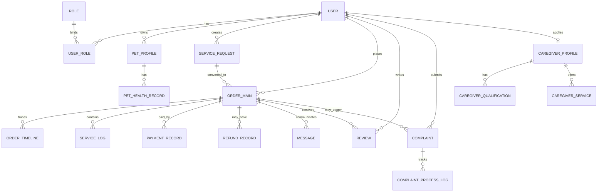

### 4.3 数据表详细设计

说明：字段类型为建议值，可在 Prisma schema 中按实际命名规范调整。

### 4.3.1 用户与认证域

#### 表：user

| 字段 | 类型 | 约束 | 说明 |
| --- | --- | --- | --- |
| id | uuid | PK | 用户主键 |
| phone | varchar(20) | unique | 手机号 |
| email | varchar(128) | unique nullable | 邮箱 |
| password_hash | varchar(255) | not null | 密码哈希 |
| status | varchar(20) | index | active/disabled/locked |
| realname_status | varchar(20) | index | unverified/pending/verified/rejected |
| last_login_at | timestamptz | nullable | 最后登录时间 |
| created_at | timestamptz | not null | 创建时间 |
| updated_at | timestamptz | not null | 更新时间 |

索引建议：

- unique(phone), unique(email)
- idx_user_status(status)

#### 表：role

| 字段 | 类型 | 约束 | 说明 |
| --- | --- | --- | --- |
| id | uuid | PK | 角色主键 |
| code | varchar(30) | unique | owner/caregiver/admin |
| name | varchar(50) | not null | 角色名称 |
| is_system | boolean | default true | 是否系统角色 |

#### 表：user_role

| 字段 | 类型 | 约束 | 说明 |
| --- | --- | --- | --- |
| id | uuid | PK | 关联主键 |
| user_id | uuid | FK user.id | 用户 |
| role_id | uuid | FK role.id | 角色 |
| is_active | boolean | default true | 是否启用 |
| created_at | timestamptz | not null | 创建时间 |

索引建议：

- unique(user_id, role_id)
- idx_user_role_user(user_id)
- idx_user_role_role(role_id)

#### 表：user_verification

| 字段 | 类型 | 约束 | 说明 |
| --- | --- | --- | --- |
| id | uuid | PK | 认证记录主键 |
| user_id | uuid | FK user.id | 用户 |
| real_name | varchar(50) | not null | 真实姓名 |
| id_type | varchar(20) | not null | 证件类型 |
| id_no_masked | varchar(50) | not null | 脱敏证件号 |
| verify_provider | varchar(50) | nullable | 认证服务商 |
| verify_result | varchar(20) | index | pending/pass/reject |
| reject_reason | varchar(255) | nullable | 拒绝原因 |
| submitted_at | timestamptz | not null | 提交时间 |
| reviewed_at | timestamptz | nullable | 审核时间 |

### 4.3.2 宠物档案域

#### 表：pet_profile

| 字段 | 类型 | 约束 | 说明 |
| --- | --- | --- | --- |
| id | uuid | PK | 宠物主键 |
| owner_id | uuid | FK user.id | 宠物主人 |
| name | varchar(50) | not null | 宠物名 |
| species | varchar(20) | index | dog/cat/other |
| breed | varchar(50) | nullable | 品种 |
| gender | varchar(10) | nullable | 性别 |
| birthday | date | nullable | 出生日期 |
| weight_kg | numeric(5,2) | nullable | 体重 |
| neutered | boolean | default false | 是否绝育 |
| temperament_tags | jsonb | default [] | 性格标签 |
| feeding_note | text | nullable | 喂食说明 |
| emergency_contact | jsonb | nullable | 紧急联系人 |
| created_at | timestamptz | not null | 创建时间 |
| updated_at | timestamptz | not null | 更新时间 |

索引建议：

- idx_pet_owner(owner_id)
- idx_pet_species_breed(species, breed)

#### 表：pet_health_record

| 字段 | 类型 | 约束 | 说明 |
| --- | --- | --- | --- |
| id | uuid | PK | 健康记录主键 |
| pet_id | uuid | FK pet_profile.id | 宠物 |
| record_type | varchar(20) | index | vaccine/allergy/disease/medication |
| title | varchar(100) | not null | 记录标题 |
| content | text | not null | 详情 |
| file_urls | jsonb | default [] | 附件 URL |
| occurred_at | timestamptz | nullable | 发生时间 |
| created_at | timestamptz | not null | 创建时间 |

### 4.3.3 照料者与服务域

#### 表：caregiver_profile

| 字段 | 类型 | 约束 | 说明 |
| --- | --- | --- | --- |
| id | uuid | PK | 照料者主键 |
| user_id | uuid | FK user.id unique | 用户映射 |
| intro | text | nullable | 自我介绍 |
| experience_years | int | default 0 | 从业年限 |
| service_radius_km | int | default 5 | 服务半径 |
| service_city | varchar(50) | index | 服务城市 |
| rating_avg | numeric(3,2) | default 5.0 | 平均评分 |
| rating_count | int | default 0 | 评价数 |
| audit_status | varchar(20) | index | pending/approved/rejected |
| created_at | timestamptz | not null | 创建时间 |
| updated_at | timestamptz | not null | 更新时间 |

#### 表：caregiver_qualification

| 字段 | 类型 | 约束 | 说明 |
| --- | --- | --- | --- |
| id | uuid | PK | 资质主键 |
| caregiver_id | uuid | FK caregiver_profile.id | 照料者 |
| cert_type | varchar(50) | index | 证书类型 |
| cert_no | varchar(100) | nullable | 证书编号 |
| file_url | varchar(255) | not null | 证书文件 |
| valid_from | date | nullable | 生效日 |
| valid_to | date | nullable | 到期日 |
| verify_status | varchar(20) | index | pending/pass/reject |
| created_at | timestamptz | not null | 创建时间 |

#### 表：caregiver_service

| 字段 | 类型 | 约束 | 说明 |
| --- | --- | --- | --- |
| id | uuid | PK | 服务项主键 |
| caregiver_id | uuid | FK caregiver_profile.id | 照料者 |
| service_type | varchar(30) | index | boarding/walking/feeding/door_visit |
| pet_species | varchar(20) | index | dog/cat/other |
| price_per_unit | numeric(10,2) | not null | 单价 |
| unit_type | varchar(20) | not null | hour/day/times |
| min_notice_hours | int | default 2 | 最小提前预约时长 |
| available_slots | jsonb | not null | 可服务时段 |
| service_geo | geography(Point, 4326) | index | 服务中心点 |
| is_active | boolean | default true | 是否上架 |
| created_at | timestamptz | not null | 创建时间 |
| updated_at | timestamptz | not null | 更新时间 |

索引建议：

- idx_caregiver_service_geo_gist(service_geo) using GIST

### 4.3.4 需求与订单交易域

#### 表：service_request

| 字段 | 类型 | 约束 | 说明 |
| --- | --- | --- | --- |
| id | uuid | PK | 需求主键 |
| owner_id | uuid | FK user.id | 发布人 |
| pet_id | uuid | FK pet_profile.id | 宠物 |
| service_type | varchar(30) | index | 服务类型 |
| start_time | timestamptz | index | 开始时间 |
| end_time | timestamptz | index | 结束时间 |
| location_text | varchar(255) | not null | 服务地点 |
| location_geo | geography(Point, 4326) | index | 服务坐标 |
| budget_amount | numeric(10,2) | nullable | 预算 |
| demand_tags | jsonb | default [] | 需求标签 |
| status | varchar(20) | index | open/matched/closed/cancelled |
| created_at | timestamptz | not null | 创建时间 |
| updated_at | timestamptz | not null | 更新时间 |

索引建议：

- idx_request_geo_gist(location_geo) using GIST

#### 表：order_main

| 字段 | 类型 | 约束 | 说明 |
| --- | --- | --- | --- |
| id | uuid | PK | 订单主键 |
| order_no | varchar(32) | unique | 业务订单号 |
| owner_id | uuid | FK user.id | 主人 |
| caregiver_id | uuid | FK caregiver_profile.id | 照料者 |
| service_request_id | uuid | FK service_request.id nullable | 来源需求 |
| service_type | varchar(30) | index | 服务类型 |
| appointment_start | timestamptz | index | 预约开始 |
| appointment_end | timestamptz | index | 预约结束 |
| amount_total | numeric(10,2) | not null | 应付总额 |
| amount_adjusted | numeric(10,2) | default 0 | 调价金额（补差价可为正） |
| amount_paid | numeric(10,2) | default 0 | 已付金额 |
| amount_refunded | numeric(10,2) | default 0 | 已退金额 |
| order_status | varchar(30) | index | pending_accept/accepted/serving/completed/cancelled/disputed/partial_refunded/refunded |
| cancel_reason | varchar(255) | nullable | 取消原因 |
| closed_at | timestamptz | nullable | 关闭时间 |
| created_at | timestamptz | not null | 创建时间 |
| updated_at | timestamptz | not null | 更新时间 |

索引建议：

- unique(order_no)
- idx_order_owner_status(owner_id, order_status, created_at desc)
- idx_order_caregiver_status(caregiver_id, order_status, created_at desc)
- idx_order_time(appointment_start, appointment_end)

#### 表：order_timeline

| 字段 | 类型 | 约束 | 说明 |
| --- | --- | --- | --- |
| id | bigserial | PK | 主键 |
| order_id | uuid | FK order_main.id | 订单 |
| event_type | varchar(30) | index | created/accepted/checkin/checkout/completed/cancelled/refund_applied/refund_done |
| operator_role | varchar(20) | index | owner/caregiver/admin/system |
| operator_id | uuid | nullable | 操作人 |
| event_payload | jsonb | nullable | 事件详情 |
| created_at | timestamptz | not null | 创建时间 |

#### 表：service_log

| 字段 | 类型 | 约束 | 说明 |
| --- | --- | --- | --- |
| id | uuid | PK | 服务日志主键 |
| order_id | uuid | FK order_main.id | 订单 |
| caregiver_id | uuid | FK caregiver_profile.id | 照料者 |
| log_type | varchar(20) | index | checkin/feed/walk/play/health/checkout |
| text_note | text | nullable | 文字说明 |
| media_urls | jsonb | default [] | 图片/视频 |
| geo | jsonb | nullable | 打卡坐标 |
| happened_at | timestamptz | index | 发生时间 |
| created_at | timestamptz | not null | 创建时间 |

### 4.3.5 沟通、支付、评价与投诉域

#### 表：message_session

| 字段 | 类型 | 约束 | 说明 |
| --- | --- | --- | --- |
| id | uuid | PK | 会话主键 |
| order_id | uuid | FK order_main.id unique | 订单会话 |
| owner_id | uuid | FK user.id | 主人 |
| caregiver_id | uuid | FK caregiver_profile.id | 照料者 |
| last_message_at | timestamptz | index | 最近消息时间 |
| created_at | timestamptz | not null | 创建时间 |

#### 表：message

| 字段 | 类型 | 约束 | 说明 |
| --- | --- | --- | --- |
| id | bigserial | PK | 消息主键 |
| session_id | uuid | FK message_session.id | 会话 |
| sender_role | varchar(20) | index | owner/caregiver/admin/system |
| sender_id | uuid | nullable | 发送方 |
| message_type | varchar(20) | index | text/image/video/system |
| content | text | not null | 内容 |
| ext | jsonb | nullable | 扩展字段 |
| created_at | timestamptz | index | 发送时间 |

#### 表：payment_record

| 字段 | 类型 | 约束 | 说明 |
| --- | --- | --- | --- |
| id | uuid | PK | 支付记录主键 |
| order_id | uuid | FK order_main.id | 订单 |
| pay_no | varchar(40) | unique | 支付单号 |
| biz_type | varchar(20) | index | deposit/balance/adjustment |
| pay_channel | varchar(20) | index | wechat/alipay/card |
| pay_status | varchar(20) | index | pending/paid/failed/closed |
| pay_amount | numeric(10,2) | not null | 支付金额 |
| channel_txn_id | varchar(80) | unique nullable | 三方交易流水号 |
| paid_at | timestamptz | nullable | 支付时间 |
| channel_payload | jsonb | nullable | 渠道回执 |
| created_at | timestamptz | not null | 创建时间 |
| updated_at | timestamptz | not null | 更新时间 |

索引建议：

- idx_payment_order(order_id, created_at desc)
- idx_payment_order_status(order_id, pay_status)

#### 表：refund_record

| 字段 | 类型 | 约束 | 说明 |
| --- | --- | --- | --- |
| id | uuid | PK | 退款记录主键 |
| order_id | uuid | FK order_main.id | 订单 |
| payment_id | uuid | FK payment_record.id nullable | 关联支付单 |
| refund_no | varchar(40) | unique | 退款单号 |
| apply_user_id | uuid | FK user.id | 发起人 |
| refund_type | varchar(20) | index | full/partial |
| refund_reason | varchar(255) | not null | 退款原因 |
| refund_amount | numeric(10,2) | not null | 退款金额 |
| refund_status | varchar(20) | index | pending/approved/rejected/success/failed |
| channel_refund_id | varchar(80) | unique nullable | 三方退款流水号 |
| reviewed_by | uuid | FK user.id nullable | 审核人 |
| reviewed_at | timestamptz | nullable | 审核时间 |
| created_at | timestamptz | not null | 创建时间 |

索引建议：

- idx_refund_order(order_id, created_at desc)
- idx_refund_payment(payment_id)

#### 表：review

| 字段 | 类型 | 约束 | 说明 |
| --- | --- | --- | --- |
| id | uuid | PK | 评价主键 |
| order_id | uuid | FK order_main.id unique | 订单 |
| owner_id | uuid | FK user.id | 评价人 |
| caregiver_id | uuid | FK caregiver_profile.id | 被评价照料者 |
| rating | int | check 1..5 | 星级 |
| tags | jsonb | default [] | 评价标签 |
| content | text | nullable | 评价内容 |
| is_anonymous | boolean | default false | 是否匿名 |
| created_at | timestamptz | not null | 创建时间 |

#### 表：complaint

| 字段 | 类型 | 约束 | 说明 |
| --- | --- | --- | --- |
| id | uuid | PK | 投诉主键 |
| order_id | uuid | FK order_main.id | 关联订单 |
| complainant_id | uuid | FK user.id | 投诉人 |
| target_role | varchar(20) | index | caregiver/platform |
| complaint_type | varchar(30) | index | safety/fee/service/fraud/other |
| description | text | not null | 投诉描述 |
| evidence_urls | jsonb | default [] | 证据附件 |
| status | varchar(20) | index | open/processing/resolved/rejected |
| result_summary | varchar(255) | nullable | 处理结论 |
| created_at | timestamptz | not null | 创建时间 |
| closed_at | timestamptz | nullable | 结案时间 |

#### 表：complaint_process_log

| 字段 | 类型 | 约束 | 说明 |
| --- | --- | --- | --- |
| id | bigserial | PK | 主键 |
| complaint_id | uuid | FK complaint.id | 投诉 |
| action_type | varchar(30) | index | assign/investigate/call_user/penalty/close |
| operator_id | uuid | FK user.id | 处理人 |
| note | text | nullable | 处理说明 |
| created_at | timestamptz | not null | 创建时间 |

### 4.3.6 平台治理与审计域

#### 表：platform_rule

| 字段 | 类型 | 约束 | 说明 |
| --- | --- | --- | --- |
| id | uuid | PK | 规则主键 |
| rule_code | varchar(50) | unique | 规则编码 |
| rule_name | varchar(100) | not null | 规则名称 |
| rule_version | varchar(20) | not null | 版本号 |
| content_md | text | not null | 规则内容 |
| effective_at | timestamptz | not null | 生效时间 |
| status | varchar(20) | index | draft/published/archived |
| created_by | uuid | FK user.id | 创建人 |
| created_at | timestamptz | not null | 创建时间 |

#### 表：operation_audit_log

| 字段 | 类型 | 约束 | 说明 |
| --- | --- | --- | --- |
| id | bigserial | PK | 主键 |
| actor_id | uuid | nullable | 操作人 |
| actor_role | varchar(20) | index | owner/caregiver/admin/system |
| action | varchar(100) | index | 行为标识 |
| resource_type | varchar(50) | index | 资源类型 |
| resource_id | varchar(64) | nullable | 资源 ID |
| request_id | varchar(64) | index | 请求追踪号 |
| detail | jsonb | nullable | 详情 |
| created_at | timestamptz | not null | 创建时间 |

### 4.4 Redis 设计

- key:user:session:{userId}:{deviceId}：登录态与 refresh token。
- key:order:lock:{orderId}：订单状态流转分布式锁。
- key:match:caregiver:{geohash}:{serviceType}:{petSpecies}：照料者推荐缓存。
- key:rate_limit:{api}:{userId}：限流计数。
- key:verify:otp:{phone}：短信验证码。

TTL 建议：

- session：7~30 天（按登录策略）
- 匹配缓存：30~120 秒
- 短信验证码：5 分钟
- 幂等 token：10 分钟

### 4.5 关键约束与一致性策略

- 订单状态机必须单向流转，禁止逆向跳转。
- 支付回调、退款回调使用幂等键（pay_no/refund_no + channel_txn_id）去重。
- 订单允许多次支付和多次退款，但需满足 amount_paid - amount_refunded >= 0。
- 订单关闭前满足 amount_paid >= amount_total + amount_adjusted - amount_refunded。
- 投诉结案前必须存在至少一条 complaint_process_log。
- 评价必须在订单 completed 状态后创建且每单唯一。
- 删除策略：核心交易表建议逻辑删除（deleted_at），审计表仅追加不更新。

### 4.6 地理位置排序实现（PostGIS + Prisma）

- PostgreSQL 启用 PostGIS 扩展，服务与需求坐标使用 geography(Point, 4326)。
- Prisma 模型中坐标字段使用 Unsupported("geography(Point,4326)") 映射，迁移 SQL 中创建 GIST 索引。
- 距离排序通过 Prisma 的参数化原生 SQL 执行：按 ST_DistanceSphere(service_geo, :requestPoint) 升序。
- 高频列表先按城市与服务类型过滤，再执行距离排序，最终结果短缓存到 Redis。

## 5. 用户操作流程设计

### 5.1 主人端下单履约流程

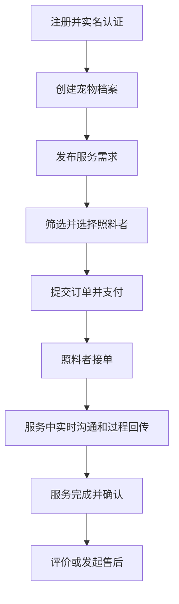

流程说明：

- 关键前置：实名认证通过、宠物档案完整。
- 支付后进入待接单状态，超时自动取消并触发退款策略。
- 服务中必须产生至少一次服务日志（特殊场景可按规则豁免）。

### 5.2 照料者端入驻接单流程

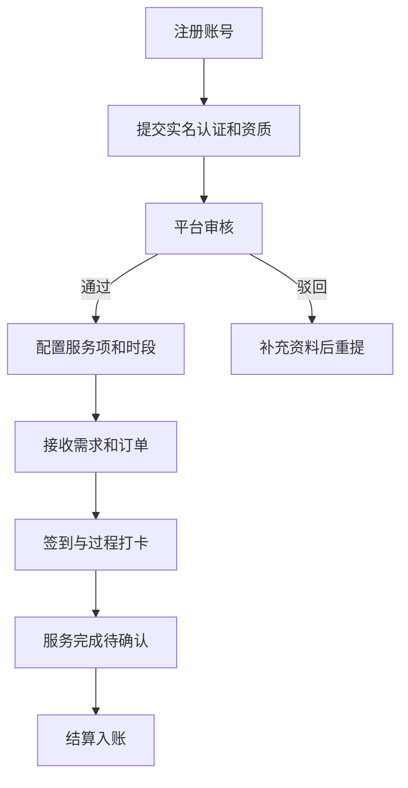

### 5.3 管理端审核与纠纷流程

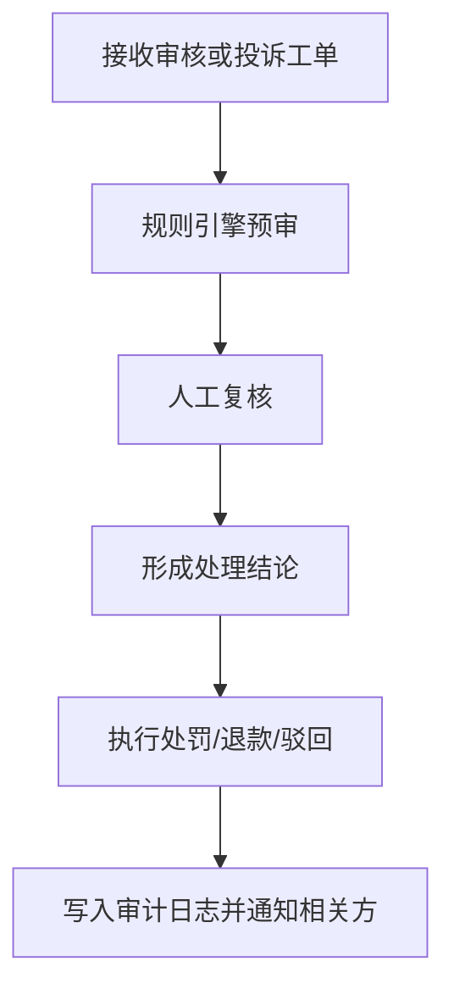

## 6. 数据流设计

### 6.1 下单到履约的数据流

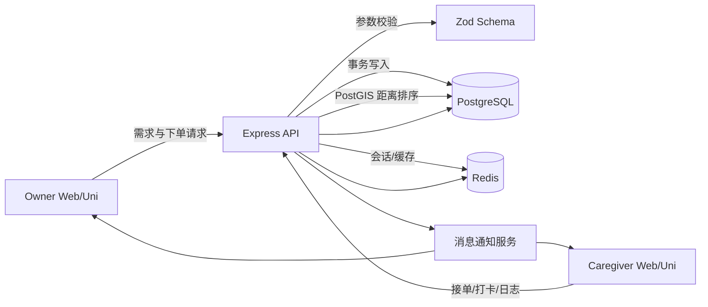

数据处理要点：

- API 层负责输入校验、鉴权、幂等控制。
- Service 层负责业务规则（状态机、价格计算、风控规则）。
- Repository/Prisma 层负责数据持久化与事务边界。

### 6.2 支付与退款数据流

- 创建支付单：order_main -> payment_record(pending, biz_type=deposit/balance/adjustment)。
- 支付回调：校验签名 -> 幂等检查 -> payment_record(paid) -> 聚合更新 order_main.amount_paid。
- 补差价：创建新的 payment_record(adjustment) 并单独走支付回调。
- 退款申请：refund_record(pending, full/partial) + order_timeline(event=refund_applied)。
- 退款回调：refund_record(success/failed) -> 聚合更新 order_main.amount_refunded -> 订单状态更新为 partial_refunded/refunded。

### 6.3 投诉处理数据流

- 投诉创建：complaint(open) + evidence_urls。
- 分配处理人：complaint_process_log(assign)。
- 调查过程：多条 process_log 连续记录。
- 结案：complaint(status=resolved/rejected) + result_summary。

## 7. API 模块划分建议

- /api/auth：登录、注册、认证、会话。
- /api/pets：宠物档案与健康记录。
- /api/caregivers：照料者资料、资质、服务项。
- /api/requests：需求发布与匹配。
- /api/orders：订单、服务日志、时间线。
- /api/payments：支付、退款、回调。
- /api/location：地理检索与附近照料者排序。
- /api/reviews：评价。
- /api/complaints：投诉与处理。
- /api/admin：审核、规则、处罚、统计。

## 8. 非功能设计

- 安全：JWT + Refresh Token，敏感字段加密/脱敏，RBAC 授权。
- 可用性：关键链路超时重试，消息通知失败补偿。
- 可观测性：request_id 全链路追踪，operation_audit_log 留痕。
- 性能：热点查询索引优化，PostGIS GIST 距离索引，匹配结果 Redis 短缓存，分页游标化。

## 9. 测试设计建议

- 单元测试：订单状态机、价格计算、退款规则、投诉流转。
- 集成测试：下单->多次支付->补差价->部分退款/全额退款主链路；投诉->处理->结案链路。
- 回归测试：认证授权边界、数据权限隔离、异常幂等。

重点新增用例：

- 同账号双身份切换后权限正确（Owner/Caregiver 菜单与数据隔离）。
- 距离排序结果稳定（同城、跨城、边界坐标）且与 Redis 缓存一致。

## 10. 迭代建议（里程碑）

- M1：账户、宠物档案、照料者入驻、基础订单。
- M2：支付退款、服务过程日志、评价投诉。
- M3：风控审计、数据看板、推荐排序优化。
- M4：多端体验与运营策略优化。

## 11. 二次审查结论与改进清单

本轮审查聚焦“可实现性、一致性、可运维性”，结论如下：

- 已收敛项：双身份模型、多次支付/补差价/部分退款并存、地理位置排序。
- 仍需落地项：Prisma migration 中 PostGIS 扩展 SQL、支付退款聚合更新的事务边界、身份切换的审计日志。

### 11.1 重点风险与处理建议

| 风险点 | 影响 | 建议 |
| --- | --- | --- |
| 地理字段使用 PostGIS，但未在迁移脚本启用扩展 | 上线后查询失败 | 在首个迁移中执行 `CREATE EXTENSION IF NOT EXISTS postgis;` |
| 订单金额聚合在并发回调下可能被覆盖 | 金额错账 | 采用数据库事务 + 行级锁（`FOR UPDATE`）+ 幂等键 |
| 多身份切换仅在前端切状态 | 越权风险 | 后端基于 user_role 与 activeRole 双重校验并写审计日志 |
| 多次退款可能超过已支付金额 | 财务风险 | 增加 `CHECK (amount_paid - amount_refunded >= 0)` 与服务层二次校验 |
| 消息通知服务未定义失败补偿策略 | 通知丢失 | 建立 outbox 表 + 重试任务 + 死信告警 |

### 11.2 规则落地优先级

1. P0：支付退款聚合事务化、幂等化。
2. P0：PostGIS 扩展与 GIST 索引迁移落地。
3. P1：双身份鉴权链路与审计日志。
4. P1：消息 outbox 重试机制。
5. P2：排序策略 A/B（距离优先 vs 评分优先）可配置化。

## 12. 图表附录（Mermaid）

### 12.1 用户交互时序图（下单到履约）

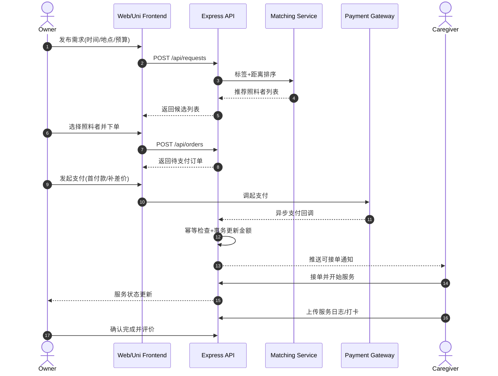

### 12.2 业务逻辑分层图

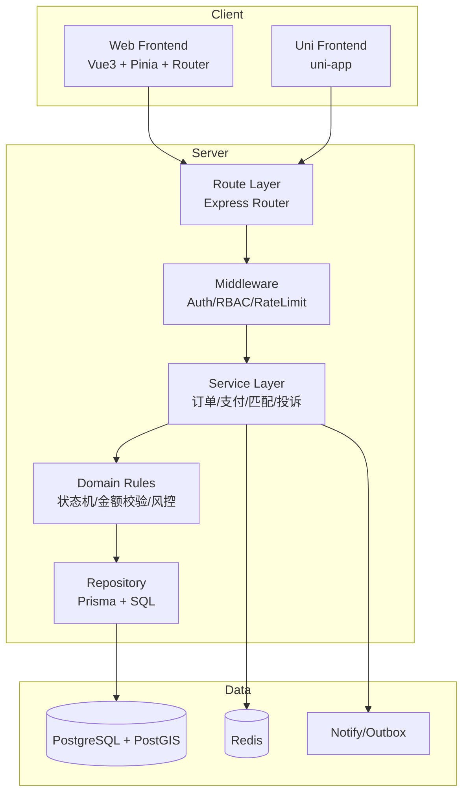

### 12.3 订单状态机图

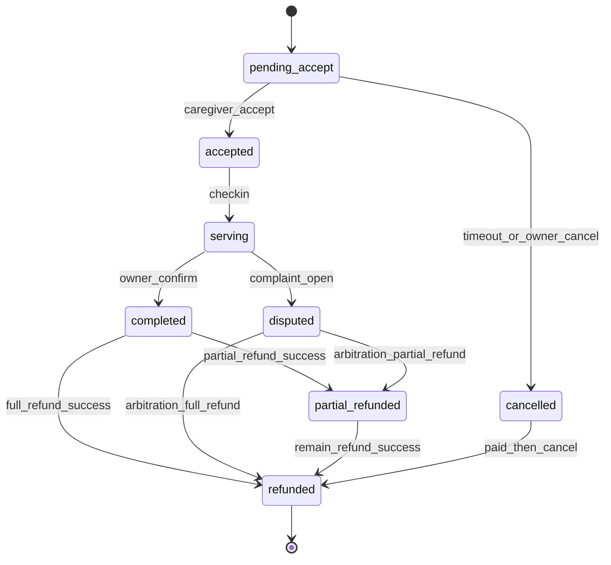

### 12.4 支付与退款状态机图

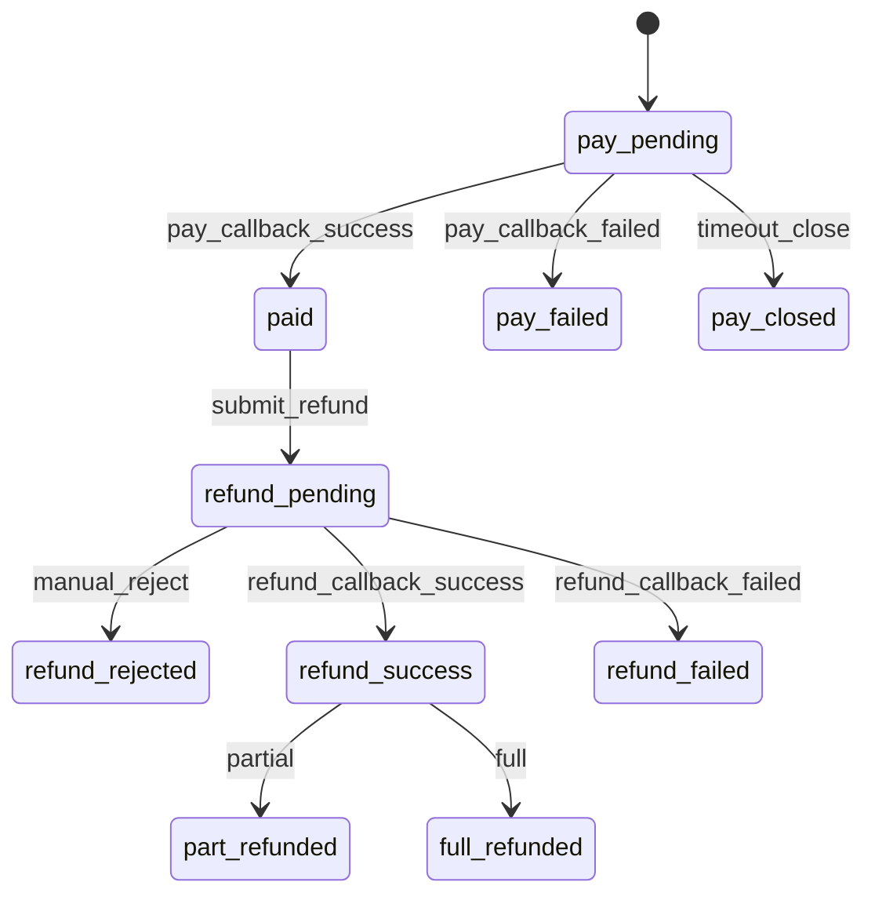

### 12.5 RBAC 权限决策流程图

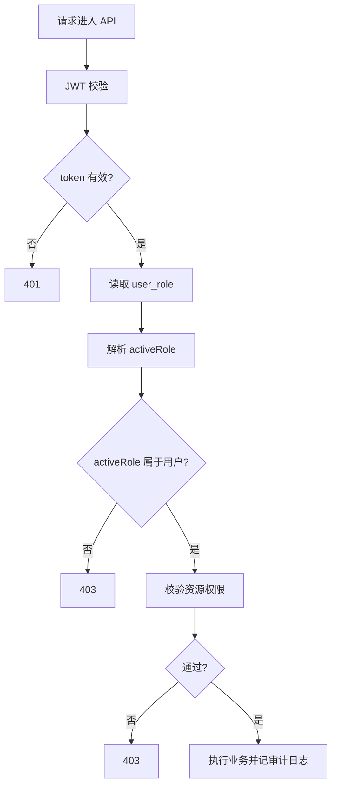

### 12.6 地理匹配与排序流程图

### 12.7 部署与可观测性图

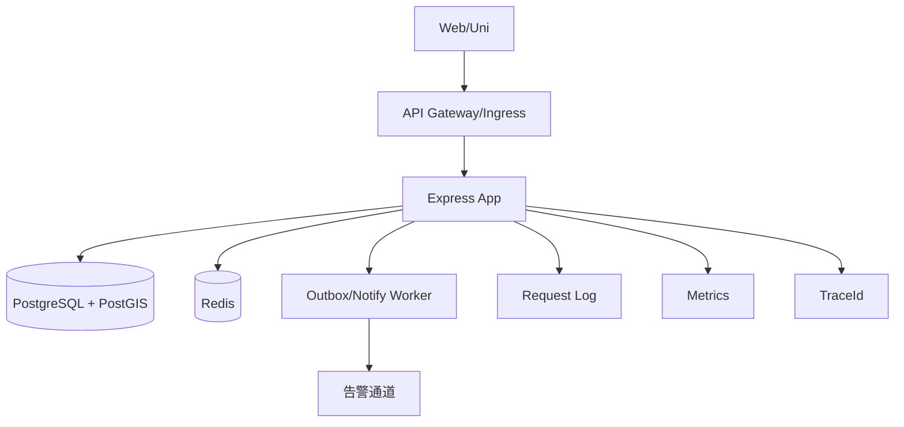
