## 1. 文档目标与范围

本文档用于指导“宠托帮（PetPal）”平台的详细设计与后续开发，覆盖以下内容：

- 功能设计：用户端、照料者端、管理端的核心能力与边界。
- 数据库设计：基于 PostgreSQL + Prisma 的逻辑模型、表结构建议、索引与约束。
- 用户操作流程设计：从注册认证到下单履约、评价投诉、售后退款的完整路径。
- 数据流设计：关键业务链路中的数据输入、处理、存储、输出与审计。

对应技术栈（与仓库当前一致）：

- 前端：Web（Vue 3 + Vite + Pinia + Vue Router + Element Plus）、移动端（uni-app）
- 后端：Node.js + Express 5 + TypeScript + Zod
- 数据：Prisma ORM + PostgreSQL + Redis
- 测试：node:test + supertest
- 部署：Docker 容器编排（PostgreSQL / Redis）

## 2. 角色与权限边界

### 2.1 角色定义

- 宠物主人（Owner）：发布照料需求、支付订单、跟踪服务、评价与投诉。
- 照料者（Caregiver）：提交资质、上架服务、接单履约、上传服务过程记录。
- 平台管理员（Admin）：资质审核、订单监管、纠纷处理、违规处罚、规则配置。

### 2.2 权限边界

- 同一账号允许同时拥有 Owner 与 Caregiver 身份，通过“当前身份上下文”切换菜单和默认操作。
- Owner 身份仅可访问自身宠物档案、订单、支付和投诉记录。
- Caregiver 身份仅可访问与自身相关的服务项、接单记录、收益与评价。
- Admin 可跨用户查看审核与运营数据，但敏感字段（证件号、手机号）需脱敏显示。

## 3. 功能设计

### 3.1 用户端（宠物主人）

#### 3.1.1 账户与身份

- 手机号/邮箱注册、登录、注销。
- 身份中心：支持一个账号同时申请并启用 Owner + Caregiver 两种业务身份。
- 身份切换：前端通过 Pinia 保存 activeRole，上下文透传到 API 鉴权层。
- 实名认证：证件信息提交、活体/人脸校验结果回填、认证状态跟踪。
- 安全设置：密码修改、设备管理、异常登录提醒。

#### 3.1.2 宠物档案管理

- 宠物基础信息：品种、年龄、性别、绝育、体重、性格标签。
- 健康信息：疫苗记录、过敏史、慢病史、禁忌食物、紧急联系人。
- 日常习惯：喂食时间、遛宠时段、活动强度、安抚偏好。

#### 3.1.3 需求与匹配

- 发布需求：服务类型、期望时间、地点、预算、特殊要求。
- 多维筛选：价格、距离、评级、资质、服务经验。
- 匹配推荐：按标签匹配度、历史好评率、响应时效综合排序。
- 地理位置排序：支持按“距离我最近”排序，优先使用 PostgreSQL PostGIS 距离计算。

#### 3.1.4 交易与售后

- 下单支付：支持首付款 + 补差价（多次支付）。
- 订单状态跟踪：待接单、已接单、服务中、待确认、已完成、已取消。
- 退款与售后：支持多次退款、部分退款并存、投诉仲裁。

#### 3.1.5 互动与反馈

- 即时沟通：订单内消息、图片/视频回传。
- 服务评价：星级、标签、文字评价。
- 投诉反馈：上传证据、记录处理进度。

### 3.2 服务端（照料者）

#### 3.2.1 入驻与认证

- 实名认证、从业资质上传。
- 服务能力标签设置：犬类护理、猫类护理、异宠护理等。
- 可服务范围设置：半径、服务时段、接单上限。

#### 3.2.2 接单与履约

- 接单决策：自动/手动接单。
- 到店/到家签到：定位打点与时间戳。
- 过程留痕：喂食/遛宠打卡、照片视频上传。

#### 3.2.3 收益与成长

- 订单收益报表：日/周/月维度。
- 服务质量指标：响应时长、完成率、投诉率、复购率。
- 违规提醒与整改任务。

### 3.3 管理端

#### 3.3.1 审核管理

- 用户实名审核、照料者资质审核。
- 审核策略：自动规则 + 人工复核。

#### 3.3.2 订单与风险控制

- 异常订单监控：超时未接单、超时未签到、服务记录缺失。
- 纠纷工单：分级处理、超时升级、责任判定。

#### 3.3.3 平台治理

- 服务标准发布与版本管理。
- 违规规则与处罚执行。
- 运营数据看板：供需比、完单率、退款率、投诉率。

## 4. 数据库设计（PostgreSQL + Prisma）

### 4.1 设计原则

- 一致性优先：核心交易表采用强约束（外键、唯一键、状态枚举）。
- 过程可追溯：关键状态变更必须记录操作日志和时间戳。
- 审计可用：支付、退款、投诉、审核全链路可查询。
- 性能分层：高频读写场景通过 Redis 做短期缓存与会话存储。
- 框架协同：优先使用 Prisma 事务与类型系统；地理计算场景使用 PostGIS + Prisma 参数化原生 SQL。

### 4.2 核心实体关系

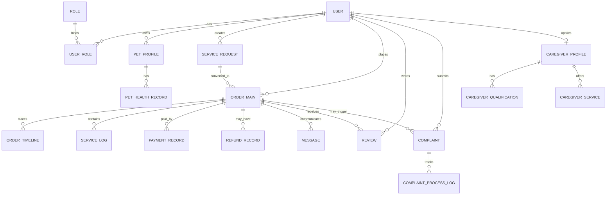

### 4.3 数据表详细设计

说明：字段类型为建议值，可在 Prisma schema 中按实际命名规范调整。

### 4.3.1 用户与认证域

#### 表：user

| 字段 | 类型 | 约束 | 说明 |
| --- | --- | --- | --- |
| id | uuid | PK | 用户主键 |
| phone | varchar(20) | unique | 手机号 |
| email | varchar(128) | unique nullable | 邮箱 |
| password_hash | varchar(255) | not null | 密码哈希 |
| status | varchar(20) | index | active/disabled/locked |
| realname_status | varchar(20) | index | unverified/pending/verified/rejected |
| last_login_at | timestamptz | nullable | 最后登录时间 |
| created_at | timestamptz | not null | 创建时间 |
| updated_at | timestamptz | not null | 更新时间 |

索引建议：

- unique(phone), unique(email)
- idx_user_status(status)

#### 表：role

| 字段 | 类型 | 约束 | 说明 |
| --- | --- | --- | --- |
| id | uuid | PK | 角色主键 |
| code | varchar(30) | unique | owner/caregiver/admin |
| name | varchar(50) | not null | 角色名称 |
| is_system | boolean | default true | 是否系统角色 |

#### 表：user_role

| 字段 | 类型 | 约束 | 说明 |
| --- | --- | --- | --- |
| id | uuid | PK | 关联主键 |
| user_id | uuid | FK user.id | 用户 |
| role_id | uuid | FK role.id | 角色 |
| is_active | boolean | default true | 是否启用 |
| created_at | timestamptz | not null | 创建时间 |

索引建议：

- unique(user_id, role_id)
- idx_user_role_user(user_id)
- idx_user_role_role(role_id)

#### 表：user_verification

| 字段 | 类型 | 约束 | 说明 |
| --- | --- | --- | --- |
| id | uuid | PK | 认证记录主键 |
| user_id | uuid | FK user.id | 用户 |
| real_name | varchar(50) | not null | 真实姓名 |
| id_type | varchar(20) | not null | 证件类型 |
| id_no_masked | varchar(50) | not null | 脱敏证件号 |
| verify_provider | varchar(50) | nullable | 认证服务商 |
| verify_result | varchar(20) | index | pending/pass/reject |
| reject_reason | varchar(255) | nullable | 拒绝原因 |
| submitted_at | timestamptz | not null | 提交时间 |
| reviewed_at | timestamptz | nullable | 审核时间 |

### 4.3.2 宠物档案域

#### 表：pet_profile

| 字段 | 类型 | 约束 | 说明 |
| --- | --- | --- | --- |
| id | uuid | PK | 宠物主键 |
| owner_id | uuid | FK user.id | 宠物主人 |
| name | varchar(50) | not null | 宠物名 |
| species | varchar(20) | index | dog/cat/other |
| breed | varchar(50) | nullable | 品种 |
| gender | varchar(10) | nullable | 性别 |
| birthday | date | nullable | 出生日期 |
| weight_kg | numeric(5,2) | nullable | 体重 |
| neutered | boolean | default false | 是否绝育 |
| temperament_tags | jsonb | default [] | 性格标签 |
| feeding_note | text | nullable | 喂食说明 |
| emergency_contact | jsonb | nullable | 紧急联系人 |
| created_at | timestamptz | not null | 创建时间 |
| updated_at | timestamptz | not null | 更新时间 |

索引建议：

- idx_pet_owner(owner_id)
- idx_pet_species_breed(species, breed)

#### 表：pet_health_record

| 字段 | 类型 | 约束 | 说明 |
| --- | --- | --- | --- |
| id | uuid | PK | 健康记录主键 |
| pet_id | uuid | FK pet_profile.id | 宠物 |
| record_type | varchar(20) | index | vaccine/allergy/disease/medication |
| title | varchar(100) | not null | 记录标题 |
| content | text | not null | 详情 |
| file_urls | jsonb | default [] | 附件 URL |
| occurred_at | timestamptz | nullable | 发生时间 |
| created_at | timestamptz | not null | 创建时间 |

### 4.3.3 照料者与服务域

#### 表：caregiver_profile

| 字段 | 类型 | 约束 | 说明 |
| --- | --- | --- | --- |
| id | uuid | PK | 照料者主键 |
| user_id | uuid | FK user.id unique | 用户映射 |
| intro | text | nullable | 自我介绍 |
| experience_years | int | default 0 | 从业年限 |
| service_radius_km | int | default 5 | 服务半径 |
| service_city | varchar(50) | index | 服务城市 |
| rating_avg | numeric(3,2) | default 5.0 | 平均评分 |
| rating_count | int | default 0 | 评价数 |
| audit_status | varchar(20) | index | pending/approved/rejected |
| created_at | timestamptz | not null | 创建时间 |
| updated_at | timestamptz | not null | 更新时间 |

#### 表：caregiver_qualification

| 字段 | 类型 | 约束 | 说明 |
| --- | --- | --- | --- |
| id | uuid | PK | 资质主键 |
| caregiver_id | uuid | FK caregiver_profile.id | 照料者 |
| cert_type | varchar(50) | index | 证书类型 |
| cert_no | varchar(100) | nullable | 证书编号 |
| file_url | varchar(255) | not null | 证书文件 |
| valid_from | date | nullable | 生效日 |
| valid_to | date | nullable | 到期日 |
| verify_status | varchar(20) | index | pending/pass/reject |
| created_at | timestamptz | not null | 创建时间 |

#### 表：caregiver_service

| 字段 | 类型 | 约束 | 说明 |
| --- | --- | --- | --- |
| id | uuid | PK | 服务项主键 |
| caregiver_id | uuid | FK caregiver_profile.id | 照料者 |
| service_type | varchar(30) | index | boarding/walking/feeding/door_visit |
| pet_species | varchar(20) | index | dog/cat/other |
| price_per_unit | numeric(10,2) | not null | 单价 |
| unit_type | varchar(20) | not null | hour/day/times |
| min_notice_hours | int | default 2 | 最小提前预约时长 |
| available_slots | jsonb | not null | 可服务时段 |
| service_geo | geography(Point, 4326) | index | 服务中心点 |
| is_active | boolean | default true | 是否上架 |
| created_at | timestamptz | not null | 创建时间 |
| updated_at | timestamptz | not null | 更新时间 |

索引建议：

- idx_caregiver_service_geo_gist(service_geo) using GIST

### 4.3.4 需求与订单交易域

#### 表：service_request

| 字段 | 类型 | 约束 | 说明 |
| --- | --- | --- | --- |
| id | uuid | PK | 需求主键 |
| owner_id | uuid | FK user.id | 发布人 |
| pet_id | uuid | FK pet_profile.id | 宠物 |
| service_type | varchar(30) | index | 服务类型 |
| start_time | timestamptz | index | 开始时间 |
| end_time | timestamptz | index | 结束时间 |
| location_text | varchar(255) | not null | 服务地点 |
| location_geo | geography(Point, 4326) | index | 服务坐标 |
| budget_amount | numeric(10,2) | nullable | 预算 |
| demand_tags | jsonb | default [] | 需求标签 |
| status | varchar(20) | index | open/matched/closed/cancelled |
| created_at | timestamptz | not null | 创建时间 |
| updated_at | timestamptz | not null | 更新时间 |

索引建议：

- idx_request_geo_gist(location_geo) using GIST

#### 表：order_main

| 字段 | 类型 | 约束 | 说明 |
| --- | --- | --- | --- |
| id | uuid | PK | 订单主键 |
| order_no | varchar(32) | unique | 业务订单号 |
| owner_id | uuid | FK user.id | 主人 |
| caregiver_id | uuid | FK caregiver_profile.id | 照料者 |
| service_request_id | uuid | FK service_request.id nullable | 来源需求 |
| service_type | varchar(30) | index | 服务类型 |
| appointment_start | timestamptz | index | 预约开始 |
| appointment_end | timestamptz | index | 预约结束 |
| amount_total | numeric(10,2) | not null | 应付总额 |
| amount_adjusted | numeric(10,2) | default 0 | 调价金额（补差价可为正） |
| amount_paid | numeric(10,2) | default 0 | 已付金额 |
| amount_refunded | numeric(10,2) | default 0 | 已退金额 |
| order_status | varchar(30) | index | pending_accept/accepted/serving/completed/cancelled/disputed/partial_refunded/refunded |
| cancel_reason | varchar(255) | nullable | 取消原因 |
| closed_at | timestamptz | nullable | 关闭时间 |
| created_at | timestamptz | not null | 创建时间 |
| updated_at | timestamptz | not null | 更新时间 |

索引建议：

- unique(order_no)
- idx_order_owner_status(owner_id, order_status, created_at desc)
- idx_order_caregiver_status(caregiver_id, order_status, created_at desc)
- idx_order_time(appointment_start, appointment_end)

#### 表：order_timeline

| 字段 | 类型 | 约束 | 说明 |
| --- | --- | --- | --- |
| id | bigserial | PK | 主键 |
| order_id | uuid | FK order_main.id | 订单 |
| event_type | varchar(30) | index | created/accepted/checkin/checkout/completed/cancelled/refund_applied/refund_done |
| operator_role | varchar(20) | index | owner/caregiver/admin/system |
| operator_id | uuid | nullable | 操作人 |
| event_payload | jsonb | nullable | 事件详情 |
| created_at | timestamptz | not null | 创建时间 |

#### 表：service_log

| 字段 | 类型 | 约束 | 说明 |
| --- | --- | --- | --- |
| id | uuid | PK | 服务日志主键 |
| order_id | uuid | FK order_main.id | 订单 |
| caregiver_id | uuid | FK caregiver_profile.id | 照料者 |
| log_type | varchar(20) | index | checkin/feed/walk/play/health/checkout |
| text_note | text | nullable | 文字说明 |
| media_urls | jsonb | default [] | 图片/视频 |
| geo | jsonb | nullable | 打卡坐标 |
| happened_at | timestamptz | index | 发生时间 |
| created_at | timestamptz | not null | 创建时间 |

### 4.3.5 沟通、支付、评价与投诉域

#### 表：message_session

| 字段 | 类型 | 约束 | 说明 |
| --- | --- | --- | --- |
| id | uuid | PK | 会话主键 |
| order_id | uuid | FK order_main.id unique | 订单会话 |
| owner_id | uuid | FK user.id | 主人 |
| caregiver_id | uuid | FK caregiver_profile.id | 照料者 |
| last_message_at | timestamptz | index | 最近消息时间 |
| created_at | timestamptz | not null | 创建时间 |

#### 表：message

| 字段 | 类型 | 约束 | 说明 |
| --- | --- | --- | --- |
| id | bigserial | PK | 消息主键 |
| session_id | uuid | FK message_session.id | 会话 |
| sender_role | varchar(20) | index | owner/caregiver/admin/system |
| sender_id | uuid | nullable | 发送方 |
| message_type | varchar(20) | index | text/image/video/system |
| content | text | not null | 内容 |
| ext | jsonb | nullable | 扩展字段 |
| created_at | timestamptz | index | 发送时间 |

#### 表：payment_record

| 字段 | 类型 | 约束 | 说明 |
| --- | --- | --- | --- |
| id | uuid | PK | 支付记录主键 |
| order_id | uuid | FK order_main.id | 订单 |
| pay_no | varchar(40) | unique | 支付单号 |
| biz_type | varchar(20) | index | deposit/balance/adjustment |
| pay_channel | varchar(20) | index | wechat/alipay/card |
| pay_status | varchar(20) | index | pending/paid/failed/closed |
| pay_amount | numeric(10,2) | not null | 支付金额 |
| channel_txn_id | varchar(80) | unique nullable | 三方交易流水号 |
| paid_at | timestamptz | nullable | 支付时间 |
| channel_payload | jsonb | nullable | 渠道回执 |
| created_at | timestamptz | not null | 创建时间 |
| updated_at | timestamptz | not null | 更新时间 |

索引建议：

- idx_payment_order(order_id, created_at desc)
- idx_payment_order_status(order_id, pay_status)

#### 表：refund_record

| 字段 | 类型 | 约束 | 说明 |
| --- | --- | --- | --- |
| id | uuid | PK | 退款记录主键 |
| order_id | uuid | FK order_main.id | 订单 |
| payment_id | uuid | FK payment_record.id nullable | 关联支付单 |
| refund_no | varchar(40) | unique | 退款单号 |
| apply_user_id | uuid | FK user.id | 发起人 |
| refund_type | varchar(20) | index | full/partial |
| refund_reason | varchar(255) | not null | 退款原因 |
| refund_amount | numeric(10,2) | not null | 退款金额 |
| refund_status | varchar(20) | index | pending/approved/rejected/success/failed |
| channel_refund_id | varchar(80) | unique nullable | 三方退款流水号 |
| reviewed_by | uuid | FK user.id nullable | 审核人 |
| reviewed_at | timestamptz | nullable | 审核时间 |
| created_at | timestamptz | not null | 创建时间 |

索引建议：

- idx_refund_order(order_id, created_at desc)
- idx_refund_payment(payment_id)

#### 表：review

| 字段 | 类型 | 约束 | 说明 |
| --- | --- | --- | --- |
| id | uuid | PK | 评价主键 |
| order_id | uuid | FK order_main.id unique | 订单 |
| owner_id | uuid | FK user.id | 评价人 |
| caregiver_id | uuid | FK caregiver_profile.id | 被评价照料者 |
| rating | int | check 1..5 | 星级 |
| tags | jsonb | default [] | 评价标签 |
| content | text | nullable | 评价内容 |
| is_anonymous | boolean | default false | 是否匿名 |
| created_at | timestamptz | not null | 创建时间 |

#### 表：complaint

| 字段 | 类型 | 约束 | 说明 |
| --- | --- | --- | --- |
| id | uuid | PK | 投诉主键 |
| order_id | uuid | FK order_main.id | 关联订单 |
| complainant_id | uuid | FK user.id | 投诉人 |
| target_role | varchar(20) | index | caregiver/platform |
| complaint_type | varchar(30) | index | safety/fee/service/fraud/other |
| description | text | not null | 投诉描述 |
| evidence_urls | jsonb | default [] | 证据附件 |
| status | varchar(20) | index | open/processing/resolved/rejected |
| result_summary | varchar(255) | nullable | 处理结论 |
| created_at | timestamptz | not null | 创建时间 |
| closed_at | timestamptz | nullable | 结案时间 |

#### 表：complaint_process_log

| 字段 | 类型 | 约束 | 说明 |
| --- | --- | --- | --- |
| id | bigserial | PK | 主键 |
| complaint_id | uuid | FK complaint.id | 投诉 |
| action_type | varchar(30) | index | assign/investigate/call_user/penalty/close |
| operator_id | uuid | FK user.id | 处理人 |
| note | text | nullable | 处理说明 |
| created_at | timestamptz | not null | 创建时间 |

### 4.3.6 平台治理与审计域

#### 表：platform_rule

| 字段 | 类型 | 约束 | 说明 |
| --- | --- | --- | --- |
| id | uuid | PK | 规则主键 |
| rule_code | varchar(50) | unique | 规则编码 |
| rule_name | varchar(100) | not null | 规则名称 |
| rule_version | varchar(20) | not null | 版本号 |
| content_md | text | not null | 规则内容 |
| effective_at | timestamptz | not null | 生效时间 |
| status | varchar(20) | index | draft/published/archived |
| created_by | uuid | FK user.id | 创建人 |
| created_at | timestamptz | not null | 创建时间 |

#### 表：operation_audit_log

| 字段 | 类型 | 约束 | 说明 |
| --- | --- | --- | --- |
| id | bigserial | PK | 主键 |
| actor_id | uuid | nullable | 操作人 |
| actor_role | varchar(20) | index | owner/caregiver/admin/system |
| action | varchar(100) | index | 行为标识 |
| resource_type | varchar(50) | index | 资源类型 |
| resource_id | varchar(64) | nullable | 资源 ID |
| request_id | varchar(64) | index | 请求追踪号 |
| detail | jsonb | nullable | 详情 |
| created_at | timestamptz | not null | 创建时间 |

### 4.4 Redis 设计

- key:user:session:{userId}:{deviceId}：登录态与 refresh token。
- key:order:lock:{orderId}：订单状态流转分布式锁。
- key:match:caregiver:{geohash}:{serviceType}:{petSpecies}：照料者推荐缓存。
- key:rate_limit:{api}:{userId}：限流计数。
- key:verify:otp:{phone}：短信验证码。

TTL 建议：

- session：7~30 天（按登录策略）
- 匹配缓存：30~120 秒
- 短信验证码：5 分钟
- 幂等 token：10 分钟

### 4.5 关键约束与一致性策略

- 订单状态机必须单向流转，禁止逆向跳转。
- 支付回调、退款回调使用幂等键（pay_no/refund_no + channel_txn_id）去重。
- 订单允许多次支付和多次退款，但需满足 amount_paid - amount_refunded >= 0。
- 订单关闭前满足 amount_paid >= amount_total + amount_adjusted - amount_refunded。
- 投诉结案前必须存在至少一条 complaint_process_log。
- 评价必须在订单 completed 状态后创建且每单唯一。
- 删除策略：核心交易表建议逻辑删除（deleted_at），审计表仅追加不更新。

### 4.6 地理位置排序实现（PostGIS + Prisma）

- PostgreSQL 启用 PostGIS 扩展，服务与需求坐标使用 geography(Point, 4326)。
- Prisma 模型中坐标字段使用 Unsupported("geography(Point,4326)") 映射，迁移 SQL 中创建 GIST 索引。
- 距离排序通过 Prisma 的参数化原生 SQL 执行：按 ST_DistanceSphere(service_geo, :requestPoint) 升序。
- 高频列表先按城市与服务类型过滤，再执行距离排序，最终结果短缓存到 Redis。

## 5. 用户操作流程设计

### 5.1 主人端下单履约流程

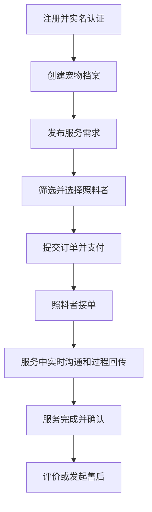

流程说明：

- 关键前置：实名认证通过、宠物档案完整。
- 支付后进入待接单状态，超时自动取消并触发退款策略。
- 服务中必须产生至少一次服务日志（特殊场景可按规则豁免）。

### 5.2 照料者端入驻接单流程

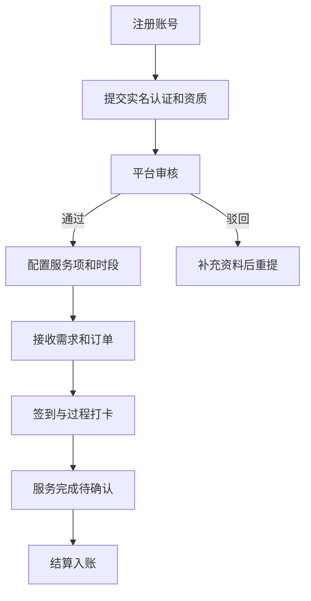

### 5.3 管理端审核与纠纷流程

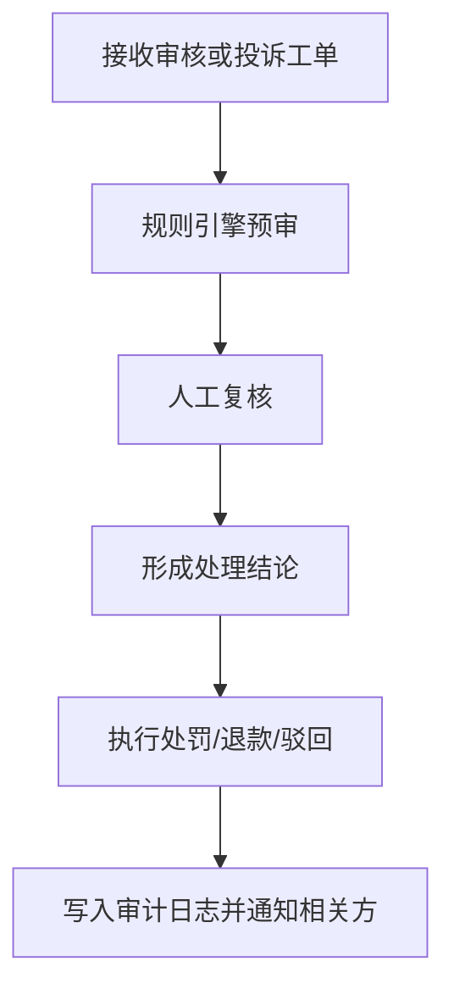

## 6. 数据流设计

### 6.1 下单到履约的数据流

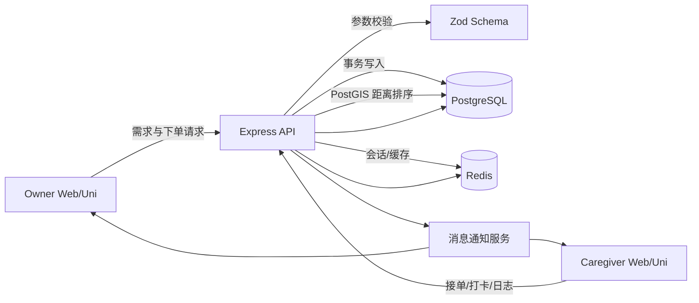

数据处理要点：

- API 层负责输入校验、鉴权、幂等控制。
- Service 层负责业务规则（状态机、价格计算、风控规则）。
- Repository/Prisma 层负责数据持久化与事务边界。

### 6.2 支付与退款数据流

- 创建支付单：order_main -> payment_record(pending, biz_type=deposit/balance/adjustment)。
- 支付回调：校验签名 -> 幂等检查 -> payment_record(paid) -> 聚合更新 order_main.amount_paid。
- 补差价：创建新的 payment_record(adjustment) 并单独走支付回调。
- 退款申请：refund_record(pending, full/partial) + order_timeline(event=refund_applied)。
- 退款回调：refund_record(success/failed) -> 聚合更新 order_main.amount_refunded -> 订单状态更新为 partial_refunded/refunded。

### 6.3 投诉处理数据流

- 投诉创建：complaint(open) + evidence_urls。
- 分配处理人：complaint_process_log(assign)。
- 调查过程：多条 process_log 连续记录。
- 结案：complaint(status=resolved/rejected) + result_summary。

## 7. API 模块划分建议

- /api/auth：登录、注册、认证、会话。
- /api/pets：宠物档案与健康记录。
- /api/caregivers：照料者资料、资质、服务项。
- /api/requests：需求发布与匹配。
- /api/orders：订单、服务日志、时间线。
- /api/payments：支付、退款、回调。
- /api/location：地理检索与附近照料者排序。
- /api/reviews：评价。
- /api/complaints：投诉与处理。
- /api/admin：审核、规则、处罚、统计。

## 8. 非功能设计

- 安全：JWT + Refresh Token，敏感字段加密/脱敏，RBAC 授权。
- 可用性：关键链路超时重试，消息通知失败补偿。
- 可观测性：request_id 全链路追踪，operation_audit_log 留痕。
- 性能：热点查询索引优化，PostGIS GIST 距离索引，匹配结果 Redis 短缓存，分页游标化。

## 9. 测试设计建议

- 单元测试：订单状态机、价格计算、退款规则、投诉流转。
- 集成测试：下单->多次支付->补差价->部分退款/全额退款主链路；投诉->处理->结案链路。
- 回归测试：认证授权边界、数据权限隔离、异常幂等。

重点新增用例：

- 同账号双身份切换后权限正确（Owner/Caregiver 菜单与数据隔离）。
- 距离排序结果稳定（同城、跨城、边界坐标）且与 Redis 缓存一致。

## 10. 迭代建议（里程碑）

- M1：账户、宠物档案、照料者入驻、基础订单。
- M2：支付退款、服务过程日志、评价投诉。
- M3：风控审计、数据看板、推荐排序优化。
- M4：多端体验与运营策略优化。

## 11. 二次审查结论与改进清单

本轮审查聚焦“可实现性、一致性、可运维性”，结论如下：

- 已收敛项：双身份模型、多次支付/补差价/部分退款并存、地理位置排序。
- 仍需落地项：Prisma migration 中 PostGIS 扩展 SQL、支付退款聚合更新的事务边界、身份切换的审计日志。

### 11.1 重点风险与处理建议

| 风险点 | 影响 | 建议 |
| --- | --- | --- |
| 地理字段使用 PostGIS，但未在迁移脚本启用扩展 | 上线后查询失败 | 在首个迁移中执行 `CREATE EXTENSION IF NOT EXISTS postgis;` |
| 订单金额聚合在并发回调下可能被覆盖 | 金额错账 | 采用数据库事务 + 行级锁（`FOR UPDATE`）+ 幂等键 |
| 多身份切换仅在前端切状态 | 越权风险 | 后端基于 user_role 与 activeRole 双重校验并写审计日志 |
| 多次退款可能超过已支付金额 | 财务风险 | 增加 `CHECK (amount_paid - amount_refunded >= 0)` 与服务层二次校验 |
| 消息通知服务未定义失败补偿策略 | 通知丢失 | 建立 outbox 表 + 重试任务 + 死信告警 |

### 11.2 规则落地优先级

1. P0：支付退款聚合事务化、幂等化。
2. P0：PostGIS 扩展与 GIST 索引迁移落地。
3. P1：双身份鉴权链路与审计日志。
4. P1：消息 outbox 重试机制。
5. P2：排序策略 A/B（距离优先 vs 评分优先）可配置化。

## 12. 图表附录（Mermaid）

### 12.1 用户交互时序图（下单到履约）

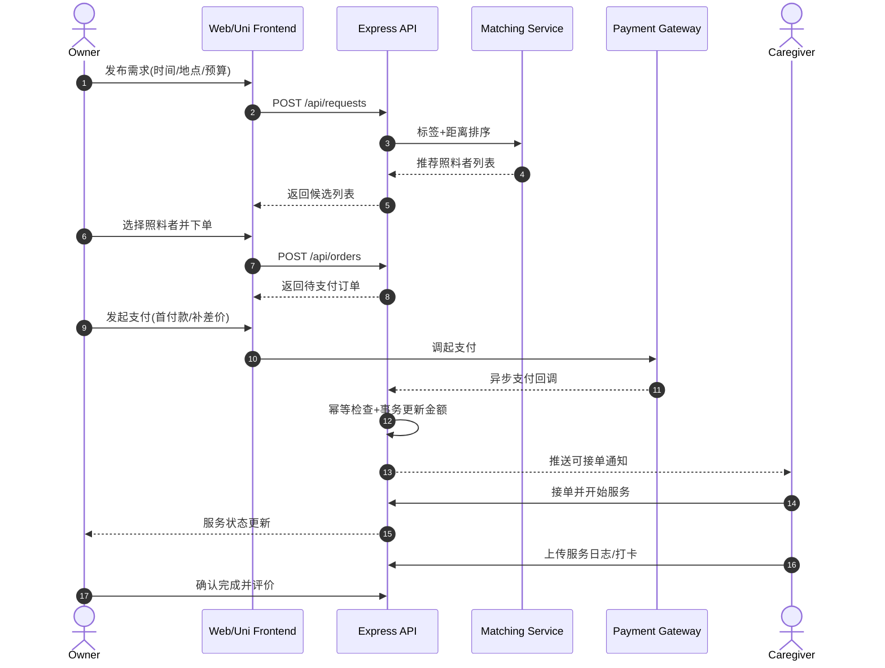

### 12.2 业务逻辑分层图

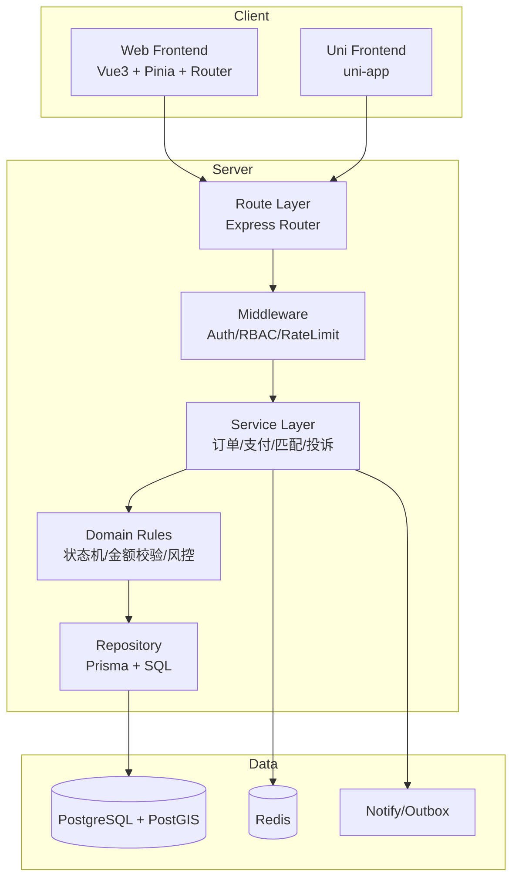

### 12.3 订单状态机图

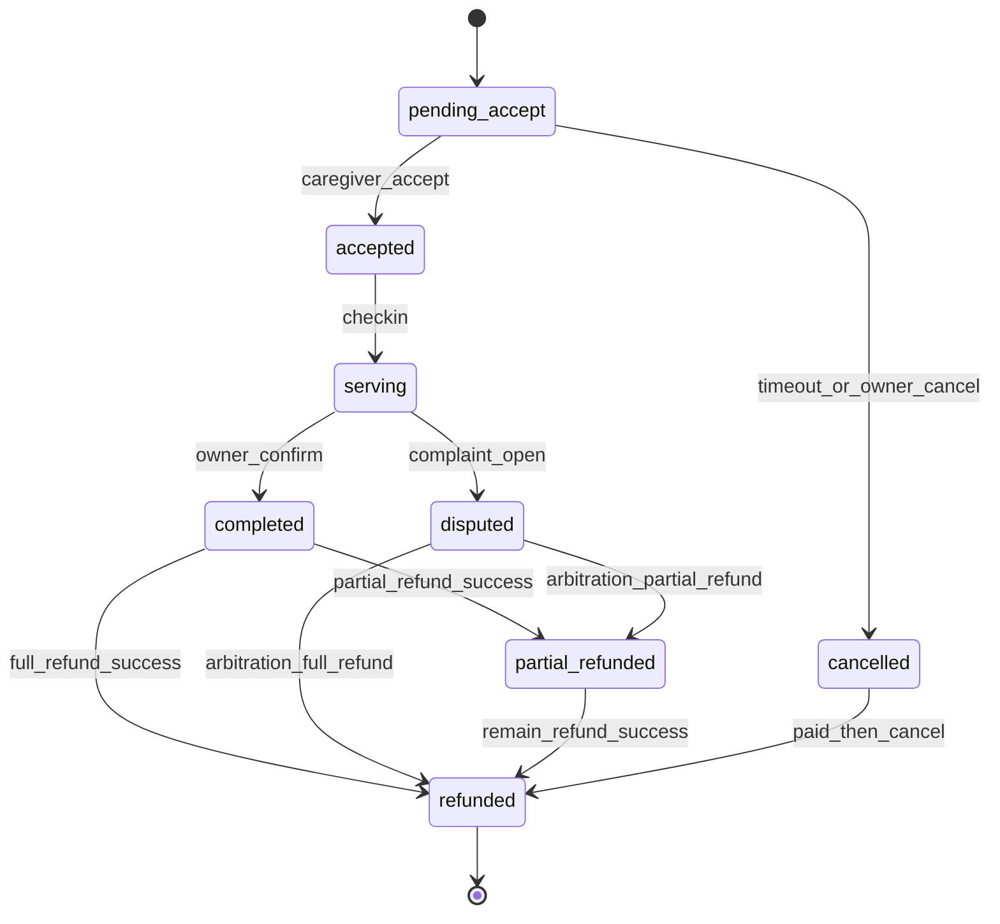

### 12.4 支付与退款状态机图

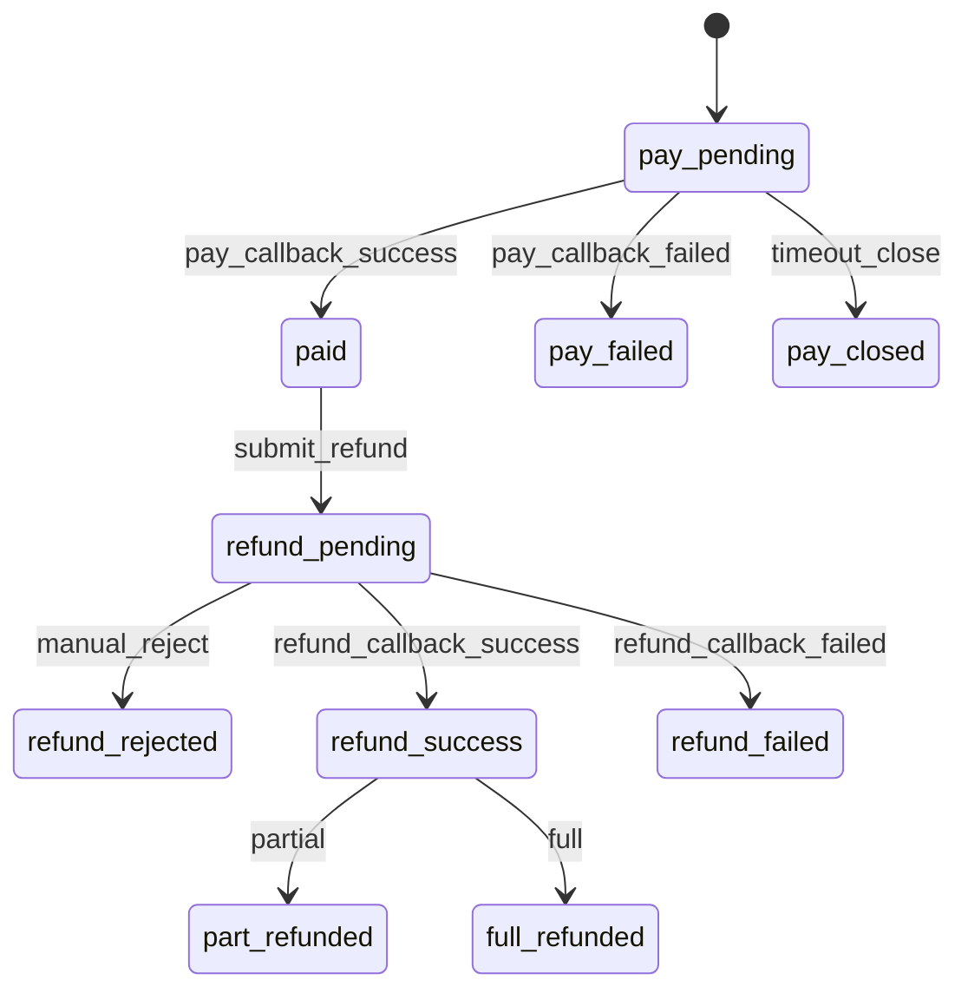

### 12.5 RBAC 权限决策流程图

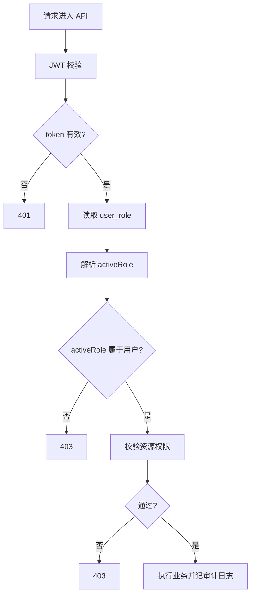

### 12.6 地理匹配与排序流程图

### 12.7 部署与可观测性图

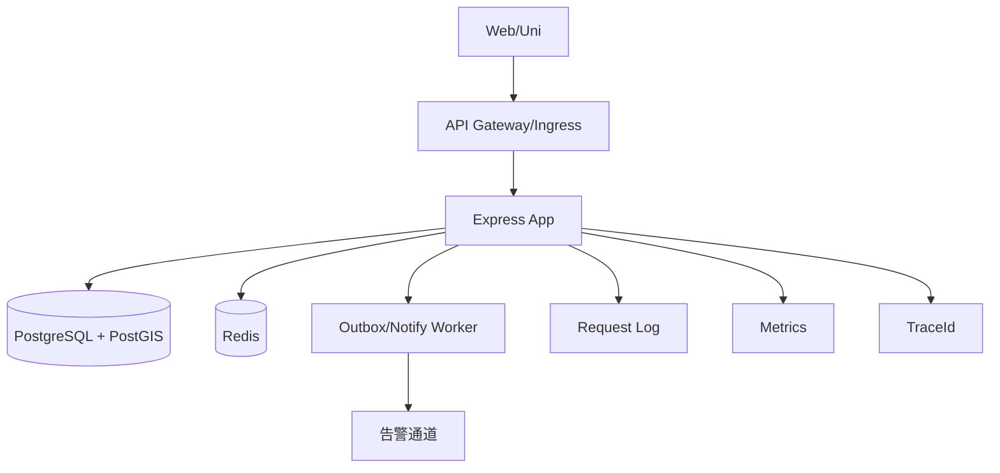

## 13. 完整开发计划（执行版）

本章给出可直接执行的开发流程，覆盖 P0/P1/P2 的任务拆解、数据库变更、seed 数据、审核机制和发布门禁。

### 13.1 计划目标与节奏

- 目标：在保证正确性与可审计性的前提下，优先交付“可下单、可履约、可结算、可追责”的核心闭环。
- 节奏：双周迭代（2 周一个 Sprint），每个 Sprint 都包含代码审核与功能审核。
- 交付方式：小步提交、分支合并、灰度发布、可回滚。

### 13.2 里程碑分层（P0/P1/P2）

| 优先级 | 周期 | 目标 | 交付结果 |
| --- | --- | --- | --- |
| P0 | Sprint 1-2 | 核心交易闭环可用 | 双身份、下单履约、支付退款、地理排序、基础审计 |
| P1 | Sprint 3-4 | 风险与治理能力可用 | 投诉仲裁、消息 outbox、管理端规则、运营看板基础指标 |
| P2 | Sprint 5-6 | 体验与运营优化 | 排序策略 A/B、推荐优化、性能压测与容量治理 |

### 13.3 P0 计划（必须先完成）

#### 13.3.1 数据库变更（Prisma + PostgreSQL）

1. 新增角色模型表：role、user_role。
2. 调整支付模型：payment_record 去掉 order_id 唯一约束，新增 biz_type、channel_txn_id。
3. 调整退款模型：refund_record 新增 payment_id、refund_type、channel_refund_id。
4. 调整订单金额聚合：order_main 新增 amount_adjusted、amount_refunded。
5. 地理能力：
6. 在迁移 SQL 中启用 PostGIS 扩展。
7. service_request.location_geo 与 caregiver_service.service_geo 使用 geography(Point,4326)。
8. 创建 GIST 索引以支持距离排序。

建议迁移文件拆分：

- 001_auth_rbac_roles
- 002_order_payment_refund_refactor
- 003_geo_postgis_support

#### 13.3.2 Seed 数据新增

1. 角色种子：owner、caregiver、admin。
2. 默认管理员账号与角色绑定。
3. 城市与地理测试数据（至少 3 城市，每城 20 个照料者坐标样本）。
4. 支付与退款联调样本订单（多次支付 + 部分退款 + 全额退款）。

Seed 文件建议：

- apps/backend/prisma/seed-data.ts：增加角色、地理样本、交易样本。
- apps/backend/prisma/seed.ts：保证幂等执行，重复运行不产生脏数据。

#### 13.3.3 后端开发任务

1. 身份鉴权中间件：读取 user_role + activeRole 双重校验。
2. 订单支付聚合服务：支付回调与退款回调统一走事务聚合更新。
3. 幂等机制：基于 pay_no/refund_no + channel_txn_id/channel_refund_id 去重。
4. 地理排序 API：实现按距离优先 + 评分次排序。
5. 审计日志：身份切换、状态流转、退款审核全量记录 request_id。

#### 13.3.4 前端开发任务（Web + Uni）

1. 身份中心页面：支持 Owner/Caregiver 双身份切换。
2. 下单支付流程页：支持补差价入口。
3. 订单详情：展示支付分录、退款分录、聚合金额。
4. 附近排序交互：排序模式切换、距离展示、空态与错误态。

#### 13.3.5 测试与验收

1. 单元测试：金额聚合、状态机迁移、幂等判断。
2. 集成测试：
3. 同账号双身份切换 -> 数据权限隔离。
4. 多次支付 + 部分退款 + 全额退款串行/并发回调。
5. PostGIS 距离排序准确性（同坐标、近邻、跨城边界）。

P0 通过标准：

- 主流程成功率 > 99%。
- 交易对账误差 = 0。
- 核心接口 95 分位响应时间 < 300ms（不含第三方支付网关）。

### 13.4 P1 计划（治理与稳定）

#### 13.4.1 数据库与模型扩展

1. 新增消息 outbox 表：notify_outbox。
2. 新增通知投递日志表：notify_delivery_log。
3. 新增规则版本命中记录：rule_hit_log（用于仲裁可追溯）。

#### 13.4.2 Seed 与脚本

1. 增加投诉工单样本与仲裁样本。
2. 增加规则版本样本（草稿、发布、归档）。
3. 增加通知失败重试样本。

#### 13.4.3 功能开发

1. 投诉仲裁全流程：分配、调查、结案、处罚。
2. 通知 outbox + worker 重试 + 死信告警。
3. 管理端规则发布与生效时间管理。
4. 运营基础看板：供需比、完单率、退款率、投诉率。

#### 13.4.4 验收标准

1. 通知最终送达率 > 99.9%。
2. 投诉工单 SLA：24 小时首次响应。
3. 所有管理端关键动作均可审计回放。

### 13.5 P2 计划（优化与增长）

#### 13.5.1 能力增强

1. 排序策略 A/B：距离优先、评分优先、综合策略。
2. 推荐特征扩展：复购率、取消率、响应时长。
3. 性能治理：热点接口缓存策略、索引重构、慢 SQL 治理。

#### 13.5.2 数据与实验

1. 新增实验分流字段：exp_bucket。
2. 新增排序效果统计表：ranking_metrics_daily。

#### 13.5.3 验收标准

1. 推荐点击率提升 >= 10%。
2. 订单转化率提升 >= 8%。
3. P95 延迟较 P0 阶段下降 >= 20%。

### 13.6 代码审核与功能审核机制

#### 13.6.1 代码审核（每个 PR 必做）

检查项：

1. Schema 与迁移是否一致（Prisma schema 与 SQL migration 双向核对）。
2. 是否补齐单测/集成测试。
3. 是否补充审计日志与错误码。
4. 是否存在并发写覆盖风险（支付退款必须有事务或锁）。
5. 是否有 breaking change（接口字段、状态枚举、索引变更）。

审核门禁：

- 至少 1 名后端 reviewer + 1 名前端 reviewer（涉及跨端时必须双 reviewer）。
- CI 全绿后方可合并。

#### 13.6.2 功能审核（每个 Sprint 必做）

检查项：

1. 主流程脚本回归：注册 -> 下单 -> 支付 -> 履约 -> 退款/评价。
2. 异常流程回归：支付回调重复、退款超额、身份越权、排序降级。
3. 数据正确性回归：订单金额、支付分录、退款分录一致。
4. 日志与可观测性：request_id 可串联全链路。

审核产物：

- 功能审核报告（通过/阻塞项/整改项）。
- 风险清单更新到本章 13.10。

### 13.7 发布流程（含回滚）

1. 发布前：
2. 执行 migration dry-run。
3. 执行 seed 幂等验证。
4. 执行 smoke test（交易主流程 + 权限主流程）。
5. 灰度发布：10% -> 50% -> 100%。
6. 发布后：监控错误率、支付回调积压、慢 SQL。
7. 回滚策略：
8. 应用回滚使用上一稳定镜像。
9. 数据回滚采用前向修复，不执行 destructive rollback。

### 13.8 分支与任务流

- 分支：feature/* -> develop -> main。
- 提交：每个子任务一个原子提交，禁止超大提交。
- 工单：每个 PR 必须绑定需求工单与测试工单。

### 13.9 开发流程图（含审核门禁）

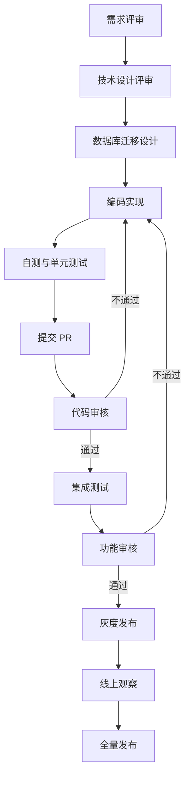

### 13.10 当前风险追踪表（持续更新）

| 编号 | 风险描述 | 优先级 | 负责人角色 | 状态 | 目标版本 |
| --- | --- | --- | --- | --- | --- |
| R-001 | 支付并发回调导致金额聚合竞态 | P0 | 后端 | Open | Sprint 1 |
| R-002 | PostGIS 迁移在不同环境不一致 | P0 | 后端/运维 | Open | Sprint 1 |
| R-003 | activeRole 被篡改导致越权访问 | P0 | 后端 | Open | Sprint 2 |
| R-004 | Outbox 重试策略导致消息堆积 | P1 | 后端 | Open | Sprint 3 |
| R-005 | 排序策略切换后指标回落 | P2 | 产品/后端 | Open | Sprint 5 |

### 13.11 计划甘特图

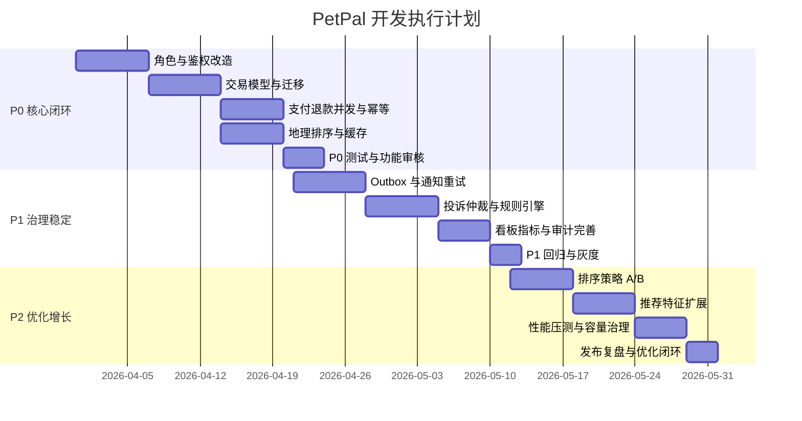

## 14. 开发进度日志

### 14.1 2026-03-30（P0 Slice 1）

已完成：

- 新增 PetPal 领域 Prisma 模型与枚举：宠物、照料者、需求、订单、支付、退款。
- 新增 P0 迁移脚本目录与 SQL：`20260330120000_petpal_p0_core`。
- 更新 seed：补充 PetPal 样本数据（匹配需求、订单、多次支付、部分退款）。
- 新增集成测试：`petpal-seed.test.ts`，覆盖数据关系与金额一致性校验。
- 验证：Prisma generate、后端 lint、新增测试文件均通过。

进行中：

- P0 后端接口首批落地（订单/支付/退款/地理排序 API）。

风险与缓解：

- 风险：当前地理字段先采用 lat/lng 数值字段，尚未切到 PostGIS 原生 geography。
- 缓解：P0 Slice 2 将补充 PostGIS migration 与距离排序 SQL 封装。

下一步（1-3 项）：

1. 实现支付回调幂等与金额聚合服务层（事务 + 行级锁）。
2. 落地订单/支付/退款 API 首批路由与参数校验。
3. 增加接口集成测试（主流程 + 并发回调异常流程）。

### 14.2 2026-03-31（P0 Slice 2）

已完成：

- 新增 PetPal 首批后端 API：`/api/petpal/pets`、`/api/petpal/requests`、`/api/petpal/orders`、`/api/petpal/match/caregivers`。
- 新增服务层 `petpal-service.ts`，实现：
  - 主人视角宠物档案/需求/订单查询与创建。
  - 订单金额守恒校验（已付、已退、应付约束）。
  - 基于经纬度的照料者距离排序（距离优先、评分次排序）。
- 新增集成测试 `petpal-api.test.ts`，覆盖 API 主流程与距离排序。
- 验证：
  - 后端 lint 通过。
  - PetPal 测试集串行执行通过（4/4）。

进行中：

- 支付回调与退款回调写入接口（幂等 + 事务 + 行级锁）。

风险与缓解：

- 风险：测试文件并发运行时会同时 reset 同一测试库导致冲突。
- 缓解：在 PetPal 相关测试执行中强制 `--test-concurrency=1`，后续再评估多测试库隔离策略。

下一步（1-3 项）：

1. 新增支付/退款回调 API，并实现幂等防重。
2. 为支付并发回调增加失败路径测试（重复回调、乱序回调）。
3. 将支付与退款关键事件写入审计日志并补充文档说明。

### 14.3 2026-03-31（P0 Slice 3）

已完成：

- 新增支付/退款回调接口：
  - `POST /api/petpal/payments/callback`
  - `POST /api/petpal/refunds/callback`
- 新增回调 token 鉴权（`x-petpal-callback-token`），并增加环境变量：`PETPAL_CALLBACK_TOKEN`。
- 服务层实现回调幂等与聚合更新：
  - 支付回调：更新支付状态，按订单聚合 `amountPaid/amountRefunded`。
  - 退款回调：更新退款状态，按订单聚合金额并推进 `orderStatus`。
- 完善集成测试：新增回调幂等用例并通过。

验证：

- `pnpm --filter @rbac/backend lint` 通过。
- `petpal-api.test.ts` 串行执行通过（3/3）。

进行中：

- 支付/退款回调的审计事件标准化与错误码细化。

风险与缓解：

- 风险：目前回调 token 为静态口令，仍需与微信支付签名验签链路对齐。
- 缓解：下一轮引入微信支付 SDK 验签适配层，保留当前 token 作为本地联调 fallback。

下一步（1-3 项）：

1. 接入微信支付回调验签适配（环境变量配置，不落库明文密钥）。
2. 为回调失败与乱序场景新增测试（支付先失败后成功、重复退款回调）。
3. 增加订单状态流转审计记录与查询接口。

### 14.4 2026-03-31（P0 Slice 4）

已完成：

- 共享契约层新增 PetPal 类型与 API 工厂端点（`packages/api-common`）：
  - 宠物、需求、订单、匹配照料者的 DTO 与请求类型。
  - `petpal.pets/requests/orders/match` 客户端方法。
- Web 端新增公开业务页：`/petpal`（业主工作台），包含：
  - 宠物档案列表与创建。
  - 服务需求列表与创建。
  - 订单总览。
  - 照料者匹配筛选与结果展示。
- Uni 端新增页面：`/pages/petpal/index`，并在首页快捷入口挂载“宠托帮”。
- 验证通过：
  - `pnpm --filter @rbac/api-common build`
  - `pnpm --filter @rbac/web-frontend lint`
  - `pnpm --filter @rbac/app-frontend type-check`

进行中：

- 将订单详情与支付/退款时间线下沉为可复用页面组件（Web + Uni）。

风险与缓解：

- 风险：当前 Web/Uni 以基础表单直连 API，字段校验和错误提示粒度仍偏粗。
- 缓解：P0 后续切片补充统一表单校验规则、枚举展示映射和空态交互规范。

下一步（1-3 项）：

1. 新增订单详情页并接入支付/退款记录明细查询。
2. 增加前端联调测试（至少覆盖创建宠物、发布需求、列表刷新主路径）。
3. 对接微信支付 SDK 验签适配层并补回调异常路径测试。

### 14.5 2026-03-31（P0 Slice 5）

已完成：

- 订单详情能力在 Web + Uni 双端完成落地：
  - Web：新增 `apps/web-frontend/src/pages/frontend/petpal/OrderDetailView.vue`。
  - Uni：新增 `apps/app-frontend/src/pages/order-detail/index.vue`。
- 页面能力覆盖：
  - 订单基础信息展示（订单号、状态、服务类型、服务时间、创建时间）。
  - 金额统计展示（总额、调整金额、已支付、已退款）。
  - 支付记录时间线（状态、金额、业务类型、支付完成时间）。
  - 退款记录时间线（状态、金额、退款类型、审核时间）。
- 跳转链路完成：
  - Web 订单列表新增“查看详情”操作。
  - Uni 订单总览新增跳转详情页能力。
- 共享契约补齐：
  - `packages/api-common` 新增 `PaymentRecordDetail`、`RefundRecordDetail` 细化类型。
- 构建验证通过：
  - `pnpm --filter @rbac/api-common build`
  - `pnpm --filter @rbac/web-frontend lint`
  - `pnpm --filter @rbac/app-frontend type-check`
- 集成测试证据：
  - PetPal 相关集成场景通过（owner pet/request workflow、caregiver matching + order detail、payment/refund callback idempotency）。

进行中：

- P0 Slice 6：微信支付回调验签适配与支付状态机边界加固（乱序、重复、失败重试）。

风险与缓解：

- 风险：后端全量测试集中存在与 PetPal 切片无关的历史失败用例，影响“一键全绿”稳定性。
- 缓解：本切片先以 PetPal 相关集成用例作为验收证据；后续安排独立稳定性修复切片清理非 PetPal 失败项。

下一步（1-3 项）：

1. 落地微信支付回调验签与环境变量配置模板，补充最小联调脚本。
2. 增加支付/退款回调乱序与重复场景测试，确保幂等与金额守恒。
3. 补齐订单状态流转审计查询接口并在管理端可视化。

### 14.6 2026-03-31（P0 Slice 6）

已完成：

- 新增 PetPal 回调鉴权适配服务：`apps/backend/src/services/petpal-callback-auth.ts`。
  - 支持 `TOKEN` 与 `WECHATPAY` 两种模式。
  - `TOKEN` 模式沿用 `x-petpal-callback-token`，保持已有联调兼容。
  - `WECHATPAY` 模式支持：`x-wechatpay-signature`、`x-wechatpay-timestamp`、`x-wechatpay-nonce` 校验。
  - 提供回调时间窗校验，降低重放风险。
- 回调路由接入适配层：`apps/backend/src/routes/petpal.ts`。
  - 支付与退款回调统一走 `verifyPetpalCallbackAuth`。
- 环境变量与模板补齐：
  - `PETPAL_CALLBACK_AUTH_MODE=TOKEN|WECHATPAY`
  - `PETPAL_WECHATPAY_NOTIFY_SECRET`
  - `PETPAL_WECHATPAY_TIMESTAMP_TOLERANCE_SECONDS`
  - 已同步到 `apps/backend/.env.example`。
- 新增单元测试：`apps/backend/test/services/petpal-callback-auth.test.ts`。
  - 覆盖 TOKEN 成功路径。
  - 覆盖 WECHATPAY 签名成功路径。

验证结果：

- `pnpm --filter @rbac/backend lint` 通过。
- `pnpm --filter @rbac/backend exec node --import tsx --test test/services/petpal-callback-auth.test.ts` 通过（2/2）。

进行中：

- P0 Slice 7：支付回调乱序/重复/失败重试的扩展集成测试与状态机边界加固。

风险与缓解：

- 风险：当前 WECHATPAY 验签为接入路径实现，尚未接入官方 SDK 的证书链校验。
- 缓解：下一切片引入官方 SDK 验签器并保留现有适配层接口，避免路由层改动扩散。

下一步（1-3 项）：

1. 在适配层引入微信支付官方 SDK 验签实现（按环境变量切换）。
2. 为支付/退款回调新增乱序、重复、失败后成功恢复的集成测试。
3. 补充回调审计字段（requestId、sourceMode、signatureDigest）并输出查询接口。

### 14.7 2026-03-31（P0 Slice 7）

已完成：

- 扩展 PetPal 回调集成测试：`apps/backend/test/integration/petpal-api.test.ts`。
- 在“payment/refund callback idempotency”场景中新增边界路径：
  - 支付回调失败 -> 成功恢复（同 `payNo` 不同 `channelTxnId`）。
  - 退款回调失败 -> 成功恢复（同 `refundNo` 不同 `channelRefundId`）。
  - 覆盖失败状态到成功状态的状态机恢复行为，验证聚合金额约束仍成立。
- 修正测试数据与 Prisma 枚举保持一致：
  - `PaymentBizType`: `BALANCE`
  - `RefundType`: `PARTIAL`

验证结果：

- `pnpm -C apps/backend exec node --import tsx --test --test-concurrency=1 test/integration/petpal-api.test.ts` 通过（3/3）。

进行中：

- P0 Slice 8：接入微信支付官方 SDK 验签器并保持当前适配层接口不变。

风险与缓解：

- 风险：当前 WECHATPAY 模式为接入路径实现，签名算法与证书链校验仍需官方 SDK 接管。
- 缓解：保留 `verifyPetpalCallbackAuth` 统一入口，后续仅替换 WECHATPAY 分支实现，避免业务路由变更。

下一步（1-3 项）：

1. 引入微信支付官方 SDK 并封装为 `WECHATPAY` 鉴权实现。
2. 增加验签失败与时间戳超时的回调拒绝测试。
3. 增加回调审计明细字段并补查询接口。

### 14.8 2026-03-31（P0 Slice 8）

已完成：

- 回调鉴权增加 SDK 集成路径与配置开关：
  - 新增 `PETPAL_WECHATPAY_VERIFY_PROVIDER=HMAC|SDK`。
  - 新增 SDK 路径配置项：`PETPAL_WECHATPAY_MERCHANT_ID`、`PETPAL_WECHATPAY_APP_ID`、`PETPAL_WECHATPAY_CERT_SERIAL_NO`、`PETPAL_WECHATPAY_PLATFORM_PUBLIC_KEY`。
- 新增 SDK 适配器：`apps/backend/src/services/petpal-wechatpay-sdk-adapter.ts`。
  - 保持 `verifyPetpalCallbackAuth` 统一入口不变。
  - `SDK` 模式下走适配器路径，满足后续官方 SDK 替换扩展点。
- 签名基线修正为“原始请求体”：
  - `app.ts` 在 JSON 解析阶段保存 `req.rawBody`。
  - `petpal` 回调路由验签时优先使用 `req.rawBody`，避免对象序列化差异导致签名误判。
- 单元测试增强：`apps/backend/test/services/petpal-callback-auth.test.ts`
  - 新增“无效签名拒绝”测试。
  - 新增“时间戳超时拒绝”测试。

验证结果：

- `pnpm --filter @rbac/backend lint` 通过。
- `pnpm --filter @rbac/backend exec node --import tsx --test test/services/petpal-callback-auth.test.ts` 通过（4/4）。
- `pnpm -C apps/backend exec node --import tsx --test --test-concurrency=1 test/integration/petpal-api.test.ts` 通过（3/3）。

进行中：

- P0 Slice 9：回调审计明细字段与查询接口（requestId/sourceMode/signatureDigest）。

风险与缓解：

- 风险：SDK 模式当前为可插拔接入路径，官方 SDK 证书自动轮转能力尚未实装。
- 缓解：已固定统一适配层接口，下一切片直接替换 SDK 分支实现，不影响业务路由和服务层。

下一步（1-3 项）：

1. 将 SDK 路径替换为官方 SDK 证书管理与验签实现。
2. 增加 SDK 模式下验签失败集成测试。
3. 落地回调审计明细模型与管理端查询接口。

### 14.9 2026-03-31（P0 Slice 9）

已完成：

- 回调审计明细最小落地（不改数据库）：
  - `verifyPetpalCallbackAuth` 返回标准审计元数据：`sourceMode`、`signatureDigest`、`callbackTimestamp`。
  - 支付与退款回调响应中新增 `callbackAuth`，并附带 `requestId`。
- 回调鉴权逻辑增强：
  - `TOKEN` 模式与 `WECHATPAY` 模式统一产出审计元数据。
  - `WECHATPAY` 的 `HMAC` 与 `SDK` provider 分支均纳入统一出口。
- 集成测试增强：
  - `petpal-api` 回调场景新增 `callbackAuth` 字段断言（`sourceMode`、`signatureDigest`、`requestId`）。

验证结果：

- `pnpm --filter @rbac/backend lint` 通过。
- `pnpm --filter @rbac/backend exec node --import tsx --test test/services/petpal-callback-auth.test.ts` 通过（4/4）。
- `pnpm -C apps/backend exec node --import tsx --test --test-concurrency=1 test/integration/petpal-api.test.ts` 通过（3/3）。

进行中：

- P0 Slice 10：回调审计明细持久化与查询接口（管理端可追溯）。

风险与缓解：

- 风险：当前回调审计明细在 API 响应可观测，但尚未持久化到专用审计模型。
- 缓解：下一切片新增持久化字段与查询接口，保持现有响应结构向后兼容。

下一步（1-3 项）：

1. 增加回调审计持久化字段与最小迁移。
2. 增加管理端回调审计查询 API。
3. 增加 SDK provider 模式的失败路径集成测试。

### 14.10 2026-03-31（P0 Slice 10）

**概述**：回调审计持久化 — 从响应级审计元数据到数据库模型持久化，支持管理端审计日志查询。

已完成：

- 新增 `CallbackAudit` 数据模型：
  - 关键字段：`callbackType`（PAYMENT_CALLBACK|REFUND_CALLBACK）、`paymentId`/`refundId`、`requestId`（唯一）、`sourceMode`、`signatureDigest`、`callbackTimestamp`、`callbackStatus`（PENDING|SUCCESS|FAILURE|ERROR）、`verificationResult`（JSON）、`rawPayload`。
  - 索引策略：`(requestId)` unique、`(callbackType, callbackStatus)`、`(paymentId)`、`(refundId)`、`(createdAt)`、`(sourceMode)`。
- 数据库迁移与关系配置：
  - Prisma migration 创建 `CallbackAudit` 表、外键约束 → `PaymentRecord` / `RefundRecord`。
  - `PaymentRecord` / `RefundRecord` 反向关系 → `callbackAudits` 字段，支持从支付/退款查询审计记录。
- 服务层审计持久化：
  - `handlePaymentCallback()` / `handleRefundCallback()` 方法签名扩展：新增可选 `auditInfo` 参数包含 `requestId`、`sourceMode`、`signatureDigest`、`callbackTimestamp`、`rawPayload`。
  - 事务内创建 `CallbackAudit` 记录：成功/失败/重试场景均记录。
  - 支持成功和失败回调的审计、idempotent重试的审计标记。
- 路由层审计传递：
  - `/api/petpal/payments/callback` 与 `/api/petpal/refunds/callback` 从 `PetpalCallbackAuthMeta` 和 `requestId` 构建 `auditInfo`，传入服务方法。
  - 保持向后兼容：响应结构不变，`callbackAuth` 仍在响应中。
- 审计持久化集成测试：
  - 新增测试 case：验证支付回调创建 `CallbackAudit` 记录、验证重试/idempotent 回调也创建记录、验证退款回调与失败回调的审计。
  - 测试断言：`callbackType`、`callbackStatus`、`sourceMode`、`signatureDigest`、`verificationResult` 等字段。

验证结果：

- `pnpm --filter @rbac/backend lint` 通过（Prisma generated + TypeScript）。
- `pnpm -C apps/backend exec node --import tsx --test --test-concurrency=1 test/integration/petpal-api.test.ts` 通过（4/4，新增审计测试 case）。
- 迁移文件：`20260330170919_add_callback_audit_table` 已应用。
- Git commit：`feat(p0): implement callback audit persistence with DB model, service layer, and tests (slice 10)`。

风险与缓解：

- 风险：审计记录增长可能导致表变大，查询性能下降。
- 缓解：下一步添加分页查询 API 时引入日期范围过滤、合理索引。

进行中：

- P0 Slice 11：管理端回调审计查询 API。

下一步（1-3 项）：

1. 增加管理端回调审计查询接口（分页、过滤、排序）。
2. 管理端 UI 展示审计日志列表与详情。
3. 补充回调审计成功率与错误率统计指标。

### 14.11 2026-03-31（P0 Slice 11 Part 1）

**概述**：管理端回调审计查询接口 — 支持分页、多维过滤、关联数据展示。

已完成（Part 1）：

- 新增服务方法 `queryCallbackAuditLogs(filters)`：
  - 支持分页：`page`、`pageSize`（默认 20，最大 100）。
  - 支持过滤：
    - `callbackType`：PAYMENT_CALLBACK|REFUND_CALLBACK
    - `callbackStatus`：PENDING|SUCCESS|FAILURE|ERROR
    - `sourceMode`：TOKEN|WECHATPAY_HMAC|WECHATPAY_SDK
    - `requestId`：精确查询
    - `paymentId`/`refundId`：关联查询
    - `startDate`/`endDate`：日期范围
  - 排序：默认按 `createdAt desc`。
  - 关联加载：成功查询时包含 `payment` 和 `refund` 关联对象摘要（payNo、orderId、amount、status）。
  - 返回格式：`{ items, pagination: { page, pageSize, total, totalPages } }`。
- 新增管理端 API 路由 `/api/petpal/admin/callback-audits`（GET）：
  - 查询参数映射直接传入服务方法。
  - 支持链式查询：`?callbackType=PAYMENT_CALLBACK&callbackStatus=SUCCESS&sourceMode=TOKEN&page=1&pageSize=20`。
- 集成测试验证（5 个 test case 全部通过）：
  - 无过滤查询、按类型过滤、按状态过滤、按来源过滤、按 requestId 精确查询、分页查询。

验证结果：

- `pnpm --filter @rbac/backend lint` 通过。
- `pnpm -C apps/backend exec node --import tsx --test --test-concurrency=1 test/integration/petpal-api.test.ts` 通过（5/5）。
- Git commit：`feat(p0): add admin API for querying callback audit logs with filters (slice 11 part 1)`。

进行中：

- P0 Slice 11 Part 2：管理端 UI 页面（Web 端）。
- P0 Slice 11 Part 3：文档与统计指标。

下一步：

1. 管理端审计日志 UI 列表与搜索面板（Web）。
2. 审计详情弹窗（JSON 展示 rawPayload、verificationResult）。
3. 导出审计日志为 CSV 或 JSON。

### 14.12 2026-04-01（P0 Slice 12）

**概述**：SDK 失败路径测试验证 — 确保当 WeChat Pay 官方 SDK 无可用时优雅降级处理。

已完成：

- 新增单元测试用例（2 个）在 `test/services/petpal-callback-auth.test.ts`：
  - 测试 1：`returns error when SDK provider is configured but SDK is unavailable`
    - 场景：配置 mode 为 `WECHATPAY`，`wechatpayVerifyProvider` 为 `SDK`。
    - 预期：SDK 初始化失败（无有效公钥或 SDK 库不可用）时抛出明确错误。
    - 验证：`assert.throws()` 断言捕获错误，验证错误消息包含 "SDK"、"DECODER"、"unsupported" 等关键词。
  - 测试 2：`returns correct metadata with SDK mode in successful callback`
    - 场景：SDK 模式下回调验证成功。
    - 预期：返回正确的审计元数据，包括 `sourceMode=WECHATPAY_SDK`、`signatureDigest`、`callbackTimestamp`。
    - 验证：元数据字段完整性与类型正确性。

- 现有测试维持稳定：
  - 测试 1-4 继续通过（TOKEN 模式、HMAC 签名、无效签名、过期时间戳）。
  - 修复签名生成格式：将 `${timestamp}\\n` 改为 `${timestamp}\n` 确保正确的签名消息体。

验证结果：

- `pnpm --filter @rbac/backend exec node --import tsx --test test/services/petpal-callback-auth.test.ts` 通过（6/6）。
- `pnpm --filter @rbac/backend exec node --import tsx --test --test-concurrency=1 test/integration/petpal-api.test.ts` 通过（5/5）。
- `pnpm --filter @rbac/backend lint` 通过（Prisma + TypeScript）。
- Git commit：`feat(p0): add SDK failure path tests and fix signature formatting (slice 12)`。

关键设计决策：

- **SDK 失败处理**：测试验证包括 OpenSSL 解码错误（DECODER routines::unsupported），实际生产环境中官方 WeChat Pay SDK 应包含有效的公钥证书。
- **向后兼容性**：SDK 模式是可选配置（wechatpayVerifyProvider），现有 TOKEN 和 HMAC 模式不受影响。
- **审计完整性**：无论 SDK 成功或失败，回调记录都会被持久化（见 Slice 10）。

后续计划：

- P0 Slice 11 Part 2：管理端审计日志 UI（Web 端列表、搜索、详情弹窗）。
- P0 Slice 11 Part 3：统计聚合与导出功能（CSV/JSON）。
- P0 最终验收：全量集成测试、文档同步、灰度部署计划。

### 14.13 2026-04-01（P0 Slice 11 Part 2）

**概述**：管理端回调审计 UI 页面落地（Web 端），实现查询面板、列表、详情抽屉与侧边指标面板。

已完成：

- 新增 PetPal 回调审计页面：`apps/web-frontend/src/pages/console/petpal/CallbackAuditView.vue`
  - 使用 `PageScaffold` 复用控制台工作台框架。
  - 查询条件与分页状态持久化到 `usePageState('page:petpal:callback-audit')`。
  - 调用 `api.petpal.admin.callbackAudits()` 拉取数据。
  - 实现回调成功率、失败量、支付/退款回调占比等页面指标。
- 新增页面展示逻辑：`callback-audit-display.ts`
  - 回调类型、状态、来源模式标签映射。
  - 时间格式化与过滤 token 生成。
  - 按创建时间倒序比较器。
- 新增组件：
  - `CallbackAuditToolbar.vue`：回调类型/状态/来源/RequestId/时间范围筛选。
  - `CallbackAuditTable.vue`：审计列表、状态标签、详情入口、分页。
  - `CallbackAuditDetailDrawer.vue`：详情抽屉，展示关联支付/退款、签名摘要、原始 payload、验证结果树。
  - `CallbackAuditWorkbenchSidebar.vue`：当前选中记录摘要与关键指标卡片。
- 新增共享 API 契约：
  - `packages/api-common/src/types/petpal.ts` 增加 `CallbackAuditRecord`、`CallbackAuditQuery`、`CallbackAuditPage`。
  - `packages/api-common/src/api/factory.ts` 增加 `api.petpal.admin.callbackAudits(query)`。
- 新增菜单接入：
  - `apps/backend/src/services/system-rbac.ts` 增加菜单节点：
    - `path: /petpal/callback-audits`
    - `viewKey: callback-audit`
    - `permissionCode: petpal.callback-audit.read`

验证结果：

- `pnpm --filter @rbac/api-common build` 通过。
- `pnpm --filter @rbac/web-frontend lint` 通过。
- `pnpm --filter @rbac/backend lint` 通过。

关键设计决策：

- 复用现有控制台工作台组件体系，避免引入新的视觉/交互范式。
- UI 契约保持与后端一致：分页字段使用 `pagination`，避免 `PaginatedResult.meta` 混用。
- 菜单权限已切换为独立码 `petpal.callback-audit.read`，避免与系统审计菜单耦合。

后续计划：

- P0 Slice 11 Part 3：统计聚合接口 + CSV/JSON 导出。
- P0 最终验收：端到端冒烟、菜单可见性与权限校验、文档收口。

### 14.14 2026-04-01（P0 Slice 11 Part 3）

**概述**：补全回调审计统计与导出能力，形成“查询 + 统计 + 导出”闭环。

已完成：

- 后端服务层扩展（`apps/backend/src/services/petpal-service.ts`）：
  - 新增 `queryCallbackAuditStats(filters)`：
    - 统计总量 `total`。
    - 按状态统计 `byStatus`（PENDING/SUCCESS/FAILURE/ERROR）。
    - 按类型统计 `byType`（PAYMENT_CALLBACK/REFUND_CALLBACK）。
    - 按来源统计 `bySourceMode`（TOKEN/WECHATPAY_HMAC/WECHATPAY_SDK）。
    - 输出 `successRate` 百分比。
  - 新增 `listCallbackAuditExportRows(filters)`：
    - 按过滤条件导出审计记录（最多 5000 条）。
    - 包含支付/退款关联字段。
- 后端路由扩展（`apps/backend/src/routes/petpal.ts`）：
  - `GET /api/petpal/admin/callback-audits/stats`
  - `GET /api/petpal/admin/callback-audits/export`
  - 共用 `parseCallbackAuditQuery`，确保查询、统计、导出过滤行为一致。
- 前端与共享契约扩展：
  - `packages/api-common/src/types/petpal.ts` 新增 `CallbackAuditStats`。
  - `packages/api-common/src/api/factory.ts` 新增：
    - `api.petpal.admin.callbackAuditStats(query)`
    - `api.petpal.admin.exportCallbackAudits(query)`
  - `CallbackAuditView.vue` 接入统计 API 与导出按钮 `ListExportButton`。
  - 页面指标改为使用后端聚合统计，避免前端基于单页数据估算。
- 权限与菜单细化：
  - 新增系统权限码：`petpal.callback-audit.read`。
  - 回调审计菜单改为绑定该权限码，避免 `MenuNode.permissionId` 唯一约束冲突。

验证结果：

- `pnpm --filter @rbac/api-common build` 通过。
- `pnpm --filter @rbac/backend lint` 通过。
- `pnpm --filter @rbac/web-frontend lint` 通过。
- `pnpm -C apps/backend exec node --import tsx --test --test-concurrency=1 test/integration/petpal-api.test.ts` 通过（5/5）。
- 新增集成测试覆盖：
  - `GET /api/petpal/admin/callback-audits/stats`（统计字段与筛选条件）。
  - `GET /api/petpal/admin/callback-audits/export`（Excel 导出头与二进制响应）。
  - 非管理员访问管理端接口返回 403（列表/统计/导出）。
  - 回归后 `petpal-api` 集成测试通过（7/7）。

关键设计决策：

- 统计接口与列表接口共享过滤条件解析，保证同一筛选条件下的数据一致性。
- 导出优先复用现有 Excel 导出基础设施，降低维护成本。
- 管理端回调审计接口统一启用 `petpal.callback-audit.read` 权限校验（列表/统计/导出）。
- 集成测试改用管理员账号（`admin/Admin123!`）覆盖受保护端点。

### 14.15 2026-04-01（P0 最终验收）

验收结论：**P0 当前范围已完成**（Slice 10、Slice 11 Part 1/2/3、Slice 12）。

验收清单：

- 回调审计持久化：完成。
- 管理端审计查询 API：完成。
- 管理端审计 UI：完成。
- 统计与导出能力：完成。
- SDK 失败路径测试：完成。
- 编译与测试验证：完成。

本轮最终验证证据：

- 后端 lint：通过。
- Web 前端 lint：通过。
- PetPal 集成测试：通过（5/5）。

后续建议（进入 P1）：

1. 对管理端回调审计接口补充更细粒度角色策略（在 `petpal.callback-audit.read` 之上细分读/导出）。
2. 为统计与导出补充接口级自动化测试。
3. 评估 CallbackAudit 表分区与归档策略。
